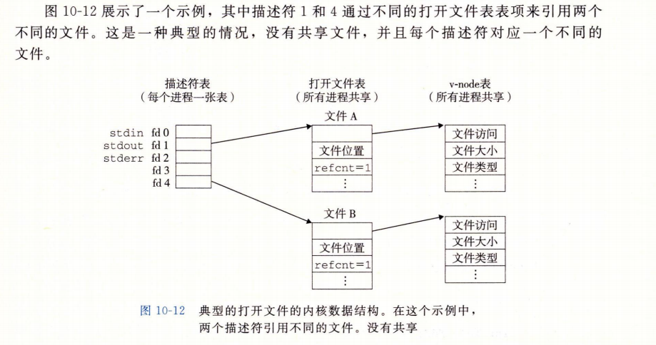
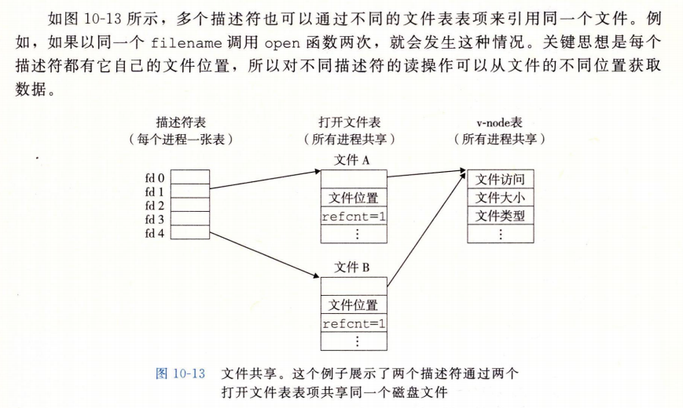
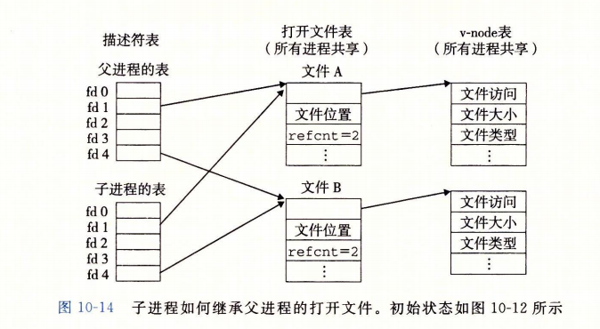
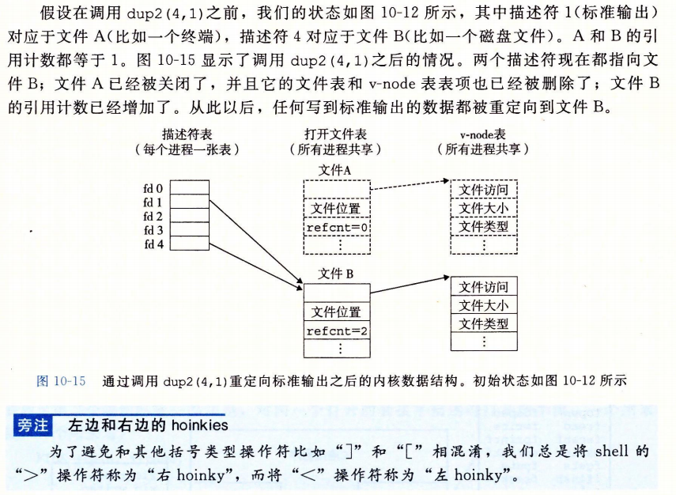
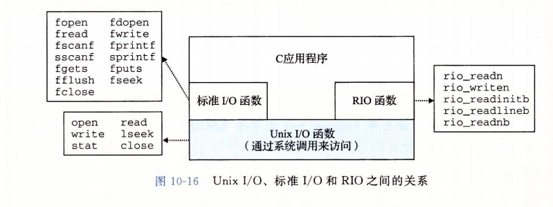

所有语言运行时系统都提供执行 I/O 的较高级别的工具。例如 ANSI C 提供标准I/O库，包含 printf、scanf 这种带缓冲区的 I/O 函数。C++ 用重载操作符 <<、>> 提供类似功能。Linux 系统中，是通过使用由内核提供的系统级 Unix I/O 函数来是写这些较高级别的 I/O 函数的。大多数时候高级别的 I/O 函数工作良好，没有必要直接使用 Unix I/O。学习 Unix I/O 主要目的：

* 理解操作系统概念，I/O 与进程、存储器、链接和加载、虚拟内存等循环依赖，了解 I/O 能帮助我们更深入理解其他系统模块。
* 有时没有选择：例如标准 I/O 库没有提供读取文件元数据的方式，无法获取文件大小或文件创建时间。在网络编程时 I/O 库还存在一些问题。


## Unix I/O

一个 Linux 文件就是一个 m 字节的序列：
$$
B_0, B_1, ..., B_k, ..., b_{m-1}
$$


所有的 I/O 设备（例如网络、磁盘和终端）都被模型化为文件，而所有的输入和输出都被当做对应文件的读和写来执行。这种将设备映射为文件的方式，允许 Linux 内核引出一个简单、低级的应用接口，称为 Unix I/O，所有的输入和输出都能以一种统一且一致的方式来执行：

* 打开文件。一个应用程序通过要求内核打开相应的文件，来宣告它想要访问一个 I/O 设备。内核返回一个小的非负整数，叫做描述符，它在后续对此文件的所有操作中标识这个文件。内核记录有关这个打开文件的所有信息，应用程序只需要记住这个描述符。

* 文件描述符：Linux shell 创建的每个进程开始时都有三个打开的文件，

  * 标准输入，fd为0

  * 标准输出，fd为1

  * 标准错误，fd为2

  * 头文件 `<unistd.h>` 定义了常量 `STDIN_FILENO`、`STDOUT_FILENO`、`STDERR_FILENO`，它们可以用来替代显式的描述符值 

  * ```c
    /* Standard file descriptors.  */
    #define	STDIN_FILENO	0	/* Standard input.  */
    #define	STDOUT_FILENO	1	/* Standard output.  */
    #define	STDERR_FILENO	2	/* Standard error output.  */
    ```

* 改变当前文件的位置。对于每个打开的文件，内核保持着一个文件位置 k。初始为 0。这个文件位置是从文件开头起始的字节偏移量。应用程序能够通过执行 seek 操作，显式地设置文件地当前位置为 k。

* 读写文件。

  * 一个读操作就是从文件复制 $n\gt0$ 个字节到内存，从当前位置 k 开始，然后将 k 增加到 $k + n$ 。给定一个大小为 m 字节地文件，当 $k\ge m$ 时执行读操作会触发与i个称为 end-of-file(EOF) 的条件，应用程序能检测到这个条件。在文件结尾处并没有明确的“EOF符号”。
  * 一个写操作就是从内存复制 $n\gt 0$ 个字节到一个文件，从当前文件位置 k 开始，然后更新 k。

* 关闭文件。当应用完成了对文件的访问之后，它就通知内核关闭这个文件。作为响应，内核释放文件打开时创建的数据结构，并将这个文件描述符恢复到可用的描述符池中。无论一个进程因为何种原因终止，内核都会关闭所有打开的文件并释放它们的内存资源。


## 文件

每个 Linux 文件都有一个类型(type)来表明它在系统中的角色：

* 普通文件(regular file)包含任意数据。
  * 应用程序通常要区分文本文件(text file)和二进制文件(binary file)
  * 文本文件是只含有 ASCII 或 Unicode 字符的普通文件
  * 二进制文件是所有其他的文件。
  * 对内核而言文本文件和二进制文件没有区别
  * Linux 文本文件包含了一个文本行(text line)序列，其中每一行都是一个字符序列，以一个新行符`\n`结束。新行符与 ASCII 的换行符 `LF` 是一样的，其数字值为 `0x0a`。
* 目录(directory)：包含一组链接(link)的文件，其中每个链接都将一个文件名(filename)映射到一个文件，这个文件可能是另一个目录。
  * 每个目录至少含有两个条目
    * `.` 是到该目录自身的链接
    * `..` 是到目录层次结构中父目录(parent directory) 的链接
  * 可以用 mkdir 命令创建一个目录，用 ls 查看内容，用 rmdir 删除目录
* 套接字(socket)：用来与另一个进程进行跨网络通信的文件
* 命名通道(named pipe)
* 符号链接(symbolic link)
* 字符和块设备(character and block device)


Linux 将所有文件组织成一个目录层次结构(directory hierarchy)，由名为`/`的根目录确定。每个文件都是根目录的直接或间接的后代。  

每个进程都有一个当前工作目录(current working directory)，来确定其在目录层次结构中的当前位置。可以用 cd 命令修改shell中的当前目录。  

目录层次结构中的位置用路径名(pathname)来指定，分为绝对路径和相对路径两种。


## 打开和关闭文件

进程是通过调用 open 函数来打开一个已存在的文件或者创建一个新文件的：

```c
#include <sys/types.h>
#include <sys/stat.h>
#include <fcntl.h>

int open(char *filename, int flags, mode_t mode);
```

若成功则返回新文件描述符，若出错返回 `-1`。  

open 函数将 filename 转换为一个文件描述符，并且返回描述符数字。返回的描述符总是在进程中当前没有打开的最小描述符。flags 参数指明了进程打算如何访问这个文件：

* O_RDONLY：只读
* O_WRONLY：只写
* O_RDWR：可读可写

例如：

```c
// 只读打开文件 foo.txt
fd = Open("foo.txt", O_RDONLY, 0);
```

flag 参数也可以是一个或者更多为掩码的或，为写提供给一些额外的指示：

* O_CREAT：如果文件不存在就创建一个截断的(truncated)(空)文件
* O_TRUNC：如果文件已经存在，就截断(清空)它
* O_APPEND：每次写操作之前，设置文件位置到文件的结尾处

示例：

```c
// 打开 foo.txt 文件，并在后面追加数据
fd = Open("foo.txt", O_WRONLY|O_APPEND, 0);
```


mode 参数指定了新文件的访问权限位。

| 掩码    | 描述                     |
| ------- | ------------------------ |
| S_IRUSR | 拥有者能够读             |
| S_IWUSR | 拥有者能够写             |
| S_IXUSR | 拥有者能够执行           |
| S_IRGRP | 拥有者所在组成员能够读   |
| S_IWGRP | 拥有者所在组成员能够写   |
| S_IXGRP | 拥有者所在组成员能够执行 |
| S_IROTH | 其它人能够读             |
| S_IWOTH | 其它人能够写             |
| S_IXOTH | 其它人能够执行           |


每个进程都有一个 umask，当进程通过带某个 mode 参数的 open 函数调用来创建一个新文件时，文件的访问权限位被设置为 `mode & ~ umask` 。

示例：

```c

#define DEF_MODE S_IRUSR|S_IWUSR|S_IRGRP|S_IWGRP|S_IROTH|S_IWOTH
#define DEF_UMASK S_IWGRP|S_IWOTH

// 文件的拥有者有读写权限，所有其他的用户都有读权限
umask(DEF_UMASK);
fd = Open("foo.txt", O_CREAT|O_TRUNC|O_WRONLY, DEF_MODE);

```


## 读和写文件

应用程序通过调用 read 和 write 函数来执行输入和输出。

```c
#include <unistd.h>
ssize_t read(int fd, void *buf, size_t n);
		// read函数执行成功返回读的字节数，EOF 返回0，出错返回 -1
ssize_t write(int fd, const void *buf, size_t n);
		// write函数执行成功返回写的字节数，出错返回-1
```

* read 函数从描述符为 fd 的当前文件位置复制最多 n 个字节到内存位置 buf。
* write 函数内存位置 buf 复制最多 n 个字节到描述符 fd 的当前文件位置
* 这里的返回值类型 ssize_t ，在 x86_64 系统中，被定义为 long，是有符号大小，因为出错时必须返回 -1


示例：

```c
// 调用read、write函数，从标准输入按字节复制到标准输出
int main(void){
    char c;
    
    while(Read(STDIN_FILENO, &c, 1) != 0)
        Write(STDOUT_FILENO, &c, 1);
    
    exit(0);
        
}
```


lseek 函数可以修改当前文件的位置。书中没有讲解。

有些情况下，read、write 函数传送的字节比应用程序要求的要少，这些不足值(short count)不表示有错误，可能的原因有：

* 读时遇到 EOF。例如读取一个大小为20字节的文件，我们以50个字节的片进行读取，下一个 read 返回不足值为 20，后面的read 将返回不足值0表示EOF信号
* 从终端读文本行。返回的不足值等于文本行的大小
* 读和写网络套接字(socket)。内部缓冲约束和较长的网络延迟会引起 read 、write 返回不足值。对于 Linux 管道(pipe)调用 read、write时，也有可能出现不足值。

除了 EOF，当读写磁盘文件时，不会遇到不足值。然而，想创建健壮的（可靠的）诸如 Web 服务器一类网络应用，必须反复调用 read 和 write 处理不足值，直到所有需要的字节都传送完毕。  


## 用 RIO 包健壮地读写

RIO(Robust I/O)包，会自动处理上下文中所述的不足值，像网络程序这种容易出现不足值的应用中，RIO包提供方便、健壮、高效的 I/O，包含两类不同的函数：

* 无缓冲的输入输出函数。这些函数直接在内存和文件之间传送数据，没有应用级缓冲。在二进制数据读写到网络、从网络读写二进制数据尤其有用。
* 带缓冲的输入函数。带缓冲的 RIO 输入函数时线程安全的，它在同一个描述符上可以被交错地调用。


### RIO 的无缓冲的输入输出函数

rio_readn 和 rio_writen 函数：

```c
ssize_t rio_readn(int fd, void *usrbuf, size_t n);
ssize_t rio_writen(int fd, void *usrbuf, size_t n);

			// 成功则返回传送地字节数，读遇到 EOF 返回0，出错返回 -1
```

rio_readn 函数从描述符 fd 的当前文件位置最多传送 n 个字节到内存位置 usrbuf。  

rio_writen 函数从位置 usrbuf 传送 n 个字节到描述符 fd。  

如果 rio_readn 和 rio_writen 函数被一个从应用信号处理程序的返回中断，那么每个函数都会手动地重启 read 或 write。


rio_readn：

```c
// fd 是描述符，usrbuf 是内存指针，n 是字节数
ssize_t rio_readn(int fd, void *usrbuf, size_t n){
    size_t nleft = n;
    // 有符号 long 类型，用于记录每次循环读取的数据字节
    ssize_t nread;
    char *bufp = usrbuf;
    
    while (nleft > 0) {
        // 从缓冲区读取，记录返回值，小于 0 表示出错
        if ((nread = read(fd, bufp, nleft)) < 0){
            // EINTR 表示从中断处理程序返回，将 nread 置为 0 不影响 nleft的值
            if (errno == EINTR)
                nread = 0;
            // 表示出错的返回值-1
            else
                return -1;
        }
        // EOF 标识
        else if (nread == 0)
            break;
        
        // nleft 减去此次循环读取的 nread 个字节
        nleft -= nread;
        // 指针向后移动 nread 个字节
        bufp += nread;
        
    }
    // 正常返回，读取的和要求的一样返回0，读取的内容比要求的少返回不足值
    return (n - nleft);
    
}
```


rio_writen：

```c
ssize_t rio_writen(int fd, void *usrbuf, size_t n){
    size_t nleft = n;
    ssize_t nwritten;
    char *bufp = usrbuf;
    
    while (nleft > 0) {
        if ((nwritten = write(fd, bufp, nleft)) <= 0) {
            if (errno == EINTR)
                nwritten = 0;
            else 
                return -1;
        }
        nleft -= nwritten;
        bufp += nwritten;
    }
    
    return n;
}
```


### RIO 的带缓冲的输入函数

如果要计算文本文件中文本行的数量，一种简单的方法是用 read 函数每次读取一个字节从文件传送到用户内存，检查每个字节是否为换行符，但这样效率比较低，每次读取文件的一个字节都要陷入内核。  

一种好的方法是从一个内部__读缓冲区__复制一个文本行，当缓冲区变空时，会自动地调用 read 重新填满缓冲区。书中提供了下面几个函数

```c
void rio_readinitb(rio_t *rp, int fd);

ssize_t rio_readlineb(rio_t *rp, void *usrbuf, size_t maxlen);
ssize_t rio_readnb(rio_t *rp, void *usrbuf, size_t n);
```


示例，cpfile.c 程序：

```c

int main(int argc, char **argv){
    int n;
    // 缓冲区
    rio_t rio;
    char buf[MAXLINE];
    
    // 初始化缓冲区
    Rio_readinitb(&rio, STDIN_FILENO);
    // 使用 Rio_readlineb 函数从标准输入一次读取一行到 buf 缓冲区
    while((n = Rio_readlineb(&rio, buf, MAXLINE)) != 0)
        Rio_writen(STDOUT_FILENO, buf, n);	// 复制缓冲区到标准输出
}
```


读缓冲区结构体格式：

```c
#define RIO_BUFSIZE 8192
typedef struct {
    int rio_fd;		// 结构体的文件描述符
    int rio_cnt;	// 未读的字节数
    char *rio_bufptr;	// 指向下一个未读字节
    char rio_buf[RIO_BUFSIZE];	// 缓冲区
} rio_t;
```

初始化结构体的 rio_readinitb 函数：

```c
// 将一个打开的 fd 和缓冲区联系起来
void rio_readinitb(rio_t *rp, int fd){
    rp->rio_fd = fd;
    rp->rio_cnt = 0;
    rp->rio_bufptr = rp->rio_buf;
}
```


rio_read 函数，是RIO 读程序的核心，Linux read 函数的带缓冲版本：

* rio_read 和 Linux read 函数有同样的语义。
* 出错时返回 -1
* EOF 返回0
* 要求的字节数超过了读缓冲区内未读的字节的数量，返回一个不足值

```c
// 从 rp 文件缓冲区读取 n 个字节到用户内存缓冲区
static ssize_t rio_read(rio_t *rp, char *usrbuf, size_t n){
    int cnt;
    
    // 缓冲区为空
    while (rp->rio_cnt <= 0) {
        // 调用 read 填满缓冲区，赋值返回值给 rp->rio_cnt
        rp->rio_cnt = read(rp->rio_fd, rp->rio_buf,
                          sizeof(rp->rio_buf));
        
        // 如果未读取到数据
        if (rp->rio_cnt < 0) {
            if (errno != EINTR)	// 判断是否被信号终端处理器中断后返回，如果不是则返回 -1
                return -1;
        }
        else if (rp->rio_cnt == 0)		// EOF 标志
            return 0;
        else	// 重置缓冲区指针
            rp->rio_bufptr = rp->rio_buf;
    }
    
    // 将 n和rp->rio_cnt 两个之中较小的一个值赋值给 cnt
    cnt = n;
    if (rp->rio_cnt < n)
        cnt = rp->rio_cnt;
    // 从读缓冲区 rp->rio_bufptr 指针处开始拷贝 cnt 个字节到用户缓冲区 usrbuf
    memcpy(usrbuf, rp->rio_bufptr, cnt);
    // 缓冲区指针向后移动 cnt 字节
    rp->rio_bufptr += cnt;
    // 未读数量减去 cnt 字节
    rp->rio_cnt -= cnt;
    // 返回复制的字节数
    return cnt;
}
```


rio_readlineb 函数：

```c
// 从 rp 文件缓冲区复制一个文本行到内存位置 usrbuf
ssize_t rio_readlineb(rio_t *rp, void *usrbuf, size_t maxlen){
    int n, rc;
    char c, *bufp = usrbuf;
    
    // 循环最多 maxlen-1 次
    for (n = 1; n < maxlen; n++){
        // rc 是从rio_read 函数读取返回的不足值
        // 用 rio_read 函数读取一个字节到 c
        if ((rc = rio_read(rp, &c, 1)) == 1) {
            *bufp++ = c;
            if (c == '\n') {  // 如果是换行符，n+1，跳出循环
                n++;
                break;
            }
        } else if (rc == 0) {		// 结束标志
            if (n == 1)
                return 0;
            else
                break;
        } else
            return -1;
    }
    // 结尾填充 NULL
    *bufp = 0;
    return n-1;
}
```


rio_readnb 函数是 rio_readn 的带缓冲区版本：

```c
// 从 rp 文件缓冲区读取 n 个字节到内存位置 usrbuf
ssize_t rio_readnb(rio_t *rp, void *usrbuf, size_t n){
    size_t nleft = n;
    ssize_t nread;
    char *bufp = usrbuf;
    
    // n 大于0就调用 rio_read 读取 
    while (nleft > 0){
        // nread 是 rio_read 返回的已读取字节数，小于0则出错返回-1
        if ((nread = rio_read(rp, bufp, nleft)) < 0)
            return -1;
        else if (nread == 0)	// EOF 结束标志
            break;
        
        // 减去已读取数量
        nleft -= nread;
        // 指针向后移动 nread 个字节
        bufp += nread;
    }
    // 返回剩余未读取字节数，>=0
    return (n - nleft);
}
```


## 读取文件元数据

stat 和 fstat 函数检索文件的元数据(metadata)。

```c
#include <unistd.h>
#include <sys/stat.h>

int stat(const char *filename, struct stat *buf);
int fstat(int fd, struct stat *buf);
					// 成功返回 0，出错则返回 -1
```

它们都用结构体 stat 类型的指针作为参数，结构体 stat 的数据结构：

```c
struct stat {
    dev_t 			st_dev;		// 设备
    ino_t 			st_ino; 	// inode
    mode_t			st_mode;	// 权限位和文件类型
    nlink_t 		st_nlink;	// 链接的数量
    uid_t 			st_uid;		// 属主id
    gid_t			st_gid;		// 属组id
    dev_t			st_rdev;	// 设备类型
    off_t			st_size;	// 文件大小，单位是字节
    unsigned long 	st_blksize;	// 文件系统的块大小
    unsigned long	st_blocks;	// 块号
    time_t			st_atime;	// 最后访问时间
    time_t			st_mtime;	// 最后修改时间，部分属性的修改不会改变这个值，例如权限位
    time_t			st_ctime;	// 最后修改时间，所有修改都会触发这个时间
};
```

Linux 在 `sys/stat.h` 中定义了宏来确定 `st_mode` 成员的文件类型：

```c
S_ISREG(m);		// 是普通文件？
S_ISDIR(m);		// 是目录文件？
S_ISSOCK(m);	// 是网络套接字？
    
```

示例，statcheck.c 程序：

```c
// 判断传入的文件(参数1)类型和权限
int main (int argc, char **argv){
    struct stat stat;
    char *type, *readok;
    
    Stat(argv[1], &stat);
    
    // 文件类型
    if (S_ISREG(stat.st_mode))
        type = "regular";
    else if (S_ISDIR(stat.st_mode))
        type = "directory";
    else
        type = "other";
    
    // 是否可读
    if ((stat.st_mode & S_IRUSR))
        readok = "yes";
    else
        readok = "no";
    
    printf("type: %s, read: %s\n", type, readok);
    exit(0);
}
```


## 读取目录和内容

readdir 系列函数可以读取目录的内容。  

opendir 通过路径名返回__目录流(directory stream)__的指针，流是对条目有序列表的抽象，这里是指目录项的列表。

```c
#include <sys/types.h>
#include <dirent.h>

DIR *opendir(const char *name);
```


readdir 函数返回指向流 dirp 中下一个目录项的指针，如果没有更多目录项则返回 NULL，如果出错也返回 NULL 并设置errno，因此如果要区分错误和流结束情况，需要检查自调用 readdir 依赖 errno 是否被修改过。

```c
#include <dirent.h>

struct dirent *readdir(DIR *dirp);

```

dirent 目录项结构体形式如下：

```c
struct dirent {
    ino_t 	d_ino;			// inode 号
    char 	d_name[256];	// 文件名
}
```


closedir 函数关闭流并释放其所有资源：

```c
#include <dirent.h>

int closedir(DIR *dirp);
```


示例，readdir 读取目录内容：

```c

int main(int argc, char **argv){
    DIR *streamp;
    struct dirent *dep;
    
    streamp = Opendir(argv[1]);
    
    errno = 0;
    
    // 循环读取目录流中下一项，打印文件名
    while ((dep = readdir(streamp)) != NULL) {
        printf("Found file: %s\n", dep->d_name);
    }
    
    // 检查是否出错
    if (errno != 0)
        unix_error("readdir error");
    
    // 关闭目录流
    Closedir(streamp);
    exit(0);
}
```


## 共享文件

内核用三个相关的数据结构来表示打开的文件：

* 描述符表(descriptor table)。每个进程都有它独立的描述符表，它的表项是由进程打开的文件描述符来索引的。每个打开的描述符表项指向文件表中的一个表项。
* 文件表(file table)。打开文件的集合是由一张文件表来表示的，所有的进程共享这张表。每个文件表的表项组成包括当前的文件位置、引用__计数(reference count)__(当前指向该表项的描述符表项数)，以及一个指向 __v-node表__中对应表项的指针。关闭一个描述符会减少相应的文件表表项中的引用计数。内核不会删除这个文件表项，直到它的引用计数为零。
* v-node表(v-node table)。同文件表一样，所有的进程共享这张 v-node 表。每个表项包含 stat 结构中的大多数信息，包括 st_mode 和 st_size 成员。








父进程 fork 之后，子进程会有一个父进程描述符表的副本，父子进程共享相同的打开文件表集合，因此共享相同的文件位置。在内核删除相应文件表表项之前，父子进程必须都关闭了它们的描述符。




## I/O重定向

Linux shell 提供了 I/O 重定向操作符 `>`、`<` ，可以将磁盘文件和标准输入输出联系起来，例如：

```shell
// 将 ls 的结果重定向到 foo.txt 文件中
linux> ls > foo.txt
```

在程序中想要事项 I/O 重定向可以使用 dup2 函数：  

dup2 复制描述符表表项 oldfd 到描述符表项 newfd，覆盖描述符表表项 newfd 以前的内容，如果 newfd 已经打开了， dup2 会在复制 oldfd 之前关闭 newfd ：

```c
#include <unistd.h>

int dup2(int oldfd, int newfd);
		// 成功返回非负的文件描述符，出错则返回 -1
```




## 标准I/O

C 语言定义了一组高级输入输出函数 ，称为 __标准 I/O __库，是 Unix I/O 较高级别的替代。  

这个库 libc 提供了：

* 打开和关闭文件的函数
  * fopens
  * fclose
* 读和写字符串的函数
  * fgets
  * fputs
* 复杂的格式化的 I/O 函数
  * scanf
  * printf

标准 I/O 库将一个打开的文件模型化为一个流。对于程序员而言，一个流就是一个指向 FILE 类型的结构的指针。每个 ANSI C 程序开始时都有三个打开的流 stdin、stdout、stderr，分别对应于标准输入、标准输出和标准错误：

```c
#include <stdio.h>
extern FILE *stdin;
extern FILE *stdout;
extern FILE *stderr;

```

类型 FILE 的流时对文件描述符和流缓冲区的抽象。流缓冲区的目的和 RIO 读缓冲区的一样：就是使开销较高的 Linux I/O 系统调用的数量尽可能地小。  

例如一个程序反复调用标准 I/O 的 getc 函数，每次调用返回文件的下一个字符。当第一次调用 getc 时，库通过调用一次 read 函数来填充流缓冲区，然后将缓冲区中的第一个字节返回给应用程序。只要缓冲区还有未读的字节，接下来 getc 的调用就能直接从缓冲区返回。


## 综合：我该使用哪些 I/O 函数




基本的指导原则：

* G1：只要有可能就使用标准 I/O。
* G2：不要使用 scanf 或 rio_readlineb 来读二进制文件。
* G3：对网络套接字使用 RIO 函数。


标准 I/O 流，从某种意义上而言是__全双工__的，程序能够在同一个流上执行输入和输出。然而，对流的限制和对套接字的限制，有时候会互相冲突：

* 限制一：跟在输出函数之后的输入函数。如果中间没有插入对 fflush、fseek、fsetpos、rewind 的调用，一个输入函数不能跟随在一个输出函数之后，fflush 是清空与流相关的缓冲区，后面三个函数使用 Unix I/O lseek 函数来重置当前的文件位置。
* 限制二：跟在输入函数之后的输出函数。如果中间没有插入对 fseek、fsetpos、rewind 的调用，一个输出函数不能跟随在一个输入函数之后，除非该输入函数遇到一个文件结束。

这些限制对网络应用带来了问题，因为对套接字使用 lseek 函数是非法的。第一个限制可以通过在每个输入操作前刷新缓冲区解决。但满足第二个限制的唯一办法只有对同一个打开的套接字描述符打开两个流，一个用来读，一个用来写：

```c
FILE *fpin, *fpout;

fpin = fdopen(sockfd, "r");
fpout = fdopen(sockfd, "w");
```

这种方法要求应用程序在两个流上都要调用 fclose，以释放每个流相关的资源，避免内存泄漏：

```c
fclose(fpin);
fclose(fpout);
```

这些操作都试图关闭同一个底层的套接字描述符，所以第二个 close 操作就会失败。对于顺序执行的程序来说不是问题，但是在一个线程化的程序中关闭一个已经关闭了的描述符会导致灾难。  

因此建议在网络套接字上不使用标准 I/O 函数来输入和输出，而使用健壮的 RIO 函数。

* 如果需要格式化的输出，使用 sprintf 函数在内存中格式化一个字符串，然后用 rio_writen 把它发送到套接口。
* 如果需要格式化输入，使用 rio_readlineb 来读一个完整的文本行，然后用 sscanf 从文本行提取不同的字段。


课后习题 10.10 修改 cpfile 程序，如果给定了 infile 参数，复制参数给的文件到标准输出，否则就复制标准输入：

```c
#include <stdio.h>
#include <stdlib.h>
#include <unistd.h>
#include <fcntl.h>
#include <errno.h>
#include <string.h>


#define	MAXLINE	 8192  /* Max text line length */

#define RIO_BUFSIZE 8192
typedef struct {
    int rio_fd;		// 结构体的文件描述符
    int rio_cnt;	// 未读的字节数
    char *rio_bufptr;	// 指向下一个未读字节
    char rio_buf[RIO_BUFSIZE];	// 缓冲区
} rio_t;

ssize_t rio_readn(int fd, void *usrbuf, size_t n);
ssize_t rio_writen(int fd, void *usrbuf, size_t n);

void rio_readinitb(rio_t *rp, int fd);

ssize_t rio_readlineb(rio_t *rp, void *usrbuf, size_t maxlen);
ssize_t rio_readnb(rio_t *rp, void *usrbuf, size_t n);

int main(int argc, char **argv){
    int n;
    // 缓冲区
    rio_t rio;
    char buf[MAXLINE];

    char infile[sizeof("--infile=")] = "--infile="; 
    printf("infile length: %ld\n", strnlen(infile,1000));
    if (argc > 1 && strncmp(argv[1], infile, 9) == 0) {

        int fd;
        fd = open(argv[1] + sizeof(infile)-1 , O_RDONLY, 0);
        if (fd < 0) {
            printf("open error for %s\n", argv[1] + sizeof(infile)-1);
            exit(0);
        }
        dup2(fd, STDIN_FILENO);
        
    }
    
    // 初始化缓冲区
    rio_readinitb(&rio, STDIN_FILENO);
    // 使用 Rio_readlineb 函数从标准输入一次读取一行到 buf 缓冲区
    while((n = rio_readlineb(&rio, buf, MAXLINE)) != 0)
        rio_writen(STDOUT_FILENO, buf, n);	// 复制缓冲区到标准输出
}

// fd 是描述符，usrbuf 是内存指针，n 是字节数
ssize_t rio_readn(int fd, void *usrbuf, size_t n){
    size_t nleft = n;
    // 有符号 long 类型，用于记录每次循环读取的数据字节
    ssize_t nread;
    char *bufp = usrbuf;
    
    while (nleft > 0) {
        // 从缓冲区读取，记录返回值，小于 0 表示出错
        if ((nread = read(fd, bufp, nleft)) < 0){
            // EINTR 表示从中断处理程序返回，将 nread 置为 0 不影响 nleft的值
            if (errno == EINTR)
                nread = 0;
            // 表示出错的返回值-1
            else
                return -1;
        }
        // EOF 标识
        else if (nread == 0)
            break;
        
        // nleft 减去此次循环读取的 nread 个字节
        nleft -= nread;
        // 指针向后移动 nread 个字节
        bufp += nread;
        
    }
    // 正常返回，读取的和要求的一样返回0，读取的内容比要求的少返回不足值
    return (n - nleft);
    
}

ssize_t rio_writen(int fd, void *usrbuf, size_t n){
    size_t nleft = n;
    ssize_t nwritten;
    char *bufp = usrbuf;
    
    while (nleft > 0) {
        if ((nwritten = write(fd, bufp, nleft)) <= 0) {
            if (errno == EINTR)
                nwritten = 0;
            else 
                return -1;
        }
        nleft -= nwritten;
        bufp += nwritten;
    }
    
    return n;
}

// 将一个打开的 fd 和缓冲区联系起来
void rio_readinitb(rio_t *rp, int fd){
    rp->rio_fd = fd;
    rp->rio_cnt = 0;
    rp->rio_bufptr = rp->rio_buf;
}

// 从 rp 文件缓冲区读取 n 个字节到用户内存缓冲区
static ssize_t rio_read(rio_t *rp, char *usrbuf, size_t n){
    int cnt;
    
    // 缓冲区为空
    while (rp->rio_cnt <= 0) {
        // 调用 read 填满缓冲区，赋值返回值给 rp->rio_cnt
        rp->rio_cnt = read(rp->rio_fd, rp->rio_buf,
                          sizeof(rp->rio_buf));
        
        // 如果未读取到数据
        if (rp->rio_cnt < 0) {
            if (errno != EINTR)	// 判断是否被信号终端处理器中断后返回，如果不是则返回 -1
                return -1;
        }
        else if (rp->rio_cnt == 0)		// EOF 标志
            return 0;
        else	// 重置缓冲区指针
            rp->rio_bufptr = rp->rio_buf;
    }
    
    // 将 n和rp->rio_cnt 两个之中较小的一个值赋值给 cnt
    cnt = n;
    if (rp->rio_cnt < n)
        cnt = rp->rio_cnt;
    // 从读缓冲区 rp->rio_bufptr 指针处开始拷贝 cnt 个字节到用户缓冲区 usrbuf
    memcpy(usrbuf, rp->rio_bufptr, cnt);
    // 缓冲区指针向后移动 cnt 字节
    rp->rio_bufptr += cnt;
    // 未读数量减去 cnt 字节
    rp->rio_cnt -= cnt;
    // 返回复制的字节数
    return cnt;
}


// 从 rp 文件缓冲区复制一个文本行到内存位置 usrbuf
ssize_t rio_readlineb(rio_t *rp, void *usrbuf, size_t maxlen){
    int n, rc;
    char c, *bufp = usrbuf;
    
    // 循环最多 maxlen-1 次
    for (n = 1; n < maxlen; n++){
        // rc 是从rio_read 函数读取返回的不足值
        // 用 rio_read 函数读取一个字节到 c
        if ((rc = rio_read(rp, &c, 1)) == 1) {
            *bufp++ = c;
            if (c == '\n') {  // 如果是换行符，n+1，跳出循环
                n++;
                break;
            }
        } else if (rc == 0) {       // 结束标志
            if (n == 1)
                return 0;
            else
                break;
        } else
            return -1;
    }
    // 结尾填充 NULL
    *bufp = 0;
    return n-1;
}


// 从 rp 文件缓冲区读取 n 个字节到内存位置 usrbuf
ssize_t rio_readnb(rio_t *rp, void *usrbuf, size_t n){
    size_t nleft = n;
    ssize_t nread;
    char *bufp = usrbuf;
    
    // n 大于0就调用 rio_read 读取 
    while (nleft > 0){
        // nread 是 rio_read 返回的已读取字节数，小于0则出错返回-1
        if ((nread = rio_read(rp, bufp, nleft)) < 0)
            return -1;
        else if (nread == 0)    // EOF 结束标志
            break;
        
        // 减去已读取数量
        nleft -= nread;
        // 指针向后移动 nread 个字节
        bufp += nread;
    }
    // 返回剩余未读取字节数，>=0
    return (n - nleft);
}
```


