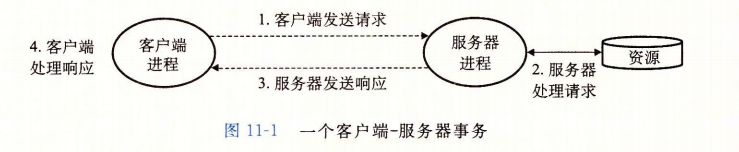
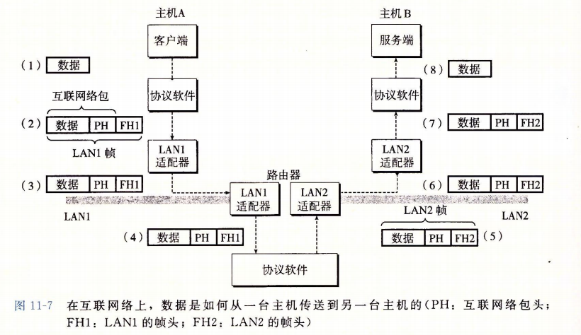
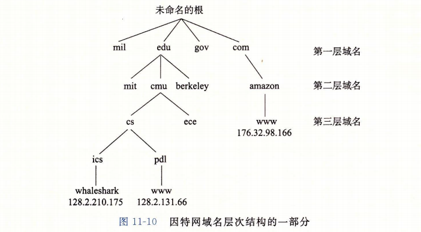
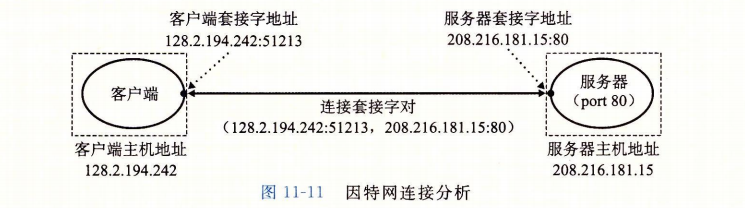
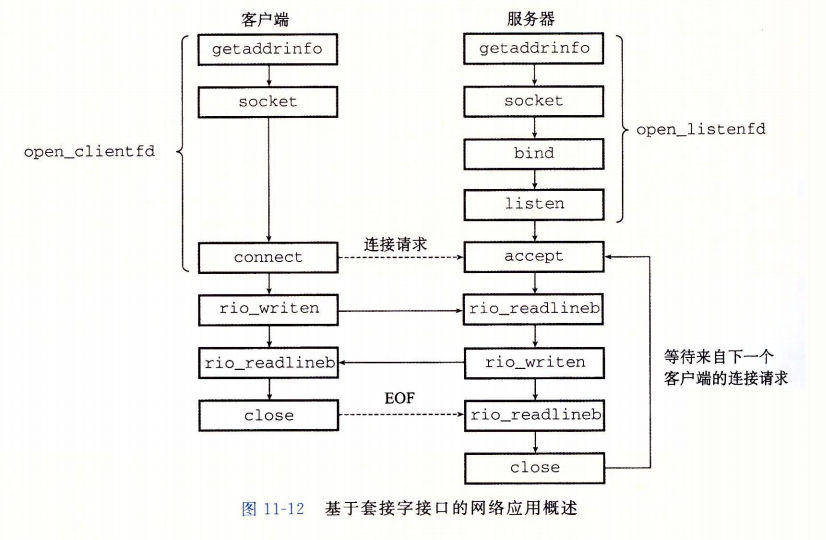
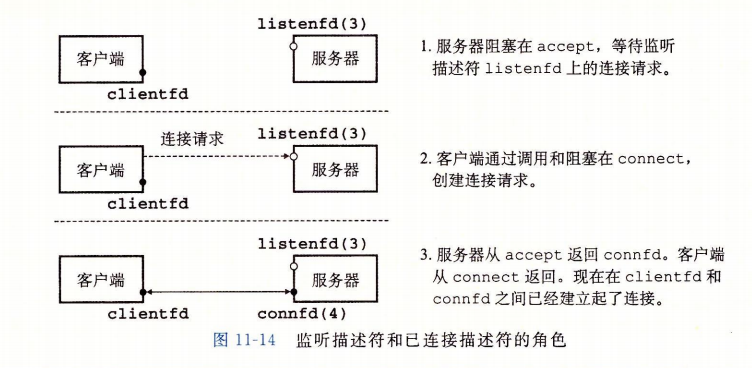
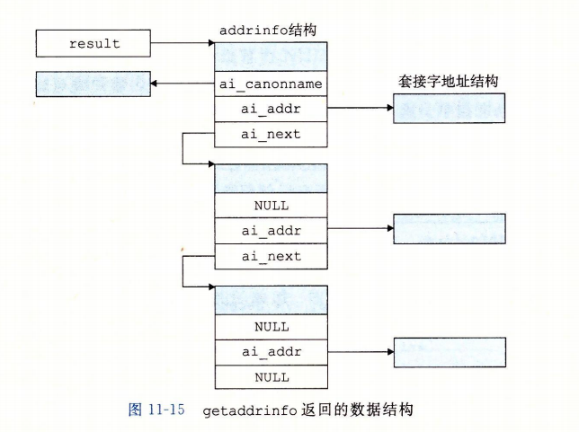

网络应用随处可见，各式各样。但都基于相同的基本编程模型，有着相似的整体逻辑结构，依赖相同的编程接口。  

除了进程、信号、字节顺序、内存映射及动态内存分配，还有基本的客户端-服务器编程模型。


## 客户端-服务器编程模型


每个网络应用都是基于__客户端-服务器模型__的。采用这个模型，一个应用是由一个服务器进程和一个或者多个客户端进程组成。服务器管理某种资源，并且通过操作这种资源来为它的客户端提供某种服务。例如 Web 服务器管理着一组磁盘文件，它会代表客户端进行检索和执行。一个 FTP 服务器管理着一组磁盘文件，为客户端进行存储和检索。一个 MAIL 服务器管理着一些文件，它为客户端进行读和更新。  


客户端-服务器模型中的基本操作是__事务(transaction)__。一个客户端-服务器事务由以下四步组成：

1. 当一个客户端需要服务时，它向服务器发送一个请求，发起一个事务。例如 Web 浏览器需要一个文件，就发送一个请求给 Web 服务器。
2. 服务器收到请求后，解释它，并以适当的方式操作它的资源。例如 Web 服务器收到浏览器请求后，读一个磁盘文件。
3. 服务器给客户端发送一个响应，并等待下一个请求。例如 Web 服务器将文件发送回客户端。
4. 客户端收到响应并处理它。例如 浏览器收到服务器的一页数据，就在屏幕上展示此页。




客户端服务器是进程，而不是常提到的机器或者主机。一台主机可以同时运行许多不同的客户端和服务器，而且一个客户端和服务器的事务可以在同一台或者是不同的主机上。无论客户端和服务器是怎样映射到主机上的，客户端-服务器模型都是相同的。  

客户端-服务器事务不是数据库事务，没有数据库事务的任何特性。例如原子性。仅仅是客户端和服务器执行的一系列步骤。


## 网络

对于主机而言，网络只是又一种 I/O 设备，是数据源和数据接收方。  

一个插到 I/O 总线扩展槽的适配器提供了到网络的物理接口。从网络上接收到的数据从适配器经过 I/O 和内存总线复制到内存，通常是通过 DMA 传送。相似地，数据也能从内存复制到网络。  


... omitts: 省略一些集线器、网桥、交换机相关概念 ...  


小写字母 internet 描述一般概念，大写字母开头的 Internet 来描述具体实现：全球 IP 因特网。  

互联网络至关重要的特性是，能由采用完全不同和不兼容技术的各种局域网和广域网组成。每台主机和其他每台主机都是物理相连的。为了能够让某台主机跨国所有这些不兼容的网络发送数据位到另一台目的主机，每台主机和路由器上运行着协议软件，消除了不同网络之间的差异。这个软件实现一种协议，这种协议控制主机和路由器如何协同工作来实现数据传输，其必须提供两种基本能力：

* 命名机制。互联网络协议通过定义一种一致的主机地址格式，来消除各种局域网技术和不兼容的技术带来的差异，每台主机会被分配至少一个__互联网络地址(internet address)__，这个地址唯一地标识了这台主机
* 传送机制。在电缆上编码位和将这些位封装成帧方面，不同的联网技术有不同的和不兼容的方式。互联网协议通过定义一种把数据位捆扎成不连续的片(称为包)的统一方式，从而消除了这些差异。一个包是由包头和有效载荷组成的，其中包头包括包的大小以及源主机和目的主机的地址，有效载荷包括从源主机发出的数据位。


示例：




1. 运行在主机A上的客户端进行一个系统调用，从客户端的虚拟地址空间复制数据到内核缓冲区中。
2. 主机 A 上的协议软件通过在数据前附加互联网络包头和 LAN1 帧头，创建了一个 LAN1 的帧。互联网络包头寻址到互联网络主机 B。LAN1 帧头寻址到路由器。然后它传送此帧到适配器。LAN1 的有效载荷是一个互联网络包，而互联网络包的有效载荷是用户的实际数据。这种封装是基本的网络互联方法之一。
3. LAN1 适配器复制该帧到网络上。
4. 当此帧到达路由器时，路由器的 LAN1 适配器从电缆上读取它，并把它传送到协议软件。
5. 路由器从互联网络包头中提取出目的互联网络地址，并用它作为路由器的索引，确定向哪里转发这个包，这里是 LAN2。路由器剥落旧的 LAN1 帧头，加上寻址到主机 B 的新的 LAN2 帧头，并把得到的帧传送到适配器。
6. 路由器的 LAN2 适配器复制该帧到网络上。
7. 当此帧到达主机 B 时，它的适配器从电缆上读到此帧，并将它传送到协议软件。
8. 最后，主机 B 上的协议软件剥落包头和帧头。当服务器进行一个读取这些数据的系统调用时，协议软件最终将得到的数据复制到服务器的虚拟地址空间。


这里示例省略了很多问题，例如不同网络拥有不同帧大小的最大值、路由器如何转发帧、网络拓扑变化时如何通知路由器、包丢失后如何处理等等。这里的关键是封装。


## 全球 IP 因特网


1969年开始到现在。

因特网的客户端和服务器混合使用套接字接口函数和 Unix I/O 函数来进行通信。通常将套接字函数实现为系统调用，这些系统调用会陷入内核，并调用各种内核模式的 TCP/IP 函数。  

从程序员角度，可以把因特网看做一个世界范围的主机集合，满足以下特性：

* 主机集合被映射为一组 32 位的 IP 地址
* 这组 IP 地址被映射为一组称为__因特网域名(Internet domain name)__的标识符
* 因特网主机上的进程能够通过__连接(connection)__和任何其他主机上的进程通信。


### IP 地址

一个 IP 地址就是一个 32 位无符号整数。结构如下：

```c
struct in_addr {
    
    uint32_t s_addr;
};
```

因为因特网主机可以由不同的主机字节顺序， TCP/IP 位任意整数数据项定义了统一的__网络字节顺序(network byte order)__ ，例如 IP 地址，它存放在包头中跨过网络被携带。在 IP 地址结构中存放的地址总是以（大端法）网络字节顺序存放的，即使主机字节顺序(host byte order)是小端法。  

Unix 提供了下面的函数在网络和主机字节顺序间实现转换：

```c
#include <arpa/inet.h>

uint32_t htonl(uint32_t hostlong);
uint16_t htons(uint16_t hostshort);
		// 返回：按照网络字节顺序的值

uint32_t ntohl(uint32_t netlong);
uint16_t ntohs(uint16_t netshort)
    	// 返回：按照主机字节顺序的值

```

hotnl 函数将 32 位整数由主机字节顺序转换为网络字节顺序。ntohl 函数将 32 位整数从网络字节顺序转换为主机字节。htons 和 ntohs 函数为 16 位 无符号整数执行相应的转换。没有对应的处理 64 位值的函数。  

IP 地址通常是以一种称为__点分十进制表示法__来表示的，每个字节由它的十进制表示，并且用句点和其他字节间分开。例如 `128.2.194.242` 就是地址 `0x8002c2f2` 的点分十进制表示。Linux 系统上可以通过 HOSTNAME 命令确定自己主机的点分十进制地址：

```bash
xmy@xmy:~$ hostname -i
127.0.1.1
```

应用程序使用 inet_pton 和 inet_ntop 函数来实现 IP 地址和点分十进制串之间的转换：

```c
#include <arpa/inet.h>

int inet_pton(AF_INET, const char *src, void *dst);
		// 返回：若成功则为 1，若 输入串为非法点分十进制地址则为 0，若出错则为 -1

const char *inet_ntop(AF_INET, const void *src, char *dst, socklen_t size);
		// 返回：若成功则指向点分十进制字符串的指针，若出错则为 NULL

```

在这些函数名中，n 代表网络，p 代表表示。它们可以处理 32 位 IPv4 地址(AF_INET)，或者 128 位的 IPv6 地址(AF_INET6)。  

* inet_pton 函数将一个点分十进制串(src)转换为一个二进制的网络字节顺序的 IP 地址(dst)。如果 src 没有指向一个合法的点分十进制字符串，那么该函数就返回0 。任何其他错误会返回 -1，并设置 errno。
* inet_ntop 函数将一个二进制的网络字节顺序的 IP 地址(src)转换为它所对应的点分十进制表示，并把得到的以 null 结尾的字符串的最多 size 个字节复制到 dst。


### 因特网域名

由于大多数整数很难记住，因特网也定义了一组更加人性化的__域名(domain name)__，以及一种将域名映射到IP地址的机制。

  

域名集合是一个层次结构，每个域名编码了它在这个层次中的位置。层次结构表示为一棵树。树的节点表示域名，反向到根的路径形成了域名。字数称为__子域(subdomain)__。层次结构中的第一层是一个未命名的根节点。下一层是一组__一级域名(first-level domain name)__，由非盈利组织 ICANN (Internet Corporation for Assigned Names and Numbers, 因特网分配名字数字协会)定义。常见的第一层域名包括 com、edu、net、gov、org等。  

下一层是__二级(second-level)__ 域名，例如 cmu.edu，这些域名是由 ICANN 的各个授权代理按照先到先服务的基础分配的。一旦一个组织得到了一个二级域名，那么它就可以在这个子域中创建任何新的域名了，例如 cs.cmu.edu。  

因特网定义了域名集合和IP地址集合之间的映射。直到 1988 年，这个映射都是通过 HOSTS.TXT 的文本文件来手工维护的。之后通过分布世界范围内的数据库 DNS(Domain Name System，域名系统) 来维护的。从概念上而言，DNS 数据库由上百万的__主机条目结构(host entry structure)__ 组成，其中每条定义了一组域名和一组 IP 地址之间的映射。从数学意义上讲，可以认为每条主机条目就是一个域名和IP地址的等价类。可以通过 Linux 的 NSLOOKUP 程序来探究 DNS 映射的一些属性，这个程序能够展示与某个 IP 地址对应的域名。


* 每台主机都有本地定义的域名 localhost，这个域名总是映射为 __回送地址(loopback address)__ 127.0.0.1 
* 最简单的情况，一个域名和一个IP地址之间一一映射
* 也可以多个域名映射为同一个 IP 地址
* 多个域名可以映射到同一组的多个 IP 地址
* 不使用的情况下，也可以不映射到任何 IP 地址


ISC 协会通过分配给域名的 IP 地址数量估算统计的数据： 1987年大约 2 万台因特网主机，到 2015 年已经有大约 10 亿台因特网主机了。


### 因特网连接

因特网客户端和服务器通过在 连接 上发送和接收字节流来通信。从连接一堆进程的意义上而言，连接是点对点的。从数据可以同时双向流动的角度而言，它是全双工的。由源进程发出的字节流最终被目的进程以它发出的顺序收到它的角度来说，它也是可靠的。  

一个套接字是连接的一个端点。每个套接字都有相应的套接字地址，是由一个因特网地址和一个 16 位的整数端口组成，用 `地址: 端口` 来表示。  

当客户端发起一个连接请求时，客户端套接字地址中的端口是由内核自动分配的，称为__临时接口(ephemeral port)__。服务器套接字地址中的端口通常是某个__知名端口__，适合这个服务相对应的。例如 web 服务器使用 80 ，电子邮件服务器使用 25。每个知名端口也有一个对应的知名的服务名，例如 web 服务的知名名字是 http，email 的知名名字是 smtp。文件 `/etc/services` 包含一张这台机器提供的知名名字和知名端口之间的映射。  

一个连接时由它两端的套接字地址唯一确定的。这对套接字地址叫做__套接字对(socket pair)__，由下列元组表示：

```
(cliaddr:cliport,  servaddr:servport))
```

其中 cliaddr 时客户端的IP地址，cliport 是客户端的端口，servaddr 是服务器的IP地址，servport 是服务器的端口。




## 套接字接口

__套接字接口(socket interface)__ 是一组函数，它们和 Unix I/O 函数结合起来，用以创建网络应用。大多数现代系统上都实现了套接字接口，包括所有的 Unix 变种、Windows、Macintosh 系统。  

客户端-服务器事务的上下文中套接字接口概述：



套接字接口起源于加州大学伯克利分校，经常也被叫做博客里套接字。


###  套接字地址结构

从 Linux 内核的角度看，一个套接字就是通信的一个端点。从 Linux 程序的角度来看，套接字就是一个有相应描述符的打开文件。  

因特网的套接字存放在 `sockaddr_in` 的 16 字节结构中。

```c
// IP socket 地址结构体
// 这里 _in 后缀是互联网络(internet)的缩写
struct sockaddr_in {
    uint16_t		sin_family;	// 协议族 ，总是 AF_INET
    uint16_t		sin_port;	// 端口号，网络字节顺序(大端法)
    struct in_addr 	sin_addr;	// IP 地址，网络字节顺序
    unsigned char	sin_zero[8];	// 填充0与 sockaddr 结构体大小一致
}

// 通用 socket 结构体
struct sockaddr {
    uint16_t 		sa_family;		// 协议族
    char 			sa_data[14];	// 地址数据
}
```

connect、bind、accept 函数要求一个指向与协议相关的套接字地址结构的指针。套接字接口的设计者面临的问题是，如何定义这些函数，使之能接受各种类型的套接字地址结构。现在可以使用 `void *` 指针，但是那时 C 中并不存在这种类型的指针。解决办法是定义套接字函数要求一个指向通用 `sockaddr` 结构的指针，然后要求应用程序将与协议特定的结构的指针强制转换成这个通用结构。

简化类型定义，后续使用 `sockaddr_in` 结构转换成 `sockaddr` 结构时，都使用该类型：

```c
typedef struct sockaddr SA;
```


### socket 函数

客户端和服务器使用 socket 函数来创建一个__套接字描述符(socket descriptor)__。

```c
#include <sys/types.h>
#include <sys/socket.h>

int socket(int domain, int type, int protocol);
			// 返回值：成功则返回非负描述符，出错则返回 -1
```

如果想要使套接字成为连接的一个端点，就用如下硬编码的参数来调用 socket 函数：

```c
clientfd = Socket(AF_INET, SOCK_STREAM, 0);
```

其中，`AF_INET` 表明我们正在使用 32 位的 IP 地址，SOCK_STREAM 表示这个套接字是连接的一个端点。  

socket 返回的 `clientfd` 描述符仅是部分打开的，还不能用于读写。


### connect 函数

客户端通过调用 connect 函数来建立和服务器的连接。

```c
#include <sys/socket.h>

int connect(int clientfd, const struct sockaddr *addr, socklen_t addrlen);
		// 返回：成功返回 0，出错返回 -1
```

`connect` 函数试图与套接字地址为 `addr` 的服务器建立一个因特网连接，其中 `addrlen` 是 `sizeof(sockaddr_in)`。`connect` 函数会阻塞，一直到连接成功或者是发生错误。如果成功，`clientfd` 描述符就准备好可以读写了，的到的连接是由套接字对

```
(x:y, addr.sin_addr:addr.sin_port)
```

刻画的，x 表示客户端的 IP 地址，y 表示临时端口，它唯一确定了客户端主机上的客户端进程。


### bind 函数

```c
#include <sys/socket.h>

int bind(int sockfd, const struct sockaddr *addr, socklen_t addrlen);
		// 成功返回 0，出错返回 -1
```

bind 函数告诉内核将 `addr` 中的服务器套接字地址和套接字描述符 `sockfd` 联系起来。参数 `addrlen` 是 `sizeof(sockaddr_in)`。


### listen 函数

客户端时发起连接请求的主动实体，服务器时等待来自客户但的连接的被动实体。默认情况下，内核会认为 socket 函数创建的描述符对应于 __主动套接字(active socket)__，它存在于一个连接的客户端。服务器调用 listen 函数告诉内核，描述符是被服务器而不是客户端使用的。

```c
#include <sys/socket.h>

int listen(int sockfd, int backlog);
	// 成功返回 0，出错返回 -1
```

listen 函数将 sockfd 从一个主动套接字转化为一个 __监听套接字(listening socket)__，该套接字可以接受来自客户端的连接请求。`backlog` 参数暗示了内核在开始拒绝连接请求之前，队列中要排队的未完成的连接请求数量。backlog 参数一般设置为一个比较大的值，例如 1024。


### accept 函数

```c
#include <sys/socket.h>

int accept(int listenfd, struct sockaddr *addr, int *addrlen);
		// 成功返回非负连接描述符，出错返回 -1
```

`accept` 函数等待来自客户端的连接请求到达侦听描述符 `listenfd`，然后在 `addr` 中填写客户端的套接字地址，并返回一个__已连接描述符(connected descriptor)__，这个描述符可被用来利用 Unix I/O 函数与客户端通信。  

监听描述符和已连接描述符差异：

* 监听描述符时作为客户端连接请求的一个端点，通常被创建一次，存在于服务器的整个生命周期。
* 已连接描述符是客户端和服务器之间已经建立起来的连接的一个端点，服务器每次接受连接请求时都会创建一次，它只存在于服务器为一个客户端服务的过程中。




1. 服务器调用 `accept`，等待连接请求到达监听描述符，假设描述符是 3。
2. 客户端调用 `connect` 函数，发送一个连接请求到 `listenfd`。
3. `accept` 函数打开一个新的已连接描述符 `connfd` （假设是描述符 4），在 `clientfd` 和 `connfd` 之间建立连接，并且返回 `connfd` 给应用程序，客户端从 `connect` 返回。之后 客户端和服务器之间就可以分别通过 `clientfd` 和 `connfd` 来回传送数据了。


监听描述符 `listenfd` 和 已连接描述符 `connfd` 的区分增加了复杂性，但它们使得我们可以建立并发服务器，同时处理许多客户端连接。


### 主机和服务的转换

Linux 提供了一些强大的函数（称为 `getaddrinfo` 和 `getnameinfo`）实现二进制套接字地址结构和主机名、主机地址、服务名和端口号的字符串表示的相互转化。当和套接字接口一起使用时，这些函数能使我们编写独立于任何特定版本的 IP 协议的网络程序。


#### getaddrinfo 函数

将主机名、主机地址、服务名和端口号的字符串表示转换成套接字地址结构。

```c
#include <sys/types.h>
#include <sys/socket.h>
#include <netdb.h>

int getaddrinfo(const char *host, const char *service, 
               const struct addrinfo *hints,
               struct addrinfo **result);
		// 成功则返回 0，出错返回非零的错误代码

void freeaddrinfo(struct addrinfo *result);

const char *gai_strerror(int errcode);
		// 返回错误消息

```


`addrinfo` 结构体：

```c
struct addrinfo {
    int 				ai_flags;		// 参数标志
    int					ai_family;		// 
    int					ai_socktype;
    int					ai_protocol;
    char				*ai_canonname;
    size_t				ai_addrlen;
    struct sockaddr 	*ai_addr;
    struct addrinfo 	*ai_next;
};
```


给定 host 和 service，`getaddrinfo` 返回 `result`，result 是一个指向 `addinfo` 结构的链表，其中每个结构指向一个对应于 host 和 service 的套接字地址结构。  



* 客户端调用了 `getaddrinfo` 之后，会遍历这个列表，依次尝试每个套接字地址，直到调用 socket 和 connect 成功，建立起连接。
* 服务器会尝试遍历列表中的每个套接字地址，直到调用 socket 和 bind 成功，描述符会被绑定到一个合法的套接字地址。
* 为了避免内存泄漏，应用程序必须在最后调用 `freeaddrinfo`，释放该链表。
* 如果 `getaddrinfo` 返回非零的错误代码，应用程序可以调用 `gai_strerror`，将该代码转换成消息字符串。


参数 `host` 可以是域名，也可以是数字地址（如点分十进制 IP 地址）。`service` 参数可以是服务名（如 http），也可以是十进制端口号。如果不想把主机名转换成地址，可以把 `host` 设置为 NULL，`service`也是一样，但是必须指定两者中至少一个。  

可选参数 `hints` 是一个 `addrinfo` 结构，它提供对 `getaddrinfo` 返回的套接字地址列表的更好的控制。如果要传递 `hints` 参数，只能设置字段：`ai_family`、`ai_socktype`、`ai_protocol`、`ai_flags` ，其他字段必须设置为 0（或者 NULL）。实际中，用 `memset` 将整个结构清零，然后有选择地设置一些字段：

* `getaddrinfo` 默认可以返回 IPv4 和 IPv6 套接字地址。`ai_family` 设置为 `AF_INET` 会将列表限制为 IPv4 地址，设置为 `AF_INET6` 则限制为 IPv6 地址
* 对于 `host` 关联的每个地址，`getaddrinfo` 函数默认最多返回三个 `addrinfo` 结构，每个的 `ai_socktype` 字段不同：一个是连接，一个是数据报，一个是原始套接字。`ai_socktype` 设置为 `SOCK_STREAM` 将列表限制为对每个地址最多一个 `addrinfo` 结构，该结构的套接字可以作为连接的一个端点。
* `ai_flags` 字段是一个位掩码，可以进一步修改默认行为。可以把各种值用 OR 组合起来的到该掩码：
  * `AI_ADDRCONFIG`。如果在使用连接，就推荐使用这个标志。它要求只有当本地之际被配置为 IPv4 时，`getaddrinfo` 返回 IPv4 地址，IPv6 也是类似。
  * `AI_CANONNAME`。默认为 NULL。如果设置了该标志，`getaddrinfo` 将列表中第一个 `addrinfo` 结构的 `ai_canonname` 字段指向 host 的权威名字
  * `AI_NUMBERICSERV`。service 默认可以时服务名或者端口号，这个标志强制参数 service 为端口号
  * `AI_PASSIVE`。`getaddrinfo` 默认返回套接字地址，客户端可以在调用 connect 时作为主动套接字。加上这个标志，此时参数 host 应该为 NULL，返回的套接字地址结构中的地址字段回时通配符地址(wildcard address)，告诉内核这个服务器会接受发送到该主机所有 IP 地址的请求。


当 `getaddrinfo` 创建输出列表中的 `addrinfo` 结构时，会填写除了 `ai_flags` 的每个字段。

* `ai_addr` 指向一个套接字地址结构
* `ai_addrlen` 字段给出这个套接字地址结构的大小
* `ai_next` 指向列表中下一个 `addrinfo` 结构
* 其他字段描述这个套接字地址的各种属性


`addrinfo` 结构中的字段是不透明的，它们可以被 `getaddrinfo` 直接传递给套接字接口中的函数。例如 `ai_addr` 、`ai_addrlen` 直接传递给 connect 和 bind，`ai_family`、`ai_socktype`、`ai_protocol` 直接传递给 socket。这种属性使得客户端和服务器能够独立于某个特殊版本的 IP 协议。


#### getnameinfo 函数

与 `getaddrinfo` 相反，`getnameinfo` 函数将一个套接字地址结构转换成相应的主机和服务名字符串：

```c
#include <sys/socket.h>
#include <netdb.h>

int getnameinfo(const struct sockaddr *sa, socklen_t salen,
               char *host, size_t hostlen,
               char *service, size_t servlen, int flags);
		// 执行成功返回 0，出错返回非零的错误代码
```

参数：

* `sa` 指向大小为 `salen` 字节的套接字地址结构
* `host` 指向大小为 `hostlen` 字节的缓冲区
  * 不想要主机名，host 可以设置为 NULL，`hostlen` 设置为 0，但这样必须设置 service
* `service` 指向大小为 `servlen` 字节的缓冲区
  * 不想要服务名，service 可以设置为 NULL，`servlen` 设置为 0，但这样必须设置 host
* `flags` 是一个位掩码，用来修改默认的行为，可以将各种值用 OR 组合起来得到该掩码
  * `NI_NUMERICHOST`。`getnameinfo` 函数默认返回 host 中的域名，设置此标志会返回一个数字地址字符串
  * `NI_NUMBERICSERV`。`getnameinfo` 函数会尝试检查 /etc/services 返回服务名，设置此标志会跳过检查，直接返回端口号


`getnameinfo` 函数将套接字地址结构 sa 转换成对应的主机和服务名字符串，并将它们复制到 host 和 service 缓冲区。如果 `getnameinfo` 返回非零的错误代码，可以调用 `gai_strerror` 转换成字符串。


示例，`hostinfo.c`：

```c
#include <sys/types.h>
#include <sys/socket.h>
#include <netdb.h>
#include <stdio.h>
#include <stdlib.h>
#include <arpa/inet.h>
#include <netinet/in.h>
#include <string.h>

#define MAXLINE 1024


int main(int argc, char **argv) {
    struct addrinfo *p, *listp, hints;
    char buf[MAXLINE];
    int rc, flags;

    if (argc !=2) {
        fprintf(stderr, "usage: %s <domain name>\n", argv[0]);
        exit(0);
    }

    // 将 hints 初始化为零
    memset(&hints, 0, sizeof(struct addrinfo));
    // 设置协议类型为 IPv4 和 connection 类型
    hints.ai_family = AF_INET;
    hints.ai_socktype = SOCK_STREAM;

    // 获取参数中的域名，写入 hints 结构体，将 listp 指向结果链表
    if (( rc = getaddrinfo(argv[1], NULL, &hints, &listp)) != 0) {
        // 出错则调用 gai_strerror 打印错误字符串
        fprintf(stderr, "getaddrinfo error: %s\n", gai_strerror(rc));
        exit(1);
    }

    flags = NI_NUMERICHOST;
    for ( p = listp; p ; p = p->ai_next) {
        getnameinfo(p->ai_addr, p->ai_addrlen, buf, MAXLINE, NULL, 0, flags);
        printf("%s\n", buf);
    }

    freeaddrinfo(listp);

    exit(0);

}
```

将参数的域名转换为点分十进制的IP地址。


### 套接字接口的辅助函数

`getnameinfo` 函数和套接字接口有些复杂，有几个高级的辅助函数包装了该函数以方便使用。

#### open_clientfd 函数

客户端调用 `open_clientfd` 建立于服务器的连接。

```c
int open_clientfd(char *hostname, char *port);
			// 执行成功则返回描述符，出错返回 -1
```

`open_clientfd` 函数建立与 `hostname` 运行的主机之间的连接，并在端口号 port 上监听连接请求。它返回一个套接字描述符，该描述符可以用 Unix I/O 函数做输入和输出。

```c
int open_clientfd(char *hostname, char *port) {
    int clientfd;
    struct addrinfo hints, *listp, *p;
    
    // 将 hints 置零，赋值给结构体成员
    memset(&hints, 0, sizeof(struct addrinfo));
    hints.ai_socktype = SOCK_STREAM;
    hints.ai_flags = AI_NUMERICSERV;
    hints.ai_flags |= AI_ADDRCONFIG;
    // 调用 getaddrinfo
    getaddrinfo(hostname, port, &hints, &listp);
    
    // 用指针 p 遍历 listp 所指向的链表
    for (p = listp; p; p= p->ai_next) {
        // 调用 socket ，准备用于连接
        if (( clientfd = socket(p->ai_family, p->ai_socktype, p->ai_protocol)) < 0)
            continue;
        
        // 连接服务器，如果正常返回就中断循环
        if (connect(clientfd, p->ai_addr, p->ai_addrlen) != -1)
            break;
        
        // 尝试下一轮之前，释放掉套接字fd
        close(clientfd);
    }
    
    // 清理链表
    freeaddrinfo(listp);
    // 连接失败返回 -1，成功则返回 clientfd
    if (!p)
        return -1;
    else
        return clientfd;
}

```


#### open_listenfd 函数

调用 open_listenfd 函数，服务器创建一个监听描述符，准备好接收连接请求。

```c
int open_listenfd(char *port);
			// 成功则返回描述符，出错则返回 -1
```


```c
int open_listenfd(char *port) {
    struct addrinfo hints, *listp, *p;
    int listenfd, optval=1;
    
    // 将 hints 置零，赋值给结构体成员
    memset(&hints, 0, sizeof(struct addrinfo));
    hints.ai_socktype = SOCK_STREAM;
    hints.ai_flags = AI_PASSIVE | AI_ADDRCONFIG;
    hints.ai_flags |= AI_NUMERICSERV;
    // 调用 getaddrinfo，上面的 hints 属性会告诉内核地址字段是通配符地址
    getaddrinfo(NULL, port, &hints, &listp);
    
    // 用指针 p 遍历 listp 所指向的链表
    for (p = listp; p; p= p->ai_next) {
        // 调用 socket ，如果返回值小于0，则尝试下一个
        if (( listenfd = socket(p->ai_family, p->ai_socktype, p->ai_protocol)) < 0)
            continue;
        
        // 消除一些错误，书中没有讲解这个函数
        setsockopt(listenfd, SOL_SOCKET, SO_REUSEADDR, (const void *)&optval, sizeof(int));
        
        // 尝试绑定，如果正常返回就中断循环
        if (bind(listenfd, p->ai_addr, p->ai_addrlen) == 0)
            break;
        
        // 尝试下一轮之前，释放掉套接字fd
        close(listenfd);
    }
    
    // 清理链表
    freeaddrinfo(listp);
    // 失败返回 -1
    if (!p)
        return -1;
    
    // 确保 socket 准备号接收请求
    if (listen(listenfd, LISTENQ) < 0) {
        close(listenfd);
        return -1;
    }
    
    return listenfd;
}

```


### echo 客户端和服务器的示例


客户端程序：


```c

int main(int argc, char **argv) {
    int clientfd;
    char *host, *port, buf[MAXLINE];
    rio_t rio;
    
    if (argc != 3) {
        fprintf(stderr, "usage: %s <host> <port>\n", argv[0]);
        exit(0);
    }
    host = argv[1];
    port = argv[2];
    
    // 建立和服务器的连接
    clientfd = open_clientfd(host, port);
    // 将 clientfd 和 rio 缓冲区关联
    rio_readinitb(&rio, clientfd);
    
    // 按行循环读取标准输入的内容到 buf 缓冲区
    while (fgets(buf, MAXLINE, stdin) != NULL) {
        // 发送 buf 中的数据给服务器
        rio_writen(clientfd, buf, strlen(buf));
        // 再从服务器读取回送的行到 buf
        rio_readlineb(&rio, buf, MAXLINE);
        // 从缓冲区 buf 读取数据到标准输出
        fputs(buf, stdout);
    }
    
    // 关闭fd
    close(clientfd);
    exit(0);
}
```


服务器程序：

```c

void echo(int connfd);

int main(int argc, char **argv){
    int listenfd, connfd;
    socklen_t clientlen;
    // sockaddr_storage 类型的结构体足够大，可以装下任何类型的套接字地址
    struct sockaddr_storage clientaddr;
    char client_hostname[MAXLINE], client_port[MAXLINE];
    
    if (argc != 2){
        fprintf(stderr, "usage: %s <port>\n", argv[0]);
        exit(0);
    }
    
    // 打开 listenfd
    listenfd = openlistenfd(argv[1]);
    
    while(1){
        clientlen = sizeof(struct sockaddr_storage);
        // 调用 accept函数，使用listenfd 接收客户端连接
        connfd = accept(listenfd, (SA *)&clientaddr, &clientlen);
        // 调用getnameinfo函数，获取客户端地址、端口信息，赋值到 client_hostname 和 client_port 数组
        getnameinfo((SA *) &clientaddr, clientlen, client_hostname, MAXLINE, client_port, MAXLINE, 0);
        // 打印客户端信息
        printf("Connected to (%s, %s)\n", client_hostname, client_port);
        
        // 调用 echo 函数
        echo(connfd);
        // echo 函数返回后，释放 connfd
        close(connfd);
    }
    
    exit(0);
}


void echo(int connfd){
    size_t n;
    char buf[MAXLINE];
    rio_t rio;
    
    rio_readinitb(&rio, connfd);
    // 反复从connfd 读取一行，再写回connfd，直到 EOF 标志
    while((n = rio_readlineb(&rio, buf, MAXLINE)) != 0) {
        printf("server received %d bytes \n", (int)n);
        rio_writen(connfd, buf, n);        
    }
}
```

这里的 echo 服务器一次只能处理一个客户端，一次一个地在客户端之间迭代，称为__迭代服务器(iterative server)__。


## Web 服务器


### Web 基础

Web 客户但和服务器基于 HTTP 协议，客户端（浏览器）打开一个到服务器地因特网连接，请求一些内容，服务器响应所请求地内容，然后关闭连接，客户端读取这些内容，显示在屏幕上。Web 内容基于 HTML 语言。


### Web 内容

对于 Web 客户端和服务器而言，内容是与一个 __MIME(Multipurpose Internet Mail Extensions, 多用途的网际邮件扩充协议)__类型相关的字节序列。常见的有：

| MIME 类型              | 描述                      |
| ---------------------- | ------------------------- |
| text/html              | HTML 页面                 |
| text/plain             | 无格式文本                |
| application/postscript | Postscript 文档           |
| image/gif              | GIF 格式编码的二进制图像  |
| image/png              | PNG 格式编码的二进制图像  |
| image/jpeg             | JPEG 格式编码的二进制图像 |

Web 服务器以两种不同的方式向客户端提供内容：

* 取一个磁盘文件，并将它的内容返回给客户端。磁盘文件称为__静态内容(static content)__，而返回文件给客户端的过程称为__服务静态内容(serving static content)__。
* 运行一个可执行文件，并将它的输出返回给客户端。运行时可执行文件产生的输出称为__动态内容(dynamic content)__，而运行程序并返回它的输出到客户端的过程称为__服务动态内容(serving dynamic content)__。


### HTTP 事务


1. HTTP 请求：一个请求行(request line)，跟随零个或者更多个请求报头(request header)，再跟随一个空的文本行来终止报头列表。

   * 请求行格式：

   * ```
     method URI version
     ```

   * 请求报头格式

   * ```
     header-name: header-data
     ```

   * HTTP 支持多种方法，例如 GET、POST、PUT、OPTIONS

2. HTTP 响应：一个响应行(response line)，后面跟随零个或更多的响应报头(response header)，再跟随一个终止报头的空行，再跟随一个响应主体(response body)

   * 响应行格式：

   * ```
     version status-code status-message
     ```

   * 状态码(status-code)是一个 3 位正整数，状态消息(status-message)是状态描述，常见状态码和消息：

   * | 状态代码 | 状态消息        | 描述                                 |
     | -------- | --------------- | ------------------------------------ |
     | 200      | 成功            | 处理请求无误                         |
     | 301      | 永久移动        | 内容已移动到 location 头指明的主机上 |
     | 400      | 错误请求        | 服务器不能理解请求                   |
     | 403      | 禁止            | 服务器无权访问所请求的文件           |
     | 404      | 未发现          | 服务器不能找到所请求的文件           |
     | 501      | 未实现          | 服务器不支持请求的方法               |
     | 505      | HTTP 版本不支持 | 服务器不支持请求的版本               |

   *  响应报头提供了响应的附加信息，例如 Content-Type 告诉客户端响应主题中内容的 MIME 类型，Content-Length 表示响应主题的字节大小


### 服务动态内容


__CGI(Common Gateway Interface, 通用网关接口)__ 解决了一些问题；

* 客户端如何将程序参数传递给服务器

  * GET 请求的参数在 URI 中传递，一个 `?` 字符分割文件名和参数，每个参数用 `&` 字符分割，参数中不允许有空格，需要用字符串`%20`代替
  * POST 请求的参数在请求 body 中传递

* 服务器如何将这些参数传递给它所创建的子进程

  * GET请求的参数包含在URI中，服务器会解析然后 fork 子进程，由子进程调用 `execve` 执行相关程序，在执行前设置 QUERY_STRING 环境变量，包含了客户端传递的参数 
  * POST请求的参数，子进程需要将标准输入重定向到 connfd，然后 CGI 程序从标准输入中读取请求 body 中的参数

* 服务器如何将子进程生成的内容所需要的其它信息传递给子进程

  * CGI 定义了大量的其他环境变量，一个 CGI 程序在运行时可以设置这些环境变量：

  * | 环境变量       | 描述                           |
    | -------------- | ------------------------------ |
    | QUERY_STRING   | 程序参数                       |
    | SERVER_PORT    | 父进程侦听的端口               |
    | REQUEST_METHOD | GET 或 POST                    |
    | REMOTE_HOST    | 客户端的域名                   |
    | REMOTE_ADDR    | 客户端的点分十进制 IP 地址     |
    | CONTENT_TYPE   | 只对POST而言：请求体 MIME 类型 |
    | CONTENT_LENGTH | 只对POST而言：请求体的字节大小 |

  * 

* 子进程将它的输出发送到哪里

  * 发送到标准输出
  * 子进程加载运行 CGI 程序之前，使用 Linux `dup2` 函数将标准输出重定向到和客户端相关联的 `connfd` ，这样任何 CGI 程序写到标准输出的内容会直接到达客户端 
  * 父进程不知道子进程生成内容的类型或大小，所以子进程要负责生成 Content-Type 和 Content-Length 响应报头，以及终止报头的空行

  


CGI 示例程序，对两个参数求和，返回结果给客户端：

```c
int main(void) {
    char *buf, *p;
    char arg1[MAXLINE], arg2[MAXLINE], content[MAXLINE];
    int n1=0, n2=0;
    
    if (( buf = getenv("QUERY_STRING")) != NULL) {
        p = strchr(buf, '&');
        *p = '\0';
        strcpy(arg1, buf);
        strcpy(arg2, p+1);
        
        n1 = atoi(arg1);
        n2 = atoi(arg2);
    }
    
    // response body
    sprintf(content, "QUERY_STRING=%s", buf );
    sprintf(content, "Welcome to jerry.com: ");
    sprintf(content, "%sTHE Internet addition portal.\r\n<p>", content );
    sprintf(content, "%sThe answer is: %d + %d = %d\r\n<p>", content, n1, n2, n1 + n2);
    sprintf(content, "%sThanks for visiting!\r\n", content );
    
    // response
    printf("Connection: close\r\n");
    printf("Content-length: %d\r\n", (int)strlen(content));
    printf("Content-type: text/html\r\n\r\n");
    printf("%s", content);
    fflush(stdout);
    
    exit(0);
}
```


## 综合： TINY Web 服务器


### TINY 的 main 

TINY是一个迭代服务器，监听在命令行中传递来的端口上的连接请求。调用 `open_listenfd` 函数打开一个监听套接字，执行无限循环，不断地接受连接请求，执行事务，再关闭连接的服务器的那一端。

```c
void doit(int fd);
void read_requesthdrs(rio_t *rp);
int parse_uri(char *uri, char *filename, char *cgiargs);
void serve_static(int fd, char *filename, int filesize);
void get_filetype(char *filename, char *filetype);
void serve_dynamic(int fd, char *filename, char*cgiargs);
void clienterror(int fd, char *cause, char *errnum,
                char *shortmsg, char *longmsg);

int main(int argc, char **argv) {
    int listenfd, connfd;
    char hostname[MAXLINE], port[MAXLINE];
    socklen_t clientlen;
    struct sockaddr_storage clientaddr;
    
    if (argc != 2) {
        fprintf(stderr, "usage: %s <port>\n", argv[0]);
        exit(1);
    }
    
    // 打开监听 fd，端口是启动时传递的参数
    listenfd = open_listenfd(argv[1]);
    while (1) {
        clientlen = sizeof(clientaddr);
        // 通过listenfd 接收客户端请求，绑定connfd 到accept 返回值
        connfd = accept(listenfd, (SA *)&clientaddr, &clientlen);
        // 获取客户端主机端口等信息
        getnameinfo((SA *)&clientaddr, clientlen, hostname, MAXLINE, port, MAXLINE, 0);
        printf("Accepted connection from (%s, %s)\n", hostname, port);
        // 调用 doit 函数处理客户端连接 connfd
        doit(connfd);
        close(connfd);
    }
}

```


### doit 函数

`doit` 是对客户端连接的处理逻辑函数：

```c
void doit(int fd){
    int is_static;
    struct stat sbuf;
    char buf[MAXLINE], method[MAXLINE], uri[MAXLINE], version[MAXLINE];
    char filename[MAXLINE], cgiargs[MAXLINE];
    rio_t rio;
    
    // 使用 rio 函数初始化及绑定 fd 到 rio，从rio中读取到buf
    rio_readinitb(&rio, fd);
    rio_readlineb(&rio, buf, MAXLINE);
    printf("Request header:\n");
    printf("%s", buf);
    // 从buf字符串数组中解析出 method、uri、version
    sscanf(buf, "%s %s %s", method, uri, version);
    // 判断不是 GET 请求，就返回501错误
    if (strcasecmp(method, "GET")) {
        clienterror(fd, method, "501", "Not implemented", "Tiny does not implement this method");
        return;
    }
    // 调用 read_requesthdrs 函数读取 header
    read_requesthdrs(&rio);
    
    // 解析uri，判断是否为静态资源
    is_static = parse_uri(uri, filename, cgiargs);
    // 判断文件状态，以及是否有权限
    if (stat(filename, &sbuf) < 0) {
        clienterror(fd, filename, "404", "Not found", "Tiny couldn't find this file");
        return;
    }
    
    // 静态文件处理
    if(is_static) {
        // 判断文件权限
        if (!(S_ISREG(sbuf.st_mode)) || !(S_IRUSR & sbuf.st_mode)) {
            clienterror(fd, filename, "403", "Forbidden",
                       "Tiny couldn't read the file");
            return;
        }
        // 调用静态处理函数 serve_static
        serve_static(fd, filename, sbuf.st_size);
    } // 动态处理逻辑
    else {
        // 判断文件执行权限
        if (!(S_ISREG(sbuf.st_mode)) || !(S_IXUSR & sbuf.st_mode)) {
            clienterror(fd, filename, "403", "Forbidden",
                       "Tiny couldn't run the CGI program");
            return;
        }
        // 调用动态处理函数 serve_dynamic
        serve_dynamic(fd, filename, cgiargs);
    }
}
```


### clienterror 函数

检查一些明显的错误，返回给客户端

```c
void clienterror(int fd, char *cause, char *errnum, char *shortmsg, char *longmsg){
    char buf[MAXLINE], body[MAXBUF];
    
    // 返回 response body 
    sprintf(body, "<html><title>Tiny Error</title>");
    sprintf(body, "%s<body bgcolor=""ffffff"">\r\n", body);
    sprintf(body, "%s%s: %s\r\n", body, errnum, shortmsg);
    sprintf(body, "%s<p>%s: %s\r\n", body, longmsg, cause);
    sprintf(body, "%s<hr><em>The Tiny Web server</em>\r\n", body);
    
    // 返回 response
    sprintf(buf, "HTTP/1.0 %s %s\r\n", errnum, shortmsg);
    rio_writen(fd, buf, strlen(buf));
    sprintf(buf, "Content-type: text/html\r\n");
    rio_writen(fd, buf, strlen(buf));
    sprintf(buf, "Content-length: %d\r\n\r\n", (int)strlen(body));
    rio_writen(fd, buf, strlen(buf));
    rio_writen(fd, body, strlen(body));
}
```


### read_requesthdrs 函数

读取并打印报头，没有使用报头内容：

```c
void read_requesthdrs(rio_t *rp){
    char buf[MAXLINE];
    
    rio_readlineb(rp, buf, MAXLINE);
    // \r\n 是空文本行，表示报头的结束
    while(strcmp(buf, "\r\n")) {
        rio_readlineb(rp, buf, MAXLINE);
        printf("%s", buf);
    }
    return;
}
```


### parse_uri 函数

这里 `parse_uri`函数判断静态动态的形式，主要通过目录，`cgi-bin` 目录的是动态内容：

```c
int parse_uri(char *uri, char *filename, char *cgiargs) {
    char *ptr;
    
    // 静态
    if (!strstr(uri, "cgi-bin")){
        strcpy(cgiargs, "");
        strcpy(filename, ".");
        strcat(filename, uri);
        if (uri[strlen(uri)-1] == '/')
            strcat(filename, "home.html");
        return 1;
    }// 动态
    else {
        ptr = index(uri, '?');
        if (ptr) {
            strcpy(cgiargs, ptr+1);
            *ptr = '\0';
        }
        else 
            strcpy(cgiargs, "");
        
        strcpy(filename, ".");
        strcat(filename, uri);
        return 0;
        
    }
}
```


### serve_static 函数


```c
void serve_static(int fd, char *filename, int filesize) {
    int srcfd;
    char *srcp, filetype[MAXLINE], buf[MAXBUF];
    
    // 发送 response headers 到客户端
    get_filetype(filename, filetype);
    sprintf(buf, "HTTP/1.0 200 OK\r\n");
    sprintf(buf, "%sServer: Tiny Web Server\r\n", buf);
    sprintf(buf, "%sConnection: close\r\n", buf);
    sprintf(buf, "%sContent-length: %d\r\n", buf, filesize);
    // 这里最后增加了一个空行，用于结束response header
    sprintf(buf, "%sContent-type: %s\r\n\r\n", buf, filetype);
    rio_writen(fd, buf, strlen(buf));
    printf("Response headers:\n");
    printf("%s", buf);
    
    // 发送 response body 到客户端
    // 只读形式打开文件描述符 srcfd
    srcfd = open(filename, O_RDONLY, 0);
    // 将文件映射到内存中
    srcp = mmap(0, filesize, PROT_READ, MAP_PRIVATE, srcfd, 0);
    // 关闭 srcfd
    close(srcfd);
    // 复制 srcp 开始 filesize 个字节到客户端 fd
    rio_writen(fd, srcp, filesize);
    // 释放映射的内存区域
    munmap(srcp, filesize);
}

// 获取文件类型，这里定义了五种类型
void get_filetype(char *filename, char *filetype){
    if (strstr(filename, ".html"))
        strcpy(filetype, "text/html");
    else if (strstr(filename, ".gif"))
        strcpy(filetype, "image/gif");
    else if (strstr(filename, ".png"))
        strcpy(filetype, "image/png");
    else if (strstr(filename, ".jpg"))
        strcpy(filetype, "image/jpeg");
    else
        strcpy(filetype, "text/plain");
}
```


### serve_dynamic 函数


```c
void serve_dynamic(int fd, char *filename, char *cgiargs) {
    char buf[MAXLINE], *emptylist[] = { NULL };
    
    sprintf(buf, "HTTP/1.0 200 OK\r\n");
    rio_writen(fd, buf, strlen(buf));
    sprintf(buf, "Server: Tiny Web Server\r\n");
    rio_writen(fd, buf, strlen(buf));
    
    // 子进程执行逻辑
    if (fork() == 0) {
        // 设置环境变量
        setenv("QUERY_STRING", cgiargs, 1);
        // 修改标准输出fd指向客户端 fd
        dup2(fd, STDOUT_FILENO);
        // 调用 execve 执行 filename，传递空参数和环境变量
        execve(filename, emptylist, environ);
    }
    
    // 父进程阻塞，等待回收子进程资源
    wait(NULL);

}
```


