如果逻辑控制流在时间上重叠，那么它们就是__并发的(concurrent)__。这种现象称为__并发(concurrency)__ ，出现在计算机系统的许多不同层面，例如硬件异常处理程序、进程、Linux 信号处理等等。


应用级并发在很多场景下有用：

* 访问慢速 I/O 设备
* 与人交互
* 通过推迟工作以降低延迟
* 服务多个网络客户端
* 在多核机器上进行并行计算


使用应用级并发的应用程序称为__并发程序(concurrent program)__，现代操作系统提供三种基本的构造并发程序的方法：

* **进程**。每个逻辑控制流都是一个进程，由内核来调度和维护。因为进程有独立的虚拟地址空间，想要和其他流通信，控制流必须使用某种显式的__进程间通信(interprocess communication, IPC)__机制。
* **I/O 多路复用**。这种形式的并发编程中，应用程序在一个进程的上下文中显式地调度它们自己的逻辑流。逻辑流被模型化为状态机，数据到达文件描述符后，主程序显式地从一个状态转换到另一个状态。因为程序是一个单独地进程，所以所有的流都共享同一个地址空间。
* **线程**。线程是运行在一个单一进程上下文中地逻辑流，由内核进行调度。可以把线程看成其他两种方式地混合体，像进程流一样由内核进行调度，像 I/O 多路复用流一样共享同一个虚拟地址空间。


## 基于进程的并发编程

构造并发程序最简单的方法就是用进程，使用 fork、exec、waitpid 等函数，例如父进程接收客户但的连接请求，然后创建一个新的子进程来为每个新客户端提供服务。  

书中举了例子：  

两个客户端和一个服务器，服务器监听在一个 listenfd 3 上的连接请求，目前服务器接受了客户端1 的连接请求，返回一个 connfd 4，接受连接请求之后，服务器派生一个子进程，这个子进程获取服务器描述符表的完整副本。由于不再使用，子进程关闭它副本中的 listenfd 3，父进程关闭它的 connfd 4。因为父子进程的已连接描述符 connfd 都指向同一个文件表表项，所以父进程关闭它的 connfd 是必要的，否则永远都释放不掉 connfd4 的文件表条目，由此引起内存泄漏：

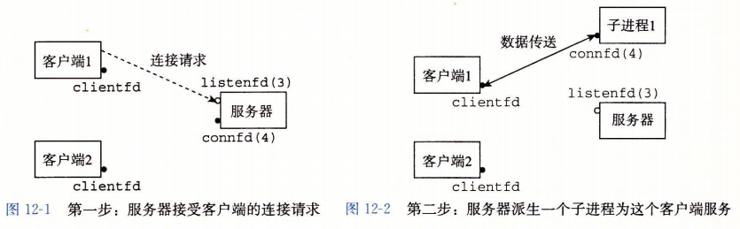

假设父进程为客户端1创建了子进程之后，接受了一个新的客户端2的连接请求，并返回一个 connfd5，然后父进程又派生一个子进程，这个子进程用 connfd5 为客户端2提供服务。此时父进程继续等待下一个连接请求，而两个子进程并发地为两个客户端提供服务：

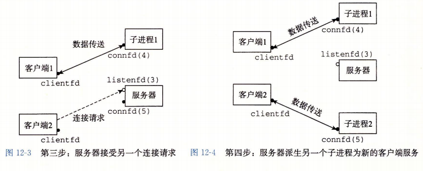


### 基于进程的并发服务器


```c
#include "../csapp.h"

void echo(int connfd);

// 回收僵死子进程的资源
void sigchld_handler(int sig)
{
    while (waitpid(-1, 0, WNOHANG) > 0)
        ;
    return;
}

int main(int argc, char **argv)
{
    int listenfd, connfd;
    socklen_t clientlen;
    // sockaddr_storage 类型的结构体足够大，可以装下任何类型的套接字地址
    struct sockaddr_storage clientaddr;


    if (argc != 2)
    {
        fprintf(stderr, "usage: %s <port>\n", argv[0]);
        exit(0);
    }

    // SIGCHLD 信号触发，调用前面定义的 sigchld_handler 函数
    signal(SIGCHLD, sigchld_handler);
    // 打开 listenfd
    listenfd = open_listenfd(atoi(argv[1]));

    while (1)
    {
        clientlen = sizeof(struct sockaddr_storage);
        // 调用 accept函数，使用listenfd 接收客户端连接
        connfd = accept(listenfd, (SA *)&clientaddr, &clientlen);


        // 子进程
        if (fork() == 0) {
            close(listenfd);    /* 关闭listenfd，客户端不需要*/
            echo(connfd);       /* 调用 echo 函数*/
            close(connfd);      /* 从 echo 执行完成返回后，关闭 connfd*/
            exit(0);        /* 终止子进程 */
        }

        // 释放 connfd
        close(connfd);
    }

    exit(0);
}

void echo(int connfd)
{
    size_t n;
    char buf[MAXLINE];
    rio_t rio;

    rio_readinitb(&rio, connfd);
    // 反复从connfd 读取一行，再写回connfd，直到 EOF 标志
    while ((n = rio_readlineb(&rio, buf, MAXLINE)) != 0)
    {
        printf("server received %d bytes \n", (int)n);
        rio_writen(connfd, buf, n);
    }
}
```


* 通常服务器会运行很长时间，因此必须要包括一个 `SIGCHLD` 处理程序，来回收僵死子进程地资源。当 `SIGCHLD` 处理程序执行时，`SIGCHLD` 信号是阻塞地， 而 Linux 信号是不排队地，所以 `SIGCHLD` 处理程序必须准备好回收多个将死子进程地资源。
* 父子进程必须关闭它们各自的 connfd 副本，尤其是父进程，避免内存泄漏。
* 套接字的文件表表项中的引用计数，直到父子进程的 connfd 都关闭了，到客户端的连接才会终止。


### 进程的优劣

父、子进程间共享状态信息，进程有一个非常清晰的模型：共享文件表，但不共享用户地址空间。进程有独立的地址空间有优缺点：

* 优点：避免操作其他进程数据，一个进程不可能不小心覆盖另一个进程的虚拟内存。
* 缺点：独立进程之间共享状态信息更加困难。它们必须使用显式的 IPC(进程间通信) 机制。
  * IPC 通信的开销很高，往往都比较慢
  * 例如 waitpid 函数、信号、套接字接口都是基本的 IPC 机制
  * Unix IPC 通常指的是所有允许进程和同一台主机上其他进程进行通信的技术。包括管道、FIFO、systemV 共享内存、systemV semaphore等


## 基于 I/O 多路复用的并发编程

如果要编写一个echo服务器，能够对用户从标准输入键入的交互命令做出响应，也能够对网络客户端连接响应，这样服务器必须对两个独立的 I/O 事件响应，无论使用 accept 处理网络请求、 或者 read 之类的函数处理标准输入，函数等待过程中，都不能再处理另外一个请求。  

针对这种情况的一个解决方法就是 __I/O多路复用(I/O multiplexing)__ 技术。基本思想就是使用 `select` 函数，要求内核挂起进程，只有在一个或多个 I/O 事件发生后，才将控制返回给应用程序。  

例如：

* 当集合 `{0, 4}` 中任意描述符准备好读时返回
* 当集合 `{1, 2, 7}` 中任意描述符准备好写时返回
* 如果在等待一个 I/O 时间发生时过了 152.13 秒，就超时


select 函数很复杂，书中只讨论了上面第一种情况：等待一组描述符准备好读。


select 函数：

```c
#include <sys/select.h>

int select(int n, fd_set *fdset, NULL, NULL, NULL);
		// 返回已准备好的描述符的非零个数，出错返回 -1

// 处理描述符集合的宏：
FD_ZERO(fd_set, *fdset);	/* 清理 fdset 的所有位 */
FD_CLR(int fd, fd_set *fdset);  /* 清理 fdset 中的 fd 位 */
FD_SET(int fd, fd_set *fdset);	/* 打开 fdset 中的 fd 位 */
FD_ISSET(int fd, fd_set *fdset);  /* 判断 fdset 中的 fd 位是否打开 */
```

select 函数处理类型位 fd_set 的集合，也叫做**描述符集合**。逻辑上将描述符集合看成一个大小为 n 的位向量：
$$
b_{n-1}, \cdot\cdot\cdot,b_1,b_0
$$

每个位 $b_k$ 对应于描述符 k。当且仅当 $b_k=1$ ，描述符 k 才表明是描述符集合的一个元素。只能对描述符集合做三件事：

1. 分配它们
2. 将一个此种类型的变量赋值给另一个变量
3. 用 FD_ZERO、FD_SET、FD_CLR、FD_ISSET 宏来修改和检查它们


select 函数有两个输入，一个是 __读集合__ 的描述符集合(fdset)，另一个是该读集合的基数(n)。select 函数会一直阻塞，直到读集合中至少一个描述符准备好可以读。当且仅当一个从该描述符读取一个字节的请求不会阻塞时，描述符 k 就表示准备好可以读了。 select 有一个副作用，它修改参数 fdset 指向的 fd_set ，指明读集合的一个子集，称为 __准备好集合(ready set)__，这个集合是由读集合中准备好可以读了的描述符组成的。该函数返回的值指明了准备好集合的基数。由于这个副作用，每次调用 select 时都要更新读集合。


示例：

```c
#include "../csapp.h"

void echo(int connfd);
void command(void);

int main(int argc, char **argv)
{
    int listenfd, connfd;
    socklen_t clientlen;
    // sockaddr_storage 类型的结构体足够大，可以装下任何类型的套接字地址
    struct sockaddr_storage clientaddr;
    fd_set read_set, ready_set;

    if (argc != 2)
    {
        fprintf(stderr, "usage: %s <port>\n", argv[0]);
        exit(0);
    }

    // 打开 listenfd
    listenfd = open_listenfd(atoi(argv[1]));

    FD_ZERO(&read_set);
    FD_SET(STDIN_FILENO, &read_set);
    FD_SET(listenfd, &read_set);

    while (1)
    {
        ready_set = read_set;
        select(listenfd+1, &ready_set, NULL, NULL, NULL);
        if (FD_ISSET(STDIN_FILENO, &ready_set))
            command();

        if (FD_ISSET(listenfd, &ready_set)) {
            clientlen = sizeof(struct sockaddr_storage);
            // 调用 accept函数，使用listenfd 接收客户端连接
            connfd = accept(listenfd, (SA *)&clientaddr, &clientlen);
            echo(connfd);    /* 调用 echo 函数*/
            close(connfd);
        }
    }
}


// 处理标准输入命令
void command(void)
{
    char buf[MAXLINE];
    if (!fgets(buf, MAXLINE, stdin))
        exit(0);
    printf("%s\n", buf);
}

void echo(int connfd)
{
    size_t n;
    char buf[MAXLINE];
    rio_t rio;

    rio_readinitb(&rio, connfd);
    // 反复从connfd 读取一行，再写回connfd，直到 EOF 标志
    while ((n = rio_readlineb(&rio, buf, MAXLINE)) != 0)
    {
        printf("server received %d bytes \n", (int)n);
        rio_writen(connfd, buf, n);
    }
}
```


### 基于 I/O 多路复用的并发事件驱动服务器

I/O多路复用可以用作并发**事件驱动(event-driven)**程序的基础，在事件驱动程序中，某些事件会导致流向前推进，一般的思路时将逻辑流模型化位状态机。不严格地说，一个**状态机(state machine)**就是一组**状态(state)**、**输入事件(input event)**和**转移(transition)**，其中转移是将状态和输入事件映射到状态。每个转移是将一个(输入状态，输入事件)对映射到一个输出状态。**自循环(self-loop)**是同一输入和输出状态之间的转移。

通常把状态机画成有向图，其中节点表示状态，有向弧表示转移，弧上的标号表示输入事件。一个状态机从某种初始状态开始执行。每个输入事件都会引发一个从当前状态到下一状态的转移。  

对于每个新的客户端 k，基于I/O多路复用的并发服务器会创建一个新的状态机 $S_k$，并将它和已连接描述符 $d_k$ 联系起来。如下图，每个状态机 $S_k$ 都有一个状态("等待描述符$d_k$准备好可读")、一个输入事件("描述符$d_k$准备好可以读了")和一个转移("从描述符$d_k$读一个文本行")。  

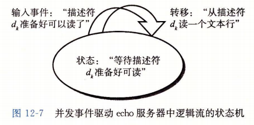


服务器使用I/O多路复用，借助 select 函数检测输入事件的发生。当每个已连接描述符准备好可读时，服务器就为相应的状态机执行转移，在这里就是从描述符读和写回一个文本行。


代码：

```c
#include "../csapp.h"


typedef struct {
    int maxfd;                      // read_set 中最大的 fd
    fd_set read_set;                // 当前处于活动的 fd 集合
    fd_set ready_set;               // 子集，准备好可以读取的 fd 集合
    int nready;                     // 用于保存 select 返回的数值
    int maxi;                       // 水位，记录clientfd 数组中最高索引
    int clientfd[FD_SETSIZE];       // 活动状态的 fd 集合
    rio_t clientrio[FD_SETSIZE];    // 客户端读取缓冲区
} pool;

int byte_cnt = 0;

void init_pool(int listenfd, pool *p);
void add_client(int connfd, pool *p);
void check_clients(pool *p);


int main(int argc, char **argv){
    int listenfd, connfd;
    socklen_t clientlen;
    struct sockaddr_storage clientaddr;

    static pool pool;

    if (argc != 2){
        fprintf(stderr, "usage: %s <port>\n", argv[0]);
        exit(0);
    }


    // 监听 参数1 指定的端口，绑定 listenfd 到该套接字
    listenfd = open_listenfd(atoi(argv[1]));
    // 初始化客户端连接池的函数
    init_pool(listenfd, &pool);


    while(1) {
        // 重置 ready_set 
        pool.ready_set = pool.read_set;
        // 调用 select 函数，保存返回的准备好的值到 nready
        pool.nready = select(pool.maxfd+1, &pool.ready_set, NULL, NULL, NULL);
    
        // 如果 listenfd 打开了，说明有新的客户端连接
        if (FD_ISSET(listenfd, &pool.ready_set)) {
            clientlen = sizeof(struct sockaddr_storage);
            // 调用 accept 绑定客户端到 connfd
            connfd = accept(listenfd, (SA *)&clientaddr, &clientlen);
            // 调用 add_client 函数增加新的客户端connfd 到连接池
            add_client(connfd, &pool);
        }

        check_clients(&pool);

    }
}


void init_pool(int listenfd, pool *p){
    // 初始化客户端连接池，将 clientfd 所有元素都置为-1
    int i;
    p->maxi = -1;
    for (i = 0; i < FD_SETSIZE; i++)
        p->clientfd[i] = -1;

    // 初始化 maxfd
    p->maxfd = listenfd;
    // 将 read_set 清空
    FD_ZERO(&p->read_set);
    // 打开 read_set 中的 listenfd 对应位
    FD_SET(listenfd, &p->read_set);
}


void add_client(int connfd, pool *p){
    int i;
    p->nready--;
    // 找到一个可用槽位，存放 connfd 到该槽位
    for ( i = 0; i< FD_SETSIZE; i++)
        if (p->clientfd[i] < 0){
            p->clientfd[i] = connfd;
            // 初始化 clientrio 缓冲区
            Rio_readinitb(&p->clientrio[i], connfd);

            // 增加connfd 到 read_set 中
            FD_SET(connfd, &p->read_set);


            // 更新 maxfd 和 maxi 的值
            if(connfd > p->maxfd)
                p->maxfd = connfd;
            if(i > p->maxi)
                p->maxi = i;

            break;
        }

    // 没找到空的槽位，报错
    if ( i == FD_SETSIZE )
        app_error("add_client error: Too many clients");
}

void check_clients(pool *p){
    int i, connfd, n;
    char buf[MAXLINE];
    rio_t rio;

    // 循环检查，p->nready 的值表示 select 函数返回准备好的 fd 数量
    for ( i = 0; (i <= p->maxi) && ( p->nready > 0) ; i++){
        // connfd 指向 当前处理的 fd，rio 指向缓冲区
        connfd = p->clientfd[i];
        rio = p->clientrio[i];


        // 如果 FD_ISSET 返回表示该 fd 已就绪，读取一行数据
        if ((connfd > 0) && FD_ISSET(connfd, &p->ready_set)) {
            // 每处理一个 fd，就将已就绪的 nready--
            p->nready--;
            if((n = Rio_readlineb(&rio, buf, MAXLINE)) != 0){
                // 记录读取的字节数
                byte_cnt += n;
                printf( "Server received %d (%d total) bytes on fd  %d\n", n, byte_cnt, connfd);
                // 写回数据到客户端
                rio_writen(connfd, buf, n);
            }
            // 检测到 EOF 标志，关闭connfd
            else {
                close(connfd);
                // 清除 read_set 集合中对应 fd 位
                FD_CLR(connfd, &p->read_set);
                // 将对应槽位置为可用
                p->clientfd[i] = -1;
            }
        }
    }
}
```


`select` 函数检测到输入事件，`add_client` 函数创建一个新的逻辑流(状态机)。`check_clients` 函数回送输入行，从而执行状态转移，当客户端完成文本行发送时，删除这个状态机。


### I/O 多路复用技术的优劣

优点：

* 比基于进程的设计给程序员更多的对程序行为的控制。
* 运行在单一进程上下文中，每个逻辑流都能访问该进程的全部地址空间。在流之间共享数据很容易。
* 通常比基于进程的设计要高效，因为不需要进程上下文切换


缺点：

* 编码复杂，随着并发粒度的减小，复杂度还会上升。
  * 这里的粒度是指每个逻辑流每个时间片执行的指令数量
  * 上面代码中并发粒度就是读取一行文本所需要的指令数量
  * 只要逻辑流忙于读一个文本行，其他逻辑流就没有进展
* 不能充分利用多核处理器


## 基于线程的并发编程


**线程(thread)** 就是运行在进程上下文中的逻辑流。线程由内核自动调度。每个线程都有它自己的**线程上下文(thread context)**，包括一个唯一的整数**线程ID(Thread ID, TID)**、栈、栈指针、程序计数器、通用目的寄存器和条件码。所有运行在一个进程里的线程共享该进程的整个虚拟地址空间。  

基于线程的逻辑流结合了基于进程和基于I/O多路复用的流的特性，是两种方法的混合。


### 线程执行模型

多线程地执行模型很多方面和多进程地执行模型是相似的。

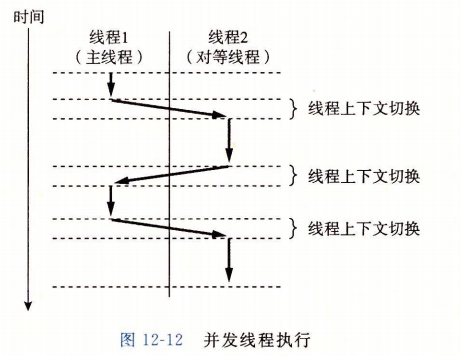

每个进程开始生命周期时都是单一线程，这个线程称为**主线程(main thread)**。在某一时刻，主线程创建一个**对等线程(peer thread)**，从这个时间点开始，两个线程就并发地运行。最后因为主线程执行一个慢速系统调用，例如 read 或者 sleep，或者被系统地间隔计时器中断，控制就会通过上下文切换传递到对等线程。对等线程会执行一段时间，然后控制传递回主线程，依次类推。  


在一些方面，线程执行是不同于进程的：

* 线程的上下文比进程的上下文小得多，因此线程上下文切换比进程的上下文切换快得多
* 线程不是按照严格的父子层次来组织的，和一个进程相关的线程组成一个对等(线程)池，独立于其他进程创建的线程。
  * 主线程和其他线程的区别仅在于它总是进程中第一个运行的线程
  * 一个线程可以杀死它的任何对等线程，或者等待它的任意对等线程终止
* 每个对等线程都能读写相同的共享数据


### Posix 线程

Posix线程(Pthreads) 是在 C 程序中处理线程的一个标准接口。定义了大约 60 个函数，允许程序创建、杀死、回收线程，与对等线程安全地共享数据，通知对等线程系统状态的变化。  


示例：

```c
#include "../csapp.h"
void *thread(void *vargp);

int main(){
    pthread_t tid;
    Pthread_create(&tid, NULL, thread, NULL);
    printf("create new thread, id: %ld\n",tid);
    Pthread_create(&tid, NULL, thread, NULL);
    printf("create new thread, id: %ld\n",tid);
    Pthread_join(tid, NULL);
    exit(0);
}

void *thread(void *vargp){
    printf("Hello, world! My Tid : %ld\n", pthread_self());
    return NULL;
}
```


### 创建线程

线程通过调用 pthread_create 函数创建线程：

```c
#include <pthread.h>
typedef void *(func)(void *);

int pthread_create(pthread_t *tid, pthread_attr_t *attr, func *f, void *arg);
			// 成功返回0， 出错返回非零
```

参数：

* `*tid`：`pthread_t` 是 `unsigned long int` 类型，存放对等线程ID
* `*attr`：用来改变新创建线程的默认属性，书中不涉及，都用NULL
* `*f`：线程例程执行的函数名
* `*arg`：输入变量


获取自己的线程 ID：

```c
#include <pthread.h>

pthread_t pthread_self(void);
	// 返回调用者的线程 ID
```


### 终止线程

一个线程可以通过下列方式终止：

* 顶层的线程例程返回时，线程会隐式地终止。
* 调用 `pthread_exit` 函数，显式地终止。
  * 如果主线程调用 `pthread_exit` ，它会等待所有其他对等线程终止，然后再终止主线程和整个进程，返回值为 `thread_return`。

```c
#include <pthread.h>

void pthread_exit(void *thread_return);
		// 从不返回
```


* 某个对等线程调用 Linux 的 exit 函数，该函数终止进程以及所有与该进程相关的线程。
* 另一个对等线程通过以当前线程 ID 作为参数调用 pthread_cancel 函数来终止当前线程。

```c
#include <pthread.h>

int pthread_cancel(pthread_t tid);
		// 成功返回0，出错返回非零
```


### 回收已终止线程的资源

pthread_join 函数等待其他线程终止：

```c
#include <pthread.h>

int pthread_join(pthread_t tid, void **thread_return);
		// 成功返回 0，出错返回非零
```

pthread_join 函数会阻塞，直到线程 tid 终止，将线程例程返回的通用 (void *) 指针赋值为 thread_return 指向的位置，然后回收已终止线程占用的所有内存资源。  


### 分离线程

在任何一个时间点上，线程是 **可结合的(joinable)** 或者是 **分离的(detached)**。

* 一个可结合的线程能够被其他线程收回和杀死。在被其他线程回收之前，它的内存资源（例如栈）是不释放的。

* 一个分离的线程是不能被其他线程回收或杀死的。它的内存资源在它终止时由系统自动释放。

  

默认情况下，线程被创建成可结合的。为了避免内存泄漏，每个可结合线程都应该要么被其他线程显式地回收，要么通过调用 pthread_detach 函数被分离。

```c
#include <pthread.h>

int pthread_detach(pthread_t tid);
		// 成功返回 0， 出错返回非零
```

`pthread_detach` 函数分离可结合线程 `tid`。线程能够通过调用 `pthread_self()` 为参数地 `pthread_detach` 调用来分离它们自己。  

在高性能 Web 服务器中可能每次收到 Web 浏览器地连接请求时都创建一个新的对等线程。每个连接都由一个单独的线程独立处理的，所以服务器没有必要等待每个对等线程终止。每个对等线程都应该在它开始处理请求之前分离它自身，这样就能在它终止后回收它的内存资源了。


### 初始化线程

pthread_once 函数可以初始化与线程例程相关的状态。

```c
#include <pthread.h>

pthread_once_t once_control = PTHREAD_ONCE_INIT;

int pthread_once(pthread_once_t *once_control, void (*init_routine)(void));
		// 总是返回 0

```

* once_control 变量是一个全局或者静态变量，总是被初始化为 PTHREAD_ONCE_INIT。
* 当你第一次用参数 once_control 调用 pthread_once 时，它调用 init_routine，这是一个没有输入参数，也不返回的函数。
* 接下来的以 once_control 为参数的 pthread_once 调用不做任何事情
* 在需要动态初始化多个线程共享的全局变量时，pthread_once 函数很有用


### 基于线程的并发服务器


```c
#include "../csapp.h"

void echo(int connfd);
void *thread(void *vargp);

int main(int argc, char **argv)
{
    int listenfd, *connfdp;
    socklen_t clientlen;
    // sockaddr_storage 类型的结构体足够大，可以装下任何类型的套接字地址
    struct sockaddr_storage clientaddr;
    pthread_t tid;

    if (argc != 2)
    {
        fprintf(stderr, "usage: %s <port>\n", argv[0]);
        exit(0);
    }

    // 打开 listenfd
    listenfd = open_listenfd(atoi(argv[1]));


    while (1)
    {
        clientlen = sizeof(struct sockaddr_storage);
        // 为每个线程分配内存块存放 connfd，避免竞争导致的bug
        connfdp = Malloc(sizeof(int));
        // 通过指针将内存地址传递给对等线程
        *connfdp = accept(listenfd, (SA *) &clientaddr, &clientlen);
        pthread_create(&tid, NULL, thread, connfdp);
    }
}


void *thread(void *vargp){
    // 获取主线程 main 中分配的 connfd
    int connfd = *((int *)vargp);
    // 分离自己
    pthread_detach(pthread_self());
    // 释放主线程分配的内存块
    free(vargp);
    // 调用 echo 函数
    echo(connfd);
    // 关闭 connfd 
    close(connfd);
    return NULL;
}

void echo(int connfd)
{
    size_t n;
    char buf[MAXLINE];
    rio_t rio;

    rio_readinitb(&rio, connfd);
    // 反复从connfd 读取一行，再写回connfd，直到 EOF 标志
    while ((n = rio_readlineb(&rio, buf, MAXLINE)) != 0)
    //if ((n = rio_readlineb(&rio, buf, MAXLINE)) != 0)
    {
        printf("server received %d bytes \n", (int)n);
        rio_writen(connfd, buf, n);
    }
}
```


## 多线程程序中的共享变量

C 程序中的一个变量是共享的，当且仅当多个线程引用这个变量的某个实例。

示例：

```c
#include <stdio.h>
#include <pthread.h>
#define N 2
void *thread(void *vargp);


char **ptr; /* 全局变量*/

int main() {

    int i;
    pthread_t tid;
    char *msgs[N] = {
        "Hello from foo",
        "Hello from bar"
    };

    ptr = msgs;
    for (i = 0; i < N; i++)
        pthread_create(&tid, NULL, thread, (void *)i);

    pthread_exit(NULL);
}

void *thread(void *vargp){
    int myid = (int)vargp;
    static int cnt = 0;
    printf("[%d]: %s (cnt=%d)\n", myid, ptr[myid], ++cnt);
    return NULL;
}

```


### 线程内存模型

一组并发线程运行在一个进程的上下文中。每个线程都有它自己独立的上下文，包括线程ID、栈、栈指针、程序计数器、通用目的寄存器和条件码。每个线程和其他线程一起共享进程上下文中的剩余部分。包括整个虚拟地址空间，只读文本、读/写数据、堆以及所有共享库代码和数据区域等，线程也共享相同的打开文件的集合。  


### 将变量映射到内存

多线程的 C 程序中变量根据它们的存储类型被映射到虚拟内存：

* **全局变量**。定义在函数之外的变量。在运行时，虚拟内存的读/写区域只包含每个全局变量的一个实例，任何线程都可以引用。例如上面示例中的变量 `ptr`
* **本地自动变量**。定义在函数内部但是没有 `static` 属性的变量。在运行时，每个线程的栈都包含它自己的所有本地自动变量的实例。即使多个线程执行同一个线程例程时也是如此。
  * 例如，一个本地变量 tid 的实例，它保存在主线程的栈中，用 tid.m 表示这个实例。本地变量 myid 有两个实例，一个在对等线程 0 的栈内，另一个在对等线程 1 的栈内，这两个实例分别表示为 myid.p0 和 myid.p1。
* **本地静态变量**。定义在函数内部并有 static 属性的变量。和全局变量一样，虚拟内存的读/写区域只包含在程序中声明的每个本地静态变量的一个实例。
  * 例如示例中的 cnt ，运行时，只有一个 cnt 的实例，每个对等线程都读和写这个实例。


### 共享变量

我们说一个变量 v 是共享的，当且仅当它的一个实例被一个以上的线程引用。

* 例如 cnt 是共享的，它只有一个实例，而被两个对等线程引用。
* myid 不是共享的，因为它的两个实例中每一个都只被一个线程引用。 
* msgs 这种本地自动变量也是能被共享的。


## 用信号量同步线程

共享变量十分方便，但是它们也引入了**同步错误(synchronization error)** 的可能性。


错误示例：

```c
#include "../csapp.h"

void *thread(void *vargp); /* Thread routine prototype */

/* Global shared variable */
volatile int cnt = 0; /* Counter */

int main(int argc, char **argv)
{
    int niters;
    pthread_t tid1, tid2;

    /* Check input argument */
    if (argc != 2)
    {
        printf("usage: %s <niters>\n", argv[0]);
        exit(0);
    }
    niters = atoi(argv[1]);

    /* Create threads and wait for them to finish */
    Pthread_create(&tid1, NULL, thread, &niters);
    Pthread_create(&tid2, NULL, thread, &niters);
    Pthread_join(tid1, NULL);
    Pthread_join(tid2, NULL);

    /* Check result */
    if (cnt != (2 * niters))
        printf("BOOM! cnt=%d\n", cnt);
    else
        printf("OK cnt=%d\n", cnt);
    exit(0);
}

/* Thread routine */
void *thread(void *vargp)
{
    int i, niters = *((int *)vargp);

    for (i = 0; i < niters; i++) // line:conc:badcnt:beginloop
        cnt++;                   // line:conc:badcnt:endloop

    return NULL;
}
/* $end badcnt */
```

运行：

```bash
xmy@xmy:~/cProgram/csapp/conc$ gcc -o badcnt badcnt.c ../csapp.c 
xmy@xmy:~/cProgram/csapp/conc$ ./badcnt 10000
OK cnt=20000
xmy@xmy:~/cProgram/csapp/conc$ ./badcnt 100000
BOOM! cnt=118005
xmy@xmy:~/cProgram/csapp/conc$ 
xmy@xmy:~/cProgram/csapp/conc$ ./badcnt 100000
BOOM! cnt=112782
```

循环增加到一定次数后，会得到错误答案，每次答案还不相同。  

分析问题需要研究计数器循环的汇编代码，主要是线程例程函数中 for 循环部分，将线程 i 的循环代码分解成五个部分：

* $H_i$ ：在循环头部的指令块。
* $L_i$ ：加载共享变量 cnt 到累加寄存器 $\%rdx_i$ 的指令，这里 $\%rdx_i$ 表示线程 i 中的寄存器  $\%rdx$ 的值。
* $U_i$ ：更新（增加） $\%rdx_i$ 的指令。
* $S_i$ ：将  $\%rdx$ 的更新值存回到共享变量 cnt 的指令
* $T_i$ ：循环尾部的指令块

头和尾之操作本地栈变量，而  $ L_i$、$ U_i$、$ S_i$ 操作共享计数器变量的内容。  

当 badcnt.c 中的两个对等线程在一个单处理器上并发运行时，机器指令以某种顺序一个接一个地完成。每个并发执行定义了两个线程中的指令的**某种全序（或者交叉）**。不幸的是，这些顺序中的一些正确，另一些则不会。

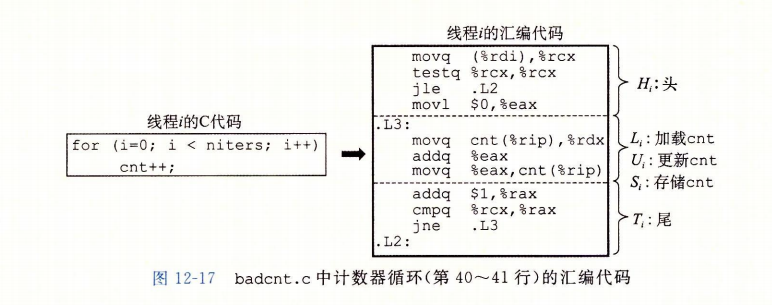

这里的关键点：一般而言，你没有办法预测操作系统是否将为你的线程选择一个正确的顺序。

例如，下图中 a 会产生期望的正确的 cnt 值，b 则产生不正确的 cnt 值：

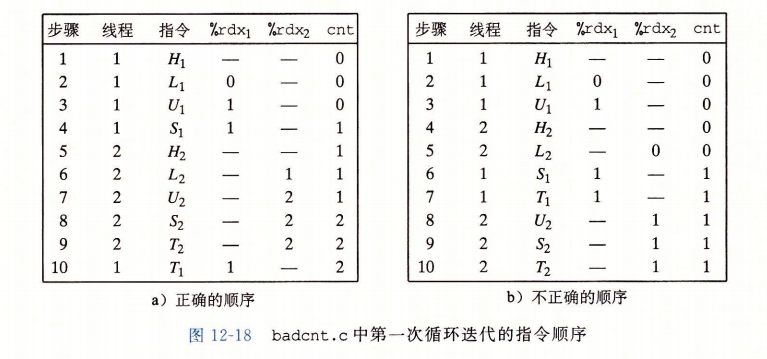


### 进度图

**进度图(progress graph)**将 n 个并发线程的执行模型化为一条 n 维笛卡尔空间中的轨迹线。每条轴 k 对应于线程 k 的进度。每个点($I_1, I_2, \cdot\cdot\cdot, I_n$)代表线程$k(k=1, \cdot\cdot\cdot, n)$已经完成了指令 $I_k$ 这一状态。图的原点对应于没有任何线程完成一条指令的**初始状态**。  


`badcnt.c` 程序第一次循环迭代的二位进度图，横轴是线程1，纵轴是线程 2。点($L_1,  S_2$)对应于线程 1 完成了$L_1$而线程 2 完成了$S_2$的状态

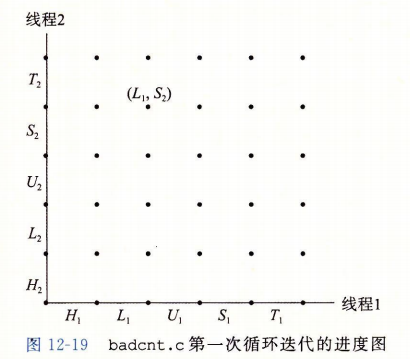

进度图将指令执行模型化为从一种状态到另一种状态的**转换(transition)**。

* 转换被表示为一条从一点到相邻点的有向边。合法的转换是向右（线程 1 中的一条指令完成）或者向上（线程 2 中的一条指令完成）的。
* 两条指令不能再同一时刻完成，即对角线转换是不允许的
* 程序绝不会反向运行，所以向下或者向左移动的转换也是不合法的

`badcnt.c` 执行下面指令的轨迹线：
$$
H_1, L_1, U_1, H_2, L_2, S_1, T_1, U_2, S_2, T_2
$$


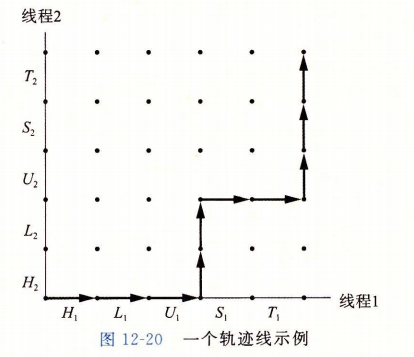

对于线程 i，操作共享变量 cnt 内容的指令( $ L_i$、$ U_i$、$ S_i$ )构成了一个(关于共享变量 cnt 的)**临界区(critical section)**，这个临界区不应该和其他进程的临界区交替执行。我们想要确保每个线程在执行它的临界区的指令时，拥有对共享变量的**互斥访问(mutually exclusive access)**。通常这种现象称为**互斥(mutual exclusion)**。  


进度图中，两个临界区的交集形成的状态空间区域称为**不安全区(unsafe region)**。变量 cnt 的不安全区如下图所示。不安全区和它交界的状态相毗邻，但并不包括这些状态(图中不安全区的边)。例如：$(H_1, H_2)$、$(S1, U2)$。绕开不安全区的轨迹线叫做**安全轨迹线(safe trajectory)**。相反，接触到任何不安全区的轨迹线叫做**不安全轨迹线(unsafe trajectory)**。  


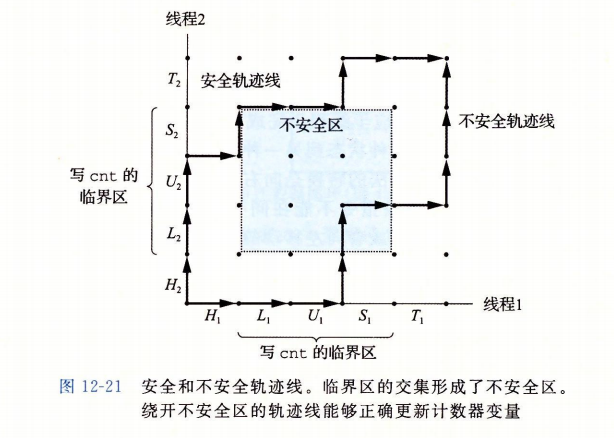


任何安全轨迹线都将正确地共享计数器。为了保证线程化程序实例的正确执行，必须以某种方式同步线程，使它们总是有一条安全轨迹线。信号量是一种经典方法。


### 信号量

Edsger Dijkstra 提出一种经典的解决同步不同执行线程问题的方法，基于一种叫做**信号量(semaphore)**的特殊类型变量。信号量 s 是具有非负整数值的全局变量，只能由两种特殊操作来处理，这两种操作称为 P 和 V：

* `P(s)`：
  * 如果 s 是非零的，那么 P 将 s 减 1，并且立即返回。
  * 如果 s 为零，那么就挂起这个线程，直到 s 变为非零，而一个 V 操作会重启这个线程。在重启之后，P 操作将 s 减 1，并将控制返回给调用者。
  * P 中的测试和减 1 操作是不可分割的，一旦预测信号量 s 会变为非零，就会将 s 减 1，不能有中断。
* `V(s)`：
  * V 操作将 s 加 1。
  * 如果有任何线程阻塞在 P 操作等待 s 变成非零，那么 V 操作总会重启这些线程中的一个，然后该线程将 s 减 1，完成它的 P 操作。
  * V 中的加 1 操作也是不可分割的，加载、加 1 和存储信号量的过程中没有中断。
  * V 的定义中没有定义等待线程被重启动的顺序。唯一的要求是 V 必须只能重启一个正在等待的线程。因此当有多个线程在等待同一个信号量时，你不能预测 V 操作要重启哪一个线程。


P 和 V 的定义确保了一个正在运行的程序绝对不可能进入这样一种状态，也就是一个正确初始化了的信号量有一个负值。这个属性称为**信号量不变性(semaphore invariant)**，为控制并发程序的轨迹线提供了强有力的工具。  

Posix 标准定义了许多操作信号量的函数。  

```c
#include <semaphore.h>

int sem_init(sem_t *sem, 0, unsigned int value);
int sem_wait(sem_t *s);		/* P(s) */
int sem_post(sem_t *s);		/* V(s) */
		// 成功则返回0， 出错则返回 -1
```

`sem_init` 函数将信号量 sem 初始化为 value。每个信号量在使用前必须初始化。可以使用包装函数：

```c
/*******************************
 * Wrappers for Posix semaphores
 *******************************/

void Sem_init(sem_t *sem, int pshared, unsigned int value) 
{
    if (sem_init(sem, pshared, value) < 0)
	unix_error("Sem_init error");
}

void P(sem_t *sem) 
{
    if (sem_wait(sem) < 0)
	unix_error("P error");
}

void V(sem_t *sem) 
{
    if (sem_post(sem) < 0)
	unix_error("V error");
}
```


P、V 的名字来源于荷兰语单词 Proberen(测试) 和 Verhogen(增加)。


### 使用信号量来实现互斥

信号量提供了一种很方便的方法来确保对共享变量的互斥访问。基本思想是将每个共享变量(或者一组相关的共享变量)于一个信号量 s (初始为 1)联系起来，然后用 P(s) 和 V(s) 操作将相应的临界区包围起来。  

以这种方式来保护共享变量的信号量叫做**二元信号量(binary semaphore)**，因为它的值总是 0 或者 1.以提供互斥为目的的二元信号量常常也称为**互斥锁(mutex)**。在一个互斥锁上执行 P 操作称为对互斥锁**加锁**。类似的，执行 V 操作称为对互斥锁**解锁**。对一个互斥锁加了所但是还没有解锁的线程称为**占用**这个互斥锁。一个被用作一组可用资源的计数器的信号量被称为**计数信号量**。

下图展示了如何利用二元信号量来正确地同步计数器程序示例：

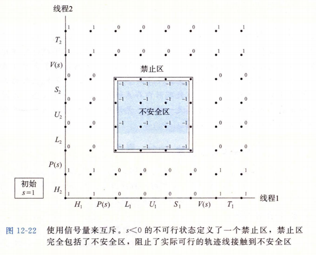

每个状态都标出了该状态中信号量 s 的值。关键思想是这种 P 和 V 操作的结合创建了一组状态，叫做**禁止区(forbidden region)**，其中 $s \le 0$ 。因为信号量的不变性，没有实际可行的轨迹线能够包含禁止区中的状态。而且，因为禁止区完全包括了不安全区，所以没有实际可行的轨迹线能够接触不安全区的任何部分。因此每条实际可行的轨迹线都是安全的，不管运行时执行顺序如何，程序都会正确地增加计数器值。   


在 badcnt.c 中做如下修改：

```c
/* Global shared variable */
volatile int cnt = 0; /* Counter */
sem_t mutex;	/* 新增全局变量信号锁 */

```

```c
/* 在 main 函数中初始化信号 mutex */
	Sem_init(&mutex, 0, 1);

```


```c
/* 在线程例程中 cnt 变量更新前后加上 P、V 操作
	for (i = 0; i < niters; i++) {
        P(&mutex);
        cnt++;                   
        V(&mutex);
    }
```


运行结果：

```bash
xmy@xmy:~/cProgram/csapp/conc$ gcc -o goodcnt goodcnt.c ../csapp.c 
xmy@xmy:~/cProgram/csapp/conc$ ./goodcnt 
usage: ./goodcnt <niters>
xmy@xmy:~/cProgram/csapp/conc$ ./goodcnt 1000000
OK cnt=2000000
xmy@xmy:~/cProgram/csapp/conc$ ./goodcnt 10000000
```


### 利用信号量来调度共享资源

信号量的另一个重要作用是调度对共享资源的访问。一个线程用信号量通知另一个线程，程序状态中的某个条件已经为真了。例如经典的 生产者-消费者、读者-写者 问题。


#### 生产者-消费者

生产者和消费者线程共享一个有 n 个槽的有限缓冲区。生产者反复生成新的项目(item)，并把它们插入到缓冲区中。消费者线程不断地从缓冲区中取出这些项目，然后消费(使用)它们。也可能有很多个生产者和消费者的变种。


* 插入和取出项目都涉及更新共享变量，所以我们必须保证对缓冲区的访问是互斥的。
* 还需要调度对缓冲区的访问，如果缓冲区已满(没有槽位)，生产者必须等待直到一个槽位变为可用。
* 如果缓冲区为空，消费者必须等待直到有一个项目变为可用。

例如：多媒体系统中，编码、解码，使用缓冲区减少视频流的抖动。图形用户接口设计中，生产者检测鼠标、键盘等事件，插入缓冲区，消费者基于某种优先级从缓冲区取出事件显示在屏幕上。


示例：`subf.h`、`sbuf.c`

sbuf_t 结构：

```c
typedef struct {
    int 	*buf;	/* 缓冲区数组指针 */
    int		n;		/* 最大槽位数量 */
    int 	front;	/* 缓冲区中第一个元素 */
    int 	rear;	/* 缓冲区中最后一个元素 */
    sem_t	mutex;	/* 缓冲区访问锁 */
    sem_t	slots;	/* 记录缓冲区可用槽位(用于生产) */
    sem_t	items;	/* 记录缓冲区可用元素(用于消费) */
} sbuf_t;
```

sbuf.c：

```c
#include "../csapp.h"
#include "sbuf.h"

// 初始化缓冲区
void sbuf_init(sbuf_t *sp, int n){
   	/* 分配堆内存 */
    sp->buf = Calloc(n, sizeof(int));
    sp-n = n;
    /* 初始化front、rear为0 */
    sp->front = sp->rear = 0;
    /* 初始化3个信号值 */
    Sem_init(&sp->mutex, 0, 1);
    Sem_init(&sp->slots, 0, n);
    Sem_init(&sp->items, 0, 0);
}

// 释放缓冲区指针
void sbuf_deinit(sbuf_t *sp){
    Free(sp->buf);
}

// 插入元素到缓冲区尾部
void sbuf_insert(sbuf_t *sp, int item){
    P(&sp->slots);	/* 等待可用槽位 */
    P(&sp->mutex);	/* 加锁 */
    /* 增加元素到缓冲区 */
    sp->buf[(++sp->rear)%(sp->n)] = item;	
    V(&sp->mutex);	/* 解锁 */
    V(&sp->items);	/* 可用项目元素增加 */
}

// 移除缓冲区第一个元素
void sbuf_remove(sbuf_t  *sp){
    int item;
    /* 等待可用元素 */
    P(&sp->items);
    /* 加锁 */
    P(&sp->mutex);
    /* 从缓冲区取出元素 */
    item = sp->buf[(++sp->front)%(sp->n)];
    /* 解锁 */
    V(&sp->mutex);
    /* 增加可用槽位数量 */
    V(&sp->slots);
    return item;
}

```


#### 读者-写者

读者-写者问题是互斥问题的一个概括。一组并发的线程要访问一个共享对象，例如一个主存中的数据结构、一个磁盘上的数据库。有些线程只读对象，而其他的线程只修改对象。修改对象的线程叫做写者，只读对象的线程叫做读者。写者必须拥有对对象的独占的访问，而读者可以和无限多个其他的读者共享对象。

读者-写者交互在现实系统中很常见。例如票务预订系统、Web 缓存代理服务器。写者需要有独占的访问，多个读者可以同时查看。  

读者-写者问题有几个变种，分别基于读者和写者的优先级。这里举两类例子：

* 第一类，读者优先，要求不要让读者等待，除非已经把使用对象的权限赋予了一个写者。
* 第二类，写者有限，要求一旦一个写者准备好可以写，他就会尽可能快地完成它的写操作。

第一类示例：

```c
int readcnt;
sem_t mutex, w;

void reader(void){
    P(&mutex);	/* 加锁 */
    readcnt++;	/* 读者增加 */
    if (readcnt == 1)	/* 如果是第一个读者，就加上写锁 */
        P(&w);
    V(&mutex);
    
    /* 读操作 */
    
    P(&mutex);	/* 加锁 */
    readcnt--;	/* 读者减少 */
    if (readcnt == 0) /* 如果是最后一名读者离开，释放写锁 */
        V(&w);
    V(&mutex);	/* 解锁 */
}

void writer(void){
    while (1) {
        P(&w);
        /* 写操作 */
        V(&w);
    }
}
```

上面示例中信号量 w 控制对访问共享对象地临界区地访问。信号量 mutex 保护对共享变量 readcnt 的访问，readcnt 统级当前在临界区中的读者数量。 


对着两种读者-写者问题的正确解答可能导致**饥饿(starvation)**，饥饿就是一个线程无限期地阻塞，无法进展。例如上面的示例中，如果读者一直不断到达，挟制就可能无限的等待。


### 综合：基于预线程化的并发服务器

 **预线程化(prethreading)** 的并发服务器：为每个新客户端创建一个新线程会导致不小的代价，基于生产者-消费者模型可以降低这种开销。服务器是由一个主线程和一组工作者线程构成的。主线程不断地接受来自客户端的连接请求，并将得到的连接描述符存放在一个有限缓冲区中。每个工作者线程反复地从共享缓冲区中取出描述符，为客户端服务，然后等待下一个描述符。

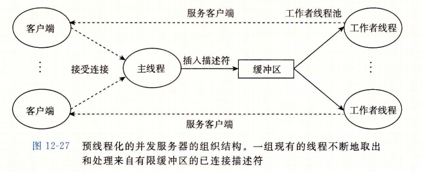

`echoservert-pre.c`：

```c
#include "csapp.h"
#include "sbuf.h"
/* 线程数量 */
#define NTHREADS  4
/* 缓冲池大小 */
#define SBUFSIZE  16

void echo_cnt(int connfd);
void *thread(void *vargp);

sbuf_t sbuf; /* 共享的连接描述符缓冲池 */

int main(int argc, char **argv) 
{
    int i, listenfd, connfd, port;
    socklen_t clientlen=sizeof(struct sockaddr_in);
    struct sockaddr_in clientaddr;
    pthread_t tid; 

    if (argc != 2) {
	fprintf(stderr, "usage: %s <port>\n", argv[0]);
	exit(0);
    }
    port = atoi(argv[1]);
    
    /* 初始化缓冲区 */ 
    sbuf_init(&sbuf, SBUFSIZE); 
    listenfd = Open_listenfd(port);

    /* 创建 NTHREADS 数量的工作线程 */
    for (i = 0; i < NTHREADS; i++)  /
	Pthread_create(&tid, NULL, thread, NULL); 

    /* 将连接描述符插入到缓冲池 */
    while (1) { 
	connfd = Accept(listenfd, (SA *) &clientaddr, &clientlen);
	sbuf_insert(&sbuf, connfd); 
    }
}

void *thread(void *vargp) 
{  
    /* 分离自己 */
    Pthread_detach(pthread_self()); 
    while (1) { 
        
	int connfd = sbuf_remove(&sbuf); /* 从缓冲池取出连接描述符 */
	echo_cnt(connfd);                /* 处理客户端请求 */
	Close(connfd);
    }
}

```

`echo-cnt.c`：

```c
#include "csapp.h"

static int byte_cnt;  /* 读取的字节数 */
static sem_t mutex;   /* 锁 */

static void init_echo_cnt(void)
{
    Sem_init(&mutex, 0, 1);
    byte_cnt = 0;
}

void echo_cnt(int connfd) 
{
    int n; 
    char buf[MAXLINE]; 
    rio_t rio;
    
    /* 初始化，当第一次有某个线程调用 echo_cnt 函数，就会执行 pthread_once 函数区调用初始化函数 init_echo_cnt，之后的线程也会调用 pthread_once 函数，但不会再执行初始化函数 */
    static pthread_once_t once = PTHREAD_ONCE_INIT;

    Pthread_once(&once, init_echo_cnt); 
    Rio_readinitb(&rio, connfd); 
    
    while((n = Rio_readlineb(&rio, buf, MAXLINE)) != 0) {
        /* 加锁后，读取一行数据，更新 byte_cnt ，并打印数据，再解锁，此处的共享变量 byte_cnt 是被保护的，其他线程在解锁前无法操作 */
        P(&mutex);
        byte_cnt += n; 
        printf("thread %d received %d (%d total) bytes on fd %d\n", 
               (int) pthread_self(), n, byte_cnt, connfd); 
        V(&mutex);
        /* 写回数据 */
        Rio_writen(connfd, buf, n);
    }
}
```


## 使用线程提高并行性

目前为止，书中在对并发的研究中，都假设并发线程是在单核处理器系统上执行的。但大多数现代机器具有多核处理器。  

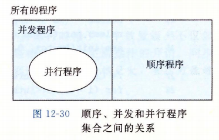

所有的程序能够被划分成不相交的顺序程序集合和并发程序的集合。

* 写顺序程序只有一条逻辑流。
* 写并发程序有多条并发流。
* 并行程序是一个运行在多个处理器上的并发程序，因此并行程序的集合是并发程序的真子集。


### 示例

这里研究一个简单的并行程序场景,考虑如何并行地对一列整数求和：

```
0, ..., n-1
```

对于这个特殊问题，有闭合形式表达式的解答($n(n-1)/2$)。

在并行程序设计中，将任务分配到不同线程最直接的方法是将序列划分成 t 个不相交的区域，然后给 t 个不同的线程每个分配一个区域。假设 n 是 t 的倍数，每个区域有 n/t 个元素。  

最简单也最直接的选择是将线程的和放入一个共享全局变量中，用互斥锁保护这个变量。

`psum-mutex.c`：

```c
#include "../csapp.h"
#define MAXTHREADS 32

/* 线程例程 */
void *sum_mutex(void *vargp);

/* Global shared variables */
long gsum = 0;
long nelems_per_thread;
sem_t mutex; /* 保护上面的 gsum */

int main(int argc, char **argv)
{
    long i, nelems, log_nelems, nthreads, myid[MAXTHREADS];
    pthread_t tid[MAXTHREADS];

    /* Get input arguments */
    if (argc != 3)
    {
        printf("Usage: %s <nthreads> <log_nelems>\n", argv[0]);
        exit(0);
    }
    nthreads = atoi(argv[1]);              /* 线程数量 */
    log_nelems = atoi(argv[2]);            /* 需要求和数的对数 */
    nelems = (1L << log_nelems);           /* 左移求出需要计算的元素数量 */
    nelems_per_thread = nelems / nthreads; /* 每个线程分配的元素数量 */
    sem_init(&mutex, 0, 1);                /* 初始化 mutex 为 1 */

    /* 创建每个线程，等待它们结束 */
    for (i = 0; i < nthreads; i++)
    {
        myid[i] = i;
        Pthread_create(&tid[i], NULL, sum_mutex, &myid[i]);
    }
    for (i = 0; i < nthreads; i++)
        Pthread_join(tid[i], NULL);

    /* 检查最终答案 */
    long answer = (nelems * (nelems - 1)) / 2;
    if (gsum != answer)
        printf("Error: result=%ld, but answer=%ld\n", gsum, answer);
    else
    {
        printf("result=%ld, answer=%ld\n", gsum, answer);
    }

    exit(0);
}

/* Thread routine for psum-mutex.c */
void *sum_mutex(void *vargp)
{
    long myid = *((long *)vargp);          /* 提取主线程发送给当前例程线程的 id */
    long start = myid * nelems_per_thread; /* 当前例程的起始位置 */
    long end = start + nelems_per_thread;  /* 当前例程的结束位置 */
    long i;

    /* 对 gsum 进行操作，每次操作都要加锁 */
    for (i = start; i < end; i++)
    {
        P(&mutex);
        gsum += i;
        V(&mutex);
    }

    return NULL;
}
```

上面程序单线程运行非常慢，比多线程并行执行时慢了一个数量级。而且使用的核数越多越慢。造成性能差的主要原因是相对于内存更新操作的开销，同步操作(P和V)代价太大。  

**同步开销巨大，要尽可能避免。如果无可避免，必须要用尽可能多的有用计算弥补这个开销**。  


一种避免同步的方法是让每个对等线程在一个私有变量中计算它自己的部分和，这个私有变量不与其他线程共享。如下示例，定义了全局数组 psum，每个对等线程 i 把它的部分和累计在 psum[i] 中。因为不同对等线程使用不同的内存位置来更新，所以不需要使用互斥锁来保护这些更新。唯一需要同步的地方是主线程必须等待所有的子线程完成，最后将 psum 向量的元素加起来得到最终结果。

`psum-array.c`：

```c
#include "../csapp.h"
#define MAXTHREADS 32

/* 线程例程 */
void *sum_array(void *vargp);

/* Global shared variables */
long psum[MAXTHREADS];
long nelems_per_thread;

int main(int argc, char **argv)
{
    long i, nelems, log_nelems, nthreads, gsum = 0, myid[MAXTHREADS];
    pthread_t tid[MAXTHREADS];
    

    /* Get input arguments */
    if (argc != 3)
    {
        printf("Usage: %s <nthreads> <log_nelems>\n", argv[0]);
        exit(0);
    }
    nthreads = atoi(argv[1]);              /* 线程数量 */
    log_nelems = atoi(argv[2]);            /* 需要求和数的对数 */
    nelems = (1L << log_nelems);           /* 左移求出需要计算的元素数量 */
    nelems_per_thread = nelems / nthreads; /* 每个线程分配的元素数量 */


    /* 创建每个线程，等待它们结束 */
    for (i = 0; i < nthreads; i++)
    {
        myid[i] = i;
        Pthread_create(&tid[i], NULL, sum_array, &myid[i]);
    }
    for (i = 0; i < nthreads; i++)
        Pthread_join(tid[i], NULL);


    for ( i = 0; i< nthreads; i++)
        gsum += psum[i];
    

    /* 检查最终答案 */
    long answer = (nelems * (nelems - 1)) / 2;
    if (gsum != answer)
        printf("Error: result=%ld, but answer=%ld\n", gsum, answer);
    else
        printf("result=%ld, answer=%ld\n", gsum, answer);

    exit(0);
}

/* Thread routine for psum-array.c */
void *sum_array(void *vargp)
{
    long myid = *((long *)vargp);          /* 提取主线程发送给当前例程线程的 id */
    long start = myid * nelems_per_thread; /* 当前例程的起始位置 */
    long end = start + nelems_per_thread;  /* 当前例程的结束位置 */
    long i;

    /* 对 psum 进行操作 */
    for (i = start; i < end; i++)
        psum[myid] += i;

    return NULL;
}
```


还可以使用本地变量来消除不必要的内存引用，让每个对等线程把它的部分和累积在一个局部变量，而不是全局变量中。

`psum-local.c`：

```c
/* Thread routine for psum-local.c */
void *sum_local(void *vargp)
{
    long myid = *((long *)vargp);          /* 提取主线程发送给当前例程线程的 id */
    long start = myid * nelems_per_thread; /* 当前例程的起始位置 */
    long end = start + nelems_per_thread;  /* 当前例程的结束位置 */
    long i, sum = 0;

    /* 对本地变量 sum 进行操作 */
    for (i = start; i < end; i++)
        sum += i;

    psum[myid] = sum;
    return NULL;
}
```


书中对上面几个程序做的性能测试：

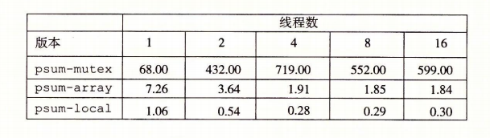

### 刻画并行程序的性能


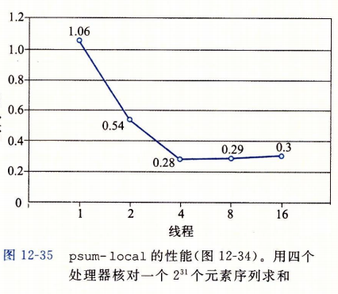

上图是 psum-local 的运行时间，是线程数的函数。程序运行在一个四核处理器的系统上，对 $n=2^{32}$ 个元素的序列求和。随着线程数的增加，运行时间下降，直到增加到四个线程，之后运行时间趋于平稳，甚至增加。  

理想情况下，我们会期望运行时间随着核数增加线性下降。我们期望核数每增加一倍，运行时间就下降一半，直到 $t\gt4$ 的时候，此时四个核中的每一个都忙于运行至少一个线程。随着线程数量的增加，运行时间实际上增加了一点，这是由于一个核上的线程上下文切换的开销。因此并行程序常常被写为每个核上运行一个线程。  

虽然绝对运行时间是衡量程序性能的终极标准，但是还是有一些有用的相对衡量标准能够说明并行程序有多好地利用了潜在的并行性。并行程序的**加速比(speedup)**通常定义为
$$
S_p = \frac {T_1}{T_p}
$$
这里 p 是处理器核数，$T_k$ 是在 k 个核上的运行时间。这个公式有时被称为**强扩展(strong scaling)**。当 $T_1$ 是程序顺序执行版本的执行时间时，$S_p$ 称为**绝对加速比(absolute speedup)**。当 $T_1$ 是程序并行版本在一个核上的的执行时间时，$S_p$ 称为**相对加速比(relative speedup)**。绝对加速比比相对加速比能更真实地衡量并行的好处。即使时当并行程序在一个处理器上运行时，也常常会受到同步开销的影响，而这些开销会人为地增加相对加速比地数值，因为它们增加了分子的大小。绝对加速比比相对加速比更难以测量，因为测量绝对加速比需要程序的两种不同的版本。对于复杂的并行代码，创建一个独立顺序版本不太实际，因为代码太复杂或者源码不可得。一种相关的测量量称为**效率(efficiency)**，定义为：
$$
E_p = \frac{S_p}{p} = \frac {T_1}{pT_p}
$$
通常表示为范围在`(0, 100]` 之间的百分比。效率是对由于并行化造成的开销的衡量。具有高效率的程序比效率低的程序在有用的工作上花费更多的时间，在同步和通信上花费更少的时间。

下图是求和示例程序的各个加速比和效率测量值。超过 90% 的效率是非常好的，但这里是由于示例问题非常容易并行化。实际中很少会有这种情况。

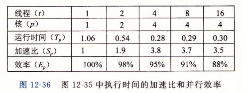

加速比还有另一方面，称为**弱扩展(weak scaling)**，在增加处理器数量的同时，增加问题的规模，这样随着处理器数量的增加，每个处理器执行的工作量保持不变。在这种描述中，加速比和效率被表达为单位时间完成的工作总量。例如，将处理器数量翻倍，同时每个小时也做了两倍的工作量，那么我们就有线性的加速比和100%的效率。  

若扩展通常是比强扩展更真实的衡量值，因为它更准确地反映了我们用更大的机器做更多地工作地愿望。对于应用规模不容易增加的情况，强扩展是合适的，例如实时信号处理应用。


## 其他并发问题


并发程序一旦要求同步对共享数据的访问，同步会引出很多普通顺序执行程序中不会出现的问题。


### 线程安全

**线程安全性(thread safety)**属性：一个函数被称为**线程安全的(thread-safe)**，当且仅当被多个并发线程反复地调用时，它会一直产生正确的结果。如果一个函数不是线程安全的，就说它时**线程不安全的(thread-unsafe)**。  

书中定义出了四类线程不安全函数类：

1. **不保护共享变量的函数**。第五节中的错误示例 thread 函数就有此问题，cnt 变量未被保护。将此类线程不安全的函数变为线程安全的方法就是利用 P、V 之类的同步操作来保护共享变量，优点是不需要修改调用函数的程序，缺点是同步操作会减慢程序执行时间。

2. **保持跨越多个调用的状态的函数**。伪随机数生成器是此类线程不安全函数的示例。

   * ```c
     unsigned next_seed = 1;
     
     unsigned rand(void){
         next_seed = next_seed*1103515245 + 12543;
         return (unsigned)(next_seed>>16) % 32768;
     }
     
     void srand(unsigned new_seed){
         next_seed = new_seed;
     }
     ```

   * rand 函数是线程不安全的，因为当前调用的结果依赖于当前调用的中间结果。当调用 srand 为 rand 设置了一个种子后，我们从一个单线程中反复地调用 rand，能够预期得到一个可重复地随机数字序列。但是当多线程调用 rand 函数，这种假设就不再成立了。

   * 此类函数线程安全地唯一方法就是重写它，使得它不再使用任何 static 数据，而是依靠调用者在参数中传递状态信息。缺点是需要修改现有的调用此函数的代码，如果调用的地方很多将非常麻烦。

3. **返回指向静态变量的指针的函数**。例如 ctime 、gethostbyname，将计算结果放在一个 static 变量中，然后返回一个指向这个变量的指针。如果在并发线程中调用这些函数，有些线程使用或依赖的结果可能会被其它线程修改。

   * 一种处理方法是重写函数，将结果存放在调用者传递过来的变量地址中，需要程序员能够修改源码。

   * 另一种处理方法是 **加锁-复制(lock-and-copy)** 技术。将不安全函数与互斥锁联系起来，每一个调用位置，对互斥锁加锁，保存返回结果到私有内存位置后，再对互斥锁解锁。可以使用包装函数，由包装函数执行加锁-复制，减少调用者的修改。

   * ```c
     char *ctime_ts(const time_t *timep, char *privatep){
         char *sharedp;
         
         /* 加锁、执行ctime、保存结果、解锁 */
         P(&mutex);
         // 调用非线程安全函数 ctime，再将结果拷贝到 privatep 位置
         sharedp = ctime(timep);
         strcpy(privatep, sharedp);
         V(&mutex);
         return privatep;
     }
     ```

     

4. **调用线程不安全函数的函数**。如果函数 f 调用线程不安全函数 g，那么 f 是否就是线程不安全的？

   * 如果 g 是第 2 类函数，即依赖跨越多次调用的状态，那么 f 也是线程不安全的，除了重写 g 之外没有什么办法。
   * 如果 g 是第 1 类或者第 3 类函数，只要使用一个互斥锁保护调用位置和任何得到的共享数据，f 仍然可能是线程安全的。


### 可重入性

有一类重要的线程安全函数，叫做**重入函数(reentrant function)**，其特点在于它们具有这样一种属性：当它们被多个线程调用时，不会引用任何共享数据。尽管线程安全和可重入有时会被用作同义词，但是它们之间有着清晰的技术差别，值得留意。

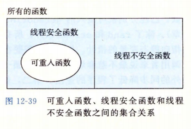

可重入函数通常要比不可重入的线程安全的函数高效一些，因为它们不需要同步操作。将第 2 类线程不安全函数转换为线程安全函数的唯一方法就是重写它，使之变为可重入的。

上面非线程安全 rand 函数的一个可重入版本：

```c
int rand_r(unsigned int *nextp){
    /* 使用调用者传递进来的指针取代 next 静态变量 */
    *nextp =  = *nextp * 1103515245 + 12345;
    return (unsigned int)(*nextp / 65535) % 32768;
}
```

检查一个函数的代码判断它是否可重入的：

* 如果所有的函数参数都是**值传递的(即没有指针)**，并且所有的数据引用都是本地的自动栈变量(即没有引用经i太或全局变量)，那么函数就是**显式可重入的(explicitly reentrant)**，无论它被如何调用，都可以断言它使可重入的。
* 然而如果把假设放宽松一点，允许显式可重入函数中一些参数是**引用传递的(即允许它们传递指针)**，那么我们就得到了一个**隐式可重入的(implicitly reentrant)**函数。也就是说如果调用线程小心地传递指向非共享数据的指针，那么它是可重入的。

术语**可重入的(reentrant)**包括两种类型可重入函数，可重入性有时既是调用者也是被调用者的属性，并不单单是被调用者的属性。


### 在线程化的程序中使用已存在的库函数

大多数 Linux 函数，包括定义在标准 C 库中的函数(例如 malloc、free、realloc、printf、scanf)都是线程安全的，只有一小部分是例外。

常见的线程不安全的库函数：

| 线程不安全函数 | 线程不安全类 | Linux 线程安全版本 |
| -------------- | ------------ | ------------------ |
| rand           | 2            | rand_r             |
| strtok         | 2            | strtok_r           |
| asctime        | 3            | asctime_r          |
| ctime          | 3            | ctime_r            |
| gethostbyaddr  | 3            | gethostbyaddr_r    |
| gethostbyname  | 3            | gethostbyname_r    |
| inet_ntoa      | 3            | 无                 |
| localtime      | 3            | localtime_r        |


### 竞争

当一个程序的正确性依赖于一个线程要在另一个线程到达 y 点之前到达它控制流中的 x 点时，就会发生**竞争(race)**。通常竞争发生是因为程序员假设线程将按照某种特殊的轨迹线穿过执行状态空间，而忘记了另一条准则规定：多线程的程序必须对任何可行的轨迹线都正确工作。  

示例：

```c
#include "../csapp.h"
#define N 4

void *thread(void *vargp);

int main(){
    pthread_t tid[N];
    int i;

    for(i = 0; i < N; i++)
        Pthread_create(&tid[i], NULL, thread, &i);
    for(i = 0; i < N; i++)
        Pthread_join(tid[i], NULL);

    exit(0);
}


void *thread(void *vargp){
    int myid = *((int *)vargp);
    printf("Hello from thread %d\n", myid);
    return NULL;
}
```

主线程和对等线程之间的竞争问题，导致有时对等线程会得到其它线程的 ID（如果在对等线程中变量 myid 引用参数之前，主线程的for循环修改了 i 的值，就会出现）：

```bash
xmy@xmy:~/cProgram/csapp/conc$ ./race 
Hello from thread 2
Hello from thread 4
Hello from thread 2
Hello from thread 3
```

可以通过为每个整数 ID 分配独立的内存块，传递给线程例程这个块的指针：

```c
#include <pthread.h>
#include <stdio.h>
#include <stdlib.h>
#define N 4

void *thread(void *vargp);

int main(){
    pthread_t tid[N];
    int i, *ptr;

    for(i = 0; i < N; i++) {
        ptr = malloc(sizeof(int));
        *ptr = i;
        pthread_create(&tid[i], NULL, thread, ptr);
    }
    
    for(i = 0; i < N; i++)
        pthread_join(tid[i], NULL);

    exit(0);
}


void *thread(void *vargp){
    int myid = *((int *)vargp);
    free(vargp);
    printf("Hello from thread %d\n", myid);
    return NULL;
}
```

运行：

```bash
xmy@xmy:~/cProgram/csapp/conc$ ./norace 
Hello from thread 1
Hello from thread 2
Hello from thread 0
Hello from thread 3
```

书中还介绍了一种方法，通过值传递来避免对 malloc、free 的调用，缺点是在一些旧的系统上可能不兼容(指针大小小于 int 类型)：

```c
#include <pthread.h>
#include <stdio.h>
#include <stdlib.h>
#define N 4

void *thread(void *vargp);

int main(){
    pthread_t tid[N];
    int i;

    for(i = 0; i < N; i++) 
        pthread_create(&tid[i], NULL, thread, (void *)i);
    
    
    for(i = 0; i < N; i++)
        pthread_join(tid[i], NULL);

    exit(0);
}


void *thread(void *vargp){
    int myid = (int )vargp;
    printf("Hello from thread %d\n", myid);
    return NULL;
}
```


### 死锁

信号量引入了一种潜在的运行时错误，**死锁(deadlock)**，它指的是一组线程被阻塞了，等待一个永远也不会为真的条件。进度图对于理解死锁是一个无价的工具。

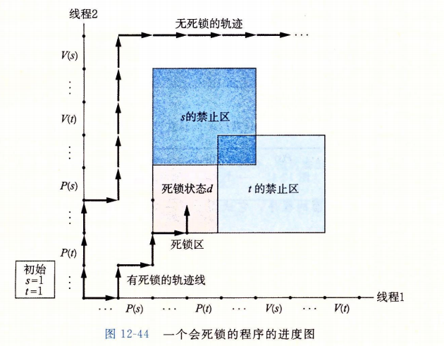

* P、V 操作顺序不当，以至于两个信号量的禁止区域重叠。如果某个执行轨迹线碰巧达到了**死锁状态d**，那么就不可能有进一步的进展了，因为重叠的禁止区域阻塞了每个合法方向上的进展。换句话说，程序死锁是因为每个线程都在等待其它线程执行一个根本不可能发生的 V 操作。
* 重叠的禁止区域引起了一组称为**死锁区域(deadlock region)**的状态。如果一个轨迹线碰巧到达了一个死锁区域中的状态，那么死锁就是不可避免的了。轨迹线可以进入死锁区域，但是它们不可能离开。
* 死锁是一个相当困难的问题，因为它不总是可预测的。一些幸运的执行轨迹将绕开死锁区域，而其他的将会陷入这个区域。上面途中展示了每种情况的一个示例，可能程序 1000 次不出现问题，但下一次就死锁了。或者在一台机器上运行良好，换一台机器就死锁。并且因为不同的执行有不同的轨迹线，错误常常不可重复。


程序死锁有很多原因，要避免死锁一般而言是很困难的。当使用二元信号量来实现互斥时，可以应用一些简单而有效的规则避免死锁：

* **互斥锁加锁顺序规则**：**给定所有互斥操作的一个全序，如果每个线程都是以一种顺序获得互斥锁并以相反的顺序释放，那么这个程序就是无死锁的**。

例如上面示例图中解决方法是：每个线程中先对 s 加锁，再对 t 加锁。得到如下进度图：

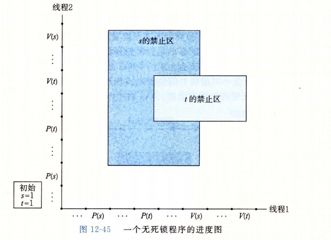

