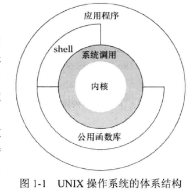
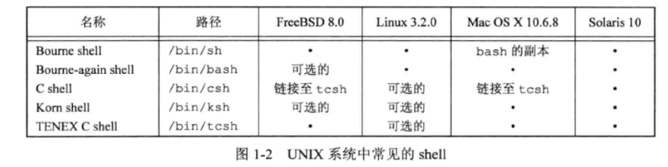
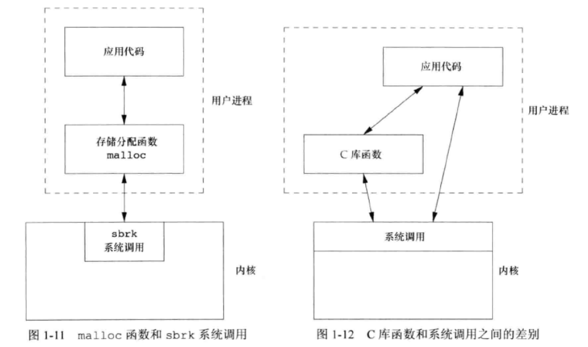

## 引言

所有操作系统都为它们所运行的程序提供服务，典型的服务包括：执行新程序、打开文件、读文件、分配存储区、获取当前时间等。


## 体系结构

**内核(kernel)**控制计算机硬件资源，提供程序运行环境。相对较小，位于环境的核心。内核的接口被称为**系统调用(system call)**。公共函数库构建在系统调用接口之上，应用程序既可以使用公共函数库，也可以使用系统调用。shell 是一个特殊的应用程序，为运行其它应用程序提供了一个接口。





## 登录

### 登录名

用户登录时，系统在口令文件(通常是 /etc/passwd 文件)中查看登录名，口令文件包括7个冒号分隔的字段。登录名、加密口令、数字用户ID、数字组ID、注释、起始目录、shell程序。

### shell




## 文件和目录

### 文件系统

UNIX 文件系统是目录和文件的一种层次结构，所有东西的起点是称为**根(root)**的目录，目录名称用字符 `/` 表示。

**目录(directory)** 是一个包含目录项的文件。每个目录项都包含一个文件名，包含说明该文件属性的信息：文件类型、大小、所有者、权限、修改时间等。stat 、fstat 函数返回包含所有文件属性的一个信息结构。

### 文件名

目录中的各个名字称为**文件名(filename)**。只有斜线`/`和 ` ` 空字符不能出现在文件名中。斜线用来分隔构成路径名的各文件名，空字符则用来终止一个路径名。

但是为了移植性，POSIX.1 标准推荐将文件名限制在以下字符集之内：字母(`A~Z、a~z`)、数字(`0~9`)、句点(`.`)、短横线(`-`)、下划线(`_`)。

创建新目录时会自动创建两个文件名：点 `.` 和 点点`..`。 点指向当前目录，点点指向父目录。在最高层次的根目录，点点和点相同。

### 路径名

由斜线分隔的一个或多个文件名组成的序列构成**路径名(pathname)**，以斜线开头的称为**绝对路径名(absolute pathname)**，否则称为**相对路径名(relative pathname)**。相对路径名指向相对于当前目录的文件。


### 示例

ls 命令的简要实现：

```c
#include "apue.h"
#include <dirent.h>

int
main(int argc, char *argv[])
{
	DIR *dp;
	struct dirent *dirp;

	if (argc !=2)
		err_quit("usage: ls directory_name");

	if((dp = opendir(argv[1])) == NULL)
		err_sys("can't open %s", argv[1]);
	while ((dirp = readdir(dp)) != NULL)
		printf("%s\n", dirp->d_name);

	closedir(dp);
	exit(0);
}

```


### 工作目录

每个进程都有一个**工作目录(working directory)**，有时称其为**当前工作目录(current working directory)**。所有相对路径名都从工作目录开始解释。进程可以用 `chdir` 函数更改其工作目录。


### 起始目录

登录时，工作目录设置为**起始目录(home directory)**，起始目录从口令文件中获取。


## 输入和输出

### 文件描述符

**文件描述符(file descriptor)** 通常是一个小的非负整数，内核用以标识一个特定进程正在访问的文件。当内核打开一个现有文件或创建一个新文件时，它都返回一个文件描述符。在读、写文件时，可以使用这个文件描述符。


### 标准输入、标准输出和标准错误

按照惯例，每当运行一个新程序，所有的shell 都为其打开 3 个文件描述符，**标准输入(standard input)**、**标准输出(standard output)** 以及 **标准错误(standard error)**。如果不做特殊处理，则这 3 个描述符都链接向终端。


### 不带缓冲的 I/O

函数 open、read、write、lseek、close 提供了不带缓冲的 I/O。这些函数都使用文件描述符。


示例，将标准输入复制到标准输出：

```c
#include "apue.h"

#define BUFFSIZE 4096

int
main(void)
{
	int n;
	char buf[BUFFSIZE];

	while ((n = read(STDIN_FILENO, buf, BUFFSIZE)) > 0)
		if (write(STDOUT_FILENO, buf, n) != n)
			err_sys("write error");

	if (n < 0)
		err_sys("read error");

	exit(0);
}
```


### 标准 I/O

标准 I/O 函数为那些不带缓冲的 I/O 函数提供了一个带缓冲的接口。使用标准 I/O 函数无需担心如何选取最佳的缓冲区大小，标准 I/O 函数简化了对输入行的处理。如 fgets 函数读取一个完整的行，read 函数读取指定字节数。 


示例，使用标准I/O 复制标准输入到标准输出：

```c
#include "apue.h"

int 
main(void)
{
	int c;
	while ((c = getc(stdin)) != EOF)
		if (putc(c, stdout) == EOF)
			err_sys("output error");

	if (ferror(stdin))
		err_sys("input error");

	exit(0);
}

```

函数 getc 一次读取一个字符，函数 putc 将此字符写到标准输出。


## 程序和进程

### 程序

**程序(program)** 时一个存储在磁盘上某个目录上的可执行文件。内核使用 exec 函数（7个 exec 函数之一），将程序读入内存，并执行程序。


### 进程和进程ID

程序的执行实例被称为**进程(process)**，某些操作系统用**任务(task)**表示正在被执行的程序。  

UNIX 系统确保每个进程都有一个唯一的数字标识符，称为**进程ID(process ID)**，总是非负整数。

示例，打印进程ID：

```c
#include "apue.h"

int 
main(void)
{

	printf("hello world from process ID %ld\n", (long)getpid());
	exit(0);
}

```


### 进程控制

有3个用于进程控制的主要函数：fork、exec、waitpid。


示例，从标准输入读取命令，然后执行：

```c
#include "apue.h"
#include <sys/wait.h>

int 
main(void)
{

	char buf[MAXLINE];
	pid_t pid;
	int status;

	printf("%% ");
	while (fgets(buf, MAXLINE, stdin) != NULL) {
		if (buf[strlen(buf) - 1] == '\n')
			buf[strlen(buf) - 1] = 0;

		if ((pid = fork()) < 0) {
			err_sys("fork error");
		} else if (pid == 0) {
			execlp(buf, buf, (char *)0);
			err_ret("couldn't execute: %s", buf);
			exit(127);
		}

		/* parent */
		if ((pid = waitpid(pid, &status, 0)) < 0)
			err_sys("waitpid error");
		printf("%% ");
	}
	exit(0);
}

```


### 线程和线程ID

通常一个进程只有一个控制线程(thread)。对于某些问题，使用多个线程分别作用于不同部分，就容易解决，控制线程也可以充分利用多处理器系统的并行能力。  

一个进程内的所有线程共享同一地址空间、文件描述符、栈以及与进程相关的属性。因为它们能访问同一存储区，所以各线程在访问共享数据时需要采取同步措施以避免不一致性。

线程也用 ID 标识，但是只在它所属的进程内起作用。  

控制线程的函数与控制进程的类似，但由于线程模型时进程模型建立很久之后才被引入的，这两种模型之间存在复杂的交互。


## 出错处理

当 UNIX 系统函数出错时，通常会返回一个负值，整型变量 errno 通常被设置为具有特定信息的值。例如 open 函数成功返回非负的文件描述符，出错返回 -1。有些函数则返回 null 。  

文件 `<errno.h>` 中定义了 errno 以及可以赋值给它的各种常量，通常以 E 开头。  

对于 errno 应当注意两条规则：

* 如果没有出错，其值不会被例程清除，因此仅当函数的返回值知名出错时，才检验其值
* 任何函数都不会将 errno 值设置为 0。`<errno.h>` 中定义的所有常量都不为0。

C 标准定义了两个函数，用于打印出错信息：

strerror 函数将 errnum (通常就是 errno 值)映射为一个出错消息字符串，并返回此字符串的指针。

```c
#include <string.h>

char *strerror(int errnum);
		// 返回值：指向消息字符串的指针
```
perror 基于 errno 的当前值，在标准错误上产生一条出错消息，然后返回：

```c
#include <stdio.h>

void perror(const char *msg);
```


示例：

```c
#include "apue.h"
#include <errno.h>

int 
main(int argc, char *argv[])
{
	fprintf(stderr, "EACCES: %s\n", strerror(EACCES));
	errno = ENOENT;
	perror(argv[0]);
	exit(0);
}

```


可以将在 `<errno.h>` 中定义的各种出错分为两类：致命性的和非致命性的。

* 致命性的：无法执行恢复动作，最多能做的是在用户屏幕上打印出错消息或者将出错消息写入日志文件，然后退出
* 非致命性的：有时可以妥善处理
  * 大多数非致命性出错是暂时的，如资源短缺
  * 与资源相关的非致命性出错包括：EAGAIN、ENFILE、ENOBUFS、ENOLCK、ENOSPC、EWOULDBLOCK，有时 ENOMEM 也是非致命性出错。当 EBUSY 指明共享资源正在使用时，也可以将它作为非致命性出错处理。当 EINTR 中断一个慢速系统调用时也可以作为非致命性出错处理。
  * 对于资源相关的非致命性出错的典型恢复操作是延迟一段时间，然后重试


如果能够采用一种合理的恢复策略，那么可以避免应用程序异常终止，进而改善应用程序的健壮性。


## 用户标识

### 用户ID

口令文件中的**用户ID(user ID)**是一个数值，它向系统标识各个不同的用户。管理员在确定一个用户登录名的同时，确认其用户ID，用户不能更改其用户ID。通常每个用户都有一个唯一的用户ID。  

用户ID 为 0 的用户为**根用户(root)**或**超级用户(superuser)**。在口令文件中，通常有一个登录项，登录名为 root，称这种用户的特权为超级用户特权。  

如果一个进程具有超级用户特权，则大多数文件权限检查都不再进行。某些系统功能只向超级用户提供，超级用户对系统有自由的支配权。


### 组ID

口令文件登录项也包括用户的**组ID(group ID)**，它是一个数值。由系统管理员在指定用户登录名时分配的。组被用于将若干用户集合到项目或部门中去。这种机制允许同组的各个成员之间共享资源。


示例，打印用户ID和组ID：

```c
#include "apue.h"

int 
main()
{
	printf("uid = %d, gid = %d\n", getuid(), getgid());
	exit(0);
}

```


### 附属组ID

除了在口令文件中对一个登录名指定一个组ID外，大多数 UNIX 系统版本还允许一个用户属于另外一些组。`/etc/group` 文件中记录了组和属于其中的用户。


## 信号

信号(signal)用于通知进程发生了某种情况。例如某进程执行除法操作，除数为0，则将名为 SIGFPE(浮点异常) 的信号发送给该进程。  

进程由 3 种处理信号的方式：

* 忽略信号。
* 按系统默认方式处理。例如除数为0，系统默认终止该进程。
* 提供一个函数，信号发生时调用该函数，这被称为捕捉该信号。通过提供自编的函数，我们就能知道什么时候产生了信号，并按期望的方式处理它。


示例，从标准输入读命令并执行，修改了对信号 SIGINT 终止进程的动作，打印消息和新提示符：

```c
#include "apue.h"
#include <sys/wait.h>

static void sig_int(int);

int 
main(void)
{

	char buf[MAXLINE];
	pid_t pid;
	int status;

	if (signal(SIGINT, sig_int) == SIG_ERR)
		err_sys("signal error");

	printf("%% ");
	while (fgets(buf, MAXLINE, stdin) != NULL) {
		if (buf[strlen(buf) - 1] == '\n')
			buf[strlen(buf) - 1] = 0;

		if ((pid = fork()) < 0) {
			err_sys("fork error");
		} else if (pid == 0) {
			execlp(buf, buf, (char *)0);
			err_ret("couldn't execute: %s", buf);
			exit(127);
		}

		/* parent */
		if ((pid = waitpid(pid, &status, 0)) < 0)
			err_sys("waitpid error");
		printf("%% ");
	}
	exit(0);
}

void
sig_int(int signo)
{
	printf("interrupt\n%% ");
}

```


## 时间值

历史上 UNIX 系统使用过两种不同的时间值。

### 日历时间

该值是自协调世界时(Coordinated Universal Time, UTC) 1970 年 1 月 1 日 00:00:00 这个特定时间以来所经过的秒数累计值(早期的手册称 UTC 为格林尼治标准时间)。这些时间值可用于记录文件最近一次的修改时间。  

系统基本数据类型 `time_t` 用于保存这种时间值。


### 进程时间

也被称为 CPU 时间，用以度量进程使用的中央处理器资源。进程时间以时钟滴答计算。每秒钟曾取为 50、60 或 100 个时钟滴答。  

系统基本数据类型 clock_t 保存这种时间值。

当度量一个进程的执行时间时，UNIX 系统为一个进程维护了 3 个进程时间值：

* 时钟时间：
  * 时钟时间又称为**墙上时钟时间( wall clock time)**，它是进程运行的时间总量，其值与系统中同时运行的进程数有关。
* 用户 CPU 时间
  * 执行用户指令所用的时间量。
* 系统 CPU 时间
  * 为该进程执行内核程序所经历的时间。

可以使用 time 命令获取进程执行时间。


## 系统调用和库函数

所有的操作系统都提供多种服务的入口点，由此程序向内核请求服务。这些入口点被称为**系统调用(system call)**。  

系统调用接口总是在《UNIX 程序员手册》的第 2 部分说明(例如：`man 2 read` )，使用 C 语言定义的，与具体系统如何调用一个系统调用的实现技术无关。与早期很多操作系统不同，那些系统按传统方式用机器的汇编语言定义内核入口点。  

UNIX 所使用的技术是为每个系统调用在标准 C 库中放置一个具有同样名字的函数。用户进程用标准 C 调用序列来调用这些函数，然后函数又用系统所要求的技术调用相应的内核服务。  

《UNIX 程序员手册》的第 3 部分定义了程序员可以使用的通用库函数，例如 `man 3 printf`。这些函数可能会调用一个或者多个内核的系统调用，但它们并不是内核的入口点。例如 `printf` 函数会调用 `write` 系统调用用以输出一个字符串，但函数 `strcpy` 和 `atoi` 并不使用任何内核的系统调用。  

从实现者角度来看，系统调用和库函数有根本区别，但从用户角度来看，区别不重要。如果希望的话，可以替换库函数，但是系统调用通常是不能被替换的。  

例如 存储空间分配函数 `malloc`，有多种方法可以进行存储空间分配以及与之相关的无用空间回收操作(最佳适配、首次适配等)，并不存在对所有程序都最优的一种技术。 UNIX 系统调用中处理存储空间分配的是 `sbrk(2)`，它不是一个通用的存储器管理器。它按照指定字节数增加或减少进程地址空间。如何管理该地址空间却取决于进程。如果需要我们可以定义自己的 `malloc` 函数。  

应用程序既可以调用系统调用也可以调用库函数。很多库函数也会调用系统调用。     



系统调用通常提供一种最小接口，而库函数通常提供比较复杂的功能。  

进程控制系统调用(fork、exec、wait)通常由用户应用程序直接调用。为了简化某些常见情况，UNIX 系统也提供了一些库函数，例如 system 、popen。