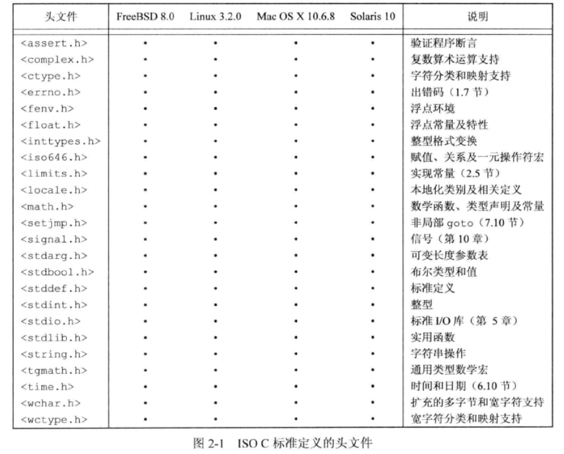
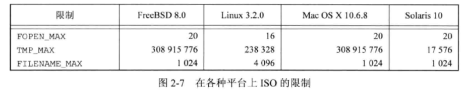
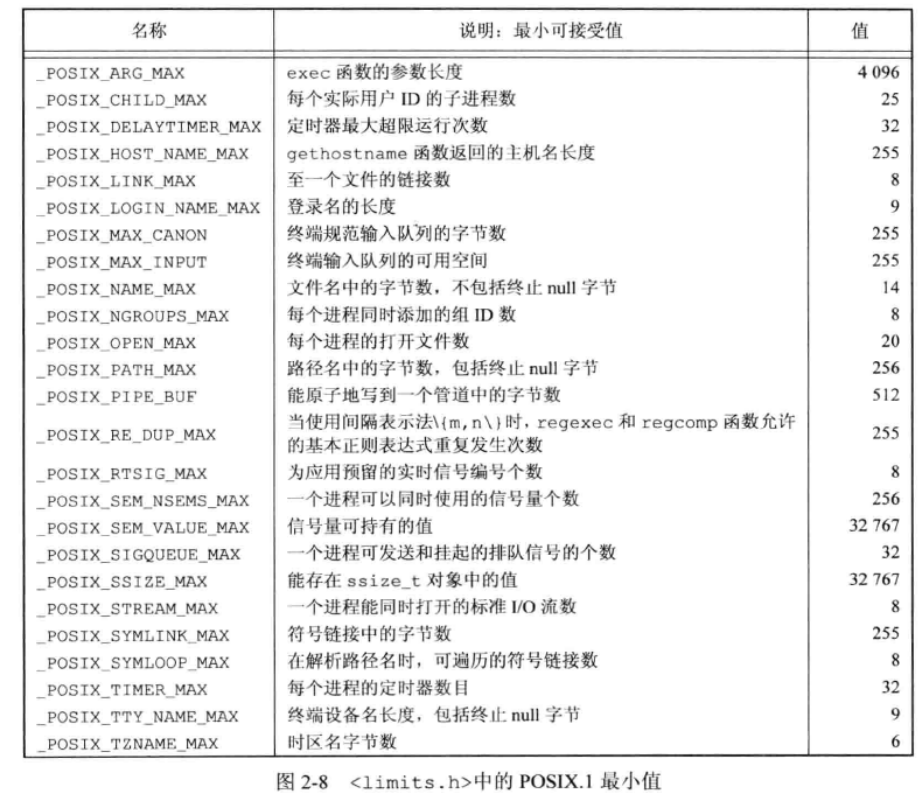
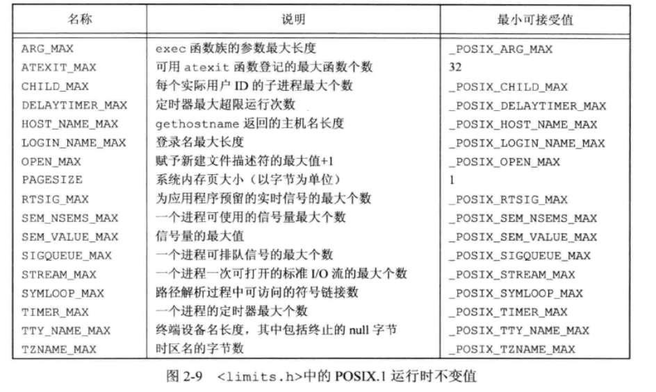
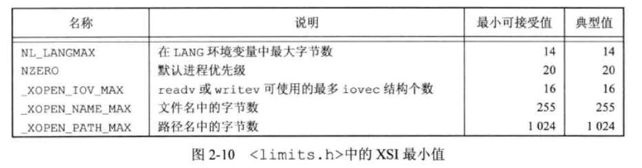
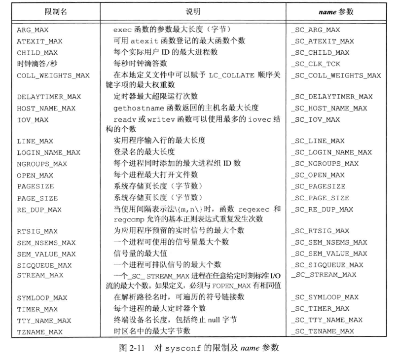
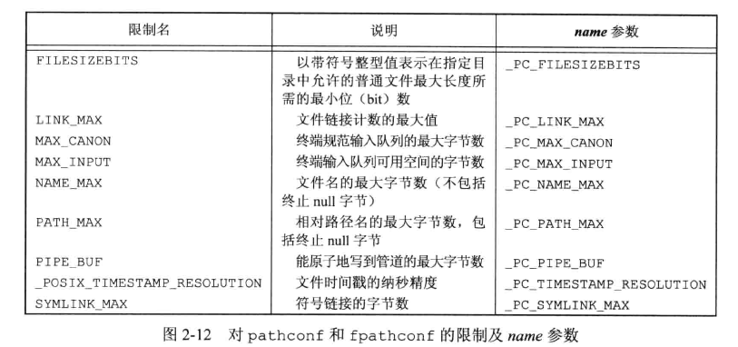
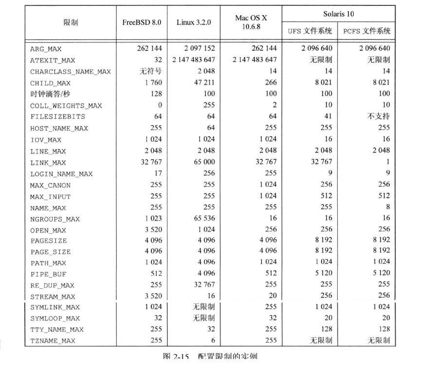
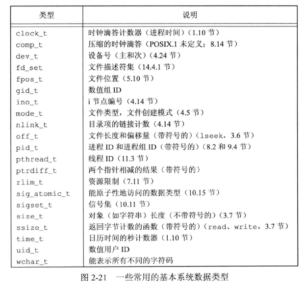

## 引言

UNIX 应用程序在不同的 UNIX 操作系统版本之间移植相当容易，但是在 20 世纪 80 年代 UNIX 版本种类的剧增以及它们之间差别的扩大，导致很多大用户（如美国政府）呼吁对其进行标准化。  


## UNIX 标准化

### ISO C

1989年，基于 ANSI 标准的 `X3.159-1989` 得到批准，被采纳为国际标准 `ISO/IEC 9899:1900` 。ISO C 意图是提供 C 程序的可移植性，使其能适合于大量不同的操作系统，而不只是适合 UNIX 系统。此标准不仅定义了 C 程序设计语言的语法和语义，还定义了其标准库。现今的 UNIX 系统都提供 C 标准中定义的库函数，因此该标准库非常重要。  

1999年，ISO C 标注被更新，改善了对数值处理的应用软件的支持。

  

### IEEE POSIX

POSIX 是一个最初由 IEEE(Institute of Electrical and Electronics Engineers，电器和电子工程师学会)指定的标准族。POSIX 指的是可移植操作系统接口(Portable

 Operating System Interface)。原来指的是 IEEE 标准 `1003.1-1988(操作系统接口)`，后来扩展成包括很多标记为 1003 的标准及标准草案，如 shell 和实用程序(1003.2)。  

1003.1 是操作系统接口标准。目的是提升应用程序在各种 UNIX 系统环境之间的可移植性。  

由于 1003.1 标准说明了一个接口(interface)而不是一种实现(implementation)，所以不区分系统调用和库函数。所有在标准中的例程都被称为**函数**。  


### Single UNIX Specification

Single UNIX Specification(SUS，单一UNIX规范)是 POSIX.1 标准的一个超集，定义了一些附加接口扩展了 POSIX.1 规范提供的功能。  

SUS 是 Open Group 的出版物，Open Group 由 X/Open 和 开放系统软件基金会(Open System Software Foundation，OSF)在 1996 年合并构成的。  

X/Open 在1994年发布第一版 SUSv1，包含 1170 个接口，又称为 `Spec 1170`。

1997年 SUSv2，增加了线程、实时接口、64位处理、达文件、增强的多字节字符处理等。

2004年 SUSv3，主要是技术更正。

2010 年第四版 SUSv4，部分可选接口变成必选接口，包括异步I/O、屏障、时钟选择、存储映像文件、内存保护、读写锁、实时信号、POSIX信号量、旋转锁、线程安全函数、线程、超时机制。


### FIPS

联邦信息处理标准，是美国政府发布的，用于计算机系统采购。


## UNIX 系统实现

UNIX 的各种版本和变体都起源于在 PDP-11 系统上运行的 UNIX 分时系统第 6 版和第 7 版。演进出3个分支：

* `AT&T` 分支，引出 System Ⅲ 和 System Ⅴ
* 加州贝克利分校，引出 `4.xBSD` 实现
* `AT&T` 贝尔实验室的计算科学研究中心开发的 UNIX 研究版本，引出 UNIX分时系统第8、9、10版本，终止于1990年第10版

### SVR4

`AT&T` 的UNIX系统实验室的产品，合并了 SVR3.2、SunOS、4.3BSD、Xenix。


### 4.4BSD

是加州大学贝克利分校的计算机系统研究组(CSRG)研究开发和分发的。  

4.4BSD-Lite 是 CSRG 计划开发的最后一个发行版。


### FreeBSD

基于 4.4 BSD-Lite 操作系统，CSRG 决定终止其在 UNIX 操作系统BSD版本的研发工作后，继续坚持 BSD 系列，形成的 FreeBSD项目。


### Linux

GNU 许可证。Linux Torvalds 在 1991年为替代 MINIX 而研发。后续发展出众多分支版本。


### Mac OS X

核心操作系统称为 Darwin，基于 Mach 内核、FreeBSD操作系统以及面向对象框架的驱动和其它内核扩展的结合。


### Solaris

Sun Microsystems 开发的，基于 SVR4。  

2005年 Sun 公司把 Solaris 系统大部分源码开放，作为 OpenSolaris 开源系统的一部分。


### 其它UNIX系统

已经通过验证的其它 UNIX 版本还有：

* AIX
* HP-UX
* IRIX
* UnixWare


## 标准和实现的关系

各个标准定义了任一实际系统的子集。不同系统在不同程度上符合标准，例如 Linux 与 POSIX 标准。有一些是 UNIX 系统必须的，但却在符合 POSIX 标准的系统中是可选的。


## 限制

UNIX 系统实现定义了很多幻数和常量，其中很多已被硬编码到程序中，或用特定的技术确定。  

两种类型的限制是必须的：

* 编译时限制（例如，短整型的最大值是什么）
* 运行时限制（例如，文件名的长度）

编译时限制可以在头文件中定义，程序在编译时包含这些头文件。运行时限制则要求进程调用一个函数获得限制值。  

某些限制在一个给定的实现中可能是固定的（静态地在头文件中定义），而在另一个实现中则可能是变动的（运行时函数调用）。例如文件名最大字符数，UNIX 支持多种文件系统类型，每种类型有自己的限制，主要提供了3种限制：

* 编译时限制
* 与文件或目录无关的运行时限制（sysconf 函数）
* 与文件或目录有关的运行时限制（pathconf 和 fpathconf 函数）


### ISO C限制

ISO C 定义的所有编译时限制都列在头文件`<limits.h>`中。


其它限制举例：

* 常量 `FOPEN_MAX` 保证可同时打开的标准I/O流的最小个数，定义在 `<stdio.h>` 文件中
* 常量 `TMP_MAX`  tmpnam 函数产生的唯一文件名的最大个数
* 常量 `FILENAME_MAX` ，文件名长度，应避免，推荐 `POSIX.1` 标准的 `NAME_MAX` 和 `PATH_MAX`




### POSIX 限制

`POSIX.1` 定义了很多涉及操作系统限制的常量，与接口有关的主要分成7类：

* 数值限制：`LONG_BIT`、`SSIZE_MAX` 和 `WORD_BIT`
* 最小值：不随系统而改变，一个符合 POSIX.1 的实现应该提供最少这样大的值
* 最大值：`_POSIX_CLOCKRES_MIN`
* 运行时可以增加的值：`CHARCLASS_NAME_MAX`、`COLL_WEIGHTS_MAX`、`LINE_MAX`、`NGROUPS_MAX`、`RE_DUP_MAX`
* 运行时不变值：
* 其它不变值：`NL_ARGMAX`、`NL_MSGMAX`、`NL_SETMAX`、`NL_TEXTMAX`
* 路径名可变值：`FILESIZEBITS`、`LINK_MAX`、`MAX_CANON`、`MAX_INPUT`、`NAME_MAX`、`PATH_MAX`、`PIPE_BUF`、`SYMLINK_MAX`


**最小值**：



**运行时不变值**：




### XSI 限制

* 最小值：



* 运行时不变值：`IOV_MAX`、`PAGE_SIZE`


### 函数 sysconf、pathconf、fpathconf

有一些限制值必须在运行时确定，可以调用这些函数获得：

* sysconf
* pathconf
* fpathconf

```c
#include <unistd.h>

long sysconf(int name);
long pathconf(const char *pathnam, int name);
long fpathconf(int fd, int name);

		// 返回值：成功返回对应值，出错返回-1
```

sysconf 函数所使用的name参数，用于标识系统限制，以`_SC_` 开始的常量：



pathconf 和 fpathconf 函数为标识系统限制所使用的 name 参数，以 `_PC_` 开始的常量用作标识运行时限制：



pathconf 的参数 pathname 和 fpathconf 的参数 fd 有很多限制，如果不满足其中任何一个限制，结果是未定义的：

* `_PC_MAX_CANON` 和 `_PC_MAX_INPUT` 应用的文件必须是终端文件。
* `_PC_LINK_MAX` 和 `_PC_TIMESTAMP_RESOLUTION` 引用的文件可以是文件或目录，如果始目录返回值用于目录本身，而不用与目录内的文件名项。
* `_PC_FILESIZEBITS` 和 `_PC_NAME_MAX` 引用的文件必须是目录，返回值用于该目录中的文件名。
* `_PC_PATH_MAX`引用的文件必须是目录。当所指定的目录是工作目录时，返回值是相对路径名的最大长度。
* `_PC_PIPE_BUF` 引用的文件必须是管道、FIFO或目录。管道或者FIFO，返回值是对所引用管道或FIFO的限制值。对于目录，返回值是对在该目录中创建的任一 FIFO 的限制值。
* `_PC_SYMLINK_MAX` 引用的文件必须是目录。返回值是该目录中符号链接可包含字符串的最大长度。

书中写了一个C程序在各个系统中打印系统配置限制，结果如下：



有些限制报告并不正确，例如 Linux 中 SYMLOOP_MAX 报告成无限制，但是源代码中硬编码中有限制值。


### 不确定的运行时限制

1. 路径名
2. 最大打开文件数


## 选项

POSIX.1 提供了3中对选项的处理方法：

1. 编译时选项定义在 <unistd.h> 中
2. 与文件或目录无关的运行时选项用 sysconf 函数来判断
3. 与文件或目录有关的运行时选项通过调用 pathconf 或 fpathconf 函数来判断


## 功能测试宏

头文件中定义了很多 `POSIX.1` 和 `XSI` 符号。但是除了  `POSIX.1` 和 `XSI` 定义外，大多数实现在这些头文件中也加入了它们自己的定义。如果编译一个程序时，希望它只与 `POSIX` 的定义相关，而不与任何实现定义的常量冲突，就需要定义常量 `_POSIX_C_SOURCE`，如果定义了此常量，所有 `POSIX.1` 头文件都是用此常量来排除任何实现专有的定义。  

常量 `_POSIX_C_SOURCE` 及 `_XOPEN_SOURCE` 被称为**功能测试宏(feature test macro)**。所有功能测试宏都以下划线开始。当要使用它们时，通常在 cc 命令行中使用参数：

```bash
cc -D_POSIX_C_SOURCE=200809L file.c
```

这样 C 程序在包括任何头文件之前，定义了功能测试宏。  

如果仅仅想使用 `POSIX.1` 定义，也可以将源文件第一行设置为：

```c
#define _POSIX_C_SOURCE 200809L
```

为了使 SUSv4 的 XSI 选项可由应用程序使用，需要将常量 `_XOPEN_SOURCE` 定义为 700。

SUS 将 c99 程序定义为 C 编译环境的接口：

```c
c99 -D_XOPEN_SOURCE=700 file.c -o file
```

gcc 可以使用 `-std=c99` 参数启用 `1999 ISO C` 扩展：

```bash
gcc -D_XOPEN_SOURCE=700 -std=c99 file.c -o file
```


## 基本系统数据类型

历史上，某些 UNIX 系统变量和某些 C 数据类型联系在一起，例如主、次设备号存放在 16 位的整型中，但是很多较大的系统需要用 256 个值来标识其设备号。  

头文件`<sys/types.h>` 中定义了某些与实现有关的数据类型，它们被称为**基本系统数据类型(primitive system data type)**。这些数据类型都是用 C 的 typedef 来定义的。绝大多数以 `_t` 结尾。  

用这种方式定义了这些数据类型后，就不再需要考虑因系统不同而变化的程序实现细节。




## 标准之间的冲突

整体而言，这些不同的标准之间配合的很好。但还是可能出现冲突，如果出现 `POSIX.1` 服从 `ISO C` 标准。  

例如 `ISO C` 定义了 clock 函数，它返回进程使用的 CPU 时间，返回值类型为 `clock_t` 类型值，但没有规定它的单位。  

`POSIX.1` 定义了 times 函数，它返回其调用者及其所有终止子进程的 CPU 时间以及时钟时间， 都是 `clock_t` 类型值。sysconf 函数用来获得每秒滴答数。  

Solaris 系统中，clock 返回微秒数(CLOCK_PER_SEC 是 100万)，而 sysconf 为每秒滴答数返回的值是100 


