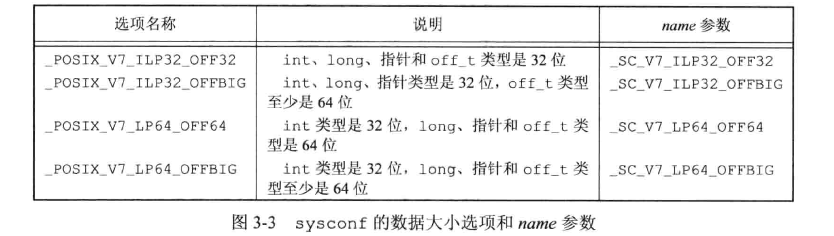
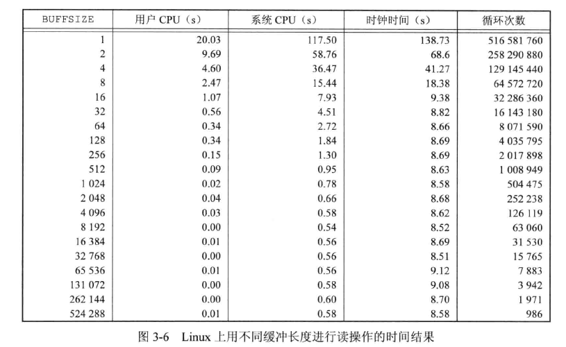
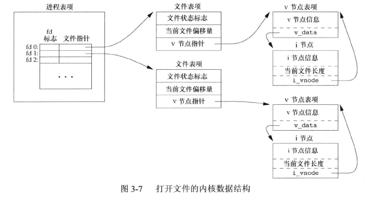
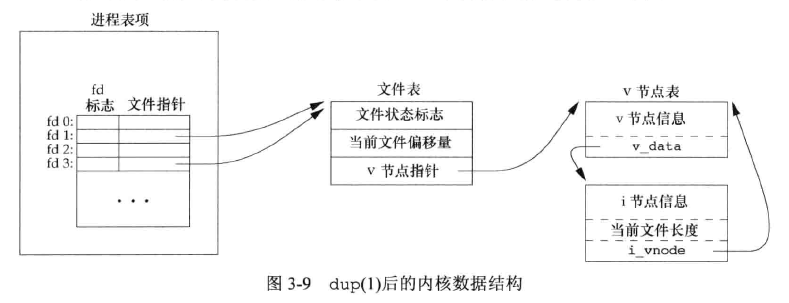
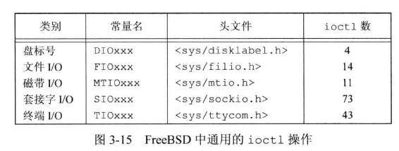

## 引言

打开文件、读文件、写文件所用到的函数：

open、read、write、lseek、close。  

这些函数经常被称为**不带缓冲的I/O(unbuffered I/O)** ，不带缓冲指的是每个 read 和 write 都调用内核中的一个系统调用。这些不带缓冲的 I/O 函数不是 `ISO C` 的组成部分，但是是 `POSIX.1` 和 `SUS` 的组成部分。  

进程间共享文件用到的相关函数：

dup、fcntl、sync、fsync、ioctl。


## 文件描述符

对内核而言，所有打开的文件都通过文件描述符引用。文件描述符(file descriptor,fd)是一个非负整数，当打开一个现有文件或创建一个新文件时，内核向进程返回一个fd。当读、写一个文件时，使用 open 、create 返回的 fd 标识该文件，将其作为参数传递给 read 或 write。  

按照惯例， UNIX 系统的 shell 把 fd 0、1、2 分别与进程的标准输入、标准输出、标准错误关联。

`<unistd.h>` 中定义了符号常量 STDIN_FILENO、STDOUT_FILENO、STDERR_FILENO 分别对应 0、1、2，使用这些符号常量可以提高可读性。


## 函数 open 和 openat


```c
#include <fcntl.h>

int open(char *path, int oflag, ...  /* mode_t mode  */);
int openat(int fd, const char *path, int oflag, ...  /* mode_t mode  */);

		//若成功则返回新文件描述符，若出错返回 `-1`。 
```

最后一个参数 ... ,ISO C 用这种方法表明余下的参数的数量及其类型是可变的。只有当创建新文件时open 才会使用这个参数。  

path 参数是要打开或创建的文件的名字。oflag 参数可用来说明此函数的多个选项，oflag 可以用以下一个或多个常量进行“或”运算：

* O_RDONLY：只读
* O_WRONLY：只写
* O_RDWR：可读可写

```c
大多数实现将 O_RDONLY 定义为 0，O_WRONLY定义为 1， O_RDWR 定义为 2，以兼容早期程序。
```

* O_EXEC：只执行
* O_SEARCH：只搜索(应用于目录)
* O_APPEND：每次写操作之前，设置文件位置到文件的结尾处
* O_CLOEXEC：把 FD_CLOEXEC 常量设置为文件描述符标志
* O_CREAT：如果文件不存在就创建一个截断的(truncated)(空)文件，需要指定参数 mode ，设置文件的访问权限位
* O_DIRECTORY：如果 path 引用的不是目录则出错
* O_EXCL：可以结合 O_CREATE 测试文件是否存在，存在则报错，不存在则创建，这样使得测试和创建是一组原子操作。
* O_NOCTTY：如果 path 引用的是终端设备，则不将该设备分配作为此进程的控制终端。
* O_NOFOLLOW：如果 path 引用的是一个符号链接，则出错。
* O_NONBLOCK：如果 path 引用的是一个FIFO、一个块特殊文件、一个字符特殊文件，则将此选项作为文件的本次打开操作和后续的 I/O 操作设置非阻塞方式。
* O_SYNC：使每次 write 等待物理 I/O 操作完成，包括由该 write 操作引起的文件属性更新所需的 I/O 操作。
* O_TRUNC：如果文件已经存在，写、读写模式可以成功打开，就截断(清空)它
* O_TTY_INIT：如果打开一个还未打开的终端设备，设置非标准 termios 参数值。


open 和 openat 函数返回的 fd 一定是最小的未用 fd 值。此特性被一些应用程序用来在标准输入、标准输出、标准错误上打开新的文件，例如它先关闭标准输出 fd1，然后再打开另一个文件，该文件就一定会再 fd1 上打开。  

openat 的 fd 参数：

* 当 path 指定的是绝对路径名，此时 fd 会被忽略，openat 相当于 open
* path 参数指定的是相对路径名，fd 参数指出了相对路径名在文件系统中的开始地址
* path 参数指定了相对路径名， fd 参数是特殊值 AT_FDCWD ，路径名则在当前工作目录中获取


openat 函数是 POSIX.1 新版本增加的一类函数之一，希望解决：

1. 让线程可以使用相对路径名打开目录中的文件。同一进程中的很多个线程共享相同的当前工作目录，因此很难让同一进程中不同线程同时工作在不同目录中。
2. 避免 time-of-check-to-time-of-use (TOCTTOU) 错误
   * TOCTTOU 错误是：如果由两个基于文件的函数调用，第二个调用依赖于第一个调用的结果，那么程序就是脆弱的。因为两个调用并不是原子操作，两个函数调用之间如果文件被改变，会造成错误结果。


## 函数 create


```c
#include <fcntl.h>

int create(const char *path, mode_t mode  );
		//若成功则返回为只写打开的新文件描述符，若出错返回 `-1`。 
```

等效于：

```c
open(path, O_WRONLY | O_CREATE | O_TRUNC, mode);
```

早期 open 函数第二个参数只能是 0、1、2 其中之一，无法打开一个不存在的文件，需要 create 函数创建。


## 函数 close


```c
#include <unistd.h>

int close(int fd);
		//若成功则返回0，若出错返回 `-1`。 
```

关闭文件，此操作会释放该进程加在该文件上的所有记录锁。  

当一个进程终止时，内核会自动关闭它所有的打开文件。很多程序因此不显式地使用 close 关闭文件。


## 函数 lseek

每个打开文件都有一个与其关联地当前文件偏移量(current file offset)。通常是一个非负整数，用于度量从文件开始处计算的字节数。读、写都从当前文件偏移量处开始，并使偏移量增加所读写字节数。  

按照系统默认，打开一个文件时，除非指定 O_APPEND 选项，否则该偏移量被设置为 0。  

lseek 函数可以显式地设置偏移量

```c
#include <unistd.h>

off_t lseek(int fd, off_t offset, int whence);
		//若成功则返回新的文件偏移量，若出错返回 `-1`。 
```

参数 offset 和 参数 whence 值有关，当 whence 值是：

* SEEK_SET：该文件的偏移量设置为据文件开始处 offset 个字节
* SEEK_CUR：该文件的偏移量设置为其当前值加 offset， offset 可以为正或负
* SEEK_END：将该文件的偏移量设置为文件长度加 offset，offset 可正可负


lseek 执行成功则返回新的文件偏移量，可以用此方法确定打开文件的当前偏移量：

```c
off_t currpos;
currpos = lseek(fd, 0, SEEK_CUR);
```

上述方法也可以用来确定涉及的文件是否可以设置偏移量，如果 fd 指向的是一个管道、FIFO、网络套接字，则 lseek 返回-1，并将 errno 设置为 ESPIPE。  

示例，测试标准输入能否设置偏移量；

```c
#include "stdio.h"
#include "stdlib.h"
#include "stddef.h"
#include "unistd.h"

int 
main(void)
{
	off_t currpos;
	currpos = lseek(STDIN_FILENO, 0, SEEK_CUR);
	if (currpos == -1)
	{
		printf("cannot seek\n");
		printf("%ld\n",(long)currpos);
	}
	else 
	{
		printf("seek ok\n");
		printf("%ld\n",(long)currpos);
	}

	exit(0);
}

```

测试：

```bash
xmy@xmy:~/cProgram/apue_src/chapter_3$ ./3.1 < /etc/passwd
seek ok
0 
xmy@xmy:~/cProgram/apue_src/chapter_3$ cat /etc/passwd | ./3.1 
cannot seek
-1

```


lseek 仅将当前的文件偏移量记录在内核中，并不引起任何 I/O 操作。  

当文件偏移量大于文件当前长度时，对文件的下一次写操作将加长该文件，并在文件中构成一个空洞，文件中没有写过的字节都被读为 0。文件中的空洞不要求在磁盘上占用空间，具体实现取决于文件系统。  

示例，生成空洞文件：

```c
#include "apue.h"
#include <fcntl.h>

char buf1[] = "abcedfghij";
char buf2[] = "ABCEDFGHIJ";

int 
main(void)
{
	int fd;

	if (( fd = creat("file.hole", FILE_MODE)) < 0)
		err_sys("creat error");

	printf("%d",fd);

	if (write(fd, buf1, 10) != 10)
		err_sys("buf1 write error");

	if (lseek(fd, 16384, SEEK_SET) == -1)
		err_sys("lseek error");

	if (write(fd, buf2, 10) != 10)
		err_sys("buf2 write error");


	exit(0);
}
```

执行，使用 od 查看空洞文件，可以看到空洞文件占用8个磁盘块，复制内容出来的 file.nohole 占用 20 个磁盘块：

```bash
## 编译执行，生成 file.hole文件
$ gcc 3.2.c -o 3.2 -L /usr/local/lib/apue/ -lapue
$ ./3.2 

$ od -c file.hole 
0000000   a   b   c   e   d   f   g   h   i   j  \0  \0  \0  \0  \0  \0
0000020  \0  \0  \0  \0  \0  \0  \0  \0  \0  \0  \0  \0  \0  \0  \0  \0
*
0040000   A   B   C   E   D   F   G   H   I   J
0040012
$ cat file.hole 
abcedfghijABCEDFGHIJ
## 将 file.hole 内容输出到 file.nohole，对比大小
$ cat file.hole > file.nohole 
$ ll -sh file.*
8.0K -rw-r--r-- 1 xmy xmy 17K Dec 11 11:13 file.hole
 20K -rw-r--r-- 1 xmy xmy 17K Dec 11 11:17 file.nohole

```


lseek 使用的偏移量是用 `off_t` 类型表示的，具体实现取决于平台，大多数平台提供两组接口以处理文件偏移量，一组使用 32位，另一组使用 64 位。  

SUS 提供了一种通过 sysconf 函数确定支持何种环境的方法：




## 函数 read


```c
#include <unistd.h>

ssize_t read(int fd, void *buf, size_t nbytes);
		// read函数执行成功返回读的字节数，EOF 返回0，出错返回 -1
```

有很多情况使得实际读到的字节数小于要求读的字节数。


## 函数 write


```c
#include <unistd.h>

ssize_t write(int fd, const void *buf, size_t nbytes);
		// write函数执行成功返回写的字节数，出错返回-1
```


## I/O 的效率

示例程序，使用 read、write 函数从标准输入复制到标准输出：

```c
#include "apue.h"

#define BUFFSIZE 4096

int 
main(void)
{

	int n;

	char buf[BUFFSIZE];

	while ((n = read(STDIN_FILENO, buf, BUFFSIZE)) > 0 )
		if (write(STDOUT_FILENO, buf, n) != n)
			err_sys("write error");

	if (n < 0)
		err_sys("read error");


	exit(0);
}

```

书中使用上述程序，不同 BUFFSIZE 值时测试结果：



测试使用 Linux ext4 文件系统，磁盘块长度为 4096字节，图中几个系统 CPU 时间最小值差不多出现在 BUFFSIZE 为 4096 及之后，继续增加缓冲区效果不大。  

大多数文件系统为改善性能都采用某种预读(read ahead) 技术。因此反复测试时，后续很可能会用时少于第一次。


## 文件共享

内核使用3种数据结构表示打开文件，它们之间的关系决定了在文件共享方面一个进程对另一个进程可能产生的影响。  

1. 每个进程在进程表中都有一个记录想，包含一张打开文件描述符表，每个描述符占用一项
   1. 文件描述符标志(close_on_exec)
   2. 指向一个文件表项的指针
2. 内核为所有打开文件维持一张文件表，每个文件表项包含
   1. 文件状态标志
   2. 当前文件偏移量
   3. 指向该文件 v 节点表项的指针
3. 每个打开文件（或设备）都有一个 v 节点（v-node）结构。包含了文件类型和对文件进行各种操作函数的指针，大多数文件还包含了该文件的 i 节点。



如果两个独立进程各自打开了同一文件，关系如下：


每个进程都有各自的一个文件表项，但一个文件只有一个 v 节点表项。当多个进程写同一文件时，可能产生异常，需要了解原子操作避免这种情况。


## 原子操作

### 追加到一个文件

早期 UNIX 的 open 函数没有 O_APPEND 选项，朱家文件只能先使用 lseek 判断当前偏移位置在文件尾端，再写入内容。  

假设有两个进程同时操作，A、B 进程都定位到尾端，准备写入，操作系统内核切换到进程 B，进程 B 写入 100 字节，内核再切换回进程 A，A 在原先的位置又写入，覆盖了进程 B 刚写入的内容。   

问题在于定位到文件尾端和写入分开为两个函数调用，后面 UNIX 提供了 O_APPEND 选项，是一种原子操作方法。


### 函数 pread 和 pwrite

SUS 包括了 XSI 扩展，允许原子性地定位并执行 I/O。pread 和 pwrite 就属于这种扩展。  

```c
#include <unistd.h>
ssize_t pread(int fd, void *buf, size_t nbytes, off_t offset);
		//	返回值：读到的字节数，若已到文件尾，返回0，出错返回-1

ssize_t pwrite(int fd, void *buf, size_t nbytes, off_t offset);
		// 返回值：成功返回已写到字节数，出错返回-1
```

调用 pread 相当于调用 lseek 后调用 read，但又有些区别：

* 调用 pread 时，无法中断其定位和读操作
* 不更新当前文件偏移量

调用 pwrite 相当于调用 lseek 后调用 write，也有上述类似区别。


### 创建一个文件

open 函数的 O_CREATE 和 O_EXCL 选项，被同时指定时，文件又已经存在，open 将失败。这样检查文件是否存在和创建文件就是原子操作。  

如果没有这样的原子操作，先检测文件不存在，再创建文件，这两个操作之间，另一进程创建了文件，则会造成错误。


## 函数 dup 和 dup2

dup 和 dup2 函数可以用来复制一个现有的文件描述符。

```c
#include <unistd.h>
int dup(int fd);
int dup2(int fd, int fd2);
		// 返回值：成功返回新的文件描述符，出错返回-1
```

dup 返回的新文件描述符一定是当前可用 fd 中的最小数值。  

dup2 函数可以通过 fd2 参数指定新文件描述符的值。

* 如果 fd2 已经打开则将其先关闭
* 如果 fd 等于 fd2，则返回 fd2 不关闭它；否则 fd2 的 FD_CLOEXEC 文件描述符标志就会被清除，这样 fd2 在进程调用 exec 时是打开状态

这些函数返回的新文件描述符和参数 fd 共享同一个文件表项：



这里假定 dup() 参数为 1，即：

```c
newfd = dup(1);
```

很有可能返回的 fd 是3，它与 fd1 共享同一文件状态标志(读、写、追加等)以及同一当前文件偏移量。  

复制文件描述符的另一个方法是使用 fcntl 函数。

dup：

```c
dup(fd);
// 等效于
fcntl(fd, F_DUPFD, 0);
```

dup2 类似 close 函数加 fcntl 函数，主要区别有：

* dup2 是一个原子操作， close 和 fcntl 则不是
* dup2 和 fcntl 有一些不同的 errno

```c
dup2(fd, fd2);
// 大致等效于
close(fd2);
fcntl(fd, F_DUPFD, fd2);
```


## 函数 sync、fsync 和 fdatasync

UNIX 系统在内核中设有缓冲区高速缓存或页高速缓存，大多数磁盘 I/O 通过缓冲区进行。我们写入文件时，内核通常先将数据复制到缓冲区，然后排入队列，根据策略写入磁盘，称为**延迟写(delayed write)**。  

当内核需要重用缓冲区存放其它磁盘数据块时，它会把所有延迟写数据块写入磁盘。  

UNIX 提供了 sync、fsync、fdatasync 三个函数，同步缓冲区和磁盘上实际文件系统的数据。  

```c
#include <unistd.h>
int fsync(int fd);
int fdatasync(int fd);
		// 成功返回0， 出错返回-1
void sync(void);
```

sync 函数只是将修改过的块缓冲区排入写队列，然后返回，并不等待实际写磁盘操作结束。  

通常 update 系统守护进程周期性地调用(一般是 30 秒) sync 函数。命令 sync 也会调用 sync 函数。  

fsync 函数只对由参数 fd 指定地一个文件起作用，并且等待写磁盘操作结束才返回。fsync 可以应用于数据库一类应用程序，确保修改过地块立即写到磁盘上。  

fdatasync 函数类似于 fsync，但它只影响文件的数据部分，不会同步文件地属性。


## 函数 fcntl

fcntl 函数可以改变已经打开文件的属性。

```c
#include <fcntl.h>

int fcntl(int fd, int cmd, ... /* int arg */);
		// 返回值：成功则依赖于 cmd，出错返回 -1
```

fcnt 函数有5种功能：

1. 复制一个已有的描述符（cmd=F_DUPFD 或 F_DUPFD_CLOEXEC ）
2. 获取/设置文件描述符标志（ cmd=F_GETFD 或 F_SETFD ）
3. 获取/设置文件状态标志（ cmd=F_GETFL 或 F_SETFL ）
4. 获取/设置异步 I/O 所有权（ cmd=F_GETOWN 或 F_SETOWN ）
5. 获取/设置记录锁（ cmd=F_GETLK 、F_SETLK、F_SETLKW ）


cmd 参数有11种：

* F_DUPFD：复制参数 fd。新文件描述符作为返回值返回。是尚未打开的各描述符种大于或等于第三个参数值中各值集合的最小值。
* F_DUPFD_CLOEXEC：复制并设置与新描述符关联的 FD_CLOEXEC 文件描述符标志的值
* F_GETFD：
* F_SETFD：
* F_GETFL：
  * 
  * 由于历史原因，前五个标志（只读、只写、读写、执行、搜索打开目录）并不各占1位。因此只能先用屏蔽字 O_ACCMODE 取得访问方式位，然后将结果与这 5 各值中的每一个相比较。
* F_SETFL：
* F_GETOWN：获取接收 SIGIO 和 SIGURG 信号的进程 ID 或进程组 ID
* F_SETOWN：设置上述ID
* 记录锁相关：在高级I/O章节介绍
  * F_GETLK
  * F_SETLK
  * F_SETLKW


示例：

```c
#include "apue.h"
#include <fcntl.h>

int main(int argc, char *argv[]){
    int val;

    if (argc != 2)
        err_quit("usage: %s <descriptor#>", argv[0]);

    // 获取文件状态标志，赋值给 val
    if (( val = fcntl(atoi(argv[1]), F_GETFL, 0)) < 0)
        err_sys("fcntl error for fd %d", atoi(argv[1]));

    // 将 val 与 屏蔽字
    switch (val & O_ACCMODE) {
    case O_RDONLY:
        printf("read only");
        break;
    case O_WRONLY:
        printf("write only");
        break;
    case O_RDWR:
        printf("read write");
        break;       
    default:
        err_dump("unknown access mode");
    }    

    // 判断其它文件状态标志
    if (val & O_APPEND)
        printf(", append");
    if (val & O_NONBLOCK)
        printf(", nonblocking");
    if (val & O_SYNC)
        printf(", synchronous writes");

    // 功能测试宏 _POSIX_C_SOURCE
#if !defined(_POSIX_C_SOURCE) && defined(O_FSYNC) && (O_FSYNC != O_SYNC)
    if (val & O_FSYNC)
        printf(", synchronous writes");
#endif

    putchar('\n');
    exit(0);

}
```

编译为 3.11 ，执行：

```bash
## 测试标准输出
$ ./3.11 1
read write, append
## 测试标准输入
$ ./3.11 0
read write, append
## 测试标准错误
$ ./3.11 2
read write, append
## 测试不存在fd
$ ./3.11 3
fcntl error for fd 3: Bad file descriptor
## 测试将/dev/tty 重定向到标准输入
$ ./3.11 0 < /dev/tty
read only
## 测试将标准输出重定向到 temp.foo
$ ./3.11 1 > temp.foo
$ cat !$
cat temp.foo
write only
## 测试将标准错误追加重定向到 temp.foo
$ ./3.11 2 2>>temp.foo 
write only, append
## 测试将标准输入重定向到fd5、标准输出重定向到 temp.foo
$ ./3.11 5 5<>temp.foo
read write

```

设置文件描述符标志或文件状态标志时，需要获取现有标志值，再按照期望设置新标志值。否则直接执行 F_SETFD 或者 F_SETFL 会关闭之前设置的标志位。  

示例，设置文件状态标志函数：

```c
#include "apue.h"
#include <fcntl.h>

void set_fl(int fd, int flags){
    int val;
    
    // 获取当前文件状态并保存
    if (( val = fcntl(fd, F_GETFL, 0)) < 0)
        err_sys("fcntl F_GETFL error");
    
    val |= flags;	/* turn on flags 打开状态标志 */
    
    if (fcntl(fd, F_SETFL, val) < 0)
        err_sys("fcnt F_SETFL error");
}
```

如果将中间的修改标志语句改为：

```c
val &= ~flags;	/* turn flags off 关闭状态标志 */ 
```

就构成另一个函数，清除文件状态，称为 clr_fl。此语句使当前文件状态标志值 val 与 flags 的反码进行逻辑“与”运算。


## 函数 ioctl

ioctl 函数一直是 I/O 操作的杂物箱。使用最多的是终端 I/O。

```c
#include <unistd.h>	/* System V */
#include <sys/ioctl.h> /* BSD and Linux */

int ioctl(int fd, int request, ...);
		// 返回值： 出错返回-1，成功返回其它值

```

通常设备或终端还需要其它的头文件，例如终端 I/O 的 ioctl 命令都需要头文件 `<termios.h>` 。每个设备驱动程序定义自己专用的一组 ioctl 命令，系统为不同种类的设备提供通用的 ioctl 命令。  FreeBSD 支持的通用 ioctl 命令：




## /dev/fd

较新的系统都提供名为 /dev/fd 目录，目录项是名为 0、1、2 等的文件，打开文件 /dev/fd/n 等效于赋值描述符 n。  

但在 Linux 实现中，文件描述符映射成指向底层物理文件的符号链接。使用时要小心，例如 create 会导致指向的底层文件被截断。


