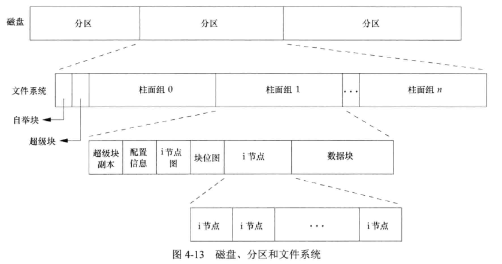
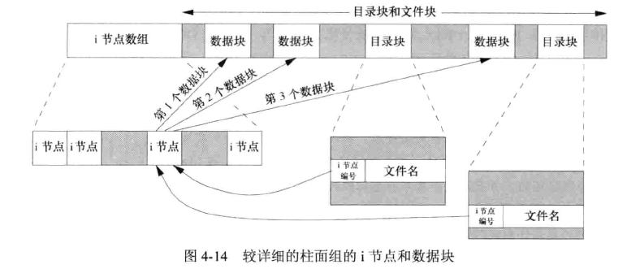
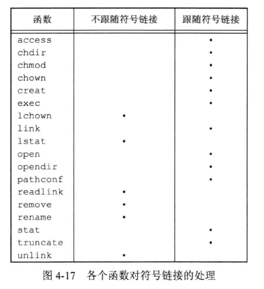
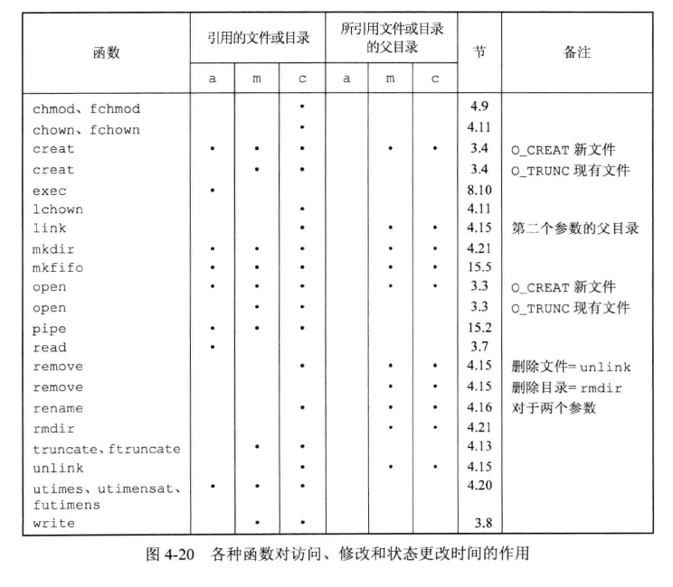
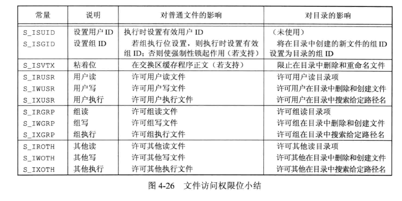

## 引言

主要描述管理文件属性相关函数、UNIX 文件系统的结构、符号链接、操作目录的函数等。


## 函数 stat、fstat、fstatat、lstat


```c
#include <sys/stat.h>

int stat(const char *restrict pathname, struct stat *restrict buf);
int fstat(int fd, struct stat *buf);
int lstat(const char *restrict pathname, struct stat *restrict buf);
int fstatat(int fd, const char *restrict pathname, struct stat *restrict buf, int flag);
					// 成功返回 0，出错则返回 -1
```

* stat 函数：给出 pathname 参数，函数返回与文件相关的信息结构
* fstat 函数：获取已在描述符 fd 上打开文件的信息结构
* lstat 函数：类似于 stat，但当 pathname 是一个符号链接时，lstat 返回该符号链接的有关信息，而不是链接应用的文件的信息。
* fstatat 函数：为相对于 fd 指向的目录的路径名返回文件信息。
  * flag 参数：默认返回符号链接所指向的实际文件的信息，如果设置 `AT_SYMLINK_NOFOLLOW` 标志，fstatat 不会跟随符号链接

buf 参数指向结构体 stat 类型，根据具体实现所有不同，基本形式 stat 的数据结构如下：

```c
struct stat {
    mode_t			st_mode;	// 权限位和文件类型
    ino_t 			st_ino; 	// inode
    dev_t 			st_dev;		// 设备
    dev_t			st_rdev;	// 设备类型
    nlink_t 		st_nlink;	// 链接的数量
    uid_t 			st_uid;		// 属主id
    gid_t			st_gid;		// 属组id
    off_t			st_size;	// 文件大小，单位是字节
    struct timespec			st_atime;	// 最后访问时间
    struct timespec			st_mtime;	// 最后修改时间，部分属性的修改不会改变这个值，例如权限位
    struct timespec			st_ctime;	// 最后修改时间，所有修改都会触发这个时间
    blksize_t 	st_blksize;	// 文件系统的块大小
    blkcnt_t	st_blocks;	// 块号
};
```

timespec 结构类型按照秒和纳秒定义了时间，至少包括：

```c
time_t tv_sec;
long tv_nsec;
```


2008 年以前的标准中，时间字段类型是 `time_t` 类型(单位是秒)。`timespec` 结构则提供了更高精度的时间戳。  

`ls -l` 命令可以获取一个文件所有信息。


## 文件类型

* 普通文件(regular file)：最常用的文件类型。
* 目录(directory)：包含了其它文件的名字以及指向与这些文件有关信息的指针。对目录文件有读权限的程序可以读取目录的内容，但是只有内核可以直接写目录文件，进程必须使用函数才能更改目录。
* 块特殊文件(block special file)：提供对设备带缓冲的访问，每次访问以固定长度为单位
  * FreeBSD 不再支持块特殊文件，设备需要通过字符特殊文件才能访问。
* 字符特殊文件(character special file)：提供对设备不带缓冲的访问，每次访问长度可变。
* FIFO，用于进程间通信，有时也叫 命名通道(named pipe)。
* 套接字(socket)：主要用来与另一个进程进行跨网络通信的文件。
* 符号链接(symbolic link)。指向另一个文件。


`sys/stat.h` 中定义了宏来确定 `st_mode` 成员的文件类型，参数是 mode_t 类型的 st_mode成员：

```c
S_ISREG(m);		// 是普通文件？
S_ISDIR(m);		// 是目录文件？
S_ISCHR(m);		// 是字符特殊文件？
S_ISBLK(m);		// 是块特殊文件？
S_ISFIFO(m);	// 是管道或FIFO？
S_ISLNK(m);		// 是符号链接？
S_ISSOCK(m);	// 是网络套接字？
    
```

还定义了宏用来确定 进程间通信(IPC) 对象的类型，参数是指向 stat 结构的指针：

```c
S_TYPEISMQ(buf);		// 是消息队列？
S_TYPEISSEM(buf);		// 是信号量？
S_TYPEISSHM(buf);		// 是共享存储对象？
```


示例，用于判断文件类型，命令 file 简易版：

```c
#include "apue.h"

int main(int argc, char *argv[]){
    int i;
    struct stat buf;
    char *ptr;


    for(i = 1;i < argc; i++){
        printf("%s: ", argv[i]);

        if(lstat(argv[i], &buf) < 0){
            err_ret("lstat error");
            continue;
        }

        if(S_ISREG(buf.st_mode))
            ptr = "regular";
        else if(S_ISDIR(buf.st_mode))
            ptr = "directory";
        else if(S_ISCHR(buf.st_mode))
            ptr = "charactor special";
        else if(S_ISBLK(buf.st_mode))
            ptr = "block special";
        else if(S_ISFIFO(buf.st_mode))
            ptr = "FIFO";
        else if(S_ISLNK(buf.st_mode))
            ptr = "symbolic link";
        else if(S_ISSOCK(buf.st_mode))
            ptr = "socket";
        else
            ptr = "unknown type";

        
        printf("%s\n", ptr);
    }
    exit(0);
}
```

上面使用了 lstat 函数，以便检测符号链接。

编译成可执行文件 `4.3`，运行测试：

```bash
$ ./4.3 ./4.3 /etc /tmp/test_socket /dev/tty /dev/sg0 /dev/sdb /tmp/test_fifo 
./4.3: regular
/etc: directory
/tmp/test_socket: socket
/dev/tty: charactor special
/dev/sg0: charactor special
/dev/sdb: block special
/tmp/test_fifo: FIFO
```


## 设置用户 ID 和设置组 ID

与一个进程相关联的 ID 有 6 个或更多：

|                   |
| ----------------- |
| 实际用户 ID       |
| 实际组 ID         |
| 有效用户 ID       |
| 有效组 ID         |
| 附属组 ID         |
| 保存的设置用户 ID |
| 保存的设置组 ID   |

* 实际用户 ID 和组 ID 标识我们究竟是谁。取自口令文件中的登录项。
* 有效用户 ID、有效组 ID 以及附属组 ID 决定了我们的文件访问权限
* 保存的设置用户 ID 和组 ID在执行一个程序时包含了有效用户 ID 和有效组 ID 的副本。

通常，有效用户 ID 等于实际用户 ID，有效组 ID 等于实际组 ID。  

每个文件有一个所有者和组所有者，所有者由 stat 结构中的 st_uid 指定，组所有者由 st_gid 指定。  

当执行一个程序文件时，进程有效用户 ID 通常就是实际用户ID，有效组ID通常是实际组ID。但可以在文件模式字(st_mode)中设置一个特殊标志，含义是“当执行此文件时，将进程的有效用户 ID 设置为文件说有着的用户 ID(st_uid)”。与之类似，文件模式字中可以设置另一位，来设置有效组 ID 为文件的组所有者 ID(set_gid)。在文件模式字中的这两位被称为**设置用户 ID(set-user-ID)**位和**设置组 ID(set-group-ID)**位。  

例如，文件所有者是超级用户，设置了该文件的设置用户 ID 位，那么该程序文件执行时，进程具有超级用户权限，无论执行此文件的进程实际用户 ID 是什么。UNIX 系统的 passwd 程序就是如此。该程序能够将用户的新口令写入口令文件：/etc/passwd、/etc/shadow 等，这些口令文件需要超级用户才有写入权限，因此需要使用设置用户 ID 功能。编写此类程序时需要特别谨慎，避免额外权限带来的安全问题。

```bash
$ ll -h /usr/bin/passwd 
-rwsr-xr-x 1 root root 63K May 30  2024 /usr/bin/passwd*
$ file /usr/bin/passwd
/usr/bin/passwd: setuid ELF 64-bit LSB pie executable, x86-64, version 1 (SYSV), dynamically linked, interpreter /lib64/ld-linux-x86-64.so.2, BuildID[sha1]=2344480b478a675609210ed886207d6cbdc8cdd7, for GNU/Linux 3.2.0, stripped

```

设置用户 ID 和设置组 ID 都包含在文件的 st_mode 值中，可以通过常量 S_ISUID 和 S_ISGID 测试。


## 文件访问权限

每个文件(包括目录、字符特殊文件等)有9个访问权限位，分为三类：

| 掩码    | 描述                     |
| ------- | ------------------------ |
| S_IRUSR | 拥有者能够读             |
| S_IWUSR | 拥有者能够写             |
| S_IXUSR | 拥有者能够执行           |
| S_IRGRP | 拥有者所在组成员能够读   |
| S_IWGRP | 拥有者所在组成员能够写   |
| S_IXGRP | 拥有者所在组成员能够执行 |
| S_IROTH | 其它人能够读             |
| S_IWOTH | 其它人能够写             |
| S_IXOTH | 其它人能够执行           |

访问权限以各种方式由不同函数使用，有一些相关规则：

* 我们用名字打开任一类型的文件时，对改名字中包含的每一个目录，包括它可能隐含的当前工作目录都应该具有执行权限。因此执行权限位也常被称为搜索位。
  * 例如：为了打开文件 /usr/include/stdio.h ，需要对目录 /、/usr、/usr/include 具有执行权限，还要对文件本身具有读或者读写权限
  * 对于目录，读权限和执行权限的含义不同。读权限允许我们读取目录，获得该目录中所有文件名的列表。而执行权限允许我们通过该目录进行搜索找到特定文件名。当对目录没有执行权限时，一定找不到该目录下相关文件。
* 对于一个文件的读权限决定了我们是否能够打开现有文件进行读操作。与 open 函数的 O_RDONLY 和 O_RDWR 标志相关。
* 对于一个文件的写权限决定了我们是否能够打开现有文件进行写操作。与 open 函数的 O_WRONLY 和 O_RDWR 标志相关。
* 为了在 open 函数中对一个文件指定 O_TRUNC 标志，必须对该文件具有写权限
* 为了在一个目录中创建文件，必须对该目录具有写权限和执行权限
* 为了删除一个现有文件，必须对包含该文件的目录具有写和执行权限，对该文件本身则不需要读、写权限
* 用 7 个 exec 函数中任何一个执行某文件，都必须对该文件具有执行权限，该文件还必须是一个普通文件。


进程每次打开、创建、删除一个文件时，内核就进行文件访问权限测试，可能涉及文件的所有者、进程的有效 ID、进程的附属组 ID。具体如下：

* 若进程的有效用户 ID 是 0（超级用户），则允许访问
* 若进程的有效用户 ID 等于文件的所有者 ID，那么如果所有者的访问权限位被设置，则允许访问，否则拒绝访问。
* 若进程的有效用户组 ID 或进程的附属组 Id 之一等于文件的组 ID，那么适当的访问权限位被设置，则允许访问，否则拒绝访问。
* 若其他用户适当的访问权限位被设置，则允许访问，否则拒绝访问
* 上述按顺序执行，例如：若进程拥有此文件，则按照用户访问权限允许或拒绝该进程对文件的访问，不查看组、其它用户访问权限位。进程属于某个适当的组，则匹配组访问权限位，不查看其它用户访问权限位。


## 新文件和目录的所有权

创建文件时，新文件的用户 ID 设置为进程的有效用户 ID。组 ID 则根据 POSIX.1 允许选择：

* 新文件的组 ID 可以是进程的有效组 ID
* 新文件的组 ID 可以是它所在目录的组 ID


## 函数 access 和 faccessat

当使用 open 函数打开一个文件时，内核以进程的有效用户 ID 和有效组 ID来执行其访问权限测试。有时候进程希望通过文件的实际用户 ID和实际组 ID 来测试其访问能力。

```c
#include <unistd.h>
int access(const char *pathname, int mode);
int faccessat(int fd, const char *pathname, int mode, int flag);
		// 两个函数的返回值：成功返回0，出错返回-1

```

测试文件是否已经存在，mode 就为 F_OK；否则 mode 是如下常量的按位或：

| mode | 说明         |
| ---- | ------------ |
| R_OK | 测试读权限   |
| W_OK | 测试写权限   |
| X_OK | 测试执行权限 |

`faccessat` 函数在以下情况与 `access` 函数相同：

* pathname 参数为绝对路径
* fd 参数取值为 `AT_FDCWD` 而参数 pathname 为相对路径

否则 faccessat 计算相对于打开目录(fd 指向的)的 pathname。

示例，使用 access 函数使用方法：

```c
#include "apue.h"
#include <fcntl.h>


int main(int argc, char *argv[]){
    if(argc != 2){
        printf("usage: %s <pathname>\n", argv[0]);
        exit(1);
    }
    
    if(access(argv[1], R_OK) < 0)
        printf("can't read %s\n", argv[1]);
    else
        printf("Read OK.\n");

    if(open(argv[1], O_RDONLY) < 0)
        printf("can't open %s\n", argv[1]);
    else
        printf("open file readonly mode ok.\n");
    
    exit(0);
}
```

执行测试：

```bash
$ ./4.8 /etc/passwd
Read OK.
open file readonly mode ok.
$ ./4.8 /root/
can't read /root/
can't open /root/
## 修改程序属主，即实际用户 ID 为 root，添加s权限
$ sudo chown root ./4.8
$ sudo chmod u+s ./4.8
$ ./4.8 /root
can't read /root
open file readonly mode ok.
## 测试可以通过 open 打开，但不能正常读取
```


## 函数 umask

umask 函数为进程设置文件按模式创建屏蔽字，并返回之前的值：

```c
#include <sys/stat.h>

mode_t umask(mode_t cmask);
		// 返回之前的文件模式创建屏蔽字
```

参数 cmask 是文件访问权限常量(S_IRUSR、S_IWUSR等)中的若干个按位“或”构成的。  

在进程创建一个新文件或新目录时，就一定会使用文件模式创建屏蔽字。在文件模式创建屏蔽字中为1的位，在文件 mode 中的相应位一定被关闭。  

示例，先将屏蔽 umask 值设置为0，创建文件 foo_RWRWRW，再用 umask 禁止组和其它用户的访问权限，创建 bar_RW：

```c
#include "apue.h"
#include <fcntl.h>

#define RWRWRW (S_IRUSR|S_IWUSR|S_IRGRP|S_IWGRP|S_IROTH|S_IWOTH)

int main(){
    umask(0);
    if(creat("foo_RWRWRW", RWRWRW) < 0)
        err_quit("create error \n");

    umask(S_IRGRP|S_IWGRP|S_IROTH|S_IWOTH);

    if(creat("bar_RW", RWRWRW) < 0)
        err_quit("create error \n");
    
    exit(0);
}
```

编译执行：

```bash
$ umask
0002
$ ../gcc_a 4.9.c 
$ ./4.9 
$ ll -h
-rw------- 1 xmy  xmy    0 Dec 15 15:50 bar_RW
-rw-rw-rw- 1 xmy  xmy    0 Dec 15 15:50 foo_RWRWRW
$ umask
0002
```

umask 命令可以设置或打印当前 umask 值(一般是登录时 shell 设定的默认值)。像确保任何用户都能读文件，则应该将 umask 设置为 0。  

umask 文件访问权限位含义：

| 屏蔽位 | 含义         |
| ------ | ------------ |
| 0400   | 屏蔽用户读   |
| 0200   | 屏蔽用户写   |
| 0100   | 屏蔽用户执行 |
| 0040   | 屏蔽组读     |
| 0020   | 屏蔽组写     |
| 0010   | 屏蔽组执行   |
| 0004   | 屏蔽其他读   |
| 0002   | 屏蔽其他写   |
| 0001   | 屏蔽其他执行 |


SUS 要求 shell 应该支持符号形式的 umask 命令。符号形式指定许可的权限而非拒绝的权限，两种格式示例：

```bash
$ umask
0002
$ umask -S
u=rwx,g=rwx,o=rx
$ umask 027
$ umask
0027
$ umask -S
u=rwx,g=rx,o=
```


## 函数 chmod、fchmod、fchmodat

更改现有文件的访问权限函数：

```c
#include <sys/stat.h>

int chmod(const char *pathname, mode_t mode);
int fchmod(int fd, mode_t mode);
int fchmodat(int fd, const char *pathname, mode_t mode, int flag);
		// 返回值：成功返回0，出错返回-1
```

chmod 函数再指定的文件上进行操作，fchmod 函数则对已打开的文件进行操作。  

`fchmodat` 函数在以下情况与 `chmod` 函数相同：

* pathname 参数为绝对路径
* fd 参数取值为 `AT_FDCWD` 而参数 pathname 为相对路径

否则 `fchmodat` 计算相对于打开目录(fd 指向的)的 pathname。  

flag 参数可以用于改变 `fchmodat` 的行为，当设置了 `AT_SYMLINK_NOFOLLOW` 标志时，`fchmodat`  并不会跟随符号链接。  

改变一个文件的权限位，进程的有效用户 ID 必须等于文件的所有者 ID，或者该进程必须具有超级用户权限。  

mode 参数是如下常量的按位与：

| mode    | 说明               |
| ------- | ------------------ |
| S_ISUID | 执行时设置用户ID   |
| S_ISGID | 执行时设置组ID     |
| S_ISVTX | 保存正文（粘着位） |
| S_IRWXU | 用户读、写和执行   |
| S_IRUSR | 用户读             |
| S_IWUSR | 用户写             |
| S_IXUSR | 用户执行           |
| S_IRWXG | 组读、写和执行     |
| S_IRGRP | 组读               |
| S_IWGRP | 组写               |
| S_IXGRP | 组执行             |
| S_IRWXO | 其他读、写和执行   |
| S_IROTH | 其他读             |
| S_IWOTH | 其他写             |
| S_IXOTH | 其他执行           |

上面的常量是在文件访问权限的基础上增加了 6 个，分别是两个设置 ID 常量：S_ISUID 和 S_ISGID、保存正文常量：S_ISVTX、三个组合常量：S_IRWXU、S_IRWXG、SIRWXO。

示例，使用 chmod 函数修改之前创建的 foo、bar 文件权限：

```c
#include "apue.h"


int main(){
    struct stat statbuf;

    if(stat("foo_RWRWRW", &statbuf) < 0)
        err_quit("stat error \n");
    
    // 关闭组执行权限，设置组 ID
    if(chmod("foo_RWRWRW", (statbuf.st_mode & ~S_IXGRP) | S_ISGID) < 0)
        err_quit("chmod error for foo_RWRWRW\n");


    // 设置权限为 rw-r--r--
    if(chmod("bar_RW", S_IRUSR | S_IWUSR | S_IRGRP | S_IROTH) < 0)
        err_quit("chmod error for bar_RW \n");
    
    exit(0);
}
```

编译执行：

```bash
$ ../gcc_a 4.12.c 
$ ll -h *RW*
-rw------- 1 xmy xmy 0 Dec 15 15:50 bar_RW
-rw-rw-rw- 1 xmy xmy 0 Dec 15 15:50 foo_RWRWRW
$ ./4.12 
$ ll -h *RW*
-rw-r--r-- 1 xmy xmy 0 Dec 15 15:50 bar_RW
-rw-rwSrw- 1 xmy xmy 0 Dec 15 15:50 foo_RWRWRW
```

上面示例不管文件 bar 的权限位如何，将其设置为一个绝对值。  

对于文件 foo，先调用 stat 获取其当前权限，然后打开设置组 ID位、关闭组执行位。ls 命令将组织性权限表示为 S，代表设置组 ID 位已经设置，组执行位未设置。  


## 粘着位

UNIX 早期版本中，S_ISVTX 被称为**粘着位(sticky bit)**。如果一个可执行程序这一位被设置了，那么当该程序第一次被执行，终止后，程序正文部分（机器指令））的一个副本会被保存在交换区。后来的版本称它为**保存正文位(saved-text bit)**，如今较新的 UNIX 大多都配置了虚拟存储系统以及快速文件系统，不再需要此技术。  


## 函数 chown、fchown、fchownat、lchown

用于改变文件用户 ID、组 ID 的函数：

```c
#include <unistd.h>

int chown(const char *pathname, uid_t owner, gid_t group);
int fchown(int fd, uid_t owner, gid_t group);
int fchownat(int fd, const char *pathname, uid_t owner, gid_t group, int flag);
int lchown(const char *pathname, uid_t owner, gid_t group);
		 // 成功返回0，出错返回-1
```

参数 owner、group 中的任意一个是 -1，则对应 ID 不变。  

在符号链接情况下，lchown 和 fchownat(设置了 AT_SYMLINK_NOFOLLOW 标志)更改符号链接本身，而不是该符号链接所指向的文件的所有者。  

fchown 函数修改 fd 参数指向的打开文件的所有者，不能用于改变符号链接。  

基于 BSD 的系统只有超级用户才能修改一个文件的所有者，以防止用户改变其文件权限从而摆脱磁盘空间限额对它们的限制，System V 则允许任一用户修改他们所拥有文件的所有者。POSIX.1 允许根据 `_POSIX_CHOWN_RESTRICTED` 常量的值，选择一种方式。


## 文件长度

stat 结构体成员 st_size 表示以字节为单位的文件的长度。只针对普通文件、目录文件、符号链接有意义。

* 普通文件：文件长度可以是 0，开始读取时将得到 EOF 标志。
* 目录：文件长度通常是一个数的整数倍（例如 16、512）
* 符号链接：文件长度是文件名中的实际字节数，不包含结尾的 null 字节

大多数现代 UNIX 提供 st_blksize、st_blocks ，第一个对文件I/O 较合适的块长度，第二个是所分配的实际 512 字节(有些 UNIX 版本可能不一定是，不具备移植性)块块数。  

**文件中的空洞**  

空洞是由设置的偏移量超过了文件尾端，并写入新的数据后导致的。此时文件长度和实际占用的磁盘空间不一致。  

使用 cat 一类的程序复制包含空洞的文件，空洞部分都会被填满为 0。


## 文件截断

有时需要在文件尾端截断一些数据以缩短文件。将一个文件截断为 0 是特例。

```c
#include <unistd.h>

int truncate(const char *pathname, off_t length);
int ftruncate(int fd, off_t length);
		// 成功返回0，出错返回-1
```

将现有文件长度截断为 length 字节，如果该文件以前的长度大于 length，则超过的数据就不能再访问。如果以前的长度小于 length，文件长度将增加，在以前文件尾端和新的文件尾端之间的数据读作0（也就是创建了空洞）。  


## 文件系统

文件系统类型有很多，例如传统基于 BSD 的 UNIX 文件系统（UFS），读、写 DOS 软盘的文件系统（PCFS），读 CD 的文件系统（HSFS）。  

可以把磁盘分成一个或多个分区，每个分区包含一个文件系统。i 节点是固定长度的记录项，它包含有关文件的大部分信息。



i节点和数据块详细内容：



* 每个 i 节点中都有一个链接计数，其值是指向该 i 节点的目录项数。当链接计数减少至 0 时，才可以删除该文件（释放该文件占用的数据块）。这也是删除一个目录项的函数名为 unlink 而不是 delete 的原因。在 stat 结构体中，链接计数包含在 st_nlink 成员中，其基本系统数据类型是 nlink_t，这种链接类型称为硬链接。POSIX.1 常量 `LINK_MAX` 指定了一个文件链接数的最大值。
* 另一种链接类型称为**符号链接(symbolic link)**。符号链接文件的实际内容(在数据块中)包含了该符号链接所指向的文件的名字。例如 `lib -> usr/lib` ，目录项的文件名是3个字符的字符串 lib，该文件中包含了7个字节的数据 usr/lib。该 i 节点中的文件类型是 S_IFLNK，于是系统知道这是一个符号链接。 
* i 节点包含了文件有关的所有信息：文件类型、文件访问权限位、文件长度、指向文件数据块的指针等。stat 结构体中大多数信息都取自 i 节点。只有 文件名、 i节点编号存放在目录项中。i节点编号的数据类型为 ino_t。
* 目录项中的 i 节点编号指向同一文件系统中的相应 i 节点。一个目录项不能指向另一个文件系统的 i 节点，这就是 ln 命令不能跨越文件系统的原因。
* 当在不更换文件系统的情况下为一个文件重命名时，该文件的实际内容并未移动，只需构造一个指向现有 i 节点的新目录项，并删除老的目录项。链接计数不会变。这也是命令 mv 的操作方式。


目录的链接计数：自身的目录项、该目录中的`.`项、在其子目录中的`..`项，每增加一个子目录该目录的链接计数增加1。


## 函数 link、linkat、unlink、unlinkat、remove

创建一个指向现有文件的链接可以使用 link、linkat 函数：

```c
#include <unistd.h>

int link(const char *existingpath, const char *newpath);
int linkat(int efd, const char *existingpath, int nfd,  const char *newpath, int flag);
		// 成功返回0，出错返回-1
```

引用现有文件 existingpath，创建一个新的目录项 newpath，如果 newpath 已经存在则出错。只创建路径中最后一个分量，之前部分应该已存在。  

对于 linkat 函数：

* 现有文件是通过 efd 和 existingpath 参数指定的
* 新的路径名是通过 nfd和newpath 参数指定的

* 两个路径中任意一个是相对路径，那么它需要通过相对于对应的fd进行计算，如果fd参数其中一个设置为 AT_FDCWD ，那么相对路径名就是对于当前目录
* 如果任一路径是绝对路径，相应的 fd 参数会被忽略
* 当现有文件时符号链接时，由 flag 参数控制 linkat 创建指向现有符号链接的链接还是创建指向现有符号链接所指向文件的链接。如果 flag 参数为 AT_SYMLINK_FOLLOW 标志，就创建指向符号链接目标的链接，如果标志被清除，则创建指向符号链接本身的链接。

很多文件系统的实现不允许对于目录进行硬链接，原因时可能造成循环。  

删除一个现有的目录项，可以调用 unlink：

```c
#include <unistd.h>

int unlink(const char *pathname);
int unlinkat(int fd, const char *pathname,  int flag);
		// 成功返回0，出错返回-1
```

这两个函数删除目录项，并将由 pathname 所引用的文件链接计数减1。  

要解除对文件的链接，必须包含对该目录项的目录具有写和执行权限。如果该目录设置了粘着位，则对该目录必须具有写权限，且具备下列三个条件之一：

* 拥有该文件
* 拥有该目录
* 有超级用户权限

只有链接计数达到 0 时，改为呢家你的内容才可以被删除。如果有进程打开了该文件，其内容也不能被删除。关闭一个文件时，内核先检查文件的进程个数，如果计数达到 0，再去检查链接计数，如果链接计数也是 0，那么就删除该文件内容。  

如果 pathname 参数是相对路径，那么 unlinkat 需要通过相对于对应的 fd 进行计算，如果fd参数设置为 AT_FDCWD ，那么相对路径名就是对于当前目录。如果 pathname 是绝对路径，那么 fd 参数被忽略。  

flag 参数可以配置为 AT_REMOVEDIR 标志，此时 unlinkat 函数可以类似于 rmdir 一样删除目录，此标志被清除时，unlinkat 和 unlink 操作一样。  

示例，unlink 当前目录下 tempfile：

```c
#include "apue.h"
#include <fcntl.h>

int main(){
    if(open("tempfile", O_RDWR) < 0)
        err_sys("open error. ");

    if(unlink("tempfile") < 0)
        err_sys("unlink failed. ");

    printf("tempfile unlink ok.\n");

    sleep(15);
    printf("done.");

    exit(0);
}
```

执行：

```bash
$ ll -h tempfile 
-rw-rw-r-- 1 xmy xmy 1.2G Dec 16 12:05 tempfile
$ df -h ./
Filesystem      Size  Used Avail Use% Mounted on
/dev/sdd       1007G  9.7G  946G   2% /
$ ./4.16 &
[1] 2219
tempfile unlink ok.
$ ll -h tempfile 
ls: cannot access 'tempfile': No such file or directory
$ df -h ./
Filesystem      Size  Used Avail Use% Mounted on
/dev/sdd       1007G  9.7G  946G   2% /
$ done.
[1]+  Done                    ./4.16
$ df -h ./
Filesystem      Size  Used Avail Use% Mounted on
/dev/sdd       1007G  8.6G  948G   1% /
$ 
```

可以看到上面在 unlink 函数执行后，文件目录项已被删除，但磁盘空间仍未释放，直到程序运行结束才释放。

unlink 常被用来确保即使是程序崩溃，所创建的临时文件也不会遗留下来。进程用 open、creat 创建一个文件，然后立即调用 unlink，由于该文件仍是打开状态，所以不会将其内容删除。只有当进程关闭该文件或进程终止，文件内容才会被删除。  

如果 pathname 是符号链接，那么 unlink 删除该符号链接，而不是符号链接引用的文件。  

可以使用 remove 函数解除对一个文件或目录的链接，对于文件 remove 和 unlink 相同，对于目录，remove 和 rmdir 相同。

```c
#include <stdio.h>

int remove(const char *pathname);
		// 成功返回0，失败返回-1
```


## 函数 rename、renameat

重命名函数：

```c
#include <stdio.h>

int rename(const char *oldname, const char *newname);
int renameat(int oldfd, const char *oldname, int newfd, const char *newname);
		// 成功返回0，出错返回-1
```

`ISO C` 对文件定义了 rename 函数（C 标准不处理目录）。 `POSIX.1` 扩展了定义，使其包含目录和符号链接。  

根据 oldname 类型，有几种情况：

1. 如果 oldname 指向的是文件，那么为该文件或符号链接重命名。
   * 如果newname已存在，则它不能引用一个目录
   * 如果newname已存在，而且不是目录，则先将该目录项删除然后将 oldname 重命名为 newname
   * 对包含 oldname 和 newname 的目录，调用进程必须具有写权限。
2. 如果 oldname 指向的是一个目录，那么为该目录重命名。
   * 如果newname已存在，则它必须引用一个目录，而且应当是空目录
   * 如果newname存在且为空，则将其先删除，然后将 oldname 重命名为 newname。
   * 当为一个目录重命名时，newname 不能包含 oldname 作为其路径前缀
3. 如果 oldname 或 newname 引用符号链接，则处理的是符号链接本身，而不是它所引用的文件。
4. 不能对 `.` 和 `..` 重命名。也就是它们不能出现在参数的最后部分。
5. 如果 oldname、newname 引用同一个文件，则函数不做任何更改而成功返回。

如果 newname 已存在，则调用进程需要对它具有写权限。另外，调用进程将删除 oldname 目录项，并可能要创建 newname 目录项，所以它需要对包含 oldname 及包含newname的目录具有写和执行权限。  

除了 oldname、newname 指向相对路径时， 其他情况下 renameat 函数和 rename 函数功能相同。

* 如果 oldname 参数指定了相对路径，就相对于 oldfd 参数引用的目录计算 oldname
* 如果 newname 参数指定了相对路径，就相对于 newfd 参数应用的目录来计算 newname
* oldfd 或 newfd 参数都能设置成 AT_FDCWD，此时相对于当前目录计算相应的路径名。


## 符号链接

符号链接是对一个文件的间接指针，为了避免硬链接的一些限制

* 硬链接通常要求链接和文件位于同一文件系统
* 只有超级用户才能创建指向目录的硬链接

对于符号链接，任何用户都可以创建指向目录的符号链接。一般用于将一个文件或整个目录结构移到系统中另一个位置。  

当使用以名字引用文件的函数时，应当了解该函数是否处理符号链接。有些函数跟随符号链接到达它所链接的文件，有些则不跟随只处理链接本身。



上图有一个例外是：open 函数被同时指定了 O_CREAT 和 O_EXCL 标志，此种情况下，若路径名是符号链接，open 函数将出错返回，errno 设置为 EEXIST。此种处理方式主要是为了堵塞一个安全漏洞，防止具有特权的进程被诱骗写错误的文件。


## 创建和读取符号链接

创建符号链接函数：

```c
#include <unistd.h>

int symlink(const char *actualpath, const char *sympath);
int symlinkat(const char *actualpath, int fd, const char *sympath);
		// 成功返回0，出错返回-1
```

创建一个指向 actualpath 的新目录项 sympath。不要求 actualpath 已经存在，并且 actualpath 和 sympath 不需要在同一文件系统种。  

symlinkat 和 symlink 类似，但 sympath 参数根据相对于打开文件描述符引用的目录进行计算。如果 sympath 参数指定的是绝对路径或者 fd 参数设置了 AT_FDCWD 标志，那么 symlinkat 和 symlink 函数一样。  

由于 open 函数跟随链接符号，所以需要一种方法打开链接本身，并读取该链接中的名字：

```c
#include <unistd.h>

ssize_t readlink(const char *restrict pathname, char *restrict buf, size_t bufsize);
ssize_t readlinkat(int fd, const char *restrict pathname, char *restrict buf, size_t bufsize);
		// 成功则返回读取的字节数，出错返回-1
```

两个函数组合了 open、read、close 的所有操作。如果函数执行成功，则返回 buf 的字节数。buf 中返回的符号链接的内容不以 null 字节终止。  

如果 readlinkat 函数的 fd 参数是一个打开目录的有效文件描述符，并且 pathname 是一个相对路径，则 readlinkat 函数计算相对于 fd 代表的打开目录的路径名。  


## 文件的时间

SUS 2008 年版提高了 stat 结构体中时间字段的精度，把原来的秒提高到秒加上纳秒。文件属性所保存的实际精度值取决于文件系统的实现，把时间戳记录在秒级的文件系统，纳秒这个字段就会被填充为 0。对于精度高于秒级的文件系统来说，不足秒的值会被转换成纳秒存放在纳秒字段中。  

对于每个文件维护3个时间字段：

| 字段    | 说明                    | 例子         | ls(1)选项 |
| ------- | ----------------------- | ------------ | --------- |
| st_atim | 文件数据的最后访问时间  | read         | -u        |
| st_mtim | 文件数据的最后修改时间  | write        | 默认      |
| st_ctim | i节点状态的最后更改时间 | chmod、chown | -c        |

修改时间 st_mtime 和 状态更改时间 st_ctim 的区别：

* 修改时间是文件内容最后一次被修改的时间
* 状态更改时间是该文件的 i 节点最后一次被修改的时间

系统并不维护对一个 i 节点的最后一次访问时间，因此 access 、stat 函数并不更新这 3 个时间中的任一个。  




## 函数 futimens、utimensat、utimes

文件的访问和修改时间可以用如下函数修改：

```c
#include <sys/stat.h>

int futimens(int fd, const struct timespec time[2]);
int utimensat(int fd, const char *path, const struct timespec time[2], int flag);
		// 成功返回0， 失败返回-1
```

这两个函数的 times 数组的第一个元素包含访问时间，第二元素包含修改时间。这两个时间值是日历时间，自特定时间(1970年1月1日 00:00:00)以来所经过的秒数，不足秒的部分用纳秒表示。  

时间戳按照以下方式指定：

1. 如果 times 参数是一个空指针，则访问时间和修改时间两者都设置为当前时间。
2. 如果 times 参数指向两个 timespec 结构的数组，任一数组元素的 tv_nsec 字段的值为 UTIME_NOW，相应的时间戳就设置为当前时间，忽略相应的 tv_sec 字段。
3. 如果 times 参数指向两个 timespec 结构的数组，任一数组元素的 tv_nsec 字段的值为 UTIME_OMIT，相应的时间戳保持不变，忽略相应的 tv_sec 字段。
4. 如果 times 参数指向两个 timespec 结构的数组，且 tv_nsec 字段的值为既不是 UTIME_NOW 也不是 UTIME_OMIT，相应的时间戳设置为相应的 tv_sec 和 tv_nsec 字段的值


执行这些函数所要求的优先权取决于 times 参数的值。

* 如果 times 是一个空指针，或者任一 tv_nsec 字段设置为 UTIME_NOW，则进程的有效用户 ID必须等于该文件的所有者 ID；进程对该文件必须具有写权限，或者进程是一个超级用户进程。
* 如果 times 是非空指针，并且任一 tv_nsec 字段既不是 UTIME_NOW 也不是 UTIME_OMIT，则进程的有效用户 ID 必须等于该文件的所有者 ID，或者进程必须是一个超级用户进程。对文件只具有写权限是不够的。
* 如果 times 是非空指针，并且两个 tv_nsec 字段的值都为 UTIME_OMIT，就不执行任何权限检查

futimens 函数需要打开文件来更改它的时间， utimensat 函数提供了一种使用文件名更改文件时间的方法。path 参数是相对于 fd 参数进行计算的，fd 要么是打开目录的文件描述符，要么设置为特殊值 AT_FDCWD。如果 path 指定了绝对路径，fd 会被忽略。  

utimensat 的 flag 参数可用于进一步修改默认行为，如果设置了 AT_SYMLINK_NOFOLLOW 标志，则符号链接本身的时间就会被修改。默认的行为是跟随符号链接，修改其所指向的文件的时间为符号链接的时间。  


utimes 包含在 SUS 的 XSI 扩展中：

```c
#include <sys/time.h>

int utimes(const char *pathname, const struct timeval times[2]);
		// 成功返回0，失败返回-1
```

timeval 结构体，两个时间戳是用秒和**微妙**表示的：

```c
struct timeval {
    time_t tv_sec;	/* second */
    long tv_usec;	/* microseconds */
}

```

我们不能对状态更改时间 st_ctime 指定一个值，因为调用 utimes 函数时，此字段会被自动更新。  

示例，使用 open 函数设置 O_TRUNC 选项标志截断文件，但并不修改其访问时间和修改时间：

```c
#include "apue.h"
#include <fcntl.h>

int main(int argc, char *argv[]){
    int i, fd;
    struct stat statbuf;
    struct timespec times[2];

    for(i = 1;i < argc;i++){
        if(stat(argv[i], &statbuf) < 0)
            err_ret("stat error.");
        

        if((fd = open(argv[i], O_RDWR | O_TRUNC)) < 0)
            err_sys("open for truncate error.");

        times[0] = statbuf.st_atim;
        times[1] = statbuf.st_mtim;

        if (futimens(fd, times) < 0)
            err_sys("futimens error.");

        close(fd);        
        
    }
    exit(0);
}
```

执行：

```bash
## 编译，查看foo、bar文件时间
$ ../gcc_a 4.21.c 
$ ll -h foo_RWRWRW bar_RW 
-rw-r--r-- 1 xmy xmy 0 Dec 15 15:50 bar_RW
-rw-rwxrw- 1 xmy xmy 0 Dec 17 10:55 foo_RWRWRW*
$ ll -hu foo_RWRWRW bar_RW 
-rw-r--r-- 1 xmy xmy 0 Dec 15 16:37 bar_RW
-rw-rwxrw- 1 xmy xmy 0 Dec 15 15:48 foo_RWRWRW*
## 当前时间
$ date
Wed Dec 17 11:05:48 CST 2025
## 执行程序
$ ./4.21 foo_RWRWRW bar_RW 
## 再次查看时间
$ ll -h foo_RWRWRW bar_RW 
-rw-r--r-- 1 xmy xmy 0 Dec 15 15:50 bar_RW
-rw-rwxrw- 1 xmy xmy 0 Dec 17 10:55 foo_RWRWRW*
$ ll -hu foo_RWRWRW bar_RW 
-rw-r--r-- 1 xmy xmy 0 Dec 15 16:37 bar_RW
-rw-rwxrw- 1 xmy xmy 0 Dec 15 15:48 foo_RWRWRW*
## 状态修改时间已改变为程序运行时间
$ ls -lc foo_RWRWRW bar_RW 
-rw-r--r-- 1 xmy xmy 0 Dec 17 11:08 bar_RW
-rw-rwxrw- 1 xmy xmy 0 Dec 17 11:08 foo_RWRWRW
```


## 函数 mkdir、mkdirat、rmdir

创建目录和删除目录的函数：

```c
#include <sys/stat.h>

int mkdir(const char *pathname, mode_t mode);
int mkdirat(int fd, const char *pathname, mode_t mode);
	// 成功返回0，失败返回-1

```

这两个函数创建一个空目录，其中 `.` 和 `..` 是自动创建的。所指定的文件访问权限 mode 由进程的文件模式创建屏蔽字修改。  

通常至少为目录设置一个执行权限位，以允许访问该目录中的文件名。  

早期没有 mkdir 函数，由 4.2BSD、SVR3 引入的。  

mkdirat 函数与 mkdir 类似，当 fd 参数具有 AT_FDCWD 或者 pathname 是绝对路径时，它们完全一样。否则，fd 参数是一个打开目录，计算相对于 fd 的路径。  

rmdir 用于删除一个空目录。空目录是只包含 `.` 和 `..` 两项的目录：

```c
#include <unistd.h>

int rmdir(const char *pathname);
		// 成功返回0，出错返回-1
```

如果调用此函数使目录的链接计数成为0，并且没有其他进程打开此目录，则释放由此目录占用的空间。如果链接计数为0，有一个或多个进程打开此目录，则在此函数返回前删除最后一个链接及 `.` 和 `..` 项。此目录中不能再创建文件，但是在最后一个进程关闭它之前不释放此目录。（即使另外一些进程打开该目录，它们在此目录下也不能执行其他操作。这样处理的原因是，为了使 rmdir 执行成功，该目录必须是空的）。


## 读目录

对某个目录具有访问权限的任一用户都可以读该目录，但是只有内核才能写目录，这是为了防止文件系统产生混乱。  

目录的实际格式依赖于 UNIX 系统实现和文件系统的设计。早期比较简单的结构是：每个目录项 16 个字节，14 个是文件名，2 个是 i 节点编号。4.2 BSD之后，允许更长的文件名，所有每个目录项的长度是可变的。读目录的程序与系统相关，为了简化读目录的过程，UNIX 包含一套与目录有关的例程，是 POSIX.1 的一部分。  

```c
#include <dirent.h>

DIR *opendir(const char *pathname);
DIR *fdopendir(int fd);
		// 上面两个函数执行成功返回指针，出错返回 NULL

struct dirent *readdir(DIR *dp);
		// 执行成功返回指针，若在目录尾部或出错返回 NULL

void rewinddir(DIR *dp);
int closedir(DIR *dp);
		// 成功返回0，出错返回-1

long telldir(DIR *dp);
		// 返回与 dp 关联的目录中的当前位置

void seekdir(DIR *dp, long loc);
```

DIR 结构是一个内部结构，上面 7 个函数用它保存当前正在被读的目录的有关信息。作用类似于 FILE 结构。  

由 opendir 和 fdopendir 返回的指向 DIR 结构的指针，被另外 5 个函数使用。opendir 执行初始化操作，使第一个 readdir 返回目录中的第一个目录项。DIR 结构由 fdopendir 创建时， readdir 返回的第一项取决于传递给 fdopendir 函数的文件描述符相关联的文件偏移量。目录中各目录项的顺序与实现有关，通常并不按字母顺序排列。  

fdopendir 函数最早出现在 SUSv4 中，提供一种方法把打开文件描述符转换成目录处理函数需要的 DIR 结构。  

telldir 和 seekdir 函数不是 POSIX.1 标准的一部番，而是 SUS 中的 XSI 扩展，符合 UNIX 系统实现的都会提供这两个函数。  

定义在头文件 <dirent.h> 中的 dirent 结构与实现相关，至少包含两个成员：

```c
ino_t d_ino;	/* i-node number */
char d_name[];	/* null-terminated filename */
```

d_name 项的大小没有指定，但必须保证它至少 NAME_MAX 个字节（不含终止的 null 字节）。


示例，遍历文件层次结构，统计各类型的文件计数，参数是一个路径名，从该点开始递归降序遍历文件层次结构：

```c
#include "apue.h"
#include <dirent.h>
#include <limits.h>

typedef int Myfunc(const char *, const struct stat *, int);

static Myfunc myfunc;
static int myftw(char *, Myfunc *);
static int dopath(Myfunc *);
static long nreg, ndir, nblk, nchr, nfifo, nslink, nsock, ntot;

int main(int argc, char *argv[]){
    int ret;
    ret =  myftw(argv[1], myfunc);

    ntot = nreg + ndir + nchr + nblk + nfifo + nslink + nsock;
    if(ntot == 0)
        ntot = 1;   /* 避免除数为0 */
    
    printf("regular files =  %7ld,  %5.2f, %%\n", nreg, nreg*100.0/ntot);
    printf("directories =  %7ld,  %5.2f, %%\n", ndir, ndir*100.0/ntot);
    printf("block special =  %7ld,  %5.2f, %%\n", nblk, nblk*100.0/ntot);
    printf("character special =  %7ld,  %5.2f, %%\n", nchr, nchr*100.0/ntot);
    printf("FIFOs =  %7ld,  %5.2f, %%\n", nfifo, nfifo*100.0/ntot);
    printf("symbolic links =  %7ld,  %5.2f, %%\n", nslink, nslink*100.0/ntot);
    printf("sockets =  %7ld,  %5.2f, %%\n", nsock, nsock*100.0/ntot);

    exit(ret);

}

#define FTW_F 1     /* file */
#define FTW_D 2     /* directory */
#define FTW_DNR 3    /* directory can't be read */
#define FTW_NS 4    /* file can't stat */

static char *fullpath;
static size_t pathlen;

static int myftw(char *pathname, Myfunc *func){

    fullpath = path_alloc(&pathlen);

    if(pathlen <= strlen(pathname)){
        pathlen = strlen(pathname) * 2;
        if ((fullpath = realloc(fullpath, pathlen)) == NULL)
            err_sys("realloc failed");
    }
    strcpy(fullpath, pathname);

    return(dopath(func));
}

static int dopath(Myfunc *func){
    struct stat statbuf;
    struct dirent *dirp;
    DIR *dp;
    int ret, n;

    if(lstat(fullpath, &statbuf) < 0)
        return(func(fullpath, &statbuf, FTW_NS));
    if(S_ISDIR(statbuf.st_mode) == 0)
        return(func(fullpath, &statbuf, FTW_F));

    if((ret = func(fullpath, &statbuf, FTW_D)) != 0)
        return(ret);
    
    n = strlen(fullpath);
    if(n + NAME_MAX + 2 > pathlen){
        pathlen *= 2;
        if((fullpath = realloc(fullpath, pathlen)) == NULL)
            err_sys("realloc failed.");
    }

    fullpath[n++] = '/';
    fullpath[n] = 0;

    if((dp = opendir(fullpath)) == NULL)
        return(func(fullpath, &statbuf, FTW_DNR));

    while((dirp = readdir(dp)) != NULL){
        if(strcmp(dirp->d_name, ".") == 0 || strcmp(dirp->d_name, "..") == 0)
            continue;

        strcpy(&fullpath[n], dirp->d_name);
        if((ret = dopath(func)) != 0)
            break;

    }

    fullpath[n-1] = 0;
    if(closedir(dp) < 0)
        err_ret("can't close directory %s", fullpath);

    return(ret);

}

static int myfunc(const char *pathname, const struct stat *statptr, int type){

    switch(type){
        case FTW_F:
            switch(statptr->st_mode & S_IFMT){
            case S_IFREG: nreg++; break;
            case S_IFBLK: nblk++; break;
            case S_IFCHR: nchr++; break;
            case S_IFIFO: nfifo++; break;
            case S_IFLNK: nslink++; break;
            case S_IFSOCK: nsock++; break;
            case S_IFDIR: err_dump("for S_IFDIR for %s", pathname);
            }
            break;
        case FTW_D:
            ndir++;
            break;
        case FTW_DNR:
            err_ret("read directory error:  %s", pathname);
            break;
        case FTW_NS:
            err_ret("stat error for %s", pathname);
            break;
        default:
            err_dump("unkown type %d for pathname %s\n", type, pathname);
    }
    return 0;
}
```

运行测试：

```bash
$ ./4.22 /home
regular files =    69354,  85.96, %
directories =    11114,  13.77, %
block special =        0,   0.00, %
character special =        0,   0.00, %
FIFOs =        0,   0.00, %
symbolic links =      215,   0.27, %
sockets =        0,   0.00, %
$ ./4.22 ../chapter_4/
regular files =       18,  94.74, %
directories =        1,   5.26, %
block special =        0,   0.00, %
character special =        0,   0.00, %
FIFOs =        0,   0.00, %
symbolic links =        0,   0.00, %
sockets =        0,   0.00, %
$ ls ./ |wc -l
18
$ 
```


## 函数 chdir、fchdir、getcwd

每个进程都有一个当前工作目录，此目录是搜索所有相对路径(不以斜线`/`开始的路径)的起点。  

进程调用 chdir 或 fchdir 函数可以更改当前工作目录，它们分别使用 pathname 和 文件描述符来指定新的当前工作目录：

```c
#include <unistd.h>

int chdir(const char *pathname);
int fchdir(int fd);
		// 成功返回0，出错返回-1
```

示例：

```c
#include "apue.h"

int main(void){
    if(chdir("/tmp") < 0)
        err_sys("chdir failed.");
    printf("chdir to /tmp succeeded\n");
    exit(0);
}
```

执行：

```bash
$ ../gcc_a 4.23.c 
$ pwd
/home/xmy/cProgram/apue_src/chapter_4
$ ./4.23 
chdir to /tmp succeeded
$ pwd
/home/xmy/cProgram/apue_src/chapter_4
```

执行进程的 shell 并不会被修改当前工作目录。  

由于内核必须维护当前工作目录的信息，所以我们能够获取其当前值。但内核只为每个进程保存指向该目录 v 节点的指针等目录自身信息，不报错该目录的完整路径。   

*注：Linux 内核可以确定完整路径名，完整路径名各个组成部分分布在 mount 表和 dcache 表中，然后进行重新组装，比如在读取 /proc/self/cwd 符号链接时。*    

函数 getcwd 提供了获取当前工作目录完整路径名的方法：

```c
#include <unistd.h>

char *getcwd(char *buf, size_t size);
		// 成功返回 buf，出错返回 NULL
```

必须提供缓冲区地址 buf 和长度 size(单位是字节)。缓冲区必须有足够长度容纳绝对路径名再加上一个终止符 null 字节，否则返回出错。  

示例：

```c
#include "apue.h"

int main(void){
    char *ptr;
    size_t size;
    if(chdir("/usr/spool/uucppublic") < 0)
        err_sys("chdir failed.");
    
    ptr = path_alloc(&size);
    if(getcwd(ptr, size) == NULL)
        err_sys("getcwd failed.");
    printf("cwd = %s\n", ptr);
    exit(0);
}
```

chdir 跟随符号链接，当 getcwd 追溯到到绝对路径，并不知道是由符号链接所指向。  

当一个程序需要切换目录执行任务，之后又再次切回旧的工作目录时，可以使用 getcwd 函数保存当前目录，在切换目录执行任务完成之后，再将原路径作为参数传递给 chdir 返回旧工作目录。  

fchdir 函数则可以更便捷，在切换目录之前，使用 open 打开当前目录，将返回的 fd 保存，之后处理任务完成，再将 fd 传递给 fchdir 返回旧工作目录。


## 设备特殊文件

st_dev 和 st_rdev 容易引起混淆，字段相关规则：

* 每个文件系统所在的存储设备都由其主、次设备号表示。设备号所用的数据类型是基本系统数据类型 dev_t。主设备号标识设备驱动程序，有时编码为于其通信的外设板；次设备号标识特定的子设备。
* 通常可以使用两个宏：major 和 minor 来访问主、次设备号，大多数实现都定义这两个宏。
* 系统中与每个文件名关联的 st_dev 值是文件系统的设备号，该文件系统包含了这一文件名以及与其对应的 i 节点
* 只有字符特殊文件和块特殊文件才有 st_rdev 值。此值包含实际设备的设备号。

示例：

```c
#include "apue.h"
#include <sys/types.h>
#include <sys/sysmacros.h>

int main(int argc, char *argv[]){
    struct stat buf;

    for(int i = 1;i<argc;i++){
        if(stat(argv[i], &buf) < 0){
            err_ret("stat error.");
            continue;
        }
        

        printf("dev %s: %d/%d", argv[i], major(buf.st_dev), minor(buf.st_dev));
        if(S_ISCHR(buf.st_mode) || S_ISBLK(buf.st_mode)){
            printf(" (%s) rdev = %d/%d", 
                S_ISCHR(buf.st_mode) ? "character" : "block",
                 major(buf.st_rdev), minor(buf.st_rdev) );
        }
        printf("\n");
    }
    exit(0);
}
```


运行：

```bash
$ ./4.25 / /home/ /dev/tty[01]
dev /: 8/48
dev /home/: 8/48
dev /dev/tty0: 0/5 (character) rdev = 4/0
dev /dev/tty1: 0/5 (character) rdev = 4/1
```


## 文件访问权限位小结

文件访问权限位：



最后 9 个常量还可以分成如下 3 组：

S_IRWXU = S_IRUSR | S_IWUSR | S_IXUSR

S_IRWXG = S_IRGRP | S_IWGRP | S_IXGRP

S_IRWXO = S_IROTH | S_IWOTH | S_IXOTH