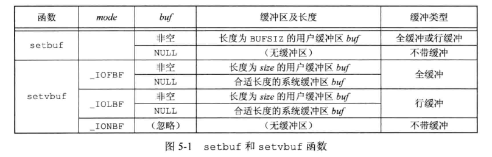
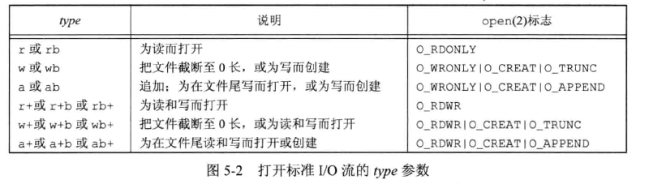
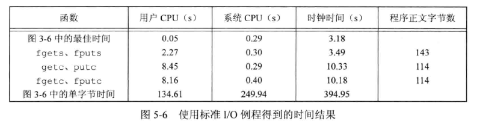

## 引言

标准 IO 库由 ISO C 标准说明。SUS 对 ISO C 标准进行了扩充，定义了一些接口。  

标准 I/O 库处理很多细节，包括缓冲区分配、优化块长度执行 I/O 等。  

Dennis Ritchie 在 1975 年编写，基于 Mike Lesk 编写的可移植 I/O 库的主要修改版本，之后几乎没有修改。


## 流和 FILE 对象

对于标准 I/O 库，它们操作是围绕 **流(stream)** 进行的。当用标准 I/O 库打开或创建一个文件时，使一个流与一个文件相关联。  

对于 ASCII 字符集，一个字符用一个字节表示。对于国际字符集，一个字符可以用多个字节表示。标准 I/O 文件流可用于单字节或多字节(宽)字符集。**流的定向(stream orientation)** 决定了所读、写的字符是单字节还是多字节的。当流被初次创建时，它并没有定向，若使用多字节 I/O 函数，则该流被设置为宽定向的；若使用单字节 I/O 函数，则该流被设置为字节定向的。有两个函数可以改变流的定向：freopen 清除一个流的定向、fwide 设置流的定向。  

```c
#include <stdio.h>
#include <wchar.h>


int fwide(FILE *fp, int mode);
		// 若流是宽定向的返回正值，若流是字节定向的返回负值，未定向的返回 0
```

根据 mode 参数不同值，fwide 函数执行不同工作：

* mode 参数为负，fwide 将试图使指定的流是字节定向的
* mode 参数为正，fwide 将试图使指定的流是宽定向的
* mode 参数为0，将不设置流的定向，返回标识该流定向的值

fwide 并不改变已定向流的方向。并且无出错返回。唯一可靠的方式是调用 fwide 前先清除 errno，从 fwide 返回时检查 errno 的值。  

打开一个流时，标准I/O 函数 fopen 返回一个指向 FILE 对象的指针。FILE 对象通常是一个结构体，包含了标准 I/O 库为管理该流所需要的所有信息：用于实际I/O 的文件描述符、指向用于该流缓冲区的指针、缓冲区的长度、当前在缓冲区中的字符数、出错标志等。


## 标准输入、标准输出、标准错误

对一个进程预定义了3个流，可以自动地被进程使用：标准输入、标准输出、标准错误。  

可以通过预定义的文件指针 stdin、stdout、stderr 加以引用，这3个指针定义在 <stdio.h> 中。


## 缓冲

标准I/O库提供缓冲的目的是减少 read、write 调用的次数，对每个I/O流自动地进行缓冲管理。提供了3种类型：

1. 全缓冲。这种情况下，在填满标准I/O缓冲区才进行实际I/O操作。驻留在磁盘上的文件通常是由标准I/O库实施全缓冲的。一个流上执行第一次I/O操作时，相关标准I/O函数通常调用 malloc 获取所需缓冲区。
   * **冲洗(flush)**：缓冲区可由标准I/O例程自动地 flush，或者调用 fflush 刷新一个流。
2. 行缓冲。在输入、输出中遇到换行符时，标准I/O库进行 I/O 操作。一般终端会使用行缓冲。
   * 如果缓冲区满了，即使没有换行符，也会进行I/O操作
   * 只要通过标准I/O库要求从一个不带缓冲的流或者一个行缓冲地流得到输入数据，那么就会 flush 所有行缓冲输出流。
3. 不带缓冲。标准I/O不对字符进行缓冲存储。

标准错误通常时不带缓冲的，使得错误信息尽快显示出来。  

ISO C 要求如下缓冲特征：

* 当且仅当标准输入和标准输出并不指向交互式设备时，它们才是全缓冲的
* 标准错误绝不会是全缓冲的
* 很多系统默认缓冲类型：
  * 标准错误时不带缓冲
  * 若是指向终端设备的流，则是行缓冲的，否则时全缓冲的

若是不喜欢这些系统默认缓冲类型，可以调用下列函数更改：

```c
#include <stdio.h>


void setbuf(FILE *restrict fp, char *restrict buf);
void setvbuf(FILE *restrict fp, char *restrict buf, int mode, size_t size);
		// 成功则返回0，出错返回非0
```

这些函数一定要在流被打开之后调用，应该在对该流进行任何其他操作前进行调用。  

setbuf 函数打开或关闭缓冲机制。为了带缓冲，参数 buf 必须指向一个长度为 BUFSIZ 的缓冲区(定义在<stdio.h>种)。通常在此之后流时全缓冲的。如果关闭缓冲，则将 buf 设置为 NULL。  

使用 setvbuf 可以精确说明所需缓冲类型，由 mode 参数指定：

* _IOFBF：全缓冲。buf 和 size 指定缓冲区及其长度。如果 buf 为 NULL，则自动地为该流分配适当长度的缓冲区，一般是由常量 BUFSIZ 所指定的值。
* _IOLBF：行缓冲。规则同上。
* _IONBF：不带缓冲。将忽略 buf 和 size 参数



如果一个函数内分配了一个自动变量类的标准 I/O 缓冲区，则从该函数返回之前，必须关闭该流。  

任何时候都可以强制刷新一个流：

```c
#include <stdio.h>

int fflush(FILE *fp);
		// 成功返回0，出错返回EOF
```

此函数使得该流所有未写的数据都被传送到内核，如果 fp 是 NULL，则所有的输出流都被 flush。


## 打开流

打开标准 I/O 流的函数：

```c
#include <stdio.h>


FILE *fopen(const char *restrict pathname, const char *restrict type);
FILE *freopen(const char *restrict pathname, const char *restrict type, FILE *restrict fp);
FILE *fdopen(int fd, const char *type);
```

1. fopen 打开路径名为 pathname 的文件
2. freopen 在一个指定的流上打开一个指定的文件，如果该流已经打开，则先关闭该流。若流已经定向，则使用 freopen 清除该定向。
3. fdopen 去一个已有的文件描述符(可能通过 open、dup、dup2、fcntl、pipe、socket、socketpair、accept等函数获得此 fd)，并使一个标准 I/O 流与该文件描述符相结合。常用于管道、网络通信通道函数返回的描述符，因为这些特殊类型的文件不能用标准I/O 函数 fopen 打开。

type 参数指定对该 I/O 流的读、写方式，ISO C 规定type 参数可以有 15 种不同的值：



字符 b 是标准 I/O 系统用于区分文本文件和二进制文件。但 UNIX 内核不对这两种文件进行区分，因此 UNIX 中指定字符b作为 type 的一部分无作用。  

函数 fclose 关闭一个打开的流：

```c
#include <stdio.h>

int fclose(FILE *fp);
		// 成功返回0，出错返回 EOF
```

文件关闭之前，flush 缓冲区的输出数据。缓冲区中的任何输入数据会被丢弃。如果标准I/O库为该流自动分配了一个缓冲区，则释放此缓冲区。  

当一个进程正常终止，则所有带未写缓冲数据的标准I/O流都被 flush，所有打开的标准 I/O 流都被关闭。


## 读和写流

一旦打开流则可以在下列 非格式化I/O 类型中选择一种对其进行读写：

1. 每次一个字符的 I/O。一次读或写一个字符，如果流是带缓冲的，则标准I/O函数处理所有缓冲。
2. 每次一行的 I/O。使用 fgets 和 fputs 函数，每行以一个换行符终止，直接调用 fgets 时，应说明能处理的最大行长。
3. 直接 I/O。fread 、fwrite 函数支持这种I/O。每次I/O操作读或写某种数量的对象，每个对象具有指定的长度。这两个函数通常用于从二进制中每次读或者写一个结构。
   * 直接 I/O(direct I/O)术语来自 ISO C 标准，有时也被称为 二进制I/O、一次一个对象I/O、面向记录的I/O、面向结构的I/O。

### 输入函数

一次读一个字符的函数：

```c
#include <stdio.h>

int getc(FILE *fp);
int fgetc(FILE *fp);
int getchar(void);
		// 成功返回下一个字符，到达文件尾端或者出错返回 EOF
```

getchar 等于 getc(stdin)。getc 可以被实现为宏，而 fgetc 不能，因此：

1. getc 的参数不应当是具有副作用的表达式，因为它可能会被计算多次
2. fgetc 一定是一个函数，因此可以得到其地址，这就允许将 fgetc 的地址作为参数传送给另一个函数
3. 调用 fgetc 所需时间很可能比调用 getc 长，因为通常函数调用所需时间长于宏

这3个函数返回下一个字符时，将其 unsigned char 类型转换为 int 类型。要求整型返回的原因是，这样可以返回所有可能的字符值加上一个已出错或 EOF的指示值。EOF被要求是一个负值，通常定义为-1。因此这3个函数的返回值不能存放在字符变量中，否则无法和常量 EOF 比较。  

出错或者到达文件尾端，这3个函数返回同样的值，因此还需要调用以下函数做区分：

```c
#include <stdio.h>

int ferror(FILE *fp);
int feof(FILE *fp);
		// 为真则返回非0，否则返回0

void clearerr(FILE *fp);
```

大多数实现中为每个流在 FILE 对象中维护了两个标志：

* 出错标志
* 文件结束标志

调用 clearerr 可以清除这两个标志。  

从流中读取数据以后，可以调用 ungetc 将字符再压回流中：

```c
#include <stdio.h>

int ungetc(int c, FILE *fp);
		// 成功返回 c，出错返回 EOF
```

压送回到流中的字符后续又可以从流中读出，但读出的顺序与压送回的顺序相反。例如压送回 a b c，读出 c b a。ISO C 允许实现支持任何次数的回送，但是要求实现提供一次只回送一个字符，不能期望一次回送多个字符。  

* 回送的字符，不一定必须是上次读到的字符。
* 不能回送EOF。
* 当已经到达文件尾端时，仍可以回送一个字符，下次读将返回该字符，再读则返回 EOF。之所以如此，是因为 ungetc 函数调用会清除该流的 EOF。

当正在读一个输入流，并进行某种形式的切词或记号切分操作时，经常会用到回送字符操作。有时需要看一看下一个字符，以决定如何处理当前字符。然后旧需要方便地将刚看到地字符回送，一边下一次调用 getc 时返回该字符。如果标准 I/O 不能提供回送能力，就需要将该字符存放到一个我们自己地变量中，并设置一个标志以便判断在下一次需要一个字符时时调用 getc，还是从我们自己的变量中取用这个字符。  

*用 ungetc 压送回字符时，并没有写到底层文件或设备上，只是将它们写回标准I/O库流的缓冲区*


### 输出函数

与输入函数对应的每个函数都有一个输出函数：

```cc
#include <stdio.h>

int putc(int c, FILE *fp);
int fputc(int c, FILE *fp);
int putchar(int c);
		// 成功则返回字符 c，出错返回EOF
```

putchar(c)等同于 putc(c, stdout)，putc 可以被实现为宏，fputc 不能实现为宏。


## 每次一行I/O

每次读取输入一行的函数：

```c
#include <stdio.h>

char *fgets(char *restrict buf, int n, FILE *restrict fp);
char *gets(char *buf);
		// 成功返回buf，到达文件尾端或出错返回 NULL
```

这两个函数读取的行将送到缓冲区 buf 中。gets 从标准输入读，fgets 从 fp 指定的流读。  

fgets 函数必须指定缓冲的长度 n。此函数一直读到下一个换行符位置，但不超过 n-1 个字符，读入的字符被送入缓冲区。该缓冲区以 null 字节结尾。若该行包括最后一个换行符的字符数超过 n-1 ，则 fgets 只返回一个不完整的行，而缓冲区总是以 null 字节结尾。对 fgets 的下一次调用会继续读该行。  

gets 函数不推荐使用。其在执行时不能 指定缓冲区长度，可能会导致缓冲区溢出。例如 1988 年因特网蠕虫事件。gets 会删除换行符，不将其送入缓冲区。  


输出一行的函数：

```c
#include <stdio.h>

int fputs(const char *restrict str, FILE *restrict fp);
int puts(const char *str);
		//成功返回非负值，出错返回EOF
```

fputs 将一个以 null 字节结尾的字符串写到指定的流，结尾的 null 不写出。通常 null 之前是一个换行符，但不总是如此。  

puts 将一个以 null 字节结尾的字符串写到标准输出，终止符 null 不写出，但会将一个换行符追加到标准输出。  

puts 也尽量避免使用，避免需要记住是否在最后添加了换行符。经常使用 fgets、fputs，会熟悉处理每行结束的换行符。  


## 标准I/O的效率

使用 getc 和 putc 将标准输入复制到标准输出：

```c
#include "apue.h"

int main(){
    int c;

    while(( c = getc(stdin)) != EOF){
        if (putc(c, stdout) == EOF)
            err_sys("output error");
    }

    if(ferror(stdin))
        err_sys("input error");

    exit(0);
}
```

使用 fgets、fputs 的每次读、写一行的版本：

```c
#include "apue.h"

int main(){
    char buf[MAXLINE];

    while( fgets(buf, MAXLINE, stdin) != NULL){
        if (fputs(buf, stdout) == EOF)
            err_sys("output error");
    }

    if(ferror(stdin))
        err_sys("input error");

    exit(0);
}
```





## 二进制I/O

之前的函数以一次一个字符或一行的方式进行操作数据流。如果进行二进制I/O 操作，那么更好的是一次读或写一个完整的结构。如果使用 getc、putc 处理，通过循环每次处理一个字节读或者写，将会非常复杂和费时。如果使用 fputs、fgets ，那么遇到 null 字节就会停止，而结构中可能含有 null 字节，因此也不能满足处理结构的要求。由此提供了两个函数以执行二进制I/O操作：

```c
#include <stdio.h>

size_t fread(void *restrict ptr, size_t size, size_t nobj, FILE *restrict fp);
size_t fwrite(const void *restrict ptr, size_t size, size_t nobj, FILE *restrict fp);
		// 返回读写的对象数
```

常见用法：

1. 读或写一个二进制数组。其中 size 为每个数组元素的长度，nobj 为要写的元素个数

   ```c
   // 将一个浮点数组的第 2~5 个元素写到一个文件上
   float data[10];
   
   if(fwrite(&data[2], sizeof(float), 4, fp) != 4)
       err_sys("fwrite error");
   ```

2. 读或写一个结构体。其中 size 为结构体的长度，nobj 为要写的对象个数

   ```c
   struct {
       short count;
       long total;
       char name[NAMESIZE];
   } item;
   
   if(fwrite(&item, sizeof(item), 1, fp) != 1)
       err_sys("fwrite error");
   ```

将上面示例结合起来可以读或者写一个结构体数组，size 是结构体的 sizeof，nobj 是数组中元素的个数。  

fread、fwrite 返回读写的对象数。对于读，如果出错或者EOF，此数字可以小于 nobj。这种情况应该调用 ferror、feof 来判断具体那种情况。对于写，返回值小于要求的 nobj 则出错。  

二进制 I/O 只能用于读在同一系统上已写的数据。但如今很多异构系统，它们通过网络相互连接，这种环境下，这两个函数不能正常工作，原因是：

1. 在一个结构体中，同一成员的偏移量可能随编译程序和系统的不同而不同(可能对齐要求不同)。
2. 用来存储多字节整数和浮点数的二进制格式在不同的系统结构间也可能不同。


在不同系统之间交换二进制数据的实际解决方法是使用互认的规范格式。


## 定位流

有3中方法定位标准 I/O 流。

1. ftell、fseek 函数。它们假定文件的位置可以存放在一个长整型中。
2. ftello、fseeko 函数。SUS 引入这两个函数，使文件偏移量可以不必一定使用长整型。它们使用 off_t 数据类型代替了长整型
3. fgetpos、fsetpos 函数。这两个函数是由 ISO C 引入的。使用一个抽象数据类型 fpos_t 记录文件的位置。这种数据类型可以根据需要定义一个足够大的数，用以记录文件位置。

需要移植到非 UNIX 的应用应该使用 fgetpos 和 fsetpos。

```c
#include <stdio.h>

long ftell(FILE *fp);
		// 成功返回当前文件位置指示，出错返回-1L

int fseek(FILE *fp, long offset, int whence);
		// 成功返回0，出错返回-1

void rewind(FILE *fp);
```

对于一个二进制文件，其文件位置指示器是从文件起始位置开始度量，并以字节为度量单位的。ftell 用于二进制文件时，其返回值就是这种字节位置。为了用 fseek 定位一个二进制文件，必须指定一个字节 offset，以解释这种偏移量的方式。whence 的值与 lseek 函数中的相同：SEEK_SET 标识从文件的起始位置开始，SEEK_CUR 标识从当前文件位置开始，SEEK_END 表示从文件尾部开始。  

对于文本文件，它们的文件当前位置可能不以简单的字节偏移量来度量。因为非 UNIX 系统中，可能以不同格式存放文本文件。为了定位一个文本文件，whence 一定要是 SEEK_SET，offset 只能为 0(后退到文件的起始位置)，或者是对该文件的 ftell 所返回的值。使用 rewind 函数也可以将一个流设置到文件的起始位置。  

除了偏移量的类型是 off_t 而非 long 以外， ftello 函数和 ftell 相同，fseeko 和 fseek 相同：

```c
#include <stdio.h>

off_t ftello(FILE *fp);
		// 成功返回当前文件位置，出错返回(off_t)-1

int fseeko(FILE *fp, off_t offset, int whence);
		// 成功返回0，出错返回-1
```

fgetpos 和 fsetpos 是 ISO C 标准引入的：

```c
#include <stdio.h>

int fgetpos(FILE *restrict fp, fpos_t *restrict pos);
int fsetpos(FILE *fp, const fpos_t *pos);
		// 成功返回0，出错返回非0

```

fgetpos 将文件位置指示器的当前值存入由 pos 指向的对象中，在以后调用 fsetpos 时，可以用此值将流重新定位至该位置。


## 格式化I/O

### 格式化输出

5个 printf 函数：

```c
#include <stdio.h>

int printf(const char *restrict format, ...);
int fprintf(FILE *restrict fp, const char *restrict format, ...);
int dprintf(int fd, const char *restrict format, ...);
		// 3个函数成功返回输出字符数，出错返回负值

int sprintf(char *restrict buf, const char *restrict format, ...);
		// 成功返回存入数组的字符数，编码出错返回负数

int snprintf(char *restrict buf, size_t n, const char *restrict format, ...);
		// 如果缓冲区足够大，返回将要存入数组的字符数，编码出错则返回负值
```

* printf 将格式化数据写到标准输出。
* fprintf 写到指定的流。
* dprintf 写到指定的文件描述符。
  * dprintf 不处理文件指针，不需要调用 fdopen 将文件描述符转换为文件指针。
* sprintf 将格式化的字符送入数组 buf 中。在该数组的尾端自动添加一个 null 字节，但不包含在返回值中。可能会导致 buf 指向的缓冲区溢出，需要确保该缓冲区足够大。
* snprintf 需要指定缓冲区长度 n，超过缓冲区尾端的字符都被丢弃。如果缓冲区足够大就返回写入缓冲区的字符数。返回值与 sprintf 相同。

format 是格式控制，每个参数按照转换说明编写，转换说明以 % 开始，除转换说明外，格式字符串中的其他字符将按照原样输出。一个转换说明有 4 个可选择的部分：

```
%[flags][fldwidth][precision][lenmodifier]convtype
```

* flags，转换说明标志：

| 标志   | 说明                                                         |
| ------ | ------------------------------------------------------------ |
| '      | 将整数按千分位分组字符(本地测试未生效，可能跟系统 locale 设置有关) |
| -      | 在字段内左对齐输出                                           |
| +      | 总是显示带符号转换的正负号                                   |
| (空格) | 如果第一个字符不是正负号，则在其前面加上一个空格             |
| #      | 指定另一种转换形式（例如十六进制加 0x 前缀）                 |
| 0      | 添加前导0进行填充(默认是空格)                                |

* fldwidth， 用来说明最小字段宽度。转换后参数字符若小于宽度，则多余字符位置用空格填充。字段宽度是一个非负十进制数，或者是一个星号`*`。  
* precision， 说明整型转换后最少输出数字位数、浮点数转换后小数点后的最少位数、字符串转换后最大字节数。精度是一个点 `.` ，其后跟随一个可选的非负十进制数或一个星号 `*`。
* 宽度和精度参数字段都可以为`*`号。此时一个整型参数指定宽度或精度的值。该参数值正好位于被转换的参数之前。
* lenmodifier， 说明参数长度。

| 长度修饰符 | 说明                                                 |
| ---------- | ---------------------------------------------------- |
| hh         | 将相应的参数按 signed 或 unsigned char 类型输出      |
| h          | 将相应的参数按 signed 或 unsigned short 类型输出     |
| l          | 将相应的参数按 signed 或 unsigned long 类型输出      |
| ll         | 将相应的参数按 signed 或 unsigned long long 类型输出 |
| j          | intmax_t 或 uintmax_t                                |
| z          | size_t                                               |
| t          | ptrdiff_t                                            |
| L          | long double                                          |

* convtype， 是必填参数。控制如何解释参数。

| 转换类型 | 说明                                                         |
| -------- | ------------------------------------------------------------ |
| d、i     | 有符号十进制                                                 |
| o        | 无符号八进制                                                 |
| u        | 无符号十进制                                                 |
| x、X     | 无符号十六进制                                               |
| f、F     | 双精度浮点数                                                 |
| e、E     | 指数格式双精度浮点数                                         |
| g、G     | 根据转换后的值解释为 f、F、e、E                              |
| a、A     | 十六进制指数格式双精度浮点数                                 |
| c        | 字符（若带长度修饰符l，为宽字符）                            |
| s        | 字符串（若带长度修饰符l，为宽字符）                          |
| p        | 指向 void 的指针                                             |
| n        | 到目前为止，此 printf 调用输出的字符的数目将被写入到指针所指向的带符号整型中 |
| %        | 一个 % 字符                                                  |
| C        | 宽字符（XSI扩展，等效于 lc）                                 |
| S        | 宽字符串（XSI扩展，等效于 ls）                               |


printf 族的变体类型，可变参数表 `...` 替换成了 arg：

```c
#include <stdarg.h>
#include <stdio.h>

int vprintf(const char *restrict format, va_list arg);
int vfprintf(FILE *restrict fp, const char *restrict format, va_list arg);
int vdprintf(int fd, const char *restrict format, va_list arg);
		// 3个函数成功返回输出字符数，出错返回负值

int vsprintf(char *restrict buf, const char *restrict format, va_list arg);
		// 成功返回存入数组的字符数，编码出错返回负数

int vsnprintf(char *restrict buf, size_t n, const char *restrict format, va_list arg);
		// 如果缓冲区足够大，返回将要存入数组的字符数，编码出错则返回负值
```


### 格式化输入

3 个 scanf 函数处理格式化输入：

```c
#include <stdio.h>

int scanf(const char *restrict format, ...);
int fscanf(FILE *restrict fp, const char *restrict format, ...);
int sscanf(const char *restrict buf, const char *restrict format, ...);
		// 成功返回赋值的输入项数，若输入出错或在任一转换前已到达文件尾端，返回 EOF
```

scanf 族用于分析输入字符串，并将字符序列转换成指定类型的变量。在格式之后的个参数包含了变量的地址，用转换结果对这些变量赋值。  

格式说明控制如何转换参数，一边对它们赋值。转换说明以 % 字符开始。除转换说明和空白字符外，格式字符串中的其他字符必须与输入匹配。若有一个字符不匹配，则停止后续处理，不再读输入的其余部分。  

一个转换说明有 3 个可选择的部分：

```
%[*][fldwidth][m][lenmodifier]convtype
```

* 可选的星号`*`用于抑制转换。按照转换说明的其余部分对输入进行转换，但转换结果并不存放在参数中。  
* fldwidth 说明最大宽度（最大字符数）。
* lenmodifier 说明要用转换结果赋值的参数大小。长度修饰符和 printf 函数支持的相同。
* 可选项 m 是**赋值分配符**。可以用于 %c、%s、%[ 转换符，迫使内存缓冲区分配空间以接纳转换字符串。这种情况下，相关的参数必须是指针地址，分配的缓冲区地址必须复制给该指针。如果调用成功，该缓冲区不再使用时，由调用者负责调用 free 函数来释放该缓冲区。
* convtype 字段类似于 printf 族的转换类型字段，但有些许差别：
  * 作为一种选项，输入中带符号的可赋予无符号类型。例如 `-1` 可以被转换成 `4 294 967 295`赋予无符号整型变量。

| 转换类型               | 说明                                                         |
| ---------------------- | ------------------------------------------------------------ |
| d                      | 有符号十进制，基数为 10                                      |
| i                      | 有符号十进制，基数由输入格式决定                             |
| O                      | 无符号八进制（输入可选地有符号）                             |
| u                      | 无符号十进制，基数为10（输入可选地有符号）                   |
| x、X                   | 无符号十六进制（输入可选地有符号）                           |
| a、A、e、E、f、F、g、G | 浮点数                                                       |
| c                      | 字符（若带长度修饰符l，为宽字符）                            |
| s                      | 字符串（若带长度修饰符l，为宽字符）                          |
| [                      | 匹配列出的字符序列，以]终止                                  |
| [^                     | 匹配除列出字符以外的所有字符，以]终止                        |
| p                      | 指向 void 的指针                                             |
| n                      | 到目前为止，此函数调用读取的字符的数目将被写入到指针所指向的无符号整型中 |
| %                      | 一个 % 字符                                                  |
| C                      | 宽字符（XSI扩展，等效于 lc）                                 |
| S                      | 宽字符串（XSI扩展，等效于 ls）                               |

scanf 函数族支持另外一种转换说明，允许显式地命名参数：序列 `%n$` 代表了第 n 个参数。与 printf 函数族相同，同一编号的参数在格式串中可引用多次。但 SUS 指出，这种情况在 scanf 函数族中如何作用还未定义。  

与 printf 族相同，scanf 族也使用 由<stdarg.h> 说明的可变长度参数表。

```c
#include <stdarg.h>
#include <stdio.h>

int vscanf(const char *restrict format, va_list arg);
int vfscanf(FILE *restrict fp, const char *restrict format, va_list arg);
int vsscanf(const char *restrict buf, const char *restrict format, va_list arg);
		// 成功返回输入项目数，若出错或在任一转换前文件结束，返回 EOF
```


## 实现细节

在 UNIX 中，每个标准 I/O 流都有一个与之相关联的文件描述符，可以对一个流调用 fileno 函数以获得其描述符：

```c
#include <stdio.h>

int fileno(FILE *fp);
		// 返回与该流相关联的文件描述符
```

如果要调用 dup、fcntl 等函数，需要此函数。  

示例，打印各个标准 I/O 流缓冲状态信息：

```c
#include "apue.h"

void pr_stdio(const char *, FILE *);
int is_unbuffered(FILE *);
int is_linebuffered(FILE *);
int buffer_size(FILE *);

int main(void)
{
    FILE *fp;

    fputs("enter any character\n", stdout);
    if (getchar() == EOF)
        err_sys("getchar error");
    fputs("one line to standard error\n", stderr);

    pr_stdio("stdin", stdin);
    pr_stdio("stdout", stdout);
    pr_stdio("stderr", stderr);

    if ((fp = fopen("/etc/passwd", "r")) == NULL)
        err_sys("fopen error");

    if (getc(fp) == EOF)
        err_sys("getc error");

    pr_stdio("/etc/passwd", fp);
    exit(0);
}

void pr_stdio(const char *name, FILE *fp)
{
    printf("stream = %s, ", name);
    if (is_unbuffered(fp))
        printf("unbuffered");
    else if (is_linebuffered(fp))
        printf("line buffered");
    else
        printf("fully buffered");
    printf(", buffer size = %d\n", buffer_size(fp));
}

/* 下列函数是不可移植的 */

#if defined(_IO_UNBUFFERED)

int is_unbuffered(FILE *fp)
{
    return (fp->_flags & _IO_UNBUFFERED);
}

int is_linebuffered(FILE *fp)
{
    return (fp->_flags & _IO_LINE_BUF);
}

int buffer_size(FILE *fp)
{
    return (fp->_IO_buf_end - fp->_IO_buf_base);
}

#elif defined(__SNBF)

int is_unbuffered(FILE *fp)
{
    return (fp->_flags & __SNBF);
}

int is_linebuffered(FILE *fp)
{
    return (fp->_flags & __SNBF);
}

int buffer_size(FILE *fp)
{
    return (fp->_bf._size);
}

#elif defined(_IONBF)

#ifdef _LP64
#define _flag __pad[4]
#define _ptr __pad[1]
#define _base __pad[2]
#endif

int is_unbuffered(FILE *fp)
{
    return (fp->_flags & _IONBF);
}

int is_linebuffered(FILE *fp)
{
    return (fp->_flags & _IOLBF);
}

int buffer_size(FILE *fp)
{
#ifdef _LP64
    return (fp->_IO_buf_end - fp->_IO_buf_base);
#else
    return (BUFSIZ);
#endif
}

#else
#error unknow stdio implementation!
#endif
```

执行：

```bash
## 编译运行
$ ../gcc_a ./5.11.c 
$ ./5.11 
enter any character
1
one line to standard error
stream = stdin, fully buffered, buffer size = 1024
stream = stdout, fully buffered, buffer size = 1024
stream = stderr, unbuffered, buffer size = 1
stream = /etc/passwd, fully buffered, buffer size = 4096

## 重定向 3 个流
$ ./5.11 < /etc/group > std.out 2> std.err
$ cat std.err 
one line to standard error
$ cat std.out 
enter any character
stream = stdin, fully buffered, buffer size = 4096
stream = stdout, fully buffered, buffer size = 4096
stream = stderr, unbuffered, buffer size = 1
stream = /etc/passwd, fully buffered, buffer size = 4096
```

上面示例先对 3 个流进行了一次 I/O 操作，每个流会根据规则决定是否分配缓冲。测试环境是 WSL ubuntu，该系统默认值是输入、输出是全缓冲的，标准错误是不带缓冲的。 无论是连接至终端还是文件都一样。


## 临时文件

`IOS C` 标准提供了两个函数用以创建临时文件：

```c
#include <stdio.h>

char *tmpnam(char *ptr);
		//返回唯一路径名的指针
FILE *tmpfile(void);
		//成功返回文件指针，出错则返回NULL
```

tmpnam 函数产生一个与现有文件名不同的一个有效路径名字符串。

* 每次调用它，都产生一个不同的路径名，最多调用次数是 TMP_MAX，定义在 <stdio.h> 中。  
* 若 ptr 是 NULL，则产生的路径存放在一个静态区中，指向该静态区的指针作为函数值返回。后续调用 tmpnam 时，会重写该静态区（如果多次调用此函数，又想保存路径名，则应该保存路径名的副本，而不是指针的副本）。
* 若 ptr 不是 NULL，则它应该时指向长度至少 L_tmpnam(定义在<stdio.h>中的常量) 个字符的数组，所产生的路径名存放在该数组中，ptr 也作为函数值返回。  

tmpfile 创建一个临时二进制文件(类型 wb+)，在关闭该文件或程序结束时将自动删除这种文件。UNIX 对二进制文件不进行特殊区分。  


示例：

```c
#include "apue.h"

int main(void){
    char name[L_tmpnam], line[MAXLINE];
    FILE *fp;

    // 第一次调用生成 temp name，存放在静态区
    printf("%s\n", tmpnam(NULL));      

    // 第二次 temp name，存放在 name 数组中
    tmpnam(name);
    printf("%s\n", name);

    // 创建 temp 文件
    if((fp = tmpfile()) == NULL)
        err_sys("tmpfile error");
    // 写入一些内容到文件
    fputs("one line of output\n", fp);
    // 重置流到文件起始位置
    rewind(fp);
    // fgets 获取文件到存放到 line 数组中，再 fputs 输出到标准输出
    if(fgets(line, sizeof(line), fp) == NULL)
        err_sys("fgets error");
    fputs(line, stdout);

    exit(0);
}
```

执行：

```bash
$ ./5.12 
/tmp/filetN4hb9
/tmp/filedT3Pdm
one line of output
```

一般情况下使用 tmpfile 函数会先调用 tmpnam 创建也给唯一的路径名，然后用该路径名创建一个文件，然后立即 unlink 它。  

SUS 的 XSI 扩展为处理临时文件定义了另外两个函数：

```c
#include <stdlib.h>

char *mkdtemp(char *template);
		// 成功返回指向目录的指针，出错返回NULL
int mkstemp(char *template);
		// 成功返回文件描述符，出错返回-1
```

* mkdtemp 函数创建一个目录，该目录有一个唯一的名字。
  * 创建的目录使用访问权限位集：S_URUSR |  S_IWUSR | S_IXUSR 。调用进程的文件模式创建屏蔽字可以进一步限制这些权限。执行成功则返回新目录的名字。

* mkstemp 函数创建一个文件，该文件有一个唯一的名字。
  * 以唯一的名字创建一个普通文件并且打开该文件，该函数返回的文件描述符以读写方式打开。由 mkstemp 创建的文件使用访问权限位 S_IRUSR | S_IWUSR。
  * 与 tempfile 不同，mkstemp 创建的临时文件并不会自动删除，如需删除需要调用 unlink。
* 名字是通过 template 字符串进行选择的，这个字符串是后 6 位设置为 XXXXXX 的路径名。函数将这些占位符 XXXXXX 替换成不同的字符来构建一个唯一的路径名。
* 如果成功的话，这两个函数将修改 template 字符串反映临时文件的名字。

mkstemp 函数使用示例：

```c
#include "apue.h"
#include <errno.h>

void make_temp(char *template);
int main(){
    char good_template[] = "/tmp/dirXXXXXX";
    char *bad_template = "/tmp/dirXXXXXX";

    printf("trying to create first temp file...\n");
    make_temp(good_template);
    printf("trying to create second temp file...\n");
    make_temp(bad_template);
    exit(0);
}

void make_temp(char *template){
    int fd;
    struct stat sbuf;

    if((fd = mkstemp(template)) < 0)
        err_sys("can't create temp file");
    
    printf("temp name = %s\n", template);
    close(fd);

    if(stat(template, &sbuf) < 0){
        if(errno == ENOENT)
            printf("file doesn't exist\n");
        else
            err_sys("stat failed");
    }else{
        printf("file exists\n");
        unlink(template);
    }
}
```

编译执行：

```bash
$ ../gcc_a ./5.13.c 
$ ./5.13 
trying to create first temp file...
temp name = /tmp/dirOtue85
file exists
trying to create second temp file...
Segmentation fault (core dumped)
```

上面示例用了两种方式作为模板参数 template，第一种是数组，名字分配在栈上。第二种是指针，只有指针自身驻留在栈上，编译器把字符串存放在可执行文件的只读段，因此 mkstemp 函数试图修改字符串时，出现了段错误。  


## 内存流

标准 I/O 把数据缓存在内存中，因此每次处理一个字符和一行的 I/O 更有效。也可以通过调用 setbuf、setvbuf 函数让I/O库使用我们自己的缓冲区。SUSv4 中支持了内存流。标准 I/O 流虽然仍使用 FILE 指针进行访问，但其实并没有底层文件。所有的 I/O 都是通过在缓冲区与内存之间来回传送字节来完成的。

```c
#include <stdio.h>

FILE *fmemopen(void *restrict buf, size_t size, const char *restrict type);
		// 成功返回流指针，出错返回 NULL
```

fmemopen 函数允许调用者提供缓冲区用于内存流：

* buf 参数指向缓冲区
* size 参数指定缓冲区大小的字节
* 如果 buf 参数为空，fmemopen 函数分配 size 字节数的缓冲区，此情况下分配的缓冲区，当流关闭时缓冲区会被释放
* type 参数控制如何使用流，可能取值如下：

| type             | 说明                                   |
| ---------------- | -------------------------------------- |
| r 或 rb          | 为读而打开                             |
| w 或 wb          | 为写而打开                             |
| a 或 ab          | 追加：为在第一个 null 字节处写而打开   |
| r+ 或 r+b 或 rb+ | 为读和写而打开                         |
| w+ 或 w+b 或 wb+ | 把文件截断至0长，为读和写而打开        |
| a+ 或 a+b 或 ab+ | 追加：为在第一个null字节处读和写而打开 |

这些取值和基于文件的标准 I/O 流的 type 参数基本一直，但有些差异：

* 无论何时以追加方式打开内存流，当前文件位置设置为缓冲区中的第一个 null 字节。如果缓冲区中不存在 null 字节，则当前位置就设为缓冲区结尾的后一个字节。
* 当流并不是以追加写方式打开时，当前位置设为缓冲区的开始位置。
* 因为追加写模式通过第一个 null 字节确定数据的尾端，因此不适合存储二进制数据。
* 如果 buf 参数是一个 null 指针，打开流进行读或者写都没有任何意义。
* 任何时候需要增加流缓冲区中数据量以及调用 fclose、fflush、fseek、fseeko、fsetpos 时都会在当前位置写入一个 null 字节。


示例：

```c
#include "apue.h"

#define BSZ 48

int main(){
    FILE *fp;
    char buf[BSZ];

    // fill char 'a' to buf 
    memset(buf, 'a', BSZ-2);
    buf[BSZ-2] = '\0';
    buf[BSZ-1] = 'X';
    printf("before initial: %s\n", buf);

    // fmemopen 打开流会在缓冲区开始填充null
    if((fp = fmemopen(buf, BSZ, "w+")) == NULL)
        err_sys("fmemopen failed");
    printf("initial buffer contents: %s\n", buf);
    fprintf(fp, "hello, world");
    printf("before fflush: %s\n", buf);
    fflush(fp);
    printf("after fflush: %s\n", buf);
    printf("len of string in buf = %ld\n", (long)strlen(buf));


    // fill char 'b' to buf 
    memset(buf, 'b', BSZ-2);
    buf[BSZ-2] = '\0';
    buf[BSZ-1] = 'X';
    fprintf(fp, "hello, fseek");
    printf("\nbefore fseek: %s\n", buf);
    fseek(fp, 0, SEEK_SET);
    printf("after fseek: %s\n", buf);
    printf("len of string in buf = %ld\n", (long)strlen(buf));


    // fill char 'c' to buf 
    memset(buf, 'c', BSZ-2);
    buf[BSZ-2] = '\0';
    buf[BSZ-1] = 'X';
    fprintf(fp, "hello, fclose");
    printf("\nbefore fclose: %s\n", buf);
    fclose(fp);
    printf("after fclose: %s\n", buf);
    printf("len of string in buf = %ld\n", (long)strlen(buf));
}
```

执行：

```bash
## a字符填充缓冲区
./5.15 
before initial: aaaaaaaaaaaaaaaaaaaaaaaaaaaaaaaaaaaaaaaaaaaaaa
## fmemopen 会在开始处填充 null，因此 printf打印出空
initial buffer contents: 
## 写入 fp 的内容需要 fflush 触发才写入到缓冲区
before fflush: 
after fflush: hello, world
len of string in buf = 12

## b字符填充缓冲区
before fseek: bbbbbbbbbbbbbbbbbbbbbbbbbbbbbbbbbbbbbbbbbbbbbb
## 调用 fseek，会填充 null 字符，由于是w+方式打开，缓冲区从当前位置开始(上面fflush写入到了第12个字符的位置)
after fseek: bbbbbbbbbbbbhello, fseek
len of string in buf = 24

## c字符填充缓冲区
before fclose: cccccccccccccccccccccccccccccccccccccccccccccc
## 调用 fclose，不会添加 null，buf 之后所有c字符都能打印出来
after fclose: hello, fcloseccccccccccccccccccccccccccccccccc
len of string in buf = 46
```


用于创建内存流的其他两个函数：

```c
#include <stdio.h>

FILE *open_memstream(char **bufp, size_t sizep);

#include <wchar.h>
FILE *open_wmemstream(wchar_t **bufp, size_t sizep);
		// 成功返回流指针，出错返回 NULL
```

open_memstream 函数创建的流是面向字节的，open_wmemstream 函数创建的流是面向宽字节的。它们和 fmemopen 函数的不同：

* 创建的流只能写打开
* 不能指定自己的缓冲区，但可以分别通过 bufp 和 sizep 参数访问缓冲区地址和大小
* 关闭流后需要自行释放缓冲区
* 对流添加字节会增加缓冲区大小

在缓冲区地址和大小的使用上必须遵循一些原则：

1. 缓冲区地址和长度只有在调用 fclose 、fflush 后才有效
2. 这些值只有在下一次流写入或调用 fclose 前才有效。因为缓冲区可以增长，可能需要重新分配，如果出现此种情况，缓冲区的内存地址在下一次调用 fclose、fflush 时会改变。

为了避免缓冲区溢出，内存流非常适用于创建字符串。因为内存流只访问主存，不访问磁盘上的文件。对于把标准 I/O 流作为参数用于临时文件的函数，会有很大的性能提升。


## 标准I/O的替代软件

标准 I/O 库的效率不高，这与它需要复制的数据量有关。当使用每次一行函数 fgets、fputs 时，通常需要复制两次数据：一次是内核和标准I/O缓冲区，另一次是标准I/O缓冲区和用户程序之间的行蝗虫去之间。有一些改进的库函数：

* fio，快速I/O库中的函数，使读一行的函数返回指针，而不是复制一行到另一个缓冲区，Hume[1988]报告：grep 做了这种更改后速度提升 3 倍
* sfio，不仅可以代表文件，也可以代表存储区；可以编写处理模块，以栈的方式将其压入 I/O 流；较好的异常处理
* mmap 函数，属于软件包 ASI（Alloc Stream Interface），类似于 malloc、realloc、free 这些函数，使用指针减少数据复制量
* uClib C，适合嵌入式
* Newlib C，适合嵌入式