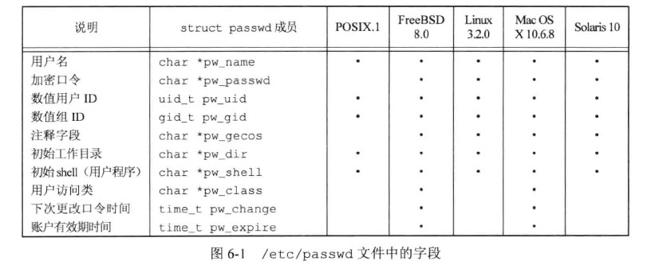
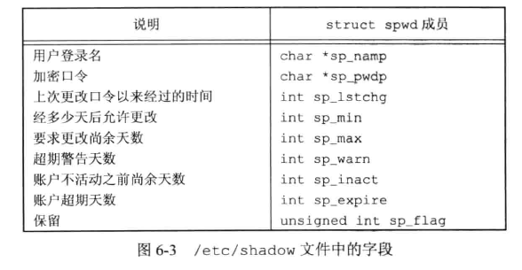
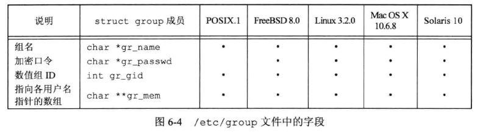
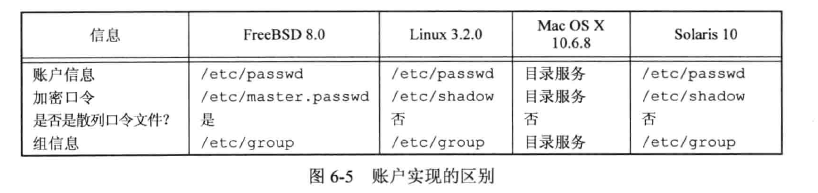
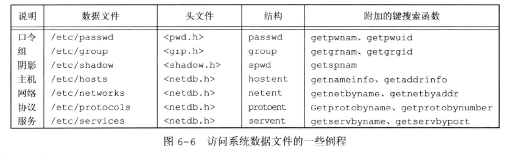
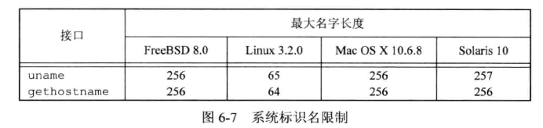
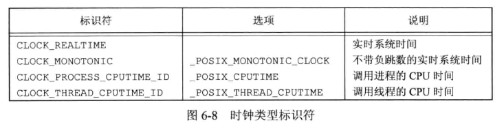
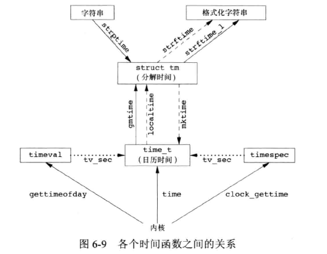
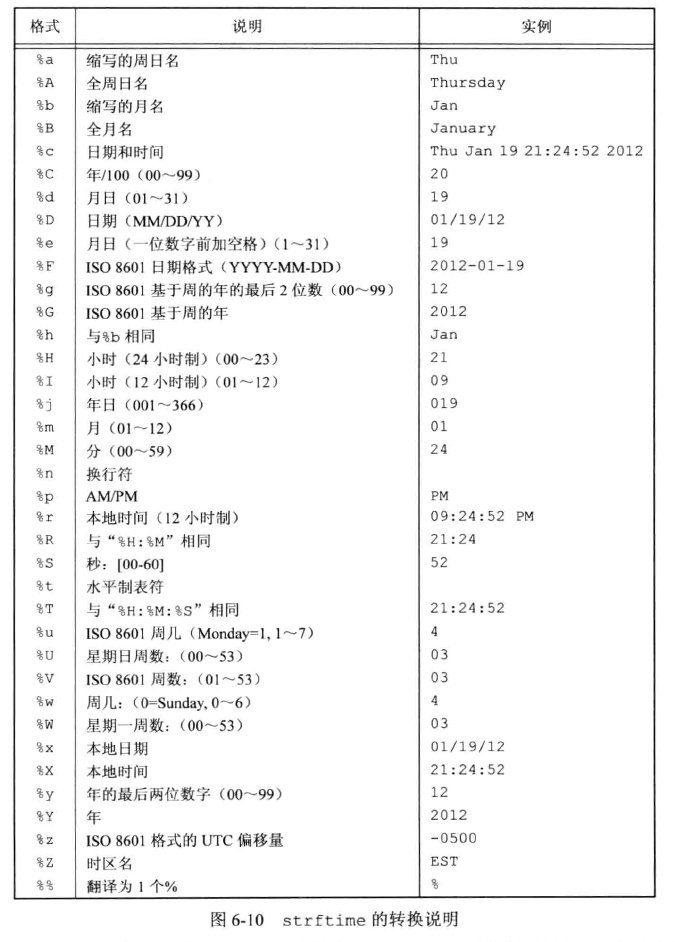
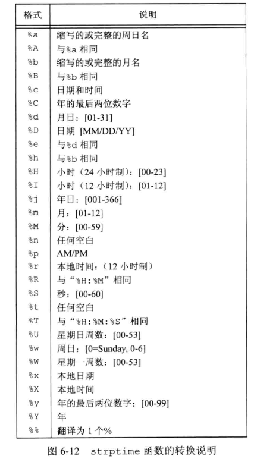

## 引言

口令文件 `/etc/passwd` 和组文件 `/etc/group` 是经常被多个程序频繁使用的两个文件。每次用户登录 UNIX 系统、执行 `ls -l` 命令时都要使用口令文件。  

由于历史原因，这些数据文件都是 ASCII 文本文件，使用标准 I/O 库读这些文件。但对于较大的系统，顺序扫描口令文件很花费时间，需要能够以非 ASCII 格式存放这些文件，同时仍向使用其他文件格式的应用提供接口。


## passwd 文件

`passwd` 结构体各个字段，定义在 `<pwd.h>` 文件中：



/etc/passwd 文件包含上图的各个字段，用冒号分隔：

* 通常有一个名为 root 的登录项，用户 ID 为 0（超级用户）。
* 加密口令字段包含了一个占位符。较早期的UNIX 在此字段存放口令，后面由于安全漏洞存放到 /etc/shadow 文件。
* 口令文件项某些字段可能是空。
* shell 字段包含了一个可执行程序名，它被用作该用户的登录 shell。若为空则取默认值，通常是 /bin/sh 。
* 阻止一个用户给登录，可以将 shell 字段设置为 /dev/null 、/bin/false、/bin/true、/sbin/nologin 等
* nobody 用户的目的是，使任何人可以登录到系统中，但其用户 ID 是65534，组 ID 也是 65534 ，不提供任何特权。该用户只能访问人人可读、写的文件。
* 提供 finger 命令的 UNIX 系统支持注释字段中的附加信息。各个部分用逗号分隔，例如名字、地址、电话等。

有些系统提供了 vipw 命令，允许管理员使用该命令编辑口令文件，并确保它所做的更改和其他相关文件保持一致。  

POSIX.1 定义了两个获取口令文件项的函数：

```c
#include <pwd.h>

struct passwd *getpwuid(uid_t uid);
struct passwd *getpwnam(const char *name);
		// 成功返回指针，出错返回 NULL
```

getpwuid 函数由 ls 程序使用，将 i 节点中的数字用户 ID 映射为用户登录名。  

getpwnam 函数由 login 程序使用。  

这两个函数都返回指向 passwd 结构体的指针，passwd 结构体通常是函数内部的静态变量，只要调用任一相关函数，内容就会被重写。  

有些函数可以用于程序查看整个口令文件：

```c
#include <pwd.h>

struct passwd *getpwent(void);
		// 成功返回指针，到达文件尾端或出错返回 NULL

void setpwent(void);
void endpwent(void);
```

getpwent 返回口令文件中的下一个记录项指针，指向一个 passwd 结构体。每次调用此函数都重写该结构体。  

setpwent 反绕它所使用的文件，定位到文件开始处。  

endpwent 关闭打开的口令文件。  

示例，实现 getpwnam 函数：

```c
#include <pwd.h>
#include <stddef.h>
#include <string.h>

struct passwd *getpwnam(const char *name){
    struct passwd *ptr;
    
    // 反绕到文件开始处，防止此前有其他调用者打开有关文件
    setpwent();
    // 读取记录项，对比 name
    while((ptr = getpwent()) != NULL)
        if(strcmp(name, ptr->pw_name) == 0)
            break;
    // 关闭打开的口令文件
    endpwent();
    // 返回 ptr 指针，如果未匹配则返回 NULL
    return(ptr);
}
```


## shadow 口令

加密口令是经过单项加密算法处理过的用户口令副本。不能从加密口令猜测到原来的口令明文。  

历史上使用的算法总是在 64 字符集`a-zA-Z0-9./` 中产生13个可打印字符。后续使用MD5、SHA1等，算法更复杂，字符串更长，更难猜测到。  

阴影口令(shadow password)存放在 /etc/shadow 文件，相关字段：



只有用户名和加密口令是必填字段。其他口令用于控制口令修改策略。  

获取函数：

```c
#include <shadow.h>

struct spwd *getspnam(const char *name);
struct spwd *getspent(void);
		// 成功返回指针，出错返回 NULL
void setspent(void);
void endspent(void);

```

FreeBSD 8.0 和 Mac OS X 10.6.8 没有 shadow 口令结构，附加的账户信息存放在 passwd 口令文件。


## group 文件

group 结构体定义在 `<grp.h>` 文件中：



字段 gr_mem 是一个指针数组，每个指针指向一个属于该组的用户名。该数组以 null 指针结尾。  

POSIX.1 定义的查看组名或 ID 的函数：

```c
#include <grp.h>

struct group *getgrgid(gid_t gid);
struct group *getgrnam(const char *name);
		// 成功返回指针，出错返回 NULL
```

这两个函数返回指向结构体 group 静态变量的指针，每次调用时都重写该静态变量。  

如果需要搜索整个组文件，有 3 个函数：

```c
#include <grp.h>

struct group *getgrent(void);
		// 成功返回指针，到达文件尾端或者出错返回 NULL

void setgrent(void);
void endgrent(void);
```

* getgrent 从组文件中读取下一个记录，如果该文件尚未打开，则先打开它。
* setgrent 打开组文件并反绕它。
* endgrent 关闭打开的组文件。


## 附属组 ID

1983年左右，4.2BSD引入**附属组ID(supplementary group ID)**。使得用户不仅可以属于口令文件记录项中组 ID对应的组，还可以属于最多 16 个另外的组。文件访问权限检查也将进程的附属组 ID和文件的组 ID进行对比。

相关函数：

```c
#include <unistd.h>

int getgroups(int gidsetsize, gid_t grouplist[]);
		// 成功返回附属组ID数量，出错返回-1

#include <grp.h>
int setgroups(int ngroups, const gid_t grouplist[]);
		// 成功返回0， 出错返回-1
int initgroups(const char *username, gid_t basegid);
		// 成功返回0， 出错返回-1
```

* getgroups 将进程所属用户的各附属组 ID 填写到数组 grouplist 中，最多为 gidsetsize 个，实际数量由函数返回。
  * 如果 gidsetsize 为 0，则函数只返回附属组 ID 数量，对数组 grouplist 不做修改。
* setgroups 由超级用户调用以便为调用进程设置附属组 ID 表。grouplist 是组 ID 数组， ngroups 是数组的元素数量。
* initgroups 函数读取整个组文件，对 username 确定其组的成员关系。然后调用 setgroups，以便为该用户初始化附属组 ID 表。


## 实现区别

4 种实现平台上对用户、组信息存储的区别：



很多系统支持通过 NIS、LDAP 管理用户和组。通过配置文件 `/etc/nsswitch.conf` 控制用于管理每一类信息的方法。


## 其他数据文件

除了口令文件和组文件，UNIX 还有很多数据文件，例如 BSD 常用来记录网络服务的 `/etc/services`，记录下一信息的 `/etc/protocols` ，记录网络信息的 `/etc/networks` 。这些数据文件的接口都与口令文件和组文件类似。一般都有3个函数：

1. get 函数。读下一个记录，如果需要还会打开该文件。通常返回一个指向结构体的指针。
2. set 函数。用于打开相应数据文件，然后反绕 (rewind)该文件。
3. end 函数。用于关闭相应数据文件

如果数据文件支持某种形式的键搜索（例如ID、name），也会提供按指定键搜索的相关例程。




## 登录账户记录

utmp 文件记录当前登录到系统的用户。  

wtmp 文件记录登录和注销事件。  

UNIX v7 中写入这两个文件的是如下结构体的二进制记录：

```c
struct utmp {
    char ut_line[8];	/* tty line: ttyh0、ttyd0 ... */
    char ut_name[8];	/* login name */
    long ut_time;		/* second since Epoch */
};
```

who 命令读取 utmp 文件，以可读格式打印内容。last 命令读取 wtmp 文件并打印所选记录。


## 系统标识

POSIX.1 定义了 uname 函数，返回与主机操作系统相关信息：

```c
#include <sys/utsname.h>

int uname(struct utsname *name);
		// 成功返回非负值，出错返回-1
```

通过参数向该函数传递 utsname 结构体的地址，函数填写此结构体。

```c
struct utsname{
    char sysname[ ];	/* name of the OS */
    char nodename[ ];	/* name of the node */
    char release[ ];	/* current release of OS */
    char version[ ];	/* current version of release */
    char machine[ ];	/* name of hardware type */
};
```

结构体的每个字符串都以 null 结尾。结构体中的信息通常可以用 uname 命令打印。  

gethostname 函数返回主机名：

```c
#include <unistd.h>

int gethostname(char *name, int namelen);
		// 成功返回0，出错返回-1
```

namelen 指定缓冲区长度，如果空间足够字符串以 null 字节结尾返回。  

POSIX.1 中定义最大主机名长度是 HOST_NAME_MAX 。



hostname 命令可以获取和设置主机名。主机名通常是系统在自举时设置。


## 时间和日期例程

由UNIX 内核提供的基本时间服务时计算自协调世界时(Coordinated Universal Time, UTC)公元 1970年1月1日00:00:00 以来经过的秒数。  

time 函数返回当前时间和日期：

```c
#include <time.h>

time_t time(time_t *calptr);
		// 成功返回时间值，出错返回-1
```

POSIX.1 的实时扩展增加了对多个系统时钟的支持。SUS V4中这些接口从可选组移到基本组。通过 clockid_t 类型进行标识。



clock_gettime 函数可用于获取指定时钟的时间，返回的时间在 timespec 结构体中，将时间表示为秒和纳秒：

```c
#include <sys/time.h>
int clock_gettime(clockid_t clock_id, struct timespec *tsp);
int clock_getres(clockid_t clock_id, struct timespec *tsp);
int clock_settime(clockid_t clock_id, struct timespec *tsp);
		// 成功返回0，出错返回-1


int gettimeofday(struct timeval *restrict tp, void *restrict *tzp);
		// 总是返回0
```

* 当时钟设置为 CLOCK_REALTIME 时，clock_gettime 函数提供了与 time 函数类似的功能，如果系统支持高精度时间值，clock_gettime 可能比 time 获取更高精度的时间值。  
* clock_getres 函数把参数 tsp 指向的 timespec 结构体初始化为 clock_id 参数对应的时钟精度。例如精度为 1 毫秒，tv_sec 字段就是0，tv_nsec 字段就是 1 000 000。
* clock_settime 函数对特定的时钟设置时间。
* gettimeofday 函数已经弃用。部分程序仍然使用该函数，它比 time 提供了更高的精度，可到微秒级。tzp 的唯一合法值是 NULL，部分实现用来说明时区，但 SUS 没有定义。  

一旦取得时间经过的秒数整数时间值后，通常要调用函数将其转换为分解的时间结构，然后调用另一个函数生成人们可读的时间和日期。各种时间函数之间的关系：



localtime、mktime、strftime 都受到环境变量 TZ 的影响。  

两个函数 localtime、gmtime 将日历时间转换成分解的时间，并存放在一个 tm 结构体中。  

```c
struct tm{
    int tm_sec;		/* 秒数 [0-60] */
    int tm_min;		/* 分钟数 [0-59] */
    int tm_hour;	/* 小时数 [0-23] */
    int tm_mday;	/* 月份中的天数值 [1-31] */
    int tm_mon;		/* 月份 [0-11] */
    int tm_year;	/* 1900年之后经过的年份值 */
    int tm_wday;	/* 周日起的星期值 [0-6] */
    int tm_yday;	/* 一年中从1月1日起的天数 [0-365] */
    int tm_isdst;	/* 夏令时标志:<0, 0, >0 */
};
```

超过 59 的秒表示闰秒。除了 `tm_mday` 字段，其他字段都以 0 开始。如果夏令时生效，标志值为正，如果非夏令时标志为 0，如果此信息不可用标志为负。  

```c
#include <time.h>

struct tm *gmtime(const time_t *calptr);
struct tm *localtime(const time_t *calptr);
		// 两个函数返回指向分解的 tm 结构体的指针，如果出错返回 NULL

time_t mktime(struct tm *tmptr);
		// 成功返回日历时间，出错返回-1

```

* gmtime： 将日历时间转换成协调统一时间的年、月、日、时、分、秒、周日分解结构
* localtime：将日历时间转换成本地时间（考虑本地时区和夏令时标志）
* mktime：以本地时间的年、月、日为参数，将其转换成 time_t 值


```c
#include <time.h>


size_t strftime(char *restrict buf, size_t maxsize, const char *restrict format, const struct tm *restrict tmptr);
size_t strftime_l(char *restrict buf, size_t maxsize, const char *restrict format, const struct tm *restrict tmptr, locale_t locale);
		// 若有空间返回存入数组的字符数，否则返回 0
```

* strftime：类似于 printf 的时间值函数，剋有通过参数制定产生的字符串，通过 TZ 环境变量指定区域。
* strftime_l：允许调用者将区域指定为参数 locale，其余和 strftime 函数一致。
* tmptr 参数是要格式化的时间值，由指向 tm 结构体的指针说明。格式化结果存放在 maxsize 个字符的 buf 数组中，如果 buf 足够存放格式化结果以及一个 null 终止符，则返回 buf 中存放的字符，否则返回 0
* format 参数控制时间值的格式。如同 printf 函数一样，转换说明是百分号之后跟一个特定字符。format 中其他字符则原样输出。但 format 中没有字段宽度修饰符，每个转换说明产生一个不同的定长输出字符串。



示例，strftime 函数使用：

```c
#include <stdio.h>
#include <stdlib.h>
#include <time.h>

int main(void){
    time_t t;
    struct tm *tmp;
    char buf1[16];
    char buf2[64];


    time(&t);
    tmp = localtime(&t);
    if(strftime(buf1, 16, "time and date: %r, %a, %b %d, %Y", tmp) == 0)
        printf("buffer length 16 is too small\n");
    else
        printf("%s\n", buf1);

    if(strftime(buf2, 64, "time and date: %r, %a, %b %d, %Y", tmp) == 0)
        printf("buffer length 64 is too small\n");
    else
        printf("%s\n", buf2);

    exit(0);
}
```

执行：

```bash
$ ./6.11
buffer length 16 is too small
time and date: 11:37:45 PM, Tue, Dec 23, 2025
```


strptime 函数与 strftime 相反，将字符串时间转换为分解时间：

```c
#include <time.h>

char *strptime(const char *restrict buf, const char *restrict format, struct tm *restrict tmptr);
		// 返回指向上次解析的字符的下一个字符的指针，否则返回 NULL
```

format 参数给出 buf 参数指向的缓冲区内的字符串的格式。与 strftime 的格式说明类似：



环境变量 TZ 如果定义了，这些函数会用其值替代系统默认时区。可以参考手册 tzset(3)。


