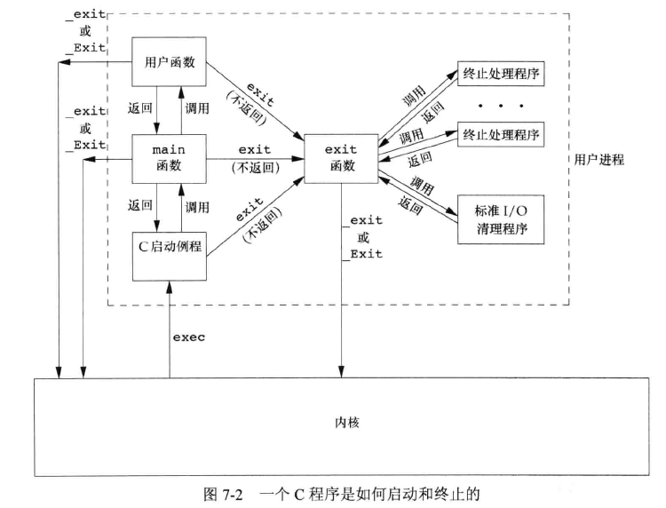
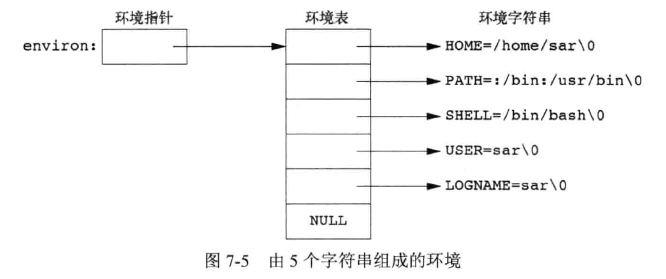
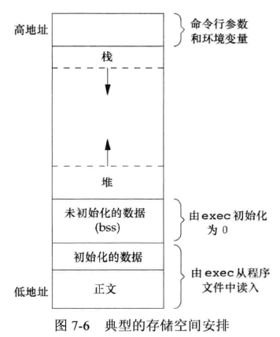
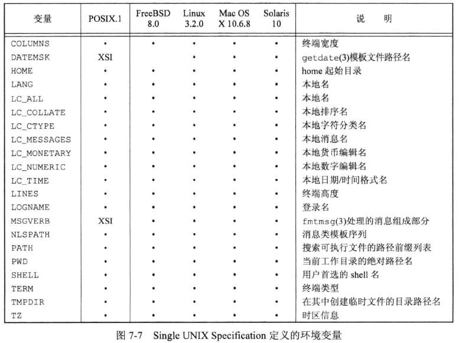
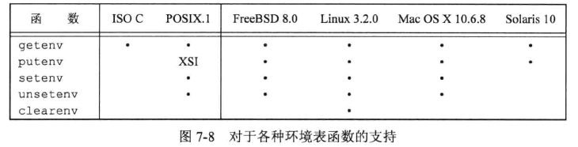
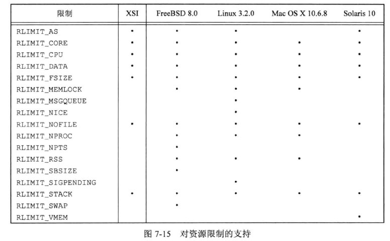

## 引言

主要介绍进程执行时，main 函数的调用，命令行传参，存储空间布局及新空间分配，环境变量，终止方式等。


## main 函数

C 程序总是从 main 函数开始执行，main 函数原型：

```c
int main(int argc, char *argv[]);
```

argc 是参数个数，argv 是指向参数的各个指针数组。  

当内核执行 C 程序时，在调用 main 函数前先调用一个特殊的启动例程。可执行文件将此启动例程指定为程序的起始地址，这是由链接编辑器设置的，链接编辑器由 C 编译器调用。启动例程从内核取得命令行参数和环境变量值，为按照上述方式调用 main 函数做好安排。


## 进程终止

8 种进程终止(termination)的方式。  

5 种是正常终止：

* 从 main 返回
* 调用 exit
* 调用 _exit 或 Exit
* 最后一个线程从启动例程返回
* 从最后一个线程调用 pthread_exit

3 种异常终止：

* 调用 abort
* 接到一个信号
* 最后一个线程对取消请求做出响应


### 退出函数

3 个用于正常终止一个程序的函数，`_exit` 和 `_Exit` 用于立即进入内核， `exit` 则先执行一些清理再进入内核：

```c
#include <stdlib.h>

void exit(int status);
void _Exit(int status);

#include <unistd.h>
void _exit(int status);
```

exit 函数总是执行一个标准 I/O 库的清理关闭操作：对于所有打开流调用 fclose，会将所有输出缓冲区的数据 flush 到文件上。  

status 参数是终止状态(或退出状态， exit status)。大多数 UNIX 系统 shell 都提供检查终止状态的方法。  

从 ISO C 1999 开始，如果 main 函数没有声明返回值为整型，或者内部没有返回整型值，编译器会发出警告。  


### 函数 atexit

ISO C 规定，一个进程可以登记多至 32 个函数，这些函数将由 exit 自动调用。将这些函数称为**终止处理程序(exit handler)**，并调用 `atexit` 函数来登记这些函数。  

```c
#include <stdlib.h>

int atexit(void (*func)(void));
		// 成功返回0，出错返回非0
```

参数是一个函数地址，当调用此函数时无需向它传递任何参数，也没有返回值。exit 调用这些函数的顺序与他们登记时候的顺序相反。同一函数如果多次登记，也会被调用多次。  

exit 首先调用各终止处理程序，然后关闭(通过 fclose)所有打开流。POSIX.1 扩展了 ISO C 标准，如果程序调用 exec 函数族种的任一函数，则将清除所有已安装额终止处理程序。



内核使程序执行的唯一方法是调用一个 exec 函数。进程自愿终止的唯一方法是显式或隐式地调用 _exit 或 _Exit 。进程也可以非自愿地由一个信号使其终止(图中没有显示)。


示例，atexit 函数的使用：

```c
#include "apue.h"

static void my_exit1(void);
static void my_exit2(void);

int main()
{
    if (atexit(my_exit2) != 0)
        err_sys("can't register my_exit2");

    if (atexit(my_exit1) != 0)
        err_sys("can't register my_exit1");
    if (atexit(my_exit1) != 0)
        err_sys("can't register my_exit1");

    printf("main is done\n");
    return (0);
}

static void my_exit1(void)
{
    printf("first exit handler\n");
}

static void my_exit2(void)
{
    printf("second exit handler\n");
}
```


执行：

```bash
$ ./7.3 
main is done
first exit handler
first exit handler
second exit handler
```


## 命令行参数

当执行一个程序时，调用 exec 的进程可以将命令行参数传递给该程序。

示例，回显命令行参数：

```c
#include "apue.h"

int main(int argc, char *argv[]){
	int i;
    
    for(i = 0; i < argc; i++)
        printf("argv[%d]: %s\n", i, argv[i]);
    return(0);
}
```

执行：

```bash
$ ./7.4 arg1 arg2 foo TEST
argv[0]: ./7.4
argv[1]: arg1
argv[2]: arg2
argv[3]: foo
argv[4]: TEST
```

ISO C 和 POSIX.1 都要求 `argv[argc]` 是一个空指针，因此上面示例中 for 循环可以改为：

```c
    for(i = 0; argv[argc] != NULL ; i++)
```


## 环境表

每个程序都接收一张环境表。与参数一样，环境表也是一个字符指针数组，其中每个指针包含一个以 null 结束的字符串地址。全局变量 environ 则包含了该指针数组的地址：

```c
extern char **environ
```

一个示例，environ 称为**环境指针(environment pointer)**，指针数组为环境表，其中各指针指向的字符串为**环境字符串**：



按照惯例，环境由 `name=value` 格式的字符串组成，大多数预定义名完全由大写字母组成。  

历史上大多数 UNIX 支持 main 函数带 3 个参数，第三个参数就是环境表地址：

```c
int main(int argc, char *argv[], char *envp[]);
```

由于 ISO C 规定 main 函数只有两个参数，而且第三个参数与全局变量 environ 相比并没有更多益处，所以 POSIX.1 也规定应使用 environ 而不使用第三个参数。通常用 getenv 、putenv 函数来访问特定的环境变量，而不是用 environ 变量，但如果要查看整个环境则必须要用 environ 指针。


## C程序的存储空间分布


* 正文段，text。CPU执行的指令部分，通常是可以共享，只读的。
* 初始化数据段，data。程序中明确赋过初始值的变量。
* 未初始化数据段，bss。bss 段名称来自早期汇编程序一个操作符，意思是 block started by symbol。程序开始前，内核将 bss 段中的数据初始化为 0 或者 空指针。
* 栈，stack。自动变量及每次函数调用所需保存的信息都保存在此段中。
* 堆，heap。动态存储分配的空间。




## 共享库

大多数 UNIX 支持共享库。公用的库函数可以存放在所有进程都可引用的存储区，程序第一次执行或第一次调用某个库函数时，用动态链接方法将程序与共享库函数相链接。这减少了每个可执行文件的长度，但增加了一些运行时开销。另外一个优点时库函数的版本更新无需重新链接引用它的程序。  

使用参数 -static 会阻止 gcc 使用共享库，通过对比可以看出编译后的文件大小差异（gcc 默认使用共享库）：

```bash
$ gcc helloworld.c -o hello
$ ll -h hello
-rwxrwxr-x 1 xmy xmy 16K Dec 24 15:08 hello*
$ gcc -static helloworld.c -o hello
$ ll -h hello
-rwxrwxr-x 1 xmy xmy 767K Dec 24 15:08 hello*
```


## 存储空间分配

### 三个 alloc 函数

ISO C 说明了 3 个用于存储空间动态分配的函数：

1. malloc。分配指定字节数的存储区，初始值不确定。
2. calloc。为指定长度的对象分配存储空间，每一位都初始化为 0。
3. realloc。增加或减少以前分配区的长度。长度增加时，可能需要将以前分配区的内容移到另一个足够大的区域，新增区域初始值则不确定。

```c
#include <stdlib.h>

void *malloc(size_t size);
void *calloc(size_t nobj, size_t size);
void *realloc(void *ptr, size_t newsize);
		// 成功返回非空指针，出错返回 NULL

void free(void *ptr);
```


### 替代的存储空间分配程序

1. libmalloc。基于 SVR4 的UNIX 系统，包含 libmalloc 库，提供了一套与 ISO C 存储空间函数相匹配的接口。
2. vmalloc。
3. quick-fit。比标准的 malloc 算法常用的最佳适配或首次适配存储分配策略要快，但可能使用较多存储空间。
4. jemalloc。FreeBSD 8.0 中默认的存储空间分配程序。
5. TCMalloc。Google-perftools 工具中的一个。从高速缓存中分配缓冲区以及释放缓冲区到高速缓存中时，它使用线程-本地高速缓存来避免锁开销。
6. 函数 alloca。在当前函数栈帧上分配空间，而不是堆上。优点是函数返回时自动释放所使用的栈帧，不必担心释放空间。缺点是增加了栈帧的长度，有些系统在函数已被调用后不能增加栈帧长度，因此不支持。书中演示用的平台 Solaris、MacOS、Linux、FreeBSD 都支持。


## 环境变量


ISO C 定义了一个函数 getenv，可以用其取环境变量值，但具体内容由实现定义：

```c
#include <stdlib.h>

char *getenv(const char *name);
		// 返回指向与 name 相关联的 value 的指针，未找到则返回 NULL
```

SUS 中的 POSIX.1 定义了一些环境变量。但 ISO C 没有定义任何环境变量。



除了获取环境变量，有时也需要修改或者增加环境变量，不同标准及实现对此的支持如下：



clearenv 不是 SUS 的组成部分，它用来清除环境表中所有项。  

putenv、setenv、unsetenv 函数原型：

```c
#include <stdlib.h>

int putenv(char *str);
		// 成功返回0，出错返回非0

int setenv(const char *name, const char *value, int rewrite);
int unsetenv(const char *name);
		// 成功返回0，出错返回-1
```

* putenv 取形式为 `name=value` 的字符串，将其放到环境表。如果name已存在，则先删除原来的值。
* setenv 将 name 设置为 value。如果环境中 name 已存在，取决于 rewrite 的值：
  * 如果 rewrite 非0，则先删除现有定义
  * 如果 rewrite 为0，则不删除现有定义，不设置新的value值，也不出错
* unsetenv 删除 name 定义，如果 name 不存在也不报错。

环境表和环境字符串通常存放在进程存储空间的顶部（栈之上）。删除一个字符串很简单，在环境表中找到该指针，然后将所有后续指针都向环境表首部顺序移动一个位置。但增加或修改现有字符串则比较困难。顶部和底部都无法扩展。有以下规则：

1. 如果修改一个现有 name：
   * 如果新 value 的长度少于或等于现有 value 的长度，则只要将新字符串复制到原字符串所用的空间
   * 如果 value 的长度大于原长度，则必须调用 malloc 为新字符串分配空间，然后将新字符串复制到该空间中，然后将环境表中针对 name 的指针指向新分配区
2. 如果要增加一个新的 name，必须调用 malloc 为 name=value 字符串分配空间，然后将该字符串复制到此空间中。
   * 如果是第一次增加一个新 name，必须调用 malloc 为新的指针表分配空间。复制环境表到新分配区，将新字符串指针存放在该指针表尾端，在存放一个空指针在其后。最后使 environ 指向新指针表。如果原来的环境表位于栈顶之上，则必须将环境表移到堆中，但此表中原有指针仍指向栈顶之上的 name=value 字符串。
   * 如果不是第一次增加新 name，则可知一调用 malloc 在堆中为环境表分配了空间，只要调用 realloc 扩充空间。


## 函数 setjmp 和 longjmp

C 语言中 goto 语句是不能跨越函数的，而执行这种类型跳转的函数 setjmp 和 longjmp。这两个函数对于处理发生在很深层嵌套函数调用中的出错情况很有用。

```c
#include <setjmp.h>

int setjmp(jmp_buf env);
		// 直接调用则返回0，若从longjmp返回则返回非0

void longjmp(jmp_buf env, int val);
```

从希望返回到的位置调用 setjmp 函数。参数 env 为特殊类型 jmp_buf，是某种形式的数组，存放在调用 longjmp 时能用来恢复栈状态的所有信息。通常 env 定义为全局变量。  

当检查到一个错误时，可以调用 longjmp 函数。提供 env 和非0值的 val 参数，val 将成为从 setjmp 处返回的值，setjmp 可以从多个 longjmp 返回，val 就可以用来判断从何处返回的。  


示例：

```c
#include "apue.h"
#include <setjmp.h>

static void	f1(int, int, int, int);
static void	f2(void);

static jmp_buf	jmpbuffer;
static int		globval;

int
main(void)
{
	int				autoval;
	register int	regival;
	volatile int	volaval;
	static int		statval;

	globval = 1; autoval = 2; regival = 3; volaval = 4; statval = 5;

	if (setjmp(jmpbuffer) != 0) {
		printf("after longjmp:\n");
		printf("globval = %d, autoval = %d, regival = %d,"
		    " volaval = %d, statval = %d\n",
		    globval, autoval, regival, volaval, statval);
		exit(0);
	}

	/*
	 * Change variables after setjmp, but before longjmp.
	 */
	globval = 95; autoval = 96; regival = 97; volaval = 98;
	statval = 99;

	f1(autoval, regival, volaval, statval);	/* never returns */
	exit(0);
}

static void
f1(int i, int j, int k, int l)
{
	printf("in f1():\n");
	printf("globval = %d, autoval = %d, regival = %d,"
	    " volaval = %d, statval = %d\n", globval, i, j, k, l);
	f2();
}

static void
f2(void)
{
	longjmp(jmpbuffer, 1);
}

```

执行：

```bash
## 不优化
$ sudo gcc -O0 testjmp.c 
$ ./a.out 
in f1():
globval = 95, autoval = 96, regival = 97, volaval = 98, statval = 99
after longjmp:
globval = 95, autoval = 96, regival = 3, volaval = 98, statval = 99
## 基础优化
$ sudo gcc -O testjmp.c 
$ ./a.out 
in f1():
globval = 95, autoval = 96, regival = 97, volaval = 98, statval = 99
after longjmp:
globval = 95, autoval = 2, regival = 3, volaval = 98, statval = 99
$ 
```


## 函数 getrlimit 和 setrlimit

每个进程都有一组资源限制，其中一些可以调用如下函数查询和更改：

```c
#include <sys/resource.h>

int getrlimit(int resource, struct rlimit *rlptr);
int setrlimit(int resource, const struct rlimit *rlptr);
		// 成功返回0，出错返回非0
```

对上面两个函数的调用需要指定一个资源 resource 和一个 rlimit 结构体参数。

结构体 rlimit ：

```c
struct rlimit{
    rlim_t rlim_cur;
    rlim_t rlim_max;
};
```


更改资源限制时，需要遵循的规则：

1. 任何一个进程都可将一个软限制值更改为小于或等于其硬限制值
2. 任何一个进程都可降低其硬限制值，但它必须大于或等于其软限制值。对于普通用户这种降低不可逆。
3. 只有超级用户进程可以提高硬限制值。


SUS 定义的以及几种 UNIX 实现中，资源 resource 参数取值：



常量 RLIM_INFINITY 指定了一个无限量的限制。

* RLIMIT_AS。进程总的可用存储空间的最大字节长度。影响到 sbrk 、mmap 函数。   
* RLIMIT_CORE。core 文件的最大字节数。若为0则阻止创建 core 文件。
* RLIMIT_CPU。CPU 时间的最大量值（秒），超过此软限制时，向该进程发送 SIGXCPU 信号。
* RLIMIT_DATA。数据段的最大字节长度。data、bss、heap 的总和。
* RLIMIT_FSIZE。可以创建的文件的最大字节长度。超过此软限制，则向进程发送 SIGXFSZ 信号。   
* RLIMIT_MEMLOCK。进程使用 mlock 能够锁定在存储空间中的最大字节长度。
* RLIMIT_MSGQUEUE。进程为 POSIX 消息队列可分配的最大存储字节数。
* RLIMIT_NICE。影响进程的调度优先级，nice 值可设置的最大限制。
* RLIMIT_NOFILE。每个进程能够打开的最多文件数。更改此限制将影响 sysconf 函数在参数 _SC_OPEN_MAX 中返回的值。
* RLIMIT_NPROC。每个实际用户 ID可拥有的最大子进程数。更改此限制将影响 sysconf 函数在参数 _SC_CHILD_MAX 中返回的值。
* RLIMIT_NPTS。用户可同时打开的伪终端最大数量。
* RLIMIT_RSS。最大驻内存集字节长度（resident set size in bytes，RSS）。如果物理内存非常少，内核将从进程处取回超过 RSS 的部分。
* RLIMIT_SBSIZE。在任一给定时刻，一个用户可以占用的套接字缓冲区的最大字节长度。    
* RLIMIT_SIGPENDING。一个进程可排队的信号最大数量。这个限制是 sigqueue 函数实施的。
* RLIMIT_STACK。栈最大字节长度。
* RLIMIT_SWAP。交换空间最大字节数。
* RLIMIT_VMEM。同 RLIMIT_AS。

ulimit、limit 命令等内置在shell 中可以影响用户和相关进程资源限制。


示例，打印限制值：

```c
#include "apue.h"
#include <sys/resource.h>

#define	doit(name)	pr_limits(#name, name)

static void	pr_limits(char *, int);

int
main(void)
{
#ifdef	RLIMIT_AS
	doit(RLIMIT_AS);
#endif

	doit(RLIMIT_CORE);
	doit(RLIMIT_CPU);
	doit(RLIMIT_DATA);
	doit(RLIMIT_FSIZE);

#ifdef	RLIMIT_MEMLOCK
	doit(RLIMIT_MEMLOCK);
#endif

#ifdef RLIMIT_MSGQUEUE
	doit(RLIMIT_MSGQUEUE);
#endif

#ifdef RLIMIT_NICE
	doit(RLIMIT_NICE);
#endif

	doit(RLIMIT_NOFILE);

#ifdef	RLIMIT_NPROC
	doit(RLIMIT_NPROC);
#endif

#ifdef RLIMIT_NPTS
	doit(RLIMIT_NPTS);
#endif

#ifdef	RLIMIT_RSS
	doit(RLIMIT_RSS);
#endif

#ifdef	RLIMIT_SBSIZE
	doit(RLIMIT_SBSIZE);
#endif

#ifdef RLIMIT_SIGPENDING
	doit(RLIMIT_SIGPENDING);
#endif

	doit(RLIMIT_STACK);

#ifdef RLIMIT_SWAP
	doit(RLIMIT_SWAP);
#endif

#ifdef	RLIMIT_VMEM
	doit(RLIMIT_VMEM);
#endif

	exit(0);
}

static void
pr_limits(char *name, int resource)
{
	struct rlimit		limit;
	unsigned long long	lim;

	if (getrlimit(resource, &limit) < 0)
		err_sys("getrlimit error for %s", name);
	printf("%-14s  ", name);
	if (limit.rlim_cur == RLIM_INFINITY) {
		printf("(infinite)  ");
	} else {
		lim = limit.rlim_cur;
		printf("%10lld  ", lim);
	}
	if (limit.rlim_max == RLIM_INFINITY) {
		printf("(infinite)");
	} else {
		lim = limit.rlim_max;
		printf("%10lld", lim);
	}
	putchar((int)'\n');
}

```

执行：

```bash
$ ./getrlimit
RLIMIT_AS       (infinite)  (infinite)
RLIMIT_CORE              0  (infinite)
RLIMIT_CPU      (infinite)  (infinite)
RLIMIT_DATA     (infinite)  (infinite)
RLIMIT_FSIZE    (infinite)  (infinite)
RLIMIT_MEMLOCK  2078560256  2078560256
RLIMIT_MSGQUEUE      819200      819200
RLIMIT_NICE              0           0
RLIMIT_NOFILE      1048576     1048576
RLIMIT_NPROC         63393       63393
RLIMIT_RSS      (infinite)  (infinite)
RLIMIT_SIGPENDING       63393       63393
RLIMIT_STACK       8388608  (infinite)
```

