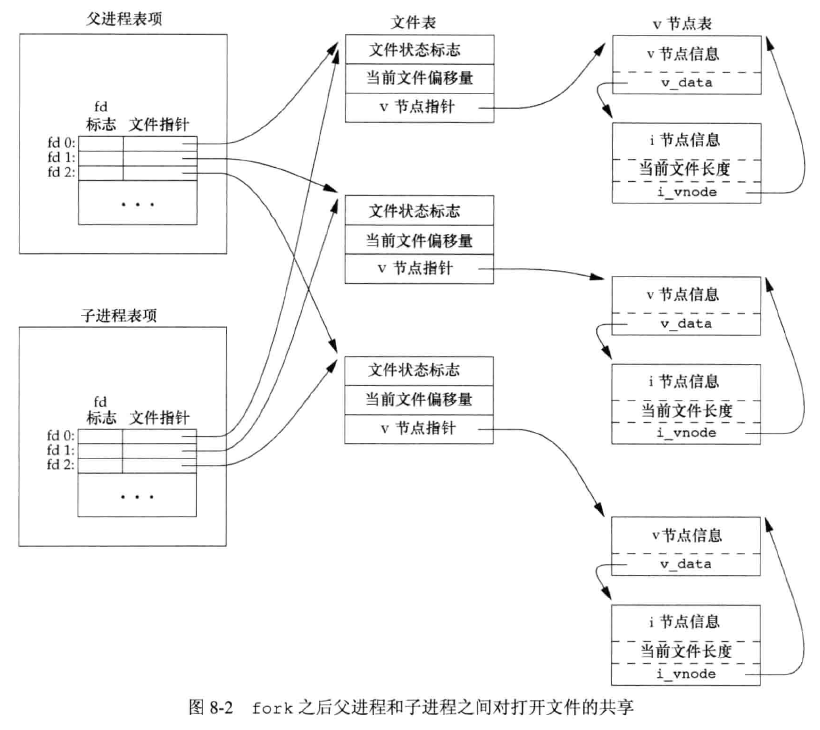
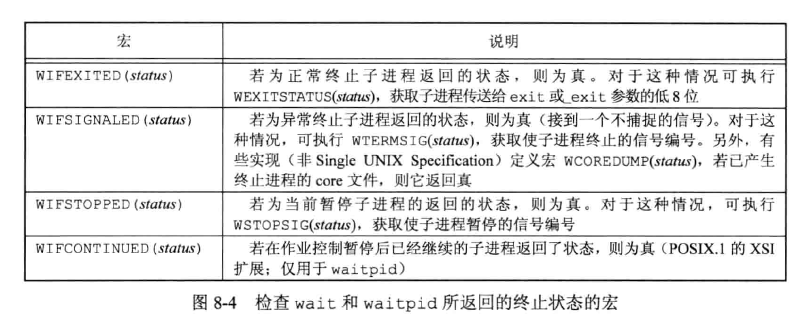
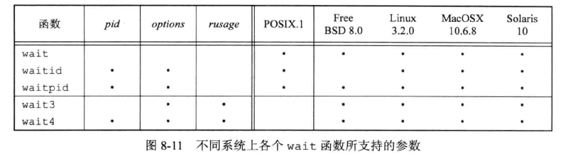
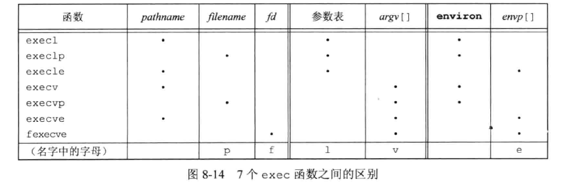
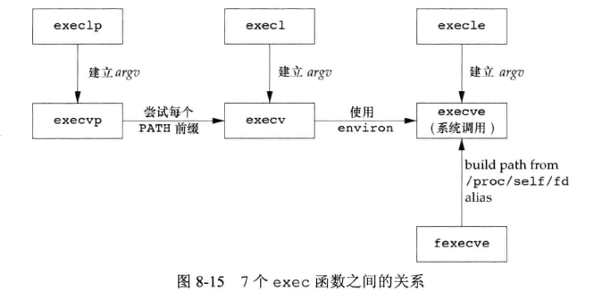
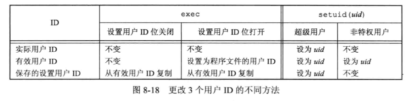
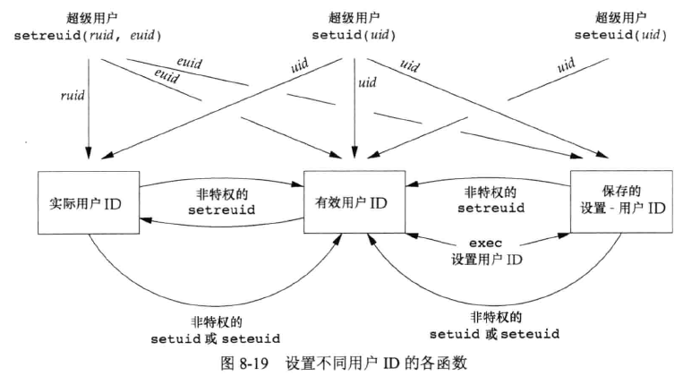
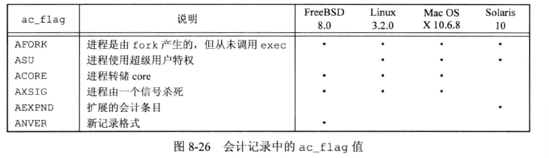
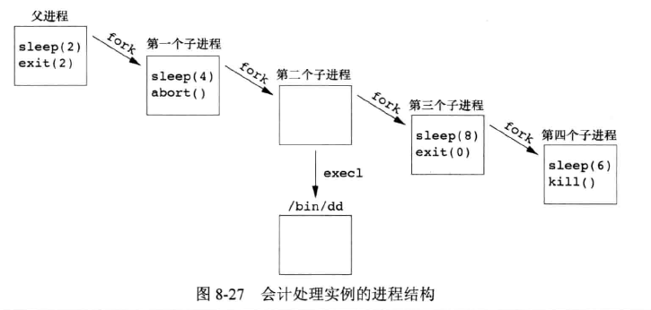
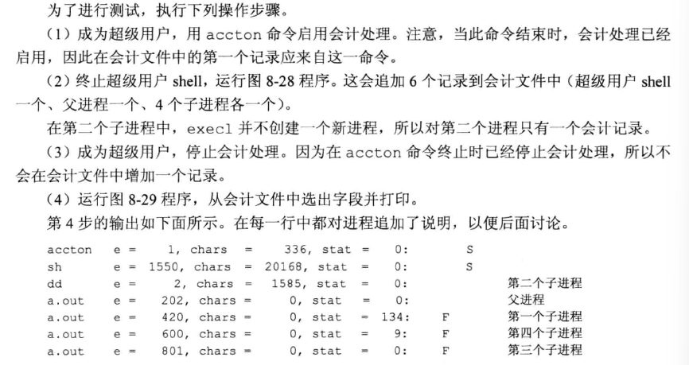

## 引言

介绍进程控制：创建、执行、终止等。说明进程属性的各种 ID：实际、有效、保存的用户 ID 和组 ID，进程控制原语，解释器文件、system 函数。会计机制。


## 进程标识

每个进程都有一个非负整型标识的进程 ID。该标识符是唯一的，有时有些应用会将 ID 作为名字一部分创建也给唯一的文件名。  

当进程终止后，其进程 ID 就成为被复用的候选ID，其他进程可能会使用该 ID，UNIX 系统采用延迟复用算法，尽量延缓该 ID 被复用时间。  

系统有一些专用进程，具体根据实现有所不同。ID 为 0 的进程通常是调度进程，被称为**交换进程(swapper)**，是内核的一部分，不执行任何磁盘上的程序，也被称为系统进程。进程 ID 为 1 的进程是 init 进程，在自举过程结束时由内核调用。早期版本是 /etc/init，之后版本是 /sbin/init。此进程在内核自举完成后负责启动 UNIX 系统，读取系统初始化有关文件，例如 /etc/rc*文件、/etc/inittab文件、/etc/init.d 目录下文件等，并将系统引导到一个状态。init 进程绝不会终止，它是一个普通的用户进程，以超级用户特权运行。是所有孤儿进程的父进程。  

*Mac OS X 10.4 中，init 进程被 launchd 进程替代，并扩展功能。*  

每个 UNIX 系统实现有自己的一套提供操作系统服务的内核进程，例如，有些虚拟存储器实现中，进程 ID 为 2 的是**页守护进程(page daemon)**，负责虚拟存储器系统分页操作。  

除进程 ID 外，还有一些标识符，相关函数如下：

```c
#include <unistd.h>

pid_t getpid(void);
		// 返回进程的进程 ID
pid_t getppid(void);
		// 返回进程的父进程 ID
uid_t getuid(void);
		// 返回进程的实际用户 ID
uid_t geteuid(void);
		// 返回进程的有效用户 ID
gid_t getgid(void);
		// 返回进程的实际组 ID
gid_t getegid(void);
		// 返回进程的有效组 ID

```

这些函数都没有出错返回。


## fork

现有进程可以调用 fork 函数创建一个新进程：

```c
#include <unistd.h>

pid_t fork(void);
		// 子进程返回0，父进程返回子进程 ID，出错返回-1
```

fork 创建的新进程被称为**子进程(child process)**。fork 被调用一次返回两次，分别给子进程返回0，给父进程返回子进程ID。  

子进程和父进程继续执行 fork 调用之后的指令。子进程是父进程的副本。父子进程共享正文段。子进程获得父进程数据空间、堆、栈的副本，现在很多实现不执行完全副本，采用**写时复制(Copy-On-Write，COW)**技术，将这些区域变为父、子进程只读共享，如果父子进程种任一个试图修改这些区域，内核为修改区域的那块内存制作一个副本，在此副本上进行修改，通常是虚拟存储系统种的一页(page)。  

示例：

```c
#include "apue.h"

int globvar = 6;
char buf[] = "a write to stdout\n";

int main(void){
    int var;
    pid_t pid;

    var = 88;
    if(write(STDOUT_FILENO, buf, sizeof(buf)-1) != sizeof(buf)-1)
        err_sys("write error");
    printf("before fork\n");

    if((pid = fork()) < 0)
        err_sys("fork error");
    else if (pid == 0){
        globvar++;
        var++;
    }else  {
        sleep(2);
    }

    printf("pid = %ld, glob = %d, var = %d\n", (long)getpid(), globvar, var);
    return 0;
}
```

执行：

```bash
## 子进程中修改的变量值不会影响到父进程。
$ ./8.1
a write to stdout
before fork
pid = 3073, glob = 7, var = 89
pid = 3072, glob = 6, var = 88
## 重定向到文件中，会比终端标准输出多一行“before fork“，是因为终端是行缓冲的，fork之前会flush缓冲区内容到终端，而重定向到文件 fork 复制了缓冲区到子进程，两个进程 exit 之前将缓冲区内容 flush 到文件上
$ ./8.1 > buf.txt
$ cat buf.txt 
a write to stdout
before fork
pid = 3165, glob = 7, var = 89
before fork
pid = 3164, glob = 6, var = 88
```

fork 之后父子进程的先后执行顺序是不确定的，取决于内核所用的调度算法。如果要同步父子进程之间数据，则需要某种形式的进程间通信。  


**文件共享**  

上面示例执行中，重定向父进程标准输出时，子进程的标准输出也被重定向。这是由于 fork 的特性，将父进程所打开文件描述符都被复制到子进程中，类似执行 dup 函数。父子进程中相同的打开文件描述符共享一个文件表项。  

例如，一个进程打开的标准输入、标准输出、标准错误，在 fork 之后，有如下结构：

 

如果父子进程写同一 fd 指向的文件，但又没有任何形式的同步，那么他们的输出就会相互混合。这种操作模式并不常用。  

在 fork 之后处理文件描述符有如下常见情况：

1. 父进程等待子进程完成。这种情况下，父进程无需处理，等待子进程终止后，文件偏移量已经更新。
2. 父进程和子进程各自执行不同的程序段。这种情况下，他们关闭各自不需要使用的文件描述符，互不影响，网络服务进程经常使用这种方法。

除了打开文件，还有很多属性也由子进程继承：

* 实际用户 ID、实际组 ID、有效用户 ID、有效组 ID
* 附属组 ID
* 进程组 ID
* 会话 ID
* 控制终端
* 设置用户 ID 标志和设置组 ID 标志
* 当前工作目录
* 根目录
* 文件模式创建屏蔽字
* 信号屏蔽和安排
* 对任一打开文件描述符的执行时关闭(close-on-exec)标志
* 环境
* 链接的共享存储段
* 存储映像
* 资源限制

父子进程主要区别如下：

* fork 的返回值不同
* 进程 ID 不同
* 他们的父进程 ID 不同
* 子进程的 tm_utime、tms_stime、tms_cutime、tms_ustime 的值设置为 0
* 子进程不继承父进程设置的文件锁
* 子进程未处理闹钟被清除
* 子进程未处理信号集设置为空集


fork 函数失败的主要原因有：

1. 系统中已经有太多的进程
2. 该实际用户 ID 的进程总数超过了系统限制


fork 常见用法场景：

1. 一个父进程希望复制自己，使父进程和子进程同时执行不同的代码段。网络服务进程中很常见，父进程等待客户端服务请求，有请求到达时，父进程 fork 子进程处理此请求，自身则继续等待下一个服务请求。
2. 一个进程要执行一个不同的程序。shell 中很常见，子进程从 fork 返回后立即调用 exec。
   * 有些操作系统将 fork 之后的 exec 组合成一个操作，称为 spwn。UNIX 系统将这两个操作分开。


## vfork

旧函数，SUSv4 中被删除。  

vfork 函数用于创建一个新进程然后 exec 一个新程序。但它并不完全复制地址空间到子进程中，并且保证子进程先运行，调用 exec 或 exit 之后父进程才可能被调度运行。


## exit

3 个终止函数 `exit`、`_exit`、`_Exit` 。  

进程终止有8种方式，5种正常和3种异常。 

五种正常退出：

1. 在 main 函数内执行 `return` 语句。等效于调用 `exit`。
2. 调用 `exit` 函数。此函数由 ISO C 定义，作用是调用各终止处理程序(调用 `atexit` 函数登记的)，关闭所有标准I/O流等。
3. 调用 `_exit` 或 `_Exit` 函数。ISO C 定义，目的是无需运行终止处理程序或信号处理程序而终止。
4. 进程的最后一个线程在启动例程种执行 return 语句。
5. 进程的最后一个线程调用 `pthread_exit` 函数。

三种异常终止：

1. 调用 `abort`。产生 `SIGABRT` 信号。
2. 当进程接收到某些信号时。
3. 最后一个线程对“取消”(cancellation)请求做出响应。

无论进程如何终止，最后都会执行内核种同一段代码，为进程关闭所有打开的描述符，释放它所使用的存储器等。  

区分正常退出状态(exit status)和终止状态(termination status)，可以让父进程知道子进程因何终止，正常退出可以传递参数到 3 种退出函数，异常终止情况，父进程可以调用 wait、waitpid 取得终止状态。  

如果父进程在子进程之前终止，子进程的父进程将会变为 init 进程，大致过程是进程终止时，内核会检查所有活动进程，如果是该进程的子进程，则将子进程的父进程ID修改为1（init进程的ID）。  

如果子进程在父进程之前终止，内核为每个终止子进程保存了一定量的信息，父进程调用 wait 或 waitpid 时，可以得到这些信息（包括进程 ID、进程的终止状态以及该进程使用的 CPU 时间总量），然后对其进行善后处理（获取进程信息，释放仍占用的资源）。一个已终止但父进程尚未对其进行善后处理的进程被称为**僵死进程(zombie)**。  

而对于 init 进程的子进程，只要子进程终止，init 就会调用一个 wait 函数取得其终止状态，防止系统中过多的僵死进程。 


## wait 和 waitpid

当一个进程正常或异常终止时，内核就向其父进程发送 `SIGCHLD` 信号。该信号是异步信号，父进程可以选择忽略该信号，或者提供一个该信号发生时被调用执行的函数（信号处理程序）。调用 wait 或 waitpid 的进程有几种情况：

* 如果其所有子进程都还在运行，则阻塞。
* 如果一个子进程已终止，正等待父进程获取其终止状态，则取得该子进程的终止状态立即返回。
* 如果它没有任何子进程，则立即出错返回。


```c
#include <sys/wait.h>

pid_t wait(int *statloc);
pid_t waitpid(pid_t pid, int *statloc, int options);
		// 成功返回进程 ID，出错返回0或-1
```

* 在一个子进程终止前，wait 使其调用者阻塞， waitpid 有一个选项可以使调用者不阻塞。
* waitpid 并不等待在其调用之后的第一个终止子进程，它有若干个选项，可以控制它所等待的进程。

两个函数的参数 statloc 是一个整型指针，如果非空，终止进程的终止状态就存放在它所指向的单元内。  

返回值的整型状态字由实现定义，POSIX.1 规定可以通过定义在 <sys/wait.h> 中的各个宏来查看。有4个互斥宏可以用来取得进程终止的原因。



宏使用示例：

```c
#include "apue.h"
#include <sys/wait.h>

void pr_exit(int status){
    if(WIFEXITED(status))
        printf("normal exit, status = %d\n", WEXITSTATUS(status));
    else if(WIFSIGNALED(status))
        printf("abnormal exit, signal number = %d%s\n", 
            WTERMSIG(status),
#ifdef WCOREDUMP
            WCOREDUMP(status) ? "" : "");
#else
            "");
#endif
    else if(WIFSTOPPED(status))
        printf("child stopped, signal number = %d\n", WSTOPSIG(status));
        
}


int main(void){
    pid_t pid;
    int status;

    if((pid = fork()) < 0)
        err_sys("fork error");
    else if(pid == 0)
        exit(7);                /* 子进程正常退出 */

    if(wait(&status) != pid)    /* wait 子进程终止 */
        err_sys("wait error");
    pr_exit(status);            /* 打印退出状态*/

    if((pid = fork()) < 0)
        err_sys("fork error");
    else if(pid == 0)
        abort();                /* 子进程触发 SIGABRT 信号 */

    if(wait(&status) != pid)    /* wait 子进程终止 */
        err_sys("wait error");
    pr_exit(status);            /* 打印退出状态*/

    if((pid = fork()) < 0)
        err_sys("fork error");
    else if(pid == 0)
        status /= 0;                /* 子进程触发除数为0产生 SIGFPE 信号 */

    if(wait(&status) != pid)    /* wait 子进程终止 */
        err_sys("wait error");
    pr_exit(status);            /* 打印退出状态*/

    return 0;
}
```

执行：

```bash
./8.6 
normal exit, status = 7
abnormal exit, signal number = 6
abnormal exit, signal number = 8
```

waitpid 函数的参数 pid 作用：

* `pid == -1` 等待任一子进程，和 wait 等效。
* `pid>0` 等待进程 ID 与 pid 相等的进程。
* `pid == 0` 等待组 ID 等于调用进程组 ID 的任一子进程。
* `pid<-1`  等待组 ID 等于 pid 绝对值的任一子进程。

waitpid 函数的参数 option 选项是0 或者以下常量按位或运算的结果：

* WCONTINUED。若实现作业控制，那么由 pid 指定的任一子进程在停止后已经继续，但其状态尚未报告，则返回其状态
* WNOHANG。若由 pid 指定的子进程并不是立即可用的，则 waitpid 不阻塞，此时其返回值为 0。
* WUNTRACED。若实现作业控制，那么由 pid 指定的任一子进程已经处于停止状态，且其状态自停止以来还未报告过，则返回其状态

waitpid 相比 wait 提供了3个额外功能：

* waitpid 可等待一个特定的进程。
* waitpid 提供了一个 wait 的非阻塞版本。
* waitpid 通过 WUNTRACED 和 WCONTINUED 选项支持作业控制。


示例，如果一个进程 fork 一个子进程，但不等待子进程终止，又不想子进程处于僵死状态直到父进程终止，可以fork 两次：

```c
#include "apue.h"
#include <sys/wait.h>

int main(void)
{
    pid_t pid;

    if ((pid = fork()) < 0)
        err_sys("fork error");
    else if (pid == 0)
    {
        if ((pid = fork()) < 0)
            err_sys("fork error");
        else if (pid > 0)
            exit(0);

        sleep(2);
        printf("second child, parent pid = %ld\n", (long)getppid());
        exit(0);
    }

    if(waitpid(pid, NULL, 0) != pid)
        err_sys("waitpid error");

    exit(0);
}
```

执行，子进程在执行第二次 fork 后退出，它 fork 出来的子进程的父进程变为 init 进程：

```bash
$ ./8.8
$ second child, parent pid = 1
```


## waitid

SUS 提供了另一个取得进程终止状态的函数 waitid：

```c
#include <sys/wait.h>

int waitid(idtype_t idtype, id_t id, siginfo_t *infop, int options);
		// 成功返回0，出错返回-1
```

参数 id 的作用与 idtype 的值相关，idtype 支持的常量类型：

* P_PID：等待一特定进程：id包含要等待子进程的进程ID。
* P_PGID：等待一特定进程组中的任一子进程：id包含要等待子进程的进程组ID
* P_ALL：等待任一子进程：忽略id。


参数 option 选项是以下常量按位或运算的结果：

* WCONTINUED：等待一进程，它以前曾被停止，此后又已继续，但其状态尚未报告
* WEXITED：等待已退出的进程
* WNOHANG：如无可用的子进程退出状态，立即返回而非阻塞
* WNOWAIT：不破坏子进程退出状态。该子进程退出状态可由后续的wait、waitid或waitpid 调用取得
* WSTOPPED：等待一进程，它已经停止，但其状态尚未报告

WCONTINUED、WEXITED、WSTOPPED 三个常量之一必须在 options 参数中指定。  

参数 infop 是指向 siginfo 结构体的指针。该结构体包含了造成进程状态改变有关信号的详细信息。  


## wait3 和 wait4

大多数 UNIX 提供 wait3、wait4 ，这两个函数从 BSD 分支沿袭下来，提供了一个参数可以统计进程及其所有子进程的资源使用概况。

```c
#include <sys/types.h>
#include <sys/wait.h>
#include <sys/time.h>
#include <sys/resource.h>

pid_t wait3(int *statloc, int options, struct rusage *rusage);
pid_t wait4(pid_t pid, int *statloc, int options, struct rusage *rusage);
		// 成功返回进程 id，出错返回-1
```

资源统计信息宝库用户 CPU 时间总量、系统 CPU 时间总量、缺页次数、接收到信号的次数等。详见 getrusage(2) 手册。




## 竞争条件

当多个进程都试图对共享数据进行某种处理，最后的结果又取决于进程运行的顺序时，就发生了**竞争条件(race condition)**。例如 fork 函数的父子进程执行顺序无法保证，依赖于操作系统负载及内核调度算法。  

如果想判断达到某一条件再执行，可能会通过循环重复去执行函数或系统调用，这种循环称为**轮询(polling)**，它的问题是容易浪费 CPU 时间。  

为了避免竞争条件和轮询，多个进程之间可以使用信号或者进程间通信来解决问题。


示例，竞争条件，父子进程混杂输出到标准输出，按照书中示例未能复现，因此在 charatatime 函数中调用 sleep_us() 停顿一下：

```c
#include "apue.h"

static void charatatime(char *);

int
main(void)
{
	pid_t	pid;

	if ((pid = fork()) < 0) {
		err_sys("fork error");
	} else if (pid == 0) {
		charatatime("output from child\n");
	} else {
		charatatime("output from parent\n");
	}
	exit(0);
}

static void
charatatime(char *str)
{
	char	*ptr;
	int		c;

	setbuf(stdout, NULL);			/* set unbuffered */
	for (ptr = str; (c = *ptr++) != 0; ){
		putc(c, stdout);
        sleep_us(1);
    }
}
```

执行：

```bash
$ ./8.12 
oouuttppuutt  ffrroomm  pcahrielndt

```


示例，使用 TELL 、WAIT 函数：

```c
#include "apue.h"

static void charatatime(char *);

int
main(void)
{
	pid_t	pid;

	TELL_WAIT();

	if ((pid = fork()) < 0) {
		err_sys("fork error");
	} else if (pid == 0) {
		charatatime("output from child\n");
		TELL_CHILD(getppid());
	} else {
		WAIT_CHILD();
		charatatime("output from parent\n");
	}
	exit(0);
}

static void
charatatime(char *str)
{
	char	*ptr;
	int		c;

	setbuf(stdout, NULL);			/* set unbuffered */
	for (ptr = str; (c = *ptr++) != 0; ){
		putc(c, stdout);
        sleep_us(1);
    }
}

```

执行：

```bash
$ ./8.13
output from child
output from parent
```


## exec

fork 后的子程序经常要执行 exec 去调用另一个程序。有 7 个不同的 exec 函数：

```c
#include <unistd.h>

int execl(const char *pathname, const char *arg0, ... /* (char *)0 */ );
int execv(const char *pathname, char *const argv[]);
int execle(const char *pathname, const char *arg0, ... /* (char *)0, char *const envp[] */ );
int execve(const char *pathname, char *const argv[], char *const envp[]);
int execlp(const char *filename, const char *arg0, ... /* (char *)0 */);
int execvp(const char *filename, char *const argv[]);
int fexecve(int fd, char *const argv[], char *const envp[]);
		// 成功不返回，出错返回-1
```

前面四个函数取路径名作为参数，之后两个函数取文件名作为参数，最后一个取文件描述符作为参数。当指定 filename 作为参数时：

* 如果文件名包含 `/`，就将其视为路径名
* 否则就按 PATH 环境变量，在各路径种搜寻可执行文件

如果 execlp 或 execvp 使用路径前缀中的一个找到了一个可执行文件，但该文件不是由连接编辑器产生的机器可执行文件，则认为该文件是一个 shell 脚本，尝试 调用 /bin/sh，将 filename 作为 shell 的输入。  

fexecve 函数依赖调用进程寻找正确的可执行文件，调用进程使用文件描述符验证所需的文件并且无竞争的执行该文件。  

函数名中的 l 表示列表 list，v 表示矢量 vector。

包含 l 的函数要求将新程序的每个命令行参数作为一个单独的参数，以空指针结尾。包含 v 的函数需要先构造一个指向参数的指针数组，然后将数组地址作为参数。  

以 e 结尾的3个函数可以传递一个指向环境字符串指针数组的指针。其它4个函数则使用调用进程中的 environ 变量为新程序复制现有环境。  



在执行 exec 之后，进程 ID 没有改变，新程序从调用进程继承了如下属性：

* 进程 ID、父进程 ID
* 实际用户 ID 和实际组 ID
* 附属组 ID
* 进程组 ID
* 会话 ID
* 控制终端
* 闹钟尚余留的时间
* 当前工作目录
* 根目录
* 文件模式创建屏蔽字
* 文件锁
* 进程信号屏蔽
* 未处理信号
* 资源限制
* nice 值
* tms_utime、tms_stime、tms_cutime、tms_cstime 值




示例：

```c
#include "apue.h"
#include <sys/wait.h>

char *env_init[] = {"USER=unknown", "PATH=/TMP;/home/xmy/cProgram/apue_src/chapter_8", NULL};

int main(void)
{
    pid_t pid;

    if ((pid = fork()) < 0)
    {
        err_sys("fork error");
    }
    else if (pid == 0)
    {
        
        if (execle("echoall", "echoall", "myarg1",
                   "MY ARG2", (char *)0, env_init) < 0)
            err_sys("execle error");
    }

    if (waitpid(pid, NULL, 0) < 0)
        err_sys("wait error");

    if ((pid = fork()) < 0)
    {
        err_sys("fork error");
    }
    else if (pid == 0)
    {
        if (execlp("echoall", "echoall", "only 1 arg", (char *)0) < 0)
            err_sys("execlp error");
    }

    exit(0);
}
```

上面示例中调用的 echoall 程序，放在执行用户的 PATH 路径中：

```c
#include "apue.h"

int main(int argc, char *argv[]){
    int i;
    char **ptr;
    extern char **environ;

    for(i = 0;i < argc; i++)
        printf("argv[%d]: %s\n", i, argv[i]);

    for(ptr = environ; *ptr != 0 ; ptr++)
        printf("%s\n", *ptr);
}
```


执行：

```bash
$ ./8.16 
argv[0]: echoall
argv[1]: myarg1
argv[2]: MY ARG2
USER=unknown
PATH=/TMP;/home/xmy/cProgram/apue_src/chapter_8
$ argv[0]: echoall
argv[1]: only 1 arg
SHELL=/bin/bash
PWD=/home/xmy/cProgram/apue_src/chapter_8
LOGNAME=xmy
XDG_SESSION_TYPE=tty
HOME=/home/xmy
LANG=C.UTF-8

... omit ...


OLDPWD=/home/xmy


```


## 更改用户 ID 和更改组 ID

一般而言，在设计应用时总是试图使用**最小特权(least privilege)**模型，程序应当只具有为完成给定任务所需最小特权。以此降低恶意用户试图哄骗程序以未预料的方式使用特权造成安全性风险。  

setuid 函数可以设置实际用户 ID 和有效用户 ID，setgit 函数可以设置实际组 ID 和有效组 ID：

```c
#include <unistd.h>

int setuid(uid_t uid);
int setgid(gid_t gid);
		// 成功返回0，出错返回-1
```

有关更改用户 ID 的规则：

1. 若进程具有超级用户特权，则 setuid 函数将实际用户 ID、有效用户 ID 以及保存的设置用户 ID(saved set-user-ID) 设置为 uid。
2. 若进程没有超级用户特权，但是 uid 是实际用户 ID 或保存的设置用户 ID，则 setuid 只将有效用户 ID 设置为 uid。不更改实际用户 ID 和保存的设置用户 ID。
3. 如果上面两个条件都不满足，则 errno 设置为 EPERM，并返回 -1。


内核所维护的 3 个用户 ID，需要注意以下几点：

1. 只有超级用户进程可以更改实际用户ID。
2. 仅当对程序文件设置了设置用户 ID 位时，exec 函数才设置有效用户 ID。
3. 保存的设置用户 ID是由 exec 复制有效用户 ID而得到的。




前面介绍的 getuid 和 geteuid 只能获取实际用户 ID 和有效用户 ID 的当前值。FreeBSD 8.0 和 Linux 3.2.0 提供了 getresuid 和 getresgid 函数获取保存的设置用户 ID 和 保存的设置组 ID。


### setreuid、setregid

BSD 系列支持 setreuid 函数交换实际用户 ID和有效用户 ID的值：

```c
#include <unistd.h>

int setreuid(uid_t ruid, uid_t euid);
int setregid(gid_t rgid, gid_t egid);
		// 成功返回0，出错返回-1
```

若任一参数为-1，则表示相应的 ID 应当保持不变。  

一个非特权用户总能交换实际用户 ID 和有效用户 ID。


### seteuid、setegid

POSIX.1 包含了两个函数 seteuid、setegid 来更改有效用户 ID和有效组 ID：

```c
#include <unistd.h>

int seteuid(uid_t uid);
int setegid(gid_t gid);
		// 成功返回0，出错返回-1
```

一个非特权用户可将其有效用户 ID设置为其实际用户 ID或保存的设置用户 ID。对于一个特权用户则可将有效用户 ID设置为 uid。




### 组 ID

用户 ID相关规则适用于组 ID的函数。


## 解释器文件

所有的 UNIX 系统都支持 **解释器文件(interpreter file)**。这种文件起始行是：

```
#! pathname[option-argument]
```

感叹号和 pathname 之间的空格是可选的。常见 shell 文件：

```sh
#! /bin/sh
```

pathname 通常是绝对路径名，对这种文件的识别是由内核作为 exec 系统调用处理的一部分来完成的。内核调用 exec 函数的进程实际执行 pathname 所指定的文件。  


示例：

```awk
#!/bin/awk -f
# Note: on Solaris, use nawk instead
BEGIN {
	for (i = 0; i < ARGC; i++)
		printf "ARGV[%d] = %s\n", i, ARGV[i]
	exit
}
```

执行：

```bash
$ ./test.awk arg1  a2 ARG3
ARGV[0] = awk
ARGV[1] = arg1
ARGV[2] = a2
ARGV[3] = ARG3
```

相当于执行 awk 时其命令行参数为：

```bash
/bin/awk -f ./test.awk arg1  a2 ARG3
```


## system

system 函数可以与操作系统交互，调用命令或脚本：

```c
#include <stdlib.h>

int system(const char *cmdstring);
		// 返回值取决于参数
```

如果 cmdstring 是一个空指针，则仅当命令处理程序可用时，system 返回非0值，这样可以确定在一个给定的操作系统上是否支持 system 函数。而 UNIX 中 system 函数总是可用的。  

system 在实现中调用了 fork、exec、waitpid，有3种返回值：

1. fork 失败或 waitpid 返回除 EINTR 之外的出错，则 system 返回 -1，并设置 errno 以指示错误类型。
2. 如果 exec 失败(表示不能执行 shell)，则返回值如同 shell 执行了 exit(127)一样。
3. 否则所有 3 个函数都成功，system 返回值是 shell 的终止状态，格式参考 waitpid 函数。


示例，实现一个无信号处理的 system 函数：

```c
#include <sys/wait.h>
#include <errno.h>
#include <unistd.h>


int system(const char *cmdstring){
    pid_t pid;
    int status;

    if(cmdstring == NULL)
        return(1);

    if((pid = fork()) < 0){ /* fork 出错 */
        status = -1;
    }else if(pid == 0){ /* 子进程，调用 execl 函数执行 cmdstring  */
        execl("/bin/sh", "sh", "-c", cmdstring, (char *)0);
        _exit(127);
    }else{  /* 父进程，调用 waitpid 等待子进程终止，将终止状态存入 status */
        while(waitpid(pid, &status, 0) < 0){
            if(errno != EINTR) {
                status = -1;
                break;
            }
        }
    }

    return(status);
}
```


调用上面 system 实现：

```c
#include "apue.h"
#include <sys/wait.h>
#include "8.22.c"

int main(void){
    int status;

    if((status = system("date")) < 0)
        err_sys("system() error");

    pr_exit(status);

    if((status = system("nosuchcommand")) < 0)
        err_sys("system() error");

    pr_exit(status);

    if((status = system("who; exit 44")) < 0)
        err_sys("system() error");

    pr_exit(status);

    exit(0);
}
```


执行：

```bash
$ ./8.23 
Wed Dec 31 17:00:57 CST 2025
normal termination, exit status = 0
sh: 1: nosuchcommand: not found
normal termination, exit status = 127
xmy      pts/1        2025-12-31 16:35
normal termination, exit status = 44
```

使用 system 函数而不是直接使用 fork、exec 的优点是：可以进行各种出错处理或信号处理。  

**设置用户 ID 程序**  

如果在一个设置用户 ID 程序种调用 system，会有一个安全漏洞，应当避免，示例程序编译为 8.24 ：

```c
#include "apue.h"

int main(int argc, char *argv[]){
    int status;

    if(argc < 2)
        err_quit("command-line arguement required");

    if((status = system(argv[1])) < 0)
        err_sys("system() error");

    pr_exit(status);

    exit(0);
}
```

打印实际用户 ID 和 有效用户 ID 的程序，编译为 8.25：

```c
#include "apue.h"

int main(void){
    printf("read uid = %d, effective uid = %d\n", getuid(), geteuid());
    exit(0);
}

```

将 8.25 作为参数，执行 8.24程序：

```bash
$ ./8.24 ./8.25
read uid = 1000, effective uid = 1000
normal termination, exit status = 0

## 书中的示例，在给程序 8.24 属主修改为 root，增加设置用户ID后，普通用户执行时有效用户id 会变为 0，但我在做实验时未能复现，应该是系统较新(ubuntu 24.04)已经修复该漏洞的原因

$ sudo chmod u+s ./8.24
$ ll -h !$
ll -h ./8.24
-rwsrwxr-x 1 root root 17K Dec 31 17:28 ./8.24*
$ ./8.24 ./8.25
read uid = 1000, effective uid = 1000
normal termination, exit status = 0
```


## 进程会计

大多数UNIX 系统提供了一个选项进行**进程会计(process accounting)**处理。启用该选项后，每个进程结束时内核就会写一个会计记录。典型的会计记录包含总量较小的二进制数据，一般包括命令名、所用 CPU 时间总量、用户 ID 和组 ID、启动时间等。  

函数 acct 启用和禁用进程会计。accton 命令使用该函数。  

会计记录结构体定义在 <sys/acct.h> 中，每个系统实现各不相同，但基本格式如下：

```c
typedef u_short comp_t;
struct acct{
    char ac_flag;	
    char ac_stat;	/* 终止status */
    
    uid_t ac_uid;	/* real user ID */
    gid_t ac_gid;	/* real group ID */
    dev_t ac_tty;	/* 控制终端 */
    time_t ac_btime;	/* 开始日历时间 */
    comp_t ac_utime;	/* user CPU time */
    comp_t ac_stime;	/* 系统 CPU 时间 */
    comp_t ac_etime;	/* elapsed time 用时 */
    comp_t ac_mem;		/* 平均内存使用 */
    comp_t ac_io;		/* 读写字节速率，BSD中是读写块数 */
    
    comp_t ac_rw;		/* 读写块数量，BSD 不支持 */
    
    char ac_comm[8];	/* 命令数组 */
};
```

大多数系统中，时间是以时钟滴答数记录的，但 FreeBSD 以微秒进行记录的。  

ac_flag 记录进程执行期间的某些事件：



会计记录所需各个数据（各CPU时间、传输的字符数等）都由内核保存在进程表中，并在一个新进程被创建时初始化。进程终止时写一个会计记录，这导致：

1. 我们不能获取永不终止的进程的会计记录，例如 init 、内核守护进程之类的。
2. 会计文件中记录的顺序对应进程终止的顺序，而不是它们启动的顺序。


示例：



```c
#include "apue.h"

int
main(void)
{
	pid_t	pid;

	if ((pid = fork()) < 0)
		err_sys("fork error");
	else if (pid != 0) {		/* parent */
		sleep(2);
		exit(2);				/* terminate with exit status 2 */
	}

	if ((pid = fork()) < 0)
		err_sys("fork error");
	else if (pid != 0) {		/* first child */
		sleep(4);
		abort();				/* terminate with core dump */
	}

	if ((pid = fork()) < 0)
		err_sys("fork error");
	else if (pid != 0) {		/* second child */
		execl("/bin/dd", "dd", "if=/etc/passwd", "of=/dev/null", NULL);
		exit(7);				/* shouldn't get here */
	}

	if ((pid = fork()) < 0)
		err_sys("fork error");
	else if (pid != 0) {		/* third child */
		sleep(8);
		exit(0);				/* normal exit */
	}

	sleep(6);					/* fourth child */
	kill(getpid(), SIGKILL);	/* terminate w/signal, no core dump */
	exit(6);					/* shouldn't get here */
}

```

打印从系统会计文件中选出的字段：

```c
#include "apue.h"
#include <sys/acct.h>

#if defined(BSD)	/* different structure in FreeBSD */
#define acct acctv2
#define ac_flag ac_trailer.ac_flag
#define FMT "%-*.*s  e = %.0f, chars = %.0f, %c %c %c %c\n"
#elif defined(HAS_AC_STAT)
#define FMT "%-*.*s  e = %6ld, chars = %7ld, stat = %3u: %c %c %c %c\n"
#else
#define FMT "%-*.*s  e = %6ld, chars = %7ld, %c %c %c %c\n"
#endif
#if defined(LINUX)
#define acct acct_v3	/* different structure in Linux */
#endif

#if !defined(HAS_ACORE)
#define ACORE 0
#endif
#if !defined(HAS_AXSIG)
#define AXSIG 0
#endif

#if !defined(BSD)
static unsigned long
compt2ulong(comp_t comptime)	/* convert comp_t to unsigned long */
{
	unsigned long	val;
	int				exp;

	val = comptime & 0x1fff;	/* 13-bit fraction */
	exp = (comptime >> 13) & 7;	/* 3-bit exponent (0-7) */
	while (exp-- > 0)
		val *= 8;
	return(val);
}
#endif

int
main(int argc, char *argv[])
{
	struct acct		acdata;
	FILE			*fp;

	if (argc != 2)
		err_quit("usage: pracct filename");
	if ((fp = fopen(argv[1], "r")) == NULL)
		err_sys("can't open %s", argv[1]);
	while (fread(&acdata, sizeof(acdata), 1, fp) == 1) {
		printf(FMT, (int)sizeof(acdata.ac_comm),
			(int)sizeof(acdata.ac_comm), acdata.ac_comm,
#if defined(BSD)
			acdata.ac_etime, acdata.ac_io,
#else
			compt2ulong(acdata.ac_etime), compt2ulong(acdata.ac_io),
#endif
#if defined(HAS_AC_STAT)
			(unsigned char) acdata.ac_stat,
#endif
			acdata.ac_flag & ACORE ? 'D' : ' ',
			acdata.ac_flag & AXSIG ? 'X' : ' ',
			acdata.ac_flag & AFORK ? 'F' : ' ',
			acdata.ac_flag & ASU   ? 'S' : ' ');
	}
	if (ferror(fp))
		err_sys("read error");
	exit(0);
}
```



在测试环境中未复现，字符串问题导致输出乱码，后续遇到再研究。


## 用户标识

任一进程都可以得到其实际用户ID和有效用户ID及组ID。但有时希望找到运行该程序用户的登录名。我们可以调用getpwuid(getuid())，但是如果一个用户有多个登录名，这些登录名又对应着同一个用户ID，用 getlogin函数可以获取此登录名。

```c
#include <unistd.h>

char *getlogin(void);
		// 成功返回指向登录名字字符串的指针，出错返回 NULL
```

如果调用此函数的进程没有连接到用户登录时所用的终端，则函数会失败。通常称这些进程为**守护进程(daemon)**。获取到登录名就看也i调用 getpwnam 在口令文件中查找到用户对应记录，确定登录 shell 等。


## 进程调度

进程可以通过调整 nice 值选择以更低优先级运行（通过调整 nice值降低它对 CPU 的占用，因此是 “nice” 的）。只有特权进程允许提高调度权限。  

SUS 中的 nice 值范围在 `0~(2*NZERO)-1` 之间，有些实现支持 `0~2*NZERO` 。nice 值越小，优先级越高。你越友好，你的调度优先级越低。NZERO 是系统默认的 nice 值。  

进程可以调用 nice 函数获取或更改它的 nice 值，但不能修改其他进程的 nice 值：

```c
#include <unistd.h>

int nice(int incr);
		// 成功返回新的 nice 值 NZERO，出错返回 -1
```

incr 参数被增加到调用进程的 nice 值上。如果 incr 太大，则系统直接把它降到最大合法值，而不给出提示。如果太小，也会提高到最小合法值。  

返回出错时，由于 -1 返回值是一个合法值，需要在出错时判断 errno 的值是否发生变化。  

 

getpriority 函数可以获取进程 nice 值或者一组相关进程的 nice 值：

```c
#include <sys/resource.h>

int getpriority(int which, id_t who);
		// 成功返回 -NZERO~NZERO-1 之间的 nice 值，出错返回 -1
```

which 参数可以取值为：

* PRIO_PROCESS 表示进程
* PRIO_PGRP 表示进程组
* PRIO_USER 表示用户 ID

who 参数根据 which 参数传递对应进程、进程组、用户ID。  


setpriority 函数可以为进程、进程组、特定用户 ID的所有进程设置优先级：

```c
#include <sys/resource.h>

int setpriority(int which, id_t who, int value);
		// 成功返回 0，出错返回 -1
```

which、who 参数与 getpriority 函数一样。value 增加到 NZERO 上，变为新的 nice 值。  

SUS 没有规定 fork 后子进程是否继承 nice 值，大多数实现子进程从父进程中继承 nice 值。


示例：

```c
#include "apue.h"
#include <errno.h>
#include <sys/time.h>

#if defined(MACOS)
#include <sys/syslimits.h>
#elif defined(SOLARIS)
#include <limits.h>
#elif defined(BSD)
#include <sys/param.h>
#endif

unsigned long long count;
struct timeval end;

void
checktime(char *str)
{
	struct timeval	tv;

	gettimeofday(&tv, NULL);
	if (tv.tv_sec >= end.tv_sec && tv.tv_usec >= end.tv_usec) {
		printf("%s count = %lld\n", str, count);
		exit(0);
	}
}

int
main(int argc, char *argv[])
{
	pid_t	pid;
	char	*s;
	int		nzero, ret;
	int		adj = 0;

	setbuf(stdout, NULL);
#if defined(NZERO)
	nzero = NZERO;
#elif defined(_SC_NZERO)
	nzero = sysconf(_SC_NZERO);
#else
#error NZERO undefined
#endif
	printf("NZERO = %d\n", nzero);
	if (argc == 2)
		adj = strtol(argv[1], NULL, 10);
	gettimeofday(&end, NULL);
	end.tv_sec += 10;	/* run for 10 seconds */

	if ((pid = fork()) < 0) {
		err_sys("fork failed");
	} else if (pid == 0) {	/* child */
		s = "child";
		printf("current nice value in child is %d, adjusting by %d\n",
		  nice(0)+nzero, adj);
		errno = 0;
		if ((ret = nice(adj)) == -1 && errno != 0)
			err_sys("child set scheduling priority");
		printf("now child nice value is %d\n", ret+nzero);
	} else {		/* parent */
		s = "parent";
		printf("current nice value in parent is %d\n", nice(0)+nzero);
	}
	for(;;) {
		if (++count == 0)
			err_quit("%s counter wrap", s);
		checktime(s);
	}
}

```

在单核处理器环境下执行，否则看不出优先级的影响：

```bash
## 优先级相同情况下，父子进程占用 CPU 时间近似
./8.30 
NZERO = 20
current nice value in parent is 20
current nice value in child is 20, adjusting by 0
now child nice value is 20
parent count = 172587625
child count = 172682087

## 子进程优先级 nice 增加 20，子进程将占用很少 CPU
./8.30 20
NZERO = 20
current nice value in parent is 20
current nice value in child is 20, adjusting by 20
now child nice value is 39
parent count = 333202609
child count = 5055847


```


## 进程时间

可以度量的时间类型：墙上时钟时间、用户CPU时间、系统CPU时间。任一进程可以调用 times 函数获得它自己以及已终止子进程的上述值：

```c
#include <sys/times.h>

clock_t times(struct tms *buf);
		// 成功返回墙上时钟时间(以时钟滴答数为单位)，出错返回-1
```

 参数 buf 是 tms 类型的结构体：

```c
struct tms{
    clock_t tms_utime; 		/* user CPU time */
    clock_t tms_stime; 		/* system CPU time */
    clock_t tms_cutime; 	/* user CPU time, terminated children */
    clock_t tms_cstime; 	/* system CPU time, terminated children */
};
```

此结构没有包含墙上时钟时间。times 函数返回墙上时钟时间作为其函数值。此值是相对于过去的某一时刻度量的，所以不能用其绝对值而必须使用其相对值。例如，调用times，保存其返回值。在以后某个时间再次调用 times，从新返回的值中减去以前返回的值，此差值就是墙上时钟时间。（一个长期运行的进程可能其墙上时钟时间会溢出，当然这种可能性极小）。  
    该结构中两个针对子进程的字段(tms_cutime、tms_cstime)包含了此进程用 wait 函数族已等待到的各子进程的值。  
    所有由此函数返回的 clock_t值都用 `_SC_CLK_TCK`（由sysconf 函数返回的每秒时钟滴答数）转换成秒数。  


示例，将参数作为 shell 命令执行，对每个命令执行计时并打印从 tms 结构体获取的值：

```c
#include "apue.h"
#include <sys/times.h>

static void	pr_times(clock_t, struct tms *, struct tms *);
static void	do_cmd(char *);

int
main(int argc, char *argv[])
{
	int		i;

	setbuf(stdout, NULL);
	for (i = 1; i < argc; i++)
		do_cmd(argv[i]);	/* once for each command-line arg */
	exit(0);
}

static void
do_cmd(char *cmd)		/* execute and time the "cmd" */
{
	struct tms	tmsstart, tmsend;
	clock_t		start, end;
	int			status;

	printf("\ncommand: %s\n", cmd);

	if ((start = times(&tmsstart)) == -1)	/* starting values */
		err_sys("times error");

	if ((status = system(cmd)) < 0)			/* execute command */
		err_sys("system() error");

	if ((end = times(&tmsend)) == -1)		/* ending values */
		err_sys("times error");

	pr_times(end-start, &tmsstart, &tmsend);
	pr_exit(status);
}

static void
pr_times(clock_t real, struct tms *tmsstart, struct tms *tmsend)
{
	static long		clktck = 0;

	if (clktck == 0)	/* fetch clock ticks per second first time */
		if ((clktck = sysconf(_SC_CLK_TCK)) < 0)
			err_sys("sysconf error");

	printf("  real:  %7.2f\n", real / (double) clktck);
	printf("  user:  %7.2f\n",
	  (tmsend->tms_utime - tmsstart->tms_utime) / (double) clktck);
	printf("  sys:   %7.2f\n",
	  (tmsend->tms_stime - tmsstart->tms_stime) / (double) clktck);
	printf("  child user:  %7.2f\n",
	  (tmsend->tms_cutime - tmsstart->tms_cutime) / (double) clktck);
	printf("  child sys:   %8.2f\n",
	  (tmsend->tms_cstime - tmsstart->tms_cstime) / (double) clktck);
}
```

执行：

```bash
$ ./8.31 "sleep 5" "date" "man bash >/dev/null"

command: sleep 5
  real:     5.00
  user:     0.00
  sys:      0.00
  child user:     0.00
  child sys:      0.00
normal termination, exit status = 0

command: date
Mon Jan  5 18:33:06 CST 2026
  real:     0.02
  user:     0.00
  sys:      0.00
  child user:     0.00
  child sys:      0.00
normal termination, exit status = 0

command: man bash >/dev/null
  real:     0.16
  user:     0.00
  sys:      0.00
  child user:     0.17
  child sys:      0.04
normal termination, exit status = 0
```


