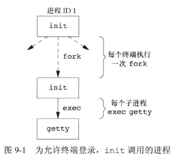
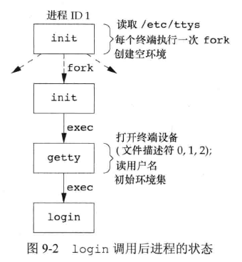
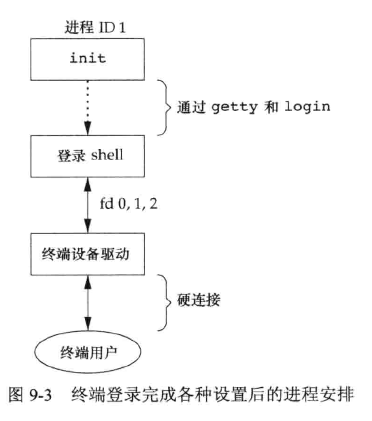
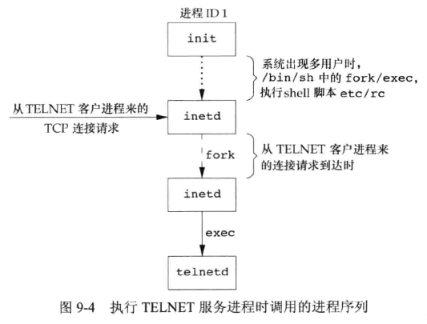
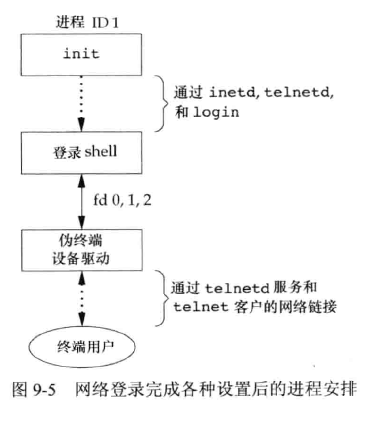
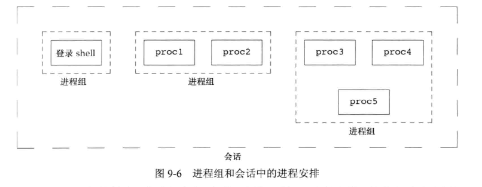
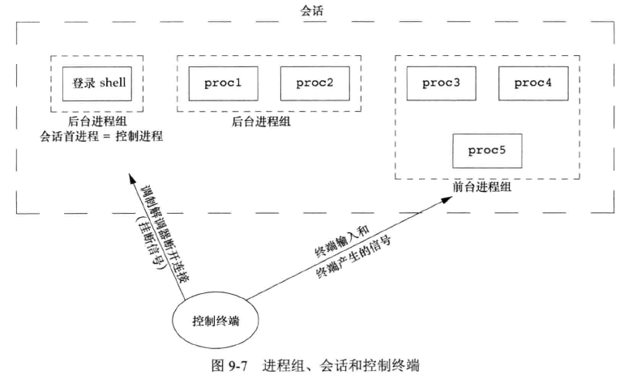
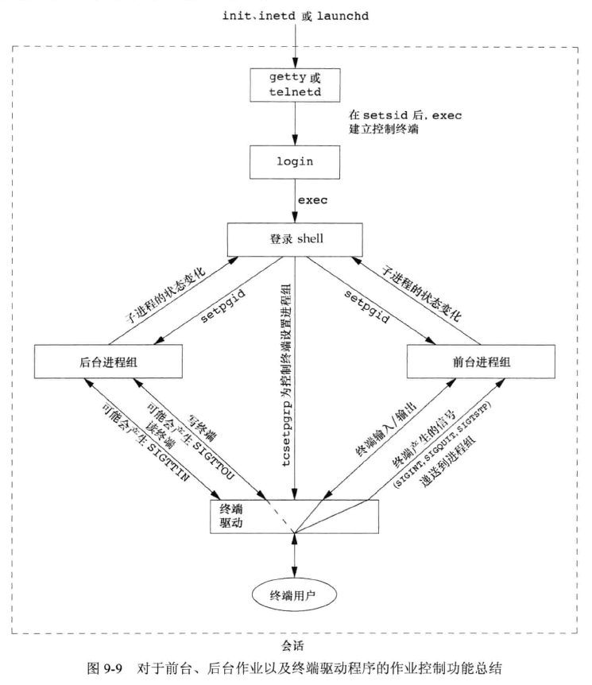
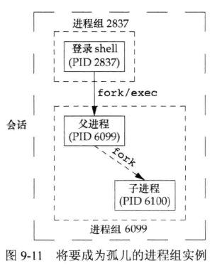
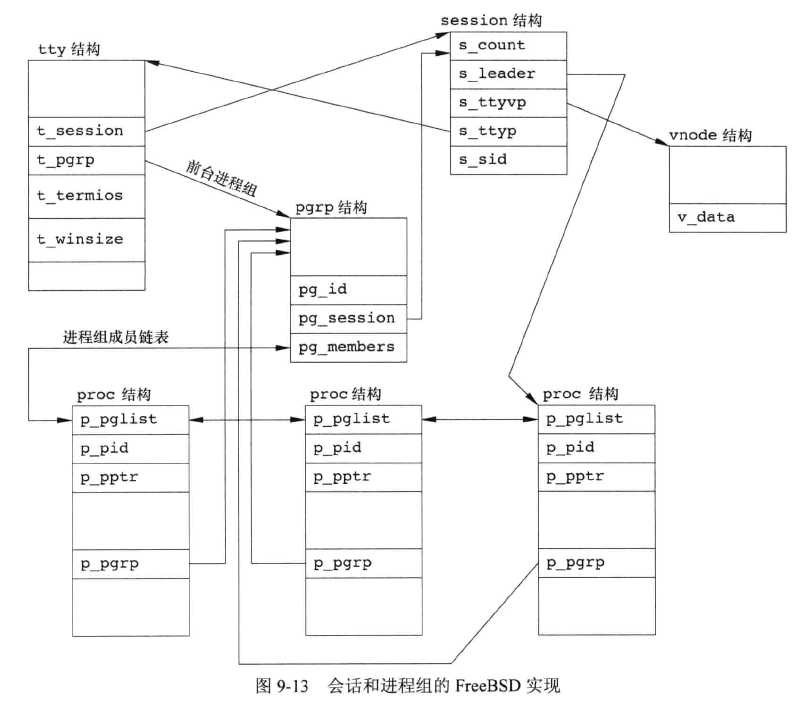

## 引言

主要介绍会话、登录shell、从shell启动的进程关系。


## 终端登录

早期 UNIX 中，用户用哑终端(用硬连接连到主机)进行登录。终端是本地的(直接连接)或远程(通过调制解调器)，登录都经过内核中的**终端设备驱动程序**，例如 PDP-11 上的 DH-11、DZ-11。由于连接到主机上终端数是固定的，同时登录数就有已知上限。  

随着位映射图形终端出现，开发出了窗口系统，向用户提供了与主机系统进行交互的新方式。创建终端窗口的应用仿真基于字符的终端，使得用户可以以终端登录的方式与主机交互。  

经由终端登录至 UNIX 系统，该终端类型可以是基于字符的、仿真基于字符终端的图形终端、运行窗口系统的图形终端。  


### BSD 终端登录

过去多年 BSD 终端登录很少变化，系统管理者创建 /etc/ttys 的文件，每个终端设备在该文件中都有一行，说明设备名到 getty 程序的参数，例如波特率等。系统自举时，内核创建进程 ID 为 1 的 init 进程，init 进程使系统进入多用户模式，读取 /etc/ttys，对每一个允许登录的终端设备，init 调用一次 fork，所生成的子进程执行 exec getty 程序，过程如下图：



所有进程的实际用户 ID 和有效用户 ID都是0，具有超级用户特权。init 以空环境 exec getty 程序。  

getty 对终端设备调用 open 函数，以读、写方式将终端打开。如果设备是调制解调器，open 可能会在驱动程序中滞留，直到用户接通，设置文件描述符 0、1、2 到该设备。等待用户输入用户名、设置速度(波特率)等。  

用户输入用户名后，getty 就完成了工作，它以类似如下方式调用 login 程序：

```c
execle("/bin/login", "login", "-p", username, (char *)0, envp);
```



由于最初的 init 进程具有超级用户特权，因此 fork 的所有进程也具有超级用户特权，init(子进程中)、getty、login 的父进程 ID 均为 1。  

login 程序可以处理多项工作，获取到用户名后，可以调用 getpwnam 取得对应口令项，调用 getpass 显式 `Password: ` ，再调用crypt 加密用户键入的口令，对比口令文件中获取的内容。多次对比失败则调用 exit 表示登录失败，父进程(init)接收到子进程终止后，再次 fork 执行 getty 重复上述过程。  

目前大多数 UNIX 都支持 **PAM(Pluggable Authentication Maodules，可插入的身份验证模块)**。  

如果用户登录成功，login 继续如下工作：

* 更改当前目录为用户起始目录(chdir)。
* 调用 chown 修改终端所有权为登录用户。
* 对该终端的设备访问权限改变成“用户读和写”。
* 调用 setgid、initgroups 设置进程的组 ID。
* 用 login 获取的信息初始化环境：
  * 起始目录(HOME)
  * shell(SHELL)
  * 用户名(USER和LOGNAME)
  * 默认系统路径(PATH)
* login 进程更改为登录用户的用户 ID(setuid) 并调用该用户的登录 shell，类似于
  * `execl("/bin/sh", "-sh", (char *)0);`
* 可选择地继续其它打印日期、检查邮件等任务。

至此，登录用户地登录 shell 开始运行，其父 ID 是 init 进程，此shell终止时会通知到 init 进程(通过 SIGCHLD 信号)，init 进程对该终端重复上述步骤，设置 shell 的文件描述符 0、1、2 为终端设备：



登录 shell 后续会读取其启动文件（.profile、.bash_profile之类），这些启动文件通常配置很多环境变量，随后用户得到 shell 提示符，可以键入命令。  


### Mac OS X 终端登录

Mac OS X 部分地基于 FreeBSD，工作步骤基本与 BSD 相同，有一些差异如下：

* init 的工作由 launchd 完成。
* 一开始提供的是图形终端。


### Linux 终端登录

Linux 的终端登录也类似 BSD。Linux login 命令是从 4.3BSD 的 login 命令派生出来的。主要区别是终端配置的方式：

* 在 System V 的init文件格式之后，部分 Linux 发行版使用管理文件方式。`/etc/inittab` 包含配置信息，指定了 init 要启动的终端设备。
* 部分发行版，有配置 `Upstart` 的 init 程序，使用 /etc/init 目录下 *.conf 的配置文件。


### Solaris 终端登录

Solaris 支持两种形式的终端登录：

* getty，与 BSD 终端登录方式一样，通常用于控制台。
* ttymon，SVR4 引入的新特性，通常用于其它终端登录。是服务访问设施 SAF 的一部分。init 是 sac 的父进程，sac 调用 fork，当系统进入多用户状态时，其子进程执行 ttymon 程序，ttymon 监控在配置文件中列出的所有终端端口，当用户键入用户名，它调用 fork ，然后在子进程中执行 login。


## 网络登录

通过串行终端登录至系统和经过网络登录至系统的主要区别是：网络登录时，终端和计算机之间的连接不再是点到点的，login 仅仅是一种可用的服务，与 FTP、SMTP 等网络服务性质相同。  

所有登录都经由内核的网络接口驱动程序(例如以太网驱动程序)，事先不知道将会有多少这样的登录。必须等待一个网络连接请求的到达。   

系统使用了一种称为**伪终端(pseudo terminal)**的软件驱动程序，它仿真串行终端的运行行为，将终端操作映射为网络操作，返回来也可以映射网络登录为终端。  


### BSD 网络登录

BSD 中有一个 inetd 进程(有时称为因特网超级服务器)，等待大多数网络连接。  

作为系统启动的一部分，init 调用一个shell，执行 shell 脚本 /etc/rc，此 shell 脚本启动也给守护进程 inetd。一旦此 shell 终止，inetd 的父进程就变成 init。inetd 等待 TCP/IP 连接请求到达主机，当一个请求到达时，执行一次 fork，生成的子进程执行适当的程序。  

以 telnet 过程为例：



telnet 客户端通过 TCP 连接请求到达，inetd 进程 fork 一个子进程 exec 执行 telnetd 程序。telnetd 进程打开一个伪终端设备，处理网络连接的通信，并 fork 出一个子进程执行 login 程序，父子进程通过伪终端相连接。在调用 exec 之前，子进程使其文件描述符 0、1、2与伪终端相连，如果登录正确就执行和终端登录相同的步骤：设置工作目录、用户组 ID、初始化环境等：



当通过终端或网络登录时，得到一个登录 shell，其标准输入、标准输出、标准错误要么连接到一个终端设备，要么连接到一个伪终端设备。这一登录 shell 是一个 POSIX.1 会话的开始，此终端或伪终端则是护花的控制终端。  


### Mac OS X 网络登录

基本和 BSD 网络登录相同，不同之处是守护进程从 launchd 运行的。  


### Linux  网络登录

部分版本使用扩展的 xinetd 代替 inetd 进程，其它部分和 BSD 网络登录相同。  


### Solaris  网络登录

和 BSD 网络登录一样，但在 Solaris 中，inted 是在 SMF(Service Management Facility, 服务管理设施) 下作为 restarter 运行。


## 进程组

每个进程除了有进程 ID 之外，还属于一个进程组。  

进程组是一个或多个进程的集合。通常是在同一作业中结合起来的，同进程组中各进程接收来自同一终端的各种信号。每个进程组有一个唯一的进程组 ID，类似于进程 ID是一个正整数，可以存放在 pid_t 数据类型中。函数 getpgrp 返回调用进程的进程组 ID：

```c
#include <unistd.h>

pid_t getpgrp(void);
		// 返回调用进程的进程组 ID
```

早期的 BSD 派生系统中该函数参数是 pid，返回 pid 对应进程的进程组 ID。SUS 定义了 getpgid 函数模仿此行为：

```c
#include <unistd.h>

pid_t getpgid(pid_t pid);
		// 返回进程的进程组 ID，出错返回 -1
```

如果参数为0，`getpgid(0);` 等价于 `getpgrp();` 。  

每个进程组有一个组长进程。组长进程的进程组 ID 等于其进程 ID。  

进程组组长可以创建一个进程组、创建该组中的进程，然后终止。只要组内有一个进程存在，该进程组就存在，与组长是否终止无关。从进程组创建开始直到最后一个进程终止或离开的时间区间称为进程组的生命周期。进程组中最后一个进程可以终止或者转移到其它进程组。  

进程调用 setpgid 可以加入一个现有的进程组或创建一个新进程组：

```c
#include <unistd.h>

int setpgid(pid_t pid, pid_t pgid);
		// 成功返回 0，出错返回 -1
```

setpgid 函数将 pid 进程的进程组 ID设置为 pgid。如果两个参数相等，则 pid 指定进程变成进程组组长。如果 pid 是0，则使用调用者的进程 ID。如果 pgid 是0，则由 pid 指定的进程 ID 用作进程组 ID。  

一个进程只能为它自己或它的子进程设置进程组 ID，在子进程调用 exec 后，就不再更改该子进程的进程组 ID。  

大多数作业控制 shell 中，在 fork 之后调用此函数，父进程设置其子进程的进程组 ID，子进程也设置自己的进程组 ID，这两个操作冗余，但是由于父子进程的执行顺序不确定性，这样操作可以保证设置进程组 ID被先执行。  


## 会话

会话(session)是一个或多个进程组的集合。例如：

在一个登录的的 shell 中分别执行启动程序：

```bash
proc1 | proc2 & 
proc3 | pro4 | proc5
```



进程调用 setsid 函数建立一个新会话：

```c
#include <unistd.h>

pid_t setsid(void);
		// 成功返回进程组 ID，出错返回 -1
```

如果调用此函数的进程不是一个进程组的组长，则此函数创建一个新会话：

1. 该进程变为新会话的**会话首进程(session leader, 会话首进程是创建该会话的进程)**，此时该进程是会话中的唯一进程。
2. 该进程成为一个新进程组的组长进程。新进程组 ID 是该调用进程的进程 ID。
3. 该进程没有控制终端，如果在调用 setsid 之前该进程有一个控制终端，那么和终端的联系将会被切断。

如果该调用进程已经是一个进程组的组长，则此函数返回出错。为避免此问题则通常先 fork，再终止父进程，然后子进程继续执行，这样子进程继承了父进程的进程组 ID，子进程的 ID是新分配的，两者必不相同。  

SUS 只说明了会话首进程，没有类似于进程 ID和进程组 ID的会话 ID。会话首进程是具有唯一进程 ID 的单个进程，所以可以将会话首进程的进程 ID视为会话 ID。调用 getsid 函数可以获取会话首进程的进程组 ID：

```c
#include <unistd.h>

pid_t getsid(pid_t pid);
		// 成功返回会话首进程的进程组 ID，出错返回 -1
```

如果 pid 是0，getsid 返回调用进程的会话首进程的进程组 ID。出于安全考虑，如果 pid 不属于调用者所在会话，调用进程就不能得到该会话首进程的进程组 ID。


## 控制终端

会话和进程组还有一些特性：

* 一个会话可以有一个**控制终端(controlling terminal)**。通常是终端设备或伪终端设备。
* 建立与控制终端丽娜姐的会话首进程被称为**控制进程(controlling process)**。
* 一个会话中的几个进程组可被分成一个**前台进程组(foreground process group)**，以及一个或多个**后台进程组(background process group)**。
* 如果一个会话有控制终端，则它有一个前台进程组，其它进程组为后台进程组。
* 无论何时键入终端的中断键(Delete、Ctrl+C 之类)，都会触发中断信号到前台进程组的所有进程。
* 无论何时键入终端的退出键(Ctrl+\ 之类)，都会触发退出信号到前台进程组的所有进程。
* 如果终端接口检测到调制解调器已经断开连接，则将挂断信号发送至控制进程(会话首进程)。



通常登录时会自动建立控制终端。  

有时不管标准输入、标准输出是否重定向，程序都要与控制终端交互。保证程序能与控制终端对话的方法是 open 文件 /dev/tty。在内核中此特殊文件时控制终端的同义语。如果程序没有控制终端，则对于此设备的 open 将失败。


## 函数 tcgetpgrp、tcsetpgrp、tcgetsid

需要一种方法通知内核识别前台进程组，终端设备驱动程序才知道将终端输入和终端产生的信号发送到哪个进程组。

```c
#include <unistd.h>

pid_t tcgetpgrp(int fd);
		// 成功返回前台进程组 ID，出错返回 -1
int tcsetpgrp(int fd, pid_t pgrpid);
		// 成功 0，出错返回 -1
```

tcgetpgrp 返回前台进程组 ID，它与 fd 上打开的终端相关联。  

如果进程有一个控制终端，则该进程可以调用 tcsetpgrp 将前台进程组 ID 设置为 pgrpid。pgrpid 应当是在同一会话中的一个进程组的 ID。fd 必须引用该会话的控制终端。  

需要管理控制终端的应用程序可以调用 tcgetsid 函数获取控制终端的会话首进程会话 ID。  

```c
#include <termios.h>

pid_t tcgetsid(int fd);
		// 成功返回会话首进程的进程组 ID，出错返回 -1
```


## 作业控制

作业控制是 BSD 在 1980 年左右增加的一个特性。允许在一个终端上启动多个作业(进程组)，控制一个作业访问该终端以及在后台运行一个或多个作业。作业控制要求 3中形式的支持：

* 支持作业控制的 shell。
* 内核中的终端驱动程序必须支持作业控制。
* 内核必须提供对某些作业控制信号的支持。


示例：

```bash
$ make all > Make.out &
[1] 1475
$ pr *.c | lpr &
[2] 1490
$
[2] + Done	pr *.c | lpr &
[1] + Done  make all > Make.out &
```

make 是作业编号 1，所启动的进程 ID 是 1475。下一个管道是作业编号 2，其第一个进程的进程 ID是 1490。  

挂起键(通常是 `Ctrl+Z`)可以影响前台作业，终端驱动程序将信号 SIGTSTP 发送至前台进程组中的所有进程，后台进程组作业则不受影响。与之类似的还有：

* 中断字符(Delete或 Ctrl+C)产生 SIGINT。
* 退出字符(Ctrl+\)产生 SIGQUIT。

这些字符也可以被更改为其它字符，或者设置终端驱动程序不处理这些特殊字符。  

只有前台作业接收终端输入，如果后台作业试图读终端，终端驱动程序将检测到，并向后台作业发送一个 SIGTTIN 信号，通常该信号会停止后台作业，shell 向用户发出通知，用户可以通过 shell 命令将此作业转换为前台作业，此后台作业就可以读取终端，示例：  

```bash
$ cat > /tmp/temp.foo &
[1] 9048
$ 

[1]+  Stopped                 cat > /tmp/temp.foo
$ fg %1
cat > /tmp/temp.foo
hello, world
^D
$ 
$ cat /tmp/temp.foo 
hello, world
$ 

```

shell 在后台启动 cat 进程，cat 试图读取标准输入，终端驱动程序检测到它是一个后台作业，向其发送 SIGTTIN 信号，shell 检测到子进程状态变化打印该作业被停止的信息。fg 命令将作业送入前台运行，shell 将作业转为前台进程组(tcsetpgrp)，并将继续信号(SIGCONT)送给该进程组，于是该作业可以读取控制终端。  

stty 命令可以控制是否允许后台作业输出到控制终端。示例：

```bash
## 后台作业可以输出到控制终端
$ cat /tmp/temp.foo &
[1] 9073
$ hello, world

[1]+  Done                    cat /tmp/temp.foo
## 通过 stty 禁止后台作业输出到控制终端
$ stty tostop
## 再次执行则不会输出到控制终端
$ cat /tmp/temp.foo &
[1] 9081
$ 

[1]+  Stopped                 cat /tmp/temp.foo
## 重新将被阻塞的后台作业恢复到前台，该作业继续输出
$ fg %1
cat /tmp/temp.foo
hello, world
$ 

```




作业控制是一个有争议的问题，但 POSIX.1 要求实现作业控制。


## shell 执行程序

示例：

```bash
## 在bash中执行ps，bash 将前台进程 ps 放入它自己的进程组(10421)，前台进程组 TPGID 也是ps进程组
$ ps -o pid,ppid,pgid,sid,tpgid,comm
    PID    PPID    PGID     SID   TPGID COMMAND
   8475    8474    8475    8475   10421 bash
  10421    8475   10421    8475   10421 ps
## ps 在后台启动执行，前台进程组是 bash 的进程组(8475)
$ ps -o pid,ppid,pgid,sid,tpgid,comm &
[1] 10423
$ 
[1]+  Stopped                 ps -o pid,ppid,pgid,sid,tpgid,comm
$ 
$ fg
ps -o pid,ppid,pgid,sid,tpgid,comm
    PID    PPID    PGID     SID   TPGID COMMAND
   8475    8474    8475    8475    8475 bash
  10423    8475   10423    8475    8475 ps
$ 
## 加入管道执行 cat，ps和cat进程都是 bash 的子进程
$ ps -o pid,ppid,pgid,sid,tpgid,comm | cat    PID    PPID    PGID     SID   TPGID COMMAND
   8475    8474    8475    8475   10428 bash
  10428    8475   10428    8475   10428 ps
  10429    8475   10428    8475   10428 cat
## 在后台启动，也是类似，ps和cat属于同一进程组
$ ps -o pid,ppid,pgid,sid,tpgid,comm | cat &
[1] 10432
$ 
[1]+  Stopped                 ps -o pid,ppid,pgid,sid,tpgid,comm | cat
$ 
$ fg
ps -o pid,ppid,pgid,sid,tpgid,comm | cat
    PID    PPID    PGID     SID   TPGID COMMAND
   8475    8474    8475    8475    8475 bash
  10431    8475   10431    8475    8475 ps
  10432    8475   10431    8475    8475 cat

```


## 孤儿进程组

父进程已终止的进程是**孤儿进程(orphan process)**，由 init 进程收养，整个进程组也可以成为孤儿进程组。  

POSIX.1 对**孤儿进程组(orphan process group)**的定义是：该组中每个成员的父进程要么是该组的一个成员，要么不是改组所属会话的成员。另一种描述：一个进程组不是孤儿进程组的条件是该组中有一个进程，其父进程在属于同一会话的另一个组中。  

POSIX.1 要求向新孤儿进程组中处于停止状态的每一个进程发送挂断信号(SIGHUP)，接着又向其发送继续信号(SIGCONT)。  

示例：



步骤：

* 父进程睡眠5秒
* 子进程设置信号处理程序来处理挂断信号(SIGHUP)
* 子进程使用 kill 函数向自身发送停止信号(SIGTSTP)，触发停止子进程，类似终端挂起(Ctrl+Z)操作
* 父进程终止时，该子进程变为孤儿进程 ，父进程ID 变为1 ，即 init 进程
* 此时进程组只有一个该子进程，变为孤儿进程组，根据 POSIX.1 的要求系统向新孤儿进程组中停止状态的进程发送信号 SIGHUP，之后又发送信号 SIGCONT
* 处理了挂断信号(SIGHUP)后，子进程继续。由于默认处理 SIGHUP 信号的动作是终止该进程，因此要提供一个处理该信号的函数 sig_hup。


代码：

```c
#include "apue.h"
#include <errno.h>

static void
sig_hup(int signo)
{
	printf("SIGHUP received, pid = %ld\n", (long)getpid());
}

static void
pr_ids(char *name)
{
	printf("%s: pid = %ld, ppid = %ld, pgrp = %ld, tpgrp = %ld\n",
	    name, (long)getpid(), (long)getppid(), (long)getpgrp(),
	    (long)tcgetpgrp(STDIN_FILENO));
	fflush(stdout);
}

int
main(void)
{
	char	c;
	pid_t	pid;

	pr_ids("parent");
	if ((pid = fork()) < 0) {
		err_sys("fork error");
	} else if (pid > 0) {	/* parent */
		sleep(5);		/* sleep to let child stop itself */
	} else {			/* child */
		pr_ids("child");
		signal(SIGHUP, sig_hup);	/* establish signal handler */
		kill(getpid(), SIGTSTP);	/* stop ourself */
		pr_ids("child");	/* prints only if we're continued */
		if (read(STDIN_FILENO, &c, 1) != 1)
			printf("read error %d on controlling TTY\n", errno);
	}
	exit(0);
}

```

执行：

```bash
$ ./9.12 
parent: pid = 11458, ppid = 6809, pgrp = 11458, tpgrp = 11458
child: pid = 11459, ppid = 11458, pgrp = 11458, tpgrp = 11458

SIGHUP received, pid = 11459
child: pid = 11459, ppid = 1, pgrp = 11458, tpgrp = 6809
read error 5 on controlling TTY
```


## FreeBSD 实现

FreeBSD 使用的与进程、进程组、会话、控制终端相关的数据结构：




### session 结构

每个会话都分配一个 session 结构体，包含：

* s_count：该会话中的进程组数，当此计数器减至 0 时，则可释放此结构体。
* s_leader：指向会话首进程 proc 结构的指针。
* s_ttyvp：指向控制终端 vnode 结构的指针。
* s_ttyp：指向控制终端 tty 结构的指针。
* s_sid：会话 ID，并非 SUS 的部分。

在调用 set_sid 时，内核中分配一个新的 session 结构，s_count 设置为 1，s_leader 设置为调用进程 proc 结构的指针，s_sid 设置为进程 ID，由于新会话没有控制终端，s_ttyvp、s_ttyp 设置为空指针。  


### tty 结构

每个终端设备和每个伪终端设备均在内核中分配 tty 结构体，包含：

* t_session：指向此终端作为控制终端的 session 结构(tty和session互相用指针指向彼此)。终端在时区载波信号时使用此指针将挂起信号发送给会话首进程。 
* t_pgrp：指向前台进程组的 pgrp 结构。终端驱动程序用此字段将信号发送给前台进程组。由输入特殊字符(终端、退出、挂起)产生的 3 个信号被发送到前台进程组。
* t_termios：包含所有特殊字符和与该终端有关的信息(如波特率、回显打开或关闭等)的结构体。
* t_winsize：包含终端窗口当前大小的 winsize 型结构体。终端窗口大小改变时，信号 SIGWINCH 被发送到前台进程组。


### prgp 结构

为了找到特定会话的前台进程组，内核从 session 结构开始，用 s_ttyp 得到控制终端的 tty 结构，再用 t_prgp 得到前台进程组的 prgp 结构体，prgp 字段有：

* pg_id：进程组 ID。
* pg_session：指向此进程组所属会话的 session 结构。
* pg_members：指向此进程组 proc 结构代表的指针，该 proc 结构代表进程组的成员。proc 结构体中 p_pglist 结构是双向链表，指向上一个和下一个进程，直到遇到进程组最后一个进程，才指向空指针。


### proc 结构

包含一个进程的所有信息：

* p_pid：进程 ID。
* p_pptr：指向父进程 proc 结构的指针。
* p_pgrp：指向本进程所属进程组的 pgrp 结构的指针。
* p_pglist：一个结构体，包含两个指针，分别指向进程组中上一个和下一个进程。


### vnode 结构

打开控制终端设备时分配此结构，进程对 /dev/tty 的所有访问都经过 vnode 结构。