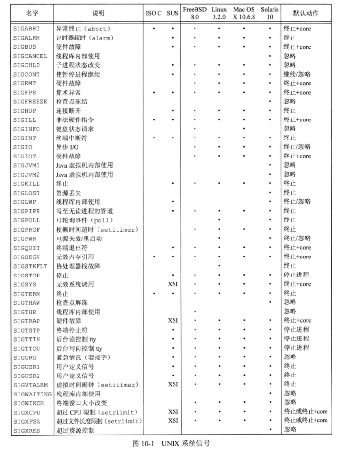
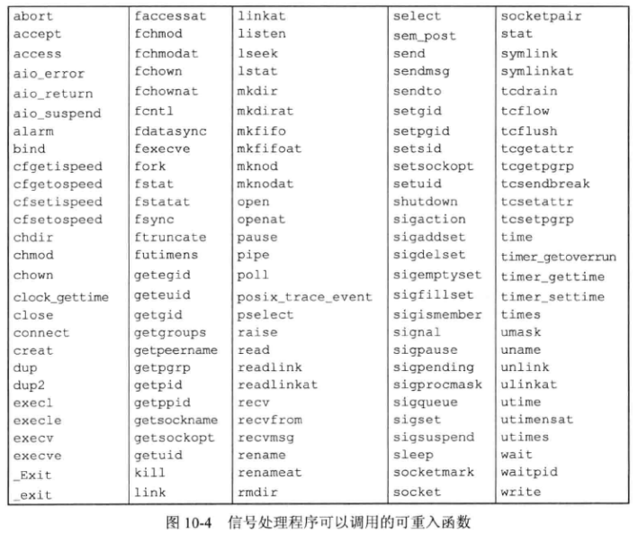
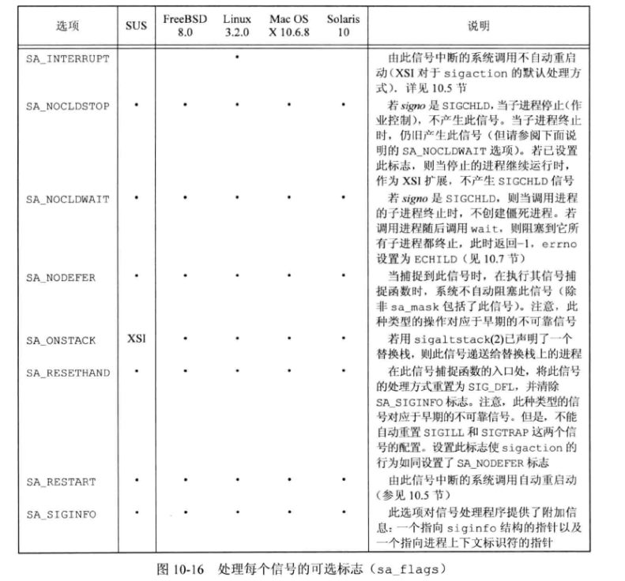
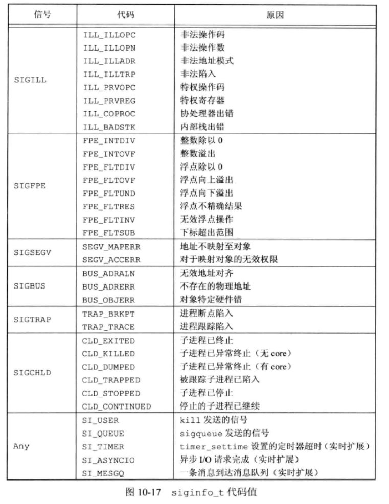
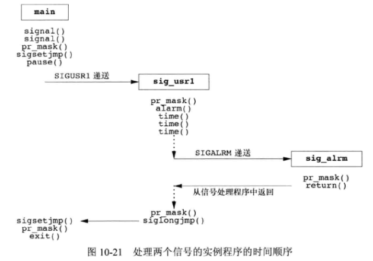
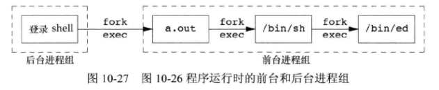
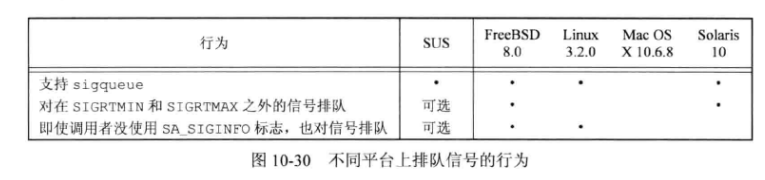

## 引言

信号是软件中断。提供了一种处理异步事件的方法。  

UNIX 早期(例如 V7)已经提供了信号机制，但是这些信号模型不可靠，信号可能丢失，执行临界区代码时，进程很难关闭所选择的信号。4.3 BSD 和 SVR3 对信号模型都做了更改以增强可靠性，但并不兼容。POSIX.1 对信号例程进行了标准化。  


## 概念

每个信号都有一个以 SIG 开头的名字。例如 SIGARBT 是夭折信号，一般是进程调用 abort 函数产生，SIGALRM 是闹钟信号，由 alarm 函数设置的定时器超时后触发。  

在头文件 `<signal.h>` 中，信号名都被定义为正整数常量(信号编号)。不存在编号为 0 的信号，POSIX.1 将此信号编号值称为空信号。  

有很多条件可以产生信号，例如：

* 用户按下键盘某些按键触发。
* 硬件异常产生。
* 进程调用 kill 函数发送信号。
* 用户使用 kill 命令发送信号。
* 检测到某种软条件已经发生，通知有关进程。

信号是异步事件的经典实例。产生信号事件对于进程而言是随机出现的，进程不能简单测试变量来判断是否发生信号，而是必须告诉内核“当此信号发生时，请执行下列操作”。  

当信号出现时，可以告诉内核按照以下 3 种方式之一处理：

1. 忽略信号。SIGKILL、SIGSTOP 这两种信号不能忽略，这两个信号向内核和管理员提供了一种可靠的终止进程的方法。
2. 捕捉信号。要通知内核在某种信号发生时，调用一个用户函数，此函数可以执行用户希望如何处理该事件。
3. 执行系统默认动作。

下图是各种信号说明及默认动作：




## 函数 signal

UNIX 系统信号机制最简单的接口是 signal 函数：

```c
#include <signal.h>

void (*signal(int signo, void (*func)(int)))(int);
		// 成功返回以前的信号处理配置，出错返回 SIG_ERR
```

signo 是信号名，func 的值是常量 SIG_IGN(忽略)、SIG_DFL(默认行为) 或者接到此信号要调用的函数的地址。当指定函数地址时，在信号发生时调用该函数，这种处理为捕捉该信号，称此函数为**信号处理程序(signal handler)**或**信号捕捉函数(signal-catching function)**。  

上面的 signal 原型比较复杂，可以转换为方便理解：

```c
typedef void SigFunc(int);

Sigfunc *signal(int, Sigfunc *);
```

大多数 UNIX 系统的 `<signal.h>` 头文件会包含宏定义：

```c
#define SIG_ERR (void (*)())-1
#define SIG_DFL (void (*)())0
#define SIG_IGN (void (*)())1
```

这些常量表示“指向函数的指针，该函数要求一个整型参数，并且无返回值”。


示例，捕获 SIGUSR1 、SIGUSR2 信号后执行函数打印：

```c
#include "apue.h"

static void sig_usr(int);

int main(){
    if(signal(SIGUSR1, sig_usr) == SIG_ERR)
        printf("can't catch SIGUSR1\n");

    if(signal(SIGUSR2, sig_usr) == SIG_ERR)
        printf("can't catch SIGUSR2\n");

    for(;;)
        pause();

}

static void sig_usr(int signo){
    if(signo == SIGUSR1)
        printf("received SIGUSR1\n");
    else if(signo == SIGUSR2)
        printf("received SIGUSR2\n");
    else
        err_dump("received signal %d\n", signo);
}

```

执行：

```bash
$ ./10.2 &
[1] 12938
$ kill -SIGUSR1 12938
received SIGUSR1
$ kill -SIGUSR2 12938
received SIGUSR2
$ kill  12938
[1]+  Terminated              ./10.2
```


1. 程序启动
   * 当执行一个程序时，所有信号状态都是系统默认或忽略。例如一个进程调用 exec 函数后，其设置的信号捕捉都将失效，exec 函数修改定义的信号动作为信号的默认动作。
   * shell 自动将后台进程对中断和退出信号的处理方式设置为忽略。这样退出、中断字符就不会影响后台进程。
2. 进程创建
   * 当一个进程调用 fork 时，其子进程继承父进程的信号处理方式。因为子进程复制父进程内存映像，因此信号捕捉函数在子进程中是有意义的。


## 不可靠的信号

早期 UNIX 版本（如V7）中，信号是不可靠的，可能会丢失：信号发生了但进程不知道。有时进程希望内核阻塞某个信号而不是忽略它，等待进程准备好再次通知进程该信号，但都不支持。  


## 中断的系统调用

早期 UNIX 系统的一个特性：如果进程在执行一个低速系统调用而阻塞期间捕捉到一个信号，则该系统调用就被中断不再继续执行。如果系统调用返回出错，其 errno 被设置为 EINTR。  

为了支持这种特性将系统调用分为两类：低速系统调用和其它系统调用。  

低速系统调用是可能会使进程永远阻塞的一类系统调用，包括：

* 如果某些类型文件(管道、中断设备、网络设备)的数据不存在，读操作可能会使调用者永远阻塞。
* 如果这些数据不能被相同类型文件立即接受，则写操作可能会使调用者永远阻塞。
* 在某种条件发生之前打开某些类型文件，可能会发生阻塞。
* pause 函数和 wait 函数。
* 某些 ioctl 操作。
* 某些进程间通信函数。

被中断的系统调用相关问题是必须显式地处理出错返回。典型代码序列如下：

```c
again:
	if((n = read(fd, buf, BUFFSIZE)) < 0){
        if(errno = EINTR)
            goto again;
        /* handle other errors */
    }
```

4.2 BSD 引入了一些被中断系统调用的自动重启动，来帮助应用程序，包括：ioctl、read、readv、write、writev、wait、waitpid。由于这种自动重启动也会带来问题，某些应用不希望这些函数被中断后重启动，4.3BSD允许进程基于信号禁用此功能。POSIX.1 要求只有中断信号的 SA_RESTART 标志有效时，实现才重启动系统调用。例如后续的 sigaction 函数就使用这个标志。


## 可重入函数

进程捕捉到信号并对其进行处理时，进程正在执行的正常的指令序列就被信号处理程序临时中断，它首先执行信号处理程序中的指令。如果从信号处理程序返回，则继续执行被中断的正常指令序列，但会带来一些问题，例如进程正在调用 malloc

分配堆空间，或者调用 getpwnam 函数，进程的数据就可能被破坏或者覆盖。  

SUS 说明了在信号处理程序中保证调用安全的函数。这些函数是可重入的，并被称为是**异步信号安全的(async-signal safe)**。除了可重入，在信号处理操作期间，它会阻塞任何会引起不一致的信号发送。  



示例：

```c
#include "apue.h"
#include <pwd.h>

static void my_alarm(int signo){
    struct passwd *rootptr;

    printf("in signal handler\n");
    if((rootptr = getpwnam("root")) == NULL)
        err_sys("getpwnam(root) error");
    
    alarm(1);
}

int main(){

    struct passwd *ptr;

    signal(SIGALRM, my_alarm);
    alarm(1);

    for(;;){
        if((ptr = getpwnam("xmy")) == NULL)
            err_sys("getpwname error");
        if(strcmp(ptr->pw_name, "xmy") != 0)
            printf("return value corrupted!, pw_name = %s\n", ptr->pw_name);
    }
}
```


## SIGCLD 语义

System V 定义的信号名。不同系统实现中语义不同，Linux、Solaris 中等同于 SIGCHLD。


## 可靠信号术语和语义

​	当造成信号的时间发生时，为进程**产生**一个信号（或向进程发送一个信号）。事件可以是硬件异常、软件条件、终端产生的信号、调用 kill 函数。当一个信号产生时，内核通常在进程表中以某种形式设置一个标志。  

​	当堆信号采取了这种动作时，我们说向进程**递送**了一个信号。在喜好**产生(generation)**和**递送(delivery)**之间的时间间隔内，称信号是**未决的(pending)**。  

​	进程可以选用“阻塞信号递送”。如果为进程产生了一个阻塞的信号，而且对该信号的动作是系统默认动作或捕捉该信号，则为该进程将此信号保持为未决状态，直到该进程对此信号解除了阻塞，或者将对此信号的动作更改为忽略。内核在递送一个原来被阻塞的信号给进程时（而不是在产生该信号时），才决定对它的处理方式。于是进程在信号递送给它之前仍可改变对该信号的动作。进程调用 sigpending 函数来判定哪些信号是设置为阻塞并处于未决状态的。  

​	如果在进程解除对某个信号的阻塞之前，这种信号发生了多次，POSIX.1 允许系统递送该信号一次或多次。如果递送该信号多次，则称这些信号进行了排队。但是除非支持 POSIX.1实时扩展，否则大多数UNIX并不对信号排队，而是只递送这种信号一次。  

​	如果有多个信号要递送给一个进程，POSIX.1 并没有规定这些信号的递送顺序。但是POSIX.1 基础部分建议：在其他信号之前递送与进程当前状态有关的信号，如 SIGSEGV。  

​	每个进程都有一个**信号屏蔽字(signal mask)**，它规定了当前要阻塞递送到该进程的信号集。对于每种可能的信号，该屏蔽字中都有一位与之对应。对于某种信号，若其对应位已设置，则它当前是被阻塞的。进程可以调用 sigprocmask 来检测和更改其当前信号屏蔽字。  

​	信号编号可能会超过一个整型所包含的二进制位数，因此POSIX.1定义了一个新数据类型 sigset_t，它可以容纳一个**信号集**。例如，信号屏蔽字就存放在其中一个信号集中。


## 函数 kill 和 raise

kill 函数将信号发送给进程或进程组。raise 函数允许进程向自身发送信号。  

```c
#include <signal.h>

int kill(pid_t pid, int signo);
int raise(int signo);
		// 成功返回 0， 出错返回 -1
```

调用 `raise(signo);` 等价于调用 `kill(getpid(), signo);`  

kill 的 pid 参数有 4 种不同情况：

* 如果参数 pid 大于零，那么 kill 函数发送信号给进程 pid
* 如果 pid 等于零，那么 kill 发送信号给调用进程所在进程组中的每个进程，包括调用进程自己，但不包括内核进程和 init 进程(pid为1)
* 如果 pid 小于零，kill 发送信号给进程组 |pid|(pid 的绝对值)中的每个进程，但不包括内核进程和 init 进程(pid为1)
* 如果 pid 等于 -1，kill 发送信号给所有有权限向他们发送信号的进程。


​	进程将信号发送给其他进程需要权限。超级用户可将信号发送给任一进程。对于非超级用户，其基本规则是发送者的实际用户 ID 或有效用户 ID 必须等于接收者的实际用户 ID 或有效用户 ID。如果实现支持 `POSIXSAVEDIDS`（如 POSIX.1现在要求的那样），则检查接收者的保存设置用户 ID（而不是有效用户ID）。在对权限进行测试时也有一个特例：如果被发送的信号是 SIGCONT ，则进程可将它发送给属于同一会话的任一其他进程。  

​	POSIX.1 将信号编号 0 定义为空信号。如果 signo 参数是 0，则 ki11 仍执行正常的错误检查，但不发送信号。这常被用来确定一个特定进程是否仍然存在。如果向一个并不存在的进程发送空信号，则 ki11 返回-1，errno 被设置为 ESRCH。  

​	测试进程是否存在的操作不是原子操作。在ki11向调用者返回测试结果时，原来已存在的被测试进程此时可能已经终止，所以这种测试并无多大价值。  

​	如果调用 ki11 为调用进程产生信号，而且此信号是不被阻塞的，那么在kil1返回之前，signo 或者某个其他未决的、非阻塞信号被传送至该进程。


## 函数 alarm 和 pause

alarm 函数可以设置一个定时器(闹钟时间)，在将来某个时刻该定时器会超时。当定时器超时时，产生 SIGALRM 信号。如果忽略或不捕捉此信号，则其默认动作是终止调用该 alarm 函数的进程。  

```c
#include <unistd.h>

unsigned int alarm(unsigned int seconds);
		// 返回 0 或者以前设置的闹钟时间的余留秒数
```

参数 seconds 的值是产生信号 SIGALRM 需要经过的时钟秒数。当到达这一时刻，内核产生信号，由于进程调度的延迟，所以进程得到控制从而能够处理该信号还有一个时间间隔。  

每个进程只有一个闹钟时间，如果调用 alarm 时，之前的闹钟没有超时，则之前闹钟的余留值作为本次调用的返回值返回，新的闹钟时间值会替换旧的值。  

如果以前有注册的尚未超过的闹钟时间，本次调用的 seconds 为 0，则取消以前的闹钟，旧闹钟余留值作为函数返回值。  

SIGALRM 的默认动作是终止进程，但大多数使用闹钟的进程捕捉此信号。如果进程要终止，则在终止之前执行清理。如果想捕捉 SIGALRM 信号，必须在调用 alarm 之前安装该信号。  


pause 函数使调用进程挂起直到捕捉到一个信号：

```c
#include <unistd.h>

int pause(void);
		// 返回 -1，errno 设置为 EINTR
```


### 示例一：sleep1

使用 alarm 和 pause ，使得进程可以自己休眠指定的时间。

```c
#include <signal.h>
#include <unistd.h>

static void sig_alrm(int signo){
    /* nothing to do */
}

unsigned int sleep1(unsigned int seconds){
    if(signal(SIGALRM, sig_alrm) == SIG_ERR)
        return(seconds);
    
    alarm(seconds);
    pause();
    return(alarm(0));
}
```

上面的函数 sleep1 与 sleep 类似，但是存在问题：

1. 如果在调用sleepl之前，调用者已设置了闹钟，则它被sleep1 函数中的第一次 alarm 调用擦除。可用下列方法更正这一点：检查第一次调用 alarm 的返回值，如其值小于本次调用 alarm 的参数值，则只应等到已有的闹钟超时。如果之前设置的闹钟超时时间晚于本次设置值，则在 sleep1 函数返回之前，重置此闹钟，使其在之前闹钟的设定时间再次发生超时。
2. 该程序中修改了对 SIGALRM 的配置。如果编写了一个函数供其他函数调用，则在该函数被调用时先要保存原配置，在该函数返回前再恢复原配置。更正这一点的方法是：保存 signal 函数的返回值，在返回前重置原配置。
3. 在第一次调用 alarm 和 pause 之间有一个竞争条件。在一个繁忙的系统中，可能 alarm 在调用 pause 之前超时，并调用了信号处理程序。如果发生了这种情况，则在调用 pause 后，如果没有捕捉到其他信号，调用者将永远被挂起。

sleep 早期实现也存在上述问题，但更正了前2个问题，第三个问题可以使用 setjmp 或者 sigprocmask 和 sigsuspend。


### 示例二：sleep2

模仿 SVR2 种的 sleep，使用 setjmp、longjmp，避免上面存在的第3个问题中的竞争条件。

```c
#include <setjmp.h>
#include <signal.h>
#include <unistd.h>

static jmp_buf env_alrm;

static void sig_alrm(int signo){
    longjmp(env_alrm, 1);
}

unsigned int sleep2(unsigned int seconds){
    if(signal(SIGALRM, sig_alrm) == SIG_ERR)
        return(seconds);
    
    if(setjmp(env_alrm) == 0){
    	alarm(seconds);
    	pause();        
    }

    return(alarm(0));
}
```

但是此 sleep2 函数也存在问题，与其它信号交互相关。如果 SIGALRM 信号中断了某个其它信号处理程序，则调用 longjmp 会提前终止该信号处理程序。  

展示上述问题示例：

```c
#include "apue.h"

unsigned int sleep2(unsigned int);
static void sig_int(int);

int main(void){
    unsigned int unslept;
    
    if(signal(SIGINT, sig_int) == SIG_ERR)
        err_sys("signal(SIGINT) error");
    
    unslept = sleep2(5);
    printf("sleep2 returned: %u\n", unslept);
    exit(0);
}

static void sig_int(int signo){
    int i,j;
    volatile int k;
    
    printf("\nsig_int starting\n");
    for(i=0; i<300000; i++)
        for(j=0; j<4000; j++)
            k += i*j;
    
    printf("sig_int finished\n");
}
```

执行：

```bash
## 程序执行后触发中断键(一般是Ctrl+C)，时间足够执行完成
$ ./10.9 
^C
sig_int starting
sig_int finished
sleep2 returned: 2
## 触发中断处理程序 sig_int 在执行期间，定时器时间到触发 sleep2 ，sig_int 被提前终止(剩余时间不够执行完成 sig_int 时触发中断会复现)
$ ./10.9 
^C
sig_int starting
sleep2 returned: 0
$
```


还有一些为了避免低速设备可能阻塞，设置 alarm 使得超时后终止执行操作，例如调用 read 函数读取某设备。但也存在上面的问题，采用 longjmp 可以解决竞争条件，但仍存在与其它信号交互的问题。I/O 相关操作时间限制可以考虑后面章节的 select、poll 函数。


## 信号集

需要一个能表示多个信号：**信号集(signal set)** 的数据类型，以便告诉内核不允许发生该信号集中的信号。不同信号的编号合集可能超过整型所包含的位数，POSIX.1 定义了数据类型 `sigset_t` 以包含一个信号集，以及5个相关处理信号集的函数：

```c
#include <signal.h>

int sigemptyset(sigset_t *set);
int sigfillset(sigset_t *set);
int sigaddset(sigset_t *set, int signo);
int sigdelset(sigset_t *set, int signo);
		// 成功返回0，出错返回-1
int sigismember(const sigset_t *set, int signo);
		// 真值返回1，假值返回0

```

函数 sigemptyset 初始化由 set 指向的信号集，清除其中所有信号。函数 sigfillset 初始化由 set 指向的信号集，使其包括所有信号。所有使用信号集的应用都要对该信号集调用 sigemptyset、sigfillset 一次，因为C语言将为负值的外部变量和静态变量初始化为 0，不一定对应信号集的实现。  

sigaddset 增加一个信号道已有信号集、sigdelset 从信号集删除一个信号、sigismember 用于确认信号集中指定信号位的值。  

三个操作函数的实现示例：

```c
#include	<signal.h>
#include	<errno.h>

/*
 * <signal.h> usually defines NSIG to include signal number 0.
 */
#define	SIGBAD(signo)	((signo) <= 0 || (signo) >= NSIG)

int
sigaddset(sigset_t *set, int signo)
{
	if (SIGBAD(signo)) {
		errno = EINVAL;
		return(-1);
	}
	*set |= 1 << (signo - 1);		/* turn bit on */
	return(0);
}

int
sigdelset(sigset_t *set, int signo)
{
	if (SIGBAD(signo)) {
		errno = EINVAL;
		return(-1);
	}
	*set &= ~(1 << (signo - 1));	/* turn bit off */
	return(0);
}

int
sigismember(const sigset_t *set, int signo)
{
	if (SIGBAD(signo)) {
		errno = EINVAL;
		return(-1);
	}
	return((*set & (1 << (signo - 1))) != 0);
}

```


## 函数 sigprocmask

函数 sigprocmask 可以检测或更改进程的信号屏蔽字，或者同时进行检测和更改。  

```c
#include	<signal.h>

int sigprocmask(int how, const sigset_t *restrict set, sigset_t *restrict oset);
		// 成功返回0，出错返回-1
```

* 若 oset 是非空指针，进程当前信号屏蔽字通过 oset 返回。
* 若 set 是一个非空指针，参数 how 的值指示如何修改当前信号屏蔽字：
  * SIG_BLOCK ：该进程新的信号屏蔽字是其当前信号屏蔽字是和 set 指向信号集的并集。set 包含了希望阻塞的附加信号。
  * SIG_UNBLOCK：该进程新的信号屏蔽字是其当前信号屏蔽字是和 set 指向信号集补集的交集。set 包含了希望解除阻塞的附加信号。
  * SIG_BLOCK 是或操作
  * SIG_SETMASK 是赋值操作，该进程新的信号屏蔽是 set 指向的值
* 若 set 是个空指针，则不改变进程的信号屏蔽字，how 也无意义。


在调用 sigprocmask 后如果有任何未决的、不再阻塞的信号，则在 sigprocmask 返回前，至少将其中之一传递给该进程。  

示例，为进程打印信号屏蔽字：

```c
#include "apue.h"
#include <errno.h>

void pr_mask(const char *str)
{
    sigset_t sigset;
    int errno_save;

    errno_save = errno;
    if (sigprocmask(0, NULL, &sigset) < 0)
        err_ret("sigprocmask error");
    else
    {
        printf("%s", str);
        if(sigismember(&sigset, SIGINT))
            printf(" SIGINT");
        if(sigismember(&sigset, SIGQUIT))
            printf(" SIGQUIT");
        if(sigismember(&sigset, SIGUSR1))
            printf(" SIGUSR1");
        if(sigismember(&sigset, SIGALRM))
            printf(" SIGALRM");

        printf("\n");
    }

    errno = errno_save;
}
```


## 函数 sigpending

sigpending 函数返回一信号集，对于调用进程而言，其中的各信号是阻塞不能递送的，因而也一定是当前未决的。该信号集通过 set 参数返回。

```c
#include <signal.h>

int sigpending(sigset_t *set);
		// 成功返回0，出错返回-1
```

示例：

```c
#include "apue.h"

static void sig_quit(int);

int main(void)
{
    sigset_t newmask, oldmask, pendmask;

    // 注册信号处理函数 sig_quit，该函数打印然后恢复SIGQUIT 信号的默认动作
    if (signal(SIGQUIT, sig_quit) == SIG_ERR)
        err_sys("can't catch SIGQUIT");

    /*
     * 阻塞 SIGQUIT 信号，保存当前 signal mask
     */
    sigemptyset(&newmask);        // 初始化newmask
    sigaddset(&newmask, SIGQUIT); // 增加 SIGQUIT 信号
    if (sigprocmask(SIG_BLOCK, &newmask, &oldmask) < 0) /* 保存现有阻塞信号集到 oldmask，并将 newmask 集中信号加入现有阻塞信号集*/
        err_sys("SIG_BLOCK error");

    sleep(5);

    // 判断是否阻塞了 SIGQUIT 信号
    if(sigpending(&pendmask) < 0)
        err_sys("sigpending error");
    if(sigismember(&pendmask, SIGQUIT))
        printf("\nSIGQUIT pending\n");

    // 还原阻塞信号集
    if(sigprocmask(SIG_SETMASK, &oldmask, NULL) < 0)
        err_sys("SIG_SETMASK error");
    printf("SIGQUIT unblocked\n");

    sleep(5);
    exit(0);

}

static void sig_quit(int signo)
{
    printf("caught SIGQUIT\n");
    if(signal(SIGQUIT, SIG_DFL) == SIG_ERR)
        err_sys("can't reset SIGQUIT");
}
```

执行：

```bash
## 编译为 10.15
$ ../gcc_a ./10.15.c 
$ ./10.15 
SIGQUIT unblocked
## 运行过程Ctrl+\ 触发SIGQUIT信号
$ ./10.15 
^\

SIGQUIT pending
caught SIGQUIT
SIGQUIT unblocked
$ 
## 触发SIGQUIT后，该信号被恢复默认操作，再次触发信号会结束进程
$ ./10.15 
^\

SIGQUIT pending
caught SIGQUIT
SIGQUIT unblocked
^\Quit (core dumped)
## 多次触发信号只会处理一次，处理之后恢复默认动作
$ ./10.15 
^\^\^\^\^\^\^\^\^\^\

SIGQUIT pending
caught SIGQUIT
SIGQUIT unblocked
^\Quit (core dumped)
$ 
```


## 函数 sigaction

sigaction 函数的功能是检查或修改(或检查并修改)与指定信号相关联的处理动作。此函数取代了 UNIX 早期版本使用的 signal 函数。


```c
#include <signal.h>

int sigaction(int signo, const struct sigaction *restrict act, struct sigaction *restrict oact);
		// 成功返回0，出错返回-1
```

* 参数 signo 是要检测或修改其具体动作的信号编号。
* 参数 act 指针非空，则修改其动作。
* 参数 oact 指针非空，则系统经由 oact 指针返回该信号的上一个动作。

### sigaction 结构体

sigaction 结构体：

```c
struct sigaction{
    void (*sa_handler)(int);	/* 信号处理handler 地址，或者为 SIG_IGN 忽略、SIG_DFL 默认动作 */
    sigset_t sa_mask;	/* 要阻塞的信号集 */
    int sa_flags;		/* 信号选项，参考后面截图 */
    
    void (*sa_sigaction)(int, siginfo_t *, void *);		/* 备用的信号处理程序 */
};
```

* sa_handler 指向一个信号捕捉函数的地址，或者为常量SIG_IGN、SIG_DFL
* sa_mask 是要阻塞的信号集，这样在信号处理程序执行时不会被这些信号打断
* sa_flags 选项值及意义：



* sa_sigaction 字段是一个备用信号处理程序，当使用了 SA_SIGINFO 标志时，使用该信号处理程序，包含三个参数`(int signo, siginfo_t *info, void *context);`。和 sa_handler 两者一次只能选择一个执行。


### siginfo 结构体

siginfo 结构体，符合 POSIX.1 的实现必须至少包含 si_signo 和 si_code 成员，符合 XSI 的实现至少包含以下字段：

```c
struct siginfo{
    int si_signo;		/* 信号编号  */
	int si_errno;		/* errno.h 中定义的错误值 */
	int si_code;		/* 附加信息 */
	pid_t si_pid;		/* 进程ID */
	uid_t si_uid;		/* 真实用户ID */
	void *si_addr;		/* 引起错误的地址 */
	int si_status;		/* 退出状态值 */
    union sigval si_value;		/* 应用程序特殊值 */
}
```

* 参数 si_value 是 sigval 类型的联合体，包含下列字段：

```c
int sival_int;
void *sival_ptr;
```

应用在递送信号时，传递一个整型数值或者一个指针值。  


* si_code 的值，由 SUS 定义的：



* 若信号是 SIGCHLD，则将设置 si_pid、si_status、si_uid 字段。

* 若信号是 SIGBUS、SIGILL、SIGFPE、SIGSEGV，则 si_addr 包含造成故障的根源地址，该地址可能不准确。

* si_errno 字段包含错误编号，对应于造成信号产生的条件，由实现定义。  

* context 参数是无类型指针，可被强制类型转换为 ucontext_t 结构类型，该结构标识信号传递时进程的上下文。该结构至少包含下列字段：

  ```c
  ucontext_t *uc_link;	/* 当contexst返回，指向context继续执行的位置 */
  
  sigset_t uc_sigmask;	/* 当 context 激活时 阻塞的信号 */
  stack_t uc_stack;	/*  context 的栈 */
  mcontext_t uc_mcontext;	/* context 的机器特定表示 */
  ```

  * uc_stack 字段描述了当前上下文使用的栈，至少包括

    ```c
    void *ss_sp;	/* 栈基址指针 */
    size_t ss_size;	/* 栈大小 */
    int ss_flags;	/* 标志 */
    ```


### 示例：使用 sigaction 实现 signal 函数


```c
#include "apue.h"

Sigfunc *signal(int signo, Sigfunc *func){
    struct sigaction act, oact;
    
    act.sa_handler = func;
    sigemptyset(&act.sa_mask);
    act.sa_flags = 0;
    
    if(signo == SIGALRM){
#ifdef	SA_INTERRUPT
        act.sa_flags |= SA_INTERRUPT;
#endif
    } else {
        act.sa_flags |= SA_RESTART;
    }
    
    if(sigaction(signo, &act, &oact) < 0)
        return(SIG_ERR);
    return(oact.sa_handler);
}
```

* 必须使用 sigemptyset 函数初始化 act 结构体的 sa_mask 成员， `act.sa_mask = 0` 不能保证效果。
* 对除了 SIGALRM 以外所有信号尝试设置 SA_RESTART 标志，使得被信号中断的系统调用能够自动重启动。
* SA_INTERRUPT 标志时早期系统(如 SunOS)定义的，这里增加是为了提高可移植性。


另一种版本，阻止被中断的系统调用重启动，signal_intr 函数：

```c
#include "apue.h"

Sigfunc *signal_intr(int signo, Sigfunc *func){
    struct sigaction act, oact;
    
    act.sa_handler = func;
    sigemptyset(&act.sa_mask);
    act.sa_flags = 0;
    
    if(signo == SIGALRM){
#ifdef	SA_INTERRUPT
        act.sa_flags |= SA_INTERRUPT;
#endif
    }
    
    if(sigaction(signo, &act, &oact) < 0)
        return(SIG_ERR);
    return(oact.sa_handler);
}
```


## 函数 sigsetjmp 和 siglongjmp

非局部转移的函数 setjmp、longjmp 在信号处理程序中也可以调用。当捕捉到一个信号时，进入信号捕捉函数，此时当前信号被自动地加到进程的信号屏蔽字中。这阻止了后来产生的这种信号中断该信号处理程序。如果用 longjmp 跳出信号处理程序，对进程的信号屏蔽字的修改和保留取决于具体实现。  

POSIX.1 新增了两个用于在信号处理程序中进行非局部转移的函数，这两个函数和 setjmp、longjmp 之间的区别是 ：sigsetjmp 增加了一个参数 savemask。

```c
#include <setjmp.h>

int sigsetjmp(sigjmp_buf env, int savemask);
		// 直接调用返回0，从 siglongjmp 调用返回则返回非0

void siglongjmp(sigjmp_buf env, int val);
```

如果 savemask 非 0，则 sigsetjmp 在 env 中保存进程的当前信号屏蔽字。调用 siglongjmp 时，如果带非 0 的 savemask 的 sigsetjmp 已经保存了 env，则 siglongjmp 从其中恢复保存的信号屏蔽字。  


示例：

```c
#include "apue.h"
#include <setjmp.h>
#include <time.h>

static void sig_usr1(int);
static void sig_alrm(int);
static sigjmp_buf jmpbuf;
static volatile sig_atomic_t canjump;

int main(void){
    /* 注册两个信号处理函数 */
    if(signal(SIGUSR1, sig_usr1) == SIG_ERR)
        err_sys("signal(SIGUSR1) error");
    if(signal(SIGALRM, sig_alrm) == SIG_ERR)
        err_sys("signal(SIGALRM) error");

    /* 打印信号类型的函数 */
    pr_mask("starting main: ");

    /* 设置跳转jmp和环境信息 */
    if(sigsetjmp(jmpbuf, 1)){
        pr_mask("ending main: ");

        exit(0);
    }

    canjump = 1;    /* 设置flag */

    for(;;)
        pause();
}

static void sig_usr1(int signo){
    time_t starttime;

    /* 判断jump flag, 未设置则返回 */
    if(canjump == 0)
        return;

    pr_mask("starting sig_usr1: ");

    /* 设置3秒的闹钟，用于触发SIGALRM信号 */
    alarm(3);
    starttime = time(NULL);

    /* 忙碌5秒 */
    for(;;)
        if(time(NULL) > starttime + 5)
            break;

    pr_mask("finishing sig_usr1: ");

    canjump = 0;
    /* 跳转回main函数，带上环境信息，不返回*/
    siglongjmp(jmpbuf, 1);
}

static void sig_alrm(int signo){
    pr_mask("in sig_alrm: ");
}
```

上面程序中使用了一种保护机制：仅在调用 sigsetjmp 之后才将 canjump 标志设置为非 0 值，在信号处理程序中检测此变量，仅当它为非 0 值时才调用 siglongjmp。  

程序中使用了数据类型 sig_atomic_t，这是 ISO C 标准定义的变量类型，写这种变量类型时不会被中断。该类型变量总是包括 volatile 修饰符，因为该变量将由两个不同的控制线程： main 函数和异步执行的信号处理程序访问。  

程序的执行时间顺序如下图：



该程序执行时，信号屏蔽字从 0(没有信号被阻塞)变为 SIGUSR1，再变为 SIGUSR1 | SIGALRM。最后调用 siglongjmp 恢复了 sigsetjmp 中所保存的信号屏蔽字。  


执行：

```bash
## 编译，后台执行
$ ../gcc_a 10.20.c 
$ ./10.20 &
[1] 8110
starting main: 
## 根据 shell 输出的 pid，向进程发送 USR1 信号
$ kill -USR1 8110
starting sig_usr1: 
$ in sig_alrm: 
finishing sig_usr1: 
ending main: 

[1]+  Done                    ./10.20
```


## 函数 sigsuspend

sigsuspend 通过原子操作临时替换进程的信号屏蔽字，暂停进程执行直到接收到未屏蔽的信号，信号处理完成后恢复原始信号屏蔽字。

```c
#include <signal.h>

int sigsuspend(const sigset_t *sigmask);
		// 返回-1，并将 errno 设置为 EINTR
```

进程的信号屏蔽字设置为由 sigmask 指向的值。在捕捉到一个信号或发生了一个终止该进程的信号之前，该进程被挂起。如果捕捉到一个信号而且从该信号处理程序返回，则 sigsuspend 返回，并且该进程的信号屏蔽字设置为调用 sigsuspend 之前的值。  


### 示例一：保护临界区不被中断


```c
#include "apue.h"

static void	sig_int(int);

int
main(void)
{
	sigset_t	newmask, oldmask, waitmask;

	pr_mask("program start: ");

	if (signal(SIGINT, sig_int) == SIG_ERR)
		err_sys("signal(SIGINT) error");
	sigemptyset(&waitmask);
	sigaddset(&waitmask, SIGUSR1);
	sigemptyset(&newmask);
	sigaddset(&newmask, SIGINT);

	/*
	 * Block SIGINT and save current signal mask.
	 */
	if (sigprocmask(SIG_BLOCK, &newmask, &oldmask) < 0)
		err_sys("SIG_BLOCK error");

	/*
	 * Critical region of code.
	 */
	pr_mask("in critical region: ");

	/*
	 * Pause, allowing all signals except SIGUSR1.
	 */
	if (sigsuspend(&waitmask) != -1)
		err_sys("sigsuspend error");

	pr_mask("after return from sigsuspend: ");

	/*
	 * Reset signal mask which unblocks SIGINT.
	 */
	if (sigprocmask(SIG_SETMASK, &oldmask, NULL) < 0)
		err_sys("SIG_SETMASK error");

	/*
	 * And continue processing ...
	 */
	pr_mask("program exit: ");

	exit(0);
}

static void
sig_int(int signo)
{
	pr_mask("\nin sig_int: ");
}

```

执行：

```bash
$ ./suspend1 
program start: 
in critical region:  SIGINT
^C
in sig_int:  SIGINT SIGUSR1
after return from sigsuspend:  SIGINT
program exit: 
```


### 示例二：等待一个全局变量被设置


```c
#include "apue.h"

volatile sig_atomic_t	quitflag;	/* set nonzero by signal handler */

static void
sig_int(int signo)	/* one signal handler for SIGINT and SIGQUIT */
{
	if (signo == SIGINT)
		printf("\ninterrupt\n");
	else if (signo == SIGQUIT)
		quitflag = 1;	/* set flag for main loop */
}

int
main(void)
{
	sigset_t	newmask, oldmask, zeromask;

	if (signal(SIGINT, sig_int) == SIG_ERR)
		err_sys("signal(SIGINT) error");
	if (signal(SIGQUIT, sig_int) == SIG_ERR)
		err_sys("signal(SIGQUIT) error");

	sigemptyset(&zeromask);
	sigemptyset(&newmask);
	sigaddset(&newmask, SIGQUIT);

	/*
	 * Block SIGQUIT and save current signal mask.
	 */
	if (sigprocmask(SIG_BLOCK, &newmask, &oldmask) < 0)
		err_sys("SIG_BLOCK error");

	while (quitflag == 0)
		sigsuspend(&zeromask);

	/*
	 * SIGQUIT has been caught and is now blocked; do whatever.
	 */
	quitflag = 0;

	/*
	 * Reset signal mask which unblocks SIGQUIT.
	 */
	if (sigprocmask(SIG_SETMASK, &oldmask, NULL) < 0)
		err_sys("SIG_SETMASK error");

	exit(0);
}

```

执行：

```bash
$ ./suspend2 
^C
interrupt
^C
interrupt
^C
interrupt
^]
^\
$
```


### 示例三：父子进程实现同步

实现 TELLWAIT、TELL_PARENT、TELL_CHILD、WAIT_PARENT、WAIT_CHILD。

```c
#include	<signal.h>

static volatile sig_atomic_t	sigflag;
								/* set nonzero by signal handler */
static sigset_t			newmask, oldmask, zeromask;

static void
sig_usr(int signo)	/* one signal handler for SIGUSR1 and SIGUSR2 */
{
	sigflag = 1;
}

void
TELL_WAIT()
{
	if (signal(SIGUSR1, sig_usr) == SIG_ERR)
		err_sys("signal(SIGUSR1) error");
	if (signal(SIGUSR2, sig_usr) == SIG_ERR)
		err_sys("signal(SIGUSR2) error");

	sigemptyset(&zeromask);
	sigemptyset(&newmask);
	sigaddset(&newmask, SIGUSR1);
	sigaddset(&newmask, SIGUSR2);
		/* block SIGUSR1 and SIGUSR2, and save current signal mask */
	if (sigprocmask(SIG_BLOCK, &newmask, &oldmask) < 0)
		err_sys("SIG_BLOCK error");
}

void
TELL_PARENT(pid_t pid)
{
	kill(pid, SIGUSR2);		/* tell parent we're done */
}

void
WAIT_PARENT(void)
{
	while (sigflag == 0)
		sigsuspend(&zeromask);	/* and wait for parent */

	sigflag = 0;
			/* reset signal mask to original value */
	if (sigprocmask(SIG_SETMASK, &oldmask, NULL) < 0)
		err_sys("SIG_SETMASK error");
}

void
TELL_CHILD(pid_t pid)
{
	kill(pid, SIGUSR1);			/* tell child we're done */
}

void
WAIT_CHILD(void)
{
	while (sigflag == 0)
		sigsuspend(&zeromask);	/* and wait for child */

	sigflag = 0;
			/* reset signal mask to original value */
	if (sigprocmask(SIG_SETMASK, &oldmask, NULL) < 0)
		err_sys("SIG_SETMASK error");
}
```


## 函数 abort

函数 abort 的功能是使程序异常终止：

```c
#include <stdlib.h>

void abort(void);
		// 不返回值
```

此函数将 SIGABRT 信号发送给调用进程。ISO C 规定，调用 abort 函数将向主机环境递送一个未成功终止的通知，方法是调用 raise(SIGABRT) 函数。  

让进程捕捉 SIGABRT 的意图是：在进程终止前由其执行所需的清理操作。如果进程并不在信号处理程序中终止自己，POSIX.1 声明当前信号处理程序返回时，abort 终止该进程。    

是否 flush 输出流以及要删除临时文件，ISO C 没有规定，由实现决定。POSIX.1 则要求如果调用 abort 终止进程，则它对所有打开标准 I/O 流的效果应当与进程终止前对每个流调用 fclose 相同。  

 abort 的 POSIX.1 实现：

```c
#include <signal.h>
#include <stdio.h>
#include <stdlib.h>
#include <unistd.h>

void
abort(void)			/* POSIX-style abort() function */
{
	sigset_t			mask;
	struct sigaction	action;

	/* Caller can't ignore SIGABRT, if so reset to default */
	sigaction(SIGABRT, NULL, &action);
	if (action.sa_handler == SIG_IGN) {
		action.sa_handler = SIG_DFL;
		sigaction(SIGABRT, &action, NULL);
	}
	if (action.sa_handler == SIG_DFL)
		fflush(NULL);			/* flush all open stdio streams */

	/* Caller can't block SIGABRT; make sure it's unblocked */
	sigfillset(&mask);
	sigdelset(&mask, SIGABRT);	/* mask has only SIGABRT turned off */
	sigprocmask(SIG_SETMASK, &mask, NULL);
	kill(getpid(), SIGABRT);	/* send the signal */

	/* If we're here, process caught SIGABRT and returned */
	fflush(NULL);				/* flush all open stdio streams */
	action.sa_handler = SIG_DFL;
	sigaction(SIGABRT, &action, NULL);	/* reset to default */
	sigprocmask(SIG_SETMASK, &mask, NULL);	/* just in case ... */
	kill(getpid(), SIGABRT);				/* and one more time */
	exit(1);	/* this should never be executed ... */
}

```

首先查看是否将执行默认动作，若是则 flush 所有标准 I/O 流。这并不等价于对所有打开的流调用 fclose（因为只 flush，并不关闭它们），但是当进程终止时，系统会关闭所有打开的文件。如果进程捕捉此信号并返回，那么因为进程可能产生了更多的输出，所以再一次 flush 所有的流。不进行 flush 处理的唯一条件是如果进程捕捉此信号，然后调用`_exit` 或 `_Exit`。在这种情况下，任何未冲洗的内存中的标准 I/O 缓存都被丢弃。这里假定捕捉此信号，而且`_exit` 或 `_Exit` 的调用者并不想要冲洗缓冲区。  

如果调用 kill 使其为调用者产生信号，并且如果该信号是不被阻塞的(示例中调用 sigfillset()、sigdelset()、sigprocmask()来确保的)，则在 kill 返回前该信号（或某个未决、未阻塞的信号）就被传送给了该进程。我们阻塞除 SIGABRT 外的所有信号，这样就可知如果对 kill 的调用返回了，则该进程一定已捕捉到该信号，并且也从该信号处理程序返回。  


## 函数 system

POSIX.1 要求 system 忽略 SIGINT 和 SIGQUIT，阻塞 SIGCHLD。

### 第8章中实现的 system 函数


```c
#include "apue.h"

#include <sys/wait.h>
#include <errno.h>
#include <unistd.h>


int system(const char *cmdstring){
    pid_t pid;
    int status;

    if(cmdstring == NULL)
        return(1);

    if((pid = fork()) < 0){ /* fork 出错 */
        status = -1;
    }else if(pid == 0){ /* 子进程，调用 execl 函数执行 cmdstring  */
        execl("/bin/sh", "sh", "-c", cmdstring, (char *)0);
        _exit(127);
    }else{  /* 父进程，调用 waitpid 等待子进程终止，将终止状态存入 status */
        while(waitpid(pid, &status, 0) < 0){
            if(errno != EINTR) {
                status = -1;
                break;
            }
        }
    }

    return(status);
}


static void
sig_int(int signo)
{
	printf("caught SIGINT\n");
}

static void
sig_chld(int signo)
{
	printf("caught SIGCHLD\n");
}

int
main(void)
{
	if (signal(SIGINT, sig_int) == SIG_ERR)
		err_sys("signal(SIGINT) error");
	if (signal(SIGCHLD, sig_chld) == SIG_ERR)
		err_sys("signal(SIGCHLD) error");
	if (system("/bin/ed") < 0)
		err_sys("system() error");
	exit(0);
}
```

执行：

```bash
$ ./10.26 
a
Here is one line of text
.
1,$p
Here is one line of text
w temp.foo
25
q
caught SIGCHLD
```


再次执行，执行过程触发中断信号：

```bash
$ ./10.26 
a
hello, world
.
1,$p
hello, world
w temp.foo
13
^Ccaught SIGINT

?
q
caught SIGCHLD
```

各个进程的关系：



SIGINT 被送给 3 个前台进程。10.26 程序和 ed 进程波捉到该信号。但是，当用 system 运行另一个程序时，不应使父、子进程两个都捕捉终端产生的两个信号：中断和退出。这两个信号只应该发送给正在运行的子进程。这就是 POSIX.1 规定 system 的调用者在等待命令完成时应当忽略这两个信号的原因。    


### 重新实现 system 函数


```c
#include "apue.h"

#include <sys/wait.h>
#include <errno.h>
#include <unistd.h>
#include <signal.h>


int system(const char *cmdstring){
    pid_t pid;
    int status;
    struct sigaction ignore, saveintr, savequit;
    sigset_t chldmask, savemask;

    if(cmdstring == NULL)
        return(1);

    ignore.sa_handler = SIG_IGN;
    sigemptyset(&ignore.sa_mask);
    ignore.sa_flags = 0;
    if(sigaction(SIGINT, &ignore, &saveintr) < 0)
        return(-1);
    if(sigaction(SIGQUIT, &ignore, &savequit) < 0)
        return(-1);
    sigemptyset(&chldmask);
    sigaddset(&chldmask, SIGCHLD);
    if(sigprocmask(SIG_BLOCK, &chldmask, &savemask) < 0)
        return(-1);

    if((pid = fork()) < 0){ /* fork 出错 */
        status = -1;
    }else if(pid == 0){ /* 子进程，调用 execl 函数执行 cmdstring  */

        /* 恢复之前的信号动作，重设屏蔽掩码 */
        sigaction(SIGINT, &saveintr, NULL);
        sigaction(SIGQUIT, &savequit, NULL);
        sigprocmask(SIG_SETMASK, &savemask, NULL);


        execl("/bin/sh", "sh", "-c", cmdstring, (char *)0);
        _exit(127);
    }else{  /* 父进程，调用 waitpid 等待子进程终止，将终止状态存入 status */
        while(waitpid(pid, &status, 0) < 0){
            if(errno != EINTR) {
                status = -1;
                break;
            }
        }
    }

    /* 恢复之前的信号动作，重设屏蔽掩码 */
    if(sigaction(SIGINT, &saveintr, NULL) < 0)
        return(-1);
    if(sigaction(SIGQUIT, &savequit, NULL) < 0)
        return(-1);
    if(sigprocmask(SIG_SETMASK, &savemask, NULL) < 0)
        return(-1);

    return(status);
}


static void
sig_int(int signo)
{
	printf("caught SIGINT\n");
}

static void
sig_chld(int signo)
{
	printf("caught SIGCHLD\n");
}

int
main(void)
{
	if (signal(SIGINT, sig_int) == SIG_ERR)
		err_sys("signal(SIGINT) error");
	if (signal(SIGCHLD, sig_chld) == SIG_ERR)
		err_sys("signal(SIGCHLD) error");
	if (system("/bin/ed") < 0)
		err_sys("system() error");
	exit(0);
}
```

与上一个版本区别：

* 键入中断字符或者退出字符，不向调用进程发送信号
* 当 ed 命令终止时，不向调用进程发送 SIGCHLD 信号。末尾的 sigprocmask 接触对 SIGCHLD 信号的阻塞。此时 system 已经调用 waitpid 获取子进程的终止状态。

执行期间触发中断信号：

```bash
$ ./10.28 
a
hello, system
.
1,$p
hello, system
w temp.foo
14
^C
?
q
caught SIGCHLD
```


### system 的返回值

bash 中信号终止值是 128 + 信号编号。示例：

```bash
$ sh
$ sh -c "sleep 30"
^C
$ echo $?
130
$ sh -c "sleep 20"
^\Quit (core dumped)
$ echo $?
131
$ exit

```

这与直接调用 fork、exec、wait 不同，需要注意。 


## 函数 sleep、nanosleep、clock_nanosleep


### sleep

```c
#include <unistd.h>

unsigned int sleep(unsigned int seconds);
		// 返回0或未休眠完的秒数
```

此函数使调用进程被挂起直到满足两个条件之一：

* 已经过了 seconds 指定的墙上时钟时间，返回 0。
* 调用进程捕捉到一个信号并从信号处理程序返回，返回剩余秒数。

同 alarm 信号一样，由于系统的其它活动，实际返回时间比所要求的要迟一些。  

sleep 可以用 alarm 函数实现，但是这样两个函数之间可能会相互影响。  

示例：

```c
#include "apue.h"

static void sig_alrm(int signo){
    /* nothing to do */
}

unsigned int sleep(unsigned int seconds){
    struct sigaction newact, oldact;
    sigset_t newmask, oldmask, suspmask;
    unsigned int unslept;

    newact.sa_handler = sig_alrm;
    sigemptyset(&newact.sa_mask);
    newact.sa_flags = 0;
    sigaction(SIGALRM, &newact, &oldact);

    /* 阻塞 SIGALRM 保存当前信号屏蔽位 */
    sigemptyset(&newmask);
    sigaddset(&newmask, SIGALRM);
    sigprocmask(SIG_BLOCK, &newmask, &oldmask);

    /* 设置alarm */
    alarm(seconds);
    suspmask = oldmask;

    /* 确保没有阻塞 SIGALRM 信号 */
    sigdelset(&suspmask, SIGALRM);
    /* 等待信号被捕获 */
    sigsuspend(&suspmask);

    /* 信号发生，信号 SIGALRM 现在被阻塞 */
    unslept = alarm(0);


    /* 恢复旧的信号动作 */
    sigaction(SIGALRM, &oldact, NULL);

    /* 恢复旧的信号屏蔽位, 解除对 SIGALRM 的阻塞 */
    sigprocmask(SIG_SETMASK, &oldmask, NULL);
    return(unslept);
}
```


### nanosleep

nanosleep 提供纳秒级精度：

```c
#include <time.h>

int nanosleep(const struct timespec *reqtp, struct timespec *remtp);
		// 休眠时间到返回 0，出错返回 -1
```

这个函数鼓起调用进程，直到要求的时间超时或者某个信号中断了该函数。

* reqtp 参数用秒和纳秒制定了需要休眠的时间长度。
* remtp 参数：如果信号中断了休眠间隔，进程没有终止，remtp 指向的 timespec 结构会被设置为为休眠完的时间长度，不需要可以设置为 NULL。
* 如果系统不支持纳秒精度，时间会被取整。


### clock_nanosleep

随着多个系统时钟的引入，需要使用相对于特定时钟的延迟时间来挂起调用线程。clock_nanosleep 函数：

```c
#include <time.h>

int clock_nanosleep(clockid_t clock_id, int flags, const struct timespec *reqtp, struct timespec *remtp);
		// 休眠时间到返回 0，出错返回 -1
```

* clock_id 参数制定了计算延迟时间基于的时钟。
* flags 参数用于控制延迟是相对的还是绝对的。
  * 为 0 表示休眠时间是相对的，例如休眠时间长度
  * 为 TIMER_ABSTIME 表示休眠时间是绝对的，例如休眠到某个特定时间
* reqtp、remtp 和 nanosleep 函数中相同。使用绝对时间时 remtp 参数没有必要使用。


除了出错返回，调用 `clock_nanosleep(CLOCK_REALTIME, 0, reqtp, remtp);` 和调用 `nanosleep(reqtp, remtp);`效果相同。  

使用相对时间的问题是：有些应用对休眠长度有精度要求，相对休眠时间会导致实际休眠时间比要求的长。例如定时任务，每次间隔时间期间，处理器调度和抢占会导致实际休眠时间超过需要的时间间隔，使用绝对时间会准确很多。  


## 函数 sigqueue

大部分 UNIX 系统不对信号排队。在 POSIX.1 的实时扩展中，有些系统开始增加对信号排队的支持。SUSv4中，排队信号从实时扩展部分移至基础说明部分。  

  

使用排队信号必须做以下几个操作：

1. 使用 sigaction 函数安装信号处理程序时指定 SA_SIGINFO 标志。如果没有该标志，信号会延迟，是否进入队列取决于实现。
2. 在 sigaction 结构的 sa_sigaction 成员中(而不是通常的 sa_handler 字段)提供信号处理程序。
3. 使用 sigqueue 函数发送信号。


```c
#include <signal.h>

int sigqueue(pid_t pid, int signo, const union sigval value);
		// 成功返回0，出错返回-1
```

sigqueue 函数只能把信号发送给单个进程，可以使用 value 参数向信号处理程序传递整数和指针值，除此之外，sigqueue 函数与 kill 函数类似。   

信号不能被无限排队，受到 SIGQUEUE_MAX 限制。到达相应的限制以后，sigqueue 就会失败，将 errno 设为 EAGAIN。  

随着实时信号的增强，引入了用于应用程序的独立信号集。这些信号的编号在 SIGRTMIN～SIGRTMAX 之间，包括这两个限制值。注意，这些信号的默认行为是终止进程。  




## 作业控制信号

POSIX.1 认为以下 6 个信号与作业控制有关：

* SIGCHLD：子进程已停止或终止。
* SIGCONT：如果进程已停止，则使其继续运行。
* SIGSTOP：停止信号（不能被捕捉或忽略）。
* SIGTSTP：交互式停止信号。
* SIGTTIN：后台进程组成员读控制终端。
* SIGTTOU：后台进程组成员写控制终端。

除了 SIGCHLD 以外，大多数应用不处理这些信号。而交互式 shell 则通常会处理这些信号的所有工作。


处理 SIGTSTP 示例：

```c
#include "apue.h"

#define BUFFSIZE 1024

static void sig_tstp(int signo){
    sigset_t mask;

    /* 解除对 SIGTSTP 信号的阻塞，由于此时正在SIGTSTP信号的处理程序中，该信号默认被阻塞 */
    sigemptyset(&mask);
    sigaddset(&mask, SIGTSTP);
    sigprocmask(SIG_UNBLOCK, &mask, NULL);

    /* 重置 SIGTSTP 信号动作为默认值 */
    signal(SIGTSTP, SIG_DFL);

    /* 给自己发送 SIGTSTP 信号 ，之后系统按照默认动作会停止进程，直到由继续信号 SIGCONT 触发该进程继续运行 */
    kill(getpid(), SIGTSTP);


    /* 这里说明有 SIGCONT 信号触发继续运行，重新注册信号处理函数 */
    signal(SIGTSTP, sig_tstp);
}

int main(void){
    int n;
    char buf[BUFFSIZE];

    if(signal(SIGTSTP, SIG_IGN) == SIG_DFL)
        signal(SIGTSTP, sig_tstp);

    while((n = read(STDIN_FILENO, buf, BUFFSIZE)) > 0)
        if(write(STDOUT_FILENO, buf, n) != n)
            err_sys("write error");

    if(n < 0)
        err_sys("read error");

    exit(0);
}
```

程序启动时，仅当 SIGTSTP 信号的配置是 SIG_DFL，它才安排捕捉该信号。理由是：当此程序由不支持作业控制的 shell (例如 /bin/sh) 启动时，此信号的配置应当设置为 SIG_IGN。  

当键入挂起字符时，进程收到 SIGTSTP 信号，调用该信号处理程序。此时应该进行与终端有关处理：将光标移到左下角、恢复终端工作方式等。之后参考代码中注释。


## 信号名和编号

某些系统提供数组：

```c
extern char *sys_siglist[];
```

数组下标是信号编号，数组中的元素是指向信号名字符串的指针。_Solaris10 中数组名是 `_sys_siglist`_。  

可以使用 psignal 函数可移植地打印与信号编号对应地字符串：

```c
#include <signal.h>

void psignal(int signo, const char *msg);
```

字符串 msg 输出到标准错误文件，跟随一个冒号和一个空格，之后是对该信号的说明，最后是一个换行符。如果 msg 是 NULL，只有信号说明被输出到标准错误，该函数类似于 perror。  

如果在 sigaction 信号处理程序中有 siginfo 结构，可以使用 psiginfo 函数打印信号信息：

```c
#include <signal.h>

void psiginfo(const siginfo_t *info, const char *msg);
```

与 psignal 函数类似。  


如果只需要信号的字符描述部分，可以使用 strsignal 函数：

```c
#include <string.h>

char *strsignal(int signo);
		// 返回 指向描述该信号的字符串的指针
```

类似于 strerror，给出一个信号编号，返回描述字符串。  


Solaris 提供一对函数，用来映射信号编号和信号名。

```c
#include <signal.h>

int sig2str(int signo, char *str);
int str2sig(const char *str, int *signop);
		// 成功返回0，出错返回-1
```

主要用于交互式程序。

