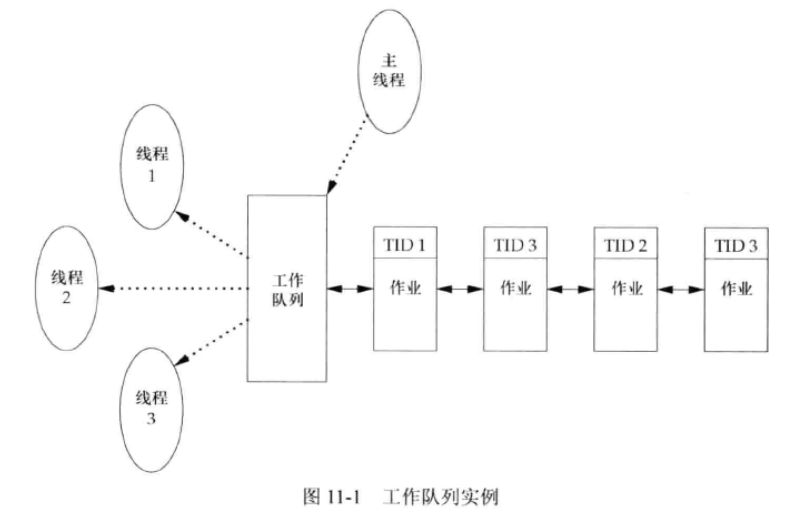
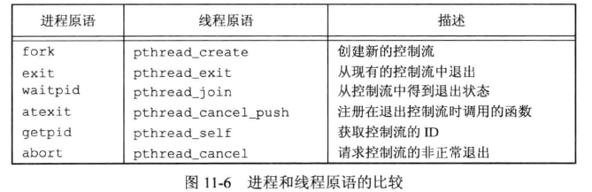

## 引言

主要介绍线程在单进程环境中执行多个任务。一个进程中的所有线程都可以访问该进程的组成部件，如 fd、内存等。  

无论在什么情况下，只要单个资源需要在多个用户间共享，就必须处理一致性问题，涉及到同步机制。


## 概念

典型的 UNIX 进程可以看成只有一个线程：某一时刻只做一件事情。有了多个线程之后，可以设计成每个线程处理各自独立的任务。这种方法有很多好处：

* 为每种事件类型分配单独的处理线程，简化处理异步事件。
* 多个进程必须使用操作系统提供的复杂机制才能实现内存和文件描述符的共享，涉及到后面的进程间通信。
* 有些问题可以分解从而提高整个程序的吞吐量。
* 交互的程序同样可以通过使用多线程来改善响应时间，多线程可以把程序中处理用户输入输出的部分与其他部分分开。

即使是运行在单核处理器上，多线程编程模式也有很多好处。  

每个线程都包含有表示执行环境所必须的信息，其中包括进程中标识线程的 **线程 ID**、一组寄存器值、栈、调度优先级和策略、信号屏蔽字、errno 变量、线程私有数据。一个进程的所有信息对该进程的所有线程都是共享的，包括可执行恒旭的代码、程序的全局内存和堆内存、栈、文件描述符等。  

这里讨论的线程接口主要来自 `POSIX.1-2001`。线程接口也称为 `pthread` 或 `POSIX 线程`。  


## 线程标识

线程 ID 是用 pthread_t 数据类型来表示的，具体结构取决于实现，可移植的操作系统不能将其作为整数处理，必须使用一个函数来对两个线程 ID 进行比较：

```c
#include <pthread.h>

int pthread_equal(pthread_t tid1, pthread_t tid2);
		// 若相等则返回非0数值，不等则返回0
```

pthread_t 数据类型：Linux 使用 unsigned long，Solaris 使用 unsigned int，FreeBSD 和 Mac OS X 用一个指向 pthread 结构的指针表示。  

但用这个数据类型也带来一个问题，不能用一种可移植的方式打印该数据类型的值。主要是调试代码可能受到影响。  

线程可以调用 pthread_self 函数获得自身的线程 ID：

```c
#include <pthread.h>

pthread_t pthread_self(void);
		// 返回调用线程的线程ID
```

当线程需要识别以线程 ID 作为标识的数据结构时，两个函数可以一起使用。例如主线程把工作任务放在一个队列中，用线程 ID 来控制每个工作线程处理哪些作业。不允许每个线程任意处理从队列顶端取出的作业，而是由主线程控制作业的分配，主线程会在每个待处理作业的结构中放置处理该作业的线程 ID，每个线程只能移出标有自己 ID 的作业。





## 线程创建

线程通过调用 pthread_create 函数创建线程：

```c
#include <pthread.h>

typedef void *(func)(void *);

int pthread_create(pthread_t *restrict tidp, const pthread_attr_t *restrict attr, void *(*start_rtn)(void *), void *restrict arg);
			// 成功返回0， 出错返回非零错误编号
```

参数：

* `*tidp`：`pthread_t` 是 `unsigned long int` 类型，存放对等线程ID
* `*attr`：用来改变新创建线程的默认属性，NULL 表示默认
* `*start_rtn` 函数：线程例程执行的函数名，该函数只有一个无类型指针参数 arg。
* `*arg`：传递给前一个函数的参数

线程创建时并不能保证运行顺序。新创建的线程可以访问进程的地址空间，并且继承调用线程的浮点环境和信号屏蔽字，但是该线程的挂起信号集会被清除。  


示例：

```c
#include "apue.h"
#include <pthread.h>

pthread_t ntid;

void printids(const char *s){
    pid_t pid;
    pthread_t tid;

    pid = getpid();
    tid = pthread_self();
    printf("%s pid %lu tid %lu (0x%lu)\n", s, (unsigned long)pid, (unsigned long)tid, (unsigned long)tid);
}

void *thr_fn(void *arg){
    printids("new thread: ");
    return((void *)0);
}

int main(void){
    int err;

    err = pthread_create(&ntid, NULL, thr_fn, NULL);
    if(err != 0)
        err_exit(err, "can't create thread");

    printids("main thread:");
    sleep(1);
    exit(0);
}

```

示例有两点注意的地方：

* 主线程中 sleep 的目的是为了让新线程运行，避免主线程先执行完后退出，新线程还没有机会运行，整个进程已经退出了，执行顺序依赖操作系统和线程实现的调度算法。
* 线程中调用 pthread_self() 函数获取自身的 ID，而不是从共享内存获取。这是由于例子中，主线程将线程ID存放在 ntid 中，但是可能新线程的调度先于主线程，此时 ntid 中的内容是未初始化的。

执行：

```bash
$ ./11.2 
main thread: pid 1406 tid 124873295767360 (0x124873295767360)
new thread:  pid 1406 tid 124873292641984 (0x124873292641984)
```


## 线程终止

如果进程中任意线程调用了 `exit`、`_Exit`、`_exit` ，那么整个进程就会停止。类似的还有动作是终止的信号。  

单个线程可以通过3种方式退出，而不终止整个进程：

1. 从例程中返回，返回值是线程退出码。
2. 被同一进程中其它线程取消。
3. 线程调用 pthread_exit。


### pthread_exit 和 pthread_join


```c
#include <pthread.h>

void pthread_exit(void *rval_ptr);
```

rval_ptr 参数是无类型指针。进程中其它线程可以通过调用 pthread_join 函数访问到这个指针。

```c
#include <pthread.h>

void pthread_join(pthread_t thread, void **rval_ptr);
		// 成功返回0，出错返回错误编号
```

调用线程将会一致阻塞，直到指定的线程调用 pthread_exit、从启动例程中返回或被取消。如果是从启动例程返回，rval_ptr 包含返回码，如果是被取消，rval_ptr 指定的地址内存单元被设置为 PTHREAD_CANCELED。  

可以通过调用 pthread_join 自动把线程置于分离状态，以恢复资源。如果线程已处于分离状态，pthread_join 调用会失败，返回 EINVAL。  

如果不需要线程的返回值，rval_ptr 可以设置为 NULL。  


### 示例：获取已终止线程退出码


```c
#include "apue.h"
#include <pthread.h>

void *
thr_fn1(void *arg)
{
	printf("thread 1 returning\n");
	return((void *)1);
}

void *
thr_fn2(void *arg)
{
	printf("thread 2 exiting\n");
	pthread_exit((void *)2);
}

int
main(void)
{
	int			err;
	pthread_t	tid1, tid2;
	void		*tret;

	err = pthread_create(&tid1, NULL, thr_fn1, NULL);
	if (err != 0)
		err_exit(err, "can't create thread 1");
	err = pthread_create(&tid2, NULL, thr_fn2, NULL);
	if (err != 0)
		err_exit(err, "can't create thread 2");
	err = pthread_join(tid1, &tret);
	if (err != 0)
		err_exit(err, "can't join with thread 1");
	printf("thread 1 exit code %ld\n", (long)tret);
	err = pthread_join(tid2, &tret);
	if (err != 0)
		err_exit(err, "can't join with thread 2");
	printf("thread 2 exit code %ld\n", (long)tret);
	exit(0);
}

```

执行：

```bash
$ ./11.3 
thread 1 returning
thread 2 exiting
thread 1 exit code 1
thread 2 exit code 2
```

pthread_create 和 pthread_exit 函数的无类型指针参数可以传递的值不止一个，这个指针可以传递包含复杂信息的结构的地址。但是注意，这个结构所使用的内存在调用者完成调用以后必须仍然是有效的。例如，在调用线程的栈上分配了该结构，那么其他的线程在使用这个结构时内存内容可能已经改变了。又如，线程在自己的栈上分配了一个结构，然后把指向这个结构的指针传给pthread_exit，那么调用pthread_join的线程试图使用该结构时，这个栈有可能已经被撤销，这块内存也已另作他用。  


### 示例：使用自动变量作为 pthread_exit 参数时的问题


```c
#include "apue.h"
#include <pthread.h>

struct foo {
	int a, b, c, d;
};

void
printfoo(const char *s, const struct foo *fp)
{
	printf("%s", s);
	printf("  structure at 0x%lx\n", (unsigned long)fp);
	printf("  foo.a = %d\n", fp->a);
	printf("  foo.b = %d\n", fp->b);
	printf("  foo.c = %d\n", fp->c);
	printf("  foo.d = %d\n", fp->d);
}

void *
thr_fn1(void *arg)
{
	struct foo	foo = {1, 2, 3, 4};

	printfoo("thread 1:\n", &foo);
	pthread_exit((void *)&foo);
}

void *
thr_fn2(void *arg)
{
	printf("thread 2: ID is %lu\n", (unsigned long)pthread_self());
	pthread_exit((void *)0);
}

int
main(void)
{
	int			err;
	pthread_t	tid1, tid2;
	struct foo	*fp;

	err = pthread_create(&tid1, NULL, thr_fn1, NULL);
	if (err != 0)
		err_exit(err, "can't create thread 1");
	err = pthread_join(tid1, (void *)&fp);
	if (err != 0)
		err_exit(err, "can't join with thread 1");
	sleep(1);
	printf("parent starting second thread\n");
	err = pthread_create(&tid2, NULL, thr_fn2, NULL);
	if (err != 0)
		err_exit(err, "can't create thread 2");
	sleep(1);
	printfoo("parent:\n", fp);
	exit(0);
}
```

执行：

```bash
$ ./11.4 
thread 1:
  structure at 0x793ced5feea0
  foo.a = 1
  foo.b = 2
  foo.c = 3
  foo.d = 4
parent starting second thread
thread 2: ID is 133302587487936
parent:
  structure at 0x793ced5feea0
  foo.a = -312478016
  foo.b = 31036
  foo.c = -312476452
  foo.d = 31036
```

### pthread_cancel

线程可以通过调用 pthread_cancel 函数请求取消同一进程中的其它线程:

```c
#include <pthread.h>

int pthread_cancel(pthread_t tid);
		// 成功返回0，出错返回错误编号
```

thread_cancel 并不等待线程终止，它仅仅提出请求。线程可以选择忽略或者控制如何被取消。  


### 线程清理处理函数(thread cleanup handler)

线程可以安排它退出时需要调用的函数，该处理函数记录在栈中，因此执行顺序与注册时顺序相反。

```c
#include <pthread.h>

void pthread_cleanup_push(void (*rtn)(void *), void *arg);
void pthread_cleanup_pop(int execute);
```

当线程执行以下动作时，清理函数 rtn 由 pthread_cleanup_push 函数调度，调用时只有一个参数 arg：

* 调用 pthread_exit 时。
* 响应取消请求时。
* 用非零 execute 参数调用 pthread_cleanup_pop 时。

如果 execute 参数为 0，清理函数将不被调用。无论何种情况， pthread_cleanup_pop 都将删除上次 pthread_cleanup_push 调用建立的清理处理程序。  

由于这两个函数可以被实现为宏，所以必须在与线程相同的作用域以匹配对的形式使用。pthread_cleanup_pop 的宏定义可以包含 `{` 字符，这种情况下pthread_cleanup_push 的定义中要有对应的 `}` 字符。


### 示例：cleanup handler 使用


```c
#include "apue.h"
#include <pthread.h>

void
cleanup(void *arg)
{
	printf("cleanup: %s\n", (char *)arg);
}

void *
thr_fn1(void *arg)
{
	printf("thread 1 start\n");
	pthread_cleanup_push(cleanup, "thread 1 first handler");
	pthread_cleanup_push(cleanup, "thread 1 second handler");
	printf("thread 1 push complete\n");
	if (arg)
		return((void *)1);
	pthread_cleanup_pop(0);
	pthread_cleanup_pop(0);
	return((void *)1);
}

void *
thr_fn2(void *arg)
{
	printf("thread 2 start\n");
	pthread_cleanup_push(cleanup, "thread 2 first handler");
	pthread_cleanup_push(cleanup, "thread 2 second handler");
	printf("thread 2 push complete\n");
	if (arg)
		pthread_exit((void *)2);
	pthread_cleanup_pop(0);
	pthread_cleanup_pop(0);
	pthread_exit((void *)2);
}

int
main(void)
{
	int			err;
	pthread_t	tid1, tid2;
	void		*tret;

	err = pthread_create(&tid1, NULL, thr_fn1, (void *)1);
	if (err != 0)
		err_exit(err, "can't create thread 1");
	err = pthread_create(&tid2, NULL, thr_fn2, (void *)1);
	if (err != 0)
		err_exit(err, "can't create thread 2");
	err = pthread_join(tid1, &tret);
	if (err != 0)
		err_exit(err, "can't join with thread 1");
	printf("thread 1 exit code %ld\n", (long)tret);
	err = pthread_join(tid2, &tret);
	if (err != 0)
		err_exit(err, "can't join with thread 2");
	printf("thread 2 exit code %ld\n", (long)tret);
	exit(0);
}

```

执行：

```bash
$ ./11.5 
thread 1 start
thread 1 push complete
thread 1 exit code 1
thread 2 start
thread 2 push complete
cleanup: thread 2 second handler
cleanup: thread 2 first handler
thread 2 exit code 2

## 再次执行，线程的顺序和操作系统调度有关
$ ./11.5 
thread 2 start
thread 2 push complete
thread 1 start
thread 1 push complete
thread 1 exit code 1
cleanup: thread 2 second handler
cleanup: thread 2 first handler
thread 2 exit code 2
```

两个线程都启动和退出了，但是只有第二个线程的清理处理程序被调用了。这是因为如果线程时通过从它的启动例程中返回而终止的话，它的清理处理程序就不会被调用。清理处理程序按照与他们 push 时相反的顺序被调用。  


### 进程和线程原语的对比




### 分离 detach

在默认情况下，线程的终止状态会保存直到对该线程调用pthread_join。如果线程已经被**分离**，线程的底层存储资源可以在线程终止时立即被收回。在线程被分离后，我们不能用 pthread_join 函数等待它的终止状态，因为对分离状态的线程调用 pthread_join 会产生未定义行为。可以调用 pthread_detach 分离线程。

```c
#include <pthread.h>

int pthread_detach(pthread_t tid);
		// 成功返回0，出错返回错误编号
```


## 线程同步

当多个线程共享相同的内存区域，且它们之间存在同时修改或读取同一块内存数据时，就可能会发生数据不一致问题。

### 互斥量 mutex

可以使用 pthread 的互斥接口来保护数据，确保同一时间只有一个线程访问数据。**互斥量(mutext)** 从本质上来说就是一把锁，访问共享资源前对互斥量枷锁，访问完成后释放锁。  

互斥变量是用 pthread_mutex_t 数据类型表示的。使用互斥变量以前，必须对它进行初始化，可以把它设置成常量 PTHREAD_MUTEX_INITIALIZER(只适用于静态分配的互斥量)，也可以调用 pthread_mutex_init 函数进行初始化，释放时调用 pthread_mutex_destroy。  

```c
#include <pthread.h>

int pthread_mutex_init(pthread_mutex_t *restrict mutex, const pthread_mutexattr_t *restrict attr);

int pthread_mutex_destroy(pthread_mutex_t *mutex);
		// 成功返回0，出错返回错误编号
```

如果用默认的属性初始化互斥量，将参数 attr 设置为 NULL。  

对互斥量加锁，需要调用 pthread_mutex_lock。如果该互斥量已经上锁，调用线程将阻塞直到互斥量被解锁。对互斥量解锁需要调用 pthread_mutex_unlock。  

```c
#include <pthread.h>

int pthread_mutex_lock(pthread_mutex_t *mutex);
int pthread_mutex_trylock(pthread_mutex_t *mutex);
int pthread_mutex_unlock(pthread_mutex_t *mutex);
		// 成功返回0，出错返回错误编号

```

如果不希望被阻塞，可以调用 pthread_mutex_trylock 尝试对互斥量加锁。可以加锁就返回0，不能加锁将返回 EBUSY。  


示例：

```c
#include <stdlib.h>
#include <pthread.h>

struct foo {
	int             f_count;
	pthread_mutex_t f_lock;
	int             f_id;
	/* ... more stuff here ... */
};

struct foo *
foo_alloc(int id) /* allocate the object */
{
	struct foo *fp;
	
    /* 分配内存存放 foo 结构体对象，初始化各结构体成员 */
	if ((fp = malloc(sizeof(struct foo))) != NULL) {
		fp->f_count = 1;
		fp->f_id = id;
		if (pthread_mutex_init(&fp->f_lock, NULL) != 0) {
			free(fp);
			return(NULL);
		}
		/* ... continue initialization ... */
	}
	return(fp);
}

void
foo_hold(struct foo *fp) /* add a reference to the object */
{
	pthread_mutex_lock(&fp->f_lock);
	fp->f_count++;
	pthread_mutex_unlock(&fp->f_lock);
}

void
foo_rele(struct foo *fp) /* release a reference to the object */
{
	pthread_mutex_lock(&fp->f_lock);
	if (--fp->f_count == 0) { /* last reference */
		pthread_mutex_unlock(&fp->f_lock);
		pthread_mutex_destroy(&fp->f_lock);
		free(fp);
	} else {
		pthread_mutex_unlock(&fp->f_lock);
	}
}

```


### 避免死锁

如果线程试图对同一个互斥量加锁两次，就会陷入死锁状态。两个线程以相反顺序分别加锁两个互斥量时，也会产生死锁。  

通过仔细控制互斥量加锁可以避免死锁，例如需要对互斥量A、B同时加锁，所有线程总是在对B加锁前锁住A。或者尝试加锁失败后，释放已占用的互斥量，隔段时间后再次尝试。  


示例：

```c
#include <stdlib.h>
#include <pthread.h>

#define NHASH 29
#define HASH(id) (((unsigned long)id)%NHASH)

struct foo *fh[NHASH];

pthread_mutex_t hashlock = PTHREAD_MUTEX_INITIALIZER;

struct foo {
	int             f_count;
	pthread_mutex_t f_lock;
	int             f_id;
	struct foo     *f_next; /* protected by hashlock */
	/* ... more stuff here ... */
};

struct foo *
foo_alloc(int id) /* allocate the object */
{
	struct foo	*fp;
	int			idx;

	if ((fp = malloc(sizeof(struct foo))) != NULL) {
		fp->f_count = 1;
		fp->f_id = id;
		if (pthread_mutex_init(&fp->f_lock, NULL) != 0) {
			free(fp);
			return(NULL);
		}
        /* idx = id % 29 */
		idx = HASH(id);
        /* 加锁-全局锁 */
		pthread_mutex_lock(&hashlock);
        /* 把新的foo 添加到 hash 数组 fh 中 */
		fp->f_next = fh[idx];
		fh[idx] = fp;
        /* 对 foo 对象加锁准备初始化，避免其它线程访问，对全局锁解锁 */
		pthread_mutex_lock(&fp->f_lock);
		pthread_mutex_unlock(&hashlock);
		/* ... continue initialization ... */
        /* 初始化结束，解锁 foo 结构体对象的锁 */
		pthread_mutex_unlock(&fp->f_lock);
	}
	return(fp);
}

/* 对 foo 对象增加一个引用 */
void
foo_hold(struct foo *fp) /* add a reference to the object */
{
	pthread_mutex_lock(&fp->f_lock);
	fp->f_count++;
	pthread_mutex_unlock(&fp->f_lock);
}

/* 查找已存在的 foo 类型 结构对象 */
struct foo *
foo_find(int id) /* find an existing object */
{
	struct foo	*fp;

	pthread_mutex_lock(&hashlock);
	for (fp = fh[HASH(id)]; fp != NULL; fp = fp->f_next) {
		if (fp->f_id == id) {
			foo_hold(fp);
			break;
		}
	}
	pthread_mutex_unlock(&hashlock);
	return(fp);
}

/* 释放一个对于 foo 对象的引用 */
void
foo_rele(struct foo *fp) /* release a reference to the object */
{
	struct foo	*tfp;
	int			idx;

    /* 对 foo 对象加锁 */
	pthread_mutex_lock(&fp->f_lock);
	if (fp->f_count == 1) { /* last reference */
        /* 对 foo 对象解锁，再重新对全局互斥锁、foo 对象加锁后检查引用是否为1 */
		pthread_mutex_unlock(&fp->f_lock);
		pthread_mutex_lock(&hashlock);
		pthread_mutex_lock(&fp->f_lock);
		/* need to recheck the condition */
        /* 如果引用不为 1，说明还有其它线程在尝试获取锁，计数减一后释放锁，返回 */
		if (fp->f_count != 1) {
			fp->f_count--;
			pthread_mutex_unlock(&fp->f_lock);
			pthread_mutex_unlock(&hashlock);
			return;
		}
        
        /* 从 hash 列表中删除 foo 对象 */
		/* remove from list */
		idx = HASH(fp->f_id);
		tfp = fh[idx];
		if (tfp == fp) {
			fh[idx] = fp->f_next;
		} else {
			while (tfp->f_next != fp)
				tfp = tfp->f_next;
			tfp->f_next = fp->f_next;
		}
		pthread_mutex_unlock(&hashlock);
		pthread_mutex_unlock(&fp->f_lock);
		pthread_mutex_destroy(&fp->f_lock);
		free(fp);
	} else {
		fp->f_count--;
		pthread_mutex_unlock(&fp->f_lock);
	}
}

```

分配函数锁住了散列列表锁，把新的结构添加到了散列桶中，对散列列表的锁解锁之前，先锁定了新结构中的互斥量。新的结构体时存放在全局列表中的，其它线程可以找到它，所以在初始化完成之前，需要阻塞其它线程试图访问新结构。  

在释放时也要多次加锁检查，确认是最后一个引用后再释放。  


简化示例， 将全局锁 hashlock 用来保护 foo 的 f_count 属性：

```c
#include <stdlib.h>
#include <pthread.h>

#define NHASH 29
#define HASH(id) (((unsigned long)id)%NHASH)

struct foo *fh[NHASH];
pthread_mutex_t hashlock = PTHREAD_MUTEX_INITIALIZER;

struct foo {
	int             f_count; /* protected by hashlock */
	pthread_mutex_t f_lock;
	int             f_id;
	struct foo     *f_next; /* protected by hashlock */
	/* ... more stuff here ... */
};

struct foo *
foo_alloc(int id) /* allocate the object */
{
	struct foo	*fp;
	int			idx;

	if ((fp = malloc(sizeof(struct foo))) != NULL) {
		fp->f_count = 1;
		fp->f_id = id;
		if (pthread_mutex_init(&fp->f_lock, NULL) != 0) {
			free(fp);
			return(NULL);
		}
		idx = HASH(id);
		pthread_mutex_lock(&hashlock);
		fp->f_next = fh[idx];
		fh[idx] = fp;
		pthread_mutex_lock(&fp->f_lock);
		pthread_mutex_unlock(&hashlock);
		/* ... continue initialization ... */
		pthread_mutex_unlock(&fp->f_lock);
	}
	return(fp);
}

void
foo_hold(struct foo *fp) /* add a reference to the object */
{
	pthread_mutex_lock(&hashlock);
	fp->f_count++;
	pthread_mutex_unlock(&hashlock);
}

struct foo *
foo_find(int id) /* find an existing object */
{
	struct foo	*fp;

	pthread_mutex_lock(&hashlock);
	for (fp = fh[HASH(id)]; fp != NULL; fp = fp->f_next) {
		if (fp->f_id == id) {
			fp->f_count++;
			break;
		}
	}
	pthread_mutex_unlock(&hashlock);
	return(fp);
}

void
foo_rele(struct foo *fp) /* release a reference to the object */
{
	struct foo	*tfp;
	int			idx;

	pthread_mutex_lock(&hashlock);
	if (--fp->f_count == 0) { /* last reference, remove from list */
		idx = HASH(fp->f_id);
		tfp = fh[idx];
		if (tfp == fp) {
			fh[idx] = fp->f_next;
		} else {
			while (tfp->f_next != fp)
				tfp = tfp->f_next;
			tfp->f_next = fp->f_next;
		}
		pthread_mutex_unlock(&hashlock);
		pthread_mutex_destroy(&fp->f_lock);
		free(fp);
	} else {
		pthread_mutex_unlock(&hashlock);
	}
}

```


### 函数 pthread_mutex_timedlock

当线程试图获取一个以加锁的互斥量时，pthread_mutex_timedlock 互斥量原语允许绑定线程阻塞时间。它与 pthread_mutex_lock 是基本等价的，但是达到超时时间时，pthread_mutex_timedlock 不会对互斥量进行加锁，而是返回错误码 ETIMEDOUT。  

```c
#include <pthread.h>
#include <time.h>

int pthread_mutex_timedlock(pthread_mutex_t *restrict mutex, const struct timespec *restrict tsptr);
		// 成功返回0，出错返回错误编号
```

tsptr 参数是一个指向 timespec 结构体的指针，用秒和纳秒描述时间，表明愿意等待的绝对时间。  

示例：

```c
#include "apue.h"
#include <pthread.h>

int
main(void)
{
	int err;
	struct timespec tout;
	struct tm *tmp;
	char buf[64];
	pthread_mutex_t lock = PTHREAD_MUTEX_INITIALIZER;

	pthread_mutex_lock(&lock);
	printf("mutex is locked\n");
	clock_gettime(CLOCK_REALTIME, &tout);
	tmp = localtime(&tout.tv_sec);
	strftime(buf, sizeof(buf), "%r", tmp);
	printf("current time is %s\n", buf);
	tout.tv_sec += 10;	/* 10 seconds from now */
	/* caution: this could lead to deadlock */
	err = pthread_mutex_timedlock(&lock, &tout);
	clock_gettime(CLOCK_REALTIME, &tout);
	tmp = localtime(&tout.tv_sec);
	strftime(buf, sizeof(buf), "%r", tmp);
	printf("the time is now %s\n", buf);
	if (err == 0)
		printf("mutex locked again!\n");
	else
		printf("can not lock mutex again: %s\n", strerror(err));
	exit(0);
}


```

这里是为了演示故意对已有的互斥量加锁，运行：

```bash
$ ./11.13 
mutex is locked
current time is 05:39:15 PM
the time is now 05:39:25 PM
can not lock mutex again: Connection timed out
```


### 读写锁

读写锁(reader-writer lock)与互斥量类似，不过读写锁允许更高的并行性。互斥锁只有锁住或未锁住状态，且一次只有一个线程可以对其加锁。读写锁可以有 3 种状态：

* 读模式下加锁。
* 写模式下加锁。
* 不加锁。

一次只有一个线程可以占用写模式的锁，但可以有多个线程同时占有读模式的锁。  

读写锁是写加锁状态时，所有试图对这个锁加锁的线程会被阻塞。当读写锁是读加锁状态时，只阻塞尝试写模式加锁的线程，直到所有写锁释放。读写锁适合读远大于写的情况。读写锁也叫**共享互斥锁(shared-exclusive lock)**。  

读写锁在使用之前必须初始化，释放底层的内存之前必须销毁：

```c
#include <pthread.h>

int pthread_rwlock_init(pthread_rwlock_t *restrict rwlock, const pthread_rwlockattr_t *restrict attr);
    
int pthread_rwlock_destroy(pthread_rwlock_t *rwlock);
		// 成功返回0，出错返回错误编号
```

初始化时可以传一个 null 指针，给读写锁默认属性。


读锁、写锁、解锁的函数：

```c
#include <pthread.h>

int pthread_rwlock_rdlock(pthread_rwlock_t *rwlock);
int pthread_rwlock_wrlock(pthread_rwlock_t *rwlock);
int pthread_rwlock_unlock(pthread_rwlock_t *rwlock);
		// 成功返回0，出错返回错误编号
```


SUS 还定义了读写锁原语的条件版本：

```c
#include <pthread.h>

int pthread_rwlock_tryrdlock(pthread_rwlock_t *rwlock);
int pthread_rwlock_trywrlock(pthread_rwlock_t *rwlock);
		// 成功返回0，出错返回错误编号 EBUSY
```


读写锁示例：

```c
#include <stdlib.h>
#include <pthread.h>

struct job {
	struct job *j_next;
	struct job *j_prev;
	pthread_t   j_id;   /* tells which thread handles this job */
	/* ... more stuff here ... */
};

struct queue {
	struct job      *q_head;
	struct job      *q_tail;
	pthread_rwlock_t q_lock;
};

/*
 * Initialize a queue.
 */
int
queue_init(struct queue *qp)
{
	int err;

	qp->q_head = NULL;
	qp->q_tail = NULL;
	err = pthread_rwlock_init(&qp->q_lock, NULL);
	if (err != 0)
		return(err);
	/* ... continue initialization ... */
	return(0);
}

/*
 * Insert a job at the head of the queue.
 */
void
job_insert(struct queue *qp, struct job *jp)
{
	pthread_rwlock_wrlock(&qp->q_lock);
	jp->j_next = qp->q_head;
	jp->j_prev = NULL;
	if (qp->q_head != NULL)
		qp->q_head->j_prev = jp;
	else
		qp->q_tail = jp;	/* list was empty */
	qp->q_head = jp;
	pthread_rwlock_unlock(&qp->q_lock);
}

/*
 * Append a job on the tail of the queue.
 */
void
job_append(struct queue *qp, struct job *jp)
{
	pthread_rwlock_wrlock(&qp->q_lock);
	jp->j_next = NULL;
	jp->j_prev = qp->q_tail;
	if (qp->q_tail != NULL)
		qp->q_tail->j_next = jp;
	else
		qp->q_head = jp;	/* list was empty */
	qp->q_tail = jp;
	pthread_rwlock_unlock(&qp->q_lock);
}

/*
 * Remove the given job from a queue.
 */
void
job_remove(struct queue *qp, struct job *jp)
{
	pthread_rwlock_wrlock(&qp->q_lock);
	if (jp == qp->q_head) {
		qp->q_head = jp->j_next;
		if (qp->q_tail == jp)
			qp->q_tail = NULL;
		else
			jp->j_next->j_prev = jp->j_prev;
	} else if (jp == qp->q_tail) {
		qp->q_tail = jp->j_prev;
		jp->j_prev->j_next = jp->j_next;
	} else {
		jp->j_prev->j_next = jp->j_next;
		jp->j_next->j_prev = jp->j_prev;
	}
	pthread_rwlock_unlock(&qp->q_lock);
}

/*
 * Find a job for the given thread ID.
 */
struct job *
job_find(struct queue *qp, pthread_t id)
{
	struct job *jp;

	if (pthread_rwlock_rdlock(&qp->q_lock) != 0)
		return(NULL);

	for (jp = qp->q_head; jp != NULL; jp = jp->j_next)
		if (pthread_equal(jp->j_id, id))
			break;

	pthread_rwlock_unlock(&qp->q_lock);
	return(jp);
}

```


### 带有超时的读写锁

SUS 定义了带有超时的读写锁加锁函数，使得应用程序避免陷入永久阻塞。

```c
#include <pthread.h>
#include <time.h>

int pthread_rwlock_timedrdlock(pthread_rwlock_t *restrict rwlock, const struct timespec *restrict tsptr);
int pthread_rwlock_timedwrlock(pthread_rwlock_t *restrict rwlock, const struct timespec *restrict tsptr);
		// 成功返回0，出错返回错误编号
```


### 条件变量

条件变量是线程可用的另一种同步机制。  

条件本身是由互斥量保护的，改变条件状态之前需要先加锁。其它线程不会察觉到变化，因为互斥量必须在锁定以后才能计算条件。  

使用条件变量之前，需要对其进行初始化，可以通过设置为 PTHREAD_MUTEX_INITIALIZER 常量静态初始化，如果条件是动态变化的，就需要调用 pthread_cond_init 函数进行初始化。由 `pthread_cond_t` 数据类型表示条件变量。释放条件变量的内存空间之前，调用销毁函数。  

```c
#include <pthread.h>

int pthread_cond_init(pthread_cond_t *restrict cond, const pthread_condattr_t *restrict attr);
int pthread_cond_destroy(pthread_cond_t *cond);
		// 成功返回0，出错返回错误编号
```


使用 pthread_cond_wait 函数等待条件变为真，pthread_cond_timedwait 函数可以指定时间：

```c
#include <pthread.h>

int pthread_cond_wait(pthread_cond_t *restrict cond, pthread_mutex_t *restrict mutex);
int pthread_cond_timedwait(pthread_cond_t *cond, pthread_mutex_t *restrict mutex, const struct timespec *restrict tsptr);
		// 成功返回0，出错返回错误编号
```


通知线程条件已经满足的函数，可以通知一个或者多个：

```c
#include <pthread.h>

int pthread_cond_signal(pthread_cond_t *cond);
int pthread_cond_broadcast(pthread_cond_t *cond);
		// 成功返回0，出错返回错误编号
```

POSIX 规范为了简化 pthread_cond_signal 的实现，允许唤醒一个以上的线程。调用这两个函数时，一定要在改变条件状态以后。  

示例：

```c
#include <pthread.h>

struct msg {
	struct msg *m_next;
	/* ... more stuff here ... */
};

struct msg *workq;

pthread_cond_t qready = PTHREAD_COND_INITIALIZER;

pthread_mutex_t qlock = PTHREAD_MUTEX_INITIALIZER;

void
process_msg(void)
{
	struct msg *mp;

	for (;;) {
		pthread_mutex_lock(&qlock);
		while (workq == NULL)
			pthread_cond_wait(&qready, &qlock);
		mp = workq;
		workq = mp->m_next;
		pthread_mutex_unlock(&qlock);
		/* now process the message mp */
	}
}

void
enqueue_msg(struct msg *mp)
{
	pthread_mutex_lock(&qlock);
	mp->m_next = workq;
	workq = mp;
	pthread_mutex_unlock(&qlock);
	pthread_cond_signal(&qready);
}

```

示例中设置了 qready 为条件变量，互斥量 qlock 用来保护条件变量。在消息入队时，需要占有互斥量。


### 自旋锁

自旋锁与互斥量类似，但是它不通过休眠使进程阻塞，而是在获取锁之前一直处于忙等(自旋)阻塞状态。适用于：锁被持有时间短，不希望在重新调度上花费太多成本的场景。  

通常用于底层原语实现其它类型的锁。适合用在非抢占式内核中。用户层并不常用。  

初始化和销毁函数：

```c
#include <pthread.h>

int pthread_spin_init(pthread_spinlock_t *lock, int pshared);
int pthread_spin_destroy(pthread_spinlock_t *lock);
		// 成功返回0，出错返回错误编号
```

pthread_spin_init 函数的 pshared 参数表示**进程共享属性**，表明自旋锁是如何获取的，如果设置为 PTHREAD_PROCESS_SHARED，可以被其它进程的线程访问，否则设置为 PTHREAD_PROCESS_PRIVATE 只能被初始化该锁的进程内部线程所访问。  


获取和解开自旋锁相关函数：

```c
#include <pthread.h>

int pthread_spin_lock(pthread_spinlock_t *lock);
int pthread_spin_trylock(pthread_spinlock_t *lock);
int pthread_spin_unlock(pthread_spinlock_t *lock);
		// 成功返回0，出错返回错误编号
```

不要调用在持有自旋锁的情况下可能会陷入休眠的函数，会浪费CPU资源，导致其他线程等待时间加长。  


### 屏障

barrier 是用户协调多个线程并行工作的同步机制。允许每个线程等待，直到所有的合作线程都到达某一点，再从该点继续执行。pthread_join 就是一种屏障：一个线程等待直到另一个线程退出。  


屏障初始化和销毁函数：

```c
#include <pthread.h>

int pthread_barrier_init(pthread_barrier_t *restrict barrier, const pthread_barrierattr_t *restrict attr, unsigned int count);
int pthread_barrier_destroy(pthread_barrier_t *barrier);
		// 成功返回0，出错返回错误编号
```

初始化屏障时，可以使用 count 参数指定，允许所有线程继续运行之前，必须到达屏障的线程数目。attr 参数指定屏障对象的属性，设置为 NULL 使用默认属性。


可以调用 pthread_barrier_wait 函数表明线程已完成工作，等待其他线程赶上进度：

```c
#include <pthread.h>

int pthread_barrier_wait(pthread_barrier_t *barrier);
		// 成功返回 0 或 PTHREAD_BARRIER_SERIAL_THREAD，出错返回错误编号
```

调用 pthread_barrier_wait 的线程在屏障计数(init 时设置的 count)未满足条件时，进入休眠状态。如果该线程是最后一个调用的，就满足了屏障计数，所有线程都被唤醒。  

对于一个任意线程 pthread_barrier_wait 函数返回 PTHREAD_BARRIER_SERIAL_THREAD ，使其作为主线程工作在其他所有线程已完成的工作结果上。  


示例，对 800 万个数进行排序，分解为多个线程排序再合并结果：

```c
#include "apue.h"
#include <pthread.h>
#include <limits.h>
#include <sys/time.h>

#define NTHR   8				/* number of threads */
#define NUMNUM 8000000L			/* number of numbers to sort */
#define TNUM   (NUMNUM/NTHR)	/* number to sort per thread */

long nums[NUMNUM];
long snums[NUMNUM];

pthread_barrier_t b;

#ifdef SOLARIS
#define heapsort qsort
#else
extern int heapsort(void *, size_t, size_t,
                    int (*)(const void *, const void *));
#endif

/*
 * Compare two long integers (helper function for heapsort)
 */
int
complong(const void *arg1, const void *arg2)
{
	long l1 = *(long *)arg1;
	long l2 = *(long *)arg2;

	if (l1 == l2)
		return 0;
	else if (l1 < l2)
		return -1;
	else
		return 1;
}

/*
 * Worker thread to sort a portion of the set of numbers.
 */
void *
thr_fn(void *arg)
{
	long	idx = (long)arg;

	heapsort(&nums[idx], TNUM, sizeof(long), complong);
	pthread_barrier_wait(&b);

	/*
	 * Go off and perform more work ...
	 */
	return((void *)0);
}

/*
 * Merge the results of the individual sorted ranges.
 */
void
merge()
{
	long	idx[NTHR];
	long	i, minidx, sidx, num;

	for (i = 0; i < NTHR; i++)
		idx[i] = i * TNUM;
	for (sidx = 0; sidx < NUMNUM; sidx++) {
		num = LONG_MAX;
		for (i = 0; i < NTHR; i++) {
			if ((idx[i] < (i+1)*TNUM) && (nums[idx[i]] < num)) {
				num = nums[idx[i]];
				minidx = i;
			}
		}
		snums[sidx] = nums[idx[minidx]];
		idx[minidx]++;
	}
}

int
main()
{
	unsigned long	i;
	struct timeval	start, end;
	long long		startusec, endusec;
	double			elapsed;
	int				err;
	pthread_t		tid;

	/*
	 * Create the initial set of numbers to sort.
	 */
	srandom(1);
	for (i = 0; i < NUMNUM; i++)
		nums[i] = random();

	/*
	 * Create 8 threads to sort the numbers.
	 */
	gettimeofday(&start, NULL);
	pthread_barrier_init(&b, NULL, NTHR+1);
	for (i = 0; i < NTHR; i++) {
		err = pthread_create(&tid, NULL, thr_fn, (void *)(i * TNUM));
		if (err != 0)
			err_exit(err, "can't create thread");
	}
	pthread_barrier_wait(&b);
	merge();
	gettimeofday(&end, NULL);

	/*
	 * Print the sorted list.
	 */
	startusec = start.tv_sec * 1000000 + start.tv_usec;
	endusec = end.tv_sec * 1000000 + end.tv_usec;
	elapsed = (double)(endusec - startusec) / 1000000.0;
	printf("sort took %.4f seconds\n", elapsed);
	for (i = 0; i < NUMNUM; i++)
		printf("%ld\n", snums[i]);
	exit(0);
}

```

上面示例在编译时如报错找不到 heap_sort ，需要安装依赖库 libbsd，在 gcc 编译时增加参数 -lbsd。  

执行：

```bash
## 示例的8个线程，注释掉了main中的for循环打印
$ ../gcc_a ./11.16.c 
1$ ./11.16
sort took 0.6603 seconds

## 修改为2个线程
$ ../gcc_a ./11.16.c 
$ ./11.16
sort took 1.7022 seconds

## 修改为一个线程
$ ../gcc_a ./11.16.c 
$ ./11.16
sort took 3.3598 seconds
```


