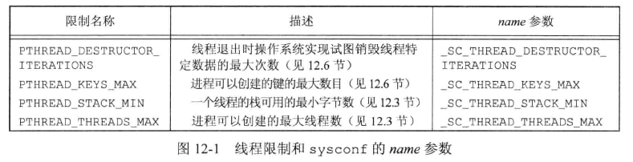
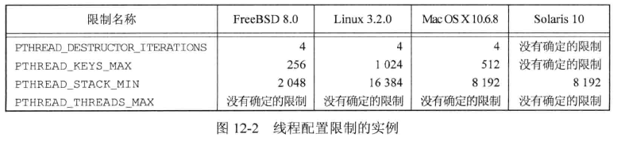
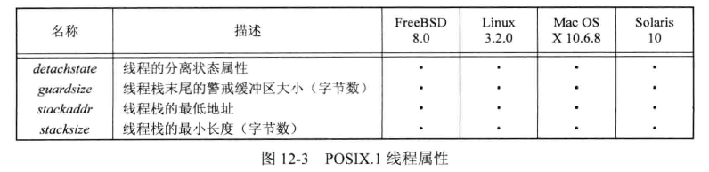
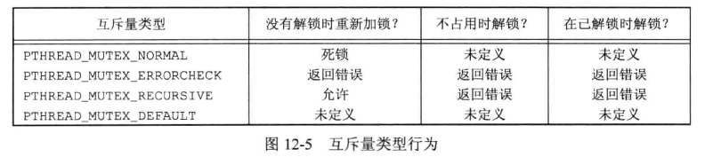
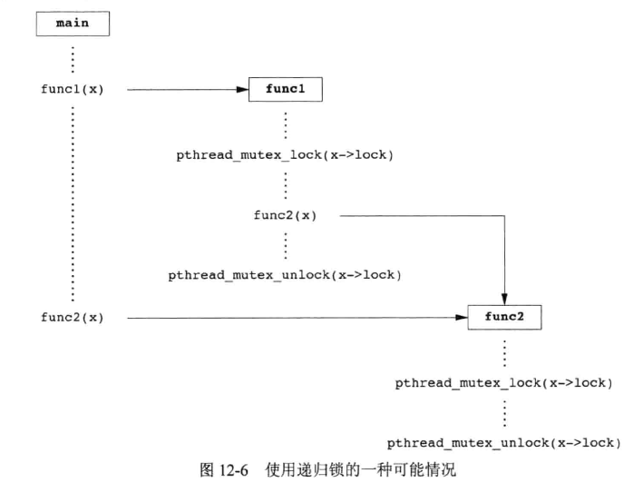
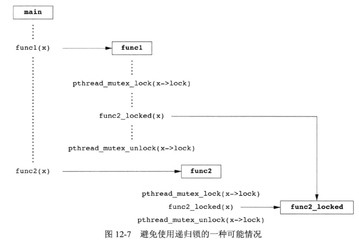
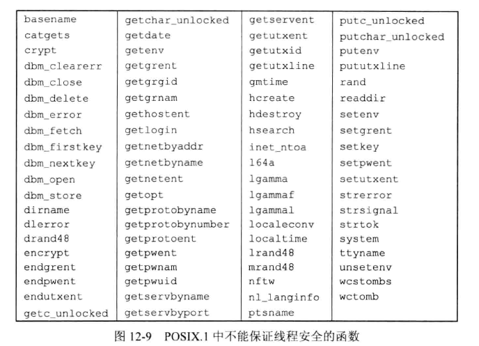
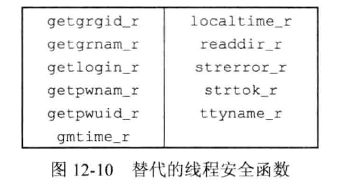
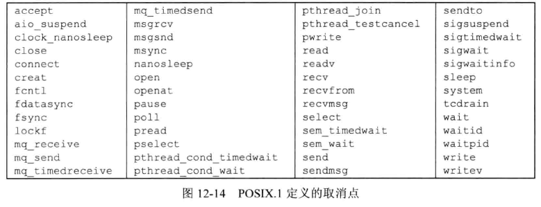
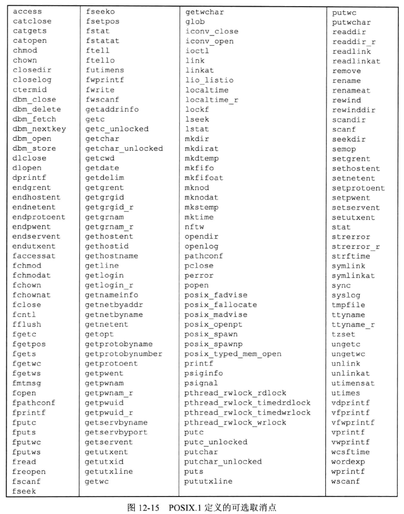

## 引言

介绍控制线程行为更详细的内容，包括线程属性和同步原语属性，多个线程之间如何保持数据的私有性，以及基于进程的系统调用如何与线程进行交互。


## 线程限制

SUS 定义了与线程操作有关的限制，可以通过 sysconf 函数查询。主要时为了增强应用在不同操作系统之间的移植性。  



书中所用几种操作系统的线程相关限制：




## 线程属性

pthread 接口允许设置每个对象关联不同属性，来跳转线程和同步对象的行为。通常管理这些属性的函数都有相同的模式：

1. 每个对象与它自己类型的属性对象进行关联，例如线程和线程属性，互斥量和互斥量属性。
2. 有一个初始化函数，把属性设置为默认值。
3. 有一个销毁属性对象的函数，释放初始化时关联的资源。
4. 提供获取属性值的函数。
5. 提供设置属性值的函数。参数是值传递。

pthread_attr_t 结构体包含了操作系统实现所支持的线程属性默认值。  

### 初始化和销毁函数

```c
#include <pthread.h>

int pthread_attr_init(pthread_attr_t *attr);
int pthread_attr_destroy(pthread_attr_t *attr);
		// 成功返回0，出错返回错误编号
```


POSIX.1 定义的线程属性，以及几种实现对线程属性的支持：



### 分离状态属性函数

创建线程时如果不需要了解线程的终止状态，可以修改 pthread_attr_t 结构中 detachstate 属性，让线程创建时就处于分离状态。分离状态可以被设置为：PTHREAD_CREATE_DETACHED 表示分离状态启动线程，PTHREAD_CREATE_JOINABLE 表示正常启动线程，应用可以获取线程终止状态。   

分离状态属性的 get、set 函数：

```c
#include <pthread.h>

int pthread_attr_getdetachstate(const pthread_attr_t *restrict attr, int *detachstate);
int pthread_attr_setdetachstate(pthread_attr_t *attr, int *detachstate);        // 成功返回0，出错返回错误编号
```


示例，分离状态创建线程：

```c
#include "apue.h"
#include <pthread.h>

int
makethread(void *(*fn)(void *), void *arg)
{
	int				err;
	pthread_t		tid;
	pthread_attr_t	attr;

	err = pthread_attr_init(&attr);
	if (err != 0)
		return(err);
	err = pthread_attr_setdetachstate(&attr, PTHREAD_CREATE_DETACHED);
	if (err == 0)
		err = pthread_create(&tid, &attr, fn, arg);
	pthread_attr_destroy(&attr);
	return(err);
}

```


### 栈相关属性函数

线程栈属性不是 POSIX 标准强制要求的，SUS 的 XSI 选项要求支持该属性。  

相关 get、set 函数：

```c
#include <pthread.h>

int pthread_attr_getstack(const pthread_attr_t *restrict attr, void **restrict stackaddr, size_t *restrict stacksize);
int pthread_attr_setstack(pthread_attr_t *attr, void *stackaddr, size_t stacksize);        // 成功返回0，出错返回错误编号
```

单个进程中只有一个栈，但对于线程而言需要与其它线程共享栈，如果多个线程累计使用超过了进程的可用栈空间，或者调用的函数分配了大量自动变量，再或者调用的函数涉及很深的栈帧，都需要更大的栈空间。  

如果线程栈的地址空间用完了，可以使用 malloc、mmap 来分配栈空间。stackaddr 参数指定的地址可以作为线程栈内存范围中的最低可寻址地址。  

应用可以调用设置线程属性栈大小的函数：

```c
#include <pthread.h>

int pthread_attr_getstacksize(const pthread_attr_t *restrict attr,size_t *restrict stacksize);
int pthread_attr_setstacksize(pthread_attr_t *attr, size_t stacksize);        // 成功返回0，出错返回错误编号
```


### 栈警戒缓冲区属性函数

线程属性 guardsize 控制着线程栈末尾之后用以避免栈溢出的扩展内存大小。可以设置为 0，这样不会提供警戒缓冲区。同样如果修改了线程属性 stackaddr ，也会使栈警戒区无效。  

```c
#include <pthread.h>

int pthread_attr_getguardsize(const pthread_attr_t *restrict attr, size_t *restrict guardsize);
int pthread_attr_setguardsize(pthread_attr_t *attr, size_t guardsize);        // 成功返回0，出错返回错误编号
```

如果 guardsize 线程属性被修改了，线程的栈指针溢出到警戒区，应用会收到出错信号。    


## 同步属性

线程的同步对象也有属性。


### 互斥量属性

互斥量属性用 pthread_mutexattr_t 结构体表示。使用 PTHREAD_MUTEX_INITIALIZER 常量或者指向互斥量属性结构的空指针作为参数调用 pthread_mutex_init 函数，可以得到互斥量的默认属性。  

初始化和销毁函数：

```c
#include <pthread.h>
   
int pthread_mutexattr_init(pthread_mutexattr_t *attr);
int pthread_mutexattr_destroy(pthread_mutexattr_t *attr);        // 成功返回0，出错返回错误编号
```

互斥量相关属性主要有 3 个：**进程共享属性**、**健壮属性**、**类型属性**。  

进程共享属性主要是关于多个进程是否可以共享此互斥量，其值可以是 PTHREAD_PROCESS_SHARED ，或者是 PTHREAD_PROCESS_PRIVATE (这是很多实现的默认值)。  

相关 get、set 函数：

```c
#include <pthread.h>
   
int pthread_mutexattr_getshared(const pthread_mutexattr_t *restrict attr, int *restrict pshared);
int pthread_mutexattr_setshared(pthread_mutexattr_t *attr, int pshared);        // 成功返回0，出错返回错误编号
```


健壮性(鲁棒性)主要是关于多进程间共享互斥量时，持有互斥量的进程终止时，解决互斥量状态恢复的问题。其值可以为 PTHREAD_MUTEX_STALLD(默认值)，表示无动作，其他需要此互斥量的进程可能被一直阻塞。或者为 PTHREAD_MUTEX_ROBUST，此时若持有锁的进程终止且没有释放锁，其它线程调用 pthread_mutex_lock 返回的值是特殊值 EOWNERDEAD ，应用程序可以通过此特殊值判断，从而尝试恢复。     

健壮性相关 get、set 函数：

```c
#include <pthread.h>
   
int pthread_mutexattr_getrobust(const pthread_mutexattr_t *restrict attr, int *restrict robust);
int pthread_mutexattr_setrobust(pthread_mutexattr_t *attr, int robust);        // 成功返回0，出错返回错误编号
```

如果应用状态无法恢复，在线程对互斥量解锁以后，该互斥量将永不可用。为了避免此种情况，线程可以调用 pthread_mutex_consistent 函数，指明与该互斥量相关的状态在互斥量解锁之前是一致的。  

一致性函数：

```c
#include <pthread.h>
   
int pthread_mutexattr_consistent(pthread_mutex_t *mutex);       
		// 成功返回0，出错返回错误编号
```

如果线程没有先调用一致性函数就对互斥量进行了解锁，那么其他试图获取该互斥量的阻塞线程就会得到错误码 ENOTRECOVERABLE。互斥量将不再可用。线程通过提前调用 pthread_mutex_consistent 让互斥量正常工作，可以被持续使用。  

类型互斥量属性控制着互斥量的锁定特性。POSIX.1 定义了 4 种类型。

* PTHREAD_MUTEX_NORMAL ：标准互斥量类型，不提供错误或死锁检测。
* PTHREAD_MUTEX_ERRORCHECK ：提供互斥量类型错误检查。
* PTHREAD_MUTEX_RECURSIVE ：此互斥量类型允许同一线程在互斥量解锁之前对该互斥量进行多次加锁。**递归互斥量**维护锁的计数，在解锁次数和加锁次数不同的情况下，不会释放锁。例如加锁两次，解锁一次，该锁仍处于加锁状态。
* PTHREAD_MUTEX_DEFAULT ：默认特性和行为。操作系统实现它时，映射到其它计中类型的其中一种。Linux 3.2.0 映射为标准互斥量类型，FreeBSD 8.0 映射为错误检查互斥量类型。



互斥量**类型属性**的 get、set 函数：

```c
#include <pthread.h>
   
int pthread_mutexattr_gettype(const pthread_mutexattr_t *restrict attr, int *restrict type);
int pthread_mutexattr_settype(pthread_mutexattr_t *attr, int type);        // 成功返回0，出错返回错误编号
```


示例：

下图中的函数使用互斥量属性为：__递归互斥量__ 类型的锁，func1、func2 函数的接口不能改变，应用程序也不能改动：



为了保持接口相同，将互斥量嵌入到数据结构中，这里使用数据结构的地址 x 作为参数传入。func1、func2 都必须操作这个结构，且可能有一个以上的线程同时访问该数据结构，因此 func1、func2 必须在操作数据以前对互斥量加锁。如果 func1 必须调用 func2 ，互斥量不是递归的，就会出现死锁。而如果在调用 func2 之前释放锁，其它线程有可能获取该锁。  


一种替代方法：





示例，一种有必要使用递归互斥量的情况，有一个超时函数，它允许安排另一个函数在未来某一时刻运行，为每个挂起的超时函数创建一个线程，时间未到时将一直等待，时间到后调用请求的函数：

```c
#include "apue.h"
#include <pthread.h>
#include <time.h>
#include <sys/time.h>

extern int makethread(void *(*)(void *), void *);

struct to_info {
	void	      (*to_fn)(void *);	/* function */
	void           *to_arg;			/* argument */
	struct timespec to_wait;		/* time to wait */
};

#define SECTONSEC  1000000000	/* seconds to nanoseconds */

#if !defined(CLOCK_REALTIME) || defined(BSD)
#define clock_nanosleep(ID, FL, REQ, REM)	nanosleep((REQ), (REM))
#endif

#ifndef CLOCK_REALTIME
#define CLOCK_REALTIME 0
#define USECTONSEC 1000		/* microseconds to nanoseconds */

void
clock_gettime(int id, struct timespec *tsp)
{
	struct timeval tv;

	gettimeofday(&tv, NULL);
	tsp->tv_sec = tv.tv_sec;
	tsp->tv_nsec = tv.tv_usec * USECTONSEC;
}
#endif

void *
timeout_helper(void *arg)
{
	struct to_info	*tip;

	tip = (struct to_info *)arg;
	clock_nanosleep(CLOCK_REALTIME, 0, &tip->to_wait, NULL);
	(*tip->to_fn)(tip->to_arg);
	free(arg);
	return(0);
}

void
timeout(const struct timespec *when, void (*func)(void *), void *arg)
{
	struct timespec	now;
	struct to_info	*tip;
	int				err;

	clock_gettime(CLOCK_REALTIME, &now);
	if ((when->tv_sec > now.tv_sec) ||
	  (when->tv_sec == now.tv_sec && when->tv_nsec > now.tv_nsec)) {
		tip = malloc(sizeof(struct to_info));
		if (tip != NULL) {
			tip->to_fn = func;
			tip->to_arg = arg;
			tip->to_wait.tv_sec = when->tv_sec - now.tv_sec;
			if (when->tv_nsec >= now.tv_nsec) {
				tip->to_wait.tv_nsec = when->tv_nsec - now.tv_nsec;
			} else {
				tip->to_wait.tv_sec--;
				tip->to_wait.tv_nsec = SECTONSEC - now.tv_nsec +
				  when->tv_nsec;
			}
			err = makethread(timeout_helper, (void *)tip);
			if (err == 0)
				return;
			else
				free(tip);
		}
	}

	/*
	 * We get here if (a) when <= now, or (b) malloc fails, or
	 * (c) we can't make a thread, so we just call the function now.
	 */
	(*func)(arg);
}

pthread_mutexattr_t attr;
pthread_mutex_t mutex;

void
retry(void *arg)
{
	pthread_mutex_lock(&mutex);

	/* perform retry steps ... */

	pthread_mutex_unlock(&mutex);
}

int
main(void)
{
	int				err, condition, arg;
	struct timespec	when;

	if ((err = pthread_mutexattr_init(&attr)) != 0)
		err_exit(err, "pthread_mutexattr_init failed");
	if ((err = pthread_mutexattr_settype(&attr,
	  PTHREAD_MUTEX_RECURSIVE)) != 0)
		err_exit(err, "can't set recursive type");
	if ((err = pthread_mutex_init(&mutex, &attr)) != 0)
		err_exit(err, "can't create recursive mutex");

	/* continue processing ... */

	pthread_mutex_lock(&mutex);

	/*
	 * Check the condition under the protection of a lock to
	 * make the check and the call to timeout atomic.
	 */
	if (condition) {
		/*
		 * Calculate the absolute time when we want to retry.
		 */
		clock_gettime(CLOCK_REALTIME, &when);
		when.tv_sec += 10;	/* 10 seconds from now */
		timeout(&when, retry, (void *)((unsigned long)arg));
	}
	pthread_mutex_unlock(&mutex);

	/* continue processing ... */

	exit(0);
}


int
makethread(void *(*fn)(void *), void *arg)
{
	int				err;
	pthread_t		tid;
	pthread_attr_t	attr;

	err = pthread_attr_init(&attr);
	if (err != 0)
		return(err);
	err = pthread_attr_setdetachstate(&attr, PTHREAD_CREATE_DETACHED);
	if (err == 0)
		err = pthread_create(&tid, &attr, fn, arg);
	pthread_attr_destroy(&attr);
	return(err);
}

```

如果不能创建线程，或者安排函数运行的时间已经过了，就会出现问题。这些情况下，我们调用当前上下文中之前请求运行的函数，因为函数要获取的锁和现在占有的锁是同一个，所以除非锁是递归类型的，否则就会出现死锁。  


### 读写锁属性

读写锁与互斥量类似，也有属性。初始化和销毁函数：

```c
#include <pthread.h>
   
int pthread_rwlockattr_init(pthread_rwlockattr_t *attr);
int pthread_rwlockattr_destroy(pthread_rwlockattr_t *attr);        // 成功返回0，出错返回错误编号
```

读写锁支持的唯一属性是**进程共享属性**。与互斥量的**进程共享属性**是相同的。   

get、set 函数：

```c
#include <pthread.h>
   
int pthread_rwlockattr_getshared(const pthread_rwlockattr_t *restrict attr, int *restrict pshared);
int pthread_rwlockattr_setshared(pthread_rwlockattr_t *attr, int pshared);        // 成功返回0，出错返回错误编号
```


### 条件变量属性

SUS 定义了条件变量的两个属性：**进程共享属性**和**时钟属性**。    

初始化和销毁函数：

```c
#include <pthread.h>
   
int pthread_condattr_init(pthread_condattr_t *attr);
int pthread_condattr_destroy(pthread_condattr_t *attr);        // 成功返回0，出错返回错误编号
```

进程共享属性与其他的同步属性一样， get、set 函数：

```c
#include <pthread.h>
   
int pthread_condattr_getshared(const pthread_condattr_t *restrict attr, int *restrict pshared);
int pthread_condattr_setshared(pthread_condattr_t *attr, int pshared);        // 成功返回0，出错返回错误编号
```

时钟属性控制计算 pthread_cond_timedwait 函数的超时参数(tsptr)时采用的是哪个时钟。

时钟属性的 get、set 函数：

```c
#include <pthread.h>
   
int pthread_condattr_getclock(const pthread_condattr_t *restrict attr, clockid_t *restrict clock_id);
int pthread_condattr_setclock(pthread_condattr_t *attr, clockid_t clock_id);        
// 成功返回0，出错返回错误编号
```


### 屏障属性

屏障也有属性。初始化和销毁函数：

```c
#include <pthread.h>
   
int pthread_barrierattr_init(pthread_barrierattr_t *attr);
int pthread_barrierattr_destroy(pthread_barrierattr_t *attr);        // 成功返回0，出错返回错误编号
```

目前支持的唯一属性也是**进程共享属性**。其值可以是 PTHREAD_PROCESS_SHARED 表示其他进程中线程可用，或者是 PTHREAD_PROCESS_PRIVATE 表示只有初始化屏障的那个进程中的线程可用。   

get、set 函数：

```c
#include <pthread.h>
   
int pthread_barrierattr_getshared(const pthread_barrierattr_t *restrict attr, int *restrict pshared);
int pthread_barrierattr_setshared(const pthread_barrierattr_t *attr, int pshared);        // 成功返回0，出错返回错误编号
```


## 重入

线程在遇到重入问题时与信号处理程序是类似的。多个控制线程在相同的时间有可能调用相同的函数。  

如果一个函数在相同的时间点可以被多个线程安全地调用，该函数就是**线程安全的**。SUS 中定义的所有函数中，除了下列函数，其它都是线程安全的：



另外 ctermid、tmpnam 函数在参数为空指针时不能保证线程安全，类似的还有 wcrtomb、wcsrtombs 函数在参数 mbstate_t 为空指针时也不能保证线程安全。  

有些操作系统实现时对非线程安全函数提供了线程安全版本的替代函数：




POSIX.1 提供了以线程安全的方式管理 FILE 对象的方法。

```c
#include <stdio.h>

int ftrylockfile(FILE *fp);
		// 成功返回0，不能获取锁返回非 0 数值

void flockfile(FILE *fp);
void funlockfile(FILE *fp);
```

如果标准 I/O 例程都获取各自的锁，在做一次一个字符的 I/O 时就会出现严重的性能下降。因此提供了不加锁版本的基于字符的标准 I/O 例程，但这些函数要在 flockfile、funlockfile 的调用包围中使用：

```c
#include <stdio.h>

int getchar_unlocked(void);
int getc_unlocked(FILE *fp);
		// 成功返回下一个字符，出错或者到达结尾返回 EOF

int putchar_unlocked(int c);
int putc_unlocked(int c, FILE *fp);
		// 成功返回字符 c，出错返回 EOF
```

这些函数可以在对 FILE 对象加锁后，释放锁之前多次调用，以减少总的加解锁开销。  


示例，getenv 的一个可能实现，不是可重入的，如果两个线程同时调用该函数，就会看到不一致结果，因为所有调用 getenv 的线程返回的字符串都存储在同一个静态缓冲区：

```c
#include <limits.h>
#include <string.h>

#define MAXSTRINGSZ	4096

static char envbuf[MAXSTRINGSZ];

extern char **environ;

char *
getenv(const char *name)
{
	int i, len;

	len = strlen(name);
	for (i = 0; environ[i] != NULL; i++) {
		if ((strncmp(name, environ[i], len) == 0) &&
		  (environ[i][len] == '=')) {
			strncpy(envbuf, &environ[i][len+1], MAXSTRINGSZ-1);
			return(envbuf);
		}
	}
	return(NULL);
}
```


示例，上面 getenv 的可重入版本，调用了 pthread_once 函数来去报不管多少线程同时竞争调用 getenv_r ，每个进程只调用 thread_init 函数一次：

```c
#include <string.h>
#include <errno.h>
#include <pthread.h>
#include <stdlib.h>

extern char **environ;

pthread_mutex_t env_mutex;

static pthread_once_t init_done = PTHREAD_ONCE_INIT;

static void
thread_init(void)
{
	pthread_mutexattr_t attr;

	pthread_mutexattr_init(&attr);
	pthread_mutexattr_settype(&attr, PTHREAD_MUTEX_RECURSIVE);
	pthread_mutex_init(&env_mutex, &attr);
	pthread_mutexattr_destroy(&attr);
}

int
getenv_r(const char *name, char *buf, int buflen)
{
	int i, len, olen;

	pthread_once(&init_done, thread_init);
	len = strlen(name);
	pthread_mutex_lock(&env_mutex);
	for (i = 0; environ[i] != NULL; i++) {
		if ((strncmp(name, environ[i], len) == 0) &&
		  (environ[i][len] == '=')) {
			olen = strlen(&environ[i][len+1]);
			if (olen >= buflen) {
				pthread_mutex_unlock(&env_mutex);
				return(ENOSPC);
			}
			strcpy(buf, &environ[i][len+1]);
			pthread_mutex_unlock(&env_mutex);
			return(0);
		}
	}
	pthread_mutex_unlock(&env_mutex);
	return(ENOENT);
}

```

要使 getenv_r 可重入，需要改变接口，调用者必须提供它自己的缓冲区，这样每个线程各自使用不同的缓冲区，互不干扰。但是要成为线程安全的还需要对搜索请求的字符进行保护，确保此时该环境不被修改。

可以使用互斥量，通过 getenv_r 和 putenv 函数对环境列表的访问串行化。  

可以使用读写锁，从而允许对 getenv_r 进行多次并发访问，但改善有限，因为环境表通常不会很长，getenv、putenv 也不会频繁发生。  

即使 getenv_r 变成线程安全的，也不能表示它对信号处理程序是可重入的。如果使用的是非递归的互斥量，线程从信号处理程序中调用 getenv_r 就可能出现死锁。如果信号处理程序在线程执行 getenv_r 时中断了该线程，这时我们已经占有加锁的 env_mutex，这样其他线程试图对这个互斥量的加锁就会被阻塞，最终导致线程进入死锁状态。所以，必须使用递归互斥量阻止其他线程改变我们正需要的数据结构，还要阻止来自信号处理程序的死锁。问题是 pthread 函数并不保证是异步信号安全的，所以不能把 pthread 函数用于其他函数，让该函数成为异步信号安全的。  


## 线程特定数据

线程特定数据(thread-specific data)又称为线程私有数据(thread-private data)，是存储和查询某个特定线程相关数据的一种机制。  

分配线程特定数据之前，需要创建与该数据关联的**键**。这个键用来获取对线程特定数据的访问。创建函数：

```c
#include <pthread.h>

int pthread_key_create(pthread_key_t *keyp, void (*destructor)(void *));
		// 成功返回0，出错返回错误编码
```

创建的键存储在 keyp 指向的内存单元中，这个键可以被进程中的所有线程使用，但每个线程把这个键与不同的线程特定数据地址进行关联。  

除了键以外，还可以指定一个析构函数，当线程退出时，如果键的数据地址已经被置为非空值，析构函数会被调用。它唯一的参数就是该数据地址。没有析构函数填写 NULL。  

可以调用 pthread_key_delete 取消键与线程之间的关联关系，但该函数并不会执行析构函数，释放特定数据值的内存空间需要额外步骤：

```c
#include <pthread.h>

int pthread_key_delete(pthread_key_t key);
		// 成功返回0，出错返回错误编码
```

有时在操作键时会发生竞争，导致多个线程看到不一致的数据，可以使用 pthread_once 函数避免：

```c
#include <pthread.h>

pthread_once_t initflag = PTHREAD_ONCE_INIT;
int pthread_once(pthread_once_t *initflag, void (*initfn)(void));
		// 成功返回0，出错返回错误编号
```

initflag 必须是一个非本地变量(全局或者静态变量)，而且必须初始化为 PTHREAD_ONCE_INIT。

如果多个线程都调用 pthread_once，系统能保证初始化例程 initfn 只被调用一次。  


键相关 get、set 函数：

```c
#include <pthread.h>

void *pthread_getspecific(pthread_key_t key);
		// 返回特定线程值，若没有值关联返回 NULL

int pthread_setspecific(pthread_key_t key, const void *value);
		// 成功返回0，出错返回错误编号
```


示例，getenv：

```c
#include <limits.h>
#include <string.h>
#include <pthread.h>
#include <stdlib.h>

#define MAXSTRINGSZ	4096

static pthread_key_t key;
static pthread_once_t init_done = PTHREAD_ONCE_INIT;
pthread_mutex_t env_mutex = PTHREAD_MUTEX_INITIALIZER;

extern char **environ;

static void
thread_init(void)
{
	pthread_key_create(&key, free);
}

char *
getenv(const char *name)
{
	int		i, len;
	char	*envbuf;

	pthread_once(&init_done, thread_init);
	pthread_mutex_lock(&env_mutex);
	envbuf = (char *)pthread_getspecific(key);
	if (envbuf == NULL) {
		envbuf = malloc(MAXSTRINGSZ);
		if (envbuf == NULL) {
			pthread_mutex_unlock(&env_mutex);
			return(NULL);
		}
		pthread_setspecific(key, envbuf);
	}
	len = strlen(name);
	for (i = 0; environ[i] != NULL; i++) {
		if ((strncmp(name, environ[i], len) == 0) &&
		  (environ[i][len] == '=')) {
			strncpy(envbuf, &environ[i][len+1], MAXSTRINGSZ-1);
			pthread_mutex_unlock(&env_mutex);
			return(envbuf);
		}
	}
	pthread_mutex_unlock(&env_mutex);
	return(NULL);
}

```


## 取消选项

有两个线程属性没有包含在 pthread_attr_t 结构体中，分别是**可取消状态**和**可取消类型**。这两个属性影响 pthread_cancel 函数调用时的行为。  

可取消状态属性可以是 PTHREAD_CANCEL_ENABLE 或者 PTHREAD_CANCEL_DISABLE 。线程可以通过函数修改可取消状态：

```c
#include <pthread.h>

int pthread_setcancelstate(int state, int *oldstate);
		// 成功返回0，出错返回错误编号
```

将当前的可取消状态设置为参数 state，将旧的可取消状态存储在 oldstate 指向的内存单元，这两步是一个原子操作。  

pthread_cancel 调用不等待线程终止。默认情况下，线程在取消请求发出以后还是继续运行，直到线程到达某个**取消点**。取消点是线程检查它是否被取消的一个位置。  



POSIX.1 还定义了可选的取消点：



如果应用很长时间不会调用上面的函数，还可以调用 pthread_testcancel 函数在程序中添加自己的取消点：

```c
#include <pthread.h>

void pthread_testcancel(void);
```

调用 pthread_testcancel 时，如果某个取消请求正处于挂起状态，而且没有被置为无效，线程就会被取消。  


上面描述的默认的取消类型也称为**推迟取消**，调用 pthread_cancel 以后，在线程到达取消点之前，并不会出现真正的取消。可以通过调用 pthread_setcanceltype 来修改取消类型。

```c
#include <pthread.h>

int pthread_setcanceltype(int type, int *oldtype);
		// 成功返回0，出错返回错误编号
```

pthread_setcanceltype 函数把取消类型设置为 type，把原来的取消类型返回到 oldtype 指向的整型单元。  

type 参数可以为 PTHREAD_CANCEL_DEFERRED 表示推迟取消或者 PTHREAD_CANCEL_ASYNCHRONOUS 表示异步取消。  

使用异步取消时，线程可以在任意时间撤销，不必等到取消点。


## 线程和信号

将原本复杂的信号处理引入线程，使得信号的处理更加复杂。  

每个线程都有自己的信号屏蔽字，但信号处理是所有进程中的所有线程共享的。当某个线程修改了与某个特定信号相关处理行为后，所有线程都必须共享这个改变。如果一个线程选择忽略某个给定信号，另一个线程可以通过两种方式撤销上述线程的信号选择：恢复信号的默认处理行为，或者为信号设置一个新的信号处理程序。  

进程中的信号是递送到单个线程的。如果与硬件故障相关，信号一般会被发送到引起该事件的线程中，其它类型信号则被发送到任意一个线程。  

在多线程的进程环境中，没有定义 sigprocmask 函数的行为，必须使用 pthread_sigmask：

```c
#include <signal.h>

int pthread_sigmask(int how, const sigset_t *restrict set, sigset_t *restrict oset);
	// 成功返回0，出错返回错误编码
```

其用法与 sigprocmask 函数基本相同。how 参数可以设置为：SIG_BLOCK 添加信号集、SIG_SETMASK 设置新线程集、SIG_UNBLOCK 移除信号集。  

线程可以通过调用 sigwait 等待一个或多个信号的出现：

```c
#include <signal.h>

int sigwait(const sigset_t *restrict set, int *restrict signop);
	// 成功返回0，出错返回错误编码
```

set 参数指定线程等待的信号集，signop 指向的整数将包含发送信号的编号。  

为避免错误发生，线程调用 sigwait 之前，必须阻塞它等待的信号。sigwait 函数会原子地取消信号集地阻塞状态，直到有新的信号被递送。否则在线程完成对 sigwait 调用返回之前的时间窗口中，信号可以被发送给线程。  


如果要发送信号给线程，调用的函数：

```c
#include <signal.h>

int pthread_kill(pthread_t thread, int  signo);
	// 成功返回0，出错返回错误编码
```

需要注意闹钟定时器是进程资源，所有线程共享相同的闹钟。  


示例，同步信号处理：

```c
#include "apue.h"
#include <pthread.h>

int			quitflag;	/* set nonzero by thread */
sigset_t	mask;

pthread_mutex_t lock = PTHREAD_MUTEX_INITIALIZER;
pthread_cond_t waitloc = PTHREAD_COND_INITIALIZER;

void *
thr_fn(void *arg)
{
	int err, signo;

	for (;;) {
		err = sigwait(&mask, &signo);
		if (err != 0)
			err_exit(err, "sigwait failed");
		switch (signo) {
		case SIGINT:
			printf("\ninterrupt\n");
			break;

		case SIGQUIT:
			pthread_mutex_lock(&lock);
			quitflag = 1;
			pthread_mutex_unlock(&lock);
			pthread_cond_signal(&waitloc);
			return(0);

		default:
			printf("unexpected signal %d\n", signo);
			exit(1);
		}
	}
}

int
main(void)
{
	int			err;
	sigset_t	oldmask;
	pthread_t	tid;

	sigemptyset(&mask);
	sigaddset(&mask, SIGINT);
	sigaddset(&mask, SIGQUIT);
	if ((err = pthread_sigmask(SIG_BLOCK, &mask, &oldmask)) != 0)
		err_exit(err, "SIG_BLOCK error");

	err = pthread_create(&tid, NULL, thr_fn, 0);
	if (err != 0)
		err_exit(err, "can't create thread");

	pthread_mutex_lock(&lock);
	while (quitflag == 0)
		pthread_cond_wait(&waitloc, &lock);
	pthread_mutex_unlock(&lock);

	/* SIGQUIT has been caught and is now blocked; do whatever */
	quitflag = 0;

	/* reset signal mask which unblocks SIGQUIT */
	if (sigprocmask(SIG_SETMASK, &oldmask, NULL) < 0)
		err_sys("SIG_SETMASK error");
	exit(0);
}

```

运行：

```bash
$ ./12.16 
^C
interrupt
^C
interrupt
^C
interrupt
^\$
```


## 线程和 fork

当线程调用 fork 时，就为子进程创建了整个进程地址空间的副本。子进程通过继承整个地址空间的副本，还从父进程继承了每个互斥量、读写锁、条件变量的状态。如果有多个线程，子进程在 fork 返回之后，除了马上调用 exec 函数外，就应该清理锁状态。  

但是子进程内部只有一个线程，是由父进程中调用 fork 的线程的副本，如果父进程中占有锁的线程不是此线程，子进程就没有办法知道占有了哪些锁。  

因此 POSIX.1 声明，在 fork 返回和子进程调用 exec 函数之间(调用exec函数会清理地址空间，锁的状态将无关紧要)，子进程只能调用异步信号安全的函数。  

要清除锁状态，可以通过调用 pthread_atfork 函数建立 fork 处理程序：

```c
#include <pthread.h>

int pthread_atfork(void (*prepare)(void), void (*parent)(void), void (*child)(void));
	// 成功返回0，出错返回错误编码
```

最多可以安装 3 个帮助清理锁的函数：

* prepare：此 fork 处理程序由父进程在 fork 创建子进程前调用，任务是获取父进程定义的所有锁。
* parent：此 fork 处理程序是在 fork 创建子进程以后、返回之前在父进程上下文中调用的。任务是对 prepare 获取的所有锁进行解锁。
* child：此 fork 处理程序在 fork 返回之前在子进程上下文中调用。任务是在子进程中释放 prepare 获取的所有锁。

由于父子进程 fork 之后内存采用写时复制机制，因此父子进程的解锁操作不会互相影响，分别在不同的内存单元中进行锁相关数据的修改，事件序列类似：

1. 父进程获取所有的锁。
2. 子进程获取所有的锁。
3. 父进程释放它的锁。
4. 子进程释放它的锁。


可以多次调用 pthread_atfork 函数注册多个 fork 处理程序。parent、child fork 处理程序以它们注册时的顺序进行调用，prepare fork 处理程序以注册时相反的顺序进行调用。这样多个模块可以注册自己的 fork 处理程序，又能保持锁的层次。  


示例：

```c
#include "apue.h"
#include <pthread.h>

pthread_mutex_t lock1 = PTHREAD_MUTEX_INITIALIZER;
pthread_mutex_t lock2 = PTHREAD_MUTEX_INITIALIZER;

void
prepare(void)
{
	int err;

	printf("preparing locks...\n");
	if ((err = pthread_mutex_lock(&lock1)) != 0)
		err_cont(err, "can't lock lock1 in prepare handler");
	if ((err = pthread_mutex_lock(&lock2)) != 0)
		err_cont(err, "can't lock lock2 in prepare handler");
}

void
parent(void)
{
	int err;

	printf("parent unlocking locks...\n");
	if ((err = pthread_mutex_unlock(&lock1)) != 0)
		err_cont(err, "can't unlock lock1 in parent handler");
	if ((err = pthread_mutex_unlock(&lock2)) != 0)
		err_cont(err, "can't unlock lock2 in parent handler");
}

void
child(void)
{
	int err;

	printf("child unlocking locks...\n");
	if ((err = pthread_mutex_unlock(&lock1)) != 0)
		err_cont(err, "can't unlock lock1 in child handler");
	if ((err = pthread_mutex_unlock(&lock2)) != 0)
		err_cont(err, "can't unlock lock2 in child handler");
}

void *
thr_fn(void *arg)
{
	printf("thread started...\n");
	pause();
	return(0);
}

int
main(void)
{
	int			err;
	pid_t		pid;
	pthread_t	tid;

	if ((err = pthread_atfork(prepare, parent, child)) != 0)
		err_exit(err, "can't install fork handlers");
	if ((err = pthread_create(&tid, NULL, thr_fn, 0)) != 0)
		err_exit(err, "can't create thread");

	sleep(2);
	printf("parent about to fork...\n");

	if ((pid = fork()) < 0)
		err_quit("fork failed");
	else if (pid == 0)	/* child */
		printf("child returned from fork\n");
	else		/* parent */
		printf("parent returned from fork\n");
	exit(0);
}

```

执行：

```bash
$ ./12.17 
thread started...
parent about to fork...
preparing locks...
parent unlocking locks...
parent returned from fork
child unlocking locks...
child returned from fork
```


虽然 pthread_atfork 机制的意图是使 fork 之后的锁状态保持一致，但它还是存在一些不足之处，只能在有限情况下可用。

* 没有很好的办法对较复杂的同步对象（如条件变量或者屏障）进行状态的重新初始化。
* 某些错误检查的互斥量实现在 childfork 处理程序试图对被父进程加锁的互斥量进行解锁时会产生错误。
* 递归互斥量不能在childfork处理程序中清理，因为没有办法确定该互斥量被加锁的次数。
* 如果子进程只允许调用异步信号安全的函数， childfork 处理程序就不可能清理同步对象，因为用于操作清理的所有函数都不是异步信号安全的。实际的问题是同步对象在某个线程调用fork时可能处于中间状态，除非同步对象处于一致状态，否则无法被清理。
* 如果应用程序在信号处理程序中调用了fork（这是合法的，因为fork本身是异步信号安全的）， pthread_atfork 注册的 fork 处理程序只能调用异步信号安全的函数，否则结果将是未定义的。


## 线程和 I/O

pread 和 pwrite 在多线程环境下是非常有用的，因为进程中所有线程共享相同的文件描述符。  

示例：

如果两个线程同时间内对一个文件描述符进行如下读写操作：

```c
// 线程 A
lseek(fd, 300, SEEK_SET);
read(fd, buf1, 100);

// 线程 B
lseek(fd, 700, SEEK_SET);
read(fd, buf2, 100);
```

如果按照顺序：

* 线程 A 执行 lseek 
* 线程 B 执行 lseek
* 线程 A 执行 read
* 线程 B 执行 read

线程 B 的 lseek 将会设置覆盖线程 A 的偏移量，使得它们操作同一位置。  

对于这个问题，可以使用 pread 使得偏移量的设定和数据的读取成为原子操作：

```c
// 线程 A
pread(fd, buf1, 100, 300);

// 线程 B
pread(fd, buf2, 100, 700);
```

类似的写操作并发问题也可也使用 pwrite 解决。


