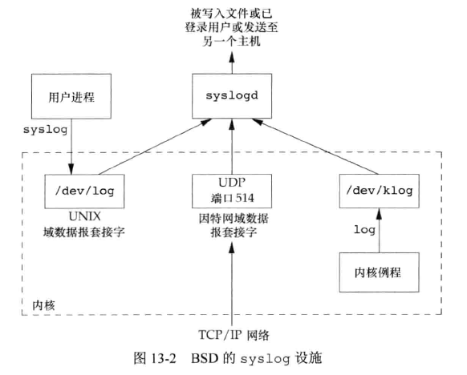
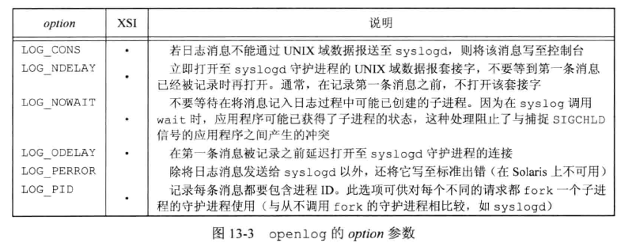
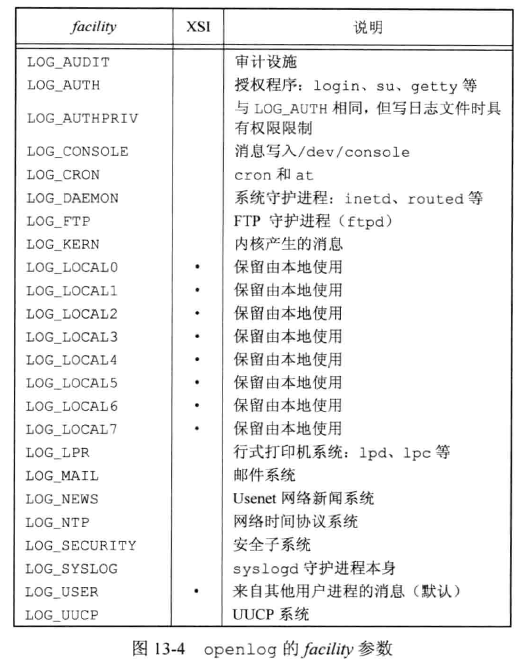
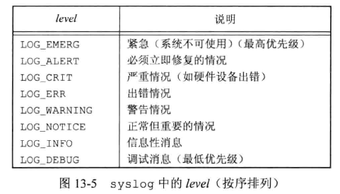

## 引言

守护进程(daemon)是生存期长的一种进程。常常在系统引导装入时启动，系统关闭时才终止。它们没有控制终端是在后台运行的，UNIX 由很多守护进程，它们执行日常事务活动。  


## 守护进程的特征

进程组、控制终端、会话。  

执行 `ps -ajx` 命令，-a 显示其它用户所拥有的进程状态，-x 显示没有控制终端的进程状态， -j 显示与作业有关的信息：会话ID、进程组ID、控制终端、终端进程组ID。  

在 freebsd 中执行：

```bash
root@freebsd15:~ # ps -axj
USER   PID PPID PGID  SID JOBC STAT TT      TIME COMMAND
root     0    0    0    0    0 DLs   -   0:01.41 [kernel]
root     1    0    1    1    0 ILs   -   0:00.07 /sbin/init
root     2    0    0    0    0 WL    -   0:00.50 [clock]
root     3    0    0    0    0 DL    -   0:00.00 [crypto]
root     4    0    0    0    0 DL    -   0:01.31 [cam]
root     5    0    0    0    0 DL    -   0:00.00 [busdma]
root     6    0    0    0    0 DL    -   0:00.00 [mpt_recovery0]
root     7    0    0    0    0 DL    -   0:00.11 [zfskern]
root     8    0    0    0    0 DL    -   0:00.08 [rand_harvestq]
root     9    0    0    0    0 DL    -   0:00.07 [pagedaemon]
root    10    0    0    0    0 DL    -   0:00.00 [audit]
root    11    0    0    0    0 RNL   -  38:17.51 [idle]
root    12    0    0    0    0 WL    -   0:00.21 [intr]
root    13    0    0    0    0 DL    -   0:00.02 [geom]
root    14    0    0    0    0 DL    -   0:00.11 [usb]
root    15    0    0    0    0 DL    -   0:00.00 [vmdaemon]
root    16    0    0    0    0 DL    -   0:00.01 [bufdaemon]
root    17    0    0    0    0 DL    -   0:00.00 [vnlru]
root    18    0    0    0    0 DL    -   0:00.01 [syncer]
root  1056    1 1056 1056    0 Ss    -   0:00.00 /sbin/devd
root  1326    1 1326 1326    0 SCs   -   0:00.00 /usr/sbin/syslogd -s
root  1329    1 1326 1326    0 I     -   0:00.00 syslogd: syslogd.casper (syslogd)
root  1330    1 1330 1330    0 Is    -   0:00.00 syslogd: system.net (syslogd)
root  1514    1 1514 1514    0 Ss    -   0:00.00 sshd: /usr/sbin/sshd [listener] 0 of 10-100 startups (sshd)
root  1552    1 1552 1552    0 Is    -   0:00.00 /usr/sbin/cron -s
root  1571    1 1571 1571    0 Is+  v0   0:00.00 /usr/libexec/getty Pc ttyv0
root  1609 1608 1609 1609    0 Ss    0   0:00.01 -sh (sh)
root  1613 1609 1613 1609    1 R+    0   0:00.00 ps -axj

```


父进程为 0 的各进程通常是内核进程，作为系统引导装入过程的一部分而启动。以超级用户特权运行，无控制终端，无命令行。  

ps 的输出中，内核守护进程的名字在方括号中。书中演示使用 Linux 3.2.0 版本，此版本使用一个名为 `kthreadd` 的特殊内核进程创建其它内核进程。需要在进程上下文执行工作但却不被用户层进程上下文调用的每一个内核组件，通常有自己的内核守护进程，例如：

* kswapd ：内存换页守护进程，支持虚拟内存子系统在经过一段时间后将脏页慢慢地写回磁盘来回收这些页面。
* flush：在可用内存达到设置的最小阈值时将脏页面 flush 至磁盘。定期地将脏页 flush 回磁盘以减少在系统出现故障时发生的数据丢失。多个 flush 守护进程可以同时存在，每个写回的设备都有一个 flush 守护进程。
* sync_supers：定期将文件系统元数据 flush 至磁盘。
* rpcbind ：远程过程调用。
* inetd：监听网络接口
* cron：定时任务


每个操作系统具体实现，以及各实现的不同版本中守护进程差异很大，书中上面的一些守护进程在 Rocky 9.4、ubuntu 24.04、CentOS 7.9 中都没发现或者名字已改变，例如 inetd、flush、jbd 等。


## 编程规则

编写守护进程程序时需要遵循一些基本规则，防止产生不必要的交互作用。  

1. 调用 umask 将文件模式创建屏蔽字设置为一个已知值(通常是0)。
2. 调用 fork ，使父进程 exit。
3. 调用 setsid 创建一个新会话：
   1. 称为新会话首进程
   2. 称为一个新进程组的组长进程
   3. 没有控制终端
4. 将当前工作目录更改为根目录。
5. 关闭不需要的文件描述符。
6. 某些守护进程打开 /dev/null 管理 fd 0、1、2，这样试图读标注输入、写标准输出或标准错误的库例程不会产生效果。


示例 daemonize：

```c
#include "apue.h"
#include <syslog.h>
#include <fcntl.h>
#include <sys/resource.h>

void
daemonize(const char *cmd)
{
	int					i, fd0, fd1, fd2;
	pid_t				pid;
	struct rlimit		rl;
	struct sigaction	sa;

	/*
	 * Clear file creation mask.
     * 设置文件模式创建屏蔽字
	 */
	umask(0);

	/*
	 * Get maximum number of file descriptors.
     * 获取 fd 的最大限制
	 */
	if (getrlimit(RLIMIT_NOFILE, &rl) < 0)
		err_quit("%s: can't get file limit", cmd);

	/*
	 * Become a session leader to lose controlling TTY.
     * fork 后父进程退出，子进程调用 setsid() 创建新会话，变为会话首进程
	 */
	if ((pid = fork()) < 0)
		err_quit("%s: can't fork", cmd);
	else if (pid != 0) /* parent */
		exit(0);
	setsid();

	/*
	 * Ensure future opens won't allocate controlling TTYs.
     * 设置信号动作，忽略 SIGHUP，再次 fork 后退出父进程使子进程成为孤儿进程
	 */
	sa.sa_handler = SIG_IGN;
	sigemptyset(&sa.sa_mask);
	sa.sa_flags = 0;
	if (sigaction(SIGHUP, &sa, NULL) < 0)
		err_quit("%s: can't ignore SIGHUP", cmd);
	if ((pid = fork()) < 0)
		err_quit("%s: can't fork", cmd);
	else if (pid != 0) /* parent */
		exit(0);

	/*
	 * Change the current working directory to the root so
	 * we won't prevent file systems from being unmounted.
     * 改变当前目录为根目录，避免占有路径，妨碍卸载文件系统
	 */
	if (chdir("/") < 0)
		err_quit("%s: can't change directory to /", cmd);

	/*
	 * Close all open file descriptors.
     * 关闭所有打开的 fd
	 */
	if (rl.rlim_max == RLIM_INFINITY)
		rl.rlim_max = 1024;
	for (i = 0; i < rl.rlim_max; i++)
		close(i);

	/*
	 * Attach file descriptors 0, 1, and 2 to /dev/null.
     * 将fd 0、1、2 关联到 /dev/null
	 */
	fd0 = open("/dev/null", O_RDWR);
	fd1 = dup(0);
	fd2 = dup(0);

	/*
	 * Initialize the log file.
     * 初始化日志文件
	 */
	openlog(cmd, LOG_CONS, LOG_DAEMON);
	if (fd0 != 0 || fd1 != 1 || fd2 != 2) {
		syslog(LOG_ERR, "unexpected file descriptors %d %d %d",
		  fd0, fd1, fd2);
		exit(1);
	}
}
```

上面示例用来初始化守护进程。


## 出错记录

守护进程有一个问题是如何处理出错消息，它没有控制终端无法将错误写到标准错误上。BSD 系统中 syslog 是用于错误日志记录的设施，广泛应用于 4.2BSD。System V 中则没有一个集中的守护进程记录设施。



有 3 种产生日志消息的方法：

1. 内核例程可以调用 log 函数。任何一个用户进程都可以通过打开并读取 /dev/klog 设备来读取这些消息。
2. 大多数用户进程(守护进程)调用 syslog 函数来产生日志消息。消息被发送至 UNIX 域数据报套接字 /dev/log。
3. 其它主机上进程可以通过 TCP/IP 网络发送到此主机网络套接字，一般为 UDP 514。

syslogd 守护进程读取所有 3 种格式的日志消息。此守护进程在启动时读取一个配置文件，文件名一般为 /etc/syslog.conf，该文件决定了不同种类的消息发送到何处。     

相关函数：

```c
#include <syslog.h>

void openlog(const char *ident, int option, int facility);
void syslog(int priority, const char *format, ...);
void closelog(void);
int setlogmask(int maskpri);
		// 返回：前日志记录优先级屏蔽字值
```

openlog 是可选的，如果不调用 openlog，第一次调用 syslog 时，自动调用 openlog。closelog 也是可选的。  

openlog 的参数 ：

* ident 是一个标志，被追加到每条日志消息种，一般是程序名称(如 cron、inetd)。  

* option 参数是指定各种选项的位屏蔽。



* facility 参数的目的是可以让配置文件说明，来自不同设施的消息将以不同的方式进行处理。



syslog 产生日志消息，其参数：

* priority 是 openlog 函数种 facility 和 level 的组合，level 如下
  * 
* format 参数以及其它所有参数将传送至 vsprintf 函数以便进行格式化。format 中每个出现的 %m 字符都先被代换成与 errno 值对应的出错消息字符串(strerror)。


setlogmask 函数用于设置进程的记录优先级屏蔽字。它返回调用它之前的屏蔽字。当设置了优先级屏蔽字时，除了已经设置的优先级的消息，其它消息将不被记录。  

示例：

假设一个行式打印机假脱机守护进程中包含如下调用序列：

```c
// 设置成日志标志为 lpd，打印 pid，facility 设定为行式打印机系统
openlog("lpd", LOG_PID, LOG_LPR);
// 设置日志等级为 LOG_ERR，消息字符串
syslog(LOG_ERR, "open error for %s: %m", filename);
```

如果此程序不调用 openlog，则 syslog 调用形式可能如下：

```c
syslog(LOG_ERR | LOG_LPR, "open error for %s: %m", filename);

```


除了 syslog ，很多平台还提供它的一种变体来处理可变参数列表：

```c
#include <syslog.h>
#include <stdarg.h>

void vsyslog(int priority, const char *format, va_list arg);
```

大多数 syslog 实现将消息短时间处于队列中。如果此段时间中有消息重复到达，syslog 守护进程不会写入日志记录，而是会打印输出一条类似于“上一条消息重复了 N 次”的消息。  


## 单实例守护进程

某些守护进程会实现为任意时刻只运行该守护进程的一个副本，例如 cron 定时任务守护进程，多个副本则可能造成任务重复执行，导致数据出错。  

文件和记录锁机制提供了一种方法，如果每一个守护进程创建一个有固定名字的文件，并在该文件的整体上加一把写锁，那么只允许创建一把这样的写锁。此后创建写锁的尝试都会失败，后续运行的守护进程副本就会得知已有一个在运行的副本。获得写锁的守护进程终止时，该写锁将被自动删除。  

使用示例：

```c
#include <unistd.h>
#include <stdlib.h>
#include <fcntl.h>
#include <syslog.h>
#include <string.h>
#include <errno.h>
#include <stdio.h>
#include <sys/stat.h>

#define LOCKFILE "/var/run/daemon.pid"
#define LOCKMODE (S_IRUSR|S_IWUSR|S_IRGRP|S_IROTH)

extern int lockfile(int);

int
already_running(void)
{
	int		fd;
	char	buf[16];

	fd = open(LOCKFILE, O_RDWR|O_CREAT, LOCKMODE);
	if (fd < 0) {
		syslog(LOG_ERR, "can't open %s: %s", LOCKFILE, strerror(errno));
		exit(1);
	}
    
    // 加锁函数，如果已加锁将返回失败
	if (lockfile(fd) < 0) {
		if (errno == EACCES || errno == EAGAIN) {
			close(fd);
			return(1);
		}
		syslog(LOG_ERR, "can't lock %s: %s", LOCKFILE, strerror(errno));
		exit(1);
	}
    
    // 这里表明未加锁，将文件清空，写入进程 ID 到该文件
	ftruncate(fd, 0);
	sprintf(buf, "%ld", (long)getpid());
	write(fd, buf, strlen(buf)+1);
	return(0);
}

```


## 守护进程的惯例

UNIX 系统中，守护进程遵循下列通用惯例：

* 若守护进程使用锁文件，通常存储在 `/var/run` 目录中。需要注意进程对目录的权限问题。锁文件名字通常是 `name.pid` ，name 是守护进程或服务名字。
* 若守护进程支持配置选项，通常存放在 `/etc` 目录中。
* 初始化脚本通常由初始化目录中脚本 `/etc/rc*`、`/etc/init.d/*`启动，重启则由`/etc/inittab` 中为该守护进程包括 respawn 记录项实现。
* 如果修改了配置文件，守护进程需要重读该文件，一般通过 SIGHUP 信号通知守护进程，因为守护进程不与终端关联，不会用到 SIGHUP 信号。


示例，守护进程读取配置文件：

```c
#include "apue.h"
#include <pthread.h>
#include <syslog.h>

sigset_t	mask;

extern int already_running(void);

void
reread(void)
{
	/* ... */
}

void *
thr_fn(void *arg)
{
	int err, signo;

	for (;;) {
		err = sigwait(&mask, &signo);
		if (err != 0) {
			syslog(LOG_ERR, "sigwait failed");
			exit(1);
		}

		switch (signo) {
		case SIGHUP:
			syslog(LOG_INFO, "Re-reading configuration file");
			reread();
			break;

		case SIGTERM:
			syslog(LOG_INFO, "got SIGTERM; exiting");
			exit(0);

		default:
			syslog(LOG_INFO, "unexpected signal %d\n", signo);
		}
	}
	return(0);
}

int
main(int argc, char *argv[])
{
	int					err;
	pthread_t			tid;
	char				*cmd;
	struct sigaction	sa;

	if ((cmd = strrchr(argv[0], '/')) == NULL)
		cmd = argv[0];
	else
		cmd++;

	/*
	 * Become a daemon.
	 * 通过上面参数获取自身的名字
	 * 然后传递给 daemonize 函数
	 * 变成一个守护进程
	 */
	daemonize(cmd);

	/*
	 * Make sure only one copy of the daemon is running.
	 */
	if (already_running()) {
		syslog(LOG_ERR, "daemon already running");
		exit(1);
	}

	/*
	 * Restore SIGHUP default and block all signals.
	 */
	sa.sa_handler = SIG_DFL;
	sigemptyset(&sa.sa_mask);
	sa.sa_flags = 0;
	if (sigaction(SIGHUP, &sa, NULL) < 0)
		err_quit("%s: can't restore SIGHUP default");
	sigfillset(&mask);
	if ((err = pthread_sigmask(SIG_BLOCK, &mask, NULL)) != 0)
		err_exit(err, "SIG_BLOCK error");

	/*
	 * Create a thread to handle SIGHUP and SIGTERM.
	 */
	err = pthread_create(&tid, NULL, thr_fn, 0);
	if (err != 0)
		err_exit(err, "can't create thread");

	/*
	 * Proceed with the rest of the daemon.
	 */
	/* ... */
	exit(0);
}

```


示例，单线程守护进程捕捉 SIGHUP 信号并重读配置，在初始化后为 SIGHUP 、SIGTERM 信号配置信号处理程序：

```c
#include "apue.h"
#include <syslog.h>
#include <errno.h>

extern int lockfile(int);
extern int already_running(void);

void
reread(void)
{
	/* ... */
}

void
sigterm(int signo)
{
	syslog(LOG_INFO, "got SIGTERM; exiting");
	exit(0);
}

void
sighup(int signo)
{
	syslog(LOG_INFO, "Re-reading configuration file");
	reread();
}

int
main(int argc, char *argv[])
{
	char				*cmd;
	struct sigaction	sa;

	if ((cmd = strrchr(argv[0], '/')) == NULL)
		cmd = argv[0];
	else
		cmd++;

	/*
	 * Become a daemon.
	 */
	daemonize(cmd);

	/*
	 * Make sure only one copy of the daemon is running.
	 */
	if (already_running()) {
		syslog(LOG_ERR, "daemon already running");
		exit(1);
	}

	/*
	 * Handle signals of interest.
	 */
	sa.sa_handler = sigterm;
	sigemptyset(&sa.sa_mask);
	sigaddset(&sa.sa_mask, SIGHUP);
	sa.sa_flags = 0;
	if (sigaction(SIGTERM, &sa, NULL) < 0) {
		syslog(LOG_ERR, "can't catch SIGTERM: %s", strerror(errno));
		exit(1);
	}
	sa.sa_handler = sighup;
	sigemptyset(&sa.sa_mask);
	sigaddset(&sa.sa_mask, SIGTERM);
	sa.sa_flags = 0;
	if (sigaction(SIGHUP, &sa, NULL) < 0) {
		syslog(LOG_ERR, "can't catch SIGHUP: %s", strerror(errno));
		exit(1);
	}

	/*
	 * Proceed with the rest of the daemon.
	 */
	/* ... */
	exit(0);
}

```


## 客户进程-服务器进程模型

守护进程通常用作服务器进程。例如前面的 syslogd 进程为服务器进程，用户进程通过 UNIX 域数据报套接字向其发送消息。      

很多场景中客户端-服务器之间来回传送消息，服务器进程中调用 fork 然后 exec 另外一个程序来处理客户端的请求很常见。这些服务器进程通常管理着很多文件描述符：通信端点、配置文件、日志文件等。fork 之后子进程中这些 fd 也处于打开状态，大多数时间并无大碍，但最坏的情况下可能导致安全问题，被 exec 执行的程序有恶意行为，从而修改数据或欺骗客户端。  

解决此问题的一个方法是对所有被执行程序不需要的文件描述符设置执行时关闭(close-on-exec)。  

示例：

```c
#include "apue.h"
#include <fcntl.h>

int set_cloexec(int fd){
    int val;
    
    if((val = fcntl(fd, F_GETFD, 0)) < 0)
        return(-1);
    
    val |= FD_CLOEXEC;	/* 设置执行时关闭 */
    
    return(fcntl(fd, F_SETFD, val));
}
```

