## 引言

主要关于：非阻塞I/O、记录锁、I/O 多路转接(select 和 poll 函数)、异步 I/O、readv 和 writev 函数、存储映射 I/O(mmap) 等。


## 非阻塞 I/O

低速系统调用是可能会使进程永远阻塞的一类系统调用：

* 如果某些文件类型的数据并不存在，例如管道、终端设备和网络设备，读操作可能会使调用者永远阻塞。
* 如果数据不能被相同的文件类型立即接收，例如管道中无空间、网络流控制，写操作可能会使调用者永远阻塞。
* 在某种条件发生之前打开某些文件类型可能会发生阻塞。例如：要打开一个终端设备，需要先等待与之连接的调制解调器应答；或者以只读模式打开 FIFO，那么在没有其他进程已用读模式打开该 FIFO 时也要等待。
* 对已经加上强制性记录锁的文件进行读写。
* 某些 ioctl 操作。
* 某些进程间通信函数。


非阻塞 I/O 使我们可以发出 open、read、write 这样的 I/O 操作，并使这些操作不会永远阻塞。如果这种操作不能完成，则调用立即出错返回，表示该操作如继续执行将阻塞。  

对于一个给定的描述符，有两种方法为其指定非阻塞 I/O：

* 如果调用 open 获得描述符，则可指定 O_NONBLOCK 标志。
* 对于已经打开的一个描述符，则可调用 fcntl，由该函数打开 O_NONBLOCK 文件状态标志。


示例：  

非阻塞 I/O 实例，从标准输入读取 500 000 字节，并试图将它们写道标准输出上。先将标准输出设置为非阻塞的，然后 for 循环输出，每次 write 调用打印在标准错误上。

```c
#include "apue.h"
#include <errno.h>
#include <fcntl.h>

char buf[500000];

int main(void){
    int ntowrite, nwrite;
    char *ptr;
    
    ntowrite = read(STDIN_FILENO, buf, sizeof(buf));
    fprintf(stderr, "read %d bytes\n", ntowrite);

    ptr = buf;
    while(ntowrite > 0){
        errno = 0;
        nwrite = write(STDOUT_FILENO, ptr, ntowrite);
        fprintf(stderr, "nwrite = %d, errno = %d\n", nwrite, errno);

        if(nwrite > 0){
            ptr += nwrite;
            ntowrite -= nwrite;
        }

    }

    clr_fl(STDOUT_FILENO, O_NONBLOCK);

    exit(0);
}

```

执行：

```bash
$ ../gcc_a 14.1.c 
## 对普通文件执行
$ ls -l /etc/services 
-rw-r--r-- 1 root root 12813 Mar 28  2021 /etc/services
$ ./14.1 < /etc/services > temp.file
read 12813 bytes
nwrite = 12813, errno = 0
$ ls -l temp.file 
-rw-rw-r-- 1 xmy xmy 12813 Feb  6 15:00 temp.file

```

书中示例了 write 返回出错，这里没有复现。大致是程序轮询发起 write 调用，大部分都返回错误，浪费了很多CPU的时间。后续介绍的 I/O 多路转接可以有效解决此问题。


## 记录锁

记录锁(record locking)的功能是：当地一个进程正在读或者修改文件的某个部分时，使用记录锁可以阻止其他进程修改同一文件区。UNIX 中没有“记录”的概念，更合适的术语是**字节范围锁(byte-range locking)**，因为它锁定的只是文件中的一个区域(也可能是整个文件)。  

### 历史

早期 UNIX 系统不支持对部分文件加锁，因此不能运行数据库系统。  

早期的伯克利版本只支持 f1ock 函数。该函数只能对整个文件加锁，不能对文件中的一部分加锁。  

SVR3 通过 fcntl 函数增加了记录锁功能。在此基础上构造了 1ockf 函数，它提供了一个简化的接口。这些函数允许调用者对一个文件中任意字节数的区域加锁，长至整个文件，短至文件中的一个字节。  

POSIX.1 标准的基础是 fcntl 方法。各种系统提供的不同形式的记录锁：

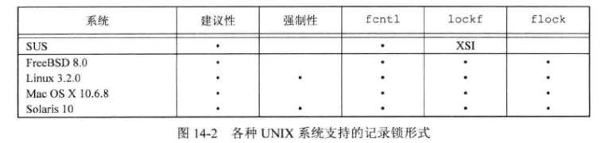


### fcntl 记录锁

使用 fcntl 函数，第一个参数是 fd，第二个参数 cmd 的值是 F_GETLK、F_SETLK、F_SETLKW 其中一个，第三个参数传递一个指向 flock 结构体的指针。  

fclock 结构体：

```c
struct flock {
    short l_type;
    short l_whence;
    off_t l_start;
    off_t l_len;
    pid_t l_pid;
};
```

* 所希望的锁类型：F_RDLCK(共享读锁)、F_WRLCK(独占性写锁)、F_UNLCK(解锁一个区域)。
* 要加锁或解锁区域的起始字节偏移量：l_start 和 l_whence。
* 区域的字节长度：l_len。
* 进程的 ID (l_pid) 持有的锁能阻塞当前进程，仅能由 F_GETLK。


加锁或解锁区域的说明还需要注意：

* 指定区域起始偏移量的两个元素与 lseek 函数中最后两个参数类似。l_whence 可选的值是 SEEK_SET、SEEK_CUR、SEEK_END。
* 锁可以在当前文件尾端处开始或者越过尾端处开始，但是不能在文件起始位置之前开始。
* 如果 l_len 为 0，则表示锁的范围可以扩展到最大可能偏移量。意味着不管向该文件中追加写了多少数据，它们都可以处于锁的范围内，起始位置可以是文件中的任意一个位置。
* 为了对整个文件加锁，可以设置 l_start 和 l_whence 指向文件的起始位置(有多种方法，但通常是将 l_start 指定为 0，l_whence 指定为 SEEK_SET)，并且指定长度(l_len)为 0。

两种类型的锁：共享读锁(l_type 为 L_RDLCK)和独占性写锁(L_WRLCK)。一般而言，读锁是共享的可以有多个进程持有，写锁只能有一个进程独占。  

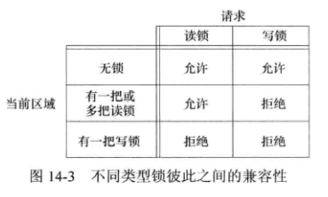


fcntl 的命令参数：

* F_GETLK：判断由 flockptr 所描述的锁是否会被另一把锁所排斥(阻塞)。如果存在一把锁，则将 flockptr 指向该锁的信息。
* F_SETLK：设置由 flockptr 所描述的锁。
* F_SETLKW：W 是 wait 的缩写，表示等待，是 F_SETLK 的阻塞版本。

F_GETLK 是为了测试能否建立一把锁，然后用 F_SETLK 或 F_SETLKW 企图建立该锁。但这并不是一个原子操作，中间可能有其它进程插入并建立相同的锁。  

在设置或释放文件上的一把锁时，系统按照要求组合或者分裂相邻区。例如，第 100~199 字节的区域加锁，现在解锁 第 150 字节区域，内核将维持两把锁，分别是100~149 和 151~199 字节。  


如果后续又对第 150 字节区域加锁，系统会将3个相邻区域合并成一个区。  


#### 示例：请求和释放一把锁

加锁或解锁一个文件区域的函数：

```c
#include "apue.h"
#include <fcntl.h>

int lock_reg(int fd, int cmd, int type, off_t offset, int whence, off_t len)
{
    struct flock lock;

    lock.l_type = type; /* F_RDLCK, F_WRLCK, F_UNLCK */
    lock.l_start = offset; /* byte offset, relative to l_whence */
    lock.l_whence = whence; /* SEEK_SET, SEEK_CUR, SEEK_END */
    lock.l_len = len; /* #bytes (0 means to EOF) */

    return(fcntl(fd, cmd, &lock));
}
```

5个常用宏：

```c
// 读锁
#define read_lock(fd,offset,whence,len) \
            lock_reg((fd), F_SETLK, F_RDLCK, (offset), (whence), (len))

// 读等待锁
#define readw_lock(fd,offset,whence,len) \
            lock_reg((fd), F_SETLKW, F_RDLCK, (offset), (whence), (len))

// 写锁
#define write_lock(fd,offset,whence,len) \
            lock_reg((fd), F_SETLK, F_WRLCK, (offset), (whence), (len))

// 写阻塞锁
#define writew_lock(fd,offset,whence,len) \
            lock_reg((fd), F_SETLKW, F_WRLCK, (offset), (whence), (len))

// 解锁
#define un_lock(fd,offset,whence,len) \
            lock_reg((fd), F_SETLK, F_UNLCK, (offset), (whence), (len))

```


#### 示例：测试一把锁


```c
#include "apue.h"
#include <fcntl.h>

pid_t lock_test(int fd, int type, off_t offset, int whence, off_t len)
{
    struct flock lock;

    lock.l_type = type; /* F_RDLCK, F_WRLCK, F_UNLCK */
    lock.l_start = offset; /* byte offset, relative to l_whence */
    lock.l_whence = whence; /* SEEK_SET, SEEK_CUR, SEEK_END */
    lock.l_len = len; /* #bytes (0 means to EOF) */

    if(fcntl(fd, F_GETLK, &lock) < 0)
        err_sys("fcntl error");

    if(lock.l_type == F_UNLCK)
        return(0);

    return(lock.l_pid);
}

```

可以用下面宏获取持有锁的 ID：

```c
// 判断是否可以对指定文件位置加锁
#define is_read_lockable(fd, offset, whence, len) \
            (lock_test((fd), F_RDLCK, (offset), (whence), (len)) == 0)
#define is_write_lockable(fd, offset, whence, len) \
            (lock_test((fd), F_WRLCK, (offset), (whence), (len)) == 0)

```


#### 示例：死锁

子进程对第0字节加锁，父进程对第1字节加锁：

```c
#include "apue.h"
#include <fcntl.h>

static void lockabyte(const char *name, int fd, off_t offset){
    if(writew_lock(fd, offset, SEEK_SET, 1) < 0)
        err_sys("%s: writew_lock error", name);
    
    printf("%s: got thre lock, byte %lld\n", name, (long long)offset);
}

void main(){
    int fd;
    pid_t pid;

    if((fd = creat("tmplock", FILE_MODE)) < 0)
        err_sys("creat error");
    if(write(fd, "ab", 2) != 2)
        err_sys("write error");

    TELL_WAIT();

    if((pid = fork()) < 0) {
        err_sys("fork error");
    } else if (pid == 0) {
        /* child */
        lockabyte("child", fd, 0);
        TELL_PARENT(getppid());
        WAIT_PARENT();
        lockabyte("child", fd, 1);
    } else {
        /* parent */
        lockabyte("parent", fd, 1);
        TELL_CHILD(pid);
        WAIT_CHILD();
        lockabyte("parent", fd, 0);

    }

    exit(0);
}
```

执行：

```bash
$ ./14.7 
parent: got thre lock, byte 1
child: got thre lock, byte 0
parent: writew_lock error: Resource deadlock avoided
child: got thre lock, byte 1
```

内核检测到死锁时，内核必须选择一个进程接收出错返回。这里选择了父进程。


### 锁的隐含继承和释放

规则：

1. 锁与进程和文件两者相关联。

   * 进程终止时，所建立的锁立即全部释放

   * 无论一个 fd 何时关闭，该进程通过此 fd 引用的文件上的任何一把锁都会释放。

   * 步骤类似如下:

     ```c
     fd1 = open(pathname, ...);
     read_lock(fd1, ...);
     fd2 = dup(fd1);
     close(fd2);
     // 此步骤之后 fd1 上设置的锁也会被全部释放
     
     // 不使用 dup，而使用 open 也是一样的效果
     fd1 = open(pathname, ...);
     read_lock(fd1, ...);
     fd2 = open(pathname, ...);
     close(fd2);
     ```

     

2. 由 fork 产生的子进程不继承父进程所设置的锁。

3. 执行 exec 后，新程序可以继承原执行程序的锁。但是如果对一个 fd 设置了执行时关闭标志，当作为 exec 的一部分关闭该 fd 时，将释放相应文件的所有锁。


### FreeBSD 实现


```c
fd1 = open(pathname, ...);
write_lock(fd1, 0, SEEK_SET, 1);
if((pid = fork()) > 0){
	fd2 = dup(fd1);
    fd3 = open(pathname, ...);
}else if(pid == 0){
    read_lock(fd1, 1, SEEK_SET, 1);
}
pause();
```

父进程和子进程暂停后的数据结构情况如下：

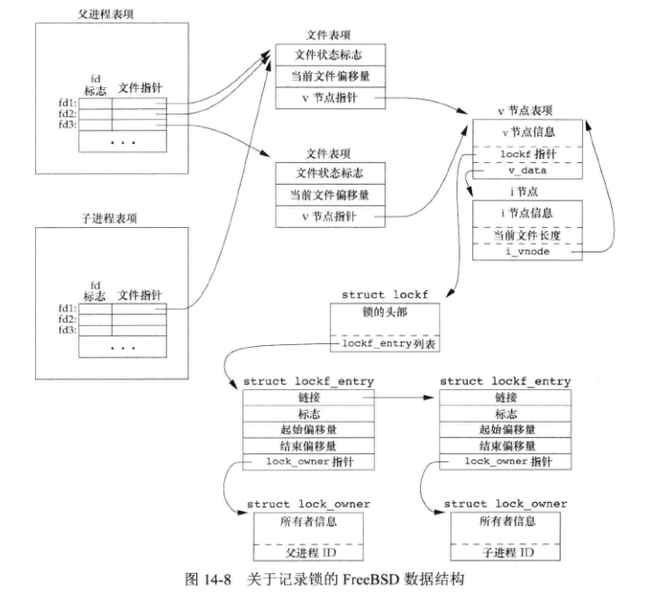

上面在文件表项和 v_node 节点的基础上，增加了 lockf 结构，他们由 inode 结构体连接起来。每个 lockf 结构体描述了一个给定进程的一个加锁区域（偏移量和长度定义的）。  

在父进程中，关闭 fd1、fd2、fd3 中任意一个，都将释放由父进程设置的写锁。关闭 fd 时，内核会从该 fd 所关联的 inode 开始，逐个检查 lockf 链表中的各项，并释放由调用进程持有的各把锁。内核并不清楚父进程是用哪个 fd 设置这把锁的。  


lockfile 函数的实现，用于在文件上加写锁：

```c
#include "apue.h"
#include <fcntl.h>

int lockfile(int fd)
{
    struct flock f1;

    f1.l_type = F_WRLCK;
    f1.l_start = 0;
    f1.l_whence = SEEK_SET;
    f1.l_len = 0;

    return(fcntl(fd, F_SETLK, &f1));
}


// 另一种方法是使用 write_lock
#define lockfile(fd) write_lock((fd), 0, SEEK_SET, 0)
```


### 在文件尾端加锁

在文件尾端加锁，大多数实现按照 l_whence 的 SEEK_CUR 或 SEEK_END 值，用 l_start 以及文件当前位置或当前长度得到绝对文件偏移量。  

考虑如下代码：

```c
// 对文件尾端加写锁，后续追加写的数据会被锁保护
writew_lock(fd, 0, SEEK_END, 0);
// 写入1个字节数据
write(fd, buf, 1);
// 解锁，文件尾端之后追加的数据将不会锁住
un_lock(fd, 0, SEEK_END);
// 再次写入1个字节数据
write(fd, buf, 1);
```

上面示例代码中文件锁状态：

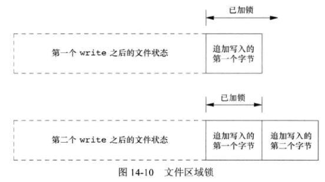


当对文件中的一部分加锁时，内核将指定的偏移量变换成绝对文件偏移量。使用 fcntl 时，除了指定绝对偏移量(SEEK_SET)之外，还可以使用当前偏移量(SEEK_CUR)或文件尾端(SEEK_END)。但当前偏移量和尾端可能会不断变化，为了使这种变化不影响现有锁的状态，内核必须独立于当前文件偏移量或文件尾端而记住锁。  

解锁时长度指定为负值时，表示指定偏移量之前的字节数。如果想对上面图中第一次 write 所写的1个字节解锁，在调用 un_lock() 应该指定长度为 -1。  


### 建议性锁和强制性锁

考虑数据库访问例程库。如果该库中所有函数都以一致的方法处理记录锁，则称使用这些函数访问数据库的进程集为**合作进程（cooperatingprocess）**。如果这些函数是唯一地用来访问数据库的函数，那么它们使用**建议性锁**是可行的。但是建议性锁并不能阻止对数据库文件有写权限的任何其他进程写这个数据库文件。不使用数据库访问例程库协同一致的方法来访问数据库的进程是非合作进程。  

**强制性锁**会让内核检查每一个 open、read 和 write 调用，验证调用进程是否违背了正在访问的文件上的某一把锁。强制性锁有时也称为**强迫方式锁（enforcement-modelocking）**。  

对一个特定文件打开其设置组 ID 位、关闭其组执行位便开启了对该文件的强制性锁机制。因为当组执行位关闭时，设置组 ID 位不再有意义，因此 SVR3 的设计者借用此组合对一个文件指定强制性锁。  

如果一个文件被强制性锁起作用，其它试图读、写的进程操作状态如下图：

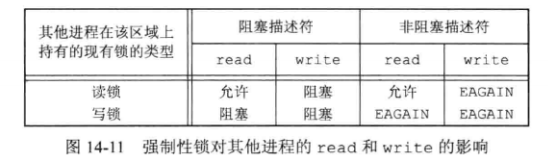

除了 read、write，还会对 open 函数产生影响。一般的 open 调用会成功，随后的 read、write 请求根据上图规则，但是指定了 O_TRUNC 或 O_CREAT 标志后，open 函数会立即出错返回，errno 设置为 EAGAIN。  

书中对 open 函数的锁冲突处理方式进行了测试，打开一个文件，指定为强制性锁，对整个文件设置一把读锁，然后休眠一段时间，休眠期间使用其它程序编辑该文件：

*  ed 编辑器对文件可以修改成功！！！
* vi 试图写回数据，会报错 EAGAIN，试图追加则会 write 阻塞。
* korn shell 的 `>`、`>>` 重写和追加符号，产生出错消息“cannot create”。
* bourne shell 的 `>` 重写会出错，`>>` 追加符号会阻塞。这里和上面 ksh 的区别主要是 ：ksh open 文件时指定了 O_CREAT 和 O_APPEND 标志，而 bsh 则不指定 O_CREAT，open 成功之后的 write 被阻塞。


一个恶意用户可以使用强制性记录锁，对大家都可读的文件加一把读锁，导致所有人无法写该文件。例如对数据库文件这样操作会导致无法再插入数据。  

示例，确定一个系统是否支持强制性锁机制：

```c

#include "apue.h"
#include <errno.h>
#include <fcntl.h>
#include <sys/wait.h>

int
main(int argc, char *argv[])
{
	int				fd;
	pid_t			pid;
	char			buf[5];
	struct stat		statbuf;

	if (argc != 2) {
		fprintf(stderr, "usage: %s filename\n", argv[0]);
		exit(1);
	}
	if ((fd = open(argv[1], O_RDWR | O_CREAT | O_TRUNC, FILE_MODE)) < 0)
		err_sys("open error");
	if (write(fd, "abcdef", 6) != 6)
		err_sys("write error");

	/* turn on set-group-ID and turn off group-execute */
	if (fstat(fd, &statbuf) < 0)
		err_sys("fstat error");
	if (fchmod(fd, (statbuf.st_mode & ~S_IXGRP) | S_ISGID) < 0)
		err_sys("fchmod error");

	TELL_WAIT();

	if ((pid = fork()) < 0) {
		err_sys("fork error");
	} else if (pid > 0) {	/* parent */
		/* write lock entire file */
		if (write_lock(fd, 0, SEEK_SET, 0) < 0)
			err_sys("write_lock error");

		TELL_CHILD(pid);

		if (waitpid(pid, NULL, 0) < 0)
			err_sys("waitpid error");
	} else {				/* child */
		WAIT_PARENT();		/* wait for parent to set lock */

		set_fl(fd, O_NONBLOCK);

		/* first let's see what error we get if region is locked */
		if (read_lock(fd, 0, SEEK_SET, 0) != -1)	/* no wait */
			err_sys("child: read_lock succeeded");
		printf("read_lock of already-locked region returns %d\n",
		  errno);

		/* now try to read the mandatory locked file */
		if (lseek(fd, 0, SEEK_SET) == -1)
			err_sys("lseek error");
		if (read(fd, buf, 2) < 0)
			err_ret("read failed (mandatory locking works)");
		else
			printf("read OK (no mandatory locking), buf = %2.2s\n",
			  buf);
	}
	exit(0);
}

```

执行，在 WSL ubuntu 24.04 中不支持：

```bash
$ ./14.12 lock
read_lock of already-locked region returns 11
read OK (no mandatory locking), buf = ab

```


## I/O 多路转接

当从一个 fd 读，从另一个 fd 写时，可以在循环中使用阻塞 I/O：

```c
while((n = read(STDIN_FILENO, buf, BUFSIZ)) > 0)
    if(write(STDOUT_FILENO, buf, n) != n)
        err_sys("write error");
```

但是如果要在两个以上的 fd 上进行读操作，使用阻塞 I/O 将会导致可能阻塞在某个 fd，而其它 fd 中的数据无法处理。  

以 telnet 命令为例：


telnet 进程有两个输入(用户终端输入和网络连接的输入)，两个输出(用户终端输出和网络连接输出)。不能对两个输入中的任一个使用阻塞 read，因为不确定哪个会得到数据。  

处理这种特殊问题的一种方法是：将一个进程 fork 成两个进程，每个进程处理一条数据通路。  

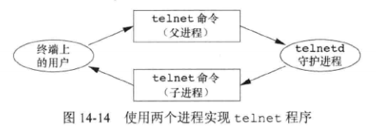

但这种方法在处理终止时，比较复杂，父进程需要通过信号一类机制同步到退出状态给子进程。同样采用单个进程中两个线程处理也会带来复杂性。     

还有一种方法是仍旧使用一个进程执行，但使用非阻塞 I/O 读取数据。对两个输入 fd 都设置为非阻塞的，对第一个 fd 发送 read，如果该输入有数据，则读取数据并处理它。如果无数据则立即返回。然后对第二个 fd 也进行同样的处理。之后以固定间隔轮询这些 fd。但这种方法的缺陷是浪费 CPU 时间，多任务系统中应当避免使用。  

还有一种称为**异步 I/O(asynchronous I/O)**。进程告诉内核：当描述符准备好可以进行 I/O 时，用一个信号通知它。这种方法有两个问题：POSIX 标准化和各系统提供的实现有差异(早期在 SUS 中异步I/O是可选的)；另一个问题是这种信号对每个进程只有一个(SIGPOLL或SIGIO)，用于 fd 时，进程接收到该信号时无法判断属于哪个 fd，仍需将两个 fd 都设置为非阻塞的，并顺序尝试执行 I/O。  

另一种比较好的技术是使用**I/O 多路转接(I/O multiplexing)**，使用这种技术，先构造一张 fd 列表，然后调用一个函数，如果列表中的某个 fd 准备好进行 I/O 时，该函数才返回。poll、pselect、select 这3个函数都支持 I/O 多路转接。  

poll 函数是 4.2 BSD 中提供的，主要用于终端 I/O 和网络 I/O。select 是从 SVR3 开始支持对 STREAMS 设备使用，SVR4增加了对任意 fd 起作用。  


### 函数 select 和 pselect

POSIX 兼容的平台上，select 函数可以执行 I/O 多路转接，传给 select 的参数：

* 关心的描述符。
* 对于描述符我们所关心的条件：读、写、异常等。
* 愿意等待的时间：永远、固定的时间、不等待。

从 select 返回时，包含：

* 已准备好的描述符总数量。
* 读、写、异常这些条件中的哪些 fd 已准备好。

使用这些返回信息，就可以对对应 fd 调用相应 I/O 函数，并且确定该函数不会阻塞。  

```c
#include <sys/select.h>

int select(int maxfdp1, fd_set *restrict readfds, fd_set *restrict writefds, fd_set *restrict exceptfds, struct timeval *restrict tvptr);
		// 返回准备就绪的描述符条目，如果超时返回0，出错返回 -1
```

参数：

* maxfdp1：最大文件描述符编号值加1。即后面三个 fd 集合中 fd 的最大值，通过指定该值，内核可以减少扫描的范围(例如只用到10位)。
* readfds：等待的读描述符集合指针。
* writefds：等待的写描述符集合指针。
* exceptfds：等待的异常条件描述符集合指针。
* tvptr：愿意等待的时间
  * NULL：永远等待，直到捕捉到一个信号
  * `tvptr->tv_sec == 0 && tvptr->tv_usec == 0` ：不等待，测试完所有描述符立即返回。
  * `tvptr->tv_sec != 0 || tvptr->tv_usec != 0` ：等待指定的秒数和微妙数。
  * 如果超时时间未到 select 返回，除了 Linux 3.2.0 会将剩余时间更新到 tvptr 指向的结构体，书中演示的其它 3 个系统则不更新。


三个指向描述符集的指针参数都是 fd_set 数据类型。这个数据类型是由具体操作系统实现选择的，它可以为每个可能的 fd 保持一位，可以将其看作一个很大的字节数组。  

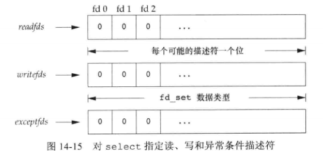

对 fd_set 数据类型可以进行处理的是：分配此类型变量，将一个变量赋值给同类型的另一个变量。或者使用下面函数，这些接口可以实现为宏或者函数：

```c
#include <sys/select.h>

int FD_ISSET(int fd, fd_set *fdset);	/* 测试描述符集中 fd 指定的位是否已打开 */
		// 若 fd 在描述符集中，返回非0值，否则返回0

void FD_CLR(int fd, fd_set *fdset);		/* 清除 fd 集中指定的一位 */
void FD_SET(int fd, fd_set *fdset);		/* 开启 fd 集中指定的一位 */
void FD_ZERO(fd_set *fdset);	/* 将fd集中所有位置零 */
```

在声明了一个描述符集之后，必须用 FD_ZERO 将这个描述符集置为0，然后在其中设置所关心的各个描述符位。示例：

```c
fd_set rset;
int fd;
FD_ZERO(&rset);
FD_SET(fd, &rset);
FD_SET(STDIN_FILENO, &rset);

/* 从 select 返回时，可以测试给定位是否仍打开 */
if(FD_ISSET(fd, &rset)){
    /* ... */
}
```

select 的中间3个参数中可以是空指针，表示对相应条件不关心。如果3个指针都是NULL，则 select 可以作为定时器。  

示例：

```c
fd_set readset, writeset;
FD_ZERO(&readset);
FD_ZERO(&writeset);
FD_SET(0, &readset);
FD_SET(3, &readset);
FD_SET(1, &writeset);
FD_SET(2, &writeset);
select(4, &readset, &writeset, NULL, NULL);
```

上面代码图示：

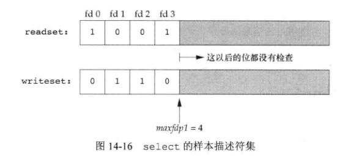

 select 有 3 个可能的返回值：

1. -1 ：出错
2. 0 ：没有 fd 准备好，并且已超过指定的时间。
3. 正值：准备好的描述符数量，3个描述符集中准备好的 fd 数之和，如果同一描述符读、写都准备好，会对其计数两次。这种情况下 3 个描述符集仍旧打开的位对应于已准备好的描述符。


POSIX.1 还定义了 select 的变体，pselect：

```c
#include <sys/select.h>

int pselect(int maxfdp1, fd_set *restrict readfds, fd_set *restrict writefds, fd_set *restrict exceptfds, const struct timespec *restrict tsptr, const sigset_t *restrict sigmask);
		// 返回准备就绪的描述符条目，如果超时返回0，出错返回 -1
```

与 select 的不同：

* 超时值使用 timespec 结构体，该结构体使用秒和纳秒，如果平台支持会更精确。
* 超时值被声明为 const，保证了 pselect 不会更改此值。
* 可以使用可选信号屏蔽字。若 sigmask 为 NULL，pselect 和 select 相同。否则，在调用 pselect 时，以原子操作方式安装 sigmask 指向的信号屏蔽字，返回时恢复以前的信号屏蔽字。


### 函数 poll

poll 函数类似于 select，但接口有所不同。

```c
#include <poll.h>

int poll(struct pollfd fdarray[], nfds_t nfds, int timeout);
		// 返回准备就绪的 fd 数，超时返回0，出错返回-1
```

poll 使用一个 pollfd 结构的数组，每个数组元素指定一个描述符编号以及对该描述符感兴趣的条件。

```c
struct pollfd {
    int fd;		/* 要检查的 fd，小于0则忽略 */
    short events;	/* 感兴趣的事件 */
    short revents;	/* 发生的事件 */
};
```

nfds 指定数组 fdarray 中的元素数量。由于历史原因，nfds 参数的类型有不同，SVR3 中是 unsigned long，SVR4 原型中是 size_t，但<poll.h>实际仍是 unsigned long。SUS 定义了新的 nfds_t 类型，允许实现选择合适的类型并隐藏实现细节，但必须大得足以保存一个整数。  

将数组中每个元素的 events 成员设置为如下值之一或几个：


poll 返回时，revents 成员由内核设置，用于说明每个 fd 发生了哪些事件。  

上图中前 4 行测试可读性，中间 3 行测试可写性，最后 3 行测试异常条件(即使 events 没有指定，发生了异常内核也会在 revents 中返回)。  

当一个 fd 被挂断(POLLHUP)后，就不能再写该 fd，但仍有可能从该 fd 读取到数据。  

poll 的最后一个参数 timeout 指定愿意等待时间：

* `-1` ：永远等待。
* `0` ：不等待。
* `>0` ：等待的毫秒数。如果有 fd 准备好会立即返回，如果到期没有 fd 准备好返回 0。

文件尾端和挂断的区别：

* 如果从终端输入数据，键入了结束符，就会打开 POLLIN，读取到 EOF 标志，返回的 revents 中的 POLLHUP 没有打开。
* 如果是挂断，则 revents 中 POLLHUP 会打开。


### select 和 poll 的可中断性

被中断的系统调用自动重启的特性是从 4.2 BSD引入，当时的 select 函数是不重启的，后续这种特性在大多数系统中沿用，即使指定了 SA_RESTART 选项也是如此。到 SVR4 上，如果指定了 SA_RESTART 标志，select、poll 也是会自动重启的。如果考虑移植性想阻止此特性，需要使用 signal_intr 函数。


## 异步I/O

select、poll 可以实现异步形式的通知。但我们在接收到通知后如何对指定的一个以上的 fd 分别执行异步 I/O ？System V 中提供的 SIGPOLL 和 BSD 中提供的 SIGIO 信号机制是受限的，不能用在所有文件类型，且只能使用一个信号。  

SUSv4 中将通用的异步 I/O 调整到基本规范部分。但在用异步 I/O 时，通过选择来领过处理多个并发操作，会使应用程序的设计复杂化。简单一些的做法可能是使用多线程，使用同步模型编写程序，让线程以异步的形式运行。  

POSIX 异步 I/O 接口带来的麻烦：

* 每个异步操作有 3 个可能出错的地方：操作提交部分、操作本身的结果、决定异步操作的函数中。
* 本身涉及大量的额外设置和处理规则。
* 从错误中恢复可能比较困难。例如多个异步写操作，其中一个失败，需要撤销所有的还是部分？


### System V 异步 I/O


System V 的异步 I/O 是 STREAMS 系统的一部分， 异步 I/O 信号是 SIGPOLL。  

对一个 STREAMS 设备启动异步 I/O，需要调用 ioctl，第二个参数(request)设置为 I_SETSIG，第三个参数是由下面一个或多个常量组成的整型值：

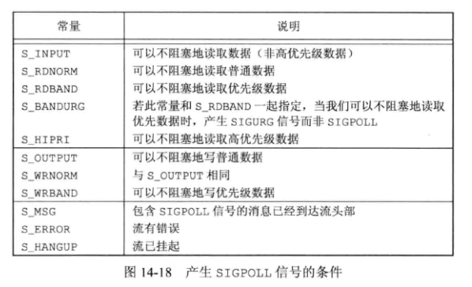

由于 SIGPOLL 默认动作是终止进程，因此在调用 ioctl 之前需要建立信号处理程序。  


### BSD 异步 I/O

BSD 派生的系统中，异步 I/O 信号是 SIGIO 和 SIGURG 的组合。SIGURG 只用来通知进程网络连接上的带外数据已经到达。  

为了接收 SIGIO 信号，需要执行步骤：

1. 调用 signal 或 sigaction 为 SIGIO 信号建立信号处理程序。
2. 以命令 F_SETOWN 调用 fcntl 设置进程 ID 或进程组 ID，用于接收对该 fd 的信号。
3. 以命令 F_SETFL 调用 fcntl 设置 O_ASYNC 文件状态标志，使该 fd 上可以进行异步 I/O，这一步只能针对终端或网络的 fd 执行。

对于 SIGURG 只需执行第 1、2 步。


### POSIX 异步 I/O

POSIX 异步 I/O 接口为不同类型的文件进行异步 I/O 提供一套一致的方法。  


#### AIO 控制块结构：aiocb

这些异步 I/O 接口使用 AIO 控制块来秒数 I/O 操作，aiocb 结构体定义了 AIO 控制块，至少包含以下字段：

```c
struct aiocb {
    int		aio_fildes;		/* 文件描述符 */
    off_t 	aio_offset;		/* 文件 I/O 偏移位，从这里开始读或写 */
    volatile	void 	*aio_buf;	/* I/O buf缓冲 */
    size_t 	aio_nbytes;		/* 传送的字节数 */
    int		aio_reqprio;	/* 优先级 */
    struct 	sigevent	aio_sigevent;	/* 信号事件结构体 */
    int 	aio_lio_opcode;		/* 操作基于列表的异步 I/O */
};
```

#### sigevent 结构

aio_sigevent 是 sigevent 结构体类型的，该字段控制 I/O 事件完成后如何通知应用程序：

```c
struct sigevent {
    int		sigev_notify;	/* 通知类型 */
    int 	sigev_signo;	/* 信号编号 */
    union sigval	sigev_value;	/* 通知参数 */
    void	(*sigev_notify_function)(union sigval);		/* 通知函数 */
    pthread_attr_t	*sigev_notify_attributes;		/* 通知属性 */
};
```

sigev_notify 字段控制通知的类型，取值是下面3个其中之一：

* SIGEV_NONE：不通知。
* SIGEV_SIGNAL：产生由 sigev_signo 字段指定的信号。如果应用捕捉该信号，且建立信号处理程序时指定了 SA_SIGINFO 标志，sigev_value 会通过 siginfo 结构的 si_value 字段被传送。
* SIGEV_THREAD：当异步 I/O 完成时，由 sigev_notify_function 字段指定的函数被调用。 sigev_value 字段被作为参数传入。该函数在单独线程中以分离状态下运行，除非指定 sigev_notify_attributes 字段指向另外的线程属性。


#### aio_read、aio_write

在调用异步 I/O 之前需要先初始化 AIO 控制块，调用 aio_read 函数来进行异步读操作，或调用 aio_write 函数来进行异步写操作。  

```c
#include <aio.h>

int aio_read(struct aiocb *aiocb);
int aio_write(struct aiocb *aiocb);
		// 成功返回0，出错返回-1
```

当这些函数返回时，异步 I/O 请求便已经被操作系统放入等待处理的队列中了。  


#### aio_fsync

要想强制所有等待中的异步操作不等待而写入持久化的存储中，可以设立一个 AIO 控制块并调用 aio_fsync 函数。

```c
#include <aio.h>

int aio_fsync(int op, struct aiocb *aiocb);
		// 成功返回0，出错返回-1
```

op 参数取值：

* O_DSYNC：对文件的写操作执行类似 fdatasync。
* O_SYNC：对文件的写操作类似 fsync。


#### aio_error

为了获取一个异步读、写或者同步操作的完成状态，需要调用 aio_error 函数：

```c
#include <aio.h>

int aio_error(const struct aiocb *aiocb);
```

返回值有几种情况：

* 0 ：异步操作完成。需要调用 aio_return 函数获取操作返回值。
* -1 ：对 aio_error 的调用失败。
* EINPROGRESS：仍在等待。
* 其它情况：其它任何返回值时相关的操作失败返回的错误码。


#### aio_return

用于获取返回值的函数：

```c
#include <aio.h>

ssize_t aio_return(struct aiocb *aiocb);
```

异步操作完成之前，需要小心不要调用此函数。操作完成之前的结果是未定义的。一旦调用了该函数，操作系统就可以释放掉包含了 I/O 操作返回值的记录。  

如果 aio_return 函数本身失败，返回 -1 并设置 errno。其它情况下返回 read、write、fsync 被成功调用时可能返回的结果。  


#### aio_suspend

当完成所有事物，等待异步操作完成时，可以调用 aio_suspend 函数来阻塞进程等待异步 I/O 操作完成：

```c
#include <aio.h>

int aio_suspend(const struct aiocb *const list[], int nent, const struct timespec *timeout);
		// 成功返回0，出错返回-1
```

返回值：

* 如果被信号中断，返回 -1，将 errno 设置为 EINTR。
* 没有任何 I/O 操作完成情况下，阻塞时间超过了 timeout，返回 -1，将 errno 设置为 EAGAIN。
* 有任何 I/O 操作完成，返回 0。

list 参数时一个指向 AIO 控制块数组的指针。  

nent 参数是数组中的条目数。  

timeout 参数是超时时间，可以设置为空表示一直等待。  


#### aio_cancel

当不想再完成等待中的异步 I/O 操作时，可以尝试使用 aio_cancel 函数取消：

```c
#include <aio.h>

int aio_cancel(int fd, struct aiocb *aiocb);
```

aiocb 如果为 NULL，将会尝试取消 fd 指向的文件上所有未完成的异步 I/O 操作。指定了 aiocb 的情况下，将会尝试取消由 AIO 控制块描述的单个异步 I/O 操作。但无法保证系统能够取消。可能返回如下值：

* AIO_ALLDONE：所有操作在尝试取消前已完成。
* AIO_CANCELED：所有要求的操作已被取消。
* AIO_NOTCANCELED：至少有一个要求的操作没有被取消。
* -1：调用失败，错误码被存储在 errno 中。


#### lio_listio

提交一系列由一个 AIO 控制块列表描述的 I/O 请求。此函数也可以以同步的方式来使用。

```c
#include <aio.h>

int lio_listio(int mode, struct aiocb *restrict const list[restrict], int nent, struct sigevent *restrict sigev);
		// 成功返回0，出错返回 -1
```

mode 参数指定 I/O 是否是异步的：

*  LIO_WAIT：lio_listio 函数将在所有由列表指定的 I/O 操作完成后返回。sigev 参数将被忽略。
* LIO_NOWAIT：lio_listio 函数将在 I/O 请求如对后立即返回。进程将在所有 I/O 操作完成后，按照 sigev 指定的，被异步地通知。如果不想通知可以将 sigev 设置为 NULL。

list 参数指向 AIO 控制块列表，该列表指定了要运行的 I/O 操作。  

nent 参数指定了数组的元素个数。  

在每一个 AIO 控制块中，aio_lio_opcode 字段指定了该操作是一个读操作(LIO_READ)、写操作(LIO_WRITE)、被忽略的空操作(LIO_NOP)。读写操作会被传递给对应的 aio_read、aio_write 函数来处理。  


#### 运行时不变量的限制值

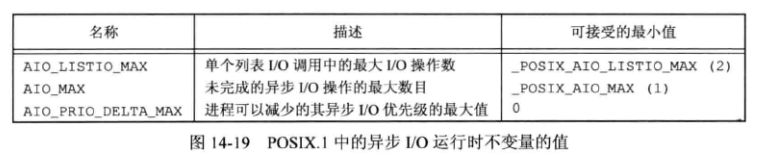

可以通过 sysconf 函数设置上面的值。


#### 示例

对比异步 I/O 和传统 I/O 接口的任务：将一个文件从一种格式翻译成另一种格式。  

20世纪80年代流行的 USENET 新闻系统中使用的 ROT-13 算法，将文本中指定的英文字符 a~z 、A~Z 循环向右偏移 13 个字母位移。   

```c
#include "apue.h"
#include <ctype.h>
#include <fcntl.h>

#define BSZ 4096

unsigned char buf[BSZ];

unsigned char
translate(unsigned char c)
{
	if (isalpha(c)) {
		if (c >= 'n')
			c -= 13;
		else if (c >= 'a')
			c += 13;
		else if (c >= 'N')
			c -= 13;
		else
			c += 13;
	}
	return(c);
}

int
main(int argc, char* argv[])
{
	int	ifd, ofd, i, n, nw;

	if (argc != 3)
		err_quit("usage: rot13 infile outfile");
	if ((ifd = open(argv[1], O_RDONLY)) < 0)
		err_sys("can't open %s", argv[1]);
	if ((ofd = open(argv[2], O_RDWR|O_CREAT|O_TRUNC, FILE_MODE)) < 0)
		err_sys("can't create %s", argv[2]);

	while ((n = read(ifd, buf, BSZ)) > 0) {
		for (i = 0; i < n; i++)
			buf[i] = translate(buf[i]);
		if ((nw = write(ofd, buf, n)) != n) {
			if (nw < 0)
				err_sys("write failed");
			else
				err_quit("short write (%d/%d)", nw, n);
		}
	}

	fsync(ofd);
	exit(0);
}

```

执行：

```c
$ ./14.20 in.txt out.txt 
$ cat in.txt 
abcdefghijklmnopqrstuvwxyz
$ cat out.txt 
nopqrstuvwxyzabcdefghijklm
```

上面程序很直接地使用 I/O ，从输入中读取到缓冲，翻译，然后再写到输出文件中，重复此步骤直到文件尾端。  

下面是异步 I/O 方式实现：

```c
#include "apue.h"
#include <ctype.h>
#include <fcntl.h>
#include <aio.h>
#include <errno.h>

#define BSZ 4096
#define NBUF 8

enum rwop {
	UNUSED = 0,
	READ_PENDING = 1,
	WRITE_PENDING = 2
};

struct buf {
	enum rwop     op;
	int           last;
	struct aiocb  aiocb;
	unsigned char data[BSZ];
};

struct buf bufs[NBUF];

unsigned char
translate(unsigned char c)
{
	/* same as before */
	if (isalpha(c)) {
		if (c >= 'n')
			c -= 13;
		else if (c >= 'a')
			c += 13;
		else if (c >= 'N')
			c -= 13;
		else
			c += 13;
	}
	return(c);
}

int
main(int argc, char* argv[])
{
	int					ifd, ofd, i, j, n, err, numop;
	struct stat			sbuf;
	const struct aiocb	*aiolist[NBUF];
	off_t				off = 0;

	if (argc != 3)
		err_quit("usage: rot13 infile outfile");
	if ((ifd = open(argv[1], O_RDONLY)) < 0)
		err_sys("can't open %s", argv[1]);
	if ((ofd = open(argv[2], O_RDWR|O_CREAT|O_TRUNC, FILE_MODE)) < 0)
		err_sys("can't create %s", argv[2]);
	if (fstat(ifd, &sbuf) < 0)
		err_sys("fstat failed");

	/* initialize the buffers */
	for (i = 0; i < NBUF; i++) {
		bufs[i].op = UNUSED;
		bufs[i].aiocb.aio_buf = bufs[i].data;
		bufs[i].aiocb.aio_sigevent.sigev_notify = SIGEV_NONE;
		aiolist[i] = NULL;
	}

	numop = 0;
	for (;;) {
		for (i = 0; i < NBUF; i++) {
			switch (bufs[i].op) {
			case UNUSED:
				/*
				 * Read from the input file if more data
				 * remains unread.
                 * 如果有数据未读，转换操作标志为读等待，赋值 AIO 结构体中 fd 和 offset
				 */
				if (off < sbuf.st_size) {
					bufs[i].op = READ_PENDING;
					bufs[i].aiocb.aio_fildes = ifd;
					bufs[i].aiocb.aio_offset = off;
					off += BSZ;
					if (off >= sbuf.st_size)
						bufs[i].last = 1;
					bufs[i].aiocb.aio_nbytes = BSZ;
					if (aio_read(&bufs[i].aiocb) < 0)   /* 调用 aio_read 读取数据 */
						err_sys("aio_read failed");
					aiolist[i] = &bufs[i].aiocb;
					numop++;    /* 操作数++，表示未处理的操作 */
				}
				break;

			case READ_PENDING:
				if ((err = aio_error(&bufs[i].aiocb)) == EINPROGRESS)   /* 仍在等待，继续循环 */
					continue;
				if (err != 0) {     /* 非0 也非 EINPROGRESS，说明有出错 */
					if (err == -1)
						err_sys("aio_error failed");
					else
						err_exit(err, "read failed");
				}

				/*
				 * A read is complete; translate the buffer
				 * and write it.
                 * 经过上面判断，到这里表明已经 read 完成, 调用 aio_return 获取返回值，翻译 buffer 中数据调用 aio_write 进行写入
				 */
				if ((n = aio_return(&bufs[i].aiocb)) < 0)
					err_sys("aio_return failed");
				if (n != BSZ && !bufs[i].last)
					err_quit("short read (%d/%d)", n, BSZ);
				for (j = 0; j < n; j++)
					bufs[i].data[j] = translate(bufs[i].data[j]);
				bufs[i].op = WRITE_PENDING;
				bufs[i].aiocb.aio_fildes = ofd;
				bufs[i].aiocb.aio_nbytes = n;
				if (aio_write(&bufs[i].aiocb) < 0)
					err_sys("aio_write failed");
				/* retain our spot in aiolist */
				break;

			case WRITE_PENDING:
                /* 类似上面异步读 I/O 判断 */
				if ((err = aio_error(&bufs[i].aiocb)) == EINPROGRESS)
					continue;
				if (err != 0) {
					if (err == -1)
						err_sys("aio_error failed");
					else
						err_exit(err, "write failed");
				}

				/*
				 * A write is complete; mark the buffer as unused.
				 */
				if ((n = aio_return(&bufs[i].aiocb)) < 0)
					err_sys("aio_return failed");
				if (n != bufs[i].aiocb.aio_nbytes)
					err_quit("short write (%d/%d)", n, BSZ);
				aiolist[i] = NULL;
				bufs[i].op = UNUSED;
				numop--;
				break;
			}
		}
        /* 如果还有未完成的异步 I/O，使用 aio_suspend 阻塞住等待完成 */
		if (numop == 0) {
			if (off >= sbuf.st_size)
				break;
		} else {
			if (aio_suspend(aiolist, NBUF, NULL) < 0)
				err_sys("aio_suspend failed");
		}
	}

    /* 刷新数据到磁盘 */
	bufs[0].aiocb.aio_fildes = ofd;
	if (aio_fsync(O_SYNC, &bufs[0].aiocb) < 0)
		err_sys("aio_fsync failed");
	exit(0);
}

```

使用了 8  个缓冲区，可以有最多 8 个异步 I/O 请求处于等待状态。  

当 aio_error 返回的既非 EINPROGRESS 亦非 -1 时，表明操作完成。如果返回 0 以外的任何值表明操作失败了。检查过这些情况后，就可以安全的调用 aio_return 来获取 I/O 操作的返回值了。 

只要有未处理的，就提交异步 I/O 操作。有未使用的 AIO 控制块，可以提交一个异步读操作，读操作完成后，翻译缓冲区内容并提交一个异步写操作，当所有 AIO 控制块都在使用时调用 aio_suspend 等待操作完成。   


## 函数 readv 和 writev

readv 和 writev 函数用于在一次函数调用中读、写多个非连续缓冲区。也称为**散布读(scatter read)**和**聚集写(gather write)**。  

```c
#include <sys/uio.h>

ssize_t readv(int fd, const struct iovec *iov, int iovcnt);
ssize_t writev(int fd, const struct iovec *iov, int iovcnt);
		// 返回已读或已写的字节数，出错返回-1
```

第二个参数 iov 指针指向一个 iovec 类型结构体的数组。

```c
struct iovec {
    void *iov_base;		/* 首地址 */
    size_t iov_len;		/* 缓冲长度 */
};
```

iovcnt 指定了 iov 数组中的元素数量，最大值受限于 IOV_MAX。  

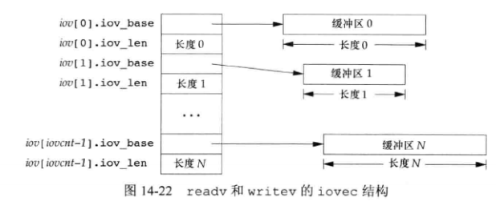

writev 从缓冲区中聚集输出数据，顺序是：`iov[0]、iov[1] ... iov[iovcnt-1]`。writev 返回输出的字节总数，通常等于所有缓冲区长度之和。  

readv 函数将读入的数据按照顺序散布到缓冲区中。readv 总是先填满一个缓冲区，再填写下一个。readv 返回读到的字节总数，如果遇到文件尾端，已无数据可读，则返回0。  


## 函数 readn 和 writen

管道、FIFO、某些设备(终端和网络设备)有下列特性：

1. 一次 read 操作所返回的数据可能少于所要求的数据，即使还没达到文件尾端也可能是这样。
2. 一次 write 操作的返回值也可能少于指定输出的字节数。例如可能是内核缓冲区满了。


书中给出两个函数，读写 N 字节数据，并处理返回值小于要求值的情况：

```c
#include "apue.h"

ssize_t readn(int fd, void *buf, size_t nbytes);
ssize_t writen(int fd, void *buf, size_t nbytes);
		// 返回读写的字节数，出错返回-1
```

具体实现：

```c
#include "apue.h"

ssize_t             /* Read "n" bytes from a descriptor  */
readn(int fd, void *ptr, size_t n)
{
	size_t		nleft;
	ssize_t		nread;

	nleft = n;
	while (nleft > 0) {
		if ((nread = read(fd, ptr, nleft)) < 0) {
			if (nleft == n)
				return(-1); /* error, return -1 */
			else
				break;      /* error, return amount read so far */
		} else if (nread == 0) {
			break;          /* EOF */
		}
		nleft -= nread;
		ptr   += nread;
	}
	return(n - nleft);      /* return >= 0 */
}


ssize_t             /* Write "n" bytes to a descriptor  */
writen(int fd, const void *ptr, size_t n)
{
	size_t		nleft;
	ssize_t		nwritten;

	nleft = n;
	while (nleft > 0) {
		if ((nwritten = write(fd, ptr, nleft)) < 0) {
			if (nleft == n)
				return(-1); /* error, return -1 */
			else
				break;      /* error, return amount written so far */
		} else if (nwritten == 0) {
			break;
		}
		nleft -= nwritten;
		ptr   += nwritten;
	}
	return(n - nleft);      /* return >= 0 */
}

```

若读写一些数据之后出错，则两个函数返回的是已传输的数据量，而非错误。在读数据到达文件尾端，但尚未满足要求读的量，会返回 readn 已复制到缓冲区的字节数。


## 存储映射 I/O

存储映射 I/O (memory-mapped I/O)能将一个磁盘文件映射到存储空间中的一个缓冲区上。当从缓冲区中取数据时，相当于读文件中相应的字节，写入数据到缓冲区就相当于写入相应字节到文件。这样可以在不适用 read、write 的情况下执行 I/O。  

使用这种功能，需要先执行 mmap 告诉内核将给定文件映射到一个存储区域：

```c
#include <sys/mman.h>

void *mmap(void *addr, size_t len, int prot, int flag, int fd, off_t off);
		// 成功返回映射区的起始地址，出错返回 MAP_FAILED
```

参数：

* addr ：起始地址。通常设置为 0，表示由系统选择映射区起始地址。

* len ：映射的字节数。

* off：要映射的字节起始偏移量。

* fd ：要映射的文件 fd。

* prot ：映射存储区的保护要求

  * | prot 值    | 说明           |
    | ---------- | -------------- |
    | PROT_READ  | 映射区可读     |
    | PROT_WRITE | 映射区可写     |
    | PROT_EXEC  | 映射区可执行   |
    | PROT_NONE  | 映射区不可访问 |

  * 保护要求不能超过文件 open 模式访问权限，例如只读打开就不能指定 PROT_WRITE。

  * 可以按位或组合多个值。

* flag ：影响映射存储区的多种属性。

  * 存储区映射示例：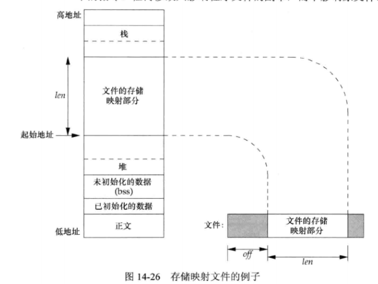
  * MAP_FIXED：返回值必须等于 addr。
  * MAP_SHARED：此标志指示进程对映射区的修改都 write 到文件中。
  * MAP_PRIVATE：此标志表示对映射区的存储操作生成一个映射文件的私有副本，所有后来的引用都引用该副本，主要用于调试程序。
  * 每种实现可能还有另外的 MAP_XXX 标志，取决于具体操作系统的实现，可以用 mmap(2) 手册查看。


调用 mprotect 可以更改现有映射的权限：

```c
#include <sys/mman.h>

int mprotect(void *addr, size_t len, int prot);
		// 成功返回0，出错返回-1
```

* prot 参数的合法值和 mmap 函数的一样。


如果共享映射中的页已修改，可以调用 msync 将该页 flush 到被映射的文件中：

```c
#include <sys/mman.h>

int msync(void *addr, size_t len, int flags);
		// 成功返回0，出错返回-1
```

* flags 参数控制 flush 存储区。一定要指定 MS_SYNC 或 MS_SYNC 其中之一。
  * MS_ASYNC：简单地调试要写地页。
  * MS_SYNC：返回之前等待写操作完成。
  * MS_INVALIDATE：丢弃没有同步的页。


进程终止时会自动解除存储区映射，也可以调用 munmap 函数解除映射区，但关闭映射是使用的 fd 并不解除映射区：

```c
#include <sys/mman.h>

int munmap(void *addr, size_t len);
		// 成功返回0，出错返回-1
```

munmap 并不影响被映射的对象，不会写回内容到磁盘文件。


示例，存储映射 I/O 复制文件，类似 cp 命令：

```c
#include "apue.h"
#include <fcntl.h>
#include <sys/mman.h>

#define COPYINCR (1024*1024*1024)	/* 1 GB */

int
main(int argc, char *argv[])
{
	int			fdin, fdout;
	void		*src, *dst;
	size_t		copysz;
	struct stat	sbuf;
	off_t		fsz = 0;

	if (argc != 3)
		err_quit("usage: %s <fromfile> <tofile>", argv[0]);

	if ((fdin = open(argv[1], O_RDONLY)) < 0)
		err_sys("can't open %s for reading", argv[1]);

	if ((fdout = open(argv[2], O_RDWR | O_CREAT | O_TRUNC,
	  FILE_MODE)) < 0)
		err_sys("can't creat %s for writing", argv[2]);

	if (fstat(fdin, &sbuf) < 0)			/* need size of input file */
		err_sys("fstat error");

	if (ftruncate(fdout, sbuf.st_size) < 0)	/* set output file size */
		err_sys("ftruncate error");

	while (fsz < sbuf.st_size) {
		if ((sbuf.st_size - fsz) > COPYINCR)
			copysz = COPYINCR;
		else
			copysz = sbuf.st_size - fsz;

		if ((src = mmap(0, copysz, PROT_READ, MAP_SHARED,
		  fdin, fsz)) == MAP_FAILED)
			err_sys("mmap error for input");
		if ((dst = mmap(0, copysz, PROT_READ | PROT_WRITE,
		  MAP_SHARED, fdout, fsz)) == MAP_FAILED)
			err_sys("mmap error for output");

		memcpy(dst, src, copysz);	/* does the file copy */
		munmap(src, copysz);
		munmap(dst, copysz);
		fsz += copysz;
	}
	exit(0);
}

```

