## 引言

常见 IPC：

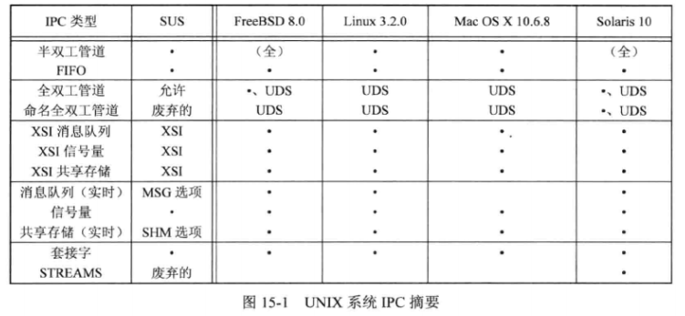

前 10 种 IPC 类型通常仅限于同一台主机的两个进程之间的 IPC。最后两种支持不同主机上两个进程之间 IPC 通信。  


## 管道

管道是 UNIX 系统最古老的 IPC 形式。有一些局限性：

* 历史上是曾半双工的(数据只能在一个方向上流动)，为了可移植性，有些仍是半双工的。
* 只能在具有公共祖先的两个进程之间使用。通常一个进程创建管道，调用 fork 之后，父子进程就可以共享此管道。

尽管有上述限制，半双工管道仍是最常用的 IPC 形式。当在管道中键入一个命令序列，让 shell 执行时，shell 都会为每条命令单独创建一个进程，然后用管道将前一条命令的标准输出和后一条命令的标准输入相连接。  

调用 pipe 函数创建管道：

```c
#include <unistd.h>

int pipe(int fd[2]);
		// 成功返回0，出错返回-1
```

参数 fd 数组返回两个文件描述符：fd[0] 读打开，fd[1]写打开。fd[1]的输出是 fd[0] 的输入。  

半双工管道图示：

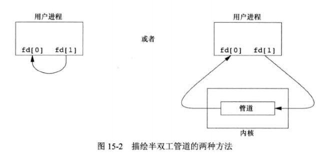

单个进程中管道几乎没有用处。通常进程会先调用 pipe，然后调用 fork，从而创建父子进程的 IPC 通道：

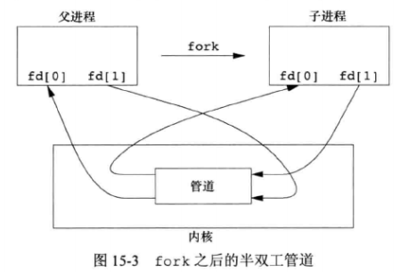

fork 之后的动作取决于父子进程数据流方向。

* 从父进程到子进程的管道，父进程关闭管道的读端(fd[0])，子进程关闭管道写端(fd[1])。
  * 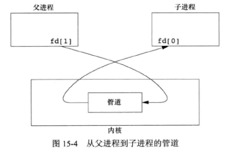
* 从子进程到父进程的管道，父进程关闭管道的写端(fd[1])，子进程关闭管道读端(fd[0])。

当管道的一端被关闭后，下列规则起作用：

1. 当读(read)一个写端已被关闭的管道时，所有数据都被读取后， read 返回 0，表示文件结束。
2. 如果写(write)一个读端已被关闭的管道，则产生信号 SIGPIPE。如果忽略该信号或捕捉该信号并从处理程序返回，write 返回-1，errno 设置为 EPIPE。

在写管道(或 FIFO)时，常量 PIPE_BUF 规定了内核的管道缓冲区大小。如果对管道调用 write，而且要求写的字节数小于等于 PIPE_BUF，则此操作不会与其它进程对同一管道(或 FIFO)的 write 操作交叉进行。但是如果多个进程同时写一个管道(或 FIFO)，且要求写的字节超过 PIPE_BUF，那么缩写的数据可能会与其它进程所写的数据相互交叉。pathconf 或 fpathconf 函数可以确定 PIPE_BUF 的值。  


### 管道示例：父进程向子进程传送数据

```c
#include "apue.h"

int main(void){
    int n;
    int fd[2];
    pid_t pid;
    char line[MAXLINE];

    if(pipe(fd) < 0)
        err_sys("pipe error");
    if((pid = fork()) < 0){
        err_sys("fork error");
    } else if (pid > 0) {
        close(fd[0]);
        write(fd[1], "hello world\n", 12);
    } else {
        close(fd[1]);
        n = read(fd[0], line, MAXLINE);
        write(STDOUT_FILENO, line, n);
    }

    exit(0);
}
```

执行：

```bash
$ ./15.5 
hello world
```


### 管道示例：文件复制到分页程序

每次一页地显示已产生的输出。构建一个管道，fork 一个子程序，将子进程的标准输入设置为管道的读端，将产生的输出通过管道发送到分页程序（这里使用 more 程序）。

```c
#include "apue.h"
#include <sys/wait.h>

#define DEF_PAGER "/bin/more"

int main(int argc, char *argv[]){
    int n;
    int fd[2];
    pid_t pid;
    char *pager, *argv0;
    char line[MAXLINE];
    FILE *fp;


    if(argc != 2)
        err_quit("usage: a.out <pathname>");

    if((fp = fopen(argv[1], "r")) == NULL)  /* 只读打开参数1 文件 */
        err_sys("can't open %s", argv[1]);
    if(pipe(fd) < 0)    /* 创建管道 */
        err_sys("pipe error");

    if((pid = fork()) < 0 ) {
        err_sys("fork error");
    } else if (pid > 0){
        close(fd[0]);   /* 父进程关闭读端 */

        // 从 fp 读取数据，写入到管道的写端
        while(fgets(line, MAXLINE, fp) != NULL){
            n = strlen(line);
            if(write(fd[1], line, n) != n)
                err_sys("write error to pipe");
        }

        if(ferror(fp))
            err_sys("fgets error");

        close(fd[1]);

        if(waitpid(pid, NULL, 0) < 0)
            err_sys("waitpid error");

        exit(0);

    } else {
        close(fd[1]);   /* 子进程关闭写端 */
        // 子进程将标准输入设置为管道读端
        if(fd[0] != STDIN_FILENO){
            if(dup2(fd[0], STDIN_FILENO) != STDIN_FILENO)
                err_sys("dup2 error to stdin");
            close(fd[0]);
        }

        // 获取及执行分页程序
        if((pager = getenv("PAGER")) == NULL)
            pager = DEF_PAGER;
        if((argv0 = strrchr(pager, '/')) != NULL)
            argv0++;
        else
            argv0 = pager;
            
        if(execl(pager, argv0, (char *)0) < 0)
            err_sys("execl error for %s", pager);
        
    }
    exit(0);
}
```


### 管道示例：父进程和子进程同步

通过管道方式替代之前信号实现的函数：TELL_WAIT、TELL_PARENT、TELL_CHILD、WAIT_PARENT、WAIT_CHILD。  

```c
#include "apue.h"

static int pfd1[2], pfd2[2];

void TELL_WAIT(void){
    if(pipe(pfd1) < 0 || pipe(pfd2) < 0)
        err_sys("pipe error");
}

void TELL_PARENT(pid_t pid){
    if(write(pfd2[1], "c", 1) != 1)
        err_sys("write error");
}

void WAIT_PARENT(void){
    char c;

    if(read(pfd1[0], &c, 1) != 1)
        err_sys("read error");

    if(c != 'p')
        err_quit("WAIT_PARENT: incorrect data");

}


void TELL_CHILD(pid_t pid){
    if(write(pfd1[1], "p", 1) != 1)
        err_sys("write error");
}

void WAIT_CHILD(void){
    char c;

    if(read(pfd2[0], &c, 1) != 1)
        err_sys("read error");

    if(c != 'c')
        err_quit("WAIT_CHILD: incorrect data");
}
```

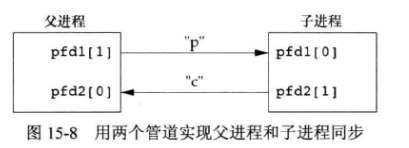

如上图所示，程序在 fork 之前创建了两个管道。父子进程分别通过管道发送一个字符，对应的 WAIT_XXX 函数调用 read 读取字符，没有读取到则阻塞。


## 函数 popen 和 pclose

常见的操作是创建一个连接到另一个进程的管道，然后读其输出或向输入端发送数据，因此标准 I/O 提供了两个函数 popen 和 pclose，实现了操作：创建一个管道，fork 一个子进程，关闭未使用的管道端，执行一个 shell 命令，然后等待命令终止。

```c
#include <stdio.h>

FILE *popen(const char *cmdstring, const char *type);
		// 成功返回文件指针，出错返回 NULL

int pclose(FILE *fp);
		// 成功返回 cmdstring 的终止状态，出错返回-1
```

popen 函数先执行 fork，然后调用 exec 执行 cmdstring，并返回一个标准 I/O 文件指针

* 如果 type 是 “r”，则文件指针连接到 cmtstring 的标准输出。
  * 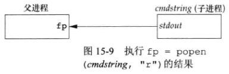
* 如果 type 是 “w”，则文件指针连接到 cmtstring 的标准输入。
  * 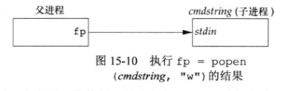

pclose 函数关闭标准 I/O 流，等待命令终止，然后返回 shell 的终止状态。  

cmstring 由 bsh 以下列方式执行：

```c
sh -c cmdstring
```


### 示例：简化分页程序

```c
#include "apue.h"
#include <sys/wait.h>

#define PAGER "${PAGER:-more}"    /* */

int main(int argc, char *argv[]){
    char line[MAXLINE];
    FILE *fpin, *fpout;


    if(argc != 2)
        err_quit("usage: a.out <pathname>");

    if((fpin = fopen(argv[1], "r")) == NULL)  /* 只读打开参数1 文件 */
        err_sys("can't open %s", argv[1]);

    if((fpout = popen(PAGER, "w")) == NULL)
        err_sys("popen error");

    while(fgets(line, MAXLINE, fpin) != NULL){
        if(fputs(line, fpout) == EOF)
            err_sys("fputs error to pipe");
    }

    if(ferror(fpin))
        err_sys("fgets error");
    if(pclose(fpout) == -1)
        err_sys("pclose error");
    
    exit(0);
}
```

相比之前的分页示例，减少了很多代码。


### 示例：popen 和 pclose 实现

```c
#include "apue.h"
#include <errno.h>
#include <fcntl.h>
#include <sys/wait.h>

/*
 * Pointer to array allocated at run-time.
 */
static pid_t	*childpid = NULL;

/*
 * From our open_max(), {Prog openmax}.
 */
static int		maxfd;

FILE *
popen(const char *cmdstring, const char *type)
{
	int		i;
	int		pfd[2];
	pid_t	pid;
	FILE	*fp;

	/* only allow "r" or "w" */
	if ((type[0] != 'r' && type[0] != 'w') || type[1] != 0) {
		errno = EINVAL;
		return(NULL);
	}

	if (childpid == NULL) {		/* first time through */
		/* allocate zeroed out array for child pids */
		maxfd = open_max();
		if ((childpid = calloc(maxfd, sizeof(pid_t))) == NULL)
			return(NULL);
	}

	if (pipe(pfd) < 0)
		return(NULL);	/* errno set by pipe() */
	if (pfd[0] >= maxfd || pfd[1] >= maxfd) {
		close(pfd[0]);
		close(pfd[1]);
		errno = EMFILE;
		return(NULL);
	}

	if ((pid = fork()) < 0) {
		return(NULL);	/* errno set by fork() */
	} else if (pid == 0) {							/* child */
		if (*type == 'r') {
			close(pfd[0]);
			if (pfd[1] != STDOUT_FILENO) {
				dup2(pfd[1], STDOUT_FILENO);
				close(pfd[1]);
			}
		} else {
			close(pfd[1]);
			if (pfd[0] != STDIN_FILENO) {
				dup2(pfd[0], STDIN_FILENO);
				close(pfd[0]);
			}
		}

		/* close all descriptors in childpid[] */
		for (i = 0; i < maxfd; i++)
			if (childpid[i] > 0)
				close(i);

		execl("/bin/sh", "sh", "-c", cmdstring, (char *)0);
		_exit(127);
	}

	/* parent continues... */
	if (*type == 'r') {
		close(pfd[1]);
		if ((fp = fdopen(pfd[0], type)) == NULL)
			return(NULL);
	} else {
		close(pfd[0]);
		if ((fp = fdopen(pfd[1], type)) == NULL)
			return(NULL);
	}

	childpid[fileno(fp)] = pid;	/* remember child pid for this fd */
	return(fp);
}

int
pclose(FILE *fp)
{
	int		fd, stat;
	pid_t	pid;

	if (childpid == NULL) {
		errno = EINVAL;
		return(-1);		/* popen() has never been called */
	}

	fd = fileno(fp);
	if (fd >= maxfd) {
		errno = EINVAL;
		return(-1);		/* invalid file descriptor */
	}
	if ((pid = childpid[fd]) == 0) {
		errno = EINVAL;
		return(-1);		/* fp wasn't opened by popen() */
	}

	childpid[fd] = 0;
	if (fclose(fp) == EOF)
		return(-1);

	while (waitpid(pid, &stat, 0) < 0)
		if (errno != EINTR)
			return(-1);	/* error other than EINTR from waitpid() */

	return(stat);	/* return child's termination status */
}

```


### 示例：过滤用户终端输入

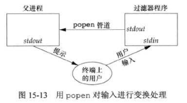

将大写转换为小写：

```c
#include "apue.h"
#include <ctype.h>

int main(void){
    int c;

    while((c = getchar()) != EOF) {
        if(isupper(c))
            c = tolower(c);
        
        if(putchar(c) == EOF)
            err_sys("output error");
        if(c == '\n')
            fflush(stdout);
    }
    exit(0);
}
```

使用 popen 调用上面的大小写过滤程序，将终端上的标准输入过滤后复制到标准输出：

```c
#include "apue.h"
#include <sys/wait.h>

int main(void){
    char line[MAXLINE];
    FILE *fpin;

    if((fpin = popen("./15.14", "r")) == NULL)
        err_sys("popen error");

    while(1) {
        fputs("prompt> ", stdout);
        fflush(stdout);
        if(fgets(line, MAXLINE, fpin) == NULL)
            break;
        if(fputs(line, stdout) == EOF)
            err_sys("fputs error to pipe");
    }
    if(pclose(fpin) == -1)
        err_sys("pclose error");
    putchar('\n');
    exit(0);
}
```


## 协同进程

UNIX 系统过滤程序从标准输入读取数据，向标准输出写数据。几个过滤程序通常在 shell 管道中线性连接。当一个过滤程序既产生某个过滤程序的输入，又读取该过滤程序的输出时，它就变成了**协同进程(coprocess)**。  

popen 只提供连接到另一个进程的标准输入或标准输出的一个单向管道，而协同进程则有连接到另一个进程的两个单向管道：一个接到其标准输入，另一个则来自其标准输出。我们将数据通过标准输入传递给协同进程，经其处理后，再从其标准输出读取数据。  


### 示例：两数相加的过滤程序

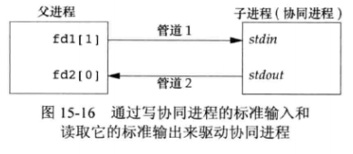

过滤程序，将两个数相加：

```c
#include "apue.h"

int main(void){
    int n, int1, int2;
    char line[MAXLINE];
    
    while((n = read(STDIN_FILENO, line, MAXLINE)) > 0) {
        line[n] = 0;
        if(sscanf(line, "%d%d", &int1, &int2) == 2){
            sprintf(line, "%d\n", int1 + int2);
            n = strlen(line);
            if(write(STDOUT_FILENO, line, n) != n)
                err_sys("write error");
        } else {
            if(write(STDOUT_FILENO, "invalid args\n", 13) != 13)
                err_sys("write error");
        }
    }
    exit(0);
}
```


从标准输入读取两个数，调用上面的协同进程，将两个数传递给协同进程，并从其标准输出读取结果写到自己标准输出。

```c
#include "apue.h"

static void sig_pipe(int);

int main(void){
	int		n, fd1[2], fd2[2];
	pid_t	pid;
	char	line[MAXLINE];

	if (signal(SIGPIPE, sig_pipe) == SIG_ERR)
		err_sys("signal error");

	if (pipe(fd1) < 0 || pipe(fd2) < 0)
		err_sys("pipe error");

	if ((pid = fork()) < 0) {
		err_sys("fork error");
	} else if (pid > 0) {							/* parent */
		close(fd1[0]);
		close(fd2[1]);

		while (fgets(line, MAXLINE, stdin) != NULL) {
			n = strlen(line);
			if (write(fd1[1], line, n) != n)
				err_sys("write error to pipe");
			if ((n = read(fd2[0], line, MAXLINE)) < 0)
				err_sys("read error from pipe");
			if (n == 0) {
				err_msg("child closed pipe");
				break;
			}
			line[n] = 0;	/* null terminate */
			if (fputs(line, stdout) == EOF)
				err_sys("fputs error");
		}

		if (ferror(stdin))
			err_sys("fgets error on stdin");
		exit(0);
	} else {									/* child */
		close(fd1[1]);
		close(fd2[0]);
		if (fd1[0] != STDIN_FILENO) {
			if (dup2(fd1[0], STDIN_FILENO) != STDIN_FILENO)
				err_sys("dup2 error to stdin");
			close(fd1[0]);
		}

		if (fd2[1] != STDOUT_FILENO) {
			if (dup2(fd2[1], STDOUT_FILENO) != STDOUT_FILENO)
				err_sys("dup2 error to stdout");
			close(fd2[1]);
		}
		if (execl("./add2", "add2", (char *)0) < 0)
			err_sys("execl error");
	}
	exit(0);
}


static void sig_pipe(int signo){
    printf("SIGPIPE caught\n");
    exit(1);
}
```

上面的两数相加程序使用了底层 I/O：read、write，如果使用标准 I/O，则调用不起作用，因为缓冲机制：

```c
#include "apue.h"

int main(void){
    int n, int1, int2;
    char line[MAXLINE];
    
    while(fgets(line, MAXLINE, stdin) != NULL) {
        if(sscanf(line, "%d%d", &int1, &int2) == 2){
            if(printf(line, "%d\n", int1 + int2) == EOF)
                err_sys("printf error");
        } else {
            if(printf("invalid args\n") == EOF)
                err_sys("printf error");
        }
    }
    exit(0);
}
```

解决的方法是在 while 循环之前加上下面 4 行：

```c
if (setvbuf(stdin, NULL, _IOLBF, 0) != 0)
    err_sys("setvbuf error");
if (setvbuf(stdout, NULL, _IOLBF, 0) != 0)
    err_sys("setvbuf error");
```

这样使得当有一行可用时，fgets 就返回，当输出一个换行符时，printf 立即执行 fflush 操作。  


对于无源代码或无法修改的协同程序(例如 awk)，则需要使被调用的协同进程认为它的标准输入和标准输出都被连接到一个终端。


## FIFO

FIFO 有时被称为命名管道。未命名的管道只能在两个相关的进程之间使用，而且这两个相关的进程还要有一个共同的创建了它们的祖先进程。但是，通过FIFO，不相关的进程也能交换数据。  

FIFO 是一种文件类型，可以通过 stat 结构体的 st_mode 成员的编码查看是否为 FIFO 类型，S_ISFIFO 宏可以进行测试。  

创建 FIFO 类似于创建文件：

```c
#include <sys/stat.h>

int mkfifo(const char *path, mode_t mode);
int mkfifoat(int fd, const char *path, mode_t mode);
		// 成功返回0，出错返回-1
```

mode 参数和 open 函数中的含义相同。  

mkfifoat相关规则：

* path 参数为绝对路径，fd 参数会被忽略。
* path 参数为相对路径，fd 参数是一个打开目录的有效文件描述符。
* path 参数为相对路径，且 fd 为特殊值 AT_FDCWD ，则路径名以当前目录开始。

创建了 FIFO 文件之后，要用 open 函数打开它。  

当 open 一个 FIFO 时，非阻塞标志(O_NONBLOCK)会产生影响：

* 未指定 O_NONBLOCK 标志时，只读 open 要阻塞到某个其它进程为写而打开这个 FIFO 为止。类似的，只写 open 要阻塞到某个其它进程为读而打开它为止。
* 如果指定了 O_NONBLOCK 标志，则只读 open 将立即返回。如果没有进程为读而打开一个 FIFO，那么只写 open 将返回-1，并将 errno 设置成 ENXIO。

类似于管道，若 write 一个尚无进为读打开的 FIFO，则产生信号 SIGPIPE。若某个 FIFO 的最后一个写进程关闭了该 FIFO，则将为该 FIFO 的读进程产生一个 EOF。  

一个给定的 FIFO 经常有多个写进程，如果不希望多个进程的写数据交叉，则必须考虑原子性写操作。常量 PIPE_BUF 说明了可被原子地写到 FIFO 的最大数据量。  

FIFO 的用途：

* shell 命令使用 FIFO 将数据从一条管道传送到另一条时，无需创建中间临时文件。
* 客户进程-服务器进程应用程序中，FIFO 用作汇聚点，在客户进程和服务器进程二者之间传递数据。


### 示例：用 FIFO 复制输出流

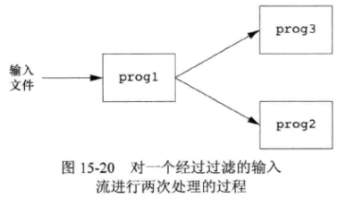

如上图所示，需要对一个输入流进行两次处理。使用 FIFO 和 UNIX 程序 tee 就可以实现此过程，而无需使用临时文件。

```bash
xmy@xmy:/tmp/testfifo$ mkfifo fifo1
xmy@xmy:/tmp/testfifo$ vim infile
xmy@xmy:/tmp/testfifo$ ls
fifo1  infile
xmy@xmy:/tmp/testfifo$ cat infile 
something fo input
xmy@xmy:/tmp/testfifo$ od fifo1 &
[1] 7766
xmy@xmy:/tmp/testfifo$ cat infile | tee fifo1 | tac 
0000000 067563 062555 064164 067151 020147 067546 064440 070156
something fo input
0000020 072165 000012
0000023
[1]+  Done                    od fifo1
```

这里使用 od 作为 prog3，cat 作为 prog2，tac 作为 prog3，tee 程序将 fifo1 的输出发送到 prog2 和 prog3 。

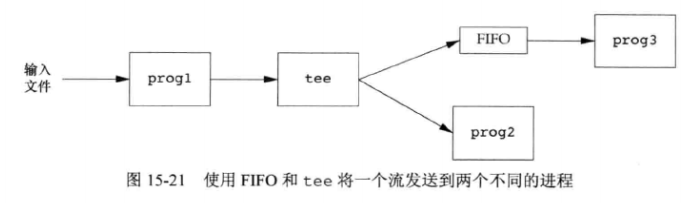


### 示例：客户端-服务器使用 FIFO 通信

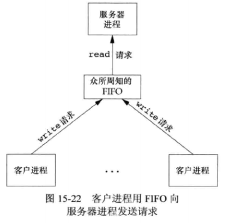

如上图所示，一个服务器进程，与多个客户端进程有关，这里多个客户端都知道服务器的 FIFO 路径名。  

因为该 FIFO 有多个写进程，所以客户端进程发送给服务器进程的请求的长度要小于 PIPE_BUF 字节。避免客户进程的多次写之间的交叉。  

这里存在的问题是：服务器如何将回答送回各个客户端进程。单个 FIFO 无法解决此问题，客户端进程不知道何时去读取自身的响应，也无法区分其它客户端的响应。一种解决方法是，每个客户端进程在其请求中包含它的进程 ID，服务器进程为每个客户端创建一个 FIFO。如下图：

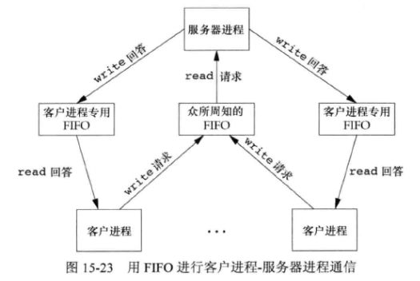

这种安排可以工作，但是需要处理客户端崩溃后对应的 FIFO 被遗留在文件系统，以及捕捉 SIGPIPE 处理信号的问题。  


## XSI IPC

有 3 种 XSI IPC：消息队列、信号量、共享存储器。这里先介绍它们的共同的结构和特征。

### 标识符和键

每个内核中的 IPC 结构(消息队列、信号量、共享存储器)都用一个非负整数的**标识符(identifier)**加以引用。与 fd 不同，IPC 标识不是最小的整数，当一个 IPC 结构被创建又删除，其相关标识符会连续加 1，直到整形数最大正值再回转到 0。  

标识符是 IPC 对象的内部名。为了使多个合作进程能够在同一 IPC 对象上汇聚，需要提供一个外部命名方案：每个 IPC 对象都与一个**键(key)**相关联，将这个键作为该对象的外部名。  

无论何时创建 IPC 结构(一般通过 msgget、semget、shmget 创建)，都应指定一个键。这个键的数据类型是基本系统数据类型 key_t，通常包含在头文件`<sys/types.h>`中被定义为长整型。这个键由内核变换成标识符。  

有多种方法使客户端进程和服务器进程在同一 IPC 结构上汇聚：

1. 服务器进程指定键 IPC_PRIVATE 创建一个新 IPC 结构，将返回的标识符存放在某处(例如文件中)以便客户端进程取用。缺点是标识要写到文件系统中，客户端进程又要读取这个文件获取标识符。
2. 在一个公共头文件中定义一个客户端进程和服务器进程都认可的键。服务器进程指定此键创建一个新的 IPC 结构。但是该键可能已与一个 IPC 结构相结合，此时 get 函数(msgget、semget、shmget)出错，服务器进程必须处理此错误，删除已存在的 IPC 结构，再次尝试创建它。
3. 客户端进程和服务器进程认同一个路径名和项目 ID(项目 ID 是 0~255 之间的字符值)，接着调用函数 ftok 将这两个值变换为一个键。


ftok 函数：

```c
#include <sys/types.h>

key_t ftok(const char *path, int id);
		// 成功返回键，出错返回 (key_t)-1
```

path 参数必须引用一个现有文件。  

产生键时，只使用 id 参数的低 8 位。  

ftok 创建的键通常是用下列方式构成的：按给定的路径名取得其 stat 结构中的部分 st_dev 和 st_ino 字段，然后再将它们与项目 ID 组合起来。如果两个路径名引用的是两个不同的文件，那么 ftok 通常会为这两个路径名返回不同的键。但由于inode和键通常存放在长整型中，所以创建键时可能会丢失信息，意味着不同文件的两个路径名使用同一项目 ID，可能产生相同的键。  

3 个 get 函数都有两个类似参数：一个 key 和一个整型 flag。    


### 权限结构

XSI IPC 为每一个 IPC 结构关联了一个 ipc_perm 结构。规定了权限和所有者，至少包含下列成员：

```c
struct ipc_perm{
    uid_t uid;
    gid_t gid;
    uid_t cuid;
    gid_t cgid;
    mode_t mode;
};
```

每种操作系统实现会包含其它成员，可以参考 `<sys/ipc.h>` 头文件。  

创建 IPC 结构时，对所有字段都赋初始值。之后可以调用 msgctl、semctl、shmctl 修改对应字段。为了修改这些值，调用进程必须是 IPC 结构的创建者或超级用户。修改这些字段类似于对文件调用 chown 和 chmod。  

mode 字段的值如下图，它们没有执行权限，消息队列和共享存储使用术语`读`和`写`，信号量则使用术语`读`和`更改(alter)`：

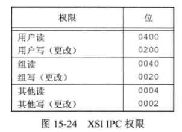


### 结构限制

3 种形式的 XSI IPC 都有内置限制。大多数限制可以通过重新配置内核来改变。  

每种平台修改的方法不同。FreeBSD 8.0、Linux 3.2.0、Mac OS X 10.6.8 提供了 sysctl 命令，Solaris 10 提供了 prctl 命令。  

Linux 可以使用 `ipcs -l ` 显示 IPC 相关限制。FreeBSD 等效命令是 `ipcs -T` ，Solaris 中是 `sysdef -y`。  


### 优点和缺点

#### 优点

* 可靠的
* 流控制的
* 面向记录的
* 可以以非先进先出次序处理


#### 缺点

* IPC 结构体是在系统范围内起作用的，没有引用计数。
* IPC 结构体在文件系统中没有名字。
* 这些形式的 IPC 不使用文件描述符，所以不能对它们使用多路转接 I/O 函数(select、poll)。使得很难一次使用一个以上这样的 IPC 结构，或在文件、设备 I/O 中使用这样的 IPC 结构。


#### 特征比较

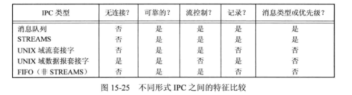

上面的几种特征解释：

* 无连接：无需先调用某种形式的打开函数就能发送消息的能力。消息队列需要某种技术获取队列标识符，因此不算是无连接的。
* 可靠的：这些形式的 IPC 被限制在一台主机上，因此是可靠的，当消息通过网络传送时，就要考虑消息丢失的可能性。
* 流控制：如果系统资源短缺，或者接受进程不能再接受更多消息，则发送进程就要休眠。流控条件消失，发送进程应自动唤醒。
* 还有一个没有显示的特征是：IPC 设施能否自动地为每个客户进程创建一个到服务器进程的唯一连接。


## 消息队列

消息队列是消息的链接表，存储在内核中，由消息队列标识符标识。这里简称为**队列**，标识符简称为**队列 ID**。  

msgget 用于创建一个新队列或打开一个现有队列。msgsnd 将新消息添加到队列尾端。每个消息包含一个正的长整型类型的字段、一个非负的长度以及实际数据字节数(对应于长度)。msgrcv 用于从队列中取消息。除了次序，也可以按照消息的类型字段取消息。  

每个队列都有一个 msqid_ds 结构体与其关联：

```c
struct msqid_ds {
    struct ipc_perm	msg_perm;
    msgqnum_t	msg_qnum;	/* 消息编号 */
    msglen_t	msg_qbytes;	/* 最大字节数 */
    pid_t		msg_lspid;	/* 最后发送消息的 pid */
    pid_t		msg_lrpid;	/* 最后接受消息的 pid */
    time_t		msg_stime;	/* 最后发送消息的时间 */
    time_t		msg_rtime;	/* 最后接受消息的时间 */
    time_t		msg_ctime;
};
```

影响消息队列的系统限制：

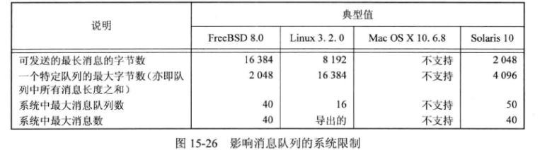

**导出的**表示限制来源于其它限制。   


### msgget

调用的第一个函数通常是 msgget ，用来打开一个现有队列或创建一个新队列：

```c
#include <sys/msg.h>

int msgget(key_t key, int flag);
		// 成功返回消息队列 ID，出错返回-1
```

参数 key 按照前面的规则变换为一个标识符。创建新队列时，要初始化 msqid_ds 结构的成员：

* ipc_perm ：mode 成员按照 flag 指定的权限位设置。
* msg_qnum、msg_lspid、msg_lrpid、msg_stime、msg_rtime 都设置为 0。
* msg_ctime 设置为当前时间。
* msg_qbytes 设置为系统限制值。

执行成功 msgget 返回非负队列 ID，该 ID 可以被其它消息队列函数使用。


### msgctl

msgctl 函数对队列执行多种操作，类似于 ioctl ：

```c
#include <sys/msg.h>

int msgctl(int msqid, int cmd, struct msqid_ds *buf);
		// 成功返回0，出错返回-1
```

参数 cmd 指定对 msgid 的队列要执行的命令：

* IPC_STAT：取此队列的 msqid_ds 结构，并将它存放在 buf 指向的结构中。
* IPC_SET：将字段 msg_perm.uid、msg_perm.gid、msg_perm.mode、msg_qbytes 从 buf 指向的结构复制到与这个队列相关的 msqid_ds 结构中。此命令只能由下列两种进程执行：一种是其有效用户ID等于 msg_perm.cuid 或 msg_perm.uid；另一种是具有超级用户特权的进程。
* IPC_RMID：从系统中删除该消息队列以及在该队列总的所有数据。删除立即生效，仍在使用这一队列的进程再次访问时将得到 EIDRM 错误。此命令只能由下列两种进程执行：一种是其有效用户ID等于 msg_perm.cuid 或 msg_perm.uid；另一种是具有超级用户特权的进程。

这 3 条命令也可以用于信号量和共享存储。


### msgsnd

将数据放到消息队列中 ：

```c
#include <sys/msg.h>

int msgsnd(int msqid, const void *ptr, size_t nbytes, int flag);
		// 成功返回0，出错返回-1
```

每个消息由 3 部分组成：长整型类型的字段、非负的长度、实际数据字节数。消息总是放在队列尾端。  

ptr 参数指向一个长整型数，包含了正的整形消息类型。  

nbytes 参数是数据长度，可以为 0。  

如果发送的最长消息是 512 字节，可以定义结构：

```c
struct mymesg {
    long mtype;
    char mtext[512];
}
```

ptr 就是指向 mymesg 结构体的指针。  

参数 flag 的值可以指定为 IPC_NOWAIT。类似于文件 I/O 的非阻塞标志。如果消息队列已满，msgsnd 立即会出错返回 EAGAIN。如果没有指定 IPC_NOWAIT，进程会一直阻塞直到：有空间可以容纳消息、队列被删除(会返回 EIDRM 错误)、接收到信号(会返回 EINTR 错误)。  

当 msgsnd 返回成功时，消息队列相关的 msqid_ds 结构会随之更新，表明调用的进程 ID(msg_lspid)、调用的时间(msg_stime)、队列中新增的消息(msg_qnum)。  


### msgrcv

从消息队列中取数据 ：

```c
#include <sys/msg.h>

ssize_t msgrcv(int msqid, void *ptr, size_t nbytes, long type, int flag);
		// 成功返回消息数据部分的长度，出错返回-1
```

参数 ptr、nbytes 和 msgsnd 函数类似。  

如果 flag 设置了 MSG_NOERROR，消息大于 nbytes 时会被截断丢弃，且不通知。如果没有设置这一标志，消息太长时，出错返回 E2BIG，消息仍留在队列中。  

参数 type 可以指定想要哪一种消息：

* `type == 0`：返回队列中的第一个消息。
* `type > 0`：返回队列中消息类型为 type 的第一个消息。
* `type < 0`：返回队列中消息类型值小于等于 type 绝对值的消息，如果这种消息有若干个，则取类型值最小的消息。

type 值可以有多种用途，例如用来表示优先级值，多客户端进程情况下可以用来表示客户端进程 ID。  

flag 值可以指定为 IPC_NOWAIT，使操作不阻塞。如果没有指定类型消息，msmgrc 返回 -1，error 设置为 ENOMSG。如果没有指定 IPC_NOWAIT，进程会一直阻塞直到：有指定类型消息可用、队列被删除(会返回-1，error设置为 EIDRM )、接收到信号(会返回-1，error 设置为 EINTR )。 

当 msgrcv 返回成功时，消息队列相关的 msqid_ds 结构会随之更新，表明调用的进程 ID(msg_lrpid)、调用的时间(msg_rtime)、队列中减少了消息数(msg_qnum)。


### 示例：消息队列与全双工管道时间对比


书中对比了在 Solaris 上使用：消息队列、全双工（STREAMS）管道和 UNIX域套接字 3 种技术的时间差异。测试程序先创建 IPC 通道，调用 fork，然后从父进程向子进程发送约200MB数据。数据发送的方式是：对于消息队列，调用100000次 msgsnd，每个消息长度为2000字节：对于全双工管道和 UNIX 域套接字，调用100000次 write，每次写2000字节。时间都以秒为单位。

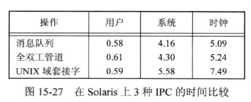


## 信号量

信号量与之前的 IPC 不同，它是一个计数器，用于为多个进程提供对共享数据对象的访问。  

为了获得共享资源，进程需要执行操作：

1. 测试控制该资源的信号量。
2. 若此信号量的值为正，则进程可以使用该资源。使用后，信号量值减1。
3. 若信号量的值为0，则进程进入休眠状态，直至信号量值大于0。

当进程不再使用由一个信号量控制的共享资源时，该信号量值增加 1.如果有进程正在休眠等待此信号量，则唤醒它们。  

信号量值的增减操作应当是原子操作，因此通常是在内核中实现的。  

常用的信号量形式被称为**二元信号量(binary semaphore)**。它控制单个资源，其初始值为 1。  

但 XSI 信号量比之复杂得多，主要是由于：

1. 信号量并非是单个非负值，而必须定义为含有一个或多个信号量值的集合。创建信号量时，要制定集合中信号量的值的数量。
2. 信号量的创建(semget)是独立于它的初始化(semctl)的，此致命缺点导致不能原子地创建一个信号量集合，并且对集合中各个信号量值赋初值。
3. 即使没有进程正在使用各种形式的 XSI IPC，它们仍然存在。有些程序在终止时没有释放已分配的信号量。


### semid_ds 结构体

内核为每个信号量维护着一个结构体 semid_ds ：

```c
struct semid_ds {
    struct ipc_perm sem_perm;
    unsigned short 	sem_nsems;
    time_t			sem_otime;
    time_t			sem_ctime;
    /* ... omit ... */
};
```

每个信号量由一个无名结构表示，至少包含下列成员：

```c
struct {
    unsigned	short	semval;	/* 信号值，>=0 */
    pid_t				sempid;	/* 最后操作的进程 pid */
    unsigned	short	semncnt;	
    unsigned	short	semzcnt;
    /* 
    ... 
    omit 
    ...
    */
};
```

影响信号量集合的系统限制：

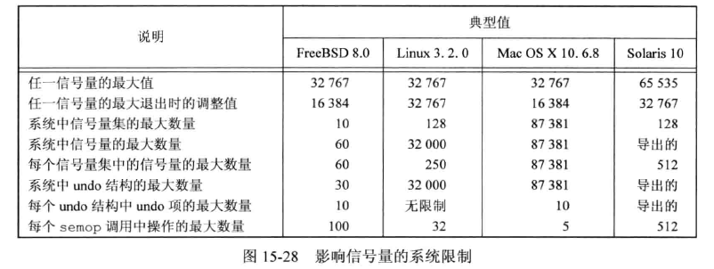


### semget 函数

如果想要使用 XSI 信号量，首先需要通过调用函数 semget 来获得一个信号量 ID：

```c
#include <sys/sem.h>

int semget(key_t key, int nsems, int flag);
		// 成功返回信号量ID，出错返回-1
```

将 key 变换为标识符的规则和前面 XSI IPC 中一样，分为创建新集合还是引用一个现有集合。创建一个新集合时，要对 semid_ds 结构成员赋初值：

* 初始化 ipc_perm 结构体，结构体中的 mode 成员被设置为 flag 参数对应权限位。
* sem_otime 设置为0。
* sem_ctime 设置为当前时间。
* sem_nsems 设置为 nsems。

nsems 是该集合中的信号量数。如果是创建新集合，则必须知道 nsems。如果引用现有集合，则 nsems 指定为 0。


### semctl 函数


```c
#include <sys/sem.h>

int semctl(int semid, int semnum, int cmd, .../* union semun arg */ );
		// 
```

第 4 个参数是可选的，是否使用取决于所请求的命令，如果使用该参数，则其类型是 semun，它是多个命令特定参数的联合(union)：

```c
union semun {
    int 				val;
    struct	semid_ds 	*buf;
    unsigned short		*array;
};
```

**这个选项参数是一个联合，而非指向联合的指针**。

semnum 参数指定信号量集合中的一个成员，用于部分 cmd 命令，取值在 `0` 和 `nsems-1` 之间。   

cmd 参数指定下列 10 种命令之一，运行在 semid 指定的信号量集合上：

* IPC_STAT：对集合取 semid_ds 结构，并存储在 arg.buf 指向的结构中。
* IPC_SET：按 arg.buf 指向的结构体中的值，设置与此集合相关的结构体中的 sem_perm.uid、sem_perm.gid、sem_perm.mode 字段。
* IPC_RMID：从系统中删除该信号量集合。
* GETVAL：返回成员 semnum 的 semval 值。
* SETVAL：设置成员 semnum 的 semval 值。该值由 arg.val 指定。
* GETPID：返回成员 semnum 的 sempid 值。
* GETNCNT：返回成员 semnum 的 semncnt 值。
* GETZCNT：返回成员 semnum 的 semzcnt 值。
* GETALL：取该集合中所有的信号量值，存储在 arg.array 指向的数组中。
* SETALL：将该集合中所有的信号量值设置成 arg.array 指向的数组中的值。


除了 GETALL 以外所有 GET 命令，semct 函数都返回相应值。其它命令，成功返回值为 0，出错返回-1 并设置 error。  


### semop 函数

自动执行信号量集合上的操作数组：

```c
#include <sys/sem.h>

int semop(int semid, struct sembuf semoparray[], size_t nops);
		// 成功返回0，出错返回-1
```

semoparray 参数是一个指针，它指向一个由 sembuf 结构体表示的信号量操作数组：

```c
struct sembuf {
    unsigned	short	sem_num;
    short				sem_op;
    short				sem_flg;
};
```

nops 参数规定了该数组中操作的元素数量。  

对集合中每个成员的操作由相应的 sem_op 值决定。此值可以是负值、0、正值。sem_flg 成员的 SEM_UNDO 指示了信号量的 undo 标志。  

1. 最容易处理的情况是 sem_op 为正值。这对应于进程释放的占用的资源数。sem_op 值会加到信号量的值上。如果指定了 undo 标志，则也从该进程的此信号量调整值中减去 sem_op。
2. 如果 sem_op 为负值，则表示要获取由该信号量控制的资源。
   * 如果信号量的值大于等于 sem_op 的绝对值(具有所需的资源)，则从信号量值中减去 sem_op 的绝对值。这能保证洗好了的结果值大于等于 0。如果指定了 undo 标志，则 sem_op 的绝对值也加到该进程的词信号量调整值上。
   * 如果信号量值小于 sem_op 的绝对值(资源不能满足要求)，则有下列条件：
     * 若指定了 IPC_NOWAIT，则 sem_op 出错返回 EAGAIN。
     * 若未指定 IPC_NOWAIT，则该信号量的 semncnt 值加 1(因为调用进程即将进入休眠状态)，然后调用进程被挂起直至下列事件之一发生：
       * 此信号量值变成大于等于 sem_op 的绝对值。此时信号量的 semnctn 值减 1，并且从信号量值中减去 sem_op 的绝对值。如果指定了 undo 标志，则sem_op 的绝对值也加到该进程的此信号量调整值上。
       * 从系统中删除了此信号量。此时函数出错返回 EIDRM。
       * 进程捕捉到一个信号，并从信号处理程序返回。此时信号量的 semncnt 值减 1，函数出错返回 EINTR。
3. 若 sem_op 为 0，表示调用进程希望等待到该信号量值变成 0。
   * 如果信号量当前是0，函数立即返回。
   * 如果非 0，则：
     * 指定了 IPC_NOWAIT，立即出错返回 EAGAIN。
     * 未指定 IPC_NOWAIT，则该信号量的 semzcnt 值加 1，然后调用进程被挂起，直到下列事件发生：
       * 此信号量值变成 0。此信号量的 semzcnt 值减 1。
       * 从系统中删除了此信号量。此时函数出错返回 EIDRM。
       * 进程捕捉到一个信号，并从信号处理程序返回。此时信号量的 semncnt 值减 1，函数出错返回 EINTR。

semop 函数具有原子性，它或者执行数组中的所有操作，或者一个也不执行。  

**exit 时的信号量调整**  

如果在进程终止时，它占用了经由信号量分配的资源，就会成为一个问题。无论何时只要为信号量操作指定了 SEM_UNDO 标志，然后分配资源（sem_op值小于0），那么内核就会记住对于该特定信号量，分配给调用进程多少资源（sem_op的绝对值）。当该进程终止时，不论自愿或者不自愿，内核都将检验该进程是否还有尚未处理的信号量调整值，如果有，则按调整值对相应信号量值进行处理。  


### 示例：信号量、记录锁、互斥量的时间对比

书中在 Linux 上，对 3 种技术进行锁操作所需的时间做了记录：

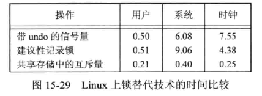


## 共享存储

共享存储允许两个或多个进程共享一个给定的存储区。因为数据不需要再客户端进程和服务器进程之间复制，所以这是最快的一种 IPC。使用共享存储时，在多个进程之间同步访问一个给定的存储区。如果服务器正在将数据放入共享存储区，在操作完成之前，则客户端进程不应当去取这些数据。通常信号量用于同步共享存储访问，但也可以使用记录锁或互斥量。  

XSI 共享存储和内存映射的文件不同之处是：前者没有相关的文件，XSI 共享存储段是内存的匿名段。  

内核为每个共享存储段维护着一个结构，该结构至少要为每个共享存储段包含以下成员：

```c
struct shmid_ds {
 	struct	ipc_perm	shm_perm;
    size_t				shm_segsz;	/* 段字节大小 */
    pid_t				shm_lpid;	/* last shmop()'s pid */
    pid_t				shm_cpid;	/* creator's pid */
    shmatt_t			shm_nattch;
    time_t				shm_atime;
    time_t				shm_dtime;
    time_t				shm_ctime;
};
```

shmatt_t 类型定义为无符号整型，至少与 unsigned short 一样大。  

影响共享存储的系统限制：

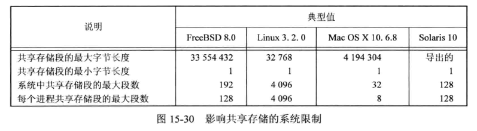

### shmget 函数

调用的第一个函数通常是 shmget，获取一个共享存储标识符：

```c
#include <sys/shm.h>

int shmget(key_t key, size_t size, int flag);
		// 成功返回共享存储 ID，出错返回-1
```

参数 key 变换为一个标识符的规则和前面 IPC 类似，标识了是创建还是引用现有的共享存储段。如果是新创建一个段，则初始化 shmid_ds 结构体的成员：

* ipc_perm 。
* shm_lpid、shm_nattach、shm_atime、shm_dtime 都设置为 0。
* shm_ctime 设置为当前时间。
* shm_segsz 设置为请求的 size。

参数 size 是该共享存储段的长度，以字节为单位。实现通常将其向上取为系统页长的整数倍，但是大于 size 的部分是不可用的。创建新段必须指定 size，如果是引用现有段则 size 指定为 0。创建一个新段时，段内的内容初始化为 0。  


### shmctl 函数

对共享存储段执行多种操作：

```c
#include <sys/shm.h>

int shmctl(int shmid,int cmd, struct shmid_ds *buf);
		// 成功返回0，出错返回-1
```

cmd 参数指定下列 5 种命令之一，运行在 shmid 指定的段上执行：

* IPC_STAT：取此段的 shmid_ds 结构体，并存储在 buf 指向的结构中。
* IPC_SET：按 buf 指向的结构体中的值，设置与此共享存储段相关的结构体中的 shm_perm.uid、shm_perm.gid、shm_perm.mode 字段。
* IPC_RMID：从系统中删除该信号量集合。
* Linux 和 Solaris 提供了两种命令，但并非 SUS 组成部分：
  * SHM_LOCK：在内存中对共享存储段加锁。此命令只能由超级用户执行。
  * SHM_UNLOCK：解锁共享存储段。也只能由超级用户执行。


### shmat 函数

一旦创建了一个共享存储段，进程可以调用 shmat 将其连接到它的地址空间中。

```c
#inlcude <sys/shm.h>

void *shmat(int shmid, const void *addr, int flag);
		// 成功返回指向共享存储段的指针，出错返回-1
```

共享存储段连接到调用进程的哪个地址上与 addr 参数以及 flag 标志是否指定 SHM_RND 位有关。  

* 如果 addr 为 0，则此段连接到由内核选择的第一个可用地址上。这是推荐的使用方式。
* 如果 addr 非 0：
  * 没有指定 SHM_RND，则此段连接到 addr 所指定的地址上。
  * 指定了 SHM_RND，则此段连接到`(addr-(addr mod SHMLBA))`所表示的地址上。SHM_RND 命令的意思是“取整”。SHMLBA 的意思是“低边界地址倍数”，总是 2 的乘方。该算式是将地址向下取最接近 1 个 SHMLBA 的倍数。

除非只计划在一中硬件上运行应用程序，否则不应该指定共享存储段所连接到的地址。  

如果在 flag 位指定了 SHM_RDONLY，则以只读方式连接此段，否则以读写方式连接此段。  

如果 shmat 成功执行，内核将使与该共享存储段相关的 shmid_ds 结构中的 shm_nattch 计数器值加 1。    


### shmdt 函数

当对共享存储段的操作已经结束时，则调用 shmdt 与该段分离：

```c
#inlcude <sys/shm.h>

int shmdt(const void *addr);
		// 成功返回0，出错返回-1
```

这个函数并不从系统中删除共享存储段标识符以及其相关的数据结构，直到某个进程带 IPC_RMID 命令的调用 shmctl 特地删除它为止。  

addr 参数是以前调用 shmat 时的返回值，如果执行成功将使相关 shmid_ds 结构体中的 shm_nattch 计数器值减 1。  


### 示例：打印特定系统存放各种类型数据的位置信息

```c
#include "apue.h"
#include <sys/shm.h>

#define	ARRAY_SIZE	40000
#define	MALLOC_SIZE	100000
#define	SHM_SIZE	100000
#define	SHM_MODE	0600	/* user read/write */

char	array[ARRAY_SIZE];	/* uninitialized data = bss */

int
main(void)
{
	int		shmid;
	char	*ptr, *shmptr;

	printf("array[] from %p to %p\n", (void *)&array[0],
	  (void *)&array[ARRAY_SIZE]);
	printf("stack around %p\n", (void *)&shmid);

	if ((ptr = malloc(MALLOC_SIZE)) == NULL)
		err_sys("malloc error");
	printf("malloced from %p to %p\n", (void *)ptr,
	  (void *)ptr+MALLOC_SIZE);

	if ((shmid = shmget(IPC_PRIVATE, SHM_SIZE, SHM_MODE)) < 0)
		err_sys("shmget error");
	if ((shmptr = shmat(shmid, 0, 0)) == (void *)-1)
		err_sys("shmat error");
	printf("shared memory attached from %p to %p\n", (void *)shmptr,
	  (void *)shmptr+SHM_SIZE);

	if (shmctl(shmid, IPC_RMID, 0) < 0)
		err_sys("shmctl error");

	exit(0);
}
```


执行：

```bash
$ ../gcc_a 15.31.c 
$ ./15.31 
array[] from 0x62a19a1c6060 to 0x62a19a1cfca0
stack around 0x7ffdc267dc54
malloced from 0x62a1d5f606b0 to 0x62a1d5f78d50
shared memory attached from 0x78bf0b7a3000 to 0x78bf0b7bb6a0
```


书中示例的执行结果和存储布局示意图：

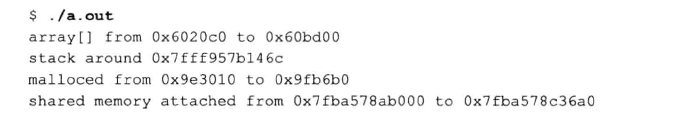

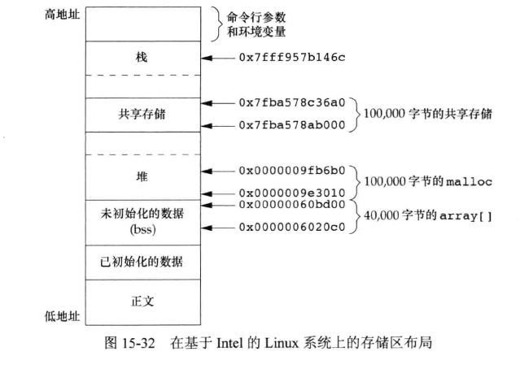


### 示例：/dev/zero 的存储映射

读设备 /dev/zero 时，该设备是 0 字节的无限资源。它也接收写向它的任何数据，但又忽略这些数据。当对其进行存储映射时，有一些特殊性质。    


* 创建一个未命名存储区，长度是 mmap 的第二个参数，将其向上取整为系统的最近页长。
* 存储区都初始化为 0。
* 如果多个进程的共同祖先进程对 mmap 指定了 MAP_SHARED 标志，则这些进程可共享此存储区。

```c
#include "apue.h"
#include <fcntl.h>
#include <sys/mman.h>

#define	NLOOPS		1000
#define	SIZE		sizeof(long)	/* size of shared memory area */

static int
update(long *ptr)
{
    /* 这里增加的是值，不是指针，因此要使用(*ptr)++。 */
	return((*ptr)++);	/* return value before increment */
}

int
main(void)
{
	int		fd, i, counter;
	pid_t	pid;
	void	*area;

	if ((fd = open("/dev/zero", O_RDWR)) < 0)
		err_sys("open error");
	if ((area = mmap(0, SIZE, PROT_READ | PROT_WRITE, MAP_SHARED, fd, 0)) == MAP_FAILED)
		err_sys("mmap error");
	close(fd);		/* can close /dev/zero now that it's mapped */

	TELL_WAIT();

	if ((pid = fork()) < 0) {
		err_sys("fork error");
	} else if (pid > 0) {			/* parent */
		for (i = 0; i < NLOOPS; i += 2) {
			if ((counter = update((long *)area)) != i)
				err_quit("parent: expected %d, got %d", i, counter);

			TELL_CHILD(pid);
			WAIT_CHILD();
		}
	} else {						/* child */
		for (i = 1; i < NLOOPS + 1; i += 2) {
			WAIT_PARENT();

			if ((counter = update((long *)area)) != i)
				err_quit("child: expected %d, got %d", i, counter);

			TELL_PARENT(getppid());
		}
	}

	exit(0);
}

```

上面示例打开 /dev/zero 设备，指定长整型的长度调用 mmap。mmap 时指定 MAP_SHARED 标志。  

父子进程交替运行，使用 update 函数各自对共享存储映射区中的长整型数加 1。  


### 示例：匿名存储映射

很多实现提供了一种类似 /dev/zero 的设施，称为匿名存储映射。调用 mmap 时指定 MAP_ANON 标志，将文件描述符指定为 -1，得到的区域就是匿名的，并且创建了一个可与后代进程共享的存储区。  

修改上一个示例的内容：

```c
	if ((fd = open("/dev/zero", O_RDWR)) < 0)
		err_sys("open error");
	if ((area = mmap(0, SIZE, PROT_READ | PROT_WRITE, MAP_SHARED,
	  fd, 0)) == MAP_FAILED)
		err_sys("mmap error");
	close(fd);		/* can close /dev/zero now that it's mapped */
```

将上面内容中打开和关闭 fd 代码删除,修改 mmap 参数：

```c
	if ((area = mmap(0, SIZE, PROT_READ | PROT_WRITE, MAP_ANON | MAP_SHARED, -1, 0)) == MAP_FAILED)
		err_sys("mmap error");
```


上面两个示例是基于 mmap 映射 /dev/zero 的方式使用共享存储段，替代方法还有：使用 XSI 共享存储函数、mmap 将文件映射到进程的地址空间并使用 MAP_SHARED 标志。


## POSIX 信号量

POSIX 信号量主要想解决 XSI 信号量接口的几个缺陷：

* 相比于 XSI 接口，POSIX 信号量接口考虑到了更高性能的实现。
* POSIX 信号量接口使用更简单：没有信号量集，在熟悉的文件系统操作后一些接口被模式化了。
* POSIX 信号量在删除时表现更完美。


POSIX 信号量有两种形式：命名和未命名的。差异在于创建和销毁形式上，其它工作一样。

* 未命名信号量只存在于内存中，并要求能使用信号量的进程必须可以访问内存。因此只能应用于同一进程中的线程，或者不同进程中已经映射相同内存区域到各自地址空间中的线程。
* 命名信号量可以被任何已知它们名字的进程中线程使用。


### sem_open 函数

创建一个新的命名信号量或使用一个现有信号量：

```c
#include <semaphore.h>

sem_t *sem_open(const char *name, int oflag, ... /* mode_t mode, unsigned int value */ );
		// 成功返回指向信号量的指针，出错返回 SEM_FAILED
```

使用现有的命名信号量时，只需要指定前两个参数，信号量名字 name ，oflag 参数为 0。当 oflag 有 O_CREAT 标志集时，如果命名信号量不存在，则创建一个新的。如果已存在，则会被使用，但不会有额外的初始化发生。  

当指定 O_CREAT 标志时，需要提供后面的参数：

* mode 参数指定谁可以访问信号量。mode 取值和 open 函数的权限位相同：用户读写执行、组读写执行、其它读写执行。
* value 参数用来指定信号量的初始值。取值范围是 0~SEM_VALUE_MAX。

想要确保创建的是信号量，可以设置 oflag 参数为 O_CREAT|O_EXCL。如果信号量存在，会导致 sem_open 失败。  

为了增加可移植性，选择信号量命名时必须遵循一定的规则：

* 名字的第一个字符应该为斜杠 `/`。
* 名字不应包含其它斜杠以此避免实现定义的行为。
* 信号量名字的最大长度是实现定义的。


sem_open 函数返回指向信号量的指针，可以传递到其它信号量函数上操作。


### sem_close 函数

释放信号量相关的资源：

```c
#include <semaphore.h>

int sem_close(sem_t *sem);
		// 成功返回0，出错返回-1
```

如果进程没有调用 sem_close 而退出，内核将自动关闭任何打开的信号量。


### sem_unlink 函数

销毁一个命名信号量：

```c
#include <semaphore.h>

int sem_unlink(const char *name);
		// 成功返回0，出错返回-1
```

sem_unlink 函数删除信号量的名字。如果没有打开的信号量引用，该信号量会被销毁。否则，销毁会延迟到最后一个打开的引用关闭。  


### sem_trywait 、sem_wait、sem_timewait 函数

信号量减 1 操作：

```c
#include <semaphore.h>

int sem_trywait(sem_t *sem);
int sem_wait(sem_t *sem);
		// 成功返回0，出错返回-1
```

使用 sem_wait 函数时，信号量计数是 0 就会发生阻塞。直到成功使信号量减 1 或者被信号中断时才返回。  

sem_trywait 可以避免阻塞，如果信号量是 0，返回 -1 并将 errno 设置为 EAGAIN。  


还可以使用 sem_timewait 函数，指定最大阻塞时间：

```c
#include <semaphore.h>
#include <time.h>

int sem_timedwait(sem_t *restrict sem, const struct timespec *restrict tsptr);
		// 成功返回0，出错返回-1
```

tsptr 参数指定绝对时间。超时基于 CLOCK_REALTIME 时钟。如果超时到期之后信号量计数没能减 1，sem_timedwait 将返回 -1 并将 errno 设置为 ETIMEDOUT。  


### sem_post 函数

使信号量值增加 1：

```c
#include <semaphore.h>

int sem_post(sem_t *sem);
		// 成功返回0，出错返回-1
```

调用 sem_post 时，如果有调用 sem_wait、sem_timedwait 正在阻塞的进程，相关进程会被唤醒并且被 sem_post 增加 1 的信号量计数会再次被 sem_wait 或 sem_timedwait 减 1。  


### sem_init 函数

创建未命名的信号量：

```c
#include <semaphore.h>

int sem_init(sem_t *sem, int pshared, unsigned int value);
		// 成功返回0，出错返回-1
```

pshared 参数表明是否在多个进程中使用信号量。如果是多个进程则将其设置成一个非 0 值。  

value 参数指定了信号量的初始值。  

声明了一个 sem_t 类型的变量并把它的地址传递给 sem_init 来实现初始化，而不是像 sem_open 函数那样返回一个指向信号量的指针。如果多个进程使用信号量，需要确保 sem 参数指向两个进程之间共享的内存范围。  


### sem_destroy 函数

销毁未命名信号量：

```c
#include <semaphore.h>

int sem_destroy(sem_t *sem);
		// 成功返回0，出错返回-1
```

销毁之后，不能在使用任何带有 sem 的信号量函数，除非重新初始化它。


### sem_getvalue 函数

检索信号量值：

```c
#include <semaphore.h>

int sem_post(sem_t *restrict sem, int *restrict valp);
		// 成功返回0，出错返回-1
```

执行成功后，valp 指向的整数值将包含信号量值。但是可能返回时，信号量的值已被其它进程改变，除非引入额外的同步机制避免竞争，否则该函数只能用于调试。  

Mac OS X 10.6.8 不支持该函数。


### 与 XSI 信号量性能对比

在两种平台上竞争分配和释放信号量 1 000 000 次，分别使用 XSI 信号量和 POSIX 信号量：

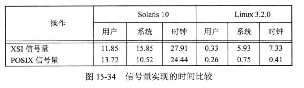

Linux 上比 Solaris 高很多的原因是：Linux 实现将文件映射到了进程地址空间中，并且没有使用系统调用来操作各自的信号量。  


### 示例：基于信号量的互斥原语实现

当一个线程对一个普通互斥量加锁，另一个线程试图解锁它时，错误检查互斥量和递归互斥量会产生错误。而二进制信号量可以向互斥量一样使用，因此可以使用信号量来创建自己的锁原语从而提供互斥。  

如果要创建自己的锁，能够被一个线程加锁而能被另一个线程解锁，结构可能如下：

```c
struct slock {
    sem_t *semp;
    char name[_POSIX_NAME_MAX];
};
```

基于信号量的互斥原语的实现：

```c
#include <stdlib.h>
#include <stdio.h>
#include <unistd.h>
#include <errno.h>
#include <semaphore.h>
#include <fcntl.h>
#include <limits.h>
#include <sys/stat.h>

struct slock {
	sem_t *semp;
	char name[_POSIX_NAME_MAX];
};

struct slock *
s_alloc()
{
	struct slock *sp;
	static int cnt;

	if ((sp = malloc(sizeof(struct slock))) == NULL)
		return(NULL);
	do {
		snprintf(sp->name, sizeof(sp->name), "/%ld.%d", (long)getpid(),
		  cnt++);
		sp->semp = sem_open(sp->name, O_CREAT|O_EXCL, S_IRWXU, 1);
	} while ((sp->semp == SEM_FAILED) && (errno == EEXIST));
	if (sp->semp == SEM_FAILED) {
		free(sp);
		return(NULL);
	}
	sem_unlink(sp->name);
	return(sp);
}

void
s_free(struct slock *sp)
{
	sem_close(sp->semp);
	free(sp);
}

int
s_lock(struct slock *sp)
{
	return(sem_wait(sp->semp));
}

int
s_trylock(struct slock *sp)
{
	return(sem_trywait(sp->semp));
}

int
s_unlock(struct slock *sp)
{
	return(sem_post(sp->semp));
}

```

根据进程 ID 和计数器来创建名字。没有可以用互斥量保护计数器，因为两个竞争的线程同时调用 s_alloc 并以同一个名字结束时， sem_open 中使用 O_EXCL 标志将会使其中一个线程成功而另一个失败，失败的线程将 errno 设置成 EEXIST。打开一个信号量之后断开了它的连接，这样销毁了名字，其它进程将不能再次访问它，简化了进程结束时的清理工作。  


## 客户进程-服务器进程属性

客户端进程和服务器进程之间使用各种 IPC 会有不同属性。  


### 半双工管道

最简单的关系类型是使客户端进程 fork 然后 exec 所希望的服务器进程。fork 之前先创建两个半双工管道使数据可在两个方向传输。  

可以构建一个**open服务器进程(open server)**。它为客户端进程打开文件而非客户端自己调用 open 函数，这样就可以在正常的 UNIX 权限之外，附加权限检查。假设服务器进程执行的是设置用户 ID 程序，这给与它附加的权限，服务器用客户端的实际用户 ID 来决定是否给与对应访问权限。


### FIFO

对于守护进程类型的服务器进程，不能使用管道。如果使用 FIFO，每个客户端进程要有单独的 FIFO。  


### 消息队列

如果守护进程使用消息队列类型的 IPC，则有多种可能：

1. 服务器和多个客户端之间只使用一个队列，这样需要每个消息中有个字段指明谁是消息的接收者。
2. 每个客户端使用一个单独的消息队列。向服务器发送请求之前，每个客户端先使用键 IPC_PRIVATE 创建它自己的消息队列。客户端进程将第一个请求发送到服务器进程众所周知的队列上，请求中包含其自身创建的消息队列的队列 ID，得到服务器进程响应后，双方在此队列上交换数据。

这两种方式都可以使用共享内存段和同步方法(信号量或记录锁)来实现。  

现有问题是：服务器进程如何准确的标识客户端进程，进而在特权操作时进行鉴权。


