## 引言

套接字接口的设计目标之一：同样的接口既可以用于计算机间通信，也可以用于计算机内通信。基于 TCP/IP 协议栈概述套接字相关 API。


##  套接字描述符

套接字是通信端点的抽象。类似于文件描述符，应用程序用套接字描述符访问套接字，套接字描述符在 UNIX 被当做一种文件描述符。很多例如 read、write 之类的函数可以用于处理套接字描述符。  


### socket 函数

socket 函数可以创建一个套接字：

```c
#include <sys/socket.h>

int socket(int domain, int type, int protocol);
		// 成功返回套接字描述符，出错则返回-1
```

参数 domain(域) 确定通信的特性，包括地址格式。各个域都有自己表示地址的格式，表示各个域的常数都以 `AF_` 开头，意指**地址族(address family)**，POSIX.1 指定的各个域：

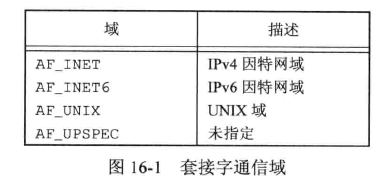

参数 type 确定套接字的类型，进一步确定通信特征。POSIX.1 定义的套接字类型：

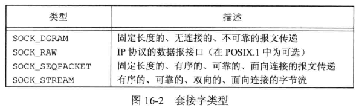

参数 protocol 通常是 0，表示为给定的域和套接字类型选择默认协议。当对同一域和套接字类型支持多个协议时，可以使用 protocol 选择一个特定协议。在 AF_INET 通信域中，套接字类型 SOCK_STREAM 的默认协议是 TCP，SOCK_DGRAM 的默认协议是 UDP。因特网域套接字定义的协议：

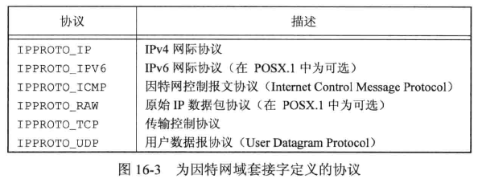

对于数据报（SOCK_DGRAM）接口，两个对等进程之间通信不需要逻辑连接。只需要向对等进程所使用的套接字送出一个报文。因此数据报提供了一个无连接的服务。而字节流（SOCK_STREAM）要求在交换数据之前，在本地套接字和通信的对等进程的套接字之间建立一个逻辑连接。  

SOCK_STREAM 套接字提供字节流服务，所以应用程序分辨不出报文的界限。从 SOCK_STREAM 读取数据时，也许不会返回所有由发送进程缩写的字节数。最终获得发送过来的所有数据也许要若干次函数调用才能得到。  

SOCK_SEQPACKET 套接字和 SOCK_STREAM 套接字很类似，只是从该套接字得到的是基于报文的服务而不是字节流服务。意味着从 SOCK_SEQPACKET 套接字接收的数据量与对方发送的一致。流控制传输协议（Stream Control Transmission Protocol，SCTP）提供了因特网域上的顺序数据包服务。  

SOCK_RAW 套接字提供一个数据报接口，用于直接访问网络层（因特网域中的 IP 层）。使用这个接口，应用程序负责构造自己的协议头部，因为传输协议(如 TCP、UDP)被绕过了。  


调用 socket 与调用 open 类似，获得用于 I/O 的文件描述符，不在需要该描述符时，调用 close 关闭对文件或套接字的访问，并释放描述符。  

下图是对一些参数为文件描述符类型的函数传递套接字描述符时的行为：

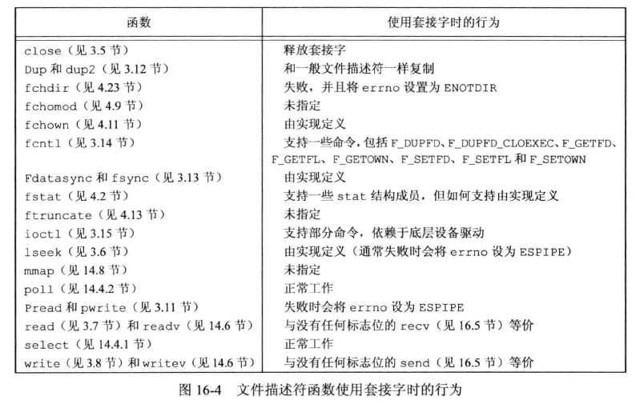


### shutdown 函数

套接字通信是双向的，可以采用 shutdown 函数来禁止一个套接字的 I/O：

```c
#include <sys/socket.h>

int shutdown(int sockfd, int how);
		// 成功返回0，出错返回-1
```

参数 how 的值：

* SHUT_RD（关闭读端），无法从套接字读取数据。
* SHUT_WR（关闭写端），无法使用套接字发送数据。
* SHUT_RDWR，无法读取数据，又无法发送数据。

可以使用 close 函数关闭套接字，shutdown 函数的作用是：

* 最后一个活动引用关闭时，close 才释放网络端点，例如 dup 复制出来的描述符都需要被释放；shutdown 允许使一个套接字处于不活动状态，和引用的文件描述符无关。
* 有时可以很方便地关闭套接字双向传输中的一个方向。例如想让所欲通信的进程能够确定数据传输何时结束，可以关闭套接字的写端，因而读端仍可以继续接收数据。


## 寻址

使用套接字通信时，需要通过目标通信进程的标识找到对应目标，进程标识由两部分组成：计算机的网络地址 + 端口号。  

### 字节序

字节序是一个处理器架构特性，用于指示像整数这样的大数据类型内部的字节如何排序。分为**大端（big-endian）**和**小端（little-endian）**。  

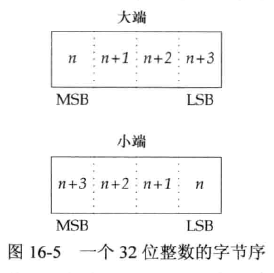

无论是大端还是小端，**最高有效字节（Most Significant Byte，MSB）**总是在左边，**最低有效字节（Least Significant Byte，LSB）**总是在右边。  

如果处理器架构支持大端字节序，那么最大字节地址出现在 LSB 上。小端字节序则相反，最小字节地址在 LSB 上。  

几种平台上的字节序：

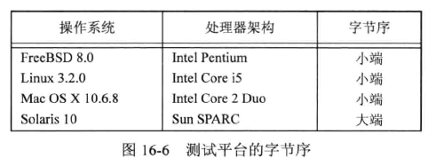


网络协议指定了字节序，因此异构计算机系统能够交换协议信息而不会被字节序所混淆。TCP/IP 协议栈使用大端字节序。应用程序有时需要在处理器的字节序和网络字节序之间转换它们。  

有几个用来在处理器字节序和网络字节序之间转换的函数：

```c
#include <apra/inet.h>

uint32_t htonl(uint32_t hostint32);
		// 返回以网络字节序表示的 32 位整数
uint16_t htons(uint16_t hostint16);
		// 返回以网络字节序表示的 16 位整数
uint32_t ntohl(uint32_t netint32);
		// 返回以主机字节序表示的 32 位整数
uint16_t ntohs(uint16_t netint16);
		// 返回以主机字节序表示的 16 位整数
```

h 表示主机字节序，n 表示网络字节序。l 表示长整数，，s 表示短整数。这些函数可能被实现为宏。


### 地址格式


#### sockaddr

一个地址标识一个特定通信域的套接字端点，地址格式与这个特定的通信域相关。为了使不同格式地址能够传入到套接字函数，地址会被强制转换成一个通用的地址结构 sockaddr：

```c
struct sockaddr {
    sa_family_t		sa_family;
    char			sa_data[];
    /* ... omit ... */
};
```

具体实现可以自由添加额外成员并定义 sa_data 成员的大小，例如 Linux 中定义如下：

```c
struct sockaddr {
    sa_family_t		sa_family;
    char			sa_data[14];
};
```

FreeBSD 中定义如下：

```c
struct sockaddr {
    unsigned char	sa_len;
    sa_family_t		sa_family;
    char			sa_data[14];
};
```


#### sockaddr_in、sockaddr_in6

因特网地址定义在 `<netinet/in.h>` 头文件中。IPv4 因特网域（AF_INET）中，套接字地址用结构 sockaddr_in 表示：

```c
struct in_addr {
    in_addr_t		s_addr;		/* IPv4 address */
};

struct sockaddr_in {
    sa_family_t		sin_family;
    in_port_t		sin_port;	/* port number */
    struct in_addr	sin_addr;
};
```

数据类型 in_port_t 定义成 uint16_t。in_addr_t 定义成 uint32_t。这些整数类型在 <stdint.h> 中定义。  


IPv6 因特网域（AF_INET6）套接字地址用 sockaddr_in6 表示：

```c
struct in6_addr {
    uint8_t			s6_addr[16];		/* IPv6 address */
};

struct sockaddr_in6 {
    sa_family_t		sin6_family;
    in_port_t		sin6_port;	/* port number */
    uint32_t		sin6_flowinfo;	/* 流控相关 */
    struct in6_addr	sin6_addr;
    uint32_t		sin6_scope_id;
};
```


上面是 SUS 要求的定义。每个实现可以自由添加更多字段。Linux 中，sockaddr_in 定义如下：

```c
struct sockaddr_in {
    sa_family_t		sin_family;
    in_port_t		sin_port;	/* port number */
    struct in_addr	sin_addr;
    unsigned char	sin_zero[8];	/* filler */
};
```


尽管 sockaddr_in 和 sockaddr_in6 结构相差比较大，但均会被强制转换成 sockaddr 结构体输入到套接字例程中。


#### inet_ntop、inet_pton

有时需要打印比较好理解的格式：点分十进制。有几个函数可以转换二进制地址格式与点分十进制字符表示(a.b.c.d)。

```c
#include <arpa/inet.h>

const char *inet_ntop(int domain, const void *restrict addr, char *restrict str, socklen_t size);
		// 成功返回地址字符串指针，出错返回 NULL
int inet_pton(int domain, const char *restrict str, void *restrict addr);
		// 成功返回1，格式无效返回0，出错返回-1
```


### 地址查询

理想情况下，应用程序不需要了解一个套接字地址的内部结构。如果一个程序简单地传递一个类似于 sockaddr 结构的套接字地址，并且不依赖于任何协议相关的特性，那么可以与提供相同类型服务的许多不同协议协作。  

历史上 BSD 提供了访问各种网络配置信息的接口。这些信息可以存放在静态文件（/etc/hosts、/etc/services）中，也可以由服务（DNS、NIS）管理，无论放在何处，都可以通过同样的函数访问它。  


#### gethostent 主机名相关函数

查找给定计算机系统的主机信息：

```c
#include <netdb.h>

struct hostent *gethostent(void);
		// 成功返回指针，出错返回NULL
void sethostent(int stayopen);
void endhostent(void);
```

如果主机数据库文件没有打开，gethostent 会打开它。函数 gethostent 返回文件中的下一个条目。  

函数 sethostent 会打开文件，如果文件已经被打开，则将其回绕。stayopen 参数设置成非 0 值时，调用 gethostent 后，文件将依然是打开的。  

函数 endhostent 可以关闭文件。  

当 gethostent 执行成功，返回一个指向 hostent 结构体的指针，该结构可能包含一个静态的数据缓冲区，每次调用 gethostent，缓冲区会被覆盖。hostent 结构至少包含下列成员：

```c
struct hostent{
    char	*h_name;	/* 主机名 */
    char	**h_aliases;	/* 备用主机名数组 */
    int		h_addrtype;		/* 地址类型 */
    int		h_length;		/* 地址长度 */
    char	**h_addr_list;	/* 网络地址 */
    /* ... omit ... */
};
```

返回的地址采用网络字节序。  

另外两个函数 gethostbyname、gethostbyaddr 被认为时过时的，SUSv4 已经删除。  


#### getnetent 网络地址相关函数

获取网络名字和网络编号的函数：

```c
#include <netdb.h>

struct netent *getnetbyaddr(uint32_t net, int type);
struct netent *getnetbyname(const char *name);
struct netent *getnetent(void);
		// 上面3个函数执行成功返回指针，出错返回NULL

void setnetent(int stayopen);
void endnetent(void);
```


netent 结构体至少包含：

```c
struct netent{
    char	*n_name;
    char	**n_aliases;
    int		n_addrtype;
    uint32_t	n_net;
    /* ... omit ... */
};
```

网络编号按照网络字节序返回。地址类型是地址族常量之一（如 AF_INET）。  


#### getprotoent 协议相关函数

协议名字和协议编号之间映射相关函数：

```c
#include <netdb.h>

struct protoent *getprotobyname(const char *name);
struct protoent *getprotobynumber(int proto);
struct protoent *getprotoent(void);
		// 上面3个函数执行成功返回指针，出错返回NULL

void setprotoent(int stayopen);
void endprotoent(void);
```

protoent 结构体至少包含：

```c
struct protoent {
    char	*p_name;
    char	**p_aliases;
    int		p_proto;
    /* ... omit ... */
};
```


#### getservent 服务相关函数

服务由地址的端口号部分表示。每个服务由一个唯一的众所周知的端口号来支持。相关函数：

```c
#include <netdb.h>

struct servent *getservbyname(const char *name, const char *proto);
struct servent *getservbynumber(int port, const char *proto);
struct servent *getservent(void);
		// 上面3个函数执行成功返回指针，出错返回NULL

void setservent(int stayopen);
void endservent(void);
```

getservbyname 函数将一个服务名映射到一个端口号，getservbyport 将一个端口号映射到一个服务名，getservent 函数顺序扫描服务数据库。  

servent 结构体至少包含：

```c
struct servent {
    char	*s_name;
    char	**s_aliases;
    int		s_port;
    char	*s_proto;
    /* ... omit ... */
};
```


#### getaddrinfo、getnameinfo 主机名和服务名映射

将一个主机名和一个服务名映射到一个地址：

```c
#include <sys/socket.h>
#include <netdb.h>

int getaddrinfo(const char *restrict host, const char *restrict service, const struct addrinfo *restrict hint, struct addrinfo **restrict res);
		// 成功返回0，出错返回非0错误码

void freeaddrinfo(struct addrinfo *ai);
```

getaddrinfo 返回一个链表结构体 addrinfo。freeaddrinfo 来释放一个或多个这种结构体，数量取决于结构体中 ai_next 字段链接了多少个。  

addrinfo 结构体至少包含如下成员：

```c
struct addrinfo {
    int					ai_flags;
    int					ai_family;
    int					ai_socktype;
    int					ai_protocol;
    socklen_t			ai_addrlen;
    struct sockaddr		*ai_addr;
    char				*ai_canonname;
    struct addrinfo		*ai_next;
    /* ... omit ... */
};
```

参数 hint 可以用来选择符合特定条件的地址。hint 是一个用于过滤地址的模板，包括 ai_family、ai_flags、ai_protocol、ai_socktype 字段，剩余整数字段必须设置为 0，指针必须为空。  

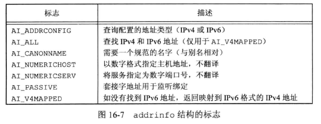

如果 getaddrinfo 失败，不能使用 perror、strerror 来生成错误消息，而是需要调用 gai_strerror 将返回的错误码转换成错误消息。

```c
#include <netdb.h>

const char *gai_strerror(int error);
		// 返回指向描述错误的字符串的指针
```


getnameinfo 函数将一个地址映射到一个主机名和一个服务名：

```c
#include <sys/socket.h>
#include <netdb.h>

int getnameinfo(const struct sockaddr *restrict addr, socklen_t alen, char *restrict host, socklen_t hostlen, char *restrict service, socklen_t servlen, int flags);
		// 成功返回0，出错返回非0
```

套接字地址(addr)被翻译成一个主机名和一个服务名。如果 host 非空，则指向一个长度为 hostlen 字节的缓冲区用于存放返回的主机名。如果 service 非空，则指向一个长度为 servlen 字节的缓冲区用于存放返回的主机名。  

flags 参数提供一些控制翻译的方式：

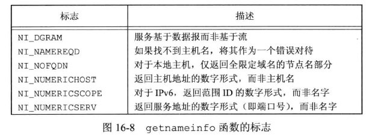

#### 示例：打印主机和服务信息

```c
#include "apue.h"
#if defined(SOLARIS)
#include <netinet/in.h>
#endif
#include <netdb.h>
#include <arpa/inet.h>
#if defined(BSD)
#include <sys/socket.h>
#include <netinet/in.h>
#endif

void
print_family(struct addrinfo *aip)
{
	printf(" family ");
	switch (aip->ai_family) {
	case AF_INET:
		printf("inet");
		break;
	case AF_INET6:
		printf("inet6");
		break;
	case AF_UNIX:
		printf("unix");
		break;
	case AF_UNSPEC:
		printf("unspecified");
		break;
	default:
		printf("unknown");
	}
}

void
print_type(struct addrinfo *aip)
{
	printf(" type ");
	switch (aip->ai_socktype) {
	case SOCK_STREAM:
		printf("stream");
		break;
	case SOCK_DGRAM:
		printf("datagram");
		break;
	case SOCK_SEQPACKET:
		printf("seqpacket");
		break;
	case SOCK_RAW:
		printf("raw");
		break;
	default:
		printf("unknown (%d)", aip->ai_socktype);
	}
}

void
print_protocol(struct addrinfo *aip)
{
	printf(" protocol ");
	switch (aip->ai_protocol) {
	case 0:
		printf("default");
		break;
	case IPPROTO_TCP:
		printf("TCP");
		break;
	case IPPROTO_UDP:
		printf("UDP");
		break;
	case IPPROTO_RAW:
		printf("raw");
		break;
	default:
		printf("unknown (%d)", aip->ai_protocol);
	}
}

void
print_flags(struct addrinfo *aip)
{
	printf("flags");
	if (aip->ai_flags == 0) {
		printf(" 0");
	} else {
		if (aip->ai_flags & AI_PASSIVE)
			printf(" passive");
		if (aip->ai_flags & AI_CANONNAME)
			printf(" canon");
		if (aip->ai_flags & AI_NUMERICHOST)
			printf(" numhost");
		if (aip->ai_flags & AI_NUMERICSERV)
			printf(" numserv");
		if (aip->ai_flags & AI_V4MAPPED)
			printf(" v4mapped");
		if (aip->ai_flags & AI_ALL)
			printf(" all");
	}
}

int
main(int argc, char *argv[])
{
	struct addrinfo		*ailist, *aip;
	struct addrinfo		hint;
	struct sockaddr_in	*sinp;
	const char 			*addr;
	int 				err;
	char 				abuf[INET_ADDRSTRLEN];

	if (argc != 3)
		err_quit("usage: %s nodename service", argv[0]);
	hint.ai_flags = AI_CANONNAME;
	hint.ai_family = 0;
	hint.ai_socktype = 0;
	hint.ai_protocol = 0;
	hint.ai_addrlen = 0;
	hint.ai_canonname = NULL;
	hint.ai_addr = NULL;
	hint.ai_next = NULL;
	if ((err = getaddrinfo(argv[1], argv[2], &hint, &ailist)) != 0)
		err_quit("getaddrinfo error: %s", gai_strerror(err));
	for (aip = ailist; aip != NULL; aip = aip->ai_next) {
		print_flags(aip);
		print_family(aip);
		print_type(aip);
		print_protocol(aip);
		printf("\n\thost %s", aip->ai_canonname?aip->ai_canonname:"-");
		if (aip->ai_family == AF_INET) {
			sinp = (struct sockaddr_in *)aip->ai_addr;
			addr = inet_ntop(AF_INET, &sinp->sin_addr, abuf,
			    INET_ADDRSTRLEN);
			printf(" address %s", addr?addr:"unknown");
			printf(" port %d", ntohs(sinp->sin_port));
		}
		printf("\n");
	}
	exit(0);
}

```

执行：

```bash
$ ./16.9 
usage: ./16.9 nodename service
$ ./16.9 localhost http
flags canon family inet type stream protocol TCP
        host localhost address 127.0.0.1 port 80
$ ./16.9 localhost nfs
flags canon family inet type stream protocol TCP
        host localhost address 127.0.0.1 port 2049
flags canon family inet type datagram protocol UDP
        host - address 127.0.0.1 port 2049
        
$ ./16.9 www.baidu.com http
flags canon family inet type stream protocol TCP
        host www.a.shifen.com address 183.2.172.177 port 80
flags canon family inet type stream protocol TCP
        host - address 183.2.172.17 port 80
flags canon family inet6 type stream protocol TCP
        host -
flags canon family inet6 type stream protocol TCP
        host -
```


### 将套接字与地址关联

#### bind 函数

bind 函数关联地址和套接字：

```c
#include <sys/socket.h>

int bind(int sockfd, const struct sockaddr *addr, socklen_t len);
		// 成功返回0，出错返回-1
```

对地址有一些限制：

* 地址必须有效，不能是其它机器的地址

* 地址必须和创建套接字时的地址族所支持的格式匹配

* 端口号必须不小于 1024，除非进程具有特权

* 一般只能将一个套接字端点绑定到一个给定地址上

  

对于因特网域，如果 IP 地址为 INADDR_ANY (<netinet/in.h> 头文件中定义的)，套接字端点可以被绑定到所有的系统网络接口上。  

getsockname 函数可以获取绑定到套接字上的地址：

```c
#include <sys/socket.h>

int getsockname(int sockfd, struct sockaddr *restrict addr, socklen_t *restrict alenp);
		// 成功返回0，出错返回-1
```

alenp 是一个指向整数的指针，指定缓冲区 sockaddr 的长度。返回时，该整数会被设置成返回地址的大小。如果地址和提供的缓冲区长度不匹配，会被自动截断而不报错。如果没有地址绑定到该套接字，结果是未定义的。  


getpeername 函数可以获取到已建立的对等连接方的地址：

```c
#include <sys/socket.h>

int getpeername(int sockfd, struct sockaddr *restrict addr, socklen_t *restrict alenp);
		// 成功返回0，出错返回-1
```

和上面的 getsockname 类似，但返回的是对等连接方的地址。  


## 建立连接

如果要处理一个面向连接的网络服务（SOCK_STREAM  或 SOCK_SEQPACKET），那么在开始交换数据之前，需要在请求服务的进程套接字（客户端）和提供服务的进程套接字（服务器）之间建立一个连接。  


### connect 函数

connect 函数用来建立连接：

```c
#include <sys/socket.h>

int connect(int sockfd, const struct sockaddr *addr, socklen_t len);
		// 成功返回0，出错返回-1
```

addr 指向的是我们想要与之通信的服务器地址。如果 sockfd 没有绑定到一个地址，connect 函数会给调用者绑定一个默认地址。  

连接可能会失败，应用程序需要处理 connect 返回的错误，错误可能是由于一些瞬时条件引起的。  


示例：处理 connect 瞬时错误。

```c
#include "apue.h"
#include <sys/socket.h>

#define MAXSLEEP 128

int connect_retry(int sockfd, const struct sockaddr *addr, socklen_t alen){
    int numsec;
    /* 以指数增长间隔的重试策略，每次 << 运算时间翻倍 */
    for(numsec = 1; numsec <= MAXSLEEP; numsec <<= 1){
        if(connect(sockfd, addr, alen) == 0){
            return(0);
        }
        
        if(numsec <= MAXSLEEP/2)
            sleep(numsec);
    }
    /* 超过时间 MAXSLEEP 返回错误-1 */
    return(-1);
}
```

如果调用 connect 失败，以**指数补偿（exponential backoff）**算法形式，循环再次尝试，直到最大时间。

但上述代码是不可移植的，在基于 BSD 的实现中，可能会出错。由于历史原因，BSD 实现中，第一次连接尝试失败，在 TCP 中继续使用同一个套接字描述符，接下来仍会失败。  


### socket 函数

 socket 函数来创建一个套接字描述符：

```c
#include <sys/types.h>
#include <sys/socket.h>

int socket(int domain, int type, int protocol);
			// 返回值：成功则返回非负描述符，出错则返回 -1
```


修改一下示例，提升可移植性：

```c
#include "apue.h"
#include <sys/socket.h>

#define MAXSLEEP 128

/* 这里的返回值含义变为 fd，表示已连接的套接字描述符 */ 
int connect_retry(int domain, int type, int protocol, const struct sockaddr *addr, socklen_t alen){
    int numsec,fd ;
    /* 指数补偿策略循环，每次调用 socket 函数，重新获取 fd */
    for(numsec = 1; numsec <= MAXSLEEP; numsec <<= 1){
        if((fd  = socket(domain, type, protocol)) < 0)
            return(-1);
        
        if(connect(fd, addr, alen) == 0){
            return(fd);
        }
        close(fd);
        
        if(numsec <= MAXSLEEP/2)
            sleep(numsec);
    }
    /* 超过时间 MAXSLEEP 返回错误-1 */
    return(-1);
}
```


connect 函数还可以用于无连接的网络服务（SOCK_DGRAM）。看起来有些矛盾，实际的作用是：使用 SOCK_DGRAM 套接字调用 connect，每次传送报文就不需要再提供地址。


### listen 函数

服务器调用 listen 函数宣告它愿意接受连接请求：

```c
#include <sys/socket.h>

int listen(int sockfd, int backlog);
	// 成功返回 0，出错返回 -1
```

listen 函数将 sockfd 从一个主动套接字转化为一个 __监听套接字(listening socket)__，该套接字可以接受来自客户端的连接请求。`backlog` 参数暗示了内核在开始拒绝连接请求之前，队列中要排队的未完成的连接请求数量。backlog 参数一般设置为一个比较大的值，例如 1024。但实际值由系统决定，一般在 <sys/socket.h> 头文件中 SOMAXCONN 定义。


### accept 函数

accept 函数获取连接请求并建立连接：

```c
#include <sys/socket.h>

int accept(int sockfd, struct sockaddr *restrict addr, socklen_t *restrict len);
		// 成功返回非负连接描述符，出错返回 -1
```

accept 返回的是套接字描述符，该描述符连接到调用 connect 的客户端。这个新返回的套接字描述符和原始套接字(参数中的 sockfd)具有相同的套接字类型和地址族。原始套接字没有关联到这个连接，仍继续保持可用状态接收其它连接请求。  

如果没有连接请求在等待，accept 会阻塞直到一个请求到来。如果 sockfd 处于非阻塞模式，accept 会返回 -1，并将 errno 设置为 EAGAIN 或 EWOULDBLOCK。  

服务器也可以调用 poll 或 select 来等待一个请求到来，这种情况下，一个带有等待连接请求的套接字会以可读的方式出现。  


### 示例：分配和初始化套接字

```c
#include "apue.h"
#inlcude <errno.h>
#include <sys/socket.h>

int initserver(int type, const struct sockaddr *addr, socklen_t alen, int qlen){
    int fd;
    int err = 0;
    
    if((fd = socket(addr->sa_family, type, 0)) < 0)
        return(-1);
    
    if(bind(fd, addr, alen) < 0)
        goto errout;
    if(type == SOCK_STREAM || type == SOCK_SEQPACKET) {
        if(listen(fd, qlen) < 0)
            goto errout;
    }
    return(fd);
    
errout:
    err = errno;
    close(fd);
    errno = err;
    return(-1);
}
```


## 数据传输

虽然可以使用 read、write 操作套接字描述符交换数据，但有时需要指定选项、从多个端接收数据，或者发送带外数据，这两个函数无法满足。  

有 6 个为数据传递而设计的套接字函数，3个用来发送数据，3个用来接收数据。


### send、sendto、sendmsg 函数

类似 write 函数，但 send 函数还支持指定标志改变处理传输数据的方式：

```c
#include <sys/socket.h>

ssize_t send(int sockfd, const void *buf, size_t nbytes, int flags);
		// 成功则返回发送的字节数，出错返回-1
```

使用 send 函数时套接字必须已经连接。参数 buf 和 nbytes 与 write 函数中的一致。  

flags 标志，SUS 定义了 3 个标志，但具体实现又扩展了更多标志：

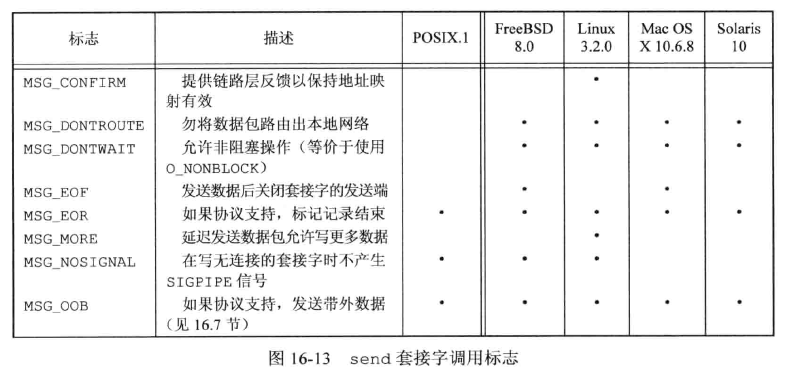

send 成功返回，只代表数据已经被无错误地发送到网络驱动程序上了，不表示另一端的进程就一定接受了数据。  

对于支持报文边界的协议，如果尝试发送的单个报文长度超过协议所支持的最大长度，send 调用失败并将 errno 设置为 EMSGSIZE。对于字节流协议，send 会阻塞直到整个数据传输完成。  


sendto 函数类似 send，但可以在无连接的套接字上指定一个目标地址：

```c
#include <sys/socket.h>

ssize_t sendto(int sockfd, const void *buf, size_t nbytes, int flags, const struct sockaddr *destaddr, socklen_t destlen);
		// 成功则返回发送的字节数，出错返回-1
```


sendmsg 函数可以指定多重缓冲区传输数据，类似于 writev 函数：

```c
#include <sys/socket.h>

ssize_t sendmsg(int sockfd, const struct msghdr *msg, int flags);
		// 成功则返回发送的字节数，出错返回-1
```

参数 msg 指针是指向 msghdr 结构体的，POSIX.1 定义了该结构体至少包含以下成员：

```c
struct msghdr {
  void			*msg_name;		/* 可选地址 */
  socklen_t		msg_namelen;
  struct iovec	*msg_iov;		/* 缓冲I/O数组 */
  int			msg_iovlen;
  void			*msg_control;	/* 辅助数据 */
  socklen_t		msg_controllen;
  int			msg_flags;		/* 接收消息的标志 */
    /* ... omit ... */
};
```


### recv、recvfrom、recvmsg 函数

recv 函数类似 read 函数，增加了标志控制如何接收数据：

```c
#include <sys/socket.h>

ssize_t recv(int sockfd, size_t nbytes, int flags);
		// 成功则返回数据的字节长度，无可用数据或对等方已按序结束返回0，出错返回-1
```

flags 标志：

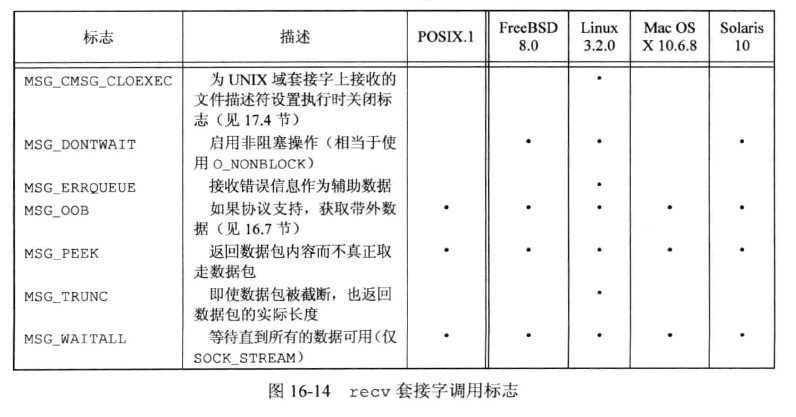


recvfrom 函数可以获取发送者的源地址：

```c
#include <sys/socket.h>

ssize_t recvfrom(int sockfd, const void *restrict buf, size_t len, int flags, struct sockaddr *restrict addr, socklen_t *restrict addrlen);
		// 成功则返回数据的字节长度，若无可用数据或对等方已经按序结束返回0，出错返回-1
```

如果 addr 参数非空，将包含数据发送者的套接字端点地址。 addrlen 参数指向的整数表示 addr 所指向的缓冲区字节长度，返回时该整数被设为该地址的实际字节长度。  

recvfrom 通常用于无连接套接字。  


为了将接收到的数据送入多个缓冲区，或者接收辅助数据，可以使用 recvmsg 函数：

```c
#include <sys/socket.h>

ssize_t recvmsg(int sockfd, const struct msghdr *msg, int flags);
		// 成功则返回数据的字节长度，若无可用数据或对等方已经按序结束返回0，出错返回-1
```

flags 标志：

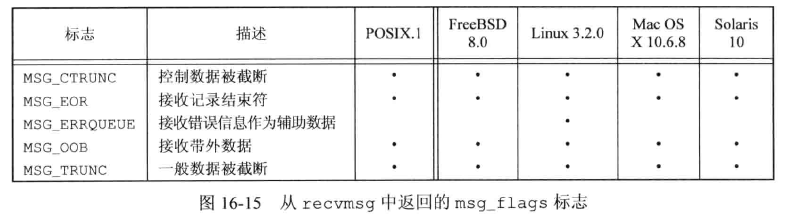

### 示例：面向连接的客户端和服务器

客户端，连接服务器获取uptime信息：

```c
#include "apue.h"
#include <netdb.h>
#include <errno.h>
#include <sys/socket.h>

#define BUFLEN		128

#define MAXSLEEP 128

/* 这里的返回值含义变为 fd，表示已连接的套接字描述符 */ 
int connect_retry(int domain, int type, int protocol, const struct sockaddr *addr, socklen_t alen){
    int numsec,fd ;
    /* 指数补偿策略循环，每次调用 socket 函数，重新获取 fd */
    for(numsec = 1; numsec <= MAXSLEEP; numsec <<= 1){
        if((fd  = socket(domain, type, protocol)) < 0)
            return(-1);
        
        if(connect(fd, addr, alen) == 0){
            return(fd);
        }
        close(fd);
        
        if(numsec <= MAXSLEEP/2)
            sleep(numsec);
    }
    /* 超过时间 MAXSLEEP 返回错误-1 */
    return(-1);
}

void
print_uptime(int sockfd)
{
	int		n;
	char	buf[BUFLEN];

	while ((n = recv(sockfd, buf, BUFLEN, 0)) > 0)
		write(STDOUT_FILENO, buf, n);
	if (n < 0)
		err_sys("recv error");
}

int
main(int argc, char *argv[])
{
	struct addrinfo	*ailist, *aip;
	struct addrinfo	hint;
	int				sockfd, err;

	if (argc != 2)
		err_quit("usage: ruptime hostname");
	memset(&hint, 0, sizeof(hint));
	hint.ai_socktype = SOCK_STREAM;
	hint.ai_canonname = NULL;
	hint.ai_addr = NULL;
	hint.ai_next = NULL;
	if ((err = getaddrinfo(argv[1], "ruptime", &hint, &ailist)) != 0)
		err_quit("getaddrinfo error: %s", gai_strerror(err));
	for (aip = ailist; aip != NULL; aip = aip->ai_next) {
		if ((sockfd = connect_retry(aip->ai_family, SOCK_STREAM, 0,
		  aip->ai_addr, aip->ai_addrlen)) < 0) {
			err = errno;
		} else {
			print_uptime(sockfd);
			exit(0);
		}
	}
	err_exit(err, "can't connect to %s", argv[1]);
}

```


服务器，为客户端提供 uptime 输出：

```c
#include "apue.h"
#include <netdb.h>
#include <errno.h>
#include <syslog.h>
#include <sys/socket.h>

#define BUFLEN	128
#define QLEN 10

#ifndef HOST_NAME_MAX
#define HOST_NAME_MAX 256
#endif


int initserver(int type, const struct sockaddr *addr, socklen_t alen, int qlen){
    int fd;
    int err = 0;
    
    if((fd = socket(addr->sa_family, type, 0)) < 0)
        return(-1);
    
    if(bind(fd, addr, alen) < 0)
        goto errout;
    if(type == SOCK_STREAM || type == SOCK_SEQPACKET) {
        if(listen(fd, qlen) < 0)
            goto errout;
    }
    return(fd);
    
errout:
    err = errno;
    close(fd);
    errno = err;
    return(-1);
}

void
serve(int sockfd)
{
	int		clfd;
	FILE	*fp;
	char	buf[BUFLEN];

	set_cloexec(sockfd);
	for (;;) {
		if ((clfd = accept(sockfd, NULL, NULL)) < 0) {
			syslog(LOG_ERR, "ruptimed: accept error: %s",
			  strerror(errno));
			exit(1);
		}
		set_cloexec(clfd);
		if ((fp = popen("/usr/bin/uptime", "r")) == NULL) {
			sprintf(buf, "error: %s\n", strerror(errno));
			send(clfd, buf, strlen(buf), 0);
		} else {
			while (fgets(buf, BUFLEN, fp) != NULL)
				send(clfd, buf, strlen(buf), 0);
			pclose(fp);
		}
		close(clfd);
	}
}

int
main(int argc, char *argv[])
{
	struct addrinfo	*ailist, *aip;
	struct addrinfo	hint;
	int				sockfd, err, n;
	char			*host;

	if (argc != 1)
		err_quit("usage: ruptimed");
	if ((n = sysconf(_SC_HOST_NAME_MAX)) < 0)
		n = HOST_NAME_MAX;	/* best guess */
	if ((host = malloc(n)) == NULL)
		err_sys("malloc error");
	if (gethostname(host, n) < 0)
		err_sys("gethostname error");
	daemonize("ruptimed");
	memset(&hint, 0, sizeof(hint));
	hint.ai_flags = AI_CANONNAME;
	hint.ai_socktype = SOCK_STREAM;
	hint.ai_canonname = NULL;
	hint.ai_addr = NULL;
	hint.ai_next = NULL;
	if ((err = getaddrinfo(host, "ruptime", &hint, &ailist)) != 0) {
		syslog(LOG_ERR, "ruptimed: getaddrinfo error: %s",
		  gai_strerror(err));
		exit(1);
	}
	for (aip = ailist; aip != NULL; aip = aip->ai_next) {
		if ((sockfd = initserver(SOCK_STREAM, aip->ai_addr,
		  aip->ai_addrlen, QLEN)) >= 0) {
			serve(sockfd);
			exit(0);
		}
	}
	exit(1);
}

```

执行：

```bash
# vim /etc/services
## 编辑本地 services 文件，增加 ruptime 服务和空闲端口
# 服务端
# ./ruptimed 
[root@server-222 ~]# ps -ef|grep ruptimed
root       38320       1 28 01:20 ?        00:00:00 ./ruptimed
# 客户端
[root@server-222 ~]# ./client server-222
 01:21:10 up 29 days, 22:06,  2 users,  load average: 0.00, 0.00, 0.00


```


另一个服务器端示例，服务器 fork 子程序，然后将 uptime 命令的标准输出和标准错误关联到客户端端点的套接字上：

```c
#include "apue.h"
#include <netdb.h>
#include <errno.h>
#include <syslog.h>
#include <fcntl.h>
#include <sys/socket.h>
#include <sys/wait.h>

#define QLEN 10

#ifndef HOST_NAME_MAX
#define HOST_NAME_MAX 256
#endif

extern int initserver(int, const struct sockaddr *, socklen_t, int);

void
serve(int sockfd)
{
	int		clfd, status;
	pid_t	pid;

	set_cloexec(sockfd);
	for (;;) {
		if ((clfd = accept(sockfd, NULL, NULL)) < 0) {
			syslog(LOG_ERR, "ruptimed: accept error: %s",
			  strerror(errno));
			exit(1);
		}
		if ((pid = fork()) < 0) {
			syslog(LOG_ERR, "ruptimed: fork error: %s",
			  strerror(errno));
			exit(1);
		} else if (pid == 0) {	/* child */
			/*
			 * The parent called daemonize ({Prog daemoninit}), so
			 * STDIN_FILENO, STDOUT_FILENO, and STDERR_FILENO
			 * are already open to /dev/null.  Thus, the call to
			 * close doesn't need to be protected by checks that
			 * clfd isn't already equal to one of these values.
			 */
			if (dup2(clfd, STDOUT_FILENO) != STDOUT_FILENO ||
			  dup2(clfd, STDERR_FILENO) != STDERR_FILENO) {
				syslog(LOG_ERR, "ruptimed: unexpected error");
				exit(1);
			}
			close(clfd);
			execl("/usr/bin/uptime", "uptime", (char *)0);
			syslog(LOG_ERR, "ruptimed: unexpected return from exec: %s",
			  strerror(errno));
		} else {		/* parent */
			close(clfd);
			waitpid(pid, &status, 0);
		}
	}
}

int
main(int argc, char *argv[])
{
	struct addrinfo	*ailist, *aip;
	struct addrinfo	hint;
	int				sockfd, err, n;
	char			*host;

	if (argc != 1)
		err_quit("usage: ruptimed");
	if ((n = sysconf(_SC_HOST_NAME_MAX)) < 0)
		n = HOST_NAME_MAX;	/* best guess */
	if ((host = malloc(n)) == NULL)
		err_sys("malloc error");
	if (gethostname(host, n) < 0)
		err_sys("gethostname error");
	daemonize("ruptimed");
	memset(&hint, 0, sizeof(hint));
	hint.ai_flags = AI_CANONNAME;
	hint.ai_socktype = SOCK_STREAM;
	hint.ai_canonname = NULL;
	hint.ai_addr = NULL;
	hint.ai_next = NULL;
	if ((err = getaddrinfo(host, "ruptime", &hint, &ailist)) != 0) {
		syslog(LOG_ERR, "ruptimed: getaddrinfo error: %s",
		  gai_strerror(err));
		exit(1);
	}
	for (aip = ailist; aip != NULL; aip = aip->ai_next) {
		if ((sockfd = initserver(SOCK_STREAM, aip->ai_addr,
		  aip->ai_addrlen, QLEN)) >= 0) {
			serve(sockfd);
			exit(0);
		}
	}
	exit(1);
}
```


### 示例：无连接的客户端和服务器

UDP 版本（SOCK_DGRAM），客户端：

```c
#include "apue.h"
#include <netdb.h>
#include <errno.h>
#include <sys/socket.h>

#define BUFLEN		128
#define TIMEOUT		20

void
sigalrm(int signo)
{
}

void
print_uptime(int sockfd, struct addrinfo *aip)
{
	int		n;
	char	buf[BUFLEN];

	buf[0] = 0;
	if (sendto(sockfd, buf, 1, 0, aip->ai_addr, aip->ai_addrlen) < 0)
		err_sys("sendto error");
	alarm(TIMEOUT);
	if ((n = recvfrom(sockfd, buf, BUFLEN, 0, NULL, NULL)) < 0) {
		if (errno != EINTR)
			alarm(0);
		err_sys("recv error");
	}
	alarm(0);
	write(STDOUT_FILENO, buf, n);
}

int
main(int argc, char *argv[])
{
	struct addrinfo		*ailist, *aip;
	struct addrinfo		hint;
	int					sockfd, err;
	struct sigaction	sa;

	if (argc != 2)
		err_quit("usage: ruptime hostname");
	sa.sa_handler = sigalrm;
	sa.sa_flags = 0;
	sigemptyset(&sa.sa_mask);
	if (sigaction(SIGALRM, &sa, NULL) < 0)
		err_sys("sigaction error");
	memset(&hint, 0, sizeof(hint));
	hint.ai_socktype = SOCK_DGRAM;
	hint.ai_canonname = NULL;
	hint.ai_addr = NULL;
	hint.ai_next = NULL;
	if ((err = getaddrinfo(argv[1], "ruptime", &hint, &ailist)) != 0)
		err_quit("getaddrinfo error: %s", gai_strerror(err));

	for (aip = ailist; aip != NULL; aip = aip->ai_next) {
		if ((sockfd = socket(aip->ai_family, SOCK_DGRAM, 0)) < 0) {
			err = errno;
		} else {
			print_uptime(sockfd, aip);
			exit(0);
		}
	}

	fprintf(stderr, "can't contact %s: %s\n", argv[1], strerror(err));
	exit(1);
}

```


服务器：

```c
#include "apue.h"
#include <netdb.h>
#include <errno.h>
#include <syslog.h>
#include <sys/socket.h>

#define BUFLEN		128
#define MAXADDRLEN	256

#ifndef HOST_NAME_MAX
#define HOST_NAME_MAX 256
#endif

int initserver(int type, const struct sockaddr *addr, socklen_t alen, int qlen){
    int fd;
    int err = 0;

    if((fd = socket(addr->sa_family, type, 0)) < 0)
        return(-1);

    if(bind(fd, addr, alen) < 0)
        goto errout;
    if(type == SOCK_STREAM || type == SOCK_SEQPACKET) {
        if(listen(fd, qlen) < 0)
            goto errout;
    }
    return(fd);

errout:
    err = errno;
    close(fd);
    errno = err;
    return(-1);
}


void
serve(int sockfd)
{
	int				n;
	socklen_t		alen;
	FILE			*fp;
	char			buf[BUFLEN];
	char			abuf[MAXADDRLEN];
	struct sockaddr	*addr = (struct sockaddr *)abuf;

	set_cloexec(sockfd);
	for (;;) {
		alen = MAXADDRLEN;
		if ((n = recvfrom(sockfd, buf, BUFLEN, 0, addr, &alen)) < 0) {
			syslog(LOG_ERR, "ruptimed: recvfrom error: %s",
			  strerror(errno));
			exit(1);
		}
		if ((fp = popen("/usr/bin/uptime", "r")) == NULL) {
			sprintf(buf, "error: %s\n", strerror(errno));
			sendto(sockfd, buf, strlen(buf), 0, addr, alen);
		} else {
			if (fgets(buf, BUFLEN, fp) != NULL)
				sendto(sockfd, buf, strlen(buf), 0, addr, alen);
			pclose(fp);
		}
	}
}

int
main(int argc, char *argv[])
{
	struct addrinfo	*ailist, *aip;
	struct addrinfo	hint;
	int				sockfd, err, n;
	char			*host;

	if (argc != 1)
		err_quit("usage: ruptimed");
	if ((n = sysconf(_SC_HOST_NAME_MAX)) < 0)
		n = HOST_NAME_MAX;	/* best guess */
	if ((host = malloc(n)) == NULL)
		err_sys("malloc error");
	if (gethostname(host, n) < 0)
		err_sys("gethostname error");
	daemonize("ruptimed");
	memset(&hint, 0, sizeof(hint));
	hint.ai_flags = AI_CANONNAME;
	hint.ai_socktype = SOCK_DGRAM;
	hint.ai_canonname = NULL;
	hint.ai_addr = NULL;
	hint.ai_next = NULL;
	if ((err = getaddrinfo(host, "ruptime", &hint, &ailist)) != 0) {
		syslog(LOG_ERR, "ruptimed: getaddrinfo error: %s",
		  gai_strerror(err));
		exit(1);
	}
	for (aip = ailist; aip != NULL; aip = aip->ai_next) {
		if ((sockfd = initserver(SOCK_DGRAM, aip->ai_addr,
		  aip->ai_addrlen, 0)) >= 0) {
			serve(sockfd);
			exit(0);
		}
	}
	exit(1);
}

```

执行：

```bash
$ vim /etc/services
## 新增udp服务 ruptime
# Local services
#ruptime         59898/tcp
#ruptime         59898/udp
## 运行服务端
$ sudo ./16.20
## 查看监听端口
$ netstat -unlp
$ sudo netstat -unlp |grep 59898
udp        0      0 127.0.1.1:59898         0.0.0.0:*                           3026/./16.20
## 客户端
$ ./16.19 xmy
 15:27:09 up  4:41,  3 users,  load average: 0.01, 0.01, 0.00


```


## 套接字选项

套接字机制提供了两个套接字选项接口，来控制套接字行为：一个用来设置，一个用来查询状态。可以设置或查询以下 3 种选项：

* 通用选项，工作在所有套接字类型上。
* 在套接字层次管理的选项，但是依赖于下层协议的支持。
* 特定于某协议的选项，每个协议独有的。

SUS 定义了套接字层的选项，即上面选项前两种。  

设置选项的函数：

```c
#include <sys/socket.h>

int setsockopt(int sockfd, int level, int option, const void *val, socklen_t len);
		// 成功返回0，出错返回-1
```

参数 level 表示选项应用的协议：

* SOL_SOCKET：通用的套接字层次选项。
* IPPROTO_TCP：TCP协议。
* IPPROTO_IP：IP协议。

参数 val 的类型取决于 level ，可能指向一个数据结构或整数。作为开关时，一般0为关闭，大于0为启用。  

参数 len 指定了 val 指向的对象大小。

SUS 中定义的通用套接字层选项：

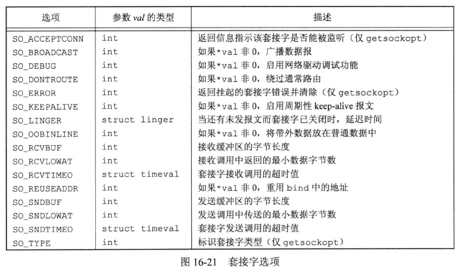


查询选项的函数：

```c
#include <sys/socket.h>

int getsockopt(int sockfd, int level, int option, void *restrict val, socklen_t *restrict lenp);
		// 成功返回0，出错返回-1
```

lenp 是一个指向整数的指针。在调用 getsockopt 之前，设置该整数为选项缓冲区的长度。

* 选项实际长度大于此值，则选项会被截断。
* 选项实际长度小于此值，返回时将更新此值为实际长度。


示例：地址复用  

前面示例中的 initserver 例程，在服务器终止后并尝试立即重启时，函数将无法正常工作。因为通常除非超时（一般是几分钟）， 否则 TCP 实现不允许重用同一个地址。但通过设置套接字选项 SO_REUSEADDR 可以解除这个限制：

```c
#include "apue.h"
#include <errno.h>
#include <sys/socket.h>

int
initserver(int type, const struct sockaddr *addr, socklen_t alen,
  int qlen)
{
	int fd, err;
	int reuse = 1;

	if ((fd = socket(addr->sa_family, type, 0)) < 0)
		return(-1);
    /* 传递非零值 reuse 给函数 */
	if (setsockopt(fd, SOL_SOCKET, SO_REUSEADDR, &reuse,
	  sizeof(int)) < 0)
		goto errout;
	if (bind(fd, addr, alen) < 0)
		goto errout;
	if (type == SOCK_STREAM || type == SOCK_SEQPACKET)
		if (listen(fd, qlen) < 0)
			goto errout;
	return(fd);

errout:
	err = errno;
	close(fd);
	errno = err;
	return(-1);
}

```


## 带外数据

相比普通数据，**带外数据(out-of-band data)**是一些通信协议所支持的可选功能，可以以较高优先级先行传输。TCP 支持带外数据，但是 UDP 不支持。套接字接口对带外数据的支持取决于具体实现。  

TCP 将带外数据称为**紧急数据(urgent data)**。TCP 仅支持一个字节的紧急数据，但是允许紧急数据在普通数据传递机制之外传输。可以在几个 send 函数中指定 MSG_OOB 标志，携带 MSG_OOB 标志发送的字节数超过一个时，最后一个字节将被视为紧急数据字节。  

如果套接字安排了信号的产生，在接收紧急数据时，会发送 SIGURG 信号。fcntl 函数中使用 F_SETOWN 命令可以设置一个套接字的所有权。如果 fcntl 第三个参数为正值，代表的就是进程 ID，如果为非 -1 的负值，代表的是进程组 ID。F_GETOWN 可以获取当前套接字所有权，负值代表进程组 ID，正值代表进程 ID。  

```c
/* 通过调用以下函数安排进程接收套接字的信号 */
fcntl(sockfd, F_SETOWN, pid);
/* 获取接收套接字信号的进程或进程组 ID */
owner = fcntl(sockfd, F_GETOWN, 0);
```


TCP 支持**紧急标记(urgent mark)**的概念，也就是在普通数据流中紧急数据所在的位置。如果采用套接字选项 SO_OOBINLINE，那么可以在普通数据中接收紧急数据。帮助判断是否已经到达紧急标记的函数：

```c
#include <sys/socket.h>

int sockatmark(int sockfd);
		// 若在标记处返回1，没在标记处返回0，出错返回-1
```

当下一个要读取的字节在紧急标志处时，sockatmark 返回 1。

带外数据出现在读取队列时，select 函数会返回一个文件描述符并带有一个待处理的异常条件。可以在普通数据流上接收紧急数据，也可以在其中一个 recv 函数中采用 MSG_OOB 标志在其它队列数据之前接收紧急数据。TCP 队列仅用一个字节的紧急数据。如果接收当前紧急数据之前又有新的紧急数据，那么已有的字节会被丢弃。  


## 非阻塞和异步 I/O

通常 recv 函数在没有数据可用时会阻塞等待，套接字输出队列没有足够空间发送消息时，send 函数也会阻塞。而在套接字非阻塞模式下，函数不会阻塞而是失败，errno 设置为 EWOULDBLOCK 或 EAGAIN，此时可以使用 poll 或 select 判断能否接受或发送数据。  

SUS 包含通用异步 I/O 机制的支持，套接字由自己的异步 I/O 处理方式，这在 SUS 中没有标准化。套接字的异步 I/O 机制也被称为 “基于信号的 I/O”，以区别于 SUS 中的通用异步 I/O 机制。  

基于套接字的异步 I/O 中，当从套接字中读取数据时，或当套接字写队列中空间变为可用时，可以安排要发送的信号 SIGIO。  

启用异步 I/O 是一个两步骤的过程：

1. 建立套接字所有权，这样信号可以被传递到合适的进程。有 3 种方式：
   1. 在 fcntl 中使用 F_SETOWN 命令。
   2. 在 ioctl 中使用 FIOSETOWN 命令。
   3. 在 ioctl 中使用 SIOCSPGRP 命令。
2. 通知套接字当 I/O 操作不会阻塞时发信号。有两个选择：
   1. 在 fcntl 中使用 F_SETFL 命令并且启用文件标志 O_ASYNC。
   2. 在 ioctl 中使用 FIOASYNC 命令。


各个实现对套接字异步 I/O 选项的支持：

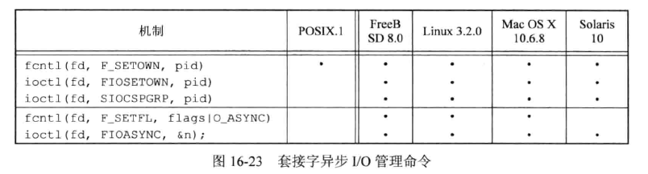


