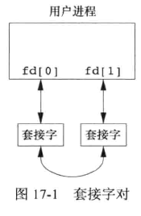
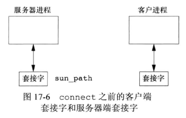
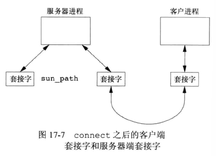
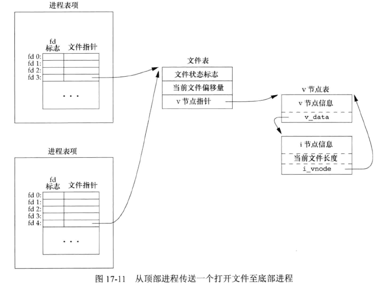

## 引言


主要介绍 UNIX 域套接字机制。可以在同一计算机系统上运行的两个进程之间传送打开文件描述符。服务进程可以使它们的打开文件描述符与指定的名字相关联，同一系统上运行的客户进程可以使用这些名字与服务器进程汇聚。


## UNIX 域套接字

UNIX 域套接字用于在同一台计算机上运行的进程之间的通信。相比因特网域套接字效率更高，因为它仅仅复制数据，并不执行协议处理，不需要添加或删除网络报头、计算校验和、产生序号、发送确认报文等工作。  

UNIX 域套接字提供流和数据报两种接口。UNIX 域数据报服务是可靠的，既不会丢失报文也不会传递出错。UNIX 域套接字就像套接字和管道的混合。  

可以使用它们面向网络的域套接字接口或者使用 socketpair 函数来创建一对无命名的、相互连接的 UNIX 域套接字。


### socketpair 函数

```c
#include <sys/socket.h>

int socketpair(int domain, int type, int protocol, int sockfd[2]);
		// 成功返回0，出错则返回-1
```

接口足够通用允许 socketpair 用于其它域，但一般来说操作系统仅对 UNIX 域提供支持。  

一对相互连接的 UNIX 域套接字可以起到全双工管道的作用：两端对读和写开放。将其称为**fd管道(fd-pipe)**，以便与普通半双工管道区分。如下图：




示例：使用 socketpair 函数创建一个全双工管道

```c
#include "apue.h"
#include <sys/socket.h>

int fd_pipe(int fd[2]){
    return(socketpair(AF_UNIX, SOCK_STREAM, 0, fd));
}
```


### 示例：借助 UNIX 域套接字轮询 XSI 消息队列


使用 UNIX域套接字轮询消息队列，17.3.c：

```c
#include "apue.h"
#include <poll.h>
#include <pthread.h>
#include <sys/msg.h>
#include <sys/socket.h>

/* 队列数量 */
#define NQ  3
/* 最大消息 size */
#define MAXMSZ  512
/* 第一个消息队列的 key */
#define KEY 0x123

/* 线程关联的队列和fd信息 */
struct threadinfo{
    int qid;
    int fd;
};

/* 消息体 */
struct mymesg{
    long mtype;
    char mtext[MAXMSZ];
};

void *helper(void *arg){
    int     n;
    struct mymesg   m;
    struct threadinfo *tip = arg;

    for(;;){
        /* 初始化m，接收消息 */
        memset(&m, 0, sizeof(m));
        /* 根据 tip->qid 中存放的key，从对应消息队列取消息*/
        if((n = msgrcv(tip->qid, &m, MAXMSZ, 0, MSG_NOERROR)) < 0)
            err_sys("msgrcv error");
        /* 将取出的消息写到 tip->fd，即线程标准输出 */
        if(write(tip->fd, m.mtext, n) < 0)
            err_sys("write error");
    }
}

int main(){
    int i, n, err;
    int fd[2];
    int qid[NQ];
    struct pollfd pfd[NQ];
    struct threadinfo ti[NQ];
    pthread_t   tid[NQ];
    char    buf[MAXMSZ];

    /* 初始化线程和消息队列 */
    for(i = 0; i<NQ; i++){
        /* 从地址 KEY 开始，每次循环通过 msgget 创建一个 IPC，将对应 key 存放在 qid 数组中 */
        if((qid[i] = msgget((KEY+i), IPC_CREAT|0666)) < 0)
            err_sys("msgget error");

        printf("queue ID %d is %d\n", i, qid[i]);

        /* 创建 UNIX 域套接字，使用 SOCK_DGRAM(默认UDP) 类型，保证消息边界，一次一条的取数据 */
        if(socketpair(AF_UNIX, SOCK_DGRAM, 0, fd) < 0)
            err_sys("socketpair error");

        /* pfd 存放 poll 函数相关 fd，event事件类型为 POLLIN */
        pfd[i].fd = fd[0];
        pfd[i].events = POLLIN;
        /* 存放线程与对应消息队列、fd 关联信息 */
        ti[i].qid = qid[i];
        ti[i].fd = fd[1];
        /* 创建线程，执行 helper 函数，传入 threadinfo  */
        if(( err = pthread_create(&tid[i], NULL, helper, &ti[i])) != 0)
            err_exit(err, "pthread_create error");
    }

    /* 使用 poll 函数等待消息  */
    for(;;){
        if(poll(pfd, NQ, -1) < 0)
            err_sys("poll error");
        /* */
        for(i = 0; i<NQ ; i++){
            if(pfd[i].revents & POLLIN){
                if((n = read(pfd[i].fd, buf, sizeof(buf))) < 0)
                    err_sys("read error");
                    
                buf[n] = 0;
                printf("queue id %d, message %s\n", qid[i], buf);
            }
        }
    }
    exit(0);
}

```


发送消息 17.4.c：

```c
#include "apue.h"
#include <sys/msg.h>

#define MAXMSZ 512

/* 消息体 */
struct mymesg{
    long mtype;
    char mtext[MAXMSZ];
};

int main(int argc, char *argv[]){
    key_t key;
    long qid;
    size_t nbytes;
    struct mymesg m;

    /* 2个参数分别是消息队列地址、消息内容 */
    if(argc != 3){
        fprintf(stderr, "usage: sendmsg KEY message\n");
        exit(1);
    }


    /* 转换消息地址为long类型 */
    key = strtol(argv[1], NULL, 0);
    /* 从队列中获取消息 */
    if((qid = msgget(key, 0)) < 0)
        err_sys("can't open queue key %s", argv[1]);

    /* 将 m 置零，用于存放消息 */
    memset(&m, 0, sizeof(m));
    strncpy(m.mtext, argv[2], MAXMSZ-1);
    nbytes = strlen(m.mtext);
    m.mtype = 1;
    /* 发送消息 */
    if(msgsnd(qid, &m, nbytes, 0) < 0)
        err_sys("can't send message");

    exit(0);

}
```


执行：

```bash
$ ../gcc_a ./17.3.c 
$ ../gcc_a ./17.4.c 
## 运行服务端，启动3个消息队列
$ ./17.3 &
[1] 1578
queue ID 0 is 0
queue ID 1 is 1
queue ID 2 is 2
## 运行发送消息的客户端，指定起始地址 0x123、消息内容
$ ./17.4 0x123 "hello, world"
queue id 0, message hello, world
$ ./17.4 0x124 "hello, IPC"
queue id 1, message hello, IPC
$ ./17.4 0x124 "bye"
queue id 1, message bye
$ ./17.4 0x125 "bye"
queue id 2, message bye
## 这里超过3个消息的地址，返回出错
$ ./17.4 0x126 "bye"
can't open queue key 0x126: No such file or directory
$ 
```


### 命名 UNIX 域套接字

socketpair 函数可以创建一对相互连接的套接字，但是套接字都没有名字，无关进程不能使用它们。  

和因特网域套接字一样，也可以命名 UNIX 域套接字，用于告示服务。套接字地址格式会随实现而变。UNIX 域套接字的地址由 sockaddr_un 结构体表示。

Linux 3.2.0 、Solaris 10 中定义在 <sys/un.h> 头文件中：

```c
struct sockaddr_un {
    sa_family_t sun_family;
    char 		sun_path[108];
}
```

FreeBSD、Mac OS X 10.6.8 中定义：

```c
struct sockaddr_un {
    unsigned char sun_len;
    sa_family_t sun_family;
    char 		sun_path[104];
}
```

sockaddr_un 结构体的 sun_path 成员包含一个路径名。我们将一个地址绑定到一个 UNIX 域套接字时，系统会用该路径名创建一个 S_IFSOCK 类型的文件。  

该文件仅用于向客户进程告示套接字名字。该文件无法打开，也不能由应用程序用于通信。  

如果试图绑定同一地址时，该文件已经存在，bind 请求将会失败。当关闭套接字时，并不会自动删除该文件，所以必须确保在应用程序退出前，对该文件执行解除链接操作。    

示例：

```c
#include "apue.h"
#include <sys/socket.h>
#include <sys/un.h>

int main(void){
    int fd, size;
    struct sockaddr_un un;
    
    un.sun_family = AF_UNIX;
    strcpy(un.sun_path, "foo.socket");
    if((fd = socket(AF_UNIX, SOCK_STREAM, 0)) < 0)
        err_sys("socket failed");
    
    /* 计算绑定地址长度，通过计算sum_path在sockaddr_un中的偏移量，再加上路径名长度 */
    size = offsetof(struct sockaddr_un, sun_path) + strlen(un.sun_path);
    if(bind(fd, (struct sockaddr *)&un, size) < 0)
        err_sys("bind failed");
    
    printf("UNIX domain socket bound\n");
    exit(0);
}

```

由于 sockaddr_un 结构体中 sun_path 的位置与实现相关，apue.h 里包含了 <stddef.h> 头文件，该头文件定义了一个宏函数用来计算偏移量：

```c
#define offsetof(TYPE, MEMBER) ((int)&((TYPE *)0)->MEMBER)
```

假定该结构从地址 0 开始，此表达式求得成员起始地址的整型值。    


运行示例：

```bash
$ ../gcc_a ./17.5.c 
$ ./17.5 
UNIX domain socket bound
$ ls -l foo.socket 
srwxrwxr-x 1 xmy xmy 0 Apr  3 17:51 foo.socket
$ ./17.5 
bind failed: Address already in use
$ rm foo.socket 
$ ./17.5 
UNIX domain socket bound
$ 
```


## 唯一连接

服务器可以使用标准 bind、listen、accept 函数，为客户进程安排一个唯一 UNIX 域连接。客户进程使用 connect 与服务器进程联系。在服务器进程接受了 connect 请求后，在服务器进程和客户进程之间就存在了唯一连接。  






实现三个函数，可以在运行在同一台计算机上两个无关进程之间创建唯一连接。模仿之前的面向连接的套接字函数：

```c
#include "apue.h"

int serv_listen(const char *name);
		// 成功返回要监听的文件描述符，出错返回负值

int serv_accept(int listenfd, uid_t *uidptr);
		// 成功返回新文件描述符，出错返回负值

int cli_conn(const char *name);
		// 成功返回文件描述符，出错返回负值
```

* 服务器进程可以调用 serv_listen 函数声明要在某个路径上监听客户端进程的连接请求。返回值是用于接收客户端进程连接请求的服务器 UNIX 域套接字。
* 服务器可以使用 serv_accept 函数等待客户端进程连接请求的到达。当一个请求到达时，系统会自动创建一个新的 UNIX 域套接字，并将它与客户端套接字连接，最后将这个新套接字返回给服务器。客户端进程的有效用户 ID 会存放在 uidptr 指向的存储区中。
* 客户端进程调用 cli_conn 函数连接至服务器进程。客户端进程指定的 name 参数必须与服务器进程调用 serv_listen 函数时所用的名字一致。函数返回连接到服务器进程的文件描述符。  


### serv_listen函数


```c
#include "apue.h"
#include <sys/socket.h>
#include <sys/un.h>
#include <errno.h>


#define QLEN 10


int serv_listen(const char *name){
    int fd, len, err, rval;

    struct sockaddr_un un;

    if(strlen(name) >= sizeof(un.sun_path)) {
        errno = ENAMETOOLONG;
        return(-1);
    }

    /* 创建 UNIX 域套接字, SOCK_STREAM 类型 */
    if((fd = socket(AF_UNIX, SOCK_STREAM, 0)) < 0)
        return(-2);

    unlink(name);

    /* 清空 un 结构体，对各个成员赋值 */
    memset(&un, 0, sizeof(un));
    un.sun_family = AF_UNIX;
    strcpy(un.sun_path, name);
    len = offsetof(struct sockaddr_un, sun_path) + strlen(name);

    /* 关联 fd 和地址 */
    if(bind(fd, (struct sockaddr *)&un, len)<0){
        rval = -3;
        goto errout;
    }

    /* 宣告监听 fd */
    if(listen(fd, QLEN)<0){
        rval = -4;
        goto errout;
    }

    return(fd);

errout:
    err = errno;
    close(fd);
    errno = err;
}
```

首先调用 socket 创建一个 UNIX 域套接字。然后将要监听的路径名填写到的 sockaddr_un 结构体，调用 bind 函数。最后调用 listen 函数通知内核该进程将作为服务器进程等待客户进程的连接请求。  


当收到一个客户端进程的连接请求，服务器进程调用 serv_accept 函数。


### serv_accept 函数


```c
#include "apue.h"
#include <sys/socket.h>
#include <sys/un.h>
#include <time.h>
#include <errno.h>

#define	STALE	30	/* client's name can't be older than this (sec) */

int serv_accept(int listenfd, uid_t *uidptr){
	int					clifd, err, rval;
	socklen_t			len;
	time_t				staletime;
	struct sockaddr_un	un;
	struct stat			statbuf;
	char				*name;

	/* allocate enough space for longest name plus terminating null */
	if ((name = malloc(sizeof(un.sun_path + 1))) == NULL)
		return(-1);
	len = sizeof(un);
	if ((clifd = accept(listenfd, (struct sockaddr *)&un, &len)) < 0) {
		free(name);
		return(-2);		/* often errno=EINTR, if signal caught */
	}

	/* obtain the client's uid from its calling address */
	len -= offsetof(struct sockaddr_un, sun_path); /* len of pathname */
	memcpy(name, un.sun_path, len);
	name[len] = 0;			/* null terminate */
	if (stat(name, &statbuf) < 0) {
		rval = -3;
		goto errout;
	}

#ifdef	S_ISSOCK	/* not defined for SVR4 */
	if (S_ISSOCK(statbuf.st_mode) == 0) {
		rval = -4;		/* not a socket */
		goto errout;
	}
#endif

    /* 判断文件权限 */
	if ((statbuf.st_mode & (S_IRWXG | S_IRWXO)) ||
		(statbuf.st_mode & S_IRWXU) != S_IRWXU) {
		  rval = -5;	/* is not rwx------ */
		  goto errout;
	}

    /* 超过30秒(宏定义 STALE)客户端未活动就超时 */
	staletime = time(NULL) - STALE;
	if (statbuf.st_atime < staletime ||
		statbuf.st_ctime < staletime ||
		statbuf.st_mtime < staletime) {
		  rval = -6;	/* i-node is too old */
		  goto errout;
	}

	if (uidptr != NULL)
		*uidptr = statbuf.st_uid;	/* return uid of caller */
	unlink(name);		/* we're done with pathname now */
	free(name);
	return(clifd);

errout:
	err = errno;
	close(clifd);
	free(name);
	errno = err;
	return(rval);
}

```

服务器进程在调用 serv_accept 函数中阻塞，等待一个客户端进程调用 cli_conn。从 accept 中返回时，返回值是连接到客户端进程的崭新的描述符。accept 函数也经过其第二个参数返回客户进程赋值给其套接字的路径名。接着程序复制路径名，确保它是以 null 终止的。然后调用 stat 函数验证该路径确实是一个 UNIX 套接字、权限是 700(rwx------)。并且验证套接字相关时间(rtime、mtime、utime)不早于30秒前。  

经过上述检查，则可认为客户端进程的身份是该套接字的所有者。  


### cli_conn 函数


```c
#include "apue.h"
#include <sys/socket.h>
#include <sys/un.h>
#include <errno.h>

#define	CLI_PATH	"/var/tmp/"
#define	CLI_PERM	S_IRWXU			/* rwx for user only */

/*
 * Create a client endpoint and connect to a server.
 * Returns fd if all OK, <0 on error.
 */
int
cli_conn(const char *name)
{
	int					fd, len, err, rval;
	struct sockaddr_un	un, sun;
	int					do_unlink = 0;

	if (strlen(name) >= sizeof(un.sun_path)) {
		errno = ENAMETOOLONG;
		return(-1);
	}

	/* create a UNIX domain stream socket */
	if ((fd = socket(AF_UNIX, SOCK_STREAM, 0)) < 0)
		return(-1);

	/* fill socket address structure with our address */
	memset(&un, 0, sizeof(un));
	un.sun_family = AF_UNIX;
	sprintf(un.sun_path, "%s%05ld", CLI_PATH, (long)getpid());
printf("file is %s\n", un.sun_path);
	len = offsetof(struct sockaddr_un, sun_path) + strlen(un.sun_path);

	unlink(un.sun_path);		/* in case it already exists */
	if (bind(fd, (struct sockaddr *)&un, len) < 0) {
		rval = -2;
		goto errout;
	}
    /* 修改权限为 rwx------ */
	if (chmod(un.sun_path, CLI_PERM) < 0) {
		rval = -3;
		do_unlink = 1;
		goto errout;
	}

	/* fill socket address structure with server's address 
	 * 这里填充服务器的 sockaddr_un 结构体
	 */
	memset(&sun, 0, sizeof(sun));
	sun.sun_family = AF_UNIX;
	strcpy(sun.sun_path, name);
	len = offsetof(struct sockaddr_un, sun_path) + strlen(name);
	if (connect(fd, (struct sockaddr *)&sun, len) < 0) {
		rval = -4;
		do_unlink = 1;
		goto errout;
	}
	return(fd);

errout:
	err = errno;
	close(fd);
	if (do_unlink)
		unlink(un.sun_path);
	errno = err;
	return(rval);
}
```

调用 socket 函数创建 UNIX 域套接字的客户进程端，用客户进程的专有名字填入 sockaddr_un 结构体。  

绑定的路径名最后 5 个字符来自客户进程 ID。仅在该路径名已存在时调用 unlink。然后调用 bind 函数将名字赋给客户进程套接字 un ，这会在文件系统中创建一个套接字文件，名字和绑定的路径名一样(这里是在 /var/tmp/ 下)。后续通过 chmod 修改套接字文件权限。上面的 serv_accept 函数中，服务器进程检验权限以及套接字用户 ID等以验证客户端进程的身份。  

之后填充另一个 sockaddr_un 结构，绑定服务器进程指定的路径名。  

最后调用 connect 函数初始化与服务器进程的连接。  


## 传送文件描述符

在两个进程之间传送打开文件描述符是非常有用的。可以对客户端进程-服务器进程应用进行不同的设计。例如，服务器进程能够处理打开一个文件所要做的一切操作，包括翻译网络名、拨号、协商文件锁等，然后向客户端进程送回一个描述符，该描述符可以被用于以后的所有 I/O 函数。设计到打开文件、设备的所有细节对客户进程而言都是透明的。  

当两个进程打开同一文件时，它们共享同一个 V 节点，但各进程独自有一个文件表项。  

这里当一个进程向另一个进程传送一个**打开文件描述符**时，期望的是发送进程和接收进程共享同一个文件表项。  



技术实现上，是将指向一个打开文件表项的指针从一个进程发送到另一个进程。该指针被分配存放在接收进程的第一个可用描述符项中。  

当发送进程将描述符传送给接收进程后，通常会关闭该描述符。发送进程关闭该描述符并不会真的关闭该文件或设备，该描述符仍被视为由接收进程打开。  

有 3  个用于发送、接收文件描述符的函数。

```c
#include "apue.h"

int send_fd(int fd, int fd_to_send);
int send_err(int fd, int status, const char *errmsg);
		// 成功返回0，出错返回-1

int recv_fd(int fd, ssize_t (userfunc)(int, const void *, size_t));
		// 成功返回文件描述符，出错返回负值
```

当一个进程想将一个描述符传送给另一个进程时，可以调用 send_fd 或 send_err。等待接收描述符的进程调用 recv_fd。  

* send_fd 使用 fd 代表的 UNIX 域套接字发送描述符 fd_to_send。

* send_err 使用 fd 发送 errmsg 以及后随的 status 字节。status 的值应在 `-1 ~ -255`。 
* recv_fd 接收描述符，如果正常返回(发送者调用了 send_fd)则返回值为非负描述符，如果出错返回(发送者调用了 send_serr)则返回负值 status -1~-255。 
  * 如果服务器发送了一条出错消息，客户进程调用自己的 userfunc 函数处理该消息。userfunc 的第一个参数是常量 STDERR_FILENO，然后是指向出错消息的指针及其长度。userfunc 函数的返回值是已写的字节数或负的出错编号值。客户进程通常将普通的 write 函数指定为 userfunc。

书中实现用于这3个函数的协议：

* 为了发送一个描述符，send_fd 先发送 2 字节 0，然后是实际描述符。
* 为了发送一条出错消息，send_err 发送 errmsg，然后是 1 字节 0，最后是 status 字节的绝对值(1~255)。
* recv_fd 函数读取套接字中所有字节直到遇到 null 字符。null 字符之前的所有字符都传送给调用者的 userfunc。recv_fd 读取的下一个字节是状态(status)字节，若状态字节为 0，则表示一个描述符已传送过来，否则表示没有描述符可接收。

### send_err 函数

send_err 函数将出错消息写到套接字后，即调用 send_fd 函数。

```c
#include "apue.h"

int send_err(int fd, int errcode, const char *msg){
    int n;
    
    if((n = strlen(msg)) > 0)
        if(writen(fd, msg, n) != n)
            return(-1);
    
    if(errcode >= 0)
        errcode = -1;
    
    if(send_fd(fd, errcode) < 0)
        return(-1);
    
    return(0);
}
```


### 相关结构

为了用 UNIX 域套接字交换文件描述符，调用 sendmsg、recvmsg 函数，这两个函数都有一个指向 msghdr 结构体的指针，该结构包含了所有关于要发送或要接受的消息的信息。

#### msghdr 结构

定义大致如下：

```c
struct msghdr {
    void			*msg_name;
    socklen_t		msg_namelen;
    struct iovec	*msg_iov;
    int				msg_iovlen;
    void 			*msg_control;
    socklen_t		msg_controllen;
    int				msg_flags;
};
```

前两个元素通常用于在网络连接上发送数据报，其中目的地址可以由每个数据报指定。第 3、4 个元素可以指定一个由多个缓冲区构成的数组(散布读和聚集写)，这与对 readv 和 writev 函数的说明一样。msg_flags 字段包含了描述接收到的消息的标志。  

msg_control 字段指向 cmsghdr(控制头信息)结构，msg_controllen 字段包含控制信息的字节数。


#### cmsghdr 结构

```c
struct cmsghdr {
    socklen_t		cmsg_len;
    int				cmsg_level;
    int				cmsg_type;
};
```

发送文件描述符，将 cmsg_len 设置为 cmsghdr 结构的长度加一个整型的长度(描述符长度)，cmsg_level 字段设置为 SOL_SOCKET，cmsg_type 字段设置为 SCM_RIGHTS，用以表明在传送访问权。（SCM 是 Socket-level Control Message 的缩写，即**套接字级控制消息**）访问权仅能通过 UNIX 域套接字传送。描述符紧跟 cmsg_type 字段之后存储，用 CMSG_DATA 宏获得该整型量的指针。  


#### 宏：CMSG_DATA、CMSG_FIRSTHDR、CMSG_NXTHDR

定义了一些宏用于访问控制数据、帮助计算 cmsg_len 所使用的值：

```c
#include <sys/socket.h>

unsigned char *CMSG_DATA(struct cmsghdr *cp);
		// 返回一个指针，指向与 cmsghdr 结构相关联的数据
struct cmsghdr *CMSG_FIRSTHDR(struct msghdr *mp);
		// 返回一个指针，指向与 msghdr 结构相关联的第一个 cmsghdr 结构；若无这样的结构，返回 NULL

struct cmsghdr *CMSG_NXTHDR(struct msghdr *mp, struct cmsghdr *cp);
		// 返回一个指针，指向与 msghdr 结构相关联的下一个 cmsghdr 结构，该 cmsghdr 结构给出了当前的 cmsghdr 结构，若当前 cmsghdr 结构已是最后一个，返回 NULL

unsigned int CMSG_LEN(unsigned int nbytes);
		// 返回 nbytes 长的数据对象分配的长度


```

SUS 定义了前3个宏，没有定义 CMSG_LEN。CMSG_LEN 宏返回存储 nbytes 长的数据对象所需的字节数，先将 nbytes 加上 cmsghdr 结构的长度，然后按照处理器体系结构的对齐要求进行调整，最后再向上取整。  


### send_fd 函数

send_fd 函数通过 UNIX 域套接字传送文件描述符，sendmsg 调用被用来传送协议数据(null字节、状态字节)和描述符。

```c
#include "apue.h"
#include <sys/socket.h>

#define CONTROLLEN CMSG_LEN(sizeof(int))

static struct cmsghdr *cmptr = NULL;

int send_fd(int fd, int fd_to_send){
    struct iovec iov[1];
    struct msghdr msg;
    char		buf[2];
    
    iov[0].iov_base = buf;
    iov[0].iov_len = 2;
    msg.msg_iov = iov;
    msg.msg_iovlen = 1;
    msg.msg_name = NULL;
    msg.msg_namelen = 0;
    
    if(fd_to_send < 0){	/* 错误消息 */
        msg.msg_control = NULL;
        msg.msg_controllen = 0;
        buf[1] = -fd_to_send;
        if(buf[1] == 0)
            buf[1] = 1;	/* -256等类似的值会破坏协议 */
    }else{
        if(cmptr = NULL && (cmptr = malloc(CONTROLLEN)) == NULL)
            return(-1);
        
        /* 填充 msghdr、cmsghdr 结构成员 */
        cmptr->cmsg_level = SOL_SOCKET;
        cmptr->cmsg_type = SCM_RIGHTS;
        cmptr->cmsg_len = CONTROLLEN;
        msg.msg_control = cmptr;
        msg.msg_controllen = CONTROLLEN;
        /* 将指针指向要发送的 fd */
        *(int *)CMSG_DATA(cmptr) = fd_to_send;
        buf[1] = 0;
    }
    
    buf[0] = 0; /* 给 recv_fd 函数使用的 null 标志 */
    if(sendmsg(fd, &msg, 0) != 2)
        return(-1);
    return(0);
}
```


### recv_fd 函数

为了接收一个文件描述符，要为 cmsghdr 结构和描述符分配足够大的空间，设置 msg_control 指向该分配到的存储区，然后调用 recvmsg 。使用 CMSG_LEN 宏计算所需的空间总量。读取 UNIX 域套接字，直到读到 null 字节，它位于最后的状态字节之前。null 字节之前是一条来自发送者的出错消息。

```c
#include "apue.h"
#include <sys/socket.h>

#define CONTROLLEN CMSG_LEN(sizeof(int))

static struct cmsghdr *cmptr = NULL;

int recv_fd(int fd, ssize_t (*userfunc)(int, const void *, size_t)){
    int	newfd, nr, status;
    char *ptr;
    char buf[MAXLINE];
    struct iovec iov[1];
    struct msghdr msg;
    
    status = -1;
    for( ; ;){
        iov[0].iov_base = buf;
        iov[0].iov_len = sizeof(buf);
        msg.msg_iov = iov;
        msg.msg_iovlen = 1;
        msg.msg_name = NULL;
        msg.msg_namelen = 0;
        if(cmptr == NULL && (cmptr = malloc(CONTROLLEN)) == NULL)
            return(-1);
        msg.msg_control = cmptr;
        msg.msg_controllen = CONTROLLEN;
        
        /* 判断 nr 小于等于0 */
        if((nr = recvmsg(fd, &msg, 0)) < 0){
            err_ret("recvmsg error");
        	return(-1);            
        }else if (nr == 0){
            err_ret("connection close by server");
        	return(-1); 
        }

        /* 数据以 null 结尾，状态占最后一个 byte，如果状态为 0 表示是一个接收的是一个 fd  */
        for(ptr = buf;ptr < &buf[nr]; ){
            if(*ptr++ == 0){
                if(ptr != &buf[nr-1])
                    err_dump("message format error");
                /* 这里的与运算作用是确保status转换为 usigned 类型 */
                status = *ptr & 0xFF;
                if(status == 0){
                    if(msg.msg_controllen < CONTROLLEN)
                        err_dump("status = 0 but no fd");
                    /* 通过宏从结构体中提取描述符 */
                    newfd = *(int *)CMSG_DATA(cmptr);
                }else{ /* 不为 0 则转为负值 */
                    newfd = -status;
                }
                /* 这里的目的是去除状态和描述符 */
                nr -= 2;
            }
        }
        /* 判断是否还有数据需要处理  */
        if(nr > 0 && (*userfunc)(STDERR_FILENO, buf, nr) != nr)
            return(-1);
        /* 状态码大于等于0表示成功接收fd */
        if(status >= 0)
            return(newfd);
    }
}
```


### 传送证书确认权限

在 3.2 章节中 serv_accept 函数中确定调用者身份时，如果 accept 之后能够获取到调用者的证书，将会更好。部分 UNIX 域套接字的实现提供类似的功能，但接口不同。  

> FreeBSD 8.0 和 Linux 3.2.0 都支持通过 UNIX 域套接字发送证书，但实现方式不同。Mac OS X 10.6.8 虽然从 FreeBSD 派生出来，但禁止传送证书。Solaris 10 不支持通过 UNIX 域套接字传送证书，支持从一个通过 STREAMS 管道传输文件描述符的进程中获得证书。


#### 证书结构

FreeBSD 中，将证书作为 cmsgcred 结构传送，传送证书时，仅需为 cmsgcred 结构保留存储空间，内核将填充该结构以防止应用伪装成具有另一种身份：

```c
#define CMGROUP_MAX 16
struct cmsgcred{
    pid_t cmcred_pid;	/* 发送者进程 ID */
    uid_t cmcred_uid;	/* 发送者用户 ID */
    uid_t cmcred_euid;	/* 发送者有效用户 ID */
    gid_t cmcred_gid;	/* 发送者组 ID */
    short cmcred_ngroups;	/* 组数量 */
    gid_t cmcred_groups[CMGROUP_MAX];	/* 组 */
};
```


Linux 中将证书作为 ucred 结构传送，但需要在传输之前初始化这个结构，内核会确保应用程序要么能够使用对应调用者的值，要么有使用其它值的合适权限：

```c
struct ucred{
    pid_t pid;
    uid_t uid;
    gid_t gid;
};
```


#### send_fd 函数（发送进程证书版）：

```c
#include "apue.h"
#include <sys/socket.h>

/* BSD 中传送证书指定 SCM_CREDS，Linux 则指定 SCM_CREDENTIALS */
#if defined(SCM_CREDS)		/* BSD */
#define CREDSTRUCT cmsgcred
#define SCM_CREDTYPE SCM_CREDS	
#elif defined(SCM_CREDENTIALS) /* Linux */
#define CREDSTRUCT ucred
#define SCM_CREDTYPE	SCM_CREDENTIALS
#else
#error passing credentials if unsupported!
#endif


#define RIGHTSLEN CMSG_LEN(sizeof(int))
#define CREDSLEN CMSG_LEN(sizeof(struct CREDSTRUCT))
#define CONTROLLEN (RIGHTSLEN + CREDSLEN)

static struct cmsghdr *cmptr = NULL;

int send_fd(int fd, int fd_to_send){
    struct CREDSTRUCT *credp;
    struct cmsghdr *cmp;
    struct iovec iov[1];
    struct msghdr msg;
    char		buf[2];
    
    iov[0].iov_base = buf;
    iov[0].iov_len = 2;
    msg.msg_iov = iov;
    msg.msg_iovlen = 1;
    msg.msg_name = NULL;
    msg.msg_namelen = 0;
    msg.msg_flags = 0;
    
    if(fd_to_send < 0){	/* 错误消息 */
        msg.msg_control = NULL;
        msg.msg_controllen = 0;
        buf[1] = -fd_to_send;
        if(buf[1] == 0)
            buf[1] = 1;	/* -256等类似的值会破坏协议 */
    }else{
        if(cmptr = NULL && (cmptr = malloc(CONTROLLEN)) == NULL)
            return(-1);
        
        /* 填充 msghdr、cmsghdr 结构成员 */

        msg.msg_control = cmptr;
        msg.msg_controllen = CONTROLLEN;
        
        cmp = cmptr;
        cmp->cmsg_level = SOL_SOCKET;
        cmp->cmsg_type = SCM_RIGHTS;
        cmp->cmsg_len = RIGHTSLEN;
        /* 将指针指向要发送的 fd */
        *(int *)CMSG_DATA(cmptr) = fd_to_send;
        
        cmp = CMSG_NXTHDR(&msg, cmp);
        cmp->cmsg_level = SOL_SOCKET;
        cmp->cmsg_type = SCM_CREDTYPE;
        cmp->cmsg_len = CREDSLEN;
        credp = (struct CREDSTRUCT *)CMSG_DATA(cmp);
#if defined(SCM_CREDENTIALS)
        credp->uid = geteuid();
        credp-gid = getgid();
        credp->pid = getpid();
#endif
        
        buf[1] = 0;
    }
    
    buf[0] = 0; /* 给 recv_fd 函数使用的 null 标志 */
    if(sendmsg(fd, &msg, 0) != 2)
        return(-1);
    return(0);
}
```


#### recv_ufd 函数（接收进程证书）

```c
#include "apue.h"
#include <sys/socket.h>
#include <sys/un.h>

/* BSD 中传送证书指定 SCM_CREDS，Linux 则指定 SCM_CREDENTIALS */
#if defined(SCM_CREDS)	/* BSD */
#define CREDSTRUCT cmsgcred
#define CR_UID		cmcred_uid
#define SCM_CREDTYPE SCM_CREDS
#elif defined(SCM_CREDENTIALS)	/* Linux */
#define CREDSTRUCT ucred
#define CR_UID		uid
#define CREDOPT SO_PASSCRED
#define SCM_CREDTYPE SCM_CREDENTIALS
#else
#error passing credentials is unsupported!
#endif

#define RIGHTSLEN CMSG_LEN(sizeof(int))
#define CREDSLEN CMSG_LEN(sizeof(struct CREDSTRUCT))
#define CONTROLLEN (RIGHTSLEN + CREDSLEN)

static struct cmsghdr *cmptr = NULL;

int recv_ufd(int fd, uid_t *uidptr, ssize_t (*userfunc)(int, const void *, size_t)){
    struct cmsghdr *cmp;
    struct CREDSTRUCT *credp;
    char *ptr;
    char buf[MAXLINE];
    struct iovec iov[1];
    struct msghdr msg;
    int nr;
    int newfd = -1;
    int status = -1;

#if defined(CREDOPT)
    const int	on = 1;
    
    if(setsockopt(fd, SOL_SOCKET, CREDOPT, &on, sizeof(int)) < 0) {
        err_ret("setsockopt error");
        return(-1);
    }
#endif
     
    for( ; ; ){
        iov[0].iov_base = buf;
        iov[0].iov_len = sizeof(buf);
        msg.msg_iov = iov;
        msg.msg_iovlen = 1;
        msg.msg_name = NULL;
        msg.msg_namelen = 0;
        if(cmptr == NULL && (cmptr = malloc(CONTROLLEN)) == NULL)
            return(-1);
        msg.msg_control = cmptr;
        msg.msg_controllen = CONTROLLEN;
        
        /* 判断 nr 小于等于0 */
        if((nr = recvmsg(fd, &msg, 0)) < 0){
            err_ret("recvmsg error");
            return(-1);            
        }else if (nr == 0){
            err_ret("connection close by server");
            return(-1); 
        }

        /* 数据以 null 结尾，状态占最后一个 byte，如果状态为 0 表示是一个接收的是一个 fd  */
        for(ptr = buf;ptr < &buf[nr]; ){
            if(*ptr++ == 0){
                if(ptr != &buf[nr-1])
                    err_dump("message format error");
                /* 这里的与运算作用是确保status转换为 usigned 类型 */
                status = *ptr & 0xFF;
                if(status == 0){
                    if(msg.msg_controllen != CONTROLLEN)
                        err_dump("status = 0 but no fd");
                    
                    for(cmp = CMSG_FIRSTHDR(&msg); cmp != NULL; cmp = CMSG_NXTHDR(&msg, cmp)) {
                        if(cmp->cmsg_level != SOL_SOCKET)
                            continue;
                        switch(cmp->cmsg_type){
                            case SCM_RIGHTS:
                                /* 通过宏从结构体中提取描述符 */
                                newfd = *(int *)CMSG_DATA(cmp);
                                break;
                            case SCM_CREDTYPE:
                                credp = (struct CREDSTRUCT *)CMSG_DATA(cmp);
                                *uidptr = credp->CR_UID;
                        }
                    }
   
                }else{ /* 不为 0 则转为负值 */
                    newfd = -status;
                }
                /* 这里的目的是去除状态和描述符 */
                nr -= 2;
            }
        }
        /* 判断是否还有数据需要处理  */
        if(nr > 0 && (*userfunc)(STDERR_FILENO, buf, nr) != nr)
            return(-1);
        /* 状态码大于等于0表示成功接收fd */
        if(status >= 0)
            return(newfd);
    }
}
```


## open 服务器进程第 1 版

示例：开发一个open 服务器进程，一个由一个进程执行以打开一个或多个文件。该服务器进程不是讲文件内容送回调用进程，而是送回一个打开文件描述符。客户进程和服务器进程用 IPC 交换最小量信息：从客户进程到服务器进程传送文件名和打开模式，而从服务器进程到客户进程返回描述符。文件内容不需要通过 IPC 交换。  


优点：

* 任何客户进程都能很容易地和服务器进程联系，类似调用一个函数库。
* 如果需要更改服务器进程，也只影响一个程序。相反，更新一个库函数可能需要更新调用此库函数的所有程序。
* 服务器进程可以是一个设置用户 ID 程序，使其具有客户进程没有的附加权限。


客户进程创建一个 fd 管道，然后调用 fork 和 exec 来调用服务器进程。客户进程使用一端经 fd 管道发送请求，服务器进程使用另一端经 fd 管道回送响应。      

协议如下：

1. 客户进程通过 fd 管道向服务器进程发送 “open <pathname> <openmode>\0”形式的请求。<openmode>是数值，以 ASCII 十进制数表示，以 null 字符终止。
2. 服务器进程调用 send_fd 或 send_err 回送打开描述符或出错消息。  


### 客户进程

#### 头文件

一个进程向其父进程发送打开描述符。

头文件 open.h ，包括标准头文件，定义函数原型：

```c
#include "apue.h"
#include <errno.h>

#define CL_OPEN "open"

int csopen(char *, int);
```


#### main 函数

从标准输入读一个路径名，然后将该文件复制到标准输出。它调用 csopen 函数来联系 open 服务器进程，从其返回一个打开描述符：

```c
#include "open.h"
#include <fcntl.h>

#define BUFFSIZE 8192

int main(int argc, char *argv[]){
    int n, fd;
    char buf[BUFFSIZE];
    char line[MAXLINE];
    
    while(fgets(line, MAXLINE, stdin) != NULL){
        /* 替换获取到的 line 中结尾换行符为 null */
        if (line[strlen(line) - 1] == '\n')
            line[strlen(line) - 1] = 0;
        /* 打开文件 */
        if((fd = csopen(line, O_RDONLY)) < 0)
            continue;
        
        /* 从fd中读取BUFFSIZE的数据，写入到标准输出 */
        while(( n = read(fd, buf, BUFFSIZE)) > 0)
            if(write(STDOUT_FILENO, buf, n) != n)
                err_sys("write error");
        if(n < 0)
            err_sys("read error");
        close(fd);
    }
    exit(0);    
}
```


#### csopen 函数

在创建了 fd 管道之后，进行服务器进程的 fork 和 exec 操作：

```c
#include "open.h"
#include <sys/uio.h>


int csopen(char *name, int oflag){
    pid_t pid;
    int len;
    char buf[10];
    struct iovec iov[3];
    static int fd[2] = { -1, -1 };
    
    if(fd[0] < 0){	/* 第一次要初始化 open server */
        if (fd_ipie(fd) < 0){
            err_ret("fd_pipe error");
            return(-1);
        }
        
        if((pid = fork()) < 0) {
            err_ret("fork error");
            return(-1);
        } else if (pid == 0) {
            close(fd[0]);
            if(fd[1] != STDIN_FILENO && dup2(fd[1], STDIN_FILENO) != STDIN_FILENO))
                err_sys("dup2 error to stdin");
            if(fd[1] != STDOUT_FILENO && dup2(fd[1], STDOUT_FILENO) != STDOUT_FILENO))
                err_sys("dup2 error to stdout");
            
            if(execl(".opend", "opend", (char *)0) < 0)
                err_sys("execl error");
        }
        close(fd[1]);
    }
    sprintf(buf, " %d", oflag); /* 打开模式 oflag to ascii */
    iov[0].iov_base = CL_OPEN " ";
    iov[0].iov_len = strlen(CL_OPEN) + 1;
    iov[1].iov_base = name;
    iov[1].iov_len = strlen(name);
    iov[2].iov_base = buf;
    iov[2].iov_len = strlen(buf) + 1;
    
    len = iov[0].iov_len + iov[1].iov_len + iov[2].iov_len;
    if(writev(fd[0], &iov[0], 3) != len){
        err_ret("writev error");
        return(-1);
    }
    
    return(recv_fd(fd[0], write));
}
```

子进程关闭 fd 管道的一端 fd[0]，父进程关闭另一端 fd[1]。作为服务器进程，子进程也将 fd 管道的一端复制到其标准输入和标准输出。  

父进程将包含路径名和打开模式的请求发送给服务器进程。父进程调用 recv_fd 返回描述符或出错消息。如果服务器进程返回出错消息，那么父进程调用 write，向标准错误输出该消息。


### opend 服务器进程

#### 头文件

头文件 opend.h ，包括标准头文件，声明全局变量和函数原型：

```c
#include "apue.h"
#include <errno.h>

#define CL_OPEN "open"

extern char errmsg[];
extern int oflag;
extern char *pathname;

int cli_args(int, char **);
void handle_request(char *, int, int);
```

#### main 函数

经由 fd 管道读取来自客户进程的请求，然后调用函数 handle_request ：

```c
#inclucde "opend.h"

char errmsg[MAXLINE];
int oflag;
char *pathname;

int main(void){
    int nread;
    char buf[MAXLINE];
    
    for( ; ; ){
        if((nread = read(STDIN_FILENO, buf, MAXLINE)) < 0)
            err_sys("read error on stream pipe");
        else if (nread == 0)
            break;
        handle_request(buf, nread, STDOUT_FILENO);
    }
    exit(0);
}
```


#### handle_request 函数

handle_request 函数，它调用函数 buf_args 将客户进程请求分解成标准 argv 型的参数表，然后调用函数 cli_args 处理客户进程的参数。一切正常则调用 open 打开相应文件，接着调用 send_fd，经由 fd 管道将描述符回送给客户进程。如果出错则调用 send_err 回送一则出错消息，使用前面的客户进程-服务器进程协议：

```c
#include "opend.h"
#include <fcntl.h>

void handle_request(char *buf, int nread, int fd){
    int newfd;
    
    if(buf[nread-1] != 0){
        snprintf(errmsg, MAXLINE-1, "request not null terminated: %*.*s\n", nread, nread, buf);
        send_err(fd, -1, errmsg);
        return;
    }
    /* 解析参数，设置标志 */
    if(buf_args(buf, cli_args) < 0){
        send_err(fd, -1, errmsg);
        return;
    }
    if((newfd = open(pathname, oflag)) < 0){
        snprintf(errmsg, MAXLINE-1, "can't open %s: %s\n", pathname, strerror(errno));
        send_err(fd, -1, errmsg);
        return;
    }
    
    /* 发送描述符 */
    if(send_fd(fd, newfd) < 0)
        err_sys("send_fd error");
    close(newfd);
}
```


#### buf_args 函数

客户进程的请求是以 null 终止，由空格分隔的参数。此函数将字符串分解成标准 argv 型参数表，并调用用户函数处理参数，使用了 ISO C 函数 strtok 分隔字符串参数 ：

```c
#include "apue.h"

#define MAXARGC 50
#define WHITE " \t\n"	/* 空格 */

int buf_args(char *buf, int (*optfunc)(int, char **)){
    char *ptr, *argv[MAXARGC];
    int argc;
    
    if(strok(buf, WHITE) == NULL)
        return(-1);
    argv[argc = 0] = buf;
    while((ptr = strtok(NULL, WHITE)) != NULL) {
        if(++argc >= MAXARGC-1)
            return(-1);
        argv[argc] = ptr;
    }
    argv[++argc] = ptr;
    
    return((*optfunc)(argc, argv));
}


```


#### cli_args 函数

调用服务器进程函数，验证客户进程发送的参数个数是否正确，然后将路径名和打开模式存储在全局变量中：

```c
#include "opend.h"

int cli_args(int argc, char **argv){
    if(argc != 3 || strcmp(argv[0], CL_OPEN) != 0){
        strcpy(errmsg, "usage: <pathname> <oflag>\n");
        return(-1);
    }
    pathname = argv[1];
    oflag = atoi(argv[2]);
    return(0);
}
```


## open 服务器第 2 版

守护进程方式的 open 服务器进程。一个服务器进程处理所有客户进程的请求，避免了使用 fork、exec。客户进程和服务器进程之间仍然使用 UNIX 域套接字连接，它们是无关进程，示例将说明无关进场之间如何传送文件描述符。会用到 select 、poll 函数。  


### 客户进程

#### 头文件和 main 

open.h 头文件，新增了一行 CS_OPEN 宏定义：

```c
#include "apue.h"
#include <errno.h>

#define CL_OPEN "open"
#defind CS_OPEN "/tmp/opend.socket"

int csopen(char *, int);
```

main 函数是完全相同的。


#### csopen 函数

调用的 cli_conn 替换了 fork、exec：

```c
#include "open.h"
#include <sys/uio.h>


int csopen(char *name, int oflag){
    int len;
    char buf[12];
    struct iovec iov[3];
    static int csfd = -1;

    if(csfd < 0) {
        if((csfd = cli_conn(CS_OPEN)) < 0){
            err_ret("cli_conn error");
            return(-1);
        }
    }

    sprintf(buf, " %d", oflag); /* 打开模式 oflag to ascii */
    iov[0].iov_base = CL_OPEN " ";
    iov[0].iov_len = strlen(CL_OPEN) + 1;
    iov[1].iov_base = name;
    iov[1].iov_len = strlen(name);
    iov[2].iov_base = buf;
    iov[2].iov_len = strlen(buf) + 1;
    
    len = iov[0].iov_len + iov[1].iov_len + iov[2].iov_len;
    if(writev(csfd, &iov[0], 3) != len){
        err_ret("writev error");
        return(-1);
    }
    
    return(recv_fd(csfd, write));
}
```


### 服务器进程


#### 头文件 opend.h 

包括标准头文件，声明全局变量和函数原型：

```c
#include "apue.h"
#include <errno.h>

#defind CS_OPEN "/tmp/opend.socket"
#define CL_OPEN "open"

extern int debug;
extern char errmsg[];
extern int oflag;
extern char *pathname;

## 每个客户进程一个独立的结构体
typedef struct {
    int fd;
    uid_t uid;
} Client;

extern Client *client;
extern int client_size;


int cli_args(int, char **);
int client_add(int, uid_t);
void client_del(int);
void loop(void);
void handle_request(char *, int, int, uid_t);
```


#### 处理客户端结构的函数

```c
#include	"opend.h"

#define	NALLOC	10		/* # client structs to alloc/realloc for */

static void
client_alloc(void)		/* alloc more entries in the client[] array */
{
	int		i;

	if (client == NULL)
		client = malloc(NALLOC * sizeof(Client));
	else
		client = realloc(client, (client_size+NALLOC)*sizeof(Client));
	if (client == NULL)
		err_sys("can't alloc for client array");

	/* 初始化新分配的元素 */
	for (i = client_size; i < client_size + NALLOC; i++)
		client[i].fd = -1;	/* -1 表示可用 */

	client_size += NALLOC;
}

/*
 * Called by loop() when connection request from a new client arrives.
 */
int
client_add(int fd, uid_t uid)
{
	int		i;

	if (client == NULL)		/* 第一次调用，直接调用 client_alloc 函数分配空间 */
		client_alloc();
again:
	for (i = 0; i < client_size; i++) {
		if (client[i].fd == -1) {	/* 找到可用元素 */
			client[i].fd = fd;
			client[i].uid = uid;
			return(i);	/* 返回 client[] 数组的元素序号 */
		}
	}

	/* 数组中元素已经用完，重新分配*/
	client_alloc();
	goto again;		/* 分配完成后跳转到前面再次搜索可用元素 */
}

/*
 * Called by loop() when we're done with a client.
 */
void
client_del(int fd)
{
	int		i;

    /* 找到对应 fd，置为 -1 */
	for (i = 0; i < client_size; i++) {
		if (client[i].fd == fd) {
			client[i].fd = -1;
			return;
		}
	}
	log_quit("can't find client entry for fd %d", fd);
}

```

第一次调用 client_add 时，它调用 client_alloc，client_alloc 调用 malloc 为该数组的10个登记项(entry)分配空间。在这 10 个登记项全部用完以后，如果在调用 client_add，则 client_alloc 函数将调用 realloc 来分配附加空间。采用这种动态空间分配，无需再编译时将估计的数组长度放入头文件从而限制 client 数组的长度。如果出错，这些函数调用 log_ 函数。  


#### 命令行选项

通常服务器进程会作为守护进程运行，这里提供一个选项让其在前台运行，同时能够把分析信息发送到标准错误输出。这样当用户没有权限读取日志文件时，可以通过命令行选项控制服务器是否在前台或者作为守护进程在后台。  

命令行参数和值的处理需要遵循一些已知的规则，否则用户很容易混乱，比如有些命令参数和值以空格分隔，有些又要求值紧跟在参数之后。  

SUS 包括了一系列的约定和规范来保证命令行语法的一致性，例如：限制每个命令行选项为一个单一的阿拉伯字符、所有选项必须以 `-` 作为开头字符等。  

getopt 函数能够帮助命令开发者以一致的方式处理命令行选项：

```c
#include <unistd.h>

int getopt(int argc, char *const argv[], const char *options);

extern int optind, opterr, optopt;
extern char *optarg;

		// 若所有选项被处理完返回-1，否则返回下一个选项字符
```

前两个参数和 main 函数的一样。options 参数是一个包含该命令支持的选项字符的字符串。如果选项字符后面接了一个冒号，则表示该选项需要参数；否则该选项不需要额外参数。例如：

`command [-i] [-u username] [-z] filename`  

则可以给 getopt 传送一个 `iu:z` 作为 options 字符串。  

函数 getopt 一般用在循环体内，循环直到 getopt 返回 -1 时退出。每次迭代中，getopt 会返回下一个选项。应用程序负责少选这些选项，判断是否有冲突，getopt 负责解释选项并保证一个标准的格式。  

* 当遇到无效选项时，getopt 返回一个问题标记（question mark）而不是这个字符。
* 如果选项缺少参数，getopt 也会返回一个问题标记
* 如果选项字符串的第一个字符是冒号，getopt 会直接返回冒号。
* 特殊的 `--` 格式则会导致 getopt 停止处理选项并返回 -1。这允许用户传递以 `-` 开头但不是选项的参数。
  * 例如：一个名字为 `-bar` 的文件，`rm -bar` 是无法删除此文件的，这会导致 rm 将 `-bar` 解释为选项，需要使用 `rm -- -bar` 。

getopt 函数支持 4 个外部变量：

* optarg：如果一个选项需要参数，在处理该选项时，getopt 会设置 optarg 指向该选项的参数字符串。
* opterr：如果一个选项发生了错误，getopt 会默认打印一条出错消息。应用程序可以设置 opterr 参数为 0 禁止此行为。
* optind：用来存放下一个要处理的字符串在 argv 数组里的下标。从 1 开始，每处理一个参数递增 1。
* optopt：如果处理选项时发生错误，getopt 会设置 optopt 指向导致出错的选项字符串。


#### main 函数

定义全局变量，处理命令行选项，调用 loop 函数。如果以 -d 选项调用服务器进程，则服务器进程将以交互方式运行而非守护进程方式。  

```c
#include "opend.h"
#include <syslog.h>

int debug, oflag, client_size, log_to_stderr;
char errmsg[MAXLINE];
char *pathname;
Client *client = NULL;

int main(int argc, char *argv[]){
    int c;
    
    log_open("open.serv", LOG_PID, LOG_USER);
    
    opterr = 0;
    while ((c = getopt(argc, argv, "d")) != EOF){
        switch (c){
            case 'd':
                debug = log_to_stderr = 1;
                break;
            case '?':
                err_quit("unrecognized option: -%c", optopt);
        }
    }
    
    if(debug == 0)
        daemonize("opend");
    
    loop();
}
```


loop 函数时服务器进程的无限循环，书中给出了两种版本。

#### loop 函数 select 版本


```c
#include "opend.h"
#include <sys/select.h>

void loop(void){
    int i, n, maxfd, maxi, listenfd, clifd, nread;
    char buf[MAXLINE];
    uid_t uid;
    fd_set rset, allset;
    
    FD_ZERO(&allset);
    
    if((listenfd = serv_listen(CS_OPEN)) < 0)
        log_sys("serv_listen error");
    FD_SET(listenfd, &allset);
    maxfd = listenfd;
    maxi = -1;
    
    for( ; ; ){
        rset = allset;
        if ((n = select(maxfd + 1, &rset, NULL, NULL, NULL)) < 0)
            log_sys("select error");
        
        if(FD_ISSET(listenfd, &rset)){
            if((clifd = serv_accept(listenfd, &uid)) < 0)
                log_sys("serv_accept error: %d", clifd);
            i = client_add(clifd, uid);
            FD_SET(clifd, &allset);
            if(clifd > maxfd)
                maxfd = clifd;
            if(i > maxi)
                maxi = i;
            log_msg("new connection: uid %d, fd %d", uid, clifd);
            continue;
        }
        
        for(i = 0; i <= maxi; i++){
            if((clifd = client[i].fd) < 0)
                continue;
            if(FD_ISSET(clifd, &rset)) {
                if((nread = read(clifd, buf, MAXLINE)) < 0){
                    log_sys("read error on fd %d", clifd);
                } else if (nread == 0){
                    log_msg("closed: uid %d, fd %d", client[i].uid, clifd);
                    client_del(clifd);
                    FD_CLR(clifd, &allset);
                    close(clifd);
                } else {
                    handle_request(buf, nread, clifd, client[i].uid);
                }
            }
        }
    }
}
```

调用 serv_listen 创建服务器进程与客户进程连接的端点。此函数的其余部分是一个循环，它从 select 调用开始。在 select 返回后，可能会发生如下两种情况：

1. 描述符 listenfd 可以随时读取，意味着一个新客户进程已调用了 cli_conn。为了处理这种情况，将调用 serv_accept ，然后为新客户进程更新 client 数组以及该新客户进程相关的簿记信息。
2. 一个现有客户进程的连接可以随时读取。这意味着该客户进程已经终止，或者该客户进程已发送一个新请求。如果 read 返回 0(文件结束)，表示客户进程已终止。如果 read 返回的值大于 0，则表示有一个新请求需要处理，可以调用 request 来处理。

使用 allset 跟踪当前使用的描述符。当客户端连接或终止时，打开或关闭描述符集合中相应位。  

由于客户进程的所有描述符都由内核自动关闭(包括与服务器进程的连接)，所以我们总能直到什么时候客户进程终止了，该终止是否自愿。


#### loop 函数 poll 版本


```c
#include "opend.h"
#include <poll.h>

#define NALLOC 10

/* 增加 poll 的 fd 范围 */
static struct pollfd *grow_pollfd(struct pollfd *pfd, int *maxfd){
    int i;
    int oldmax = *maxfd;
    int newmax = oldmax + NALLOC;
    
    if(( pfd = realloc(pfd, newmax * sizeof(struct pollfd))) == NULL)
        err_sys("realloc error");
    for(i = oldmax; i < newmax; i++){
        pfd[i].fd = -1;
        pfd[i].events = POLLIN;
        pfd[i].revents = 0;
    }
    *maxfd = newmax;
    return(pfd);
}

void loop(void){
    int i, listenfd, clifd, nread;
    char buf[MAXLINE];
    uid_t uid;
    struct pollfd *pollfd;
    int numfd = 1;
    int maxfd = NALLOC;
    
    if (( pollfd = malloc(NALLOC * sizeof(struct pollfd))) == NULL)
        err_sys("realloc error");
    for(i = 0; i < NALLOC; i++){
        pollfd[i].fd = -1;
        pollfd[i].events = POLLIN;
        pollfd[i].revents = 0;
    }
    
    if(( listenfd = serv_listen(CS_OPEN)) < 0)
        log_sys("serv_listen error");
    client_add(listenfd, 0);
    pollfd[0].fd = listenfd;
    
    for ( ; ; ){
        if(poll(pollfd, numfd, -1) < 0)
            log_sys("poll error");
        
        if(pollfd[0].revents & POLLIN){
            if(( clifd = serv_accept(listenfd, &uid)) < 0)
                log_sys("serv_accept error: %d", clifd);
            client_add(clifd, uid);
            
            /* 扩容 pollfd 数组 */
            if(numfd == maxfd)
                pollfd = grow_pollfd(pollfd, &maxfd);
            pollfd[numfd].fd = clifd;
            pollfd[numfd].events = POLLIN;
            pollfd[numfd].revents = 0;
            numfd++;
            log_msg("new connection: uid %d, fd %d", uid, clifd);
        }
    
    
    for ( i = 1; i < numfd; i++){
        if(pollfd[i].revents & POLLHUP){
            goto hungup;
        } else if (pollfd[i].revents & POLLIN){
            if((nread = read(pollfd[i].fd, buf, MAXLINE)) < 0){
                log_sys("read error on fd %d", pollfd[i].fd);
            } else if (nread == 0){
hungup:
                log_msg("closed: uid %d, fd %d", client[i].uid, pollfd[i].fd);
                client_del(pollfd[i].fd);
                close(pollfd[i].fd);
                if(i < (numfd-1)){
                    pollfd[i].fd = pollfd[numfd-1].fd;
                    pollfd[i].events = pollfd[numfd-1].events;
                    pollfd[i].revents = pollfd[numfd-1].revents;
                    i--;
                }
                numfd--;
            } else {
                handle_request(buf, nread, pollfd[i].fd, client[i].uid);
            }
        }
    }
  }  
}
```

为了使打开描述符的数量能够与客户进程数量相当，动态地为 pollfd 结构的数字分配空间，所使用的策略与 client_alloc 函数分配 client 数组时相同。  

pollfd 数组中的第一个登记项(下标为0)用于 listenfd 描述符。新客户进程连接的到达由 listenfd 描述符中的 POLLIN 指示。serv_accept 来接收该请求。  

对于现有的客户进程，处理来自 poll 的两个不同事件：

* POLLHUP 指示客户进程终止。
* POLLIN 指示来自现有客户进程的一个新请求。

即使连接的服务器端还在读取数据，客户端也能够关闭它这一段的连接。即使连接的一端已经被标记为挂起状态，服务器仍然可以读取在它那端队列的数据。如果服务器在收到客户端的挂起消息时用 close 关闭客户端的连接，就会抛弃所有队列里的数据，剩下请求没有必要处理，因为已经无法发送回响应的消息。


#### handle_request 函数

此函数调用函数 buf_args，buf_args 又调用 cli_args，但是因为它是在一个守护进程中运行的，所以它在日志文件中记录出错消息，而不是在标准错误上打印。  

```c
#include "opend.h"
#include <fcntl.h>

void handle_request(char *buf, int nread, int clifd, uid_t uid){
    int newfd;
    
    if(buf[nread-1] != 0){
        snprintf(errmsg, MAXLINE-1, "request from uid %d not null terminated: %*.*s\n", uid, nread, nread, buf);
        send_err(clifd, -1, errmsg);
        return;
    }
    
    log_msg("request: %s, from uid %d", buf, uid);
    
    /* 解析参数，设置选项 */
    if(buf_args(buf, cli_args) < 0){
        send_err(clifd, -1, errmsg);
        log_msg(errmsg);
        return;
    }
    
    if((newfd = open(pathname, oflag)) < 0){
        snprintf(errmsg, MAXLINE-1, "can't open %s: %s\n", pathname, strerror(errno));
        send_err(clifd, -1, errmsg);
        log_msg(errmsg);
        return;
    }
    
    /* 发送描述符 */
    if(send_fd(clifd, newfd) < 0)
        log_sys("send_fd error");
    log_msg("sent fd %d over fd %d for %s", newfd, clifd, pathname);
    close(newfd);
}
```

